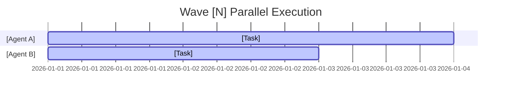

# Phase Plan: [Wave Name]

## Phase
Wave [N] — [Name]
tasks.md waves: [start]–[end]

## Objective
[One paragraph describing what this wave achieves]

## Prerequisites
- [ ] Wave [N-1] checkpoint passed
- [ ] Required contracts frozen: [list]
- [ ] Dependencies complete: [task IDs]

## Agent Assignments

| Agent ID | Role | Tasks | Owned Files | Dependencies |
|---|---|---|---|---|
| Agent-[X] | [Domain] | [task IDs] | [file paths] | [task IDs or "none"] |

## Parallel Work

## Frozen Contracts for This Phase
- [Contract 1]: version [X], frozen by [agent/decision]
- [Contract 2]: version [X], frozen by [agent/decision]

## Integration Points
- After [Agent A] completes [task], [Agent B] can begin [task]
- [Agent C] output feeds into [Agent D] via [interface]

## Quality Gate
See Skill 15, Wave [N] completion gate.

## Risks
- [Risk 1]: likelihood [L/M/H], mitigation [action]
- [Risk 2]: likelihood [L/M/H], mitigation [action]

## Decision Record
| Decision | Rationale | Decided By | Date |
|---|---|---|---|
