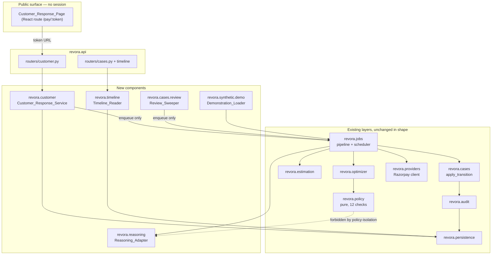

# Design Document: Revora — Customer Response Loop

Additive to `.kiro/specs/revora-incremental-revenue-recovery/design.md`, which is implemented at Alembic head `0007`. That document's Architecture, Module Map, Type Discipline, Response Classification, Execution Flow, Audit Architecture and Correctness Properties sections are unchanged and are referenced rather than restated. Requirement references use `R20.C4` for this spec's Requirement 20 criterion 4, and `R8.C2` for the base spec.

Evidence tags carry the base spec's meaning: **[FACT]** verifiable, **[ASSUMPTION]** a working premise, **[INFERENCE]** derived, **[EVIDENCE INSUFFICIENT]** unknown at design time.

---

## Overview

Five new components, one new transition edge, one new periodic sweep, one migration. Nothing existing is replaced.

| New component | Package | Owns | Writes |
| --- | --- | --- | --- |
| Customer_Response_Service | `revora.customer` | Token mint/verify, page projection, signal writes | `customer_access_token`, `customer_signal`, `contact_suppression`, `promise_to_pay` |
| Timeline_Reader | `revora.timeline` | Stage projection of one case | nothing |
| Reasoning_Adapter | `revora.reasoning` | Three bounded Gemini calls | nothing (`jobs` persists `ai_invocation`) |
| Review_Sweeper | `revora.cases.review` | Finding cases due for re-decision | nothing (enqueues via `jobs.queue`) |
| Demonstration_Loader | `revora.synthetic.demo` | Demo_Batch seeding, Demonstration_Experiment | via the normal ingestion path |



Two structural facts the diagram is drawn to make visible:

- **The Customer_Response_Service and the Review_Sweeper only enqueue.** Neither transitions a case, evaluates policy, or calls a provider (R19.C9, R30.C8). Every consequence of a customer submission is applied by the worker through `apply_transition`, which is still the only writer of `recovery_case.state`.
- **Nothing reaches the Reasoning_Adapter except `revora.jobs`.** All three call kinds are invoked from `revora/jobs/pipeline.py` and the validated result is passed into the pure component as an argument. See *Reasoning_Adapter → Where invocation lives* for why the invocation does not live in `diagnosis`, `optimizer` or `execution`.

### What changes in the decision loop

```
before:  DETECTED → DIAGNOSED → DECISION_PENDING → POLICY_CHECK → (null action) → ⊥ wait for EXPIRED
after:   DETECTED → DIAGNOSED → DECISION_PENDING → POLICY_CHECK ──REVIEW──┐
                                        ▲                                 │
                                        └─────────────────────────────────┘
                                   triggers: SCHEDULED_REVIEW | EVENT_ATTACHED | CUSTOMER_SIGNAL
```

---

## Architecture

### Provider Verification — Two Facts That Shape This Design

#### Fact 1: the resend endpoint exists — CONFIRMED

`POST /v1/payment_links/:id/notify_by/:medium`, `medium ∈ {sms, email}` ([Razorpay, Send or Resend Notifications](https://razorpay.com/docs/api/payments/payment-links/resend/)). **[FACT]**

Consequences: R24.C10 is buildable; no second link is created; `PROMISE_FOLLOW_UP_FINANCIAL_COST = 0` is correct rather than assumed; verification items 1 and 12 of the requirements document are closed. R24.C16 survives only as a withdrawal-degradation path — if the capability is withdrawn or the account loses it, `PROMISE_TO_PAY_FOLLOW_UP` returns to `UNAVAILABLE` with `PROVIDER_CAPABILITY_UNVERIFIED` and stays in the recorded candidate set.

#### Fact 2: a resend is not re-readable — this is the load-bearing one

The resend response carries **only a success boolean. No notification identifier, and no endpoint that reports whether a notification was sent.** **[FACT]**

`PAYMENT_LINK` is exactly-once because the create returns a `plink_…` id and the object is re-readable by `reference_id`, which is what `revora/execution/reconcile.py` uses to establish, after a crash, whether the effect exists. **A resend is re-readable by nothing.** An `UNCERTAIN` resend intent is therefore *permanently unresolvable by provider read* — not slow to resolve, not resolvable with more attempts. There is no observation that answers the question.

**Terminal disposition, decided:** a resend intent that lands `UNCERTAIN` is never retried and never reconciled. In the same transaction that records the classification, the case escalates with `TerminalReason.EXECUTION_RESULT_UNVERIFIABLE` and no further external call is issued for it, exactly as R9.C17 already does for an exhausted reconciliation — the difference is that the bound is zero attempts instead of six, because the attempts would be reads that cannot answer.

**The cost:** one promise follow-up may be lost. A customer who said they would pay on Friday does not get the Friday nudge, and a merchant gets an escalated case instead of a recovery.

**Why that is right:** the alternative is retrying a send whose delivery is unknown. That is an SMS to a real person about money they may already have paid, and the base spec already made this trade in the same direction for the same reason (`EXECUTION_RESULT_UNVERIFIABLE`: *"an escalation a human can pick up is worse for the metrics and better for the customer"*). A lost nudge is recoverable by a person reading the escalation. A second message is not recoverable at all. **[INFERENCE]**

#### Structurally preventing a reconciliation read for a resend

`execution_intent` gains `effect_kind TEXT NOT NULL DEFAULT 'PAYMENT_LINK_CREATE'` with `CHECK (effect_kind IN ('PAYMENT_LINK_CREATE','PAYMENT_LINK_RESEND'))`, and the existing partial index the sweeper scans is rebuilt with the kind in its predicate:

```sql
DROP INDEX ix_execution_intent_unresolved;
CREATE INDEX ix_execution_intent_unresolved
  ON execution_intent (state, attempt_started_at)
  WHERE state IN ('ATTEMPTED','UNCERTAIN')
    AND effect_kind = 'PAYMENT_LINK_CREATE';
```

Chosen over a branch in `_reconcile_one` and over a separate table.

- A branch is a line someone deletes. **The index is the mechanism**: `reconcile_intents` and `promote_stale_intents` both read their candidates through this predicate, so a resend row is not skipped — it is not in the set being scanned. A future reader who removes the `effect_kind` filter from the query gets a sequential scan and a failing performance assertion before they get a duplicate SMS.
- A separate table would duplicate the `UNIQUE (merchant_id, idempotency_key)` constraint that *is* Property 3, and two copies of the exactly-once constraint is how exactly-once becomes a coincidence.

The same predicate fixes a second problem for free. `unresolved_intent_count` is the alarm on stranded intents; a permanently-`UNCERTAIN` resend would make it ring forever with nothing to act on. Filtered on `effect_kind`, the alarm counts only intents that *can* be resolved, and the unresolvable ones are counted where a human is already looking — the `ESCALATED` grouping of R14.C10.

#### Resend response classification — distinct from the create

The create table in the base spec's Response Classification section stands unchanged. This is the resend's own table.

| Provider outcome | `ProviderResult` | Intent state | Disposition |
| --- | --- | --- | --- |
| 200, body validates as `{"success": true}` | `Success` | `CONFIRMED`, `resolved_at` set | Message delivered to the provider's queue |
| 200, `success` absent/false, or body unparseable | `Unclassifiable` | `UNCERTAIN` | **Terminal-unresolvable** → `ESCALATED` / `EXECUTION_RESULT_UNVERIFIABLE` |
| 4xx with a parseable provider error object | `ClientError(PROVIDER)` | `FAILED` | Nothing delivered |
| **429** | `ClientError(code="RATE_LIMITED", http_status=429)` | `FAILED` | Nothing delivered — see below |
| 5xx | `ServerError` | `UNCERTAIN` | **Terminal-unresolvable** |
| Read timeout / reset after send (`AFTER_SEND`) | `Timeout` | `UNCERTAIN` | **Terminal-unresolvable** |
| Connect-phase failure (`CONNECT`, `NOT_SENT`) | `Timeout` | `FAILED` | Nothing left the process |

**What is persisted in place of a provider id.** There is none, so `provider_response_id` is set to the Revora-composed token `"<plink_id>#notify_by:<medium>"`, and the `EXECUTION_STARTED` audit record carries `provider_identifier_absent: true`. The composed form is deliberately not a valid Razorpay id shape, so nothing can later feed it to a fetch endpoint believing it is one. `provider_short_url` stays the link's existing `short_url`, unchanged by the resend.

**429 is classified `FAILED`, and this is the one place the resend departs from the generic `classify_response` rule.** The generic rule sends an unparseable 4xx to `Unclassifiable` because *"a 4xx whose body is an HTML page from an intermediary tells us nothing about whether the provider ever saw the request"*. A 429 is different in kind: it is the provider's own gateway stating that it declined to act. A rejection delivered nothing. The classification therefore does not depend on the 429 body shape, which is **[EVIDENCE INSUFFICIENT]** — and not depending on it is the point.

**Does a 429 consume a customer-message increment? Yes.** The counter moves at the single `ACTION_SCHEDULED → EXECUTING` edge, before the provider request, and this design does not move it. Two reasons:

1. The counter bounds how many times Revora *tries* to reach a person. A design in which a rejected attempt is free is a design in which a loop against a rate limit burns no budget and can run until the window closes.
2. Moving it would put a second counter placement in the system for one action, and the base spec's own note on this edge (*"given the choice, the design under-attempts"*) is the position being preserved.

This is a **recorded deviation from R24.C12**, which asks for the increment on `CONFIRMED`. The base spec's pessimistic placement is the stronger rule and it wins. The cost is that a 429 can spend a promise follow-up.

**`COOLDOWN_INTERVAL` must be the binding constraint.** Razorpay documents a per-link, per-medium resend rate limit whose magnitude is undocumented **[EVIDENCE INSUFFICIENT]**. With `COOLDOWN_INTERVAL` at 24 hours and `MAX_CUSTOMER_MESSAGES` at 2, Revora cannot issue two resends against one link inside a day, so Revora's own bound is reached long before any plausible provider limit. That ordering is what keeps the provider's limit from ever being the thing that stops a message — and it is an ordering that only holds while the cooldown is the larger number, which is why the magnitude stays an open verification item rather than being assumed away.

#### `reminder_enable: false` is now more load-bearing, not less

Before this feature, provider-sent reminders were uncounted messages Revora never asked for. Now Revora *deliberately* triggers provider-delivered messages under its own accounting. Both travel the same channel, both look identical to the customer, and only one is counted. Enabling reminders would put uncounted provider messages alongside counted Revora ones on the same link — Property 9 would still pass while a customer received messages nothing authorized, and no test in the codebase would fail. The setting stays `false`; `revora/providers/payment_link.py` already explains why, and this paragraph is the reason that explanation now matters more.

#### Reasoning provider — verified

Gemini reachable at `https://generativelanguage.googleapis.com/v1beta` with `REVORA_LLM_CREDENTIAL`; `GET /v1beta/models` returns HTTP 200; `gemini-2.5-flash` and `gemini-2.5-pro` both listed. **[FACT]** `REASONING_MODEL_IDENTIFIER` defaults to `gemini-2.5-flash`.

---

### The Transition Table Change

`revora/domain/transitions.py` gains one enum member and one declaration tuple. The table is still *derived* from the declarations, which is why the existing property test keeps working.

```python
class TransitionKind(StrEnum):
    FORWARD = "FORWARD"
    REENTRY = "REENTRY"
    REVIEW = "REVIEW"           # new
    TERMINATION = "TERMINATION"
    RECONCILIATION = "RECONCILIATION"

_REVIEW: tuple[tuple[CaseState, CaseState, CounterEffects], ...] = (
    (CaseState.POLICY_CHECK, CaseState.DECISION_PENDING,
     CounterEffects(decision_cycle_delta=1)),
)
```

`_build_table` gains one loop over `_REVIEW` with `kind=TransitionKind.REVIEW`. The edge sets **only** `decision_cycle_delta=1`: `executed_action_delta`, `customer_message_delta_if_visible` and `sets_last_outbound_at` are left at their defaults, so a review moves no outbound counter and does not reset the cooldown clock (R30.C1).

`REVIEW` is a distinct kind rather than a second `REENTRY` because the two edges answer different questions. `WAITING_FOR_OUTCOME → DECISION_PENDING` is *"we acted and now we are deciding again"*. `POLICY_CHECK → DECISION_PENDING` is *"we chose not to act and now we are looking again"*. The audit trail and the dashboard need to tell those apart, and a shared kind would make *"how often does restraint get revisited"* unanswerable — which is the question this requirement exists to make askable.

#### Termination still closes, with two cycles instead of one

The module docstring's claim (*"The only cycle in the graph is `WAITING_FOR_OUTCOME → DECISION_PENDING`"*) becomes false and must be rewritten. The proof it supported does not weaken, because it never depended on there being one cycle. It depends on this:

> Every cycle in the transition graph contains an edge whose target is `DECISION_PENDING`.

There are now three such edges — `DIAGNOSED →`, `WAITING_FOR_OUTCOME →`, `POLICY_CHECK →` — and **all three carry `decision_cycle_delta = 1`**. `apply_locked_transition` only ever adds deltas, and `CounterEffects.__post_init__` refuses a negative one, so `decision_cycle_count` is monotonically non-decreasing. R30.C10 refuses a review when the counter has reached `MAX_RECOVERY_ATTEMPTS` and terminates the case instead. Therefore:

| Step | Why |
| --- | --- |
| Any path of unbounded length must traverse a cycle | The graph is finite |
| Any cycle increments `decision_cycle_count` at least once | Every cycle passes through an edge into `DECISION_PENDING`; all three carry `delta = 1` |
| The counter never decreases | `apply_locked_transition` only adds; the `CounterEffects` constructor refuses negatives; `counters_nonnegative` and `counters_within_bounds` back it in the schema |
| Entry to `DECISION_PENDING` is refused at the cap, and the case terminates | R30.C10, and the existing `MAX_ATTEMPTS_REACHED` policy check |

So the number of cycle traversals per case is at most `MAX_RECOVERY_ATTEMPTS`, path length is bounded, and every case terminates. **The `window_end_at` column is untouched by the new edge** — no code path in this feature writes it (R30.C2) — so the base spec's P6 bound (`RECOVERY_WINDOW_DURATION + OUTCOME_WAIT_TIMEOUT + LIFECYCLE_EVALUATION_INTERVAL`) is preserved verbatim and P63 is P6 restated under the review loop.

#### The existing property test still holds

`tests/properties/test_lifecycle_machine.py` reads `LEGAL_TRANSITIONS` from the declaration and asserts that `apply_transition` accepts exactly the edges in it and rejects everything else. Because the table is derived rather than hand-listed, the new edge appears in both the test's expectation and the implementation from one source, and the test passes unchanged. Two additions to it:

- A generated interleaving of review triggers must never produce a `decision_cycle_count` above `MAX_RECOVERY_ATTEMPTS` (P64).
- The graph-level assertion is strengthened from *"exactly one cycle"* to *"every cycle contains an edge with `decision_cycle_delta ≥ 1`"*, computed from `LEGAL_TRANSITIONS` by cycle enumeration. That is the property the proof actually rests on, and it is the one that would catch a future edge added without a counter effect.

---

## Data Models

### Migration `0008` — Customer Response Loop

`revision = "0008"`, `down_revision = "0007"`. Every money column is `BIGINT` (the existing `MONEY` alias). Enumerations are `TEXT` with a `CHECK` generated from the Python enum via `enum_check`, per the base spec's Type Discipline. Row-level security is enabled and a `tenant_isolation` policy created on each new table, and `revora_app` granted — migration `0003` derives its table list from the metadata as it stood then, so a table added later gets no policy from it.

#### `customer_access_token`

| Column | Type | Notes |
| --- | --- | --- |
| `id` | `UUID` PK, `gen_random_uuid()` | |
| `merchant_id` | `UUID NOT NULL` | FK `merchant.id` `ON DELETE RESTRICT` |
| `case_id` | `UUID NOT NULL` | FK `recovery_case.id` `ON DELETE RESTRICT` |
| `token_id` | `TEXT NOT NULL` | 26-char base32 of 16 random bytes; the public handle |
| `secret_hash` | `BYTEA NOT NULL` | `HMAC-SHA256(signing_key, token_id ‖ secret)`. No reversible copy anywhere (R18.C3) |
| `key_version` | `TEXT NOT NULL` | Which signing secret minted it. Observability only — verification tries every active secret (R29.C14) |
| `issued_at`, `expires_at` | `TIMESTAMPTZ NOT NULL` | |
| `accepted_submission_count` | `SMALLINT NOT NULL DEFAULT 0` | |
| `revoked_at` | `TIMESTAMPTZ` | |
| `revocation_reason` | `TEXT` | `CASE_TERMINAL`, `CONTACT_SUPPRESSED`, `EXPIRED_SUPERSEDED`, `KEY_RETIRED` |
| `approved_action` | `TEXT NOT NULL` | The candidate action whose execution the token accompanies (R18.C12) |

| Constraint | Guarantee |
| --- | --- |
| `UNIQUE (merchant_id, token_id)` | One row per handle; the lookup key |
| `UNIQUE (merchant_id, case_id) WHERE revoked_at IS NULL` (partial) | **At most one live token per case (R18.C14).** Minting an expired predecessor's replacement first marks it `revoked_at = now(), reason = EXPIRED_SUPERSEDED` in the same transaction — expiry cannot be in an index predicate because it needs `now()`, and requiring the revoke makes the supersession auditable rather than implicit |
| `CHECK (expires_at > issued_at)` | |
| `CHECK (accepted_submission_count >= 0)` | |
| `CHECK ((revoked_at IS NULL) = (revocation_reason IS NULL))` | A revoked token names its reason |
| `CHECK (octet_length(secret_hash) = 32)` | The hash is a hash |
| `INDEX (merchant_id, case_id)` | Dashboard read and bulk revoke on terminal transition |

`CUSTOMER_TOKEN_MAX_SUBMISSIONS` is **not** a check constraint. It is a configurable bound, and encoding today's value of 5 in the schema would make raising it a migration. Enforced under the row lock in the same transaction as the signal insert (R19.C5).

#### `customer_signal`

| Column | Type | Notes |
| --- | --- | --- |
| `id` | `UUID` PK | |
| `merchant_id`, `case_id` | `UUID NOT NULL` | FKs `ON DELETE RESTRICT` |
| `token_id` | `TEXT NOT NULL` | The actor. Never the secret |
| `kind` | `TEXT NOT NULL` | `CHECK IN (PAGE_VIEWED, DELAY_REASON, PROMISE_TO_PAY, PARTIAL_ARRANGEMENT_REQUEST)` |
| `delay_reason` | `TEXT` | `CHECK IN (SALARY_OR_CASHFLOW_TIMING, BANK_OR_CARD_PROBLEM, AMOUNT_TOO_HIGH_RIGHT_NOW, DISPUTES_THE_CHARGE, NO_LONGER_WANTS_THE_ORDER, OTHER)` |
| `delay_reason_note` | `TEXT` | Inert text |
| `note_truncated` | `BOOLEAN NOT NULL DEFAULT false` | R20.C2 |
| `note_redacted_at` | `TIMESTAMPTZ` | Set by the retention sweep |
| `retention_config_version` | `TEXT` | The version applied (R29.C10) |
| `provenance` | `TEXT NOT NULL` | `CHECK IN (REAL, SYNTHETIC)` |
| `submitted_at` | `TIMESTAMPTZ NOT NULL` | UTC |
| `correlation_id` | `UUID` | |

| Constraint | Guarantee |
| --- | --- |
| `CHECK (char_length(delay_reason_note) <= 500)` | `DELAY_NOTE_MAX_LENGTH` as a backstop. Encoded because the truncation is lossy anyway, so a raised bound only affects future rows |
| `CHECK (kind <> 'DELAY_REASON' OR delay_reason IS NOT NULL)` | A delay-reason signal carries one |
| `CHECK (kind <> 'PROMISE_TO_PAY' OR delay_reason IS NULL)` | Kinds do not overlap |
| `CHECK (note_redacted_at IS NULL OR delay_reason_note IS NULL)` | A redacted note is gone, not merely marked |
| `INDEX (merchant_id, case_id, submitted_at)` | Per-case read, and the `MAX_SIGNALS_PER_CASE` count |
| `INDEX (merchant_id, submitted_at) WHERE delay_reason_note IS NOT NULL` (partial) | The retention sweep's scan (R29.C10) — partial, because most rows have no note and indexing them would make the sweep read them |

**There is no `amount` column, no `instalment_count` column and no `schedule` column.** R22.C1 is enforced by their absence: there is nowhere for a partial amount to be stored, so no code path can accidentally accept one. This is deliberate over a check constraint.

#### `contact_suppression`

| Column | Type | Notes |
| --- | --- | --- |
| `id` | `UUID` PK | |
| `merchant_id` | `UUID NOT NULL` | FK `ON DELETE RESTRICT` |
| `scope_key` | `TEXT NOT NULL` | `sha256(customer_key ‖ order_id or case_id)`; see below |
| `origin_case_id` | `UUID NOT NULL` | FK `recovery_case.id` |
| `customer_signal_id` | `UUID NOT NULL` | FK `customer_signal.id` |
| `hard_stop_reason` | `TEXT NOT NULL` | `CHECK IN (DISPUTES_THE_CHARGE, NO_LONGER_WANTS_THE_ORDER)` |
| `suppressed_at` | `TIMESTAMPTZ NOT NULL` | |
| `released_at` | `TIMESTAMPTZ` | |
| `released_by_user_id` | `UUID` | FK `merchant_user.id` |
| `release_config_version` | `TEXT` | |

| Constraint | Guarantee |
| --- | --- |
| `UNIQUE (merchant_id, scope_key)` | One suppression per scope; a second hard stop on the same scope is idempotent |
| `CHECK ((released_at IS NULL) = (released_by_user_id IS NULL))` | **R21.C2:** a release always names a person, on the same terms `model_promotion.approving_user_id` does |
| `CHECK (released_at IS NULL OR released_at >= suppressed_at)` | |
| `INDEX (merchant_id, scope_key) WHERE released_at IS NULL` (partial) | The policy hot-path lookup on check 5 |

**No `expires_at` column exists.** R21.C2's "no expiry instant" is enforced by absence, not by a nullable column nobody sets.

`scope_key` is a hash rather than a composite of readable parts, so the column can be indexed and compared without holding a second copy of the customer key alongside the order id. The preimage (`customer_key`, `provider_order_id` or `case_id`) is recoverable from the `recovery_case` row the suppression names. Including the order identifier remains an **[ASSUMPTION]** (Suppression_Scope, requirements glossary): it means a dispute on one order does not suppress a different order for the same customer, which is the narrower and more defensible reading, and it is the one that can be widened later without losing data.

#### `promise_to_pay`

| Column | Type | Notes |
| --- | --- | --- |
| `id` | `UUID` PK | |
| `merchant_id`, `case_id` | `UUID NOT NULL` | FKs `ON DELETE RESTRICT` |
| `customer_signal_id` | `UUID NOT NULL` | FK |
| `promise_date` | `TIMESTAMPTZ NOT NULL` | UTC |
| `received_representation` | `TEXT NOT NULL` | The submitted string as received (R23.C1) |
| `status` | `TEXT NOT NULL` | `CHECK IN (RECORDED, FOLLOW_UP_SCHEDULED, KEPT, MISSED, BEYOND_WINDOW_ESCALATED, VOIDED)` |
| `follow_up_at` | `TIMESTAMPTZ` | The clamped Follow_Up_Instant |
| `window_end_at_snapshot` | `TIMESTAMPTZ NOT NULL` | The window end as it stood when the promise was recorded |
| `recorded_at` | `TIMESTAMPTZ NOT NULL` | |
| `kept_at`, `missed_at` | `TIMESTAMPTZ` | |
| `seconds_promise_to_payment` | `BIGINT` | R23.C10; signed — paying early is normal |
| `voided_by_terminal_state` | `TEXT` | R23.C12 |

| Constraint | Guarantee |
| --- | --- |
| `UNIQUE (merchant_id, case_id)` | `MAX_PROMISES_PER_CASE = 1`. **This index encodes today's value of a configurable bound** — a deliberate coupling, recorded here: R23.C7's rejection is checked in application code against the configured value and this is the backstop. Raising the bound requires dropping this index in a later migration |
| `CHECK (follow_up_at IS NULL OR follow_up_at < window_end_at_snapshot)` | **Half of P42 as a database constraint.** A Follow_Up_Instant at or past the window end cannot be stored |
| `CHECK (status <> 'BEYOND_WINDOW_ESCALATED' OR follow_up_at IS NULL)` | An escalated promise scheduled nothing (R23.C5, C6) |
| `CHECK (promise_date > recorded_at)` | Ordering only. `PROMISE_MIN_LEAD_TIME` is configurable and checked in application code |
| `CHECK ((status = 'KEPT') = (kept_at IS NOT NULL))` | |
| `INDEX (merchant_id, follow_up_at) WHERE status IN ('RECORDED','FOLLOW_UP_SCHEDULED')` (partial) | The promise sweep's scan (R23.C13) |

#### `recovery_case.next_review_at`

```sql
ALTER TABLE recovery_case ADD COLUMN next_review_at TIMESTAMPTZ;
ALTER TABLE recovery_case ADD CONSTRAINT ck_recovery_case_review_within_window
  CHECK (next_review_at IS NULL OR next_review_at <= window_end_at);

CREATE INDEX ix_recovery_case_due_for_review
  ON recovery_case (merchant_id, next_review_at)
  WHERE state = 'POLICY_CHECK' AND next_review_at IS NOT NULL;
```

The check constraint is the second clause of **P63** enforced by the database: no persisted review instant can fall outside the recovery window, whatever the code does. The partial index is what the Review_Sweeper scans (*Components and Interfaces → Review_Sweeper*); partial because a case waiting at `POLICY_CHECK` is a small minority of a merchant's rows and a full index would make the sweep read the rest.

#### `execution_intent.effect_kind`

```sql
ALTER TABLE execution_intent
  ADD COLUMN effect_kind TEXT NOT NULL DEFAULT 'PAYMENT_LINK_CREATE';
ALTER TABLE execution_intent ADD CONSTRAINT ck_execution_intent_effect_kind
  CHECK (effect_kind IN ('PAYMENT_LINK_CREATE','PAYMENT_LINK_RESEND'));
DROP INDEX ix_execution_intent_unresolved;
CREATE INDEX ix_execution_intent_unresolved
  ON execution_intent (state, attempt_started_at)
  WHERE state IN ('ATTEMPTED','UNCERTAIN') AND effect_kind = 'PAYMENT_LINK_CREATE';
```

The default backfills every existing row correctly: every intent written before `0008` was a link creation. See *Architecture → Provider Verification* for why this is an index predicate rather than a branch.

#### `ai_invocation.call_kind`

```sql
ALTER TABLE ai_invocation ADD COLUMN call_kind TEXT;
ALTER TABLE ai_invocation ADD CONSTRAINT ck_ai_invocation_call_kind
  CHECK (call_kind IS NULL OR call_kind IN ('CAUSE_HYPOTHESIS','DECISION_EXPLANATION','LINK_DESCRIPTION'));
```

Nullable, because no row exists yet and a row written before the adapter existed genuinely does not know. `prompt_contract_id` already exists and carries the contract version. A separate column rather than encoding the kind into `prompt_contract_id`, because R27.C12 makes both queryable facts and *"how many CAUSE_HYPOTHESIS calls fell back this week"* should be a `WHERE`, not a `LIKE`.

#### The cost split, and the R31.C9 data migration

```sql
ALTER TABLE candidate_estimate
  ADD COLUMN financial_cost     BIGINT NOT NULL DEFAULT 0,
  ADD COLUMN communication_cost BIGINT NOT NULL DEFAULT 0,
  ADD COLUMN financial_cost_method     TEXT,
  ADD COLUMN communication_cost_method TEXT;

UPDATE candidate_estimate
   SET financial_cost = action_cost,
       communication_cost = 0,
       financial_cost_method = 'COST_SPLIT_NOT_MEASURED',
       communication_cost_method = 'COST_SPLIT_NOT_MEASURED';

ALTER TABLE candidate_estimate DROP COLUMN action_cost;
-- plus: nonnegative_money_check on both new columns,
--       enum_check on both method columns over EstimationMethod (now including
--       COST_SPLIT_NOT_MEASURED — the existing ck_candidate_estimate_method_enum
--       is dropped and recreated over the widened enumeration).
```

Identical treatment for `recommendation_candidate.action_cost`.

**The whole value goes into `financial_cost`, `communication_cost` is zero, both methods are `COST_SPLIT_NOT_MEASURED`, and nothing infers a split from the action type** (R31.C9). Inferring one — putting `MESSAGE_COMMUNICATION_COST` into the communication term for every `CUSTOMER_MESSAGE` row, say — would produce a plausible-looking number that no measurement supports, presented in a column whose whole purpose is to say which cost caused an exclusion. The marking is what stops a reader taking a migrated zero for a measured zero (R31.C10).

`action_cost` is dropped rather than left in place, because R31.C1 forbids persisting it on new estimates and a column that exists but must not be written is a column something will write.

#### Downgrade

| Object | Downgrade | Pre-assertion |
| --- | --- | --- |
| Four new tables | `DROP TABLE` after dropping the RLS policy | **Refuses if any `contact_suppression` row has `released_at IS NULL`.** Dropping a live suppression would silently re-permit contact to a customer who disputed a charge — the one irreversible harm in this migration |
| `recovery_case.next_review_at` | `DROP COLUMN` + drop index and check | **Refuses if any case has `state = 'POLICY_CHECK' AND next_review_at IS NOT NULL`.** Nothing else re-decides such a case, so dropping the column strands it until its window elapses, invisibly |
| `execution_intent.effect_kind` | Restore the original index predicate, then `DROP COLUMN` | **Refuses if any row has `effect_kind = 'PAYMENT_LINK_RESEND' AND state = 'UNCERTAIN'`.** Restoring the old predicate would make the reconciliation sweep start issuing reads for effects that cannot be read |
| Cost split | Re-add `action_cost`, set it to `financial_cost + communication_cost`, drop both and both method columns | None. Lossy by nature — the split cannot be recovered — but arithmetically faithful to the pre-split total, so no net value changes |
| `ai_invocation.call_kind` | `DROP COLUMN` | None |

---

## Components and Interfaces

### Review_Sweeper — the Eighth Periodic Sweep

`revora/cases/review.py`, registered in `revora/jobs/scheduler.py` as `CASE_REVIEW_KIND = "case_review"` appended to `PERIODIC_SWEEP_KINDS`, enqueued every `REVIEW_SWEEP_INTERVAL` (default 5 minutes **[ASSUMPTION]**) with the existing bucket dedupe key.

#### The query

```sql
SELECT id, version, decision_cycle_count
  FROM recovery_case
 WHERE merchant_id = :merchant_id
   AND state = 'POLICY_CHECK'
   AND next_review_at IS NOT NULL
   AND next_review_at <= :now
   AND decision_cycle_count < :max_recovery_attempts
 ORDER BY next_review_at
 LIMIT :limit
```

Served by `ix_recovery_case_due_for_review (merchant_id, next_review_at) WHERE state = 'POLICY_CHECK' AND next_review_at IS NOT NULL`. The `decision_cycle_count` filter is not in the predicate because `MAX_RECOVERY_ATTEMPTS` is configurable; it is a cheap filter on an already-narrow index scan.

Cases at the cap are excluded from *this* query and handled by the review handler's own gate (R30.C10), which is where they terminate. Excluding them here and terminating them there rather than the reverse keeps the sweep's job "find work" and the handler's job "decide", matching how `sweep_expired_cases` reads a due set in one transaction and then transitions each in its own.

Structure copies `sweep_expired_cases` exactly: read the due set in one transaction, release, then act on each separately through `apply_transition`. A version conflict is not an error — the case is revisited next pass. `DEFAULT_SWEEP_LIMIT` bounds a backlog into bounded passes.

**Restart independence (R30.C6):** every input is a persisted column. `next_review_at`, `state` and `decision_cycle_count` are all on the row, so a sweep that starts with an empty job queue after a process restart finds exactly the same due set. No in-memory schedule, no queue state consulted.

#### Idempotency for R30.C9 / P65 — the job table's existing partial unique index

Three candidate mechanisms, and the reason for the choice:

| Mechanism | Verdict |
| --- | --- |
| A `review_enqueued_at` column on `recovery_case` | **Rejected.** It is a second copy of queue state. Two records of "is there work pending" drift, and the drift shows up as either a duplicated decision cycle or a case that stops being reviewed |
| A new partial unique index on a new table | **Rejected.** Duplicates a constraint that already exists |
| **The existing `one_pending_job_per_dedupe_key` partial unique index on `job`** | **Chosen** |

All three Review_Triggers enqueue the same job kind with the same dedupe key:

```python
enqueue_next(session, merchant_id, kind=CASE_REVIEW_KIND, case_id=case_id,
             correlation_id=..., extra_payload={"review_trigger": trigger.value})
# dedupe_key = f"case_review:{case_id}"
```

The index is partial on *pending* jobs, so the second enqueue inside one interval returns `None` and no second cycle exists (P65, first clause). Once the job is claimed the key frees, so a later legitimate review can be enqueued (P65 is about concurrent enqueues, not about forbidding all future reviews). And because `case_review` is the only job kind that can enter `DECISION_PENDING` from `POLICY_CHECK`, "already holds an unapplied enqueued decision cycle" and "already has a pending `case_review` job" are the same condition — which is what makes R30.C9's "irrespective of the Review_Trigger" hold for all three triggers with one mechanism.

#### The three triggers

| Trigger | Where | Atomicity |
| --- | --- | --- |
| `SCHEDULED_REVIEW` | `revora.cases.review.sweep_due_reviews` | Enqueue per case, own transaction |
| `EVENT_ATTACHED` | `revora/detection/service.py::_open_or_attach`, the existing else-branch | Same transaction as the attach and the `EVENT_ATTACHED_TO_CASE` audit record (R30.C7). The branch currently writes the record and returns; it gains an `enqueue_next` when the open case's state is `POLICY_CHECK`. `payment_amount` and `detected_at` stay untouched |
| `CUSTOMER_SIGNAL` | `revora.customer`, after the signal commits | Enqueued inside the accepting request's transaction, applied by the worker. No transition, no policy evaluation inside the request (R30.C8) |

#### `handle_review` — the job handler

New handler in `revora/jobs/pipeline.py`. It is deliberately assembled from the existing steps rather than reimplementing them:

```
1. lock the case; re-check state == POLICY_CHECK
2. if decision_cycle_count >= MAX_RECOVERY_ATTEMPTS:
       apply_transition(→ STOPPED, DECISION_CYCLE_LIMIT_REACHED),
       clear next_review_at, write CASE_REVIEWED, on_success=observation_writer, return
3. run_diagnosis for cycle = decision_cycle_count + 1
       (picks up a Risk_Cause refined by a Delay_Reason under R20.C4, otherwise carries
        the recorded cause forward)
4. run_baseline_estimation + run_candidate_estimation for that cycle
5. run_optimizer  → recommendation written BEFORE the transition, same reason as
                    handle_optimizer: the recommendation belongs to the cycle that produced it
6. apply_transition(POLICY_CHECK → DECISION_PENDING, kind REVIEW),
       clearing next_review_at in the same transaction (R30.C4),
       on_success = enqueue(POLICY_JOB_KIND)
7. write CASE_REVIEWED carrying trigger, previous and new selected action,
       the post-review cycle counter, and the new next_review_at where one exists (R30.C11)
```

Step 7 writes the record **whether or not the selection changed**. A review that re-selected `WAIT` is the interesting case, not the boring one: it is the evidence that restraint was re-examined rather than forgotten.

`next_review_at` is set by the null-action branch of `handle_policy` (R30.C3), which currently only logs. It becomes: persist `next_review_at = min(now + WAIT_REVIEW_INTERVAL, window_end_at)` and log. `apply_locked_transition` clears the column on **every** edge out of `POLICY_CHECK` (R30.C4) — implemented in the one writer rather than at each call site, so a future edge cannot forget.

---

### Customer_Response_Service and the Public Surface

`revora/customer/` — `tokens.py` (mint, verify, rotate), `projection.py` (the read model), `signals.py` (the three writes), `suppression.py`, `promises.py`. Mounted at `revora/api/routers/customer.py`. Placed in the layering band alongside `revora.detection | revora.ingestion`: it needs `cases`, `audit`, `persistence`, `platform`, `domain` and nothing above.

#### Token structure

```
wire form:   rvc_<token_id>.<secret>
             token_id = base32(16 random bytes), 26 chars, unpadded, lowercase
             secret   = base64url(16 random bytes), 22 chars, unpadded   → 128 bits
full URL:    https://<frontend-host>/pay/rvc_<token_id>.<secret>
```

- **Entropy source:** `secrets.token_bytes(16)` for each part — the standard library's CSPRNG. 128 bits meets `CUSTOMER_TOKEN_ENTROPY_BITS`. The `token_id` is separately random rather than derived, so the lookup handle leaks nothing about the secret.
- **Stored:** `HMAC-SHA256(signing_key, token_id ‖ secret)` in `secret_hash`. A keyed hash rather than a plain digest, so a database dump alone does not permit offline verification. No reversible copy of the secret exists anywhere (R18.C3).
- **Verification (R18.C4, R29.C6, R29.C14):**

```python
row = repo.by_token_id(token_id)          # one indexed lookup
matched = False
for version, key in active_signing_secrets():          # every active secret
    matched |= hmac.compare_digest(hmac_sha256(key, token_id + secret), row.secret_hash)
if row is None or not matched:
    return reject_404()                    # identical body and status for both
```

The loop does not break early and accumulates with `|=`, so the time taken is independent of which secret matched and of whether any did. A missing row and a bad signature return **identical** status and body (R29.C6) — the row lookup result is folded into one branch rather than answered separately.

- **Rotation (R29.C14):** minting always uses the newest active secret. Verification tries every active one, so a token minted before a rotation keeps working until it expires. A token whose `key_version` has been retired matches no active secret and therefore falls into the same 404 path — which is *stronger* than the requirement's 410 for a retired key, and is chosen for that reason: distinguishing "signed by a retired key" from "not a real token" would tell an attacker that their guess had the right shape. `CUSTOMER_TOKEN_KEY_RETIRED` is recorded in the audit record; the caller sees 404.
- **Signing secret resolution (R29.C13):** through the existing `revora.platform.secrets` store, whose contract already refuses to invent a missing credential. Absent secret ⇒ no mint, no verify, `CREDENTIAL_UNAVAILABLE` audit record, HTTP 503.
- **Masking (R18.C11):** `FieldKind.CUSTOMER_ACCESS_TOKEN` is added to `FieldKind` and to `SENSITIVE_FIELD_KINDS`, so the existing masking serializer covers it on the same terms as `PROVIDER_SHORT_URL` — both are bearer capabilities. Every log line and audit field carries `token_id` only.
- **Minting order (R18.C1):** the mint happens inside `execute_approved_action`'s first transaction, alongside the intent insert and before the provider call, because the token URL is what the message carries. A failed mint rolls that transaction back, so no intent exists, no counter moved and no call went out — which is R18.C13 satisfied by the transaction boundary rather than by a compensating action.

#### The read projection

`GET /customer/case` with `Authorization: Bearer rvc_…`. The path carries no identifier at all — there is nothing in it to ignore, which is a cheaper way to satisfy R18.C4's "discard any identifier in the request" than discarding one.

```json
{
  "merchant_display_name": "Acme Traders",
  "amount":        { "status": "PRESENT", "minor": 249900, "formatted": "₹2,499.00" },
  "currency":      "INR",
  "reason":        "The payment did not go through because there were not enough funds available.",
  "pay_url":       "https://rzp.io/i/xxxxxxx",
  "window_end_at": "2025-03-14T09:12:00Z",
  "promise":       { "promise_date": "2025-03-12T00:00:00Z", "status": "RECORDED" },
  "signals_remaining": 4
}
```

`amount` is the existing `Money` envelope from the dashboard API, formatted **on the server** from the stored integer (R19.C3). `reason` is a plain-language rendering of the recorded `Risk_Cause` from a fixed template table — never the provider's error string, which is internal vocabulary and sometimes names our own integration.

Absent from the projection, and this list is the requirement (R19.C2, R29.C3): any customer contact identifier in any form, masked or not; any payment instrument reference; `baseline_recovery_probability`; `intervention_recovery_probability`; `incremental_probability`; `expected_incremental_revenue`; `financial_cost`; `communication_cost`; `risk_cost`; `customer_cost`; `total_action_cost`; `net_recovery_value`; any rejected candidate; any `Policy_Decision`; any configuration value; any `Merchant_User` identifier; any field of a second case. The projection is a purpose-built dataclass with exactly the nine fields above — not a filtered view of the dashboard model — so adding a field to the dashboard cannot leak it here.

#### The three write shapes

| Shape | Body | Accepted when |
| --- | --- | --- |
| `POST /customer/delay-reason` | `{ "delay_reason": <enum>, "note": <string?> }` | Case non-terminal, submission and signal caps not reached |
| `POST /customer/promise` | `{ "promise_date": <ISO-8601 instant> }` | Above, plus no existing promise, plus lead time met |
| `POST /customer/partial-arrangement` | `{ "note": <string?> }` | Above |

Pydantic models with `extra="forbid"`, so any field outside the declared schema is a 422 (R19.C4). The partial-arrangement model declares no `amount`, `instalment_count` or `schedule`, so R22.C1's rejection is the schema's default behaviour rather than a hand-written check.

Each accepted write is one transaction containing: the `customer_signal` insert, the `accepted_submission_count` increment under the token row lock, the audit record, and the enqueued follow-on job. All four or none (R19.C5, R29.C12) — so an audit write that misses `AUDIT_WRITE_TIMEOUT` leaves no signal, no increment and no queued consequence, and the caller gets 503.

#### Rejection status codes

| Condition | Status | Audit event | Body |
| --- | --- | --- | --- |
| Signature fails, or no such `token_id` | 404 | `CUSTOMER_TOKEN_REJECTED` | Empty. Identical for both (R29.C6) |
| Token names a different case id | 404 | `AUTHORIZATION_DENIED` | Empty (R18.C5) |
| Verified but expired | 410 | `CUSTOMER_TOKEN_EXPIRED` | `{"expired": true}` and nothing else (R18.C7) |
| Verified but revoked | 410 | — (revocation already recorded) | `{"expired": true}` (R18.C8) |
| Signing secret unreadable | 503 | `CREDENTIAL_UNAVAILABLE` | Empty (R29.C13) |
| Field outside the declared schema | 422 | `CUSTOMER_SIGNAL_REJECTED` | Field name only |
| Delay reason outside the enumeration | 422 | `CUSTOMER_SIGNAL_REJECTED` | Field name only (R20.C1) |
| Promise date inside `PROMISE_MIN_LEAD_TIME` | 422 | `PROMISE_REJECTED` | Names the lead-time rule (R23.C2) |
| Second promise on the case | 409 | `PROMISE_ALREADY_RECORDED` | Signal still recorded (R23.C7) |
| Case already terminal | 409 | `CUSTOMER_SIGNAL_REJECTED` | Names the terminal state (R19.C8) |
| Submission cap reached on the token | 429 | `CUSTOMER_SUBMISSION_LIMIT_REACHED` | Reads still served (R18.C9) |
| Signal cap reached on the case | 429 | `CUSTOMER_SIGNAL_LIMIT_REACHED` | (R19.C7) |
| Rate limit exceeded (either kind) | 429 | `RATE_LIMIT_APPLIED` | Names which rate (R29.C1) |
| Case read exceeds `PERSISTENCE_TIMEOUT` | 503 | — | No partial projection (R19.C12) |
| Audit write exceeds `AUDIT_WRITE_TIMEOUT` | 503 | `AUDIT_WRITE_FAILED` | Nothing persisted (R29.C12) |

410 for expiry discloses that a token once existed. Accepted, per R18.C7: `CUSTOMER_TOKEN_ENTROPY_BITS` makes enumeration infeasible, and a customer holding a dead link needs to be told it is dead rather than shown a 404 that reads as "wrong URL". Whether that disclosure is acceptable under applicable obligations stays **[EVIDENCE INSUFFICIENT]**.

#### Rate limiting

`revora/ingestion/service.py` already contains `_RateLimiter`: a process-local, fixed-window, per-key counter. It is promoted to `revora/platform/ratelimit.py` unchanged and used with two key spaces — `token:{token_id}` at `CUSTOMER_PAGE_RATE_LIMIT` and `src:{source}` at `CUSTOMER_PAGE_SOURCE_RATE_LIMIT`.

Promoted rather than reimplemented, and **its weakness is stated rather than designed around**: the counter is per process, so two replicas admit twice the configured rate, and the window resets rather than sliding, so a boundary admits up to twice the limit again. That is acceptable here only because the rate limit is not the bound that matters. **The durable bound is `accepted_submission_count` on the token row**, incremented under a row lock in the same transaction as the signal, which no number of replicas or window boundaries can exceed. The rate limit is a coarse flood guard on the read path; the submission cap is the correctness bound on the write path, and P32 tests the second, not the first.

A shared limiter (a Postgres counter table, or Redis) was rejected: it adds a write to every page read to tighten a guard whose failure mode is "somebody refreshed a page too fast", while the thing that actually bounds abuse is already durable.

#### CORS and permitted origins under the split-host deployment

The base spec's ADR-9 keeps the dashboard same-origin with the API precisely so that no CORS middleware is installed. The recorded deployment assumption puts the frontend on Vercel and the API on a container host, which means **the customer page's reads and writes are cross-origin**. That is a real regression in the security posture and it is confined rather than accepted globally:

| Setting | Value |
| --- | --- |
| `REVORA_CUSTOMER_ORIGINS` | Explicit list of frontend origins. No wildcard, no regex, no `null` origin |
| `allow_credentials` | `false` — the token travels in an `Authorization` header, not a cookie, so no credentialed cross-origin request is ever needed |
| `allow_methods` | `GET, POST` |
| `allow_headers` | `Authorization, Content-Type` |
| Scope | The middleware is mounted on the `/customer` router only. The dashboard API and the webhook endpoint keep no CORS middleware at all |

Because credentials are never sent, an attacker's page cannot make the browser attach the token — it would have to already hold it, and if it holds the token, CORS is not what is protecting anything. That is why `allow_credentials: false` matters more here than the origin list does. `Content-Type` is required to match the declared schema (R29.C8), which blocks the simple-request form that bypasses preflight.

Whether the permitted origin set is enumerable in practice under Vercel's preview-deployment domains is **[EVIDENCE INSUFFICIENT]**; if preview URLs are needed they are configured explicitly per deployment, never by pattern.

Response headers on every customer response: `Cache-Control: no-store, private`, `Referrer-Policy: no-referrer` (R19.C11, R29.C7), `X-Content-Type-Options: nosniff`, and a CSP with no `connect-src` beyond the API host and no `img-src`, `script-src` or `style-src` beyond `self` — which is what makes "no third-party asset request, no analytics request" enforceable by the browser rather than by discipline.

#### What a full compromise of one token costs

An attacker holding one live token can read one case's amount, currency, merchant display name, plain-language failure reason, payment link URL and window end; and can write at most `CUSTOMER_TOKEN_MAX_SUBMISSIONS` signals to that one case. The most damaging write is `DISPUTES_THE_CHARGE`, which permanently suppresses automated contact within that one Suppression_Scope and escalates that one case to a human — a denial of recovery for one payment, visible immediately in the `ESCALATED` grouping with the submitting `token_id` on the record. The payment link URL is the same bearer capability the customer already received by SMS, so the token adds no payment risk that the message did not. **What the token cannot do:** reach a second case, reach any audit record, recommendation, policy decision, metric, experiment result or configuration value (R18.C10); learn a contact identifier or instrument reference; move any bound; cause any outbound message; or authorize any external effect — every effect still requires an `APPROVED` policy decision, which no customer input can produce (P35). The blast radius is one payment's amount and one recovery opportunity, which is the bound the token was designed to have.

---

### Frontend

Plain React `.jsx` under `web/src/`, matching the existing dashboard — **not** TypeScript.

#### Decision: a second Vite entry, not a route in the dashboard bundle

`web/` gains a second entry point (`web/src/customer/main.jsx` → `web/dist-customer/`) rather than a `/pay/:token` route inside the existing SPA.

| Reason | Detail |
| --- | --- |
| Different trust level | The dashboard bundle contains the authenticated API client, session handling, and every dashboard route. Serving all of it to an unauthenticated stranger holding a payment link ships them the entire administrative surface as readable source. Nothing in it is a secret, but it is a map |
| Different asset policy | The customer page must make **zero** third-party requests and carry a `no-referrer` policy (R19.C11). The dashboard bundle pulls `@tanstack/react-query` and `react-router-dom`; the customer page needs neither — one fetch, one form, no client routing beyond reading the token from the path |
| Bundle size on a cold mobile connection | This page is reached from an SMS by a person who is being asked for money. It should be a few kilobytes, not the dashboard |
| Independent CSP | Two entries mean two `index.html` documents and two CSP headers, so the customer page's stricter policy is not a relaxation of the dashboard's or vice versa |

**The cost:** a second build target, a second deployment artifact, and two places where a shared component could drift. Mitigated by sharing exactly one module — `components/Figure.jsx` — via a relative import, so `<Money>` has one implementation.

**The `basename` trap applies to the new entry too.** `tests/api/test_spa_mount.py` greps `web/src/main.jsx` and asserts `BrowserRouter basename` matches `APP_PREFIX = "/app"`, because a mismatch renders a blank page with a clean console and no error. The customer entry uses **no router at all** — it reads the token from `window.location.pathname` directly — which removes the failure mode rather than adding a second instance of it. The existing test is extended to assert that the customer entry imports no router, so nobody reintroduces one without also reintroducing the basename question.

#### Structure

```
web/src/customer/
  main.jsx        # mounts; reads token from pathname; no router, no query client
  Page.jsx        # the whole page: amount, reason, pay button, reason form, promise form
  api.js          # two functions: fetchCase(token), submit(token, shape, body)
web/index-customer.html
```

Money is rendered **only** through the shared `<Money>` component, from the server's `formatted` string, exactly as on the dashboard. The customer entry has no currency symbol table, no divisor and no `Intl.NumberFormat` call, so it cannot produce a figure that disagrees with the server's — it has no way to compute one. `data-minor` stays on the element for test assertions and is never read for display.

Serving: the API's `mount_spa` is unchanged and keeps `/app`. The customer page is served by the frontend host at `/pay/*`. If the API process ever needs to serve it (single-host deployment), a second mount at `/pay` follows the same pattern; that is not the assumed deployment and is not built now.

Accessibility (R26.C13 applies to the timeline; the same standard is applied here): the forms are native `<form>`, `<fieldset>`, `<legend>`, `<label>` and `<select>` elements with visible focus and a validation summary announced through `aria-live`. Full WCAG 2.1 AA conformance validation requires manual testing with assistive technologies and expert review, which is out of scope for this design.

---

### Case_Timeline Read Model

`revora/timeline/` — `stages.py` (the pure projection), `templates.py` (the sentence templates). Placed in the layering band with `revora.metrics | revora.outcome`, since it reads persisted rows and writes nothing.

#### Stage-completion rules, keyed to concrete event types from `revora/audit/events.py`

| Timeline_Stage | `DONE` when this event type exists for the case | `IN_PROGRESS` when | `SKIPPED` when |
| --- | --- | --- | --- |
| `DETECTED` | `CASE_DETECTED` | — | never |
| `DIAGNOSED` | `DIAGNOSIS_RECORDED` | `DIAGNOSIS_UNMAPPED_REASON` present, no `DIAGNOSIS_RECORDED` yet | — |
| `BASELINE_ESTIMATED` | `BASELINE_ESTIMATE_RECORDED` | — | `BASELINE_ESTIMATION_FAILED` present — reason from that record |
| `ALTERNATIVES_PRICED` | `CANDIDATE_ESTIMATES_RECORDED` | — | `CANDIDATE_MEMORY_UNAVAILABLE` without a subsequent recorded set |
| `DECIDED` | `RECOMMENDATION_RECORDED` | a `case_review` job is pending, or `next_review_at` is set and the cycle counter is below the cap (R30.C14) | — |
| `POLICY_CHECKED` | `POLICY_DECISION_RECORDED` | — | — |
| `EXECUTED` | `STATE_TRANSITION` into `WAITING_FOR_OUTCOME` | `EXECUTION_STARTED` present, no such transition yet | verdict was not `APPROVED`, or the selected action is a Null_Action or `HUMAN_ESCALATION`; also `EXECUTION_ABANDONED_POLICY`, `EXECUTION_REFUSED`, `ACTION_CANCELLED_PAYMENT_RECEIVED`, `ACTION_CANCELLED_CONTACT_SUPPRESSED` |
| `CUSTOMER_RESPONDED` | any `CUSTOMER_SIGNAL_RECORDED` | — | terminal with no signal recorded |
| `OUTCOME_VERIFIED` | `RECOVERY_RECORDED`, `RECONCILED_TO_RECOVERED`, `DELAYED_RECOVERY_RECONCILED`, or a `STATE_TRANSITION` into any Terminal_State | `PAYMENT_STATE_CONFLICT` or `PAYMENT_STATE_READ_UNAVAILABLE` present, not yet terminal | — |

Any stage with no completing record and no skip evidence is `UPCOMING`. **No stage is ever `DONE` without its completing record present** (R26.C2, P57).

`EXECUTED`'s completion keys on the state transition rather than on the intent row deliberately: the transition record exists on both the fast path (`handle_execution`) and the reconciliation path (`_advance_confirmed`), so one rule covers both. R26.C4 additionally requires the *displayed* execution-intent state, which is read from `execution_intent` — that read is a presented field, not a completion rule, which is what keeps the completion rules purely audit-keyed and P57 checkable from the audit sequence alone.

#### Deterministic sentence templates

One template per stage, substituting only persisted values. Illustrative, not exhaustive:

| Stage | Decision sentence | Evidence sentence |
| --- | --- | --- |
| `DIAGNOSED` | `Diagnosed as {cause_label} with confidence {confidence}.` | `From {evidence_source} ({method}).` |
| `BASELINE_ESTIMATED` | `Without acting, this was estimated {p} likely to be paid.` | `Interval {lo}–{hi}.` / `UNCERTAINTY_UNAVAILABLE.` |
| `ALTERNATIVES_PRICED` | `Priced {n} options; {m} were unavailable.` | `Cheapest available option cost {total_action_cost}.` |
| `DECIDED` | `Chose {action_label}, worth {net_recovery_value}. Runner-up {runner_up_label} at {runner_up_value}.` | `Reason: {selection_reason_label}.` |
| `POLICY_CHECKED` | `Policy verdict {verdict}.` | `Primary reason: {primary_reason_label}.` |
| `EXECUTED` | `Sent {action_label} at {instant}.` | `Provider result: {intent_state}.` |
| `CUSTOMER_RESPONDED` | `Customer said: {delay_reason_label}.` | `Submitted {instant}.` |
| `OUTCOME_VERIFIED` | `Recovered {amount}, classified {outcome_class}.` / `Ended: {terminal_reason_label}.` | `Verified by provider read at {instant}.` |

Every `{…}` is a persisted column or a lookup in a fixed label table. There is no branching on a value's magnitude, no pluralization logic that reads a count twice, and no free text. `{cause_label}`, `{action_label}` and `{terminal_reason_label}` come from the presentation table in R26.C14 — `DO_NOTHING` and `WAIT` both render as **"Waiting and watching"** with the stored member name shown alongside; `STOPPED` renders as "Stopped — bound reached", `BLOCKED` as "Blocked by policy", `EXPIRED` as "Window closed". Every label carries the persisted enumeration member next to it, so the presented word and the stored value are both readable.

#### Purity argument for P56

```python
def project(records: Sequence[AuditRecordView],
            case: CaseView,
            signals: Sequence[SignalView],
            intents: Sequence[IntentView],
            figures: FigureView) -> CaseTimeline: ...
```

Four properties make repeated projection identical and make it write nothing:

1. **`project` takes only frozen dataclasses and returns one.** No `Session`, no repository, no clock. It cannot write because it has nothing to write with — the same argument the base spec uses for `policy.evaluate`.
2. **Every timestamp presented is read from a record**, never `now()`. The one time-dependent decision — whether `DECIDED` is `IN_PROGRESS` — reads `case.next_review_at` and `case.decision_cycle_count`, both persisted, and compares them to a `now` passed in explicitly as an argument. A caller supplying the same `now` gets the same timeline.
3. **Stage order is a module-level tuple**, not derived from record order, so record order affects only which records satisfy which rule.
4. **The API layer above it** does the reads inside one `tenant_transaction` and passes the results down, so a concurrent write cannot change the input mid-projection.

`revora/timeline/` imports nothing from `revora.persistence`; the router builds the views. That is what makes the P56 test `pure`-tier rather than `pg`-tier: it generates audit sequences directly and projects them twice.

`TIMELINE_QUERY_TIMEOUT` (3 s **[ASSUMPTION]**) is applied by the router around the reads. On timeout the dashboard shows a data-unavailable marker naming the case, every successfully projected stage is still presented, and no stage is substituted with a status or a zero (R26.C10) — the existing `<AbsentValue>` component already renders exactly that distinction.

An audit sequence gap is detected by comparing `max(seq) - min(seq) + 1` against the record count and, on mismatch, listing the missing numbers. The timeline is still rendered, with a banner naming the missing sequence numbers, and no stage is asserted `DONE` on the strength of an absent record (R26.C11).

---

### Reasoning_Adapter

`revora/reasoning/` — `adapter.py` (transport), `contracts.py` (the three Prompt_Contracts), `schemas.py` (output validation).

#### Client: hand-written `httpx`, and the honest reason

Hand-written, against `POST /v1beta/models/{model}:generateContent` with the credential from the existing secret store.

**Not** for the reason the payment client is hand-written. That argument is about telling "definitely did not happen" from "might have happened", and it does not apply here at all: a reasoning call produces no external effect, so an ambiguous outcome costs one deterministic fallback and nothing else. Claiming the same justification twice would be dressing up a dependency preference as a correctness requirement. The real reasons are smaller and worth less:

1. `httpx` is already a dependency, with `split_timeout` and a masking-aware logger already built around it. `google-genai` adds a transitive tree to a code path that makes one POST with a JSON body.
2. `.importlinter` cannot see inside a third-party package. The whole structural claim of R27.C11 is that the policy component cannot reach the reasoning component; a vendored SDK is surface the contract checker does not analyse.
3. The response must be validated independently of any provider-side enforcement anyway (R27.C15), so the SDK's parsing is work we are not permitted to trust.

**The SDK would be a legitimate choice here**, and if the retry, backoff and streaming surface were needed it would be the better one. It is not needed: one call, one timeout, one JSON body.

#### Response-schema constraint *and* independent validation (R27.C15)

The request sets `generationConfig.responseMimeType = "application/json"` and `generationConfig.responseSchema` to the contract's declared schema. The response is then validated against a Pydantic model in `schemas.py` regardless. Provider-side constraint is an optimization; a component that treats it as a guarantee has no fallback the day it changes. Both, always.

#### The three Prompt_Contracts

| Call kind | Contract version | Transmitted field set (the allow-list) | Output schema |
| --- | --- | --- | --- |
| `CAUSE_HYPOTHESIS` | `cause-hypothesis/1` | `provider_error_code`, `provider_error_reason`, `provider_error_source`, `provider_error_step`, `delay_reason`, `delay_reason_note` (≤ `DELAY_NOTE_MAX_LENGTH`) | `{cause: RiskCause, confidence: 0.0–1.0, evidence_summary: str ≤ 200}` |
| `DECISION_EXPLANATION` | `decision-explanation/1` | `risk_cause`, `baseline_probability`, `selected_action`, `selected_net_recovery_value`, `runner_up_action`, `runner_up_net_recovery_value`, `selection_reason`, `currency` | `{explanation: str ≤ REASONING_EXPLANATION_MAX_LENGTH}` |
| `LINK_DESCRIPTION` | `link-description/1` | `merchant_display_name`, `payment_amount_formatted`, `currency`, `risk_cause` | `{description: str ≤ MAX_MESSAGE_LENGTH}` |

The allow-list is enforced by construction: each contract declares a frozen field-name set, and the adapter builds the payload by iterating that set. A field not in it has no path onto the wire, and a request holding one blocks transmission and takes the fallback (R27.C2). No contract declares a customer contact identifier, a payment instrument reference, a `Customer_Access_Token`, an authentication secret or a `Merchant_User` identifier — R27.C3 holds because those names appear in no contract, which P53 checks by generating adversarial inputs and asserting the transmitted key set is a subset of the declared one.

`DELAY_NOTE_MAX_LENGTH` truncation happens in the adapter, not at the call site (R20.C11).

#### Where invocation lives — and why not in `diagnosis`, `optimizer` or `execution`

All three invocations happen in `revora/jobs/pipeline.py`. The validated result is passed into the pure component as an argument; the component never holds an adapter.

This is forced by contracts that already exist and are the stronger authority, exactly as the base design records for the policy decision's persistence (*"the task plan sketched this as `revora/policy/service.py`; the contract is the stronger authority and the behaviour is the same"*):

| Contract | Forbids | Consequence |
| --- | --- | --- |
| `policy-isolation` | `revora.policy → revora.reasoning` | **Already present. No change needed** — this is the answer to "which contract keeps policy unable to import reasoning" |
| `optimizer-isolation` | `revora.optimizer → revora.reasoning` | `DECISION_EXPLANATION` is invoked in `handle_optimizer` and stored on the recommendation there |
| `layering` (siblings are independent) | `revora.diagnosis → revora.reasoning` once reasoning is a sibling in that band | `CAUSE_HYPOTHESIS` is invoked in `handle_diagnosis` and the validated cause passed into `run_diagnosis` |

**The `.importlinter` changes actually required:**

1. `layering`: add `revora.reasoning` to the band `revora.estimation | revora.diagnosis | revora.memory`. Siblings are mutually independent, so this simultaneously forbids `diagnosis → reasoning`, `estimation → reasoning` and the reverses.
2. `synthetic-containment`: add `revora.reasoning` to `source_modules`, so a synthetic ground truth is unreachable from a prompt.
3. New `reasoning-containment` contract: `source_modules = revora.reasoning`, `forbidden_modules` = every feature package plus `revora.persistence`. The adapter may see `revora.platform` and `revora.domain` and nothing else. That is what makes "the adapter cannot read a case row" structural rather than conventional.

A pleasant consequence: P49 and P51 become trivially demonstrable. Every pure component's signature takes the reasoning result as an `| None` argument, so "identical with every response removed" is a call with `None`, not a mocked provider.

#### The four gates, restated in this adapter's terms

| Gate | Behaviour |
| --- | --- |
| Field allow-list | Payload built from the contract's frozen set; a stray field blocks transmission (R27.C2) |
| TLS | Certificate validation on; failure abandons before any case field is transmitted, `TRANSPORT_SECURITY_FAILED` recorded (R27.C14) |
| Output schema | Pydantic validation independent of provider enforcement; failure ⇒ `REJECTED_AI_OUTPUT`, cause `UNKNOWN`, confidence `0.0`, raw retained to `AI_RAW_CAPTURE_LIMIT` (R27.C5) |
| Content validation | `LINK_DESCRIPTION` passes through the existing `validate_description` plus the placeholder, amount-equality and single-link rules; failure ⇒ suppress, substitute the deterministic template, `CONTENT_REJECTED` with the draft retained, message counter unchanged by the suppression (R27.C9, C10) |

Timeout and retry reuse `REASONING_TIMEOUT` and `REASONING_RETRY_COUNT`; total wait per step stays within two multiples of the timeout (R27.C6). Confidence on an `AI_ASSISTED` diagnosis is `min(returned, 0.99)`; `1.0` is reachable only by `DETERMINISTIC` (R27.C4, P54). `MAX_REASONING_CALLS_PER_CASE` (6 **[ASSUMPTION]**) is counted from `ai_invocation` rows for the case, so the bound survives a restart. R27.C16 short-circuits: a `DETERMINISTIC` diagnosis from either mapping table issues no `CAUSE_HYPOTHESIS` call at all, which is also the reason a well-mapped provider error costs nothing.

Absent credential (R27.C7): `refused_for_credential` style `Unavailable` return, no request, and every listed capability continues — detection, case opening, deterministic diagnosis, policy, execution, customer signals, promise scheduling, timeline projection, metrics. No case holds a state that waits on a reasoning response, because no state in the machine means "waiting for the model".

#### Single permitted link — Shape B

Where Revora authors content, the single Policy_Engine-approved link is the **Customer_Response_Page URL**, and the payment link lives on that page (R24.C17, R27.C9). `validate_description`'s zero-other-links rule is applied against that one URL.

The exception is recorded rather than hidden: a `PAYMENT_LINK_RESEND` notification's content is authored by Razorpay, so Revora does not control which URL it carries — it carries the payment link. Those executions are recorded with `classification = PROVIDER_HOSTED_LINK_NOTIFICATION` in the `EXECUTION_STARTED` audit record, so a reader can tell content Revora controlled from content it did not. Whether Razorpay permits Revora-authored content on a resend is **[EVIDENCE INSUFFICIENT]**; the verified endpoint takes no body, so the working assumption is that it does not.

---

### The Cost Split

#### In `revora/estimation/candidates.py`

`CostPrior` gains a fourth field and loses one:

```python
@dataclass(frozen=True, slots=True)
class CostPrior:
    financial_cost: Minor       # provider fees attributable to executing the action
    communication_cost: Minor   # per-message delivery cost; zero if not customer-visible
    risk_cost: Minor
    customer_cost: Minor
```

| Action | `financial_cost` | `communication_cost` | `risk_cost` | `customer_cost` |
| --- | --- | --- | --- | --- |
| `DO_NOTHING` | 0 `DEFINITIONAL` | 0 `DEFINITIONAL` | 0 `DEFINITIONAL` | 0 `DEFINITIONAL` |
| `WAIT` | 0 `DEFINITIONAL` | 0 `DEFINITIONAL` | 0 `PRIOR_FALLBACK` | 0 `DEFINITIONAL` |
| `PAYMENT_LINK` | `PAYMENT_LINK_FINANCIAL_COST` (300 **[ASSUMPTION]**) | `MESSAGE_COMMUNICATION_COST` (25 **[ASSUMPTION]**) | 0 `UNCALIBRATED` | 1 000 `UNCALIBRATED` |
| `CUSTOMER_MESSAGE` | `PAYMENT_LINK_FINANCIAL_COST` | `MESSAGE_COMMUNICATION_COST` | 0 `UNCALIBRATED` | 2 000 `UNCALIBRATED` |
| `PROMISE_TO_PAY_FOLLOW_UP` | `PROMISE_FOLLOW_UP_FINANCIAL_COST` = **0**, correct because Fact 1 confirms a resend creates no second link | `PROMISE_FOLLOW_UP_COMMUNICATION_COST` (50 **[ASSUMPTION]**) | 0 `UNCALIBRATED` | 2 000 `UNCALIBRATED` |
| `HUMAN_ESCALATION` | 25 000 **[ASSUMPTION]** `PRIOR_FALLBACK` | 0 `DEFINITIONAL` | 0 | 0 |
| `RETRY`, `DELAYED_RETRY`, `PAYMENT_METHOD_UPDATE` | 0 | 0 | 0 | 0 — an act that cannot be performed costs nothing; retained `UNAVAILABLE` |

`PAYMENT_LINK_FINANCIAL_COST` and `MESSAGE_COMMUNICATION_COST` become versioned `app_config` rows (R31.C11), not constants in `COST_PRIORS` — the existing catalogue is the mechanism and the seed migration generates the rows from it. `COST_PRIORS` becomes the fallback the catalogue defaults to, so the accessor and the table cannot disagree.

`CandidateFigures` records five per-figure methods and the row still stores `weakest_method(...)` over all of them, unchanged in principle: a candidate is consumed as a unit, so the row's method is only as strong as its weakest input. `COST_SPLIT_NOT_MEASURED` is added to `EstimationMethod` and inserted at the **weakest** position in `METHOD_WEAKNESS_ORDER`, ahead of `UNCALIBRATED` — a migrated figure that nothing measured and nothing even guessed is the weakest claim available, and putting it anywhere else would let a migrated row's method make a real estimate look checked.

#### In `revora/optimizer/`

```
net_recovery_value = expected_incremental_revenue
                   − financial_cost − communication_cost − risk_cost − customer_cost
total_action_cost  = financial_cost + communication_cost + risk_cost + customer_cost
```

All integer minor units at every step. Rounding happens **exactly once per estimate**, at the single multiplication of `incremental_probability × payment_amount` into `expected_incremental_revenue` — unchanged from the base spec, and the cost terms are never multiplied by anything, so adding a fourth of them introduces no new rounding site. `scripts/check_no_float.py` keeps the path float-free.

`EvaluatedCandidate.total_cost` changes from three-term to four-term addition and every exclusion rule that reads total cost — `MAX_COST_TO_VALUE_RATIO` in `_apply_exclusions` — reads the new sum (R31.C4). The `NON_POSITIVE_INCREMENTAL_VALUE` check still returns **before** any division, leaving `cost_ratio` as `None` as the recorded evidence that the division was skipped. That ordering is untouched.

`_ranking_key` reads `-net_recovery_value`, then `total_cost`, then precedence. Both components are integers derived from the new four-term sum, so the total order is still exact and still independent of input order.

#### The P67 argument

> For any candidate set where each action's `financial_cost + communication_cost` equals its pre-split `action_cost`, and `risk_cost` and `customer_cost` are unchanged, the selected action, every exclusion reason, and every `net_recovery_value` are identical to what the pre-split computation produced.

It holds because **the split is only ever consumed through a sum**, and integer addition is associative:

| Consumer | Pre-split | Post-split | Identical because |
| --- | --- | --- | --- |
| `net_recovery_value` | `rev − a − r − c` | `rev − f − m − r − c` | `f + m = a`, integer associativity |
| `total_cost` | `a + r + c` | `f + m + r + c` | same |
| `MAX_COST_TO_VALUE_RATIO` | `ratio(total_cost, rev)` | same function, same `total_cost` | same numerator |
| `_ranking_key` | `(−nrv, total_cost, precedence)` | same tuple | both components identical |
| `_qualifies` | thresholds on `nrv` and probability | unchanged | `nrv` identical |
| `_divergence` | over the qualifying pool | unchanged | pool identical |

Nothing reads `financial_cost` or `communication_cost` individually except the presentation layer and the audit record. That is the whole claim, and the test is a differential one: the generator produces a candidate set with a blended `action_cost`, splits it at every possible integer partition point, and asserts the `SelectionResult` is equal — selected action, every exclusion reason, every net value, every rank.

Presentation (R31.C7): the case detail view and the `ALTERNATIVES_PRICED` and `DECIDED` timeline stages show **four separate figures plus `total_action_cost` alongside them**, never the total in place of the terms. A row marked `COST_SPLIT_NOT_MEASURED` carries that marking adjacent to its two cost figures (R31.C10), rendered through the existing `<Label>` component with a plain-language explanation, so a migrated zero does not read as a measured zero.

---

### Demonstration_Loader

`revora/synthetic/demo.py`. Reachable only from the generator entry point, per the existing `synthetic-containment` contract.

#### Seeding through the real path

`DEMO_BATCH_CASE_COUNT` = 1 000 **[ASSUMPTION]** cases, each created by:

1. Generating a canonical `payment.failed` payload from the existing synthetic generator with a recorded seed.
2. **Signing it with the merchant's own webhook secret and POSTing it to `/webhooks/razorpay`**, so it traverses `ingest_webhook` → signature verification over raw bytes → canonicalization → dedup → detection → the full decision pipeline. No repository is written directly.
3. `provider_event_id = demo:<seed>:<n>:<status>`, so the existing dedup index still guarantees one case per payment and a re-run with the same seed is idempotent rather than duplicative.
4. `provenance = SYNTHETIC` on the case and on every derived row.

Going through the HTTP boundary rather than calling `run_detection` directly is the point: it means the demonstration exercises signature verification, the ack budget, the job queue, the worker and every audit write. A loader that wrote rows directly would demonstrate the schema, not the system. It also means the loader can produce nothing the real path cannot produce, which is what makes R28.C15's gap-free audit sequence a consequence rather than an extra step — `AuditWriter` allocates from `recovery_case.audit_seq` under the row lock, identically for a seeded case and a real one.

R28.C16 is enforced structurally: the loader's case-creation path sets `provenance` from a module constant fixed to `SYNTHETIC`, and a `pg`-tier test asserts that after a demo run the count of `REAL`-provenance rows across `recovery_case`, `webhook_event`, `customer_signal` and `audit_record` is zero.

#### Driving ≥ 3 to `RECOVERED` from genuine authoritative reads

`DEMO_VERIFIED_RECOVERY_MIN_COUNT` = 3 **[ASSUMPTION]**. For each:

1. Let the pipeline select and execute `PAYMENT_LINK` against **Razorpay test mode**, producing a real `plink_…` and a real `short_url`.
2. Pay the link in test mode. Manual for the first run; scripted afterwards if a test-mode payment API is available, which is **[EVIDENCE INSUFFICIENT]** — if it is not, this stays a documented manual step in `RUNBOOK.md` rather than a fabricated automation.
3. The real `payment.captured` webhook arrives, or the payment-state reconciliation sweep reads the payment. Either way `observe_payment_outcome` performs a genuine `fetch_payment` and declares recovery only from `captured = true` with `amount = payment_amount`.

So `observed_recovered_revenue` carries a number that a provider record backs, labelled `SYNTHETIC` on every surface and every export (R28.C3) with `CAUSALITY_NOT_ESTABLISHED` adjacent to it (R28.C14). The label is what makes this evidence rather than a claim: the money genuinely moved in test mode, and nothing here says Revora caused it.

#### Required outcome coverage

The loader shapes the generated population so that the batch contains at least one case of each. Achieved by construction — the generator emits cases with the input conditions each outcome requires — and asserted after the run rather than assumed.

| R28.C4 | `RECOVERED`, `STOPPED`, `EXPIRED`, `ESCALATED`; a Null_Action selection with `HIGH_BASELINE_NO_INTERVENTION` |
| R28.C5 | `CUSTOMER_DISPUTED_CHARGE`, `CUSTOMER_CANCELLED_ORDER`, `CUSTOMER_REQUESTED_PARTIAL_ARRANGEMENT`, `PROMISE_BEYOND_RECOVERY_WINDOW`; one `KEPT` promise and one `MISSED` |

The customer-side outcomes are produced by the loader **minting nothing itself**: it reads the `Customer_Access_Token` from the case the way a customer would (from the `customer_access_token` row the execution path created) and submits through the public HTTP endpoint. Same reason as the webhook — a loader that inserted `customer_signal` rows directly would prove the table exists.

#### Sample size computed before activation

`Experiment_Engine.required_sample_size` is called at definition time and recorded with the design (R28.C6), before any assignment. Two-proportion normal approximation, the base spec's existing method:

```
n_per_arm = (z_{α/2} + z_β)² · [p₁(1−p₁) + p₂(1−p₂)] / δ²
```

With `EXPERIMENT_SIGNIFICANCE_LEVEL = 0.05`, `EXPERIMENT_POWER = 0.80`, assumed control rate `p₁ = 0.20` **[ASSUMPTION]**, minimum detectable effect `δ = 0.08` absolute **[ASSUMPTION]**:

```
(1.96 + 0.8416)² = 7.849 ;  0.20·0.80 + 0.28·0.72 = 0.3616 ;  δ² = 0.0064
n_per_arm = 7.849 × 0.3616 / 0.0064 ≈ 444        2 × 444 = 888 ≤ 1 000  ✓
```

`DEMO_BATCH_CASE_COUNT` clears twice the per-arm requirement with 112 cases of margin (R28.C7). **The loader refuses to activate** a Demonstration_Experiment whose computed per-arm requirement exceeds `DEMO_BATCH_CASE_COUNT / 2`, rather than raising the batch size silently — a batch sized to fit a conclusion is how an underpowered experiment gets reported as a powered one.

#### The two-figure split

| Figure | Value | Labels |
| --- | --- | --- |
| `observed_recovered_revenue` | Real minor units from verified test-mode captures | `SYNTHETIC`, `CAUSALITY_NOT_ESTABLISHED`, `RECOVERY_GROSS_OF_REFUNDS` |
| `demonstration_incremental_revenue` | Integer minor units from the completed experiment's control-vs-treatment comparison, with the interval at `EXPERIMENT_CONFIDENCE_LEVEL` | `SYNTHETIC`, `DEMONSTRATION_ONLY`, plus experiment id, per-arm counts, and measured-vs-ground-truth lift difference |
| `incremental_recovered_revenue` | `NOT_ESTABLISHED`, no numeric value | — |

`Attributed_Recovery` count is zero for every case in a Demonstration_Experiment (R28.C10), enforced where R13.C8 already enforces it — the `SYNTHETIC` label on the result disqualifies it, and no new code path is added. `demonstration_incremental_revenue` is a separate `Metrics_Engine` field with its own name in the API response, so a dashboard that wanted to show it as `incremental_recovered_revenue` would have to rename a key, not merely relabel a figure (R28.C12, P61).

---

## Error Handling

Per-request rejection and failure handling for the public surface is the *Rejection status codes* table under *Components and Interfaces → Customer_Response_Service and the Public Surface*; the resend outcome classification is the *Resend response classification* table under *Architecture → Provider Verification*. Neither is restated here.

### Degradation Ladder — Three New Rows

The base spec's table is extended, not replaced.

| Broken | Still works |
| --- | --- |
| **Reasoning layer** (credential absent, timeout, schema rejection, `MAX_REASONING_CALLS_PER_CASE` reached) | Everything. Deterministic diagnosis from both mapping tables, all twelve policy checks, execution, customer signals, promise capture and scheduling, timeline projection with every deterministic sentence intact, metrics. Lost: the AI cause hypothesis for unmapped provider errors, the `DECISION_EXPLANATION` paragraph, and the drafted link description — which falls back to the approved template. No case waits on a response |
| **Customer page unreachable** (frontend host down, CORS misconfigured, token signing secret unresolvable) | The whole decision loop. Detection, diagnosis, valuation, policy, execution, outcome verification and the scheduled review loop are unaffected — `SCHEDULED_REVIEW` and `EVENT_ATTACHED` still re-decide cases, so restraint is still revisited. Lost: new Delay_Reasons, new Promises, new Partial_Arrangement_Requests, and therefore `PROMISE_TO_PAY_FOLLOW_UP` as a candidate (excluded with `NO_PROMISE_RECORDED`, retained in the recorded set). Already-issued tokens keep working when the page returns, up to their unextended expiry. **If the signing secret is unresolvable, `PAYMENT_LINK` and `CUSTOMER_MESSAGE` also stop** — R18.C13 abandons the execution rather than sending a message with no response-page URL, which is the correct direction and is the one place this row costs more than it looks |
| **Resend endpoint unavailable or rate-limited** | Everything except the promise follow-up. A 5xx or read timeout escalates that one case (`EXECUTION_RESULT_UNVERIFIABLE`) with zero further external calls for it; a 429 or 4xx marks the intent `FAILED`, spends one message increment, and returns the case to `DECISION_PENDING` if bounds still permit. On repeated unavailability the candidate is marked `UNAVAILABLE` with `PROVIDER_CAPABILITY_UNVERIFIED` and the value model routes around it — `PAYMENT_LINK` and the null actions still compete. No promise-holding case is stranded: R24.C15 keeps every one inside the R2.C12 termination bound |

---

## Correctness Properties

### P31–P68

Hypothesis, minimum 100 examples per property, `DirectoryBasedExampleDatabase` pointed at `tests/failure_db/` by `tests/conftest.py` as it already is. Each test carries the tag comment:

```python
# Feature: revora-customer-response-loop, Property 63: For any Recovery_Case and any
# sequence of Review_Triggers of any kind and any length, the persisted Recovery_Window
# end timestamp equals its value at Recovery_Case creation, ...
```

New generators in `tests/strategies/`: `customer_tokens()`, `delay_reasons()`, `delay_reason_notes()` (including whitespace-only, markup, control characters, non-ASCII, over-length), `promise_dates(relative_to=…)`, `customer_signal_sequences()`, `review_trigger_sequences()`, `audit_sequences(with_gap=…)`, `reasoning_responses()` (valid, schema-invalid, absent, timeout, adversarial), `cost_partitions(total=…)`.

| P | Generator strategy | Invariant asserted | Test file (`tests/properties/`) |
| --- | --- | --- | --- |
| 31 | Set of cases + one token minted for one of them; arbitrary case ids in the request | Every read returns fields of that one case; every write mutates that one case; a request naming a second case id returns no field of it | `test_customer_token.py` |
| 32 | Token + arbitrary sequence of reads/writes crossing expiry and revocation instants | Accepted writes ≤ `CUSTOMER_TOKEN_MAX_SUBMISSIONS`; zero accepted operations at or after expiry; zero after revocation | `test_customer_token.py` |
| 33 | Arbitrary token secrets; capture every audit field and log record | No record contains the secret; the token appears only as `token_id` | `test_customer_token.py` |
| 34 | Arbitrary case states, promises, candidate sets | The projection's key set is exactly the nine declared fields; no contact, instrument, probability, cost, net value, rejected candidate or policy decision | `test_customer_token.py` |
| 35 | Case + arbitrary Customer_Signal sequences | No signal produces an `APPROVED` verdict; every external effect is preceded in the audit log by an `APPROVED` decision naming the same case and key | `test_customer_signal_authority.py` |
| 36 | Recommendation + case state; every signal field replaced with arbitrary schema-valid content, suppression state held fixed | Verdict, primary reason and all twelve ordered check outcomes unchanged | `test_customer_signal_authority.py` |
| 37 | Arbitrary signal sequences | All eight named bounds and the configuration version identifier unchanged | `test_customer_signal_authority.py` |
| 38 | Arbitrary note content: whitespace, markup, control chars, over-length, non-ASCII | Derived reason, hard stop, promise date, arrangement flag and every currency figure equal their values with the note absent; stored length ≤ `DELAY_NOTE_MAX_LENGTH`; rendered output has every markup-significant character escaped | `test_customer_signal_authority.py` |
| 39 | Hard stop at instant `T`, then arbitrary events, cycles, restarts and new cases in scope | Zero confirmed customer-visible actions in the Suppression_Scope with confirmation later than `T` | `test_contact_suppression.py` |
| 40 | Case with a suppression | Terminal state is `ESCALATED` with the matching reason; every token revoked; customer-wide opt-out unchanged | `test_contact_suppression.py` |
| 41 | Case + promise with any date, including far past and far future | `window_end_at` equals its creation value; case terminates within the R2.C12 bound | `test_promise.py` |
| 42 | Promise dates spanning the window boundary and the safety margin | Either `follow_up_at ≤ window_end − PROMISE_WINDOW_SAFETY_MARGIN`, or status is `BEYOND_WINDOW_ESCALATED` with the case `ESCALATED` and nothing scheduled | `test_promise.py` |
| 43 | Repeated promise submissions | Persisted promise count ≤ `MAX_PROMISES_PER_CASE`; a rejected submission leaves date, status and follow-up unchanged and still records a signal | `test_promise.py` |
| 44 | Arbitrary retry sequences for one resend Idempotency_Key, including crash injection between intent commit and call | At most one external call; every request returns the same recorded result; executed-action counter rises ≤ 1; message counter rises ≤ 1 | `test_promise.py` |
| 45 | Two consecutive confirmed outbound actions, one a follow-up, at arbitrary spacings | Interval ≥ `COOLDOWN_INTERVAL`; every confirmed follow-up timestamp inside the window | `test_promise.py` |
| 46 | Candidate sets crossing every exclusion condition | Follow-up absent from selection with the recorded reason when no promise exists (`NO_PROMISE_RECORDED`), before the follow-up instant (`PROMISE_DATE_NOT_REACHED`), or on `FRAUD_OR_RISK_SIGNAL`/`UNKNOWN` (`CAUSE_NOT_ELIGIBLE`); retained in the recorded set in all three | `test_promise.py` |
| 47 | Arbitrary events and signals including `partially_paid` and captures below `payment_amount` | Case unrecovered; zero contribution to all four revenue figures; every created link has `accept_partial = false` | `test_partial_arrangement.py` |
| 48 | Case terminating on the arrangement reason, then a later full capture | Full amount once in `unresolved_revenue`; amount and currency unchanged; the capture reconciles to `RECOVERED` counting once | `test_partial_arrangement.py` |
| 49 | Arbitrary reasoning responses: valid, invalid, absent, timeout, adversarial | Verdict, primary reason and twelve check outcomes identical to the `None` case | `test_reasoning_authority.py` |
| 50 | Candidate sets with and without a `DECISION_EXPLANATION` | Selected action and every reported per-candidate figure identical | `test_reasoning_authority.py` |
| 51 | Event sequences with the credential absent vs present-and-all-rejected | Cases created, decisions, executions, recovered amounts and projected timelines identical; no case in a waiting-on-reasoning state | `test_reasoning_authority.py` |
| 52 | Arbitrary invocations including timeout, rejection and transport error | Exactly one `ai_invocation` row per invocation carrying kind, contract version, model id and version, latency and verdict; count per case ≤ `MAX_REASONING_CALLS_PER_CASE` | `test_reasoning_authority.py` |
| 53 | Arbitrary case rows and note content | Transmitted key set ⊆ the contract's declared set; no contact, instrument, token or auth secret in the payload | `test_reasoning_authority.py` |
| 54 | Arbitrary returned confidences including 1.0 and out-of-range | Recorded confidence ≤ 0.99 when `AI_ASSISTED`; 1.0 only when `DETERMINISTIC` | `test_reasoning_authority.py` |
| 55 | Descriptions failing each content rule | Sent description equals the deterministic template; message counter unchanged by the suppression; `CONTENT_REJECTED` retains the draft | `test_reasoning_authority.py` |
| 56 | Arbitrary audit sequences, case rows and signals | Two projections of one unchanged input are equal; the projection performs no write (asserted by a session that raises on flush) | `test_timeline.py` |
| 57 | Audit sequences with stages present, absent and out of order | Every `DONE` stage has its completing record; every stage without one is `UPCOMING` or `SKIPPED` with a recorded reason | `test_timeline.py` |
| 58 | Sequences with and without a `DECISION_EXPLANATION` record | Every deterministic stage sentence identical; any AI paragraph present is marked `AI_GENERATED` | `test_timeline.py` |
| 59 | Accepted and rejected signal writes, including injected audit-write failure | Exactly one audit record per write with `token_id` as actor and a shared `correlation_id`; on audit failure, zero signal rows and an unchanged submission count | `test_customer_audit_money.py` |
| 60 | Every currency figure produced by the customer service, timeline, loader and follow-up estimation path | Every value is an integer minor-unit count; no fractional or float value at any step | `test_customer_audit_money.py` |
| 61 | Arbitrary Demonstration_Experiments | Zero `Attributed_Recovery`; `incremental_recovered_revenue` is `NOT_ESTABLISHED` with no numeric value; `demonstration_incremental_revenue` presented only with `SYNTHETIC` and `DEMONSTRATION_ONLY` adjacent | `test_customer_audit_money.py` |
| 62 | Arbitrary Demo_Batches | Every seeded case `SYNTHETIC`; every verified recovery has an authoritative read with captured amount equal to `payment_amount`; every audit sequence starts at 1, steps by 1, no gap | `test_customer_audit_money.py` |
| 63 | Arbitrary interleavings of sweep passes, attached events and accepted signals, any length | `window_end_at` equals its creation value; every persisted `next_review_at ≤ window_end_at`; case terminates within the R2.C12 bound | `test_review_loop.py` |
| 64 | Same, plus cycles entered from all three edges | Total decision cycles ≤ `MAX_RECOVERY_ATTEMPTS`; a review at the cap yields `STOPPED` with `DECISION_CYCLE_LIMIT_REACHED`, no enqueued cycle, `next_review_at` cleared | `test_review_loop.py` |
| 65 | Repeated sweep passes over an unchanged case; concurrent triggers of different kinds | Enqueued cycles ≤ 1; no trigger produces a second while one is unapplied | `test_review_loop.py` |
| 66 | Cases whose selection is a Null_Action, sampled at arbitrary instants | State is always `POLICY_CHECK` or terminal; while a future `next_review_at` exists and the counter is below the cap, the case appears in no ended and no Terminal_State grouping | `test_review_loop.py` |
| 67 | Candidate sets with a blended `action_cost`, split at every integer partition | Selected action, every exclusion reason and every `net_recovery_value` identical to the pre-split computation | `test_cost_split.py` |
| 68 | Arbitrary cost and probability inputs | Every cost figure, total and net value is an integer minor-unit count; no float anywhere; rounding occurs exactly once per estimate; all four `DO_NOTHING` terms zero with net value exactly zero | `test_cost_split.py` |

P63–P66 and P39 are the stateful ones. They extend the base spec's existing Hypothesis `RuleBasedStateMachine` with rules for `sweep_review`, `attach_event`, `submit_signal`, `advance_clock` and `restart_worker`, rather than adding a second state machine — one model of the lifecycle, one place where an invariant is checked.

---

## Testing Strategy

### Across the Existing Markers

No new marker. The existing five tiers absorb this feature.

| Marker | What runs here | Cost |
| --- | --- | --- |
| `pure` | Token wire-format round-trip and constant-time verification shape; the whole `Timeline_Reader` (P56–P58) — it takes frozen views and returns one, so no I/O; the cost-split differential (P67, P68); the promise clamp arithmetic (P42); `Delay_Reason` mapping table totality; contract allow-list subset checks (P53); every response-schema validation path including adversarial bodies; the resend classification table as a table-driven test over `classify_response` plus the 429 override | Microseconds. Every commit |
| `model` | Customer_Response_Service against in-memory fake repositories: the status-code table, submission and signal caps, the three write shapes, `extra="forbid"` rejection (P31–P34, P59); policy invariance under arbitrary signal content (P35–P37); reasoning authority with a fake adapter returning each of the five outcomes (P49–P55); the extended lifecycle state machine driving review triggers against a fake store (P63–P66) | Seconds. Every commit |
| `pg` | Migration `0008` up and down, including every downgrade pre-assertion firing; each new constraint rejecting its violation (the partial unique on live tokens, `follow_up_at < window_end_at_snapshot`, `next_review_at <= window_end_at`, the suppression release pair, the `effect_kind` predicate); RLS and cross-tenant denial on all four new tables (extends P30); the Review_Sweeper's query using the intended index (`EXPLAIN` assertion) and finding its due set after a simulated restart with an empty queue; enqueue dedupe under two concurrent sweeps (P65); the resend `UNCERTAIN` path escalating in one transaction and the reconciliation sweep provably not selecting that row; the cost-split data migration on a populated table; retention redaction of a note (R29.C10) | Testcontainers Postgres. Every push |
| `harness` | Full Demo_Batch: 1 000 cases seeded through the signed webhook endpoint, the customer surface driven over HTTP, required outcome coverage asserted (R28.C4, C5), gap-free audit sequences on every seeded case (P62), the Demonstration_Experiment reaching `COMPLETED` with a numeric lift and interval, and measured-vs-ground-truth lift reported. Verified test-mode recoveries are a separate documented step because they need real provider credentials | Nightly and pre-demo |
| `smoke` | Customer page projection latency against `PERSISTENCE_TIMEOUT`; `Case_Timeline` projection against `TIMELINE_QUERY_TIMEOUT`; the customer bundle's transferred size. Excluded from gating, per the existing rationale | Excluded from `-m "not smoke"` |
| `spike` | Manual, against test-mode credentials: the resend endpoint's 429 threshold and body shape; whether a resend against an expired or cancelled link 4xx's or silently succeeds; Gemini structured-output conformance rate over 200 calls | Manual |

**Example-based tests** cover the specific scenarios property tests should not: each of the six `Delay_Reason` values end to end; the four new terminal reasons; `KEPT` and `MISSED` promise transitions; the 429-consumes-a-message case; a token presented after its case went terminal.

**CI additions beyond tests:** `.importlinter` gains the `reasoning-containment` contract and two edits (*Components and Interfaces → Reasoning_Adapter*), and a violation fails the build, which is R27.C11's structural enforcement. `scripts/check_no_float.py` gains `revora/customer/`, `revora/timeline/` and `revora/reasoning/` to its scanned set. `tests/api/test_spa_mount.py` is extended to assert the customer entry imports no router.

---

## Open Questions

Closed by this session's verification: requirements items **1** (resend capability — CONFIRMED) and **12** (`PROMISE_FOLLOW_UP_FINANCIAL_COST = 0` — correct, follows from item 1).

Carried forward, still **[EVIDENCE INSUFFICIENT]**:

| # | Question | What it decides |
| --- | --- | --- |
| 1 | Razorpay's per-link, per-medium resend rate limit magnitude, and the 429 body shape | Whether `COOLDOWN_INTERVAL` is genuinely the binding constraint. The classification does not depend on the body shape by design, but the magnitude decides whether a 429 is ever reachable |
| 2 | Whether a resend against an expired or cancelled link returns 4xx or reports success | Whether a follow-up can consume a message increment while delivering a link nobody can pay |
| 3 | Whether a customer-stated reason correlates with recovery outcome at all, and at what strength | `CUSTOMER_STATED_CAUSE_CONFIDENCE = 0.90` and every row of the `Delay_Reason` mapping table are plausible readings, not measured correspondences |
| 4 | The real base rate of promise-keeping | `PROMISE_FOLLOW_UP_PRIOR_PROBABILITY = 0.45` decides whether the follow-up ever wins a selection |
| 5 | Statutory and contractual obligations covering a page that displays a debt to an unauthenticated URL holder, and the retention of free-text customer explanations | Whether the whole customer surface is permissible as designed. No compliance claim is made anywhere in this document |
| 6 | Whether disclosing token expiry through 410, while disclosing nothing else, is acceptable under item 5 | The status-code table's one deliberate disclosure |
| 7 | Gemini rate limits, per-request cost and latency distribution at the configured region | `REASONING_TIMEOUT` and `MAX_REASONING_CALLS_PER_CASE` were set without measurement |
| 8 | Whether Gemini returns schema-conformant structured output reliably enough that `REJECTED_AI_OUTPUT` stays a rare path | If it is the common path, the adapter is a cost with no benefit and should be turned off rather than tuned |
| 9 | The permitted origin set under Vercel preview deployments | Whether R29.C8's cross-origin control is enforceable as stated, or needs per-deployment configuration |
| 10 | Whether the container host's scheduler supports a period at or below `min(PROMISE_SWEEP_INTERVAL, REVIEW_SWEEP_INTERVAL)` = 5 minutes | Whether the promise follow-up and the review loop meet their deadlines at all |
| 11 | `PAYMENT_LINK_FINANCIAL_COST` (300) and `MESSAGE_COMMUNICATION_COST` (25) | Both feed every `net_recovery_value` comparison, so both change which actions are selected. The split makes the sensitivity visible; it does not measure the numbers |
| 12 | `WAIT_REVIEW_INTERVAL` at 12 hours | Too short wastes decision cycles on unchanged evidence; too long lets the window elapse with reviews unspent. Chosen without measurement |
| 13 | The conversion cost of the recorded Shape B decision | The fraction of recipients who would pay through a direct payment link but not through one reached via the response page. Unmeasured, and the accepted cost of the decision |

New, arising from this design:

| # | Question | What it decides |
| --- | --- | --- |
| 14 | The real rate at which resends land `UNCERTAIN` (5xx, read timeout, unparseable 200) | Every one of those escalates a case permanently. If the rate is material, `PROMISE_TO_PAY_FOLLOW_UP`'s expected value must carry that escalation as a `risk_cost`, which this design currently sets to zero |
| 15 | Whether a test-mode payment can be completed programmatically | Decides whether R28.C2's verified recoveries are automatable or stay a manual `RUNBOOK.md` step |
| 16 | Whether a shared rate limiter becomes necessary before the per-process one is embarrassing | The durable submission cap makes this a comfort question rather than a correctness one, but a multi-replica deployment doubles the configured read rate and that should be measured rather than discovered |
