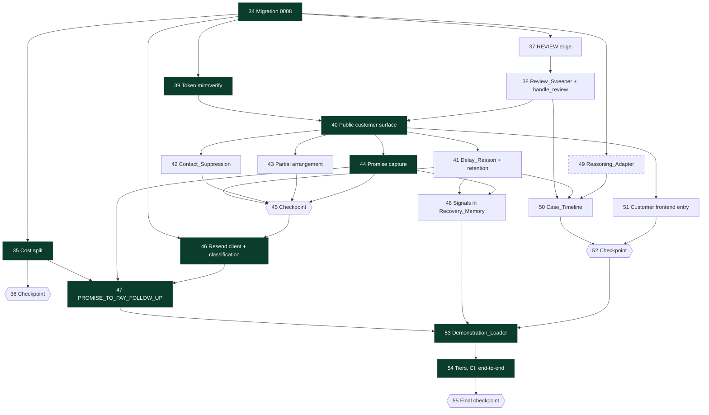

# Implementation Plan: Revora — Customer Response Loop

## Overview

Additive build onto the implemented base spec. Nothing existing is replaced. Five new packages (`revora/customer/`, `revora/timeline/`, `revora/reasoning/`, `revora/cases/review.py`, `revora/synthetic/demo.py`), one migration (`0008`), one new transition edge, two new periodic sweeps, one new frontend build target.

Top-level numbering **continues from the base plan**, whose last top-level task is 33, so a task reference is unambiguous across both plans. `_Requirements:` cites this spec's acceptance criteria as `Rn.Cm` and the base spec's the same way — the numbering spaces do not overlap because this document starts at Requirement 18. `_Properties:` cites P31–P68 from the design's property table.

Build order follows the sequencing the design's guarantees force:

- **Migration `0008` is first.** Nothing can be written against tables that do not exist, and the `execution_intent.effect_kind` index predicate is the structural mechanism that stops a resend from ever being reconciled — it has to exist before the resend path does.
- **The cost split (task 35) precedes every task that prices an action.** `PROMISE_TO_PAY_FOLLOW_UP`'s estimates are written against the four-term shape; building the action first would mean writing the three-term form and immediately rewriting it.
- **The review loop (tasks 37, 38) is independent of the customer surface** and runs in parallel with it. `handle_review` depends only on the edge from task 37 existing.
- **Token minting (task 39) precedes the public page (task 40).** The mint lives inside `execute_approved_action`'s first transaction because the token URL is what the message carries, so the execution-engine change lands before the routes are useful.
- **The Reasoning_Adapter (task 49) depends on nothing in this feature** and can be scheduled anywhere. Its `.importlinter` edits must land in the same task as the package, or CI passes for the wrong reason — a containment contract added a task later has already been violated by then.
- **The Demonstration_Loader (task 53) is last** because it exercises every other piece through the real HTTP and job paths.

### Verification gates

Every task must leave all of these passing. They are stated once and not repeated per task.

```
.\.venv\Scripts\ruff.exe check .
.\.venv\Scripts\python.exe scripts/check_no_float.py
.\.venv\Scripts\lint-imports.exe
.\.venv\Scripts\python.exe -m mypy -p revora.<packages>
.\.venv\Scripts\python.exe -m pytest -m "(pure or model) and not smoke" -q
.\.venv\Scripts\python.exe -m pytest -m "pg and not harness and not smoke" -q
cd web ; npx eslint src ; npx vitest run ; npm run build
```

### Conventions

- Paths are relative to `Rovara/`.
- Sub-tasks marked `*` are optional. The system must be demonstrable with every one of them skipped.
- Every property test carries the design-mandated tag comment naming the feature and the full property statement, and runs in the marker tier the design's Testing Strategy table assigns it.
- Frontend is plain React `.jsx`. No TypeScript is introduced anywhere by this feature.
- No `float` reaches any currency path. `scripts/check_no_float.py` gains the three new packages in task 40.6.

---

## Tasks

- [x] 34. Migration `0008` — the schema the whole loop stands on
  - Alembic `revision = "0008"`, `down_revision = "0007"`. Every money column `BIGINT` via the existing `MONEY` alias; every enumeration `TEXT` with a `CHECK` generated by `enum_check` from the Python enum. Migration `0003` derived its RLS table list from the metadata as it stood then, so a table added now gets no policy from it and must create its own.

  - [x] 34.1 The four new tables with their constraints and RLS policies
    - `customer_access_token`: `UNIQUE (merchant_id, token_id)`; the partial `UNIQUE (merchant_id, case_id) WHERE revoked_at IS NULL` that is R18.C14; `CHECK (expires_at > issued_at)`; `CHECK (accepted_submission_count >= 0)`; `CHECK ((revoked_at IS NULL) = (revocation_reason IS NULL))`; `CHECK (octet_length(secret_hash) = 32)`; `INDEX (merchant_id, case_id)`
    - `customer_signal`: kind, delay-reason and note-redaction checks; `CHECK (char_length(delay_reason_note) <= 500)`; `INDEX (merchant_id, case_id, submitted_at)`; the partial `INDEX (merchant_id, submitted_at) WHERE delay_reason_note IS NOT NULL` the retention sweep scans
    - `contact_suppression`: `UNIQUE (merchant_id, scope_key)`; `CHECK ((released_at IS NULL) = (released_by_user_id IS NULL))` which is R21.C2's "a release always names a person"; partial `INDEX (merchant_id, scope_key) WHERE released_at IS NULL` for the policy hot path. **No `expires_at` column** — non-expiry is enforced by absence
    - `promise_to_pay`: `UNIQUE (merchant_id, case_id)`; `CHECK (follow_up_at IS NULL OR follow_up_at < window_end_at_snapshot)` which is half of P42 as a database fact; `CHECK (status <> 'BEYOND_WINDOW_ESCALATED' OR follow_up_at IS NULL)`; `CHECK (promise_date > recorded_at)`; `CHECK ((status = 'KEPT') = (kept_at IS NOT NULL))`; partial `INDEX (merchant_id, follow_up_at) WHERE status IN ('RECORDED','FOLLOW_UP_SCHEDULED')`
    - **`customer_signal` gets no `amount`, no `instalment_count` and no `schedule` column.** R22.C1 is enforced by there being nowhere to store a partial amount
    - `ENABLE ROW LEVEL SECURITY` plus a `tenant_isolation` policy and a `revora_app` grant on each of the four
    - `CUSTOMER_TOKEN_MAX_SUBMISSIONS` is deliberately **not** a check constraint — it is a configurable bound and encoding today's 5 would make raising it a migration
    - _Requirements: R18.C3, R18.C14, R19.C5, R20.C2, R21.C2, R22.C1, R23.C3, R23.C7, R29.C10, R17.C2_
    - _Properties: P30, P42, P43_

  - [x] 34.2 `next_review_at`, `effect_kind`, and `call_kind`
    - `recovery_case.next_review_at TIMESTAMPTZ` with `CHECK (next_review_at IS NULL OR next_review_at <= window_end_at)` — the second clause of P63 as a database constraint — and the partial `ix_recovery_case_due_for_review (merchant_id, next_review_at) WHERE state = 'POLICY_CHECK' AND next_review_at IS NOT NULL` the Review_Sweeper scans
    - `execution_intent.effect_kind TEXT NOT NULL DEFAULT 'PAYMENT_LINK_CREATE'` with the two-member `CHECK`; the default backfills every existing row correctly because every intent written before `0008` was a link creation
    - Drop and recreate `ix_execution_intent_unresolved` with `AND effect_kind = 'PAYMENT_LINK_CREATE'` in its predicate. This is the mechanism, not a branch: `reconcile_intents` and `promote_stale_intents` read their candidates through this predicate, so a resend row is not skipped — it is not in the scanned set
    - `ai_invocation.call_kind TEXT` nullable with the three-member `CHECK`; nullable because a row written before the adapter existed genuinely does not know its kind
    - _Requirements: R30.C3, R30.C5, R27.C12; design Architecture — Provider Verification, Fact 2_
    - _Properties: P63_

  - [x] 34.3 The cost split columns and the R31.C9 data migration
    - Add `financial_cost`, `communication_cost` (`BIGINT NOT NULL DEFAULT 0`) and `financial_cost_method`, `communication_cost_method` to both `candidate_estimate` and `recommendation_candidate`
    - `UPDATE` setting `financial_cost = action_cost`, `communication_cost = 0`, and both method columns to `COST_SPLIT_NOT_MEASURED`; then `DROP COLUMN action_cost` on both tables
    - **Nothing infers a split from the action type.** Putting `MESSAGE_COMMUNICATION_COST` into the communication term for every `CUSTOMER_MESSAGE` row would present a guess as a measurement in the exact column whose purpose is to say which cost caused an exclusion
    - `action_cost` is dropped rather than left nullable, because a column that exists but must not be written is a column something will write
    - Drop and recreate `ck_candidate_estimate_method_enum` over the widened `EstimationMethod`; add `nonnegative_money_check` on both new money columns
    - _Requirements: R31.C1, R31.C9, R31.C10_

  - [x] 34.4 Downgrade with three refusal pre-assertions
    - Refuse if any `contact_suppression` row has `released_at IS NULL` — dropping a live suppression silently re-permits contact to a customer who disputed a charge, the one irreversible harm in this migration
    - Refuse if any case has `state = 'POLICY_CHECK' AND next_review_at IS NOT NULL` — nothing else re-decides such a case, so dropping the column strands it invisibly until its window elapses
    - Refuse if any row has `effect_kind = 'PAYMENT_LINK_RESEND' AND state = 'UNCERTAIN'` — restoring the old index predicate would start the reconciliation sweep issuing reads for effects that cannot be read
    - Cost split downgrade re-adds `action_cost = financial_cost + communication_cost`: lossy by nature, arithmetically faithful to the pre-split total
    - _Requirements: R21.C2, R30.C4; design Data Models — Downgrade_

  - [x] 34.5 SQLAlchemy models, repositories, and the revision bump
    - Models for the four new tables and the six altered columns in `revora/persistence/models/`, matching the existing Type Discipline exactly
    - Repository functions in `revora/persistence/repositories/`, every one taking `merchant_id` as a required argument — there is no cross-merchant function to call by accident
    - Bump `EXPECTED_REVISION` in `revora/persistence/repositories/schema.py` from `"0007"` to `"0008"`, so a process started against an un-migrated database refuses to serve rather than failing on the first write
    - _Requirements: R17.C2, R16.C1_
    - _Properties: P30_

  - [ ]* 34.6 `pg`-tier tests that every new constraint rejects its violation
    - `tests/persistence/`: migration up and down; each of the three downgrade pre-assertions firing on a populated table; the partial unique rejecting a second live token for one case; `follow_up_at < window_end_at_snapshot` rejecting an unclamped instant; `next_review_at <= window_end_at` rejecting a review past the window; the suppression release pair rejecting a release with no user; the cost-split data migration on a populated table; cross-tenant denial on all four new tables, extending P30
    - `EXPLAIN` assertion that `ix_execution_intent_unresolved` is used and that a `PAYMENT_LINK_RESEND` row is absent from its scan
    - _Requirements: R17.C2, R18.C14, R21.C2, R23.C3, R30.C3_
    - _Properties: P30, P42_

- [x] 35. Four-term cost decomposition — before anything prices a new action
  - The split must not change which action is selected for any input whose blended total is unchanged. Task 35.3 is that obligation as an executable differential test, and it is written before the estimation change so it fails first for the right reason.

  - [x] 35.1 `CostPrior` gains a fourth term; `EstimationMethod` gains its weakest member
    - `revora/estimation/candidates.py`: `CostPrior` becomes `financial_cost`, `communication_cost`, `risk_cost`, `customer_cost`; `COST_PRIORS` rewritten per the design's per-action table, with `PROMISE_FOLLOW_UP_FINANCIAL_COST = 0` correct rather than assumed because the resend creates no second link
    - `COST_SPLIT_NOT_MEASURED` added to `EstimationMethod` and inserted at the **weakest** position in `METHOD_WEAKNESS_ORDER`, ahead of `UNCALIBRATED` — a migrated figure that nothing measured and nothing guessed is the weakest claim available, and putting it anywhere else would let a migrated row's method make a real estimate look checked
    - `CandidateFigures` records five per-figure methods; the row still stores `weakest_method(...)` over all of them, because a candidate is consumed as a unit
    - _Requirements: R31.C1, R31.C2, R31.C5, R31.C6, R24.C4_

  - [x] 35.2 Four-term arithmetic in the optimizer
    - `revora/optimizer/arithmetic.py` and `selection.py`: `net_recovery_value = expected_incremental_revenue − financial_cost − communication_cost − risk_cost − customer_cost`; `total_action_cost` is the four-term sum; `EvaluatedCandidate.total_cost` and the `MAX_COST_TO_VALUE_RATIO` exclusion read the new sum
    - `NON_POSITIVE_INCREMENTAL_VALUE` still returns **before** any division, leaving `cost_ratio` as `None` as the recorded evidence the division was skipped. That ordering is untouched
    - Rounding still happens exactly once per estimate, at the single `incremental_probability × payment_amount` multiplication; the cost terms are never multiplied, so a fourth term adds no rounding site
    - `_ranking_key` keeps `(−net_recovery_value, total_cost, precedence)`; both components stay exact integers
    - _Requirements: R31.C3, R31.C4, R31.C6_

  - [x] 35.3 Property test: the split changes presentation, not selection
    - `tests/properties/test_cost_split.py`, `pure` tier. **Property 67.** New generator `cost_partitions(total=…)` in `tests/strategies/candidates.py` producing every integer partition point of a blended `action_cost`; assert the `SelectionResult` is equal across all of them — selected action, every exclusion reason, every `net_recovery_value`, every rank
    - Differential rather than assertive: the pre-split computation is the oracle
    - _Requirements: R31.C3, R31.C4, R31.C8_
    - _Properties: P67_

  - [ ]* 35.4 Property test: integer money discipline across four terms
    - `tests/properties/test_cost_split.py`, `pure` tier. **Property 68.** Every cost figure, total and net value is an integer minor-unit count; no float at any step; rounding occurs exactly once per estimate; all four `DO_NOTHING` terms are zero with a net value of exactly zero
    - _Requirements: R31.C1, R31.C2, R31.C3, R31.C6, R31.C12_
    - _Properties: P68_

  - [x] 35.5 `PAYMENT_LINK_FINANCIAL_COST` and `MESSAGE_COMMUNICATION_COST` as versioned config rows
    - Seed migration generating the rows from the `COST_PRIORS` catalogue, so the accessor and the table cannot disagree; `COST_PRIORS` becomes the fallback the catalogue defaults to
    - Neither is a code constant and neither is an environment variable, on the same terms R15.C6 applies to every other bound
    - _Requirements: R31.C11_

  - [x] 35.6 Present four figures plus the total, never the total instead
    - `revora/api/routers/cases.py` DTOs and `web/src/routes/CaseDetail.jsx`: `financial_cost`, `communication_cost`, `risk_cost`, `customer_cost` as four separate figures with `total_action_cost` alongside them
    - A row marked `COST_SPLIT_NOT_MEASURED` carries that marking adjacent to its two cost figures through the existing `<Label>` component with a plain-language explanation, so a migrated zero does not read as a measured zero
    - `revora/metrics/engine.py`: cost per recovery reports the four terms separately alongside their sum
    - _Requirements: R31.C7, R31.C10, R31.C12_

- [x] 36. Checkpoint — schema and valuation
  - Ensure all tests pass, ask the user if questions arise. Confirm specifically: `0008` upgrades and downgrades against a populated database, each downgrade pre-assertion fires, P67 passes at every partition point, and the existing optimizer and policy property tests are unchanged in outcome by the split.

- [x] 37. The REVIEW transition edge and `next_review_at` writer discipline
  - This is the base-spec defect fix, independent of the customer surface. One enum member, one declaration tuple, one column write, one column clear. The docstring change in 37.1 is not cosmetic: it removes a claim that becomes false.

  - [x] 37.1 Declare the edge and rewrite the termination proof
    - `revora/domain/transitions.py`: `TransitionKind.REVIEW`; `_REVIEW = ((POLICY_CHECK, DECISION_PENDING, CounterEffects(decision_cycle_delta=1)),)`; one loop over it in `_build_table`. The edge sets **only** `decision_cycle_delta=1` — `executed_action_delta`, `customer_message_delta_if_visible` and `sets_last_outbound_at` stay at their defaults, so a review moves no outbound counter and does not reset the cooldown clock
    - `REVIEW` is a distinct kind rather than a second `REENTRY`: `WAITING_FOR_OUTCOME → DECISION_PENDING` means "we acted and are deciding again", `POLICY_CHECK → DECISION_PENDING` means "we chose not to act and are looking again", and a shared kind would make "how often does restraint get revisited" unanswerable
    - **Rewrite the module docstring.** Its claim that the only cycle is `WAITING_FOR_OUTCOME → DECISION_PENDING` is now false. The replacement states the invariant the proof actually rests on: *every cycle in the transition graph contains an edge whose target is `DECISION_PENDING`, and all three such edges carry `decision_cycle_delta = 1`*
    - _Requirements: R30.C1, R30.C12_
    - _Properties: P64_

  - [x] 37.2 `apply_locked_transition` clears `next_review_at` on every edge out of `POLICY_CHECK`
    - `revora/cases/manager.py`: the clear happens in the one writer, in the same transaction as the state change, **not at each call site** — implemented at call sites, a future edge can forget
    - _Requirements: R30.C4_

  - [x] 37.3 `handle_policy`'s null-action branch persists a review instant
    - `revora/jobs/pipeline.py`: the null-action branch currently only logs. It becomes: persist `next_review_at = min(now + WAIT_REVIEW_INTERVAL, window_end_at)` and log
    - Seed `WAIT_REVIEW_INTERVAL` (12 hours) and `REVIEW_SWEEP_INTERVAL` (5 minutes) as versioned `app_config` rows
    - _Requirements: R30.C3, R30.C12_

  - [x] 37.4 Strengthen the existing lifecycle property test's graph assertion
    - `tests/properties/test_lifecycle_machine.py`, `pure` tier. The table is derived from the declaration, so the new edge appears in the test's expectation and the implementation from one source and the existing assertions pass unchanged
    - Replace the "exactly one cycle" assertion with **"every cycle contains an edge with `decision_cycle_delta >= 1`"**, computed from `LEGAL_TRANSITIONS` by cycle enumeration. That is the property the termination proof rests on, and it is the one that catches a future edge added without a counter effect
    - _Requirements: R2.C2, R30.C1_
    - _Properties: P64_

- [x] 38. Review_Sweeper, `handle_review`, and the three triggers
  - The sweeper and the customer service **only enqueue**. Neither transitions a case, evaluates policy, or calls a provider. Every consequence is applied by the worker through `apply_transition`, which stays the only writer of `recovery_case.state`.

  - [x] 38.1 `revora/cases/review.py` and its scheduler registration
    - `sweep_due_reviews`: read the due set in one transaction, release, then act on each separately, copying `sweep_expired_cases` exactly. Query filters `state = 'POLICY_CHECK'`, `next_review_at <= now`, `decision_cycle_count < MAX_RECOVERY_ATTEMPTS`, ordered by `next_review_at`, bounded by `DEFAULT_SWEEP_LIMIT`. A version conflict is not an error — the case is revisited next pass
    - `CASE_REVIEW_KIND = "case_review"` appended to `PERIODIC_SWEEP_KINDS` in `revora/jobs/scheduler.py`, enqueued every `REVIEW_SWEEP_INTERVAL` with the existing bucket dedupe key. This is the eighth periodic sweep
    - Idempotency comes from the **existing `one_pending_job_per_dedupe_key` partial unique index** on `job` with `dedupe_key = f"case_review:{case_id}"`. No `review_enqueued_at` column: a second copy of queue state drifts, and the drift shows up as either a duplicated decision cycle or a case that stops being reviewed
    - Restart independence: every input is a persisted column, so a sweep starting with an empty queue after a restart finds exactly the same due set
    - _Requirements: R30.C5, R30.C6, R30.C9_
    - _Properties: P65_

  - [x] 38.2 `handle_review` assembled from the existing pipeline steps
    - New handler in `revora/jobs/pipeline.py`: lock the case and re-check `POLICY_CHECK`; if `decision_cycle_count >= MAX_RECOVERY_ATTEMPTS` transition to `STOPPED` with `DECISION_CYCLE_LIMIT_REACHED`, clear `next_review_at`, write `CASE_REVIEWED` and return; otherwise `run_diagnosis` → `run_baseline_estimation` → `run_candidate_estimation` → `run_optimizer` for `decision_cycle_count + 1`, recommendation written **before** the transition for the same reason `handle_optimizer` does it — the recommendation belongs to the cycle that produced it; then `apply_transition(POLICY_CHECK → DECISION_PENDING, kind=REVIEW)` clearing `next_review_at` in the same transaction, with `on_success` enqueuing `POLICY_JOB_KIND`
    - `CASE_REVIEWED` audit record carrying trigger, previous and new selected action, the post-review cycle counter, and the new `next_review_at` where one exists — **written whether or not the selection changed**. A review that re-selected `WAIT` is the interesting case: it is the evidence restraint was re-examined rather than forgotten
    - The policy evaluation takes no input from the trigger and no input from the count of prior reviews
    - _Requirements: R30.C10, R30.C11, R30.C15, R19.C10_
    - _Properties: P64_

  - [x] 38.3 `EVENT_ATTACHED` trigger in the detection service
    - `revora/detection/service.py::_open_or_attach`: the else-branch currently writes `EVENT_ATTACHED_TO_CASE` and returns. It gains an `enqueue_next(CASE_REVIEW_KIND)` when the open case's state is `POLICY_CHECK`, **in the same transaction as the attach and the audit record**
    - `payment_amount` and the detection timestamp stay untouched, and no second case is created for the payment identifier
    - _Requirements: R30.C7_

  - [x] 38.4 Property tests: review never buys time and never escapes the cap
    - `tests/properties/test_review_loop.py`, `model` tier. New generator `review_trigger_sequences()` in `tests/strategies/`. Extend the base spec's existing `RuleBasedStateMachine` with rules for `sweep_review`, `attach_event`, `submit_signal`, `advance_clock` and `restart_worker` — **one model of the lifecycle, one place an invariant is checked**, rather than a second state machine
    - **Property 63:** `window_end_at` equals its creation value; every persisted `next_review_at <= window_end_at`; the case terminates within the R2.C12 bound, for any interleaving of any length
    - **Property 64:** total decision cycles ≤ `MAX_RECOVERY_ATTEMPTS` counting cycles entered from all three edges; a review at the cap yields `STOPPED` with `DECISION_CYCLE_LIMIT_REACHED`, no enqueued cycle, `next_review_at` cleared
    - _Requirements: R30.C1, R30.C2, R30.C5, R30.C10, R30.C16_
    - _Properties: P63, P64_

  - [x] 38.5 `pg`-tier proof that one review is one cycle
    - `tests/properties/test_review_loop.py`, `pg` tier. **Property 65:** repeated sweep passes over an unchanged case enqueue at most one cycle; two concurrent sweeps against one case produce one pending job; a trigger of a different kind against a case already holding an unapplied cycle produces no second one
    - Separate `pg` test: the sweeper's query uses `ix_recovery_case_due_for_review` (`EXPLAIN` assertion) and finds its due set after a simulated restart with an empty job queue
    - _Requirements: R30.C5, R30.C6, R30.C9_
    - _Properties: P65_

  - [x] 38.6 Present a waiting case as waiting, not as ended
    - `revora/api/routers/cases.py` and `web/src/routes/CaseList.jsx`, `Unresolved.jsx`: a case at `POLICY_CHECK` with a future `next_review_at` and a counter below the cap is presented as actively waiting with its `next_review_at` and its selected Null_Action, and appears in **no** ended grouping and **no** Terminal_State grouping
    - `DO_NOTHING` and `WAIT` render under the shared label "Waiting and watching" with the stored enumeration member shown alongside
    - `tests/properties/test_review_loop.py`, `model` tier. **Property 66**
    - _Requirements: R30.C12, R30.C13, R26.C14_
    - _Properties: P66_

- [x] 39. Customer_Access_Token mint, verify, revoke, and the execution-engine integration
  - The token is a deliberately weaker second credential, bounded so narrowly that its compromise costs one case's amount and one recovery opportunity. Task 39.5 is the executable form of that bound.

  - [x] 39.1 `CUSTOMER_ACCESS_TOKEN` as a sensitive field kind
    - `revora/domain/enums.py`: add `FieldKind.CUSTOMER_ACCESS_TOKEN`; add it to `SENSITIVE_FIELD_KINDS` so the existing masking serializer covers it on the same terms as `PROVIDER_SHORT_URL` — both are bearer capabilities
    - Every log line and audit field carries `token_id` only, never the secret
    - _Requirements: R18.C11, R29.C4_
    - _Properties: P33_

  - [x] 39.2 `revora/customer/tokens.py` — mint, verify, rotate
    - Wire form `rvc_<token_id>.<secret>`: `token_id` is 26-char unpadded lowercase base32 of 16 random bytes, `secret` is 22-char unpadded base64url of 16 random bytes (128 bits), both from `secrets.token_bytes`. The `token_id` is separately random rather than derived, so the lookup handle leaks nothing about the secret
    - Stored value is `HMAC-SHA256(signing_key, token_id ‖ secret)` — keyed, so a database dump alone does not permit offline verification. No reversible copy of the secret exists anywhere
    - Verification does one indexed lookup then loops over **every** active signing secret accumulating with `|=` and **never breaking early**, so the time taken is independent of which secret matched and of whether any did. A missing row and a bad signature fold into one branch returning identical status and body
    - Expiry is the earlier of `issued_at + CUSTOMER_TOKEN_LIFETIME` and `window_end_at`, never extended. Minting a replacement for an expired predecessor marks it `revoked_at = now(), reason = EXPIRED_SUPERSEDED` in the same transaction, which makes the supersession auditable rather than implicit
    - Rotation: mint under the newest active secret, verify against every active one. A token whose key was retired matches nothing and falls into the **same 404 path** — stronger than R29.C14's 410, and chosen for that reason: distinguishing "signed by a retired key" from "not a real token" tells an attacker their guess had the right shape. `CUSTOMER_TOKEN_KEY_RETIRED` goes in the audit record; the caller sees 404
    - Signing secret resolves through the existing `revora.platform.secrets` store, whose contract already refuses to invent a missing credential: absent secret means no mint, no verify, `CREDENTIAL_UNAVAILABLE` audit record, HTTP 503
    - `CUSTOMER_TOKEN_ISSUED` audit record carrying case id, `token_id`, both instants and the approved action, and no part of the secret
    - _Requirements: R18.C1, R18.C2, R18.C3, R18.C4, R18.C12, R29.C6, R29.C13, R29.C14_
    - _Properties: P31, P33_

  - [x] 39.3 Revocation on terminal state and on suppression
    - Bulk revoke every token of a case when it enters a Terminal_State or a `contact_suppression` row covering it is persisted, with the reason `CASE_TERMINAL` or `CONTACT_SUPPRESSED`; served by `INDEX (merchant_id, case_id)`
    - Every subsequent request carrying a revoked token gets 410
    - _Requirements: R18.C8, R21.C10_
    - _Properties: P32, P40_

  - [x] 39.4 Mint inside `execute_approved_action`'s first transaction
    - `revora/execution/engine.py`: the mint happens alongside the intent insert and **before** the provider call, because the token URL is what the message carries — a token minted at confirmation would arrive after the only message that could have delivered it
    - Reuse an unexpired, unrevoked token where one exists and leave its expiry unchanged; mint no second one
    - A failed mint rolls that transaction back, so no intent exists, no counter moved and no call went out. R18.C13 is satisfied by the transaction boundary rather than by a compensating action; `CUSTOMER_TOKEN_ISSUE_FAILED` names the reason
    - _Requirements: R18.C1, R18.C13, R18.C14_

  - [x] 39.5 Property tests: one token reaches one case and nothing else
    - `tests/properties/test_customer_token.py`, `model` tier for P31/P32/P34 and `pg` tier for the row-lock bound in P32. New generator `customer_tokens()` in `tests/strategies/`
    - **Property 31:** every read returns fields of that one case; every write mutates that one case; a request naming a second case id returns no field of it
    - **Property 32:** accepted writes ≤ `CUSTOMER_TOKEN_MAX_SUBMISSIONS`; zero accepted operations at or after expiry; zero after revocation, across sequences crossing both instants
    - **Property 33:** no audit field and no log record contains the secret; the token appears only as `token_id`
    - _Requirements: R18.C2, R18.C4, R18.C5, R18.C7, R18.C8, R18.C9, R18.C10, R18.C11, R29.C2_
    - _Properties: P31, P32, P33_

- [x] 40. The public customer surface — projection, three writes, and the compensations for the absent session
  - This is the only endpoint in Revora reachable without a session. Every control here is compensation for that, and each is a decision about what a compromise costs.

  - [x] 40.1 Promote the rate limiter to `revora/platform/ratelimit.py`
    - Move `_RateLimiter` out of `revora/ingestion/service.py` unchanged; both callers import it from `platform`
    - Two key spaces: `token:{token_id}` at `CUSTOMER_PAGE_RATE_LIMIT` and `src:{source}` at `CUSTOMER_PAGE_SOURCE_RATE_LIMIT`, each writing `RATE_LIMIT_APPLIED` naming which rate was exceeded
    - **Its weakness is documented in the module rather than designed around:** the counter is per process, so two replicas admit twice the configured rate, and the fixed window resets rather than sliding. Acceptable because the rate limit is a coarse flood guard on the read path — the durable bound is `accepted_submission_count` under a row lock, which no number of replicas can exceed. A shared limiter would add a write to every page read to tighten a guard whose failure mode is "somebody refreshed too fast"
    - _Requirements: R29.C1_

  - [x] 40.2 `revora/customer/projection.py` — nine fields and no tenth
    - A purpose-built frozen dataclass with exactly `merchant_display_name`, `amount`, `currency`, `reason`, `pay_url`, `window_end_at`, `promise`, `signals_remaining` — **not** a filtered view of the dashboard model, so adding a field to the dashboard cannot leak it here
    - `amount` uses the existing `Money` envelope, formatted **on the server** from the stored integer. `reason` is a plain-language rendering of the recorded `Risk_Cause` from a fixed template table — never the provider's error string, which is internal vocabulary and sometimes names our own integration
    - Absent by construction: any contact identifier masked or not, any instrument reference, all three probabilities, `expected_incremental_revenue`, all four cost terms, `total_action_cost`, `net_recovery_value`, any rejected candidate, any policy decision, any configuration value, any `Merchant_User` identifier, any field of a second case
    - `PERSISTENCE_TIMEOUT` on the read; on timeout, 503 with **no partial projection** and no accepted write in that request
    - _Requirements: R19.C1, R19.C2, R19.C3, R19.C12, R29.C3_
    - _Properties: P34, P60_

  - [x] 40.3 `revora/customer/signals.py` — three write shapes, one transaction each
    - Pydantic models with `extra="forbid"`, so any field outside the declared schema is a 422 without a hand-written check. The partial-arrangement model declares no `amount`, no `instalment_count` and no `schedule`, so R22.C1's rejection is the schema's default behaviour
    - Each accepted write is **one transaction** containing the `customer_signal` insert, the `accepted_submission_count` increment under the token row lock, the audit record, and the enqueued follow-on job. All four or none — so an audit write that misses `AUDIT_WRITE_TIMEOUT` leaves no signal, no increment and no queued consequence, and the caller gets 503
    - The request causes **no** state transition, **no** policy evaluation, **no** provider call. The `CUSTOMER_SIGNAL` review trigger is an `enqueue_next(CASE_REVIEW_KIND)` inside the accepting transaction when the case is at `POLICY_CHECK`, applied by the worker
    - Caps enforced under the row lock: `CUSTOMER_TOKEN_MAX_SUBMISSIONS` per token (429, reads still served), `MAX_CUSTOMER_SIGNALS_PER_CASE` per case (429)
    - _Requirements: R19.C4, R19.C5, R19.C6, R19.C7, R19.C8, R19.C9, R22.C1, R29.C12, R30.C8_
    - _Properties: P35, P59_

  - [x] 40.4 `revora/api/routers/customer.py` — the status-code table, CORS, and response headers
    - `GET /customer/case` with `Authorization: Bearer rvc_…`. **The path carries no identifier at all**, which is a cheaper way to satisfy R18.C4's "discard any identifier in the request" than discarding one
    - Implement the design's rejection table exactly: 404 for bad signature / unknown `token_id` / wrong case id with identical body and status for the first two; 410 for expired and revoked with `{"expired": true}` and nothing else; 503 for unreadable secret and for audit-write failure; 422 for schema and enumeration violations naming the field only; 409 for terminal case and second promise; 429 for both caps and both rate limits
    - CORS middleware mounted on the `/customer` router **only** — the dashboard API and the webhook endpoint keep none, preserving ADR-9. `REVORA_CUSTOMER_ORIGINS` as an explicit list with no wildcard, no regex, no `null` origin; `allow_credentials: false` because the token travels in a header, not a cookie; methods `GET, POST`; headers `Authorization, Content-Type`
    - Because credentials are never sent, an attacker's page cannot make the browser attach the token — which is why `allow_credentials: false` matters more here than the origin list does
    - Response headers on every customer response: `Cache-Control: no-store, private`, `Referrer-Policy: no-referrer`, `X-Content-Type-Options: nosniff`, and a CSP with no `connect-src` beyond the API host and no `img-src`, `script-src` or `style-src` beyond `self` — which makes "no third-party asset request, no analytics request" enforceable by the browser rather than by discipline
    - _Requirements: R18.C5, R18.C6, R18.C7, R18.C9, R19.C11, R29.C1, R29.C5, R29.C7, R29.C8_

  - [x] 40.5 Property tests: the projection discloses nine fields and the audit trail is exact
    - `tests/properties/test_customer_token.py`, `model` tier. **Property 34:** for arbitrary case states, promises and candidate sets, the projection's key set is exactly the nine declared fields
    - `tests/properties/test_customer_audit_money.py`, `model` tier for P59 and `pg` tier for the injected audit-write failure. **Property 59:** exactly one audit record per write with `token_id` as actor and a shared `correlation_id`; on audit failure, zero signal rows and an unchanged submission count
    - `tests/properties/test_customer_audit_money.py`, `pure` tier. **Property 60:** every currency figure the customer service produces is an integer minor-unit count, no fractional or float value at any step
    - `tests/properties/test_customer_signal_authority.py`, `model` tier. **Property 35:** no signal sequence produces an `APPROVED` verdict, and every external effect is preceded in the audit log by an `APPROVED` decision naming the same case and key
    - _Requirements: R19.C2, R19.C3, R19.C5, R19.C6, R19.C9, R29.C9, R29.C12_
    - _Properties: P34, P35, P59, P60_

  - [x] 40.6 Extend the structural checks to the new packages
    - `scripts/check_no_float.py` gains `revora/customer/`, `revora/timeline/` and `revora/reasoning/` to its scanned set
    - `revora.customer` and `revora.timeline` placed in the `.importlinter` `layering` contract: `customer` in the band alongside `revora.detection | revora.ingestion` (it needs `cases`, `audit`, `persistence`, `platform`, `domain` and nothing above); `timeline` in the band with `revora.metrics | revora.outcome`
    - `revora.timeline` imports nothing from `revora.persistence` — the router builds the views and passes them down, which is what makes the P56 test `pure`-tier rather than `pg`-tier
    - Add all three packages to the `mypy` package list in the verification gate
    - **Scheduled after task 50.1** despite belonging to this task group: a `layering` entry naming `revora.timeline` before the package exists fails `lint-imports` on a missing module rather than on a real violation
    - _Requirements: R26.C6, R31.C3; design Testing Strategy — CI additions beyond tests_
    - _Properties: P56, P60_

- [ ] 41. Delay_Reason capture, cause refinement, and note retention
  - The highest-value evidence in the system from the least trustworthy source in the system. Resolved the way R4 resolves the Reasoning_Layer: the input may inform an estimate and may not inform an authorization.

  - [ ] 41.1 The mapping table and the second deterministic diagnosis source
    - `revora/customer/signals.py` declares the mapping: `SALARY_OR_CASHFLOW_TIMING → INSUFFICIENT_FUNDS`, `BANK_OR_CARD_PROBLEM → BANK_OR_NETWORK_FAILURE`, `AMOUNT_TOO_HIGH_RIGHT_NOW → INSUFFICIENT_FUNDS`, `OTHER →` no cause
    - `revora/diagnosis/service.py`: a persisted Delay_Reason from the first three yields, for the next decision cycle, a diagnosis with method `DETERMINISTIC`, confidence `CUSTOMER_STATED_CAUSE_CONFIDENCE`, and evidence source `CUSTOMER_STATED_REASON` plus the signal id. `OTHER` leaves the recorded cause unchanged and records that no refinement occurred
    - `CUSTOMER_STATED_REASON` added to the diagnosis evidence source enumeration so the audit trail distinguishes a customer-stated cause from a provider-error-code cause
    - Persisting a Delay_Reason leaves `window_end_at`, both counters and `last_outbound_at` unchanged
    - _Requirements: R20.C1, R20.C4, R20.C5, R20.C6, R20.C9_

  - [ ] 41.2 Note handling and the confidence floor guard
    - Truncate to `DELAY_NOTE_MAX_LENGTH` marking the row `TRUNCATED`; store as inert text never evaluated, never interpolated into a query, never interpolated into a provider request, never rendered as markup
    - Nothing derives a Delay_Reason, Hard_Stop_Reason, Promise_Date, Partial_Arrangement_Request or currency figure from note contents
    - Configuration validator refusing a `CUSTOMER_STATED_CAUSE_CONFIDENCE` below `DIAGNOSIS_CONFIDENCE_FLOOR` — below the floor the cause would substitute to `UNKNOWN` under R3.C8 and the whole capture would be inert
    - _Requirements: R20.C2, R20.C3, R20.C7_
    - _Properties: P38_

  - [ ] 41.3 Property tests: customer input is evidence, never authority
    - `tests/properties/test_customer_signal_authority.py`. **Property 36** (`model`): replacing every signal field with arbitrary schema-valid content, suppression state held fixed, leaves the verdict, primary reason and all twelve ordered check outcomes unchanged. **Property 37** (`model`): all eight named bounds and the configuration version identifier unchanged under arbitrary signal sequences. **Property 38** (`pure`): new generator `delay_reason_notes()` producing whitespace-only, markup, control characters, non-ASCII and over-length notes; derived reason, hard stop, promise date, arrangement flag and every currency figure equal their values with the note absent; stored length ≤ bound; rendered output has every markup-significant character escaped
    - `revora/policy/` still imports nothing new — the twelve checks read only the persisted `contact_suppression` state, and `lint-imports` proves the rest structurally
    - _Requirements: R20.C8, R20.C10, R25.C6, R25.C7, R29.C11_
    - _Properties: P36, P37, P38_

  - [ ] 41.4 Present the note as customer-supplied unverified text
    - `revora/api/routers/cases.py` and `web/src/routes/CaseDetail.jsx`: every persisted signal with its kind, submitted values, submission instant and note, the note escaped and labelled customer-supplied unverified text
    - _Requirements: R20.C12, R29.C11_

  - [ ] 41.5 Extend the retention sweep to notes
    - `revora/cases/retention.py`: delete or irreversibly mask a `delay_reason_note` older than `CUSTOMER_DATA_RETENTION` within 24 hours of the period elapsing, setting `note_redacted_at` and `retention_config_version`, retaining the non-identifying signal fields metrics and Recovery_Memory need
    - The scan uses the partial index from 34.1 — partial because most rows have no note and indexing them would make the sweep read them
    - `pg`-tier test that redaction happens and that `CHECK (note_redacted_at IS NULL OR delay_reason_note IS NULL)` holds afterwards: a redacted note is gone, not merely marked
    - _Requirements: R29.C10_

- [ ] 42. Hard_Stop_Reason and permanent Contact_Suppression
  - No thirteenth policy check. The suppression record enters the existing `CUSTOMER_OPTED_OUT` check's input, so the block happens inside the twelve-check sequence at the position absolute prohibitions already occupy.

  - [ ] 42.1 `revora/customer/suppression.py` — the record and the policy input
    - `scope_key = sha256(customer_key ‖ order_id or case_id)`, a hash so the column can be indexed and compared without holding a second copy of the customer key; the preimage is recoverable from the `recovery_case` row the suppression names
    - Written in the **same atomic transaction** as the `customer_signal` record. A second hard stop on the same scope is idempotent through `UNIQUE (merchant_id, scope_key)`
    - `revora/policy/`: check 5 `CUSTOMER_OPTED_OUT` reads the live-suppression lookup as part of its already-declared consent-and-opt-out input, served by the partial index. The suppression is applied **without** setting the customer-wide opt-out status of R17.C10, so an objection to one debt stays distinguishable from a withdrawal of consent to be contacted at all
    - _Requirements: R21.C1, R21.C3, R21.C8, R21.C9_
    - _Properties: P39_

  - [ ] 42.2 Escalation, cancellation, and the in-flight intent
    - Transition to `ESCALATED` with `CUSTOMER_DISPUTED_CHARGE` or `CUSTOMER_CANCELLED_ORDER`, recording the unresolved `payment_amount` in minor units
    - Cancel every scheduled and queued action with no execution-intent row, issuing no provider request, leaving both counters unchanged, one `ACTION_CANCELLED_CONTACT_SUPPRESSED` record per cancelled action
    - An intent already `ATTEMPTED`, `CONFIRMED` or `UNCERTAIN` gets no further external call and resolves through the existing reconciliation path of R9.C15; the Outcome_Monitor records it as `POST_SUPPRESSION_ACTION`
    - A later authoritative read reporting paid or captured still reconciles to `RECOVERED` under R10.C14, **leaves the suppression in force**, and issues no provider request
    - _Requirements: R21.C4, R21.C5, R21.C6, R21.C7, R21.C12_
    - _Properties: P39, P40_

  - [ ] 42.3 Release requires a person
    - Release path setting `released_at`, `released_by_user_id` and `release_config_version` together, on the same terms `model_promotion.approving_user_id` is set; the `CHECK` from 34.1 makes a release with no named user unstorable
    - No expiry mechanism exists to build — non-expiry is the absence of an `expires_at` column
    - _Requirements: R21.C2_

  - [ ] 42.4 Property tests: a hard stop is permanent
    - `tests/properties/test_contact_suppression.py`. **Property 39** (`model`, stateful — rules added to the same lifecycle machine as task 38.4): for a hard stop at instant `T`, zero confirmed customer-visible actions in the Suppression_Scope have a confirmation later than `T`, across any subsequent events, decision cycles, restarts and newly created cases in that scope. **Property 40** (`model`): terminal state is `ESCALATED` with the matching reason, every token of the case is revoked, and the customer-wide opt-out status is unchanged
    - _Requirements: R21.C1, R21.C2, R21.C3, R21.C4, R21.C5, R21.C6, R21.C7, R21.C8, R21.C9, R21.C10_
    - _Properties: P39, P40_

  - [ ] 42.5 Present suppression in the unresolved grouping
    - `web/src/routes/Unresolved.jsx` and `CaseDetail.jsx`: every suppressed case in the `ESCALATED` grouping under its reason, showing the Hard_Stop_Reason, the suppression instant and the unresolved amount
    - _Requirements: R21.C11_

- [ ] 43. Partial_Arrangement_Request as a signal and nothing else
  - [ ] 43.1 Escalate, record, change no money field
    - `ESCALATED` with `CUSTOMER_REQUESTED_PARTIAL_ARRANGEMENT`, recording the unresolved amount; `payment_amount`, currency and `window_end_at` unchanged
    - `revora/memory/store.py`: persist the request as an observation feature with the request instant and the accompanying note
    - Any live payment link stays live and unmodified for its remaining validity, so a customer choosing to pay in full still recovers the case under R10.C14
    - Where a Hard_Stop_Reason is also persisted, the hard stop's consequences apply and the arrangement is recorded as a signal **without a second Terminal_State transition** — the hard stop is the stronger statement and a case holds one terminal reason
    - _Requirements: R22.C2, R22.C6, R22.C7, R22.C8, R22.C10_

  - [ ] 43.2 Property tests: partial money is never recovery
    - `tests/properties/test_partial_arrangement.py`, `model` tier. **Property 47:** a captured amount below `payment_amount` and a provider state of `partially_paid` each leave the case unrecovered, contribute zero to all four revenue figures, and every link Revora created carries `accept_partial = false`. **Property 48:** the full amount appears exactly once in `unresolved_revenue`, amount and currency unchanged, and a later full capture reconciles to `RECOVERED` counting once
    - _Requirements: R22.C3, R22.C4, R22.C5, R22.C7, R22.C8_
    - _Properties: P47, P48_

  - [ ] 43.3 Present the arrangement request in the ESCALATED grouping
    - Request instant, accompanying note, unresolved amount
    - _Requirements: R22.C9_

- [ ] 44. Promise_To_Pay capture and Recovery_Window clamping
  - A promise changes *when* Revora acts and never *how long*. The window is set at case creation and never extended; a promised date beyond the window end is not a scheduling problem to solve by stretching the window, it is a case for a person.

  - [ ] 44.1 `revora/customer/promises.py` — accept, clamp, reject
    - Accept one `promise_date`, convert to UTC, retain the received representation alongside it on the same terms R16.C13 applies to a Payment_Event timestamp
    - `follow_up_at = min(promise_date + PROMISE_FOLLOW_UP_OFFSET, window_end_at − PROMISE_WINDOW_SAFETY_MARGIN)`, status `RECORDED`, `window_end_at_snapshot` captured
    - A date at or after `window_end_at`, or a computed `follow_up_at` earlier than the submission instant, yields `BEYOND_WINDOW_ESCALATED`, no `follow_up_at`, nothing scheduled, and `ESCALATED` with `PROMISE_BEYOND_RECOVERY_WINDOW`
    - 422 inside `PROMISE_MIN_LEAD_TIME` persisting no promise; 409 on a second promise, **still recording the submission as a signal** for Recovery_Memory; the `UNIQUE (merchant_id, case_id)` index is the backstop and the configured `MAX_PROMISES_PER_CASE` is the checked bound
    - `PROMISE_RECORDED` audit record carrying promise date, computed follow-up instant, `window_end_at` and `token_id` as actor, so a reader can check the clamp from the audit trail alone
    - _Requirements: R23.C1, R23.C2, R23.C3, R23.C4, R23.C5, R23.C6, R23.C7, R23.C8_
    - _Properties: P41, P42, P43_

  - [ ] 44.2 Status transitions driven by authoritative reads
    - `KEPT` on an authoritative read reporting paid or captured, recording `seconds_promise_to_payment` — signed, because paying early is normal
    - `MISSED` when a `PROMISE_TO_PAY_FOLLOW_UP` intent reached `CONFIRMED` and a subsequent authoritative read reports a state other than paid or captured, recording the missed instant
    - `VOIDED` with the voiding Terminal_State when a case holding a `RECORDED` promise reaches any terminal state other than `RECOVERED`
    - _Requirements: R23.C10, R23.C11, R23.C12_

  - [ ] 44.3 The promise sweep
    - Registered in `revora/jobs/scheduler.py` as the seventh periodic sweep, every `PROMISE_SWEEP_INTERVAL`, scanning the partial index on `(merchant_id, follow_up_at) WHERE status IN ('RECORDED','FOLLOW_UP_SCHEDULED')`
    - Applies any reached `follow_up_at`, elapsed window or elapsed cooldown **within the same evaluation** that detected it
    - While `RECORDED` and before `follow_up_at`, the optimizer excludes the follow-up with `PROMISE_DATE_NOT_REACHED` and retains it in the recorded set
    - _Requirements: R23.C9, R23.C13_
    - _Properties: P46_

  - [ ] 44.4 Property tests: a promise never buys time
    - `tests/properties/test_promise.py`, `model` tier, with new generator `promise_dates(relative_to=…)` spanning the window boundary, the safety margin, the far past and the far future
    - **Property 41:** `window_end_at` equals its creation value for any promise with any date, and the case terminates within the R2.C12 bound. **Property 42:** either `follow_up_at ≤ window_end − PROMISE_WINDOW_SAFETY_MARGIN`, or the status is `BEYOND_WINDOW_ESCALATED` with the case `ESCALATED` and nothing scheduled. **Property 43:** persisted promise count ≤ `MAX_PROMISES_PER_CASE`, and a rejected submission leaves date, status and follow-up unchanged while still recording a signal
    - _Requirements: R23.C3, R23.C4, R23.C5, R23.C6, R23.C7, R24.C15_
    - _Properties: P41, P42, P43_

  - [ ] 44.5 Present the clamp as a clamp
    - `web/src/routes/CaseDetail.jsx`: promise date, status, computed follow-up instant and `window_end_at`, with the window end **adjacent to** the promise date so a clamped follow-up is visible as a clamp rather than as an arbitrary time
    - _Requirements: R23.C14_

- [ ] 45. Checkpoint — customer surface
  - Ensure all tests pass, ask the user if questions arise. Confirm specifically: a token reaches exactly one case, an audit-write failure leaves no signal and no increment, a hard stop stops contact permanently across a restart, a promise past the window escalates instead of extending it, and the twelve policy checks are provably unmoved by any signal content.

- [ ] 46. Payment-link resend and its own response classification
  - Two verified provider facts shape this task. The resend endpoint exists (`POST /v1/payment_links/:id/notify_by/:medium`, `medium ∈ {sms, email}`), so no second link is created and `PROMISE_FOLLOW_UP_FINANCIAL_COST = 0` is correct rather than assumed. And **a resend is not re-readable** — the response carries only a success boolean, with no notification identifier and no endpoint reporting whether a notification was sent.

  - [ ] 46.1 The client method and the composed response identifier
    - `revora/providers/razorpay.py`: `notify_by(payment_link_id, medium)` against the verified endpoint, using the existing `split_timeout` and masking-aware logger
    - There is no provider id to persist, so `provider_response_id` is the Revora-composed token `"<plink_id>#notify_by:<medium>"` and the `EXECUTION_STARTED` audit record carries `provider_identifier_absent: true`. The composed form is deliberately **not** a valid Razorpay id shape, so nothing can later feed it to a fetch endpoint believing it is one
    - `provider_short_url` stays the link's existing `short_url`, unchanged by the resend
    - `reminder_enable` stays `false`. It is more load-bearing now, not less: enabling it would put uncounted provider messages alongside counted Revora ones on the same link, Property 9 would still pass while a customer received messages nothing authorized, and no test would fail. Extend the comment in `revora/providers/payment_link.py` to say so
    - _Requirements: R24.C10, R24.C17_

  - [ ] 46.2 The resend classification table
    - `revora/providers/classification.py`: a resend-specific table, leaving the create's table unchanged. 200 with a body validating as `{"success": true}` → `Success`/`CONFIRMED`; 200 with `success` absent or false or an unparseable body → `Unclassifiable`/`UNCERTAIN`; parseable 4xx → `ClientError(PROVIDER)`/`FAILED`; 5xx and post-send read timeout → `UNCERTAIN`; connect-phase failure → `FAILED`
    - **429 classifies `FAILED`, and this is the one place the resend departs from the generic rule.** The generic rule sends an unparseable 4xx to `Unclassifiable` because an HTML page from an intermediary tells us nothing about whether the provider saw the request. A 429 is different in kind: it is the provider's own gateway stating it declined to act, and a rejection delivered nothing. The classification therefore does not depend on the 429 body shape, which is unverified — and not depending on it is the point
    - Table-driven `pure`-tier test over `classify_response` plus the 429 override
    - _Requirements: R24.C10; design Architecture — Resend response classification_

  - [ ] 46.3 `UNCERTAIN` is terminal-unresolvable, and the sweep must not touch it
    - An `UNCERTAIN` resend intent is **never retried and never reconciled**. In the same transaction that records the classification, the case escalates with `TerminalReason.EXECUTION_RESULT_UNVERIFIABLE` and no further external call is issued — exactly as R9.C17 already does for an exhausted reconciliation, except the bound is zero attempts instead of six, because the attempts would be reads that cannot answer
    - The cost is that one promise follow-up may be lost: a customer who said Friday does not get the Friday nudge. The alternative is an SMS to a real person about money they may already have paid. A lost nudge is recoverable by a person reading the escalation; a second message is not recoverable at all
    - `pg`-tier test that after the escalation the reconciliation sweep's candidate query **provably does not select that row**, and that `unresolved_intent_count` does not count it — so the stranded-intent alarm counts only intents that can be resolved, and the unresolvable ones are counted where a human is already looking, in the `ESCALATED` grouping
    - _Requirements: R9.C17, R14.C10, R24.C10_

  - [ ] 46.4 Example test: a 429 spends a customer-message increment
    - The counter moves at the single `ACTION_SCHEDULED → EXECUTING` edge, before the provider request, and this feature does not move it. Two reasons: the counter bounds how many times Revora *tries* to reach a person, and a design where a rejected attempt is free is a design where a loop against a rate limit burns no budget until the window closes; and moving it would put a second counter placement in the system for one action
    - **This is a recorded deviation from R24.C12**, which asks for the increment on `CONFIRMED`. The base spec's pessimistic placement is the stronger rule and it wins. The cost is that a 429 can spend a promise follow-up
    - Example-based test asserting the increment happened, the intent is `FAILED`, and the case returned to `DECISION_PENDING` where bounds still permit
    - `COOLDOWN_INTERVAL` at 24 hours against `MAX_CUSTOMER_MESSAGES` of 2 means Revora cannot issue two resends against one link inside a day, so Revora's own bound is reached long before any plausible provider limit — assert that ordering in the test so a configuration change that breaks it fails here
    - _Requirements: R24.C12, R24.C8_
    - _Properties: P44, P45_

  - [ ]* 46.5 Spike: the 429 threshold and the expired-link resend — optional
    - `scripts/spikes/resend_limits.py` against test mode: find the per-link, per-medium rate-limit magnitude and record the 429 body shape; determine whether a resend against an expired or cancelled link 4xx's or silently succeeds
    - Writes to `docs/provider-findings.md`. A silent success against a dead link means a follow-up can spend a message increment delivering a link nobody can pay, which would add a `risk_cost` to the follow-up's prior currently set to zero
    - _Requirements: design Open Questions 1, 2, 14_

- [ ] 47. PROMISE_TO_PAY_FOLLOW_UP as an executable, priced, exactly-once action
  - Executable without exemption: priced like every other action, ranked by net recovery value like every other action, gated by all twelve checks like every other action, executed through the same intent and idempotency mechanism.

  - [ ] 47.1 Move the action into the executable and provider-call sets
    - `revora/domain/actions.py`: out of `UNAVAILABLE_IN_MVP`, into `EXECUTABLE` and the provider-call set; it is already customer-visible so it already consumes `MAX_CUSTOMER_MESSAGES`
    - Cause-to-action eligibility table permits it for every `RiskCause` except `FRAUD_OR_RISK_SIGNAL` and `UNKNOWN`, recording `CAUSE_NOT_ELIGIBLE` for those two — a rejected or low-confidence diagnosis must keep making Revora more conservative, which R3.C8 already achieves by substituting `UNKNOWN`
    - New exclusion reasons `NO_PROMISE_RECORDED` and `PROMISE_DATE_NOT_REACHED`
    - `RETRY` and `DELAYED_RETRY` stay `UNAVAILABLE` and stay visible in the recorded candidate set with their exclusion reason
    - _Requirements: R24.C1, R24.C2, R24.C3, R26.C15_

  - [ ] 47.2 Price it in the four-term shape
    - `revora/estimation/candidates.py`: included only where a promise with status `RECORDED` or `FOLLOW_UP_SCHEDULED` exists, otherwise excluded with `NO_PROMISE_RECORDED` and **retained in the recorded set**
    - Five figures, none unset: `PROMISE_FOLLOW_UP_FINANCIAL_COST` (0), `PROMISE_FOLLOW_UP_COMMUNICATION_COST`, `risk_cost`, `customer_cost`, and an `intervention_recovery_probability` that falls back to `PROMISE_FOLLOW_UP_PRIOR_PROBABILITY` marked `UNCALIBRATED` below `MIN_SEGMENT_SAMPLE_SIZE`
    - The optimizer applies `MIN_NET_VALUE_THRESHOLD`, `MIN_INCREMENTAL_PROBABILITY` and `MAX_COST_TO_VALUE_RATIO` unchanged and takes **no** ranking input from the existence of a promise
    - _Requirements: R24.C4, R24.C5, R24.C6_

  - [ ] 47.3 Execute it exactly once
    - `revora/execution/engine.py` and `intents.py`: idempotency key derived deterministically from case id, action type and attempt ordinal; intent row with `effect_kind = 'PAYMENT_LINK_RESEND'` durably committed before the external call
    - A live link gets a resend and **no second link**; where no live link exists, create one with `accept_partial = false`, expiry clamped to `window_end_at`, notification enabled, and treat that creation as the effect of that idempotency key — with `effect_kind = 'PAYMENT_LINK_CREATE'`, so that intent *is* reconcilable
    - On `CONFIRMED`: executed-action counter +1, customer-message counter +1, `last_outbound_at` set to the confirmation timestamp, promise status `FOLLOW_UP_SCHEDULED`, case to `WAITING_FOR_OUTCOME`
    - `COOLDOWN_ACTIVE` deferral and the `WINDOW_EXPIRED` substitution of R8.C8 apply unchanged; a `MISSED` promise returns the case to `DECISION_PENDING` where every bound still permits and to `STOPPED` otherwise
    - Where Revora authors content, the single approved link is the Customer_Response_Page URL. A resend's content is authored by Razorpay, so that execution records `classification = PROVIDER_HOSTED_LINK_NOTIFICATION`, letting a reader tell content Revora controlled from content it did not
    - _Requirements: R24.C8, R24.C9, R24.C10, R24.C11, R24.C12, R24.C13, R24.C14, R24.C15, R24.C17_
    - _Properties: P44, P45_

  - [ ] 47.4 Property tests for the new action's exactly-once and cooldown bounds
    - `tests/properties/test_promise.py`, `model` tier with crash injection from the existing `tests/strategies/crashes.py`. **Property 44:** for any retry sequence on one idempotency key, including a crash between intent commit and call, at most one external call, every request returns the same recorded result, and each counter rises by at most one. **Property 45:** consecutive confirmed outbound actions are at least `COOLDOWN_INTERVAL` apart and every confirmed follow-up timestamp is inside the window. **Property 46:** the follow-up is absent from selection with the right recorded reason in each of the three exclusion conditions and retained in the recorded set in all three
    - _Requirements: R23.C9, R24.C2, R24.C3, R24.C8, R24.C9, R24.C12, R24.C15_
    - _Properties: P44, P45, P46_

  - [ ] 47.5 The capability-withdrawal degradation path
    - Where the resend capability is absent or the account loses it, the simulator marks the action `UNAVAILABLE` with `PROVIDER_CAPABILITY_UNVERIFIED`, excludes it from selection, and **retains it in the recorded set** under R6.C9. `PAYMENT_LINK` and the null actions still compete, and no promise-holding case is stranded — every one stays inside the R2.C12 termination bound
    - _Requirements: R24.C16, R24.C15_

- [ ] 48. Customer signals in Recovery_Memory and the next decision cycle
  - R15.C6 already forbids the Policy_Engine from deriving anything from Recovery_Memory. Putting signals inside memory means that prohibition covers them automatically; this task states the coverage explicitly rather than leaving it implied.

  - [ ] 48.1 Observation fields written in the terminal transaction
    - `revora/memory/store.py`: on a terminal transition, persist the Delay_Reason, the Promise_Status, `seconds_promise_to_payment` where both exist, whether an arrangement request was persisted, whether a suppression covers the case, and the signal count — in the same atomic transaction R15.C1 already requires
    - Provenance `REAL` for a page submission and `SYNTHETIC` for a generated one, applying R15.C2 unchanged
    - Delay_Reason and Promise_Status stored as feature values selectable as distinct segments by the Baseline_Model and the simulator
    - _Requirements: R25.C1, R25.C2, R25.C3, R22.C6_

  - [ ] 48.2 A responded customer is not a no-intervention observation
    - `revora/estimation/baseline.py`: an observation carrying a signal that arrived **after** a Revora action is `REVORA_INTERVENED`, so it is excluded from the baseline's training labels, which keep drawing only from `NO_INTERVENTION_CONFIRMED`
    - Experiment version freeze unchanged: an `ACTIVE` experiment applies its frozen model versions irrespective of signals recorded during it, and a signal on a Control_Group case leaves it in Control_Group with the derived action suppressed and the suppressed recommendation recorded for comparison
    - _Requirements: R25.C4, R25.C9, R25.C10_

  - [ ] 48.3 Composition and cohort reporting
    - `revora/memory/versions.py`: training-set composition reports observation counts per Delay_Reason and per Promise_Status alongside the existing counts, and **names every Delay_Reason value holding zero observations** in that training set
    - `revora/metrics/engine.py`: reporting-period cohort counts for each Delay_Reason, each Promise_Status, arrangement requests and suppressions, segmented on the same terms R12.C10 requires
    - `revora/optimizer/service.py`: the next cycle's candidate set is built from the Risk_Cause recorded under R20.C4, and the recommendation records the signal id that produced it
    - _Requirements: R25.C5, R25.C8, R25.C11_

- [ ] 49. Reasoning_Adapter — three bounded advisory calls, no authority
  - Independent of every other task in this plan. Gemini is verified reachable at `https://generativelanguage.googleapis.com/v1beta` with `REVORA_LLM_CREDENTIAL`; `gemini-2.5-flash` and `gemini-2.5-pro` are both listed. `revora/reasoning/` currently holds only `__init__.py`.

  - [x] 49.1 Contracts, schemas, and the import contracts in the same task
    - `revora/reasoning/contracts.py`: three `Prompt_Contract`s (`cause-hypothesis/1`, `decision-explanation/1`, `link-description/1`), each declaring a **frozen field-name set**. The adapter builds every payload by iterating that set, so a field not in it has no path onto the wire. No contract declares a contact identifier, an instrument reference, a `Customer_Access_Token`, an auth secret or a `Merchant_User` identifier — R27.C3 holds because those names appear in no contract
    - `revora/reasoning/schemas.py`: Pydantic output models per call kind
    - **`.importlinter` edits land here, not later.** Add `revora.reasoning` to the `layering` band with `revora.estimation | revora.diagnosis | revora.memory` — siblings are mutually independent, so this one edit forbids `diagnosis → reasoning`, `estimation → reasoning` and the reverses at once. Add it to `synthetic-containment` so a synthetic ground truth is unreachable from a prompt. Add a new `reasoning-containment` contract whose `forbidden_modules` are every feature package plus `revora.persistence`, leaving the adapter able to see only `revora.platform` and `revora.domain` — which is what makes "the adapter cannot read a case row" structural rather than conventional
    - The `policy-isolation` contract **already** forbids `revora.policy → revora.reasoning`. No change needed there; that is the answer to which contract keeps policy unable to import reasoning
    - _Requirements: R27.C1, R27.C2, R27.C3, R27.C11_
    - _Properties: P53_

  - [ ] 49.2 Hand-written `httpx` client and the four gates
    - `revora/reasoning/adapter.py`: `POST /v1beta/models/{model}:generateContent`, credential from the existing secret store. Hand-written **not** for the reason the payment client is: that argument is about telling "definitely did not happen" from "might have happened", and a reasoning call produces no external effect, so an ambiguous outcome costs one deterministic fallback. The real reasons are smaller — `httpx` is already a dependency with `split_timeout` and a masking-aware logger built around it; `.importlinter` cannot see inside a vendored SDK, and the whole structural claim of R27.C11 is about what the contract checker can analyse; and the response must be validated independently of provider enforcement anyway, so the SDK's parsing is work we are not permitted to trust
    - Set `generationConfig.responseMimeType = "application/json"` and `responseSchema` to the contract's schema, **and** validate with Pydantic regardless. Provider-side constraint is an optimization; a component that treats it as a guarantee has no fallback the day it changes
    - Four gates: field allow-list (a stray field blocks transmission and takes the fallback); TLS with certificate validation, abandoning before any case field is transmitted on failure with `TRANSPORT_SECURITY_FAILED`; output schema validation, failure yielding `REJECTED_AI_OUTPUT` with cause `UNKNOWN`, confidence `0.0` and the raw response retained to `AI_RAW_CAPTURE_LIMIT`; content validation on `LINK_DESCRIPTION` through the existing `validate_description` plus the placeholder, amount-equality and single-link rules
    - `REASONING_TIMEOUT` and `REASONING_RETRY_COUNT` reused, total wait per step within two multiples of the timeout. `DELAY_NOTE_MAX_LENGTH` truncation happens **in the adapter**, not at the call site
    - Absent credential returns an `Unavailable` indication with no request issued, and nothing waits: no state in the machine means "waiting for the model"
    - _Requirements: R27.C2, R27.C5, R27.C6, R27.C7, R27.C9, R27.C10, R27.C14, R27.C15, R20.C11_
    - _Properties: P49, P51, P55_

  - [ ] 49.3 Three invocation sites, all in the job pipeline
    - All three live in `revora/jobs/pipeline.py` and the validated result is passed into the pure component as an **argument** — the component never holds an adapter. This is forced by contracts that already exist and are the stronger authority: `CAUSE_HYPOTHESIS` in `handle_diagnosis` with the validated cause passed into `run_diagnosis`; `DECISION_EXPLANATION` in `handle_optimizer` and stored on the recommendation there, because `optimizer-isolation` forbids the import; `LINK_DESCRIPTION` on the execution path
    - Confidence on an `AI_ASSISTED` diagnosis is `min(returned, 0.99)`; `1.0` is reachable only by `DETERMINISTIC`
    - `DECISION_EXPLANATION` is stored in a field marked explanation-only, truncated to `REASONING_EXPLANATION_MAX_LENGTH`, with the record that it held no influence on the selection
    - A rejected `LINK_DESCRIPTION` is suppressed, the deterministic template substituted, the message counter left unchanged by the suppression, and `CONTENT_REJECTED` written retaining the draft — substitution rather than non-execution, because a payment link with a template description is a complete action
    - `R27.C16` short-circuit: a `DETERMINISTIC` diagnosis from **either** mapping table issues no `CAUSE_HYPOTHESIS` call at all, which is also why a well-mapped provider error costs nothing
    - A pleasant consequence to preserve: every pure component takes the reasoning result as an `| None` argument, so "identical with every response removed" is a call with `None`, not a mocked provider
    - _Requirements: R27.C4, R27.C8, R27.C9, R27.C10, R27.C16_
    - _Properties: P49, P50, P54, P55_

  - [ ] 49.4 One `ai_invocation` row per invocation, and the per-case bound
    - Write the row for **every** invocation including timeouts, rejections and transport errors, carrying `call_kind`, `prompt_contract_id`, model id and version, latency in milliseconds, and a verdict from `ACCEPTED`, `REJECTED_SCHEMA`, `REJECTED_CONTENT`, `TIMEOUT`, `UNAVAILABLE`, plus whether the output influenced the recommendation
    - `MAX_REASONING_CALLS_PER_CASE` counted from `ai_invocation` rows for the case, so the bound survives a restart
    - `call_kind` is a separate column rather than encoded into `prompt_contract_id`, because "how many `CAUSE_HYPOTHESIS` calls fell back this week" should be a `WHERE`, not a `LIKE`
    - _Requirements: R27.C12, R27.C13_
    - _Properties: P52_

  - [ ] 49.5 Property tests: reasoning has no authority
    - `tests/properties/test_reasoning_authority.py`. New generator `reasoning_responses()` producing valid, schema-invalid, absent, timeout and adversarial responses
    - **Property 49** (`model`): verdict, primary reason and all twelve check outcomes identical to the `None` case. **Property 50** (`model`): selected action and every reported per-candidate figure identical with and without an explanation. **Property 51** (`model`): with the credential absent versus present-and-all-rejected, cases created, decisions, executions, recovered amounts and projected timelines are identical and no case waits on a response. **Property 52** (`model`): exactly one invocation row per invocation, count per case within the bound. **Property 53** (`pure`): transmitted key set ⊆ the declared set, with adversarial case rows and note content. **Property 54** (`pure`): recorded confidence ≤ 0.99 when `AI_ASSISTED`, 1.0 only when `DETERMINISTIC`. **Property 55** (`model`): sent description equals the template, counter unchanged, draft retained
    - _Requirements: R27.C2, R27.C3, R27.C4, R27.C6, R27.C7, R27.C8, R27.C9, R27.C10, R27.C11, R27.C12, R27.C13_
    - _Properties: P49, P50, P51, P52, P53, P54, P55_

  - [ ]* 49.6 Spike: structured-output conformance rate — optional
    - `scripts/spikes/gemini_conformance.py`: 200 calls per contract against the configured region, reporting the schema-conformance rate, latency distribution and per-request cost
    - The decision it informs is blunt: if `REJECTED_AI_OUTPUT` is the common path rather than a rare one, the adapter is a cost with no benefit and should be turned off rather than tuned
    - _Requirements: design Open Questions 7, 8_

- [ ] 50. Case_Timeline read model
  - Adds no data. It is a projection of the existing gap-free, per-case, strictly increasing audit sequence and owns no table, so its correctness claim is a purity claim: the same records always produce the same timeline.

  - [ ] 50.1 `revora/timeline/stages.py` — the pure projection
    - `project(records, case, signals, intents, figures, now) -> CaseTimeline` taking only frozen dataclasses and returning one. No `Session`, no repository, no clock — **it cannot write because it has nothing to write with**, the same argument the base spec uses for `policy.evaluate`
    - Stage-completion rules keyed to concrete event types from `revora/audit/events.py`, per the design's table. `EXECUTED` keys on the `STATE_TRANSITION` into `WAITING_FOR_OUTCOME` rather than on the intent row, because that record exists on both the fast path and the reconciliation path, so one rule covers both; the displayed intent state is a presented field read from `execution_intent`, which keeps the completion rules purely audit-keyed and P57 checkable from the audit sequence alone
    - Every presented timestamp is read from a record, never `now()`. The one time-dependent decision — whether `DECIDED` is `IN_PROGRESS` — reads `case.next_review_at` and `case.decision_cycle_count`, both persisted, against a `now` passed in explicitly, so a caller supplying the same `now` gets the same timeline
    - Stage order is a module-level tuple, not derived from record order
    - `CASE_REVIEWED` records present at the `DECIDED` stage with their trigger and both actions; `DECIDED` is `IN_PROGRESS` rather than `DONE` where a further review remains permitted
    - _Requirements: R26.C1, R26.C2, R26.C5, R26.C6, R26.C7, R30.C14_
    - _Properties: P56, P57_

  - [ ] 50.2 `revora/timeline/templates.py` — deterministic sentences and the label table
    - One template per stage substituting only persisted values, per the design's table. Every `{…}` is a persisted column or a lookup in a fixed label table: **no branching on a value's magnitude, no pluralization logic that reads a count twice, no free text**
    - Label table for R26.C14: `DO_NOTHING` and `WAIT` both render as "Waiting and watching"; `STOPPED` as "Stopped — bound reached"; `BLOCKED` as "Blocked by policy"; `EXPIRED` as "Window closed". Every label carries the persisted enumeration member alongside it, so the presented word and the stored value are both readable
    - Every stage's field set per R26.C4, including `UNCERTAINTY_UNAVAILABLE` where a baseline interval is absent
    - _Requirements: R26.C3, R26.C4, R26.C14_
    - _Properties: P58_

  - [ ] 50.3 Router, timeout, and the sequence-gap banner
    - `revora/api/routers/cases.py`: one `tenant_transaction` does every read and passes the views down, so a concurrent write cannot change the input mid-projection
    - `TIMELINE_QUERY_TIMEOUT` applied around the reads. On timeout the dashboard shows a data-unavailable marker naming the case, every successfully projected stage is still presented, and **no stage is substituted with a status or a zero** — the existing `<AbsentValue>` component already renders that distinction
    - Gap detection compares `max(seq) − min(seq) + 1` against the record count and lists the missing numbers on mismatch; the timeline still renders, with a banner naming them, and no stage is asserted `DONE` on the strength of an absent record
    - Currency figures come from the server's formatted string, with no arithmetic in the browser
    - _Requirements: R26.C8, R26.C10, R26.C11_
    - _Properties: P57, P60_

  - [ ] 50.4 Property tests: the timeline is a projection
    - `tests/properties/test_timeline.py`, **`pure` tier** — the projection takes frozen views and returns one, so no I/O is needed. New generator `audit_sequences(with_gap=…)`
    - **Property 56:** two projections of one unchanged input are equal, and the projection performs no write, asserted by a session that raises on flush. **Property 57:** every `DONE` stage has its completing record; every stage without one is `UPCOMING` or `SKIPPED` with a recorded reason, across sequences with stages present, absent and out of order. **Property 58:** every deterministic stage sentence is identical with and without a `DECISION_EXPLANATION` record, and any AI paragraph present is marked `AI_GENERATED`
    - _Requirements: R26.C2, R26.C5, R26.C6, R26.C7, R26.C9, R26.C11_
    - _Properties: P56, P57, P58_

  - [ ] 50.5 The timeline as the first element of the case detail view
    - `web/src/components/Timeline.jsx` and `web/src/routes/CaseDetail.jsx`: the timeline first, with every existing presentation requirement of R14.C3–C6 and R14.C14 retained **below** it
    - Native semantics with `<ol>`, programmatic stage status and order labelling, keyboard operation and visible focus, so status is conveyed by a programmatic label rather than by colour alone. Full WCAG 2.1 AA conformance validation requires manual testing with assistive technologies and expert review, which this task does not claim to provide
    - `vitest` component tests for stage rendering, the absent-value path and the gap banner
    - _Requirements: R26.C12, R26.C13_

- [ ] 51. Customer frontend — a second Vite entry, not a route in the dashboard bundle
  - A `/pay/:token` route inside the existing SPA would ship an unauthenticated stranger the entire administrative surface as readable source. Nothing in it is a secret, but it is a map. The customer page also needs zero third-party requests, a stricter CSP of its own, and a few kilobytes on a cold mobile connection rather than the dashboard's bundle. Cost: a second build target and two places a shared component could drift, mitigated by sharing exactly one module.

  - [ ] 51.1 The entry, the token read, and the two API calls
    - `web/index-customer.html` and `web/src/customer/main.jsx` → `web/dist-customer/`, added to the Vite config as a second entry
    - `main.jsx` reads the token from `window.location.pathname` directly and uses **no router at all**. `tests/api/test_spa_mount.py` greps `web/src/main.jsx` and asserts `BrowserRouter basename` matches `APP_PREFIX` because a mismatch renders a blank page with a clean console and no error — using no router removes that failure mode rather than adding a second instance of it
    - `web/src/customer/api.js`: exactly two functions, `fetchCase(token)` and `submit(token, shape, body)`. No `@tanstack/react-query`, no `react-router-dom`, no analytics, no third-party asset
    - _Requirements: R19.C11, R29.C7_

  - [ ] 51.2 `Page.jsx` — amount, reason, pay button, two forms
    - Money renders **only** through the shared `components/Figure.jsx` `<Money>` from the server's `formatted` string, imported relatively so there is one implementation. The customer entry has no currency symbol table, no divisor and no `Intl.NumberFormat` call, so it cannot produce a figure that disagrees with the server — it has no way to compute one. `data-minor` stays on the element for test assertions and is never read for display
    - Native `<form>`, `<fieldset>`, `<legend>`, `<label>` and `<select>` with visible focus and a validation summary announced through `aria-live`. Same standard as the timeline, same limitation on the conformance claim
    - Serving: the API's `mount_spa` is unchanged and keeps `/app`; the customer page is served by the frontend host at `/pay/*`. A second mount at `/pay` for a single-host deployment follows the same pattern and is not built now
    - _Requirements: R19.C1, R19.C3, R26.C13_

  - [ ] 51.3 Frontend test extensions
    - Extend `tests/api/test_spa_mount.py` to assert the customer entry **imports no router**, so nobody reintroduces one without also reintroducing the basename question
    - `vitest`: the projection renders nine fields and no tenth; the `<Money>` element carries the server string; the promise form rejects a date inside the lead time client-side while the server stays the authority; `npm run build` produces both `dist/` and `dist-customer/`
    - `smoke`-tier assertion on the customer bundle's transferred size, excluded from gating per the existing rationale
    - _Requirements: R19.C2, R19.C3_
    - _Properties: P34_

- [ ] 52. Checkpoint — decision loop, reasoning, and surfaces
  - Ensure all tests pass, ask the user if questions arise. Confirm specifically: `lint-imports` fails on a deliberate `revora.reasoning → revora.persistence` import, the whole suite passes with the reasoning credential absent, a timeline projects identically twice, and both frontend bundles build.

- [ ] 53. Demonstration_Loader — evidence, produced through the real paths
  - Last, because it exercises every other piece end to end. Reachable only from the generator entry point, per the existing `synthetic-containment` contract.

  - [ ] 53.1 Seed `DEMO_BATCH_CASE_COUNT` cases through the signed webhook endpoint
    - `revora/synthetic/demo.py`: generate a canonical `payment.failed` payload from the existing generator with a recorded seed, **sign it with the merchant's own webhook secret and POST it to `/webhooks/razorpay`**, so it traverses signature verification over raw bytes, canonicalization, dedup, detection and the full decision pipeline. No repository is written directly
    - `provider_event_id = demo:<seed>:<n>:<status>`, so the existing dedup index still guarantees one case per payment and a re-run with the same seed is idempotent rather than duplicative
    - Going through the HTTP boundary is the point: a loader that wrote rows directly would demonstrate the schema, not the system. It also means the loader can produce nothing the real path cannot, which makes R28.C15's gap-free audit sequence a consequence rather than an extra step — `AuditWriter` allocates from `recovery_case.audit_seq` under the row lock identically for a seeded case and a real one
    - `provenance` set from a module constant fixed to `SYNTHETIC` on the case and every derived row
    - _Requirements: R28.C1, R28.C15, R28.C16_
    - _Properties: P62_

  - [ ] 53.2 Drive the customer-side outcomes through the public HTTP surface
    - The loader **mints nothing itself**: it reads the token from the `customer_access_token` row the execution path created, the way a customer would, and submits through `/customer/*`. Same reason as the webhook — a loader that inserted `customer_signal` rows directly would prove the table exists
    - _Requirements: R28.C5, R19.C4_

  - [ ] 53.3 Assert the required outcome coverage rather than assuming it
    - Shape the generated population by construction so the batch contains at least one case reaching each of `RECOVERED`, `STOPPED`, `EXPIRED`, `ESCALATED`, and one Null_Action selection with `HIGH_BASELINE_NO_INTERVENTION`; and at least one terminating on each of `CUSTOMER_DISPUTED_CHARGE`, `CUSTOMER_CANCELLED_ORDER`, `CUSTOMER_REQUESTED_PARTIAL_ARRANGEMENT`, `PROMISE_BEYOND_RECOVERY_WINDOW`, plus one `KEPT` and one `MISSED` promise
    - Assert the coverage **after** the run, so a generator change that quietly drops an outcome fails here rather than at demo time
    - _Requirements: R28.C4, R28.C5_

  - [ ] 53.4 Compute the sample size before activation and refuse to fudge it
    - Call `Experiment_Engine.required_sample_size` at definition time and record it with the design, before any assignment: two-proportion normal approximation at `EXPERIMENT_SIGNIFICANCE_LEVEL = 0.05`, `EXPERIMENT_POWER = 0.80`, `p₁ = 0.20`, `δ = 0.08` gives ≈444 per arm, 888 total, clearing `DEMO_BATCH_CASE_COUNT` of 1 000 with 112 cases of margin
    - **The loader refuses to activate** a Demonstration_Experiment whose computed per-arm requirement exceeds `DEMO_BATCH_CASE_COUNT / 2`, rather than raising the batch size silently — a batch sized to fit a conclusion is how an underpowered experiment gets reported as a powered one
    - _Requirements: R28.C6, R28.C7, R28.C8, R28.C9_

  - [ ] 53.5 The two-figure split, kept apart in the API response and on the page
    - `revora/metrics/engine.py`: `observed_recovered_revenue` carries real minor units from verified test-mode captures, labelled `SYNTHETIC`, `CAUSALITY_NOT_ESTABLISHED` and `RECOVERY_GROSS_OF_REFUNDS`. `demonstration_incremental_revenue` is a **separate field with its own name in the API response**, so a dashboard that wanted to show it as `incremental_recovered_revenue` would have to rename a key rather than merely relabel a figure. `incremental_recovered_revenue` keeps reporting `NOT_ESTABLISHED` with no numeric value
    - `Attributed_Recovery` count is zero for every case in a Demonstration_Experiment, enforced where R13.C8 already enforces it — the `SYNTHETIC` label disqualifies the result and **no new code path is added**
    - `web/src/routes/Experiments.jsx`: experiment id, per-arm counts, both interval bounds, both labels and the measured-versus-ground-truth lift difference, with the labels adjacent to the figure rather than in a separate view
    - _Requirements: R28.C3, R28.C10, R28.C11, R28.C12, R28.C13, R28.C14_
    - _Properties: P61_

  - [ ] 53.6 `harness`-tier run and the two demonstration properties
    - `tests/properties/test_customer_audit_money.py`, `harness` tier. **Property 61:** zero `Attributed_Recovery`, `incremental_recovered_revenue` is `NOT_ESTABLISHED` with no numeric value, `demonstration_incremental_revenue` presented only with both labels adjacent. **Property 62:** every seeded case is `SYNTHETIC`, every verified recovery has an authoritative read with a captured amount equal to `payment_amount`, and every audit sequence starts at 1, steps by 1 and holds no gap
    - `pg`-tier assertion that after a demo run the count of `REAL`-provenance rows across `recovery_case`, `webhook_event`, `customer_signal` and `audit_record` is zero
    - Full batch, the customer surface driven over HTTP, outcome coverage asserted, and the experiment reaching `COMPLETED` with a numeric lift and interval. Nightly and pre-demo
    - _Requirements: R28.C1, R28.C2, R28.C4, R28.C5, R28.C8, R28.C15, R28.C16_
    - _Properties: P61, P62_

  - [ ] 53.7 Verified test-mode recoveries and the runbook entry
    - `DEMO_VERIFIED_RECOVERY_MIN_COUNT = 3`. For each: the pipeline selects and executes `PAYMENT_LINK` against Razorpay test mode producing a real `plink_…`; the link is paid in test mode; the real `payment.captured` arrives or the payment-state sweep reads the payment, and `observe_payment_outcome` performs a genuine `fetch_payment` declaring recovery only from `captured = true` with `amount = payment_amount`
    - **Whether a test-mode payment can be completed programmatically is unverified** (design open question 15). Write the automation behind a capability check and, where the API is absent, add the step to `RUNBOOK.md` as a documented manual action rather than fabricating an automation that does not exist
    - The label is what makes this evidence rather than a claim: the money genuinely moved in test mode, and nothing here says Revora caused it
    - _Requirements: R28.C2, R28.C3, R28.C14_

- [ ] 54. Test tiers, CI wiring, and end-to-end integration
  - [ ] 54.1 Marker assignment and CI tier extension
    - Assign every new test to the tier the design's Testing Strategy table names. **No new marker** — the existing five tiers absorb this feature
    - `.github/workflows/ci.yml`: the new `pure` and `model` tests on every commit; the new `pg` tests on every push; the Demo_Batch harness nightly and pre-demo; `smoke` items (customer projection latency, timeline projection latency, customer bundle size) excluded from gating per the existing rationale
    - `.importlinter`, `check_no_float` and the extended `test_spa_mount` all fail the build on violation — that is R27.C11's structural enforcement and the customer-entry router guard
    - _Requirements: R27.C11; design Testing Strategy_

  - [ ] 54.2 Example-based tests for what properties should not cover
    - Each of the six `Delay_Reason` values end to end; each of the four new terminal reasons; `KEPT` and `MISSED` promise transitions; a token presented after its case went terminal; the 429-consumes-a-message case from task 46.4 if not already asserted there
    - _Requirements: R20.C1, R21.C4, R21.C5, R22.C2, R23.C5, R23.C10, R23.C11, R18.C8_

  - [ ] 54.3 Full-loop integration test on a real Postgres
    - Signed `payment.failed` → case → decision → `PAYMENT_LINK` approved → token minted in the same transaction as the intent → message carrying the response-page URL → customer opens the page → submits `SALARY_OR_CASHFLOW_TIMING` → review enqueued → cause refined → promise submitted → follow-up clamped → sweep reaches the follow-up instant → resend confirmed → `payment.captured` → authoritative read → `RECOVERED` → promise `KEPT` → memory observation → metrics, with the timeline projecting nine stages and the audit trail answering every question R11.C5 lists in one query
    - Plus the restraint path: a Null_Action selection persists `next_review_at`, the sweeper re-decides it, `CASE_REVIEWED` records that `WAIT` was chosen again, and the case appears in no ended grouping throughout
    - Plus the refusal path: `DISPUTES_THE_CHARGE` escalates, revokes the token, suppresses contact, and a subsequent decision cycle produces `BLOCKED` with `CUSTOMER_OPTED_OUT` and zero external calls
    - _Requirements: R11.C5, R18.C1, R20.C4, R21.C3, R23.C10, R24.C10, R26.C1, R30.C3, R30.C11_
    - _Properties: P1, P35, P39, P63_

  - [ ] 54.4 Degradation integration tests, one per new ladder row
    - Reasoning layer broken (credential absent, timeout, schema rejection, per-case bound reached): everything still works, no case waits, deterministic diagnosis and the approved template carry the load
    - Customer page unreachable: the whole decision loop is unaffected and `SCHEDULED_REVIEW` and `EVENT_ATTACHED` still revisit restraint. **And the one place this costs more than it looks** — with the signing secret unresolvable, `PAYMENT_LINK` and `CUSTOMER_MESSAGE` also stop, because R18.C13 abandons the execution rather than sending a message with no response-page URL
    - Resend unavailable: a 5xx or read timeout escalates that one case with zero further external calls; a 429 marks the intent `FAILED`, spends one increment, and returns the case to `DECISION_PENDING` where bounds permit; on repeated unavailability the candidate goes `UNAVAILABLE` and the value model routes around it while `PAYMENT_LINK` and the null actions still compete
    - _Requirements: R18.C13, R24.C16, R27.C7, R30.C5_
    - _Properties: P51_

- [ ] 55. Final checkpoint
  - Ensure all tests pass, ask the user if questions arise. Confirm the demo runs with every `*` sub-task skipped: no spikes, no optional property tests. Confirm specifically that a case which chose `WAIT` is provably re-decided, that `incremental_recovered_revenue` still reports `NOT_ESTABLISHED` while `demonstration_incremental_revenue` carries a number with an interval, and that no surface presents the second as the first.

## Notes

- Sub-tasks marked `*` are optional and can be skipped for a faster MVP. The two spikes (46.5, 49.6) and the two optional property/constraint suites (34.6, 35.4) are the only optional items; every other sub-task is load-bearing for a working loop.
- Task 34 blocks everything. Task 35 blocks task 47. Task 37 blocks task 38. Task 39 blocks task 40. Task 46 blocks task 47. Task 49 blocks nothing and unblocks nothing — schedule it wherever there is capacity.
- Three deviations from `requirements.md` are implemented as the design records them, not as the requirement literally states, and each is named inside the task that implements it: the customer-message increment stays at the `EXECUTING` edge rather than moving to `CONFIRMED` (46.4, deviating from R24.C12); a token signed by a retired key returns 404 rather than 410 (39.2, stronger than R29.C14); an `UNCERTAIN` resend is never reconciled at all rather than reconciled and exhausted (46.3).
- The design's `PROMISE_FOLLOW_UP_FINANCIAL_COST = 0` is correct rather than assumed only because the resend endpoint is confirmed. If task 46.5's spike finds the capability withdrawn or rate-limited to uselessness, task 47.5's degradation path is what carries the system, and the follow-up's `risk_cost` of zero should be revisited before task 53 is considered done.
- Property tests are placed in the task that implements the code they check, except P63–P66 and P39, which extend one shared lifecycle state machine and therefore accumulate across tasks 38, 42 and 44.
- The most valuable test in this plan is 35.3 (P67). It is the only thing standing between a presentation change and a silent change in which actions Revora chooses to take.

## Task Flow and Critical Path



**Critical path to a working loop** (dark nodes): 34 → 35 → 39 → 40 → 44 → 46 → 47 → 53 → 54. Everything on it is required to show a customer state a reason, name a date, and receive exactly one follow-up that a provider record confirms.

**Parallelizable off the critical path:** the review loop (37, 38) runs alongside the whole customer surface and depends only on the migration; the Reasoning_Adapter (49) depends on nothing in this feature and blocks only the AI paragraph on the timeline; the timeline (50) and the customer frontend entry (51) are independent of each other; suppression (42) and partial arrangement (43) are independent of promises (44).

**The loop is not credible without task 38** even though it is off the strict critical path, because it is the only evidence that choosing restraint is a decision to revisit rather than a decision to abandon — which is the defect this spec exists to fix.

## Task Dependency Graph

```json
{
  "waves": [
    { "id": 0, "tasks": ["34.1"] },
    { "id": 1, "tasks": ["34.2", "34.3"] },
    { "id": 2, "tasks": ["34.4", "34.5"] },
    { "id": 3, "tasks": ["34.6", "35.1", "49.1"] },
    { "id": 4, "tasks": ["35.2", "35.5", "37.1", "49.2"] },
    { "id": 5, "tasks": ["35.3", "35.4", "37.2", "37.3", "49.3"] },
    { "id": 6, "tasks": ["35.6", "37.4", "38.1", "49.4"] },
    { "id": 7, "tasks": ["38.2", "38.3", "39.1", "49.5", "49.6"] },
    { "id": 8, "tasks": ["38.4", "38.5", "39.2"] },
    { "id": 9, "tasks": ["38.6", "39.3", "39.4"] },
    { "id": 10, "tasks": ["39.5", "40.1"] },
    { "id": 11, "tasks": ["40.2", "40.3"] },
    { "id": 12, "tasks": ["40.4", "41.1", "44.1"] },
    { "id": 13, "tasks": ["40.5", "41.2", "42.1", "44.2"] },
    { "id": 14, "tasks": ["41.3", "42.2", "43.1", "44.3"] },
    { "id": 15, "tasks": ["41.4", "41.5", "42.3", "43.2", "44.4"] },
    { "id": 16, "tasks": ["42.4", "42.5", "43.3", "44.5", "46.1"] },
    { "id": 17, "tasks": ["46.2", "46.5", "48.1", "50.1"] },
    { "id": 18, "tasks": ["40.6", "46.3", "47.1", "48.2", "50.2"] },
    { "id": 19, "tasks": ["46.4", "47.2", "48.3", "50.3"] },
    { "id": 20, "tasks": ["47.3", "50.4", "51.1"] },
    { "id": 21, "tasks": ["47.4", "47.5", "50.5", "51.2"] },
    { "id": 22, "tasks": ["51.3", "53.1"] },
    { "id": 23, "tasks": ["53.2", "53.4"] },
    { "id": 24, "tasks": ["53.3", "53.5"] },
    { "id": 25, "tasks": ["53.6", "53.7"] },
    { "id": 26, "tasks": ["54.1", "54.2"] },
    { "id": 27, "tasks": ["54.3", "54.4"] }
  ]
}
```
