# Design Document: Revora — Incremental Revenue Recovery

## Executive Summary

This is a condensed map of a long document, intended to make the design and its open risks legible in a few minutes. Every section below this one is authoritative; where this summary and a detailed section disagree, the detailed section wins.

### What Revora Is

Revora answers one question per at-risk payment: **which intervention, if any, is likely to make a meaningful economic difference?** Not "will this customer pay." A customer with a high natural recovery probability warrants no intervention, and Revora must be able to say so and prove it. Every action is ranked by expected *net incremental* value — expected incremental revenue minus action, risk and customer cost — and the null actions compete on the same terms as the real ones. The governing principle throughout is that **AI recommendation is not AI authority**: a language model may hypothesise a failure cause, draft copy, and explain a decision, but a deterministic policy engine is the only thing that can authorise an external effect. The proposed differentiation is economic decision quality plus measurement discipline rather than action automation, which is a mature commodity; that differentiation is **[INFERENCE]** and a hypothesis this design is built to test — competitor internals were not audited and no claim of market uniqueness is made.

### The Shape of the System

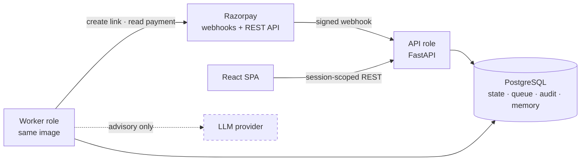

One FastAPI codebase deployed as two process roles against one PostgreSQL database, plus a static SPA; the dashed edge is the entire AI surface. The Architecture section carries the module map, the dependency rule, and the full component graph.

### The Decision Pipeline in One Line

detect → diagnose → baseline → simulate candidates → value-optimize → policy-validate → execute → observe outcome → measure

Two structural facts do most of the work. **The only path to an external effect runs through the Policy_Engine** — there is no other edge into the provider client, and no AI-produced field can reach a policy decision. **Recovery is declared only from an authoritative provider read**, never from a webhook: a webhook is a claim, a fetch is evidence.

### The Nine Decisions That Shape Everything

| Decision | Why it matters in one line | ADR |
| --- | --- | --- |
| Modular monolith, two process roles, not services | Every hard guarantee — exactly-once execution, atomic state-plus-audit, gap-free audit sequences — is a statement about one transaction; a service boundary turns it into a distributed protocol | ADR-1 |
| One PostgreSQL as the single source of truth | Transactions, `SKIP LOCKED`, advisory locks, partial unique indexes, `BIGINT` money, `JSONB`, RLS and append-only triggers are all mechanisms the design names for a reason, and they are all in one engine | ADR-2 |
| Postgres-backed queue and locks; Celery and Redis removed | A job must be enqueued in the same transaction as the state change it follows, and the execution lock must be atomic with the intent insert; a broker or a Redis lock cannot participate in either | ADR-3 |
| Policy_Engine as a pure function over a versioned rule set | Purity makes "identical inputs, identical decision" and AI-independence property-testable in microseconds, and makes any historical decision exactly replayable | ADR-4 |
| Execution-intent record plus reconciliation for exactly-once | The durable intent is committed before the call and its key is the provider's `reference_id`, so both crash windows resolve to at most one external effect without ever repeating the call | ADR-5 |
| LLM advisory-only behind four gates | Contract allow-list, timeout, output schema, content validation — each of the three sanctioned uses has a deterministic fallback, and the system runs fully with the model unavailable | ADR-6 |
| Calibrated Beta priors at cold start, not a trained baseline model | Historical outcomes reflect past intervention, so a model fitted to them estimates intervened recovery and mislabels it baseline; the only unbiased source is the experiment's control arm | ADR-7 |
| Synthetic data with embedded ground truth as the primary evidence vehicle | It is the difference between "Revora reported a lift" and "Revora reported a lift of X where the true lift was Y"; a mandatory null scenario fails the build if measurement manufactures an effect | ADR-8 |
| Always-on container backend, static SPA | Verified webhook constraints — public HTTPS on 80/443, a 5-second response deadline, a long-running worker loop, pooled connections for advisory locks — rule out serverless | ADR-9 |

### What Provider Verification Changed

Five findings from reading the official documentation altered the design materially. The Provider Verification Findings section holds the rest, including what remains unverifiable without account access.

| Finding | Consequence |
| --- | --- |
| The provider publishes a machine-handleable failure taxonomy — `error_code`, `error_reason`, `error_source`, `error_step` — with documented values ([list of payment errors](https://razorpay.com/docs/errors/payments/list), [payment method error parameters](https://razorpay.com/docs/errors/payments/payment-methods-error-parameters/)) | Diagnosis needs no LLM for the common cases. A deterministic mapping table becomes the primary path and the model handles only the unmapped tail. The deterministic hit rate is instrumented as a first-class metric rather than asserted |
| `x-razorpay-event-id` is a unique per-event **request header**, not a payload field ([validate and test webhooks](https://razorpay.com/docs/webhooks/validate-test/)) | Resolves the deduplication key. A single unique constraint on `(merchant_id, provider_event_id)` makes at-least-once delivery safe, and delivery is documented as at-least-once and possibly out of order |
| No idempotency header exists for Payment Link creation ([create a standard Payment Link](https://razorpay.com/docs/api/payments/payment-links/create-standard/)); the documented headers are scoped to other products | Exactly-once is built on `reference_id` plus fetch-by-`reference_id` ([fetch all standard Payment Links](https://razorpay.com/docs/api/payments/payment-links/fetch-all-standard/)). The design depends only on the documented *query* capability, never on a duplicate being rejected — the safer dependency |
| Sustained delivery failure for 24 hours **disables the webhook** ([webhook best practices](https://razorpay.com/docs/webhooks/best-practices/)) | Unmodelled in `requirements.md`, and it means silent total detection loss. A detection-gap backfill over the fetch-all-payments endpoint plus a staleness alert is added, and it must not be cut under time pressure |
| Payment Link creation can send the notification itself via `notify` | Eliminates the separate Communication_Provider: one fewer vendor, one fewer credential set, one fewer consent model, one fewer delivery-confirmation ambiguity. Cost: message content becomes largely the provider's, so the LLM's drafting role shrinks to one field |

### The Eight Recommended Requirements Amendments

Verification produced eight places where `requirements.md` should change rather than be silently designed around. Reasoning for each is in the Recommended Requirements Amendments table in the Requirements Traceability section.

| # | Amendment | Severity |
| --- | --- | --- |
| 1 | Add webhook-disable handling: detection-gap backfill, staleness alert, webhook health surface | **HIGH** |
| 2 | State the MVP executable action set; mark `RETRY`, `DELAYED_RETRY`, `PAYMENT_METHOD_UPDATE`, `PROMISE_TO_PAY_FOLLOW_UP` unavailable | **HIGH** |
| 3 | Resolve the masked-at-write-time versus raw-payload-persistence conflict: encrypted raw event store, masked everywhere else, just-in-time decryption | **HIGH** |
| 4 | Remove the separate Communication_Provider; adjust `MAX_MESSAGE_LENGTH` to sit inside the verified field limit | **MEDIUM** |
| 5 | Add refund handling: capture the refunded amount on every read; label MVP recovery figures gross of refunds | **MEDIUM** |
| 6 | Add explicit partial-payment handling: partial payment is not recovery | **MEDIUM** |
| 7 | Restate the fraud condition as derived from a configured risk-reason set rather than a provider flag field | **LOW** |
| 8 | Tighten `INGEST_ACK_TIMEOUT` to 1500 ms, inside the verified 5-second provider deadline | **LOW** |

Two further items are design positions rather than requirement changes, and a reviewer should accept or reject them explicitly: replacing free-text LLM message drafting with template selection, and defining the Baseline_Workflow with the merchant before any incremental claim is made.

### Four Items Still Unresolved — **[EVIDENCE INSUFFICIENT]**

- **Payment-link listing freshness after create.** Create a link and immediately query it by `reference_id` in test mode, ~50 iterations, recording first-visible latency. Determines whether treating an empty reconciliation read as failure only on the final attempt is sufficient or merely careful.
- **Payment-read consistency lag relative to webhook emission.** In test mode, complete a payment and call the fetch-payment endpoint immediately on receipt of the capture webhook, ~50 iterations, recording how often the read lags. Determines how often the conflict-hold path fires in normal operation.
- **Whether a duplicate `reference_id` is rejected on create.** Create two links with the same `reference_id` in test mode and record the response. The design deliberately does not depend on rejection; this only tells us whether a stronger guarantee is available.
- **Whether any server-side retry or payment-method-update capability exists on the merchant account.** Inspect the products enabled on the account and attempt the operation against a failed payment id, recording the error. A positive result would restore two candidate actions.

### The MVP Floor

Components classified BUILD, without which the hypothesis is not testable at all:

- Event_Ingestion with raw-body signature verification and header-based deduplication
- Detection_Engine, deterministic, failed-payment trigger only
- Recovery_Case_Manager with the legal transition table, counters and the termination guarantee
- Diagnosis_Engine on the deterministic mapping table
- Baseline_Model as Beta posteriors with honest intervals
- Intervention_Simulator as a marked-uncalibrated prior lookup
- Value_Optimizer — this is the product
- Policy_Engine, pure, twelve ordered checks, versioned
- Execution_Engine with execution intents and reconciliation
- Razorpay client, three endpoints, explicit response classification
- Outcome_Monitor with authoritative reads
- Audit_Log, append-only, gap-free sequences, correlation ids
- Experiment_Engine: assignment, suppression, version freezing, labels
- Metrics_Engine
- Synthetic generator with embedded ground truth and the four mandatory scenarios
- Merchant_Dashboard: case list, case detail, metrics, unresolved groups, experiment result
- Postgres job queue and sweepers, plus the detection-gap backfill
- Recovery_Memory tables with provenance and intervention-status labels

Five of the fourteen MVP items named in `requirements.md` were judged over-scoped for a hackathon-scale proof and are built in reduced form; the reductions, the deferrals and the removals are itemised in the Component Classification subsection of the Critical Review section.

### What This Design Refuses to Claim

- **Incremental revenue is `NOT_ESTABLISHED`** — with no numeric value, not zero — unless a completed, adequately powered, uncontaminated, non-synthetic experiment reports a lift interval lying entirely above zero.
- **Observed recovery carries `CAUSALITY_NOT_ESTABLISHED`** until such an experiment exists. "We acted and the money arrived" is not "we caused it," and the dashboard says so beside the figure.
- **Synthetic evidence validates the measurement machinery only.** It shows that Revora recovers a known effect and correctly refuses an absent one. Any effect-size claim derived from it is circular, because the ground truth is something we wrote.
- **Recovery figures are gross of refunds in MVP** and labelled as such. The refunded amount is captured on every read so the restatement is possible later; silently overstating recovery is not acceptable for a system whose whole claim is measurement honesty.
- **Full WCAG 2.1 AA conformance is a target, not a verified claim.** Automated tooling covers a subset of success criteria; full validation requires manual testing with assistive technologies and expert accessibility review, neither of which this design has performed.

### The One Open Question That Decides Whether the Central Number Means Anything

The incremental claim is measured against the Baseline_Workflow, and the Baseline_Workflow is currently an **[ASSUMPTION]** — defaulted to "no automated recovery action; observe the case to its terminal state," which is the most favourable possible comparison for Revora. A merchant who already sends a reminder email has a baseline that recovers something, and against that baseline the measured lift shrinks and may vanish. Every other correctness concern in this document is engineering that can be verified; this one is a judgement call, it is currently unmade, and it determines whether the central number means anything. The Single Most Important Thing in This Review subsection states the case in full.

### Where to Read Next

| If you want | Read |
| --- | --- |
| What was verified about Razorpay and what broke | the Provider Verification Findings section |
| The shape of the system | the Architecture section, the Components and Interfaces section, the Data Flow section |
| Why an action cannot execute twice | the Execution Flow section |
| Why AI cannot authorize anything | the AI Boundary section, the Policy Boundary section |
| Why a recovery number is trustworthy | the Outcome Verification Flow section, the Experiment and Evaluation Architecture section, the Audit Architecture section |
| Which invariants are enforced by the schema rather than by code | the Data Models section |
| What happens when something breaks | the Failure Handling section, the Error Handling section |
| The threat model, the PII boundary, and the risks accepted for MVP | the Security Boundaries section |
| The formal claims the code must satisfy | the Correctness Properties section |
| How those claims are tested, and what testing cannot establish | the Testing Strategy section |
| Why each significant choice was made, and what would reverse it | the Architecture Decision Records section |
| What I think is wrong with this design | the Critical Review section |
| Which design section satisfies which requirement | the Requirements Traceability section |

---

## Overview

Revora answers one question per at-risk payment: **which intervention, if any, is likely to make a meaningful economic difference?** Not "will this customer pay." A customer with a high natural recovery probability warrants no intervention, and Revora must be able to say so and prove it.

This document is the design for MVP Phase 1 as scoped by `requirements.md`. That document is the authority. This document does not restate acceptance criteria; it references them (`R8.C1-2` means Requirement 8, criteria 1 and 2) and designs the mechanism that satisfies them.

### Design Goals, in Priority Order

1. **Correct** — no duplicate charge, no duplicate message, no recovery claimed that did not arrive.
2. **Auditable** — every decision reconstructable from persisted records, including the alternatives rejected.
3. **Measurable** — observed recovery separated from incremental recovery, with the causal claim gated on a controlled comparison.
4. **Simple** — a modular monolith on one Postgres. Component count is not a success metric.
5. **Scalable later** — module boundaries chosen so extraction is possible, not so extraction is required.

### Explicit Non-Goals for Phase 1

Voice, multilingual channels, agent swarms/frameworks, Kafka, Kubernetes, microservices, vector databases, RAG, additional communication channels, automated retraining without human promotion, multi-currency valuation, and detection triggers other than failed payment. These are listed as deferred in `requirements.md` "Scope Boundaries" and are absent from this design by intent, not omission.

### Positioning

The proposed differentiation is **economic decision quality**: ranking actions by expected net incremental value and gating the causal claim on a controlled experiment. Intelligent retry, dunning sequencing, and messaging automation are existing, mature products. Revora claims no uniqueness in action automation. **[INFERENCE]** — competitor internals were not audited; differentiation is a hypothesis this design is built to test, not an established fact.

### Evidence Discipline

Same tags as `requirements.md`: **[FACT]** verifiable from cited documentation or from this design's own arithmetic; **[ASSUMPTION]** a working premise chosen to make the design buildable and testable; **[INFERENCE]** derived from stated premises; **[EVIDENCE INSUFFICIENT]** unknown at design time, with the resolving test named.

### Reading Map

| If you want | Read |
| --- | --- |
| What was verified about Razorpay and what broke | the Provider Verification Findings section |
| The shape of the system | the Architecture section, the Components and Interfaces section, the Data Flow section |
| Why an action cannot execute twice | the Execution Flow section |
| Why AI cannot authorize anything | the AI Boundary section, the Policy Boundary section |
| Why a recovery number is trustworthy | the Outcome Verification Flow section, the Experiment and Evaluation Architecture section, the Audit Architecture section |
| What I think is wrong with this design | the Critical Review section |
| Why each choice was made | the Architecture Decision Records section |

---

## Provider Verification Findings

`requirements.md` deliberately deferred eleven items to design-phase verification and referenced the provider generically. This section closes what can be closed against current official documentation and states plainly what cannot.

### Method

Official Razorpay documentation was read directly. No endpoint, header, event name, field name, error code, or status value below is invented. Where documentation is silent, the item is tagged **[EVIDENCE INSUFFICIENT]** with the test that would resolve it. Content from sources is paraphrased.

### Resolution Status of the Eleven Deferred Items

| # | Deferred item (requirements.md) | Status | Where |
| --- | --- | --- | --- |
| 1 | Webhook event catalogue, signature scheme, payload fields, delivery guarantees, redelivery schedule | **RESOLVED** | the Webhook Events, Signature Verification and Delivery Semantics items |
| 2 | Recovery action capabilities and their idempotency semantics | **PARTIALLY RESOLVED** — Payment Links confirmed; no server-side retry or payment-method-update found; no idempotency header for link creation | the Payment Links item, the unavailable Candidate_Actions item |
| 3 | Authoritative payment state read and consistency guarantees | **RESOLVED for capability, [EVIDENCE INSUFFICIENT] for consistency guarantee** | the Authoritative Payment State Read item |
| 4 | Communication_Provider selection, consent model, delivery confirmation | **RESOLVED by elimination** — Razorpay sends the link notification; no separate provider in MVP | the Payment Failure Taxonomy item, the Communication_Provider elimination item |
| 5 | Real-world baseline / intervention rates and cost figures | **[EVIDENCE INSUFFICIENT]** — remains unresolved; design treats every figure as a configured prior | the ML Boundary section |
| 6 | Required sample size per experiment arm | **[EVIDENCE INSUFFICIENT]** — computed at experiment definition time, not assumed | the Sample Size and Analysis subsection |
| 7 | Calibration tolerance, confidence floor, minimum segment sample size | **[EVIDENCE INSUFFICIENT]** — remain configuration | the Calibration Report subsection |
| 8 | Statutory / card-network obligations on stored data and outbound contact | **[EVIDENCE INSUFFICIENT]** — out of my competence to assert; engineering controls only, no compliance claim | the Security Boundaries section |
| 9 | Fraud / risk flag availability and semantics | **PARTIALLY RESOLVED** — no dedicated risk-flag field found on the payment entity; a risk failure reason exists | the Fraud and Risk Signal item |
| 10 | Permitted masking disclosure length | **[EVIDENCE INSUFFICIENT]** — no documentary basis found; and it collides with link notification, see the masked-at-write-time conflict item |
| 11 | Audit retention floor / ceiling | **[EVIDENCE INSUFFICIENT]** — remains configuration |

### Verified Provider Surface

#### Webhook Events Revora Subscribes To **[FACT]**

From the [full Razorpay webhook event list](https://razorpay.com/docs/webhooks/all) and the [payments webhook events page](https://razorpay.com/docs/webhooks/payments/):

| Event | Role in Revora |
| --- | --- |
| `payment.failed` | Primary detection trigger (R1) |
| `payment.captured` | Recovery signal — triggers authoritative read (R10) |
| `payment.authorized` | Recovery precursor; treated as a signal, never as recovery |
| `order.paid` | Redundant recovery signal; carries both order and payment entities |
| `payment_link.paid` | Confirms the executed PAYMENT_LINK action produced a payment |
| `payment_link.partially_paid` | Partial payment — explicitly **not** recovery |
| `payment_link.expired`, `payment_link.cancelled` | Terminates the link's usefulness |

Not subscribed in MVP: downtime, dispute, refund, subscription, settlement, payout, QR, virtual account events. `payment.downtime.started` is noted as a **BUILD LATER** signal for the WAIT action (the Critical Review section).

#### Signature Verification **[FACT]**

Razorpay sends the hash in the `X-Razorpay-Signature` header, computed as HMAC-SHA256 with the dashboard-configured **webhook secret** as key and the **webhook request body** as message ([validate and test webhooks](https://razorpay.com/docs/webhooks/validate-test/)). The webhook secret is distinct from the API key secret. The documentation is explicit that the raw request body must be used, because a re-encoded JSON string will not match ([webhook FAQs](https://razorpay.com/docs/webhooks/faqs/)).

Design consequences:
- The FastAPI ingestion route reads `await request.body()` (bytes) and verifies before any parse. No Pydantic model, no middleware, and no proxy may re-serialize the body. This satisfies R1.C1 literally.
- Comparison uses `hmac.compare_digest` (constant time).
- Documentation states that when the webhook secret is rotated, retries of older events must be validated with the old secret. **Design decision:** the credential store holds an ordered list of active webhook secrets per merchant; verification succeeds if any active secret matches; rotation removes the old secret only after the 24-hour redelivery window. This is not in `requirements.md` and is a recommended addition.

#### Delivery Semantics **[FACT]**

From [webhook best practices](https://razorpay.com/docs/webhooks/best-practices/) and [validate and test](https://razorpay.com/docs/webhooks/validate-test/):

| Property | Verified behaviour | Design consequence |
| --- | --- | --- |
| Duplicate delivery | At-least-once semantics; the same event may arrive multiple times | Dedup is mandatory, not defensive (R1.C4) |
| Unique event identifier | The `x-razorpay-event-id` request header is unique per event | **This resolves `provider_event_id`.** It is a header, not a payload field — a detail the design must get right |
| Response deadline | If the server accepts but does not respond within 5 seconds, the session is marked timeout and the event is resent | `INGEST_ACK_TIMEOUT` of 3000 ms is compatible; the webhook auto-disable item recommends tightening |
| Failure handling | Any non-2xx is a delivery failure; retried with exponential backoff for 24 hours from event creation | Confirms the R16.C3 assumption that a 503 earns redelivery |
| Disable logic | If deliveries keep failing for 24 hours, the webhook is **disabled** and must be re-enabled from the dashboard | **Not accounted for in requirements.md** — see the webhook auto-disable item |
| Ordering | Events may arrive out of order; the documentation gives `payment.authorized` before `payment.captured` as an order that is not guaranteed | Confirms the need for R1.C7 out-of-order handling |
| Transport | Public HTTPS URL, ports 80/443 only, TLS 1.2+; Razorpay publishes webhook source IPs; several tunnelling and request-bin domains are blacklisted (including `ngrok.io`, `webhook.site`, `beeceptor.com`) | Constrains deployment (the Deployment Architecture section) and local development (use `zrok`, which the docs point to) |

#### Payment Links — The One Real Recovery Action **[FACT]**

From [create a standard Payment Link](https://razorpay.com/docs/api/payments/payment-links/create-standard/) and [fetch all standard Payment Links](https://razorpay.com/docs/api/payments/payment-links/fetch-all-standard/):

- Creation takes `amount` **in currency subunits** (integer minor units), `currency`, `description`, `reference_id`, `customer{name,email,contact}`, `expire_by` (Unix; cannot exceed six months from creation), `notify{sms,email}`, `reminder_enable`, `notes`, `callback_url`/`callback_method`.
- `reference_id` is documented as required to be **unique for each Payment Link**, max 40 characters.
- Response carries `id` (`plink_…`), `short_url`, `status` ∈ {`created`, `partially_paid`, `expired`, `cancelled`, `paid`}, `amount_paid`, and a `payments[]` array that is populated only after a payment is captured.
- **Fetch-all supports querying by `reference_id`** (and by `payment_id`).

Two findings that shape the Execution Flow section materially:

1. **There is no documented idempotency header for Payment Link creation.** Razorpay documents `X-Payout-Idempotency` for [RazorpayX payout creation](https://razorpay.com/docs/api/x/payout-idempotency/make-request) and `X-Transfer-Idempotency` for Route transfers. Neither applies to Payment Links. **[FACT]** as of the documentation read; **[EVIDENCE INSUFFICIENT]** on whether an undocumented mechanism exists.
2. **`reference_id` plus fetch-by-`reference_id` is a sufficient substitute.** Revora sets `reference_id = Idempotency_Key`. After any uncertain create, `GET /v1/payment_links?reference_id=<key>` answers "does this effect already exist?" authoritatively. This is the reconciliation read that makes exactly-once achievable without provider-side idempotency. **[INFERENCE]** — that a duplicate `reference_id` is *rejected* is not confirmed by the docs, only that it must be unique; the design therefore does **not** depend on rejection, only on the ability to query. That is the safer dependency.

#### Authoritative Payment State Read **[FACT]**

[Fetch a payment with ID](https://razorpay.com/docs/api/payments/fetch-with-id) returns the payment entity. Verified `status` enumeration: `created`, `authorized`, `captured`, `refunded`, `failed`. A boolean `captured` and integer `amount`, `amount_refunded` are also returned.

Design consequences:
- "Verified payment state is paid or captured" (R10) maps to `status == "captured"` (optionally `authorized` with `captured == true`). `authorized` alone is **not** recovery — the money is not captured.
- `refunded` is a state `requirements.md` does not model. See the refund-state item.
- **[EVIDENCE INSUFFICIENT]** on read-after-write consistency of this endpoint relative to webhook emission. Resolving test: in test mode, complete a payment, and on receipt of `payment.captured` immediately call fetch-payment, repeated ~50 times, recording how often the read lags the webhook. Until that is measured, the design treats a lagging read as a `PAYMENT_STATE_CONFLICT` and retries (R10.C6, R10.C13) rather than assuming immediate consistency.

#### Payment Failure Taxonomy — The Real Risk_Cause Mapping Inputs **[FACT]**

The payment entity in webhook payloads carries `error_code`, `error_description`, `error_reason`, `error_source`, `error_step` (confirmed present, valued `null` on success, in the [Payment Links webhook payload sample](https://razorpay.com/docs/webhooks/payment-links/)). The [errors overview](https://razorpay.com/docs/errors/) documents the error object as `code`, `description`, `field`, `source`, `step`, `reason`, `metadata{payment_id, order_id}`, with `code` ∈ {`BAD_REQUEST_ERROR`, `GATEWAY_ERROR`, `SERVER_ERROR`}.

`source` values are method-specific ([payment method error parameters](https://razorpay.com/docs/errors/payments/payment-methods-error-parameters/)): cards {`customer`, `business`, `internal`, `gateway`, `issuer_bank`}; netbanking {`customer`, `business`, `internal`, `issuer_bank`}; UPI {`customer`, `business`, `internal`, `customer_psp`, `gateway`, `network`, `issuer_bank`, `beneficiary_bank`}; wallet {`customer`, `business`, `internal`, `issuer`}.

`step` values: `payment_initiation`, `card_enrollment_check`, `payment_authentication`, `payment_authorization`, `payment_capture`, `payment_eligibility_check`.

`reason` values come from the [list of payment errors](https://razorpay.com/docs/errors/payments/list). The deterministic mapping table required by R3.C1 is populated from those real values (the Deterministic Layer subsection holds the table). This is the single most valuable verification result in this document: **the diagnosis layer needs no LLM for the common cases**, because the provider already tells us the cause in a machine-handleable field.

#### Fraud and Risk Signal **[FACT] / [EVIDENCE INSUFFICIENT]**

No dedicated fraud-flag or risk-score field was found on the payment entity. What exists is the failure reason `payment_risk_check_failed`, documented as a decline from risk checks performed by Razorpay, the gateway, or the issuer, with `source` indicating where the check failed. Also relevant: `compliance_violation`, `debit_instrument_blocked`.

Design consequence: `FRAUD_OR_RISK_SIGNAL` is derived from `error_reason` ∈ {`payment_risk_check_failed`, `compliance_violation`} rather than from a provider flag field. `requirements.md` R8.C5 speaks of "a Payment_Provider fraud or risk flag"; the derived fraud-condition item recommends restating that as a derived condition.

#### API Authentication **[FACT]**

[Basic auth](https://razorpay.com/docs/api/authentication/): `Authorization: Basic base64(key_id:key_secret)`. Same keys serve Payment Gateway and RazorpayX, so key regeneration has blast radius beyond Revora — worth telling the merchant before onboarding.

### Contradictions with requirements.md, and Recommended Amendments

Each item below is a place where verified provider behaviour conflicts with, or is not covered by, `requirements.md`. Per instruction, I flag rather than silently design around.

#### Webhook Auto-Disable Is Unmodelled — **HIGH severity**

**Conflict.** R16.C3 responds 503 when persistence is unavailable and depends on redelivery. Redelivery is confirmed, but so is this: sustained failure for 24 hours **disables the webhook**. `requirements.md` has no requirement covering a disabled webhook, and a disabled webhook means silent, total detection loss — the exact failure mode Revora exists to prevent.

**Recommended amendment.** Add to Requirement 1: a periodic **detection-gap backfill** that lists provider payments over a lookback window via the fetch-all-payments endpoint and ingests any failed payment with no corresponding persisted event, plus an operational alert when no webhook has been received for longer than a configured interval. Also add a `WEBHOOK_HEALTH` surface to the dashboard.

Secondary recommendation: tighten `INGEST_ACK_TIMEOUT` from 3000 ms to **1500 ms [ASSUMPTION]**. The verified provider deadline is 5 s; a 3 s internal budget leaves little margin for TLS, queueing and network on a small instance, and exceeding it costs a duplicate delivery — survivable, but noisy.

#### Two Candidate_Actions Have No Verified Provider Capability — **HIGH severity**

**Conflict.** `Candidate_Action` includes `RETRY`, `DELAYED_RETRY`, and `PAYMENT_METHOD_UPDATE`. I found **no documented API to server-side retry a failed one-off Payment Gateway payment**. A failed payment is terminal at the provider; a new attempt is a new payment initiated by the customer. Automatic retry is documented in the *Subscriptions* product, which is a different object and out of MVP scope. `PAYMENT_METHOD_UPDATE` likewise has no one-off-payment analogue found.

**[EVIDENCE INSUFFICIENT]** on whether a merchant-account-specific capability exists. Resolving test: attempt a retry via the API on a `failed` payment id in test mode and record the error; check whether the merchant account has the "Optimizer" or subscription products enabled.

**Recommended amendment.** Keep the enumeration (it is the vocabulary of the value model, and R6.C9 already provides the `UNAVAILABLE` mechanism), but state in Requirement 6 that for MVP the *executable* action set is:

`DO_NOTHING`, `WAIT`, `PAYMENT_LINK`, `CUSTOMER_MESSAGE`, `HUMAN_ESCALATION`

with `RETRY`, `DELAYED_RETRY`, `PAYMENT_METHOD_UPDATE`, `PROMISE_TO_PAY_FOLLOW_UP` marked `UNAVAILABLE` at simulation time. They still appear in the Recommendation with their estimates, which is honest and actually strengthens the explainability story: the dashboard can show "retry would have been considered but is not available on this account."

This is not a downgrade of the hypothesis. The hypothesis is about *choosing* among actions by net value, including choosing nothing. Three executable actions plus two null actions is enough to test it.

#### The Communication_Provider Can Be Eliminated — **simplification, MEDIUM severity**

**Finding.** Payment Link creation accepts `notify: {sms: true, email: true}`, which makes Razorpay deliver the link notification, and `reminder_enable` for follow-up reminders. **[FACT]**

**Recommended amendment.** Delete the separate `Communication_Provider` from MVP scope. `CUSTOMER_MESSAGE` becomes "create a Payment Link with notification enabled," which collapses R9.C14 (Communication_Provider unavailable) into the single payment-link failure path, removes a vendor, removes a set of credentials, removes a consent model to design, and removes an entire class of delivery-confirmation ambiguity.

Cost of this simplification, stated honestly: message *content* is then largely Razorpay's, so R4.C7 content validation applies only to the `description` field we supply, and the LLM's message-drafting role shrinks to drafting that description. I consider that a good trade — the LLM was the riskiest part of the messaging path.

**Consequence for R4.C7.** `MAX_MESSAGE_LENGTH` of 480 characters should be replaced by the verified provider limit: `description` supports up to 2048 characters. Recommend `MAX_MESSAGE_LENGTH = 300 [ASSUMPTION]` as a self-imposed bound well inside the provider limit.

#### Masked-at-Write-Time Collides with Link Notification — **HIGH severity, genuine conflict**

**Conflict.** R17.C6 requires customer contact identifiers stored masked or tokenized at write time, retaining at most `MASK_DISCLOSURE_LENGTH` (4) characters in clear. R1.C3 requires the **raw payload** to be persisted durably. The raw `payment.failed` payload contains `contact` and `email` in clear. And creating a notifying Payment Link requires the contact in clear. All three cannot hold as literally written.

**Recommended resolution** (needs merchant/legal confirmation, hence flagged rather than assumed):
- `webhook_event.raw_payload` is stored **encrypted at rest** with an application-managed key (AES-256-GCM, key from the secret store), not in clear. It is the only PII holder.
- `recovery_case` and every derived table store **only** masked contact (`+91XXXXXX7890`-style, last 4) plus a lookup pointer to the encrypted event row.
- The Execution_Engine decrypts the contact **just in time** inside the execution transaction, passes it to Razorpay, and never persists or logs it.
- `Audit_Record` and application logs get masked values only (R11.C8, R17.C7), which remains satisfiable.

**Recommended amendment.** Restate R17.C6 as "stored masked outside the encrypted raw event store," and add a requirement that the raw event store is encrypted at rest with a documented key custody model. The permitted disclosure length of 4 remains **[EVIDENCE INSUFFICIENT]**.

#### `refunded` Is an Unmodelled Payment State — **MEDIUM severity**

**Conflict.** The verified status enumeration includes `refunded`, and the payment entity carries `amount_refunded` and `refund_status`. A Recovery_Case can therefore reach `RECOVERED` and then have the money returned. `requirements.md` R12 computes `observed_recovered_revenue` from confirmed recovered amounts with no reversal path, so reported recovery can overstate money actually kept.

**Recommended amendment.** Either (a) add to Requirement 10 a reconciliation that records a recovery reversal when a subsequent authoritative read shows `refunded` or non-zero `amount_refunded`, and to Requirement 12 that reported recovery is net of refunds for the period containing the refund; or (b) explicitly scope refunds out of Phase 1 measurement and label the metric accordingly. I recommend (a) at the *data* level (capture `amount_refunded` on every read, which is free) and (b) at the *metric* level for MVP, with the label `RECOVERY_GROSS_OF_REFUNDS`. Designing the full restatement is not worth MVP effort; silently overstating recovery is not acceptable for a system whose whole claim is measurement honesty.

#### Fraud Flag Should Be a Derived Condition, Not a Provider Field — **LOW severity**

Restate R8.C5's "carries a Payment_Provider fraud or risk flag" as "the persisted `error_reason` of the Recovery_Case is a member of the configured risk-reason set," with that set initialized to {`payment_risk_check_failed`, `compliance_violation`}. Semantically identical, and implementable against a field that verifiably exists.

#### Payment Link Expiry Cannot Exceed Six Months — **INFORMATIONAL**

`RECOVERY_WINDOW_DURATION` default is 168 hours, far inside the six-month link ceiling. No conflict, but the Execution_Engine must clamp `expire_by` to the Recovery_Window end rather than leaving the six-month default, or a link outlives the window in which policy permits payment — which would let a customer pay through a link after the case expired. Handled in the Why the Lock Exists subsection.

#### Partial Payment Must Not Count as Recovery — **MEDIUM severity, gap not conflict**

`payment_link.partially_paid` exists and `accept_partial` is a creation parameter. `requirements.md` has no notion of partial recovery. **Design decision:** Revora creates links with `accept_partial: false` **[ASSUMPTION]**, and treats `payment_link.partially_paid` and `status == "partially_paid"` as **not recovered**, recording a `PARTIAL_PAYMENT_OBSERVED` audit record and holding the case in `WAITING_FOR_OUTCOME`. Recommend adding this to Requirement 10 so the exclusion is explicit rather than incidental.

### What Remains Unverifiable Without Account Access

| Item | Resolving action |
| --- | --- |
| Fetch-payment consistency lag after webhook | Test-mode measurement described in the Authoritative Payment State Read item |
| Whether duplicate `reference_id` is rejected on create | Create two links with the same `reference_id` in test mode; record response |
| Whether any retry / payment-method-update capability exists for this account | Inspect enabled products on the merchant account; attempt and record the error |
| Whether Razorpay's link notification satisfies the merchant's consent obligations | Legal/merchant confirmation; outside engineering scope |
| Real recovery rates, action costs, risk and customer costs | Merchant production data; unavailable at hackathon scale — hence the Synthetic Dataset subsection synthetic evidence |

---

## Architecture

### Shape

One FastAPI process serving HTTP, one worker process running the same codebase, one Postgres database, one React SPA. That is the whole system.

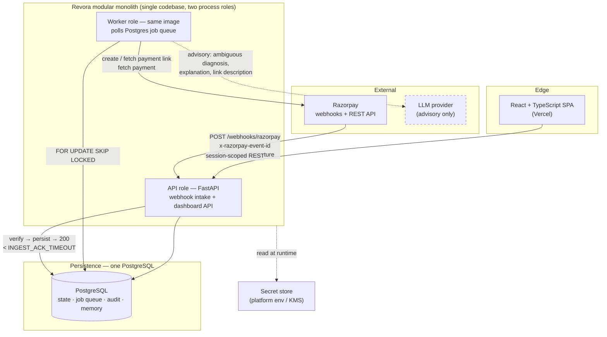

The dashed edge to the LLM is the entire AI surface. It is reachable only from the worker role, only on paths that have a deterministic fallback, and never from the policy or execution decision itself (the AI Boundary section, the Policy Boundary section).

### Module Map and the Dependency Rule

Inside one Python package, modules are separated by import direction. The rule is enforced by an import-linter contract in CI, not by convention.

```
revora/
  platform/        # config, db session, clock, logging, crypto, secret access
  domain/          # pure: enums, value objects, money, state table, policy rules
  persistence/     # SQLAlchemy models, repositories, migrations
  ingestion/       # signature verify, canonicalize, dedup, quarantine
  detection/       # deterministic at-risk rules
  cases/           # Recovery_Case_Manager: transitions, counters, locks
  diagnosis/       # mapping table, LLM-assisted fallback
  reasoning/       # LLM adapter: prompt contracts, schema validation, fallback
  estimation/      # Baseline_Model + Intervention_Simulator
  optimizer/       # Value_Optimizer: net value arithmetic, selection
  policy/          # Policy_Engine: pure function, versioned rule sets
  execution/       # Execution_Engine, execution intents, reconciliation
  providers/       # Razorpay client, fake provider for tests
  outcome/         # Outcome_Monitor
  experiment/      # assignment, freezing, analysis
  metrics/         # Metrics_Engine
  audit/           # Audit_Log writer, sequence allocation
  memory/          # Recovery_Memory, model versions and promotion
  synthetic/       # seeded dataset + ground-truth generator
  jobs/            # queue, scheduler, worker entrypoints
  api/             # FastAPI routers, auth, DTOs
```

Allowed import direction: `api`/`jobs` → feature modules → `cases`/`persistence`/`domain`/`platform`. Forbidden and CI-enforced:

- `policy` may import `domain` and `platform` only. It may **not** import `reasoning`, `estimation`, or `optimizer`. This is the structural reason no AI field can reach a Policy_Decision (the Why No AI Field Can Reach It subsection).
- `domain` imports nothing but the standard library. Money arithmetic and the state table are therefore testable with zero setup.
- No feature module imports another feature module's internals; cross-module calls go through the owning module's public functions.

Why this is a monolith and not services: see ADR-1 in the Architecture Decision Records section.

### Technology Summary

| Concern | Choice | One-line justification (full reasoning in the Technology Selection and Justification section) |
| --- | --- | --- |
| Backend | Python 3.12 + FastAPI | Async webhook intake with a strict-ack budget; same language as the ML layer |
| Validation | Pydantic v2 | Provider payloads and LLM outputs both need schema-at-boundary; R4 demands it |
| DB | PostgreSQL 15+ | Transactions, `SKIP LOCKED`, `JSONB`, `BIGINT`, RLS — everything the design needs in one engine |
| ORM / migrations | SQLAlchemy 2.0 + Alembic | Explicit transaction boundaries, which the Execution Flow section depends on |
| Job queue | **Postgres-backed, `FOR UPDATE SKIP LOCKED`** | Transactional enqueue with the state change; no dual-write. **Celery + Redis removed** — ADR-3 |
| Locking | **Postgres row locks + advisory locks** | The execution lock must be in the same transaction as the intent record. **Redis removed** — ADR-3 |
| ML | scikit-learn + NumPy | Logistic regression and isotonic calibration; nothing heavier is warranted |
| LLM | Provider-adapter interface, OpenAI-compatible first | Advisory only, behind a timeout and a schema gate; swappable by design |
| Provider client | `httpx` + hand-written thin client | Explicit timeouts and response classification; the SDK hides what the Execution Flow section must see |
| Frontend | React 18 + TypeScript + Vite | Table-and-detail app; no SSR need |
| Tests | pytest + **Hypothesis** | 30 correctness properties need a real PBT engine and a stateful model — the Testing Strategy section |
| Deploy | Vercel (SPA) + Render Docker (API + worker) | Verified webhook constraints: public HTTPS, ports 80/443, no cold-start risk — ADR-9 |

---

## Components and Interfaces

Component graph, with the trust boundary drawn where it matters:

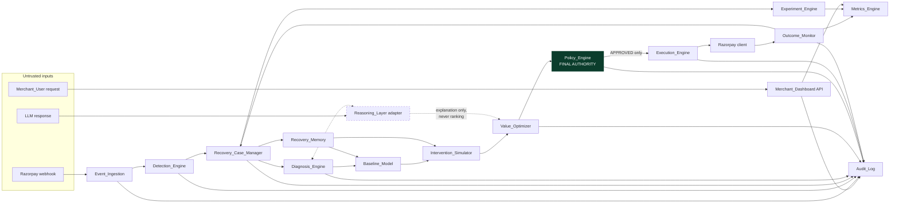

Note what is absent: no arrow from `RSN` into `POL`, and no arrow from `RSN` into `EXE` except through content validation. That absence is the design.

---

### Event_Ingestion

- **PURPOSE.** Turn untrusted HTTP into exactly one durable, canonical, deduplicated Payment_Event, and get out of the way inside the ack budget. Satisfies R1.C1–C7, R1.C13, R16.C3, R16.C10–C14.
- **INPUT.** `POST /webhooks/razorpay/{merchant_slug}`: raw body bytes, `X-Razorpay-Signature`, `x-razorpay-event-id`.
- **PROCESSING.** (1) read raw bytes, reject over `MAX_INBOUND_PAYLOAD_SIZE`; (2) HMAC-SHA256 verify against every active webhook secret for the merchant, constant-time compare, before any parse; (3) require `x-razorpay-event-id`, else treat as unverifiable; (4) parse to canonical `PaymentEventCanonical` (Pydantic), converting Unix timestamps to UTC instants; (5) round-trip self-check per R16.C11; (6) single `INSERT … ON CONFLICT (merchant_id, provider_event_id) DO NOTHING` carrying the encrypted raw payload, a generated `correlation_id`, and an enqueued detection job **in one transaction**; (7) respond 200. No detection work happens on the request path.
- **OUTPUT.** `webhook_event` row (or a no-op on duplicate), a `job` row, audit records `SIGNATURE_REJECTED` / `DUPLICATE_EVENT_DISCARDED` / `MALFORMED_EVENT` / `OUT_OF_ORDER_EVENT`.
- **TECHNOLOGY.** FastAPI route with `Request.body()`, `hmac`, Pydantic v2, SQLAlchemy Core insert.
- **WHY THIS TECHNOLOGY.** The verified requirement to hash the exact bytes rules out any framework path that parses first. FastAPI gives byte-level access and async I/O in the same handler. The single-statement upsert is what makes R1.C4's atomicity claim true rather than aspirational.
- **MVP.** Yes — the system does not exist without it.
- **FAILURE MODES.** Persistence down → 503, redelivery expected, and 24 h of that disables the webhook (the webhook auto-disable item) → mitigated by backfill. Signature mismatch after secret rotation → mitigated by multi-secret verification. Body mutated by a proxy → signature fails on every event; detected by a startup canary that signs a known body and verifies it end to end. Clock skew → all comparisons are on stored UTC instants (R16.C9).
- **SECURITY.** This is the only unauthenticated endpoint in the system. Rate limited per source (R17.C12). Never logs the raw body. Returns no detail on failure. Payload size capped before hashing to bound CPU. Merchant is identified by URL slug **and** by the secret that verified — a signature valid under merchant A's secret cannot be attributed to merchant B.

### Detection_Engine

- **PURPOSE.** Decide, deterministically and without AI, whether a persisted event is revenue at risk, and open at most one case per payment. R1.C8–C12, R1.C14–C15.
- **INPUT.** A persisted canonical event plus current case state for the payment id.
- **PROCESSING.** Rule set evaluated in order, each rule identified: payment status is `failed`; `amount >= MIN_DETECTION_AMOUNT`; currency in the supported set; no verified captured state for the payment id. Deferred triggers (abandonment, promise-to-pay, window expiry) get verdict `DEFERRED_TRIGGER` and no case. On `AT_RISK`, `INSERT … ON CONFLICT (merchant_id, provider_payment_id) WHERE state NOT IN (terminal) DO NOTHING` — a partial unique index makes "exactly one open case per payment" a database guarantee, not a code guarantee.
- **OUTPUT.** `detection_verdict` row (always exactly one per event, R1.C14), possibly one `recovery_case`, audit record naming applied rule ids.
- **TECHNOLOGY.** Plain Python predicates over the canonical model; partial unique index in Postgres.
- **WHY.** Rules are a dozen comparisons. A rules engine, a DSL, or an LLM here would add failure modes and remove nothing. R1.C12 forbids AI outright.
- **MVP.** Yes.
- **FAILURE MODES.** Concurrent workers on duplicate deliveries → the partial unique index resolves it. A `payment.captured` arriving before `payment.failed` (verified possible) → out-of-order guard, no case opened for an already-paid payment.
- **SECURITY.** Reads only persisted fields; touches no PII beyond amount and identifiers.

### Recovery_Case_Manager

- **PURPOSE.** Own case state, the legal transition table, counters, and the guarantee that every case terminates. R2 in full; R16.C1–C2, C6, C7.
- **INPUT.** Transition requests `(case_id, expected_version, target_state, reason)` from any component; scheduled lifecycle evaluations.
- **PROCESSING.** One function, `apply_transition`, is the only writer of `recovery_case.state`. It: `SELECT … FOR UPDATE` the case row; check `expected_version` (optimistic concurrency, R16.C7); look up `(from, to)` in the static transition table in `domain`; apply counter effects; allocate the audit sequence number; write state, version, and audit record in **one transaction** (R16.C1). Illegal transition → rejection, nothing written except an `ILLEGAL_TRANSITION` audit record in a separate transaction.
- **OUTPUT.** Updated case row, audit record, follow-on job enqueued in the same transaction.
- **TECHNOLOGY.** SQLAlchemy explicit transaction; the transition table is a frozen `dict[tuple[State, State], TransitionRule]` in `domain`.
- **WHY.** A single-writer function with a static table is the cheapest way to make R2.C2–C3 provable by property test (P5). A workflow engine would move this invariant into a tool I cannot property-test cheaply.
- **MVP.** Yes.
- **FAILURE MODES.** Two writers → version conflict, one wins, loser re-reads (P-VERSION_CONFLICT audit). Crash mid-transaction → nothing readable, prior state stands (R16.C2). Worker never runs → the lifecycle sweeper is the safety net: any non-terminal case is evaluated at least once per `LIFECYCLE_EVALUATION_INTERVAL` (R2.C13) and expiry is applied from persisted timestamps, so termination does not depend on a job having survived.
- **SECURITY.** All reads scoped by `merchant_id`. Counters are monotonic and never decremented, so a bound cannot be reset by replaying an event.

### Diagnosis_Engine

- **PURPOSE.** Determine Risk_Cause, cheaply and repeatably, from the provider's own error fields; use the LLM only where the structured data genuinely does not decide. R3 in full.
- **INPUT.** Persisted `error_code`, `error_reason`, `error_source`, `error_step`, `method`, and case metadata. No provider call (R3.C1).
- **PROCESSING.** Look up the mapping table (the Deterministic Layer subsection) keyed on `error_reason` first, then `(error_source, error_step)`, then `error_code`. Exactly one match → record `method=DETERMINISTIC`, `confidence=1.0`. No match, conflicting matches, or a rule flagged as needing interpretation → one LLM request with a strict schema and `REASONING_TIMEOUT`; accepted output records `method=AI_ASSISTED` with confidence capped at 0.99; rejected output records `UNKNOWN`/`0.0`/`REJECTED_AI_OUTPUT`; timeout records `UNKNOWN`/`0.0`/`FALLBACK_UNKNOWN`.
- **OUTPUT.** Exactly one active `diagnosis` row per decision cycle with `(cause, confidence, evidence, method)`; audit record.
- **TECHNOLOGY.** Static mapping table in `domain`; the LLM path goes through the `reasoning` adapter.
- **WHY.** The Payment Failure Taxonomy item is the justification: the provider already publishes a machine-handleable failure reason. **[INFERENCE]** — I expect the deterministic path to cover the large majority of real failures, since `insufficient_funds`, `card_expired`, `incorrect_otp`, `payment_timed_out`, `bank_technical_error` and similar are all directly mapped. The actual deterministic hit rate is **[EVIDENCE INSUFFICIENT]** and is instrumented as a first-class metric so the claim is measured rather than asserted.
- **MVP.** Yes for the deterministic path. The LLM path is MVP but is genuinely optional: with it disabled, unmapped reasons become `UNKNOWN` and the system still functions (R4.C4).
- **FAILURE MODES.** New provider reason not in the table → falls to LLM or `UNKNOWN`; the count of unmapped reasons is a monitored metric that tells us to extend the table. LLM hallucinates a cause outside the enum → schema gate rejects (R3.C5).
- **SECURITY.** The LLM request carries failure fields and case metadata only — no contact identifiers, no instrument data (R3.C3, R17.C8), enforced by the prompt contract allow-list (the Prompt Contracts subsection).

### Reasoning_Layer Adapter

- **PURPOSE.** Contain the LLM. Every invocation is bounded, validated, audited, and has a deterministic alternative. R4 in full.
- **INPUT.** A `PromptContract` (versioned id, allow-listed field names, output JSON schema) plus a field dict.
- **PROCESSING.** Assert every supplied field is in the contract allow-list — a field outside it blocks transmission entirely (R17.C15). Call with total timeout `REASONING_TIMEOUT`, at most `REASONING_RETRY_COUNT` extra attempts, total wait bounded by 2× the timeout (R4.C3). Validate the response against the Pydantic output model: required fields present, types correct, enums in range, numerics in range. Record a verdict ∈ {`ACCEPTED`, `REJECTED_SCHEMA`, `REJECTED_CONTENT`, `TIMEOUT`, `UNAVAILABLE`} with latency, model id and version, for **every** invocation including failures (R4.C8). Track consecutive failures; at `REASONING_UNAVAILABLE_THRESHOLD` mark unavailable and short-circuit (R4.C4).
- **OUTPUT.** `Accepted[T]` or `Rejected(reason)`. Never a raw string to a caller.
- **TECHNOLOGY.** `httpx` with explicit timeouts; Pydantic v2 for the gate; an `LLMProvider` protocol with an OpenAI-compatible implementation and a deterministic fake for tests.
- **WHY.** A provider-agnostic protocol behind a schema gate means the model choice is not an architectural commitment. **[EVIDENCE INSUFFICIENT]** on which specific model and version to use; that is a runtime configuration decision, and the design deliberately does not depend on it.
- **MVP.** Yes, but see the Critical Review section: the LLM is the component I would cut first under time pressure.
- **FAILURE MODES.** Slow provider → timeout then fallback. Prompt injection via a provider-supplied description field → the output schema gate means an injected instruction cannot produce a value outside the enum, and the LLM has no tools and no write access, so the worst outcome is a wrong cause with capped confidence, which R3.C8 then downgrades to `UNKNOWN` for the value model.
- **SECURITY.** Allow-list transmission, credential from the secret store, TLS with certificate validation (R17.C5), raw rejected responses truncated to `AI_RAW_CAPTURE_LIMIT` in audit.

### Baseline_Model

- **PURPOSE.** Estimate what happens if Revora does nothing — the denominator of the entire value argument. R5 in full.
- **INPUT.** Case features (Risk_Cause, amount band, payment method, error source, attempt ordinal, hour-of-day band); Recovery_Memory observations labelled `NO_INTERVENTION_CONFIRMED`.
- **PROCESSING.** Segment lookup; if the segment has ≥ `MIN_SEGMENT_SAMPLE_SIZE` confirmed no-intervention observations, use the fitted model, else a segment-level Beta prior marked `PRIOR_FALLBACK` (the Cold Start subsection). Emit probability to three decimals with an interval or the explicit value `UNCERTAINTY_UNAVAILABLE`, plus feature values, segment id, model version, method, provenance, and training snapshot id. Timeout → no estimate at all and the case stays in `DIAGNOSED` (R5.C11) — a missing baseline must never be silently treated as zero.
- **OUTPUT.** `baseline_estimate` row; calibration reports on trigger.
- **TECHNOLOGY.** scikit-learn `LogisticRegression`, `CalibratedClassifierCV` for isotonic calibration once data allows; Beta-Binomial priors as pure NumPy for cold start.
- **WHY.** With near-zero real data, a calibrated prior with an honest uncertainty interval is more defensible than a model that looks learned. The Cold Start subsection states this plainly rather than dressing it up.
- **MVP.** Yes, in its cold-start form. Fitted logistic regression is **BUILD LATER**; the labelling and versioning that make it possible are MVP.
- **FAILURE MODES.** Intervention bias — historical data reflects past human intervention, so training on it measures intervened outcomes (R5 preamble). Mitigated, not solved, by the three-value intervention-status label and by reporting bias-risk segments (R5.C7). Memory unreachable → `BASELINE_ESTIMATION_FAILED`, no estimate.
- **SECURITY.** Features contain no PII. Segment ids are non-identifying.

### Intervention_Simulator

- **PURPOSE.** Estimate outcome and cost for every candidate action including the null ones. R6 in full.
- **INPUT.** Baseline estimate, Risk_Cause, case fields, Recovery_Memory segment stats, configuration.
- **PROCESSING.** Build the candidate set from the cause-to-action eligibility table, always including `DO_NOTHING` and `WAIT`. Mark actions with no verified provider capability `UNAVAILABLE` (R6.C9 — this is where the unavailable Candidate_Actions item's finding lands). For each candidate produce `intervention_recovery_probability`, `action_cost`, `risk_cost`, `customer_cost`, each with a method ∈ {`DETERMINISTIC`, `PRIOR_FALLBACK`, `UNCALIBRATED`, `DEFINITIONAL`}. `DO_NOTHING` is definitional: probability = baseline, all costs zero. `WAIT` gets zero action and customer cost and a probability derived from the no-intervention hazard over remaining window time. Issue zero provider calls (R6.C8).
- **OUTPUT.** `candidate_estimate` rows; `INVALID_ESTIMATE` audit records for rejected figures.
- **TECHNOLOGY.** NumPy plus configuration tables; no external calls.
- **WHY.** Uplift modelling is the honest name for what this wants to be, and it needs data that does not exist yet. A prior table with explicit `UNCALIBRATED` marking is the version that can be shipped and audited.
- **MVP.** Yes, as a marked-uncalibrated prior table.
- **FAILURE MODES.** Optimistic priors would make interventions look good. Countered structurally: the experiment (the Experiment and Evaluation Architecture section) measures whether they were, and `UNCALIBRATED` propagates to every surface. Memory error → all-prior estimates, all marked `UNCALIBRATED` (R6.C11).
- **SECURITY.** No PII, no external calls, therefore no exfiltration surface.

### Value_Optimizer

- **PURPOSE.** The arithmetic that is the product. R7 in full.
- **INPUT.** Baseline estimate + candidate estimates + `payment_amount` + thresholds.
- **PROCESSING.** Per candidate: `incremental_probability = intervention − baseline` (negatives retained); `expected_incremental_revenue = payment_amount × incremental_probability` (integer minor units, half-up); `net_recovery_value = expected_incremental_revenue − action_cost − risk_cost − customer_cost`. Exclusions: non-positive incremental value (and **no** cost-ratio division in that case, R7.C14), cost ratio exceeded, invalid estimate inputs, unavailable. Select max `net_recovery_value` among survivors clearing both `MIN_NET_VALUE_THRESHOLD` and `MIN_INCREMENTAL_PROBABILITY`; ties → lower total cost → declared precedence order. Nothing clears → the better of `DO_NOTHING`/`WAIT` with reason `NO_POSITIVE_VALUE`, or `HIGH_BASELINE_NO_INTERVENTION` when baseline ≥ `HIGH_BASELINE_THRESHOLD`. Record every rejected candidate with its figures and reason.
- **OUTPUT.** `recommendation` + `recommendation_candidate` rows; audit record.
- **TECHNOLOGY.** Pure Python integer arithmetic in `domain`. No floats in any stored currency figure.
- **WHY.** This function is the one place where a rounding bug becomes a false revenue claim, so it lives in a zero-dependency module and is the most heavily property-tested code in the system (P14–P19).
- **MVP.** Yes. This is the hypothesis.
- **FAILURE MODES.** Garbage estimates in, confident recommendation out — the arithmetic cannot detect that its inputs are uncalibrated. Mitigated by propagating `UNCALIBRATED`/`CALIBRATION_SUSPECT` through to the recommendation and dashboard, never by suppressing the number.
- **SECURITY.** LLM explanation text is stored in an explanation-only column that the ranking code does not read (R7.C10–C11). Enforced by property P2 and by the module's inability to import `reasoning`.

### Policy_Engine — Final Authority

- **PURPOSE.** Be the only thing that can authorize an external effect. R8 in full; R4.C5, C9.
- **INPUT.** A `PolicyInput` frozen dataclass built exclusively from persisted rows: case state, verified payment state, consent/opt-out, counters, timestamps, human ownership, execution-intent presence, the selected action, and the rule set version. Nothing else is constructible into it.
- **PROCESSING.** The twelve checks in R8.C2's fixed order, each returning `PASS` / `FAIL` / `UNAVAILABLE`. Verdict from the lowest-ordered non-pass. Any `UNAVAILABLE` → `BLOCKED` with `POLICY_INPUT_UNAVAILABLE` (R8.C17) — the engine never guesses. All pass → `APPROVED` carrying case id, action, `Idempotency_Key`, rule set version, and an expiry at `now + POLICY_DECISION_VALIDITY`.
- **OUTPUT.** `policy_decision` row + one audit record containing all twelve ordered outcomes, written before any authorization is released (R8.C12).
- **TECHNOLOGY.** A pure function `evaluate(PolicyInput, RuleSet) -> PolicyDecision`. Rule sets are versioned Python constants plus a DB-persisted version record; changing one requires a recorded configuration change with an approving user (R15.C6).
- **WHY.** Purity is what makes R8.C14 (identical inputs → identical decision) and P2 (AI-independence) property-testable in milliseconds with no database. That testability is the whole reason for the shape.
- **MVP.** Yes. Non-negotiable.
- **FAILURE MODES.** A rule set change mid-experiment invalidates the experiment (R13.C16) — detected by version freezing. Stale input → the execution-time re-check (the Twelve Checks subsection) reloads and re-evaluates, so a decision made on stale state cannot execute.
- **SECURITY.** This is the control point for "never contact a paid or opted-out customer." Opt-out is evaluated as check 5 of 12, before any bound check, so a bound bug cannot let a message through to an opted-out customer.

### Execution_Engine

- **PURPOSE.** Perform the approved action **at most once**, and report success only when the provider confirmed it. R9 in full; R16.C5.
- **INPUT.** An execution job carrying `case_id` and an approved decision id.
- **PROCESSING.** Full sequence in the Execution Flow section. Summary: acquire the per-case advisory lock; reload authoritative state, discarding request-carried values (R9.C1); re-request policy evaluation (R9.C2); derive `Idempotency_Key` deterministically from `(case_id, action_type, attempt_ordinal)`; commit an `execution_intent` row in state `ATTEMPTED` **before** the call (R9.C4); call Razorpay with `reference_id = Idempotency_Key`; on success commit `CONFIRMED` with the provider id, then increment counters exactly once per key; on error commit `FAILED`; on timeout or unclassifiable response commit `UNCERTAIN` and stop all external calls for that case until reconciliation resolves it.
- **OUTPUT.** `execution_intent` row; case transition to `WAITING_FOR_OUTCOME`; audit records.
- **TECHNOLOGY.** SQLAlchemy explicit transactions; `pg_advisory_xact_lock` on a hash of the case id; `httpx` with an explicit total timeout of `PROVIDER_CALL_TIMEOUT`.
- **WHY.** The intent record must be durable before the call, in the same store as the state it protects. A Redis-based lock cannot participate in that transaction, which is precisely why Redis is removed (ADR-3).
- **MVP.** Yes.
- **FAILURE MODES.** Crash between commit and call, or between call and result commit — the case that everything hinges on. Handled by the Reconciliation Loop subsection's reconciliation: any `ATTEMPTED` older than `PROVIDER_CALL_TIMEOUT` becomes `UNCERTAIN` at startup and is resolved by fetch-by-`reference_id`, never by repeating the call (R9.C16). Provider returns 200 with an unexpected shape → classified unclassifiable → `UNCERTAIN`, not success.
- **SECURITY.** Refuses any request without a fresh, unconsumed, matching `APPROVED` decision (R4.C10). Decrypts customer contact just in time, never persists or logs it. Validates LLM-drafted description content before sending (R4.C7, C11).

### Razorpay Client (`providers`)

- **PURPOSE.** The only code that talks to Razorpay, with response classification explicit enough for the Execution Flow section to reason about.
- **INPUT.** Typed call objects.
- **PROCESSING.** Three operations for MVP: `create_payment_link`, `find_payment_links_by_reference_id`, `fetch_payment`. Every response classified into exactly one of `Success(entity)`, `ClientError(code, reason)`, `ServerError`, `Timeout`, `Unclassifiable(raw)`. Basic auth from the secret store, TLS verification on, explicit connect and read timeouts, one retry only on connect errors (where no request reached the server) and never on read timeouts (where it may have).
- **OUTPUT.** Classified results; no exceptions leak to callers.
- **TECHNOLOGY.** `httpx.Client` + Pydantic response models. **Not** the official SDK.
- **WHY THIS TECHNOLOGY.** The SDK raises on error and normalizes responses, which erases the difference between "definitely did not happen" and "might have happened" — the only distinction that matters for exactly-once. A ~200-line client with an explicit `Unclassifiable` case is worth more here than SDK convenience. Trade-off: we maintain the surface ourselves; acceptable because we use three endpoints.
- **MVP.** Yes.
- **FAILURE MODES.** Endpoint or field drift → Pydantic rejects → `Unclassifiable` → reconciliation, not a wrong success. Rate limiting **[EVIDENCE INSUFFICIENT]** — no documented published limit was found for these endpoints; the client applies a conservative self-imposed concurrency cap **[ASSUMPTION]**.
- **SECURITY.** Credentials resolved at call time, never logged. Only masked identifiers appear in logs.

### Outcome_Monitor

- **PURPOSE.** Decide what actually happened, against authoritative provider state only. R10 in full; R9.C15.
- **INPUT.** Persisted payment-state events; `WAITING_FOR_OUTCOME` cases; unresolved execution intents.
- **PROCESSING.** On a success signal, perform an authoritative `fetch_payment` within `OUTCOME_READ_LATENCY_BOUND` and declare `RECOVERED` only if the read says captured (R10.C1–C2). Conflicting signals → hold in `WAITING_FOR_OUTCOME`, re-read at `PAYMENT_STATE_RECONCILIATION_INTERVAL` up to `MAX_PAYMENT_STATE_READ_ATTEMPTS`, then `ESCALATED` with `PAYMENT_STATE_UNVERIFIABLE`. Cancel queued actions on confirmed payment; record in-flight ones as `POST_PAYMENT_ACTION`. Also runs execution-intent reconciliation (R9.C15) and delayed-recovery reconciliation for cases already terminal (R10.C14).
- **OUTPUT.** Case transitions, recovery records, `unnecessary_action_count` inputs, audit records.
- **TECHNOLOGY.** Worker jobs plus a periodic sweeper.
- **WHY.** A webhook is a claim; a fetch is evidence. Given verified at-least-once, out-of-order delivery, declaring recovery on a webhook alone would produce numbers we could not defend.
- **MVP.** Yes.
- **FAILURE MODES.** Provider read unavailable → hold, do not declare, escalate at the bound. Read lag after webhook **[EVIDENCE INSUFFICIENT]** (the Authoritative Payment State Read item) → looks like a conflict and self-resolves on retry.
- **SECURITY.** Reads only; no customer contact required.

### Experiment_Engine

- **PURPOSE.** Make the causal claim earnable, and refuse it when it is not. R13 in full.
- **INPUT.** Case creation events; experiment definitions; resolved outcomes.
- **PROCESSING.** Deterministic assignment `HMAC-SHA256(experiment_id, case_id)` → uniform → group by ratio, persisted **before** any diagnosis (R13.C1–C2). Control cases run the frozen Baseline_Workflow; Revora recommendations are still computed and recorded but never reach execution (R13.C3). Version freezing at activation. At definition time, compute and store the required per-group sample size from the recorded baseline rate, minimum detectable effect, significance and power. Analysis: two-proportion comparison with a confidence interval; labels `UNDERPOWERED`, `INVALIDATED`, `SYNTHETIC`, `CONTAMINATED`, `EXPLORATORY`; `Attributed_Recovery` only when every gate passes (R13.C8).
- **OUTPUT.** `experiment`, `experiment_assignment`, `experiment_result` rows.
- **TECHNOLOGY.** `hmac` + `statsmodels` (or a small closed-form implementation) for the sample size and interval.
- **WHY.** Hash-based assignment is reproducible and needs no coordination, so P24 (stability under repeated evaluation) is trivially true. Deriving sample size rather than assuming 500-per-arm is what R13.C4 demands and what makes the result defensible.
- **MVP.** Yes — this is the only component that can substantiate the word "incremental."
- **FAILURE MODES.** Contamination by out-of-band merchant action on a control case → detectable only if that action is visible to Revora, which for merchant-side manual work it is not. Stated as a real limitation in the Critical Review section, not solved.
- **SECURITY.** Assignment inputs are ids only. Cross-merchant experiments are not representable.

### Metrics_Engine

- **PURPOSE.** Compute every reported figure from persisted records, with outcome classes kept apart. R12 in full.
- **INPUT.** Cases, execution intents, verified payment state, experiment results, audit records.
- **PROCESSING.** Cohort by detection timestamp in a half-open interval. Sum stored `BIGINT` minor units so the aggregate equals the sum exactly (R7.C12). Rates report `UNDEFINED` on a zero denominator rather than 0. Findings: `COST_OUTPACING_RECOVERY`, `RECOVERY_COST_EXCEEDS_VALUE`, `RECOVERY_MIX_SHIFT`. `incremental_recovered_revenue` is `NOT_ESTABLISHED` unless a completed, adequately powered experiment reports an interval excluding zero (R12.C4, C13); otherwise observed recovery carries `CAUSALITY_NOT_ESTABLISHED` (R12.C9).
- **OUTPUT.** Metric DTOs with period start, period end, computation timestamp, provenance and validation labels.
- **TECHNOLOGY.** SQL aggregates over `BIGINT`, exposed through repository functions. No warehouse, no OLAP, no materialized views in MVP.
- **WHY.** Case volume at MVP scale is trivially aggregable on the fly. Adding a pipeline would add a staleness class of bug to the numbers the product is judged on.
- **MVP.** Yes for R12.C1–C7, C10–C13. The three cross-period findings (C8, C14, C15) are **BUILD LATER** — they need two comparable periods, which a hackathon demo does not have (the Critical Review section).
- **FAILURE MODES.** Refund reversal is not netted (the refund-state item) → labelled gross. Restating a period after a delayed recovery (R10.C14) must count the amount exactly once — property P20.
- **SECURITY.** Every query scoped by `merchant_id` (R17.C2); no PII in any metric.

### Audit_Log

- **PURPOSE.** Be the record that makes an explanation possible and a rewrite impossible. R11 in full.
- **INPUT.** Audit record structs from every component.
- **PROCESSING.** Insert-only. Per-case sequence numbers allocated from a counter on the case row, which the writer already holds under `FOR UPDATE` — that is what makes them gap-free under concurrency (R11.C4, the Gap-Free Sequence Numbers subsection). `correlation_id` inherited from the triggering event and propagated to async work through the job payload (R11.C7). PII masked before write (R11.C8). Oversized fields truncated and marked. Failure to persist a policy or execution audit record blocks further external action for that case (R11.C10).
- **OUTPUT.** `audit_record` rows.
- **TECHNOLOGY.** Postgres table with `REVOKE UPDATE, DELETE` from the application role plus a `BEFORE UPDATE OR DELETE` trigger that raises. Two independent mechanisms because a role grant can be misconfigured (the Append-Only in PostgreSQL subsection).
- **WHY.** Append-only in the same database as the state keeps the write transactional with the state change. A separate log store would break that atomicity and reintroduce the dual-write problem.
- **MVP.** Yes.
- **FAILURE MODES.** Audit write fails inside a state transition → whole transaction rolls back, so state and audit cannot diverge (R16.C1). Volume growth → bounded by retention (R11.C3).
- **SECURITY.** Its integrity is a security property, hence trigger plus revoke. `AUDIT_MUTATION_REJECTED` records name the requesting actor.

### Recovery_Memory and Model Promotion

- **PURPOSE.** Store what happened in a form that can become training data without hiding how it was chosen. R15 in full.
- **INPUT.** Terminal-state transitions.
- **PROCESSING.** One observation per case, written in the **same transaction** as the terminal transition (R15.C1). Records features, diagnosis, selected action, policy decision, outcome class, realized cost, experiment group, counters, and `decision_source` ∈ {`AUTOMATED`, `HUMAN_OVERRIDE`, `BASELINE_WORKFLOW`}, plus `intervention_status` ∈ {`NO_INTERVENTION_CONFIRMED`, `REVORA_INTERVENED`, `MERCHANT_INTERVENTION_UNKNOWN`} and provenance. Model activation requires an explicit promotion record with an approving user; training completion produces an `INACTIVE` version (R15.C5, C11).
- **OUTPUT.** `memory_observation`, `model_version`, `model_promotion` rows; training-set composition reports (R15.C12).
- **TECHNOLOGY.** Postgres tables; scikit-learn artifacts serialized to object storage or a bytea column with the version id.
- **WHY.** The decision provenance is what makes the confounding visible. Without `decision_source` and `intervention_status`, a model trained on this data would reproduce past human choices and we would not be able to tell.
- **MVP.** The tables, labels, promotion records and composition report are MVP. Actual retraining is **BUILD LATER**.
- **FAILURE MODES.** Action-selection skew — actions never chosen have no observations, so their estimates never improve. Surfaced by R15.C12's zero-observation list; a proper fix needs deliberate exploration, which is **BUILD LATER** and noted in the Critical Review section.
- **SECURITY.** Features and labels only, no PII.

### Merchant_Dashboard (SPA + API)

- **PURPOSE.** Let a merchant act on Revora's output without taking it on trust. R14 in full.
- **INPUT.** Session-authenticated REST requests.
- **PROCESSING.** Server computes every figure; the client renders. Case list paged at `DASHBOARD_PAGE_SIZE`, detail view shows diagnosis, all candidates with all figures, the twelve policy check outcomes, executed actions, and outcome classification. Absent values render as an explicit not-yet-recorded indication naming the current state — never zero, never a substitute (R14.C15). Metrics timeout renders a data-unavailable indication for that figure only (R14.C16).
- **OUTPUT.** JSON DTOs; rendered UI.
- **TECHNOLOGY.** React 18 + TypeScript + Vite + TanStack Query; server-formatted money strings alongside raw minor units.
- **WHY.** R14.C12 forbids client-side arithmetic on recovery figures. Sending pre-formatted strings makes violating that require deliberate effort rather than accidental convenience.
- **MVP.** Yes for case list, case detail, metrics summary, unresolved grouping, experiment result. Human ownership assignment is MVP because policy check 7 depends on it.
- **FAILURE MODES.** Rendering a stale figure as current → every figure carries its computation timestamp. Accessibility regressions → WCAG 2.1 AA is the target (R14.C13); full conformance needs manual assistive-technology testing and expert review, which this design does not claim to have done.
- **SECURITY.** Session-derived merchant scoping only; a merchant id in a request payload is ignored (R17.C2). Cross-tenant requests return 404, not 403, so existence is not disclosed (R17.C3).

### Job Queue and Scheduler

- **PURPOSE.** Move work off the request path with durability equal to the state it advances.
- **INPUT.** Job rows enqueued transactionally with state changes.
- **PROCESSING.** `SELECT … FROM job WHERE run_after <= now() AND state='PENDING' ORDER BY run_after FOR UPDATE SKIP LOCKED LIMIT n`, execute, mark done or reschedule with backoff. A scheduler loop enqueues the periodic sweeps: lifecycle evaluation, execution reconciliation, payment-state reconciliation, detection-gap backfill, calibration report triggers.
- **OUTPUT.** Executed jobs; `job_attempt` history.
- **TECHNOLOGY.** Postgres table + a worker loop in the same image as the API.
- **WHY.** ADR-3. The decisive argument: a job must be enqueued in the same transaction that changes the case state, or the two can diverge. With Celery + Redis, `apply_async` after commit can be lost and `apply_async` before commit can run against uncommitted state. With a Postgres queue neither is possible. At MVP throughput the performance argument for Redis does not arise.
- **MVP.** Yes.
- **FAILURE MODES.** Poison job → attempt cap then a dead-letter state and an alert; correctness never depends on a job succeeding, because every timing rule is also enforced by the sweeper from persisted timestamps. Long transaction holding locks → per-job statement timeout.
- **SECURITY.** Job payloads carry ids and correlation ids, never PII or secrets.

### Synthetic Dataset Generator

- **PURPOSE.** Produce the only evidence available for incremental value without production traffic, with a known ground truth to check the measurement against. R13.C12.
- **INPUT.** A seed, a scenario configuration, and an explicit ground-truth model.
- **PROCESSING.** See the Synthetic Dataset subsection.
- **OUTPUT.** Cases, events and outcomes marked `SYNTHETIC` throughout, plus a recorded generation manifest.
- **TECHNOLOGY.** NumPy `default_rng(seed)`.
- **WHY.** It is the difference between "Revora reported a lift" and "Revora reported a lift of X where the true lift was Y."
- **MVP.** Yes — without it there is nothing to demonstrate.
- **FAILURE MODES.** A generator whose ground truth flatters the optimizer proves nothing. Mitigations in the Making the Generator Honest item, including a mandatory null scenario with true lift zero.
- **SECURITY.** No real PII, ever. Generated contacts use reserved test ranges, and synthetic cases are barred from reaching the Razorpay client.

---

## Data Flow

The decision pipeline, from provider event to measured outcome. Every arrow crossing a component boundary is a persisted row, not an in-memory handoff — which is what makes any step resumable after a crash.

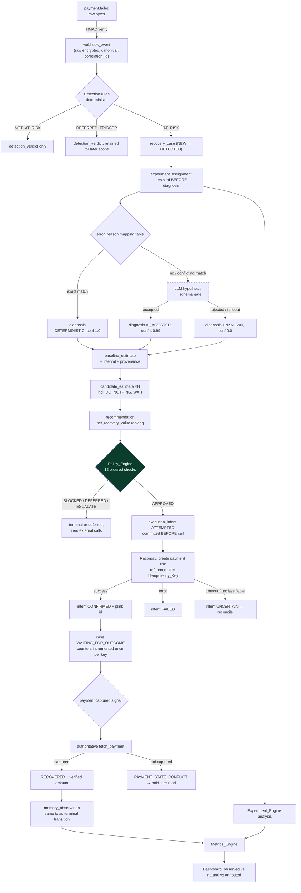

Three properties of this flow are worth naming because they are what the design is for:

1. **The only path to an external effect runs through the dark green box.** There is no other edge into `M`.
2. **Every AI node is dashed and has a non-dashed sibling.** Removing the LLM removes capability, never continuity.
3. **Recovery is declared at `R`, which is reachable only from `Q`** — an authoritative read — never directly from `P`, a webhook.

### Where Money Figures Come From

| Figure | Source of truth | Type |
| --- | --- | --- |
| `payment_amount` | Provider payload `amount` (already minor units) | `BIGINT` |
| `expected_incremental_revenue` | Computed, half-up, integer | `BIGINT` |
| `action_cost` / `risk_cost` / `customer_cost` | Configuration, integer | `BIGINT` |
| `net_recovery_value` | Computed from the four above | `BIGINT` |
| Confirmed recovered amount | Authoritative `fetch_payment` `amount` | `BIGINT` |
| Any aggregate | `SUM()` of the stored `BIGINT`s | `BIGINT` |

No `FLOAT`, no `NUMERIC` scaling, no client-side arithmetic anywhere in that column. Probabilities are `NUMERIC(6,4)` and are the *only* non-integer quantities; they are multiplied into money exactly once, at which point half-up rounding to integer minor units happens and the result is stored (R7.C12).

---

## Event Flow

### Inbound Webhook, Happy Path and the Three Rejections

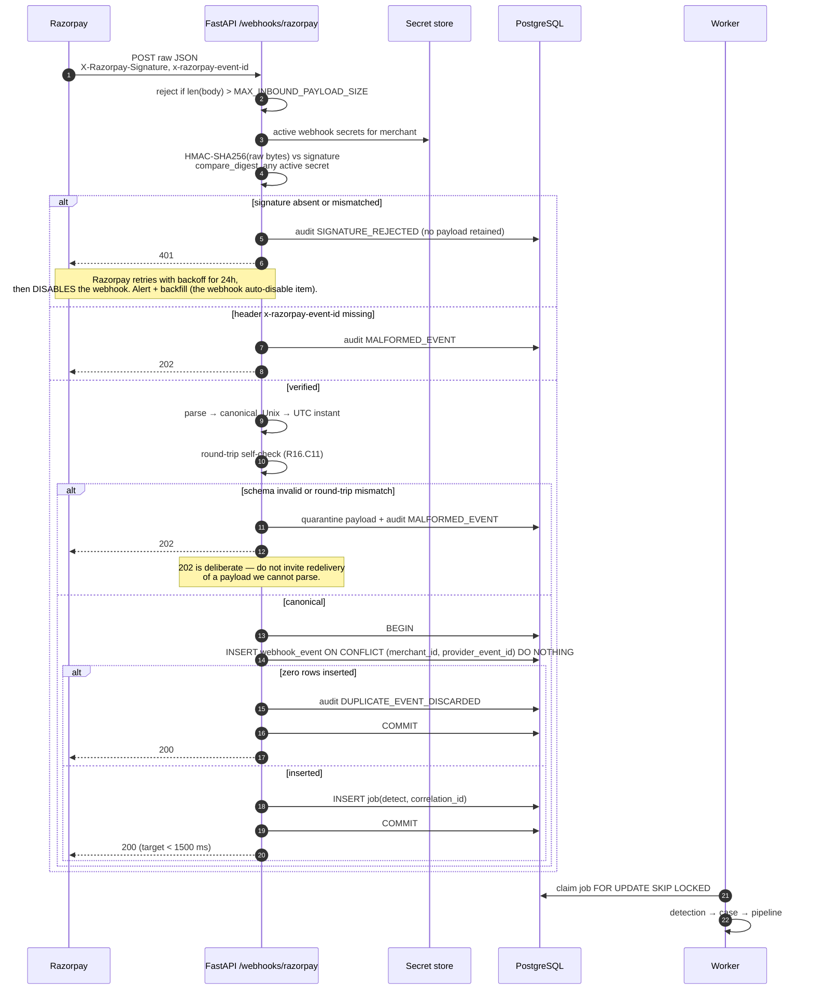

The insert and the enqueue share one transaction. That is the whole reason there is no separate broker: a committed event always has a committed job, and an uncommitted event never has one.

### Out-of-Order and Late Events

Verified: ordering is not guaranteed, and `payment.captured` may precede `payment.failed`. The rules:

| Situation | Handling | Requirement |
| --- | --- | --- |
| Event's provider timestamp older than newest processed for the payment | Apply only if it yields a legal forward transition; else leave state and all counters untouched and audit `OUT_OF_ORDER_EVENT` with both timestamps | R1.C7 |
| `captured` arrives for a payment with an open case | Suppress further action evaluation and scheduling immediately; mark for outcome resolution against a verified read | R1.C11 |
| `captured` arrives for an already-terminal non-recovered case | Authoritative read; if captured, one reconciliation transition to `RECOVERED`, audit `DELAYED_RECOVERY_RECONCILED`, restate the period | R2.C4, R10.C14 |
| Duplicate of any event | Dropped at the unique index; zero side effects | R1.C4, R16.C8 |
| `payment_link.partially_paid` | Not recovery. Hold in `WAITING_FOR_OUTCOME`, audit `PARTIAL_PAYMENT_OBSERVED` | the partial-payment item |

### Internal Events

Revora has no internal event bus. State changes plus transactionally enqueued jobs are the mechanism. Adding a bus would give every subscriber a chance to observe a state that the transaction later rolled back.

---

## Recovery Case State Machine

Fourteen states, one legal transition table, and a termination guarantee that does not depend on any job running.

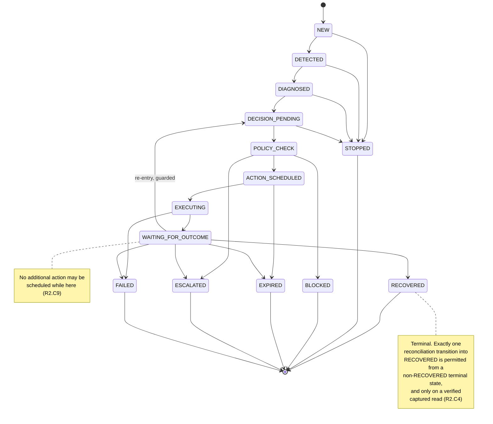

The diagram shows representative terminal edges for readability. The actual table contains **one edge from every non-terminal state to every one of `STOPPED`, `BLOCKED`, `EXPIRED`, `ESCALATED`, `FAILED`**, per R2.C2. It is generated in code, not hand-listed:

```python
FORWARD = [(NEW,DETECTED),(DETECTED,DIAGNOSED),(DIAGNOSED,DECISION_PENDING),
           (DECISION_PENDING,POLICY_CHECK),(POLICY_CHECK,ACTION_SCHEDULED),
           (ACTION_SCHEDULED,EXECUTING),(EXECUTING,WAITING_FOR_OUTCOME),
           (WAITING_FOR_OUTCOME,RECOVERED)]
REENTRY  = [(WAITING_FOR_OUTCOME, DECISION_PENDING)]
TERMINAL = {RECOVERED,STOPPED,BLOCKED,EXPIRED,ESCALATED,FAILED}
LEGAL    = set(FORWARD) | set(REENTRY) | {
    (s, t) for s in ALL if s not in TERMINAL
           for t in (TERMINAL - {RECOVERED})
}
```

Deriving the table from the same declaration the property test reads is deliberate: P5 then tests the *manager* against the *table*, not the table against itself.

### Transition Guards

| Transition | Guard | Effect | Req |
| --- | --- | --- | --- |
| `→ NEW` | case creation | window end = detection + `RECOVERY_WINDOW_DURATION`, never changed; counters = 0 | R2.C1, C5, C7 |
| `DIAGNOSED → DECISION_PENDING` | `decision_cycle_count < MAX_RECOVERY_ATTEMPTS` | `decision_cycle_count += 1` | R2.C7, C14 |
| `POLICY_CHECK → ACTION_SCHEDULED` | policy verdict `APPROVED`, unexpired | schedules exactly one action | R8.C15 |
| `ACTION_SCHEDULED → EXECUTING` | execution lock held, intent about to be committed | `executed_action_count += 1`, `last_outbound_at = now`; `+1` message count if customer-visible | R2.C7 |
| `EXECUTING → WAITING_FOR_OUTCOME` | intent `CONFIRMED` | — | R9.C10 |
| `WAITING_FOR_OUTCOME → DECISION_PENDING` | all of: actions < max, cycles < max, now < window end, cooldown elapsed | new decision cycle | R2.C10 |
| any non-terminal `→ EXPIRED` | now ≥ persisted window end | record unresolved amount | R2.C6 |
| `→ ESCALATED` on attempt exhaustion | `amount ≥ ESCALATION_AMOUNT_THRESHOLD` | else `STOPPED` | R2.C8 |
| any terminal `→ RECOVERED` | verified captured read, and no prior reconciliation | at most once ever | R2.C4 |

### Counter Placement, and Why It Is Where It Is

`executed_action_count` increments **at the transition into `EXECUTING`, before the provider request is issued** (R2.C7). This is deliberately pessimistic: a crash after increment and before the call consumes an attempt that may not have happened. The alternative — increment on confirmation — risks a crash loop consuming zero attempts while issuing calls, which could exceed `MAX_RECOVERY_ATTEMPTS`. Given the choice between possibly under-attempting and possibly over-charging a customer, the design under-attempts. **[INFERENCE]**

R9.C10 also requires the counter to move exactly once per `Idempotency_Key` on confirmation. Both are satisfiable together: the increment is keyed on the intent's idempotency key with a uniqueness constraint on `(case_id, idempotency_key, counter_effect)`, so a replay of either path is a no-op.

### Termination

Every case reaches a terminal state within `RECOVERY_WINDOW_DURATION + OUTCOME_WAIT_TIMEOUT + LIFECYCLE_EVALUATION_INTERVAL` of detection (R2.C12). The argument, which P6 tests:

- The window end is persisted at creation and never extended (R2.C5), so it is a fixed wall-clock deadline independent of any in-memory timer.
- The sweeper visits every non-terminal case at least once per `LIFECYCLE_EVALUATION_INTERVAL` and applies expiry from persisted timestamps (R2.C13), so termination does not require any earlier job to have run.
- The only re-entry edge is `WAITING_FOR_OUTCOME → DECISION_PENDING`, guarded by a monotonically increasing `decision_cycle_count` capped at `MAX_RECOVERY_ATTEMPTS`, so the graph has no unbounded cycle.
- On restart, non-terminal cases are reloaded and re-evaluated from persisted records before any action is scheduled (R16.C6).

---

## Data Models

One PostgreSQL database. It holds durable state, the job queue, the audit log, and learning observations. ADR-2 covers why there is not a second store.

### Entity Relationships

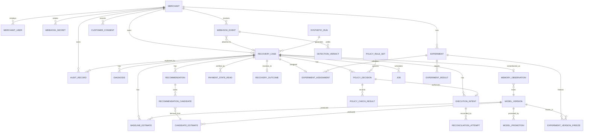

### Table Catalogue

Only columns that carry design weight are listed. Every table has `id UUID PRIMARY KEY DEFAULT gen_random_uuid()`, `created_at TIMESTAMPTZ NOT NULL DEFAULT now()`, and — except `merchant` itself — `merchant_id UUID NOT NULL REFERENCES merchant`.

**`webhook_event`** — the PII holder and the dedup point.
`provider_event_id TEXT NOT NULL` (the verified `x-razorpay-event-id` header), `event_name TEXT`, `raw_payload_ciphertext BYTEA NOT NULL`, `raw_payload_nonce BYTEA`, `key_version SMALLINT`, `canonical JSONB NOT NULL` (PII-free), `provider_created_at TIMESTAMPTZ`, `received_at TIMESTAMPTZ`, `correlation_id UUID NOT NULL`, `signature_verified BOOLEAN NOT NULL`, `processing_state TEXT`.
`UNIQUE (merchant_id, provider_event_id)` — this single constraint is what makes R1.C4 and P4 true.

**`event_quarantine`** — malformed payloads, `validation_rule TEXT`, retained `QUARANTINE_RETENTION`.

**`recovery_case`** — the aggregate root.
`state TEXT NOT NULL`, `version INTEGER NOT NULL DEFAULT 1` (optimistic concurrency), `provider_payment_id TEXT NOT NULL`, `provider_order_id TEXT`, `payment_amount BIGINT NOT NULL CHECK (payment_amount > 0)`, `currency CHAR(3) NOT NULL`, `customer_key TEXT NOT NULL` (stable non-reversible hash of contact, used for cross-case opt-out joins), `customer_contact_masked TEXT`, `source_event_id UUID`, `detected_at TIMESTAMPTZ NOT NULL`, `window_end_at TIMESTAMPTZ NOT NULL`, `executed_action_count SMALLINT NOT NULL DEFAULT 0`, `customer_message_count SMALLINT NOT NULL DEFAULT 0`, `decision_cycle_count SMALLINT NOT NULL DEFAULT 0`, `last_outbound_at TIMESTAMPTZ`, `audit_seq INTEGER NOT NULL DEFAULT 0`, `human_owner_user_id UUID`, `human_assigned_at TIMESTAMPTZ`, `verified_payment_status TEXT`, `verified_amount_refunded BIGINT`, `risk_flagged BOOLEAN NOT NULL DEFAULT false`, `terminal_reason TEXT`, `provenance TEXT NOT NULL DEFAULT 'REAL'`, `synthetic_run_id UUID`.

Constraints that carry invariants into the schema, so a code bug cannot violate them silently:
```sql
CREATE UNIQUE INDEX one_open_case_per_payment
  ON recovery_case (merchant_id, provider_payment_id)
  WHERE state NOT IN ('RECOVERED','STOPPED','BLOCKED','EXPIRED','ESCALATED','FAILED');

ALTER TABLE recovery_case
  ADD CONSTRAINT counters_within_bounds
  CHECK (executed_action_count  <= 10
     AND customer_message_count <= executed_action_count
     AND decision_cycle_count   <= 10);
-- ceilings are schema-level backstops well above the configured bounds;
-- the configured bounds themselves are enforced in the policy layer, which
-- is where they belong because they are merchant-configurable.
```

**`diagnosis`** — `cause TEXT`, `confidence NUMERIC(4,3) CHECK (confidence BETWEEN 0 AND 1)`, `method TEXT`, `evidence JSONB`, `decision_cycle SMALLINT`, `ai_invocation_id UUID`, `is_active BOOLEAN`. `UNIQUE (case_id, decision_cycle) WHERE is_active` gives R3.C4's "exactly one active diagnosis per cycle" as a database fact.

**`baseline_estimate`** — `probability NUMERIC(6,4)`, `ci_low NUMERIC(6,4)`, `ci_high NUMERIC(6,4)`, `uncertainty_available BOOLEAN`, `segment_id TEXT`, `features JSONB`, `model_version_id UUID`, `method TEXT`, `provenance TEXT`, `validation_status TEXT` (`VALIDATED` | `UNVALIDATED_BASELINE` | `CALIBRATION_SUSPECT`), `training_snapshot_id TEXT`.

**`candidate_estimate`** — `action TEXT`, `intervention_probability NUMERIC(6,4)`, `action_cost BIGINT`, `risk_cost BIGINT`, `customer_cost BIGINT`, `method TEXT`, `provenance TEXT`, `availability TEXT` (`AVAILABLE` | `UNAVAILABLE`), `unavailable_reason TEXT`, `model_version_id UUID`. All cost columns `CHECK (>= 0)`.

**`recommendation`** — `selected_action TEXT`, `selection_reason TEXT`, `divergence_reason TEXT`, `substituted_risk_cause TEXT`, `substitution_reason TEXT`, `ai_explanation_text TEXT` — the last column is named to make its status obvious and is referenced by exactly one code path, the dashboard serializer.

**`recommendation_candidate`** — per candidate: `incremental_probability NUMERIC(7,4)` (signed), `expected_incremental_revenue BIGINT` (signed), `action_cost BIGINT`, `risk_cost BIGINT`, `customer_cost BIGINT`, `net_recovery_value BIGINT` (signed), `excluded BOOLEAN`, `exclusion_reason TEXT`, `rank SMALLINT`.

**`policy_decision`** — `verdict TEXT`, `primary_reason TEXT`, `rule_set_version TEXT`, `evaluated_at TIMESTAMPTZ`, `expires_at TIMESTAMPTZ`, `idempotency_key TEXT`, `selected_action TEXT`, `consumed_by_intent_id UUID`, `case_state_at_evaluation TEXT`, `earliest_permitted_at TIMESTAMPTZ`. `UNIQUE (consumed_by_intent_id)` where not null — one decision authorizes at most one execution (R8.C15).

**`policy_check_result`** — `check_order SMALLINT`, `check_id TEXT`, `outcome TEXT` (`PASS`|`FAIL`|`UNAVAILABLE`). `UNIQUE (policy_decision_id, check_order)`; twelve rows per decision, always.

**`execution_intent`** — the exactly-once record.
`idempotency_key TEXT NOT NULL`, `action TEXT NOT NULL`, `attempt_ordinal SMALLINT NOT NULL`, `state TEXT NOT NULL CHECK (state IN ('ATTEMPTED','CONFIRMED','FAILED','UNCERTAIN'))`, `policy_decision_id UUID NOT NULL`, `attempt_started_at TIMESTAMPTZ NOT NULL`, `resolved_at TIMESTAMPTZ`, `provider_response_id TEXT`, `provider_short_url TEXT`, `provider_failure_code TEXT`, `is_post_payment BOOLEAN NOT NULL DEFAULT false`, `reconciliation_attempts SMALLINT NOT NULL DEFAULT 0`, `counter_applied BOOLEAN NOT NULL DEFAULT false`.
`UNIQUE (merchant_id, idempotency_key)` — the constraint that makes P3 hold.

**`payment_state_read`** — every authoritative read: `provider_payment_id`, `status`, `amount BIGINT`, `amount_refunded BIGINT`, `captured BOOLEAN`, `read_at`, `attempt_no`, `raw JSONB`. Keeping the read history means a conflict can be reconstructed later rather than argued about.

**`recovery_outcome`** — `classification TEXT` (`NATURAL`|`OBSERVED`|`ATTRIBUTED`), `recovered_amount BIGINT`, `recovery_timestamp TIMESTAMPTZ`, `seconds_to_recovery INTEGER`, `verified_by_read_id UUID NOT NULL`, `reconciled_from_terminal_state TEXT`. `UNIQUE (case_id)` — recovery is counted exactly once per case by construction, which is half of P20.

**`audit_record`** — see the Audit Architecture section.
`case_id UUID`, `seq INTEGER NOT NULL`, `event_type TEXT`, `actor TEXT NOT NULL`, `previous_state TEXT`, `new_state TEXT`, `diagnosis JSONB`, `evidence JSONB`, `decision JSONB`, `confidence NUMERIC(4,3)`, `policy_result JSONB`, `action TEXT`, `action_result TEXT`, `idempotency_key TEXT`, `correlation_id UUID NOT NULL`, `occurred_at TIMESTAMPTZ(3) NOT NULL`, `truncated_fields TEXT[]`.
`UNIQUE (case_id, seq)`.

**`ai_invocation`** — `prompt_contract_id TEXT`, `model_id TEXT`, `model_version TEXT`, `latency_ms INTEGER`, `verdict TEXT`, `influenced_recommendation BOOLEAN`, `raw_response_truncated TEXT`. One row per invocation including failures (R4.C8).

**`customer_consent`** — `customer_key TEXT`, `opted_out BOOLEAN`, `source TEXT`, `effective_at TIMESTAMPTZ`, `consent_expires_at TIMESTAMPTZ`. Keyed on `customer_key`, not case, so an opt-out covers existing and future cases of that customer (R17.C10) — which is what P8 needs.

**`experiment`** — `state TEXT`, `primary_metric TEXT`, `secondary_metrics TEXT[]`, `eligibility JSONB`, `allocation_ratio TEXT`, `assumed_baseline_rate NUMERIC(6,4)`, `minimum_detectable_effect NUMERIC(6,4)`, `significance_level NUMERIC(4,3)`, `power NUMERIC(4,3)`, `analysis_method TEXT`, `required_sample_size_per_group INTEGER NOT NULL`, `activated_at`, `labels TEXT[]`.

**`experiment_assignment`** — `group TEXT`, `assigned_at TIMESTAMPTZ`, `contaminated BOOLEAN`, `excluded BOOLEAN`, `exclusion_reason TEXT`. `UNIQUE (case_id)` and no `UPDATE` grant on `group` — the immutability R13.C2 demands.

**`experiment_version_freeze`** — `component TEXT`, `version_id TEXT`. Rows for baseline workflow, policy rule set, baseline model, simulator.

**`model_version` / `model_promotion`** — `component TEXT`, `version_label TEXT`, `state TEXT` (`INACTIVE`|`ACTIVE`|`RETIRED`), `training_observation_count INTEGER`, `synthetic_observation_count INTEGER`, `artifact BYTEA`; promotion carries `prior_version_id`, `approving_user_id UUID NOT NULL`, `promoted_at`.

**`memory_observation`** — features, diagnosis fields, selected action, policy decision, outcome class, realized cost, group, counters, `decision_source TEXT`, `intervention_status TEXT`, `provenance TEXT`. `UNIQUE (case_id)`.

**`job`** — `kind TEXT`, `payload JSONB`, `state TEXT`, `run_after TIMESTAMPTZ`, `attempts SMALLINT`, `locked_by TEXT`, `correlation_id UUID`, `dedupe_key TEXT`. `UNIQUE (dedupe_key) WHERE state = 'PENDING'` prevents duplicate sweeps.

**`synthetic_run`** — `seed BIGINT NOT NULL`, `scenario TEXT`, `assumptions JSONB NOT NULL`, `ground_truth JSONB NOT NULL`, `generator_version TEXT`.

### Indexes That Exist for a Stated Reason

| Index | Reason |
| --- | --- |
| `webhook_event (merchant_id, provider_event_id)` UNIQUE | Dedup correctness, not speed |
| `recovery_case (merchant_id, provider_payment_id) WHERE NOT terminal` UNIQUE | One open case per payment |
| `execution_intent (merchant_id, idempotency_key)` UNIQUE | Exactly-once |
| `audit_record (case_id, seq)` UNIQUE | Gap-free ordering |
| `recovery_case (merchant_id, state, window_end_at)` | Lifecycle sweeper scan |
| `execution_intent (state, attempt_started_at) WHERE state IN ('ATTEMPTED','UNCERTAIN')` | Reconciliation sweeper |
| `job (state, run_after)` | Queue claim |
| `recovery_case (merchant_id, detected_at)` | Cohort aggregation and dashboard ordering |
| `audit_record (correlation_id)` | Trace one inbound event end to end |
| `customer_consent (merchant_id, customer_key)` | Opt-out check in the policy hot path |

### Type Discipline

| Kind | Type | Rationale |
| --- | --- | --- |
| Money | `BIGINT`, minor units | Exact. `BIGINT` holds ₹92 quadrillion in paise — no realistic overflow |
| Probability | `NUMERIC(6,4)` | Exact decimal, 4 places per R7.C12; no float drift in stored values |
| Signed incremental probability | `NUMERIC(7,4)` | Range −1.0000 … 1.0000 |
| Confidence | `NUMERIC(4,3)` | 0.000 … 1.000 |
| Time | `TIMESTAMPTZ`, always UTC | R16.C9; `TIMESTAMPTZ(3)` on audit for millisecond precision (R11.C2) |
| Identifiers | `UUID` internal, `TEXT` for provider ids | Provider id formats are theirs to change |
| Enums | `TEXT` + `CHECK` | Postgres enum types require a migration to extend; `CHECK` constraints are cheaper to evolve, and the authoritative enum lives in `domain` |
| Raw payloads | `BYTEA` ciphertext + `JSONB` PII-free canonical | the masked-at-write-time conflict item |

### Tenant Isolation in the Schema

Every tenant-scoped table carries `merchant_id`, and repositories require it as an argument — there is no repository function that can read across merchants. Row-level security is enabled as **defense in depth**, not as the primary control:

```sql
ALTER TABLE recovery_case ENABLE ROW LEVEL SECURITY;
CREATE POLICY tenant_isolation ON recovery_case
  USING (merchant_id = current_setting('revora.merchant_id', true)::uuid);
```

The session variable is set from the authenticated session at the start of each request transaction. Two independent mechanisms because the application layer is where a mistake is most likely, and RLS catches exactly that mistake. Property P30 tests the application layer; RLS is the belt.

---

## AI Boundary

The rule from `requirements.md`: **AI recommendation is not AI authority.** This section makes that structural rather than aspirational.

### The Three Sanctioned Uses, and Nothing Else

| # | Use | Deterministic fallback | Can it affect an external effect? |
| --- | --- | --- | --- |
| 1 | Risk_Cause hypothesis when the mapping table does not decide | `UNKNOWN` with confidence 0.0 | Indirectly: cause shapes the candidate set. Bounded — low confidence or rejected output forces `UNKNOWN` (R3.C8), which yields the narrowest candidate set |
| 2 | Human-readable explanation of a recommendation | Templated explanation from the stored figures | No. Stored in `recommendation.ai_explanation_text`, read only by the dashboard serializer |
| 3 | Draft of the Payment Link `description` | Templated description | Only after passing every content validation rule (R4.C7); failing any rule suppresses the send entirely (R4.C11) |

Not sanctioned, and structurally impossible: computing or adjusting any probability, cost, or value figure; ranking candidates; producing or influencing a Policy_Decision; deciding to execute; choosing a recipient; setting an amount.

### The Four Gates Every Invocation Passes

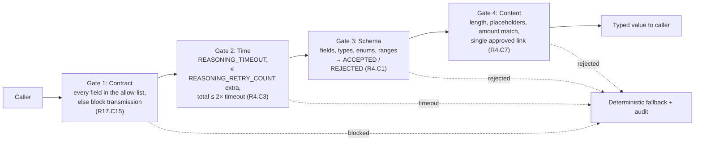

Gate 4 applies only to customer-visible content. Every gate failure produces an audit record and the deterministic path, never a partial acceptance.

### Prompt Contracts

A `PromptContract` is a versioned, code-declared object:

```python
DIAGNOSIS_V1 = PromptContract(
    id="diagnosis.v1",
    allowed_fields=frozenset({
        "error_code","error_reason","error_source","error_step",
        "error_description","payment_method","amount_band",
        "attempt_ordinal","currency",
    }),
    output_model=DiagnosisHypothesis,   # cause: RiskCause; confidence: float 0..1; rationale: str
)
```

The adapter asserts `supplied.keys() <= contract.allowed_fields` and refuses otherwise. Note what is absent from the allow-list: `contact`, `email`, `customer_key`, `provider_payment_id`, card data, exact amount (a band is sent instead), merchant name. The contract id is stored on every `ai_invocation` row, so the exact field set sent is reconstructable after the fact (R17.C8).

`amount_band` rather than the exact amount is a deliberate minimization: the cause of a failure does not depend on the precise rupee figure, and a band cannot be joined back to a specific transaction as easily.

### Prompt Injection

Threat: a provider-supplied free-text field (`error_description`, or a merchant-set `description` echoed back) contains text intended to steer the model.

Why the impact is bounded rather than eliminated:
- The output schema admits only enum members and bounded numerics, so an injected instruction cannot produce a value the system will act on differently.
- The model holds no tools, no function calling, and no database access. It returns JSON to a caller that will validate it.
- Injected content cannot raise its own influence: confidence is capped at 0.99 for AI-assisted output, and confidence below `DIAGNOSIS_CONFIDENCE_FLOOR` is downgraded to `UNKNOWN` for the value model (R3.C8).
- The worst achievable outcome is a wrong Risk_Cause, which narrows or widens the candidate set. Policy still gates every action, so a wrong cause cannot produce an unauthorized effect.
- **Residual risk:** a wrong cause could route a case to a more expensive action than warranted. Bounded by `MAX_COST_TO_VALUE_RATIO` and by the attempt and message caps. Accepted for MVP; the honest mitigation is that the deterministic table handles the common cases, so the injection surface is the tail, not the trunk.

### What "AI Unavailable" Looks Like

`REASONING_UNAVAILABLE_THRESHOLD` consecutive failures marks the layer unavailable and short-circuits every invocation until a probe succeeds. In that state Revora continues to ingest, detect, diagnose deterministically, estimate, optimize, evaluate policy, execute approved actions, verify outcomes, and report metrics (R4.C4). No case waits on the LLM in any state — the diagnosis job completes with `FALLBACK_UNKNOWN` rather than deferring.

This is testable and is tested: the full integration suite runs a second time with the LLM adapter hard-failing, and must produce the same terminal-state distribution modulo diagnosis cause.

---

## ML Boundary

Honest framing first: **at MVP scale this is a calibrated prior with an explicit uncertainty interval, plus a simple model that switches on only where a segment has enough confirmed no-intervention observations.** It is not a learned system. The design's contribution is the labelling and versioning that let it become one, and the markers that stop anyone reading it as more than it is.

### The Deterministic Layer That Comes First

Verified provider error reasons (the Payment Failure Taxonomy item) map directly to Risk_Cause. Initial table, populated from real documented values:

| `error_reason` (verified) | Risk_Cause |
| --- | --- |
| `insufficient_funds` | `INSUFFICIENT_FUNDS` |
| `card_expired` | `EXPIRED_PAYMENT_METHOD` |
| `card_not_enrolled`, `card_number_invalid`, `incorrect_card_details`, `incorrect_card_expiry_date`, `card_type_invalid` | `EXPIRED_PAYMENT_METHOD` |
| `bank_technical_error`, `upi_app_technical_error`, `bank_account_invalid`, `user_not_registered_for_netbanking` | `BANK_OR_NETWORK_FAILURE` |
| `server_error`, `payment_failed`, `verification_failed`, `capture_failed` | `TECHNICAL_ISSUE` |
| `payment_timed_out`, `otp_expired`, `otp_attempts_exceeded`, `pin_attempts_exceeded` | `ABANDONMENT` |
| `payment_cancelled` | `ABANDONMENT` |
| `incorrect_otp`, `incorrect_cvv`, `incorrect_pin`, `incorrect_atm_pin`, `authentication_failed`, `invalid_vpa` | `CUSTOMER_ACTION_REQUIRED` |
| `payment_risk_check_failed`, `compliance_violation`, `debit_instrument_blocked` | `FRAUD_OR_RISK_SIGNAL` |
| `transaction_limit_exceeded`, `transaction_daily_limit_exceeded`, `transaction_frequency_limit_exceeded`, `international_transaction_not_allowed`, `transaction_on_vpa_restricted` | `CUSTOMER_ACTION_REQUIRED` |
| `input_validation_failed`, `invalid_order_id`, `order_amount_mismatch`, `live_mode_not_enabled`, `payment_method_not_enabled`, `bank_not_enabled` | `TECHNICAL_ISSUE` — merchant-side integration fault; note these are *our* bug, not the customer's, and are worth a separate operational alert |
| `order_already_paid` | Not at risk — signals the payment already succeeded |
| anything unmapped | LLM path, then `UNKNOWN` |

Two judgement calls, flagged: `payment_timed_out` → `ABANDONMENT` is **[ASSUMPTION]** (it may equally be a gateway problem; the docs say it also occurs when no gateway response is received). `otp_expired` → `ABANDONMENT` is **[INFERENCE]** from the customer having stopped. Both are configuration, and the deterministic-hit-rate metric plus the LLM disagreement rate will show whether they are wrong.

`error_source` and `error_step` refine ambiguous reasons: `source ∈ {internal, gateway}` pushes toward `TECHNICAL_ISSUE`; `source = customer` with `step = payment_authentication` pushes toward `CUSTOMER_ACTION_REQUIRED`.

### Feature Segmentation

Segments must be coarse enough that a hackathon-scale dataset has observations in them. Five features, all categorical, giving a bounded segment space:

| Feature | Values | Why |
| --- | --- | --- |
| `risk_cause` | 8 enum values | The dominant signal; an insufficient-funds failure recovers differently from an expired card |
| `amount_band` | 4 bands (configured, non-overlapping, exhaustive) | R12.C10 already requires amount-band segmentation for metrics; reusing it keeps metrics and model aligned |
| `payment_method` | `card`, `netbanking`, `upi`, `wallet`, `emi`, `other` (verified enum) | Retry economics differ sharply by method |
| `attempt_ordinal_band` | `first`, `repeat` | A second failure is not a first failure |
| `error_source_band` | `customer`, `bank_or_network`, `internal_or_gateway` (collapsed from the verified per-method source values) | Distinguishes "customer must act" from "infrastructure failed" |

Cross product is 8 × 4 × 6 × 2 × 3 = 1152 cells, which is far too many for any realistic dataset. Segments are therefore **hierarchical**: lookup tries the full key, then drops `error_source_band`, then `attempt_ordinal_band`, then `payment_method`, then `amount_band`, falling back finally to `risk_cause` alone and then to a global prior. The first level with ≥ `MIN_SEGMENT_SAMPLE_SIZE` confirmed observations wins, and the level used is recorded in `segment_id`. This is a standard backoff, and it makes the sample-size requirement satisfiable instead of theoretical. **[INFERENCE]**

### Cold Start: Beta-Binomial Priors

For a segment with `s` recoveries out of `n` confirmed no-intervention observations, the posterior mean is `(α + s) / (α + β + n)` with a weak prior `α = β = 1` **[ASSUMPTION]** unless a merchant-supplied prior exists. The 95% interval comes from the Beta posterior quantiles, giving R5.C9's interval for free and honestly wide at `n = 0`.

At `n = 0` the estimate is the prior mean, `method = PRIOR_FALLBACK`, `validation_status = UNVALIDATED_BASELINE` (R5.C3, C12), and the interval is nearly `[0.03, 0.97]`. That width is the point: it tells the reader the number means very little, and it propagates to the dashboard.

**What this deliberately does not do:** it does not train on the merchant's historical data. R5's preamble is right — historical outcomes reflect past intervention, so a model fitted to them estimates intervened recovery and calls it baseline. The only unbiased baseline source is the experiment's own control arm, which is why the control arm is MVP and the trained model is not.

### When the Model Turns On

Once a segment reaches `MIN_SEGMENT_SAMPLE_SIZE` confirmed `NO_INTERVENTION_CONFIRMED` observations, a `LogisticRegression` on one-hot segment features replaces the per-segment posterior, wrapped in `CalibratedClassifierCV(method="isotonic")` once enough data exists for a calibration split. Method recorded as `DETERMINISTIC` (fitted from data) rather than `PRIOR_FALLBACK`. The interval then comes from a bootstrap over the training set, or `UNCERTAINTY_UNAVAILABLE` if the bootstrap is not run.

Why logistic regression rather than gradient boosting: with categorical features, hundreds-not-millions of rows, and a hard requirement to explain a probability to a merchant, a linear model in a one-hot space is both sufficient and inspectable. Choosing a stronger learner here would trade explainability for accuracy the data cannot support. **[INFERENCE]**

### Calibration Report

Triggered by `CALIBRATION_REPORT_CASE_TRIGGER` resolved control cases or `CALIBRATION_REPORT_TIME_TRIGGER` elapsed, whichever first (R5.C5). Ten bands of width 0.10. Per band: mean predicted, observed control-arm recovery rate, control observation count, absolute deviation. Bands under `MIN_CALIBRATION_BAND_COUNT` are marked `CALIBRATION_UNVERIFIED` and are excluded from the tolerance check. Deviation beyond `CALIBRATION_TOLERANCE` on a verified band flags every value decision derived from that band `CALIBRATION_SUSPECT`, and — critically — **the underlying figures are retained unchanged** (R5.C8). We label, we do not quietly correct.

The report also states, per R5.C6–C7: excluded observation counts per intervention status, and every segment that is an intervention-bias risk segment.

### Intervention-Status Labelling

| Value | Assigned when | Usable as baseline label |
| --- | --- | --- |
| `NO_INTERVENTION_CONFIRMED` | Case reached terminal with zero confirmed Revora actions **and** Revora observed the case for its whole window | Yes |
| `REVORA_INTERVENED` | ≥ 1 confirmed Revora action | No |
| `MERCHANT_INTERVENTION_UNKNOWN` | Predates Revora deployment, or merchant-side activity is not recorded in Revora | No |

The uncomfortable truth this encodes: Revora cannot see a merchant phoning a customer. So `NO_INTERVENTION_CONFIRMED` means "no *Revora* intervention and no *recorded* merchant intervention," which is weaker than "no intervention." R5.C10 already says this. The design's response is to keep the weakness labelled and measurable — the `MERCHANT_INTERVENTION_UNKNOWN` share per segment is reported (R5.C7) — not to claim it is solved.

### Version Freezing per Experiment

`experiment_version_freeze` rows pin the baseline model version, simulator version, policy rule set version, and baseline workflow definition at activation. Every estimate produced for a case assigned to that experiment loads the pinned version, regardless of any promotion recorded later (R15.C7). A change to any pinned component while the experiment is `ACTIVE` labels the experiment `INVALIDATED` and stops assignment (R13.C16). Enforced by comparing the active version to the frozen version at estimate time, and by a periodic integrity sweep.

---

## Policy Boundary

### The Function

```python
def evaluate(inp: PolicyInput, rules: RuleSet) -> PolicyDecision: ...
```

Pure. No I/O, no clock read (the evaluation timestamp is a field of `PolicyInput`), no randomness, no logging. Given identical `(inp, rules)` it returns an identical verdict, primary reason, and ordered check outcomes (R8.C14). That property is what makes it testable in microseconds and auditable after the fact — you can replay any historical decision by reconstructing its input.

### Why No AI Field Can Reach It

Four independent mechanisms, because one would be a claim and four is a structure:

1. **Type.** `PolicyInput` is a frozen dataclass whose fields are enumerated in `domain`. There is no `Any`, no `dict`, no `**kwargs`, no `extra` field. An AI-produced value has nowhere to sit.
2. **Construction.** The only constructor is `PolicyInput.from_persisted(case, consent, verified_state, intent, now, rules_version)`, which reads named columns from persisted rows. `recommendation.ai_explanation_text` and `diagnosis.confidence` (when method is AI-assisted) are not among the columns it reads.
3. **Imports.** `policy/` may import `domain` and `platform` only. It cannot import `reasoning` or `estimation`. Enforced by an import-linter contract that fails CI.
4. **Property test.** P2 generates a decision, replaces every AI-produced field in the persisted record with arbitrary schema-valid content, re-evaluates, and asserts the verdict and reason are unchanged (R4.C9).

One nuance worth stating rather than glossing: the *selected action* is a policy input, and the selected action was chosen by the optimizer, which consumed a Risk_Cause that may have been AI-assisted. So AI influences *which action is presented for authorization*. It does not influence *whether that action is authorized*. That is the distinction R4.C5 draws, and it is the right one — but it means the honest claim is "AI cannot authorize," not "AI has no causal path to an action." The Critical Review section lists this as a residual.

### The Twelve Checks and the Re-Check at Execution

Order is fixed by R8.C2 and the ordering is not arbitrary — cheaper and more absolute prohibitions come first, so an expensive check can never be the reason a paid or opted-out customer was contacted.

| # | Check | Non-pass verdict | Why here |
| --- | --- | --- | --- |
| 1 | Already paid | `BLOCKED` `ALREADY_PAID` | Absolute; also routes toward `RECOVERED` |
| 2 | Already terminal | `BLOCKED` | Nothing to do |
| 3 | Duplicate intent for the key | `BLOCKED` `DUPLICATE_ACTION` | Before any capability check; cheapest correctness guard |
| 4 | Fraud / risk | `ESCALATE` `FRAUD_OR_RISK_FLAG` | Human takes over |
| 5 | Customer opt-out | `BLOCKED` `CUSTOMER_OPTED_OUT` | Before every bound, so no bound bug can leak a message |
| 6 | Required consent | `BLOCKED` `CONSENT_MISSING` | Same reason |
| 7 | Human ownership | `BLOCKED` `HUMAN_OWNERSHIP` | Automation yields to a person |
| 8 | Window validity | `BLOCKED` `WINDOW_EXPIRED` | Time bound |
| 9 | Attempt count | `BLOCKED` `MAX_ATTEMPTS_REACHED` | Effort bound |
| 10 | Message count | `BLOCKED` `MAX_MESSAGES_REACHED` | Customer-visible only |
| 11 | Cooldown | `DEFERRED` `COOLDOWN_ACTIVE` + earliest permitted time, or `BLOCKED` `WINDOW_EXPIRED` if that time falls outside the window | The only check that can defer |
| 12 | Action eligibility | `BLOCKED` | Last, because it is the most case-specific |

Any input unavailable → that check records `UNAVAILABLE` and the verdict is `BLOCKED` `POLICY_INPUT_UNAVAILABLE` (R8.C17). The engine has no "assume fine" branch.

**Double evaluation.** Policy is evaluated twice per action:

```mermaid
sequenceDiagram
    participant O as Value_Optimizer
    participant P as Policy_Engine
    participant PG as PostgreSQL
    participant E as Execution_Engine

    O->>P: evaluate(input @ T1)
    P->>PG: persist decision + 12 check results + audit
    P-->>O: APPROVED (expires T1 + POLICY_DECISION_VALIDITY)
    Note over PG: case → ACTION_SCHEDULED, execution job enqueued
    E->>PG: acquire per-case lock; reload authoritative state (discard request values)
    E->>P: evaluate(input @ T2) — freshly reloaded
    alt still APPROVED and decision unexpired and unconsumed
        E->>PG: commit execution_intent ATTEMPTED, consume decision
    else anything else
        E->>PG: audit EXECUTION_ABANDONED_POLICY; zero external calls
    end
```

The second evaluation is not a formality. Between T1 and T2 the customer may have paid, opted out, been assigned to a human, or the window may have closed. R9.C1–C2 require exactly this, and the re-check happens **inside the execution lock**, so no state can change between the re-check and the intent commit.

### Rule Set Versioning

A `RuleSet` is a code-declared, version-labelled object: thresholds, the risk-reason set, the cause-to-action eligibility table, the action precedence order, the customer-visible action set. Changing one requires a new version label plus a `policy_rule_set` row with a change timestamp and an approving user (R15.C6). No policy threshold is ever derived from Recovery_Memory — the policy layer does not import `memory`, so this is structural too.

The version label is stored on every `policy_decision`, so a historical decision can be replayed against the rules that actually governed it.

---

## Razorpay Integration Boundary

### Surface Used

| Direction | Operation | Verified reference |
| --- | --- | --- |
| Inbound | `payment.failed`, `payment.captured`, `payment.authorized`, `order.paid`, `payment_link.*` webhooks | [event list](https://razorpay.com/docs/webhooks/all) |
| Outbound | Create standard Payment Link | [create standard](https://razorpay.com/docs/api/payments/payment-links/create-standard/) |
| Outbound | Fetch Payment Links filtered by `reference_id` | [fetch all standard](https://razorpay.com/docs/api/payments/payment-links/fetch-all-standard/) |
| Outbound | Fetch payment by id | [fetch with id](https://razorpay.com/docs/api/payments/fetch-with-id) |
| Outbound (backfill) | Fetch all payments over a time range | [fetch all payments](https://razorpay.com/docs/api/payments/fetch-all-payments/) |

Everything else in the Razorpay API is out of scope.

### Inbound Contract

Verified constraints the deployment must satisfy: public HTTPS URL on port 80 or 443, TLS 1.2+, not on the blacklisted domain list (which includes `ngrok.io`, `webhook.site`, `requestbin.com`, `beeceptor.com`), and Razorpay's published webhook source IPs reachable. Local development uses `zrok`, which the documentation itself points to as the supported tunnel.

Signature verification: HMAC-SHA256 over raw bytes, key = webhook secret, header `X-Razorpay-Signature`. Dedup key: `x-razorpay-event-id` header. Both verified in the Signature Verification and Delivery Semantics items.

### Outbound Contract for the One Real Action

`PAYMENT_LINK` execution builds:

```
POST /v1/payment_links
{
  "amount":       <recovery_case.payment_amount>,      # already minor units
  "currency":     <recovery_case.currency>,
  "description":  <validated description, ≤ MAX_MESSAGE_LENGTH>,
  "reference_id": <Idempotency_Key>,                   # ≤ 40 chars — see below
  "customer":     {"contact": <decrypted JIT>, "email": <decrypted JIT>},
  "notify":       {"sms": true, "email": true},
  "reminder_enable": false,
  "expire_by":    <min(window_end, now + 6 months) as unix>,
  "accept_partial": false,
  "notes":        {"revora_case_id": <case_id>, "revora_key": <Idempotency_Key>}
}
```

Design details that follow from verified constraints:

- **`reference_id` ≤ 40 characters.** A UUID case id plus action plus ordinal exceeds that. The key is therefore `rv_` + first 16 hex characters of `SHA-256(case_id || action || attempt_ordinal)` = 19 characters, deterministic and comfortably inside the limit. Collision probability across a realistic corpus is negligible; the `UNIQUE (merchant_id, idempotency_key)` constraint would surface one as an error rather than a silent duplicate. **[INFERENCE]**
- **`expire_by` clamped to the Recovery_Window end** (the payment-link expiry item), so a link cannot outlive the window in which Revora is permitted to be acting.
- **`accept_partial: false`** (the partial-payment item), so a partial payment cannot be mistaken for recovery.
- **`notes` carries the case id and key**, giving a second, provider-side path to correlate a link back to a case during manual investigation.
- **`reminder_enable: false`** because Razorpay reminders would send customer-visible messages that Revora's `MAX_CUSTOMER_MESSAGES` bound does not count. Enabling it would silently break P9. This is a small setting with a real correctness consequence, and it is the kind of thing that is easy to turn on later without noticing.

### Response Classification

| Provider outcome | Classification | Intent state | External effect certainty |
| --- | --- | --- | --- |
| HTTP 200 with a valid link entity | `Success` | `CONFIRMED` | Exists |
| HTTP 4xx with a parseable error object | `ClientError` | `FAILED` | Does not exist |
| HTTP 5xx | `ServerError` | `UNCERTAIN` | Unknown |
| Read timeout / connection reset after send | `Timeout` | `UNCERTAIN` | Unknown |
| HTTP 200 with an unparseable body | `Unclassifiable` | `UNCERTAIN` | Unknown |
| Connect error before send | `Timeout` | `FAILED` | Does not exist — nothing left the process |

The last row is the only case where a network failure is treated as definitive, and only because a connect-phase failure means no bytes reached the server. Every other ambiguity resolves to `UNCERTAIN`, which stops all further external calls for that case until reconciliation (R9.C9).

### Reconciliation Read

`GET /v1/payment_links?reference_id=<Idempotency_Key>` answers, authoritatively, whether the effect exists. Non-empty result → `CONFIRMED` with the returned `plink_…` id. Empty result → `FAILED`. This substitutes for the absent idempotency header (the Payment Links item) and is the mechanism that makes the Execution Flow section's exactly-once argument hold.

**[EVIDENCE INSUFFICIENT]** on the read-after-write visibility of a just-created link in this listing endpoint. If a link created milliseconds ago is not yet listed, an empty result would wrongly read as `FAILED` and a retry would create a duplicate. **Mitigation, applied unconditionally:** reconciliation never runs earlier than `PROVIDER_CALL_TIMEOUT` after the attempt started, retries up to `MAX_EXECUTION_RECONCILIATION_ATTEMPTS` at `EXECUTION_RECONCILIATION_INTERVAL`, and treats an empty result as `FAILED` **only on the final attempt** — earlier empty results leave the intent `UNCERTAIN`. Resolving test: create a link and immediately query by `reference_id` in test mode, 50 iterations, recording first-visible latency.

### Detection-Gap Backfill

Because a webhook can be disabled after 24 hours of failures (the webhook auto-disable item), a periodic job lists provider payments over a lookback window and ingests any `failed` payment that has no persisted event. Ingested through the *same* canonicalization and detection path, with a synthetic `provider_event_id` of `backfill:<payment_id>:<status>` so the dedup index still guarantees one case per payment. This is an addition to `requirements.md`, recommended in the webhook auto-disable item.

---

## Execution Flow — Exactly-Once External Effect

This is the section the rest of the design exists to support. R9 requires that an approved action executes at most once and is reported successful only when confirmed.

### Sequence

```mermaid
sequenceDiagram
    autonumber
    participant W as Worker
    participant PG as PostgreSQL
    participant P as Policy_Engine (pure)
    participant RZP as Razorpay

    W->>PG: BEGIN (tx-A)
    W->>PG: SELECT pg_advisory_xact_lock(hash(case_id))
    Note over W,PG: Lock is transaction-scoped: released by COMMIT/ROLLBACK,<br/>and by crash, because the connection dies. No orphan lock.
    W->>PG: SELECT case, consent, verified state, intents FOR UPDATE
    W->>W: discard every value carried in the job payload (R9.C1)
    W->>P: evaluate(reloaded input, frozen rule set)
    alt not APPROVED
        W->>PG: audit EXECUTION_ABANDONED_POLICY
        W->>PG: COMMIT (tx-A)
        Note over RZP: zero external calls
    else APPROVED
        W->>W: key = derive(case_id, action, attempt_ordinal)
        W->>PG: SELECT execution_intent WHERE idempotency_key = key
        alt intent exists
            Note over W: CONFIRMED/FAILED → return recorded result.<br/>ATTEMPTED/UNCERTAIN → hand to reconciliation.<br/>Never a second call (R9.C5).
            W->>PG: COMMIT (tx-A)
        else no intent
            W->>PG: INSERT execution_intent(key, ATTEMPTED, started_at)
            W->>PG: UPDATE case → EXECUTING, counters += 1
            W->>PG: UPDATE policy_decision SET consumed_by_intent
            W->>PG: audit EXECUTION_STARTED
            W->>PG: COMMIT (tx-A)
            Note over PG: Durable intent now exists. The lock is released here —<br/>the intent record, not the lock, is what prevents a second call.
            W->>RZP: POST /v1/payment_links (reference_id = key)
            alt Success
                W->>PG: BEGIN (tx-B): intent → CONFIRMED + plink id
                W->>PG: case → WAITING_FOR_OUTCOME; counter_applied = true
                W->>PG: audit EXECUTION_CONFIRMED; COMMIT
            else ClientError
                W->>PG: intent → FAILED + provider code; audit; COMMIT
            else Timeout / ServerError / Unclassifiable
                W->>PG: intent → UNCERTAIN; audit EXECUTION_RESULT_UNKNOWN; COMMIT
                Note over W,RZP: No further external call for this case<br/>until reconciliation resolves (R9.C9)
            end
        end
    end
```

### The Two Dangerous Windows

**Window 1 — crash after the intent commits, before the HTTP request is sent.**
The intent row exists in `ATTEMPTED`. Nothing reached Razorpay. On restart, R9.C16 promotes every `ATTEMPTED` intent older than `PROVIDER_CALL_TIMEOUT` to `UNCERTAIN` and routes it to reconciliation — **it does not repeat the call**. Reconciliation queries by `reference_id`, finds nothing, and after the attempt bound marks `FAILED`. Outcome: no duplicate, one attempt consumed that never happened. Cost: one wasted attempt on a rare crash. Accepted.

**Window 2 — crash after Razorpay processed the request, before the result commits.**
The link may exist at the provider with no local record of it. This is the window that a naive retry turns into a duplicate payment link — and a second SMS to the customer. On restart, the same promotion-to-`UNCERTAIN` path runs, reconciliation queries by `reference_id`, **finds the link**, and marks `CONFIRMED` with the provider id. Outcome: no duplicate, and the effect is correctly attributed.

The reason both windows are safe is that **the durable intent record is written before the call and the reconciliation read is keyed on the same value the call carried.** Every restart path goes to reconciliation, never to a repeat call. There is no code path that issues a second create for the same key: the only caller checks for an existing intent first, under the case lock, and the `UNIQUE (merchant_id, idempotency_key)` constraint would reject a second insert even if that check were bypassed.

Formally, the count of external calls for a given `Idempotency_Key` is at most one because:
1. A call is issued only immediately after a successful `INSERT` of an intent with that key.
2. That `INSERT` can succeed at most once (unique constraint).
3. No other code path calls the provider create endpoint.

Property P3 tests exactly this claim against a fake provider that crashes and delays at each step.

### Why the Lock Exists, and What It Does Not Do

The advisory lock (`pg_advisory_xact_lock`, transaction-scoped) prevents two workers from both passing the "no intent exists" check and both inserting. Without it, the unique constraint would still stop the second insert — but the loser would already have transitioned the case and incremented counters. The lock keeps the check-and-insert atomic so counters stay truthful.

The lock does **not** span the HTTP call. Holding a database lock across a 15-second external request would tie up a connection and create a lease-expiry problem exactly where correctness matters. The intent record is the durable guard across the call; the lock is only the short-lived guard around the decision to create it. `EXECUTION_LOCK_LEASE` in `requirements.md` is therefore satisfied trivially — the lock lifetime is a fast transaction, well inside 60 seconds.

If the lock is unavailable (`pg_try_advisory_xact_lock` returns false), the worker abandons with `CONCURRENT_EXECUTION_PREVENTED` and no external call (R9.C13).

### Reconciliation Loop

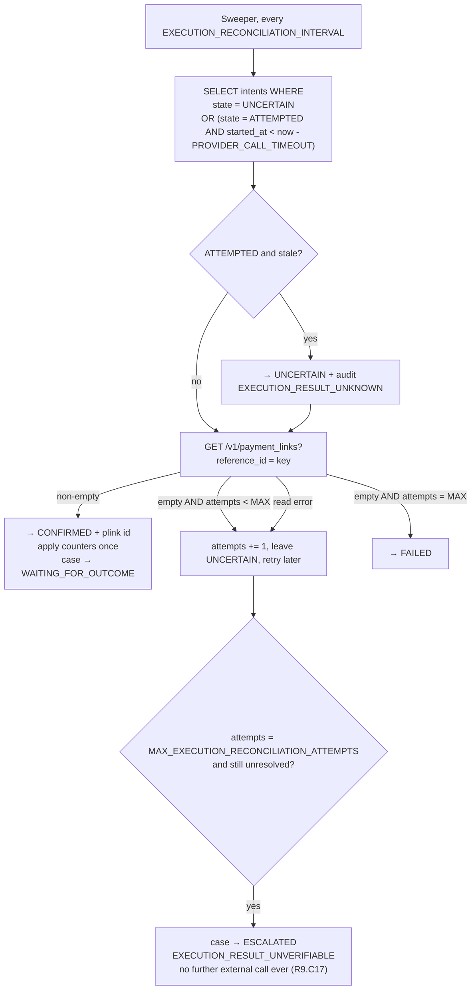

The asymmetry is deliberate: a non-empty read confirms immediately, an empty read only confirms failure on the last attempt. Ambiguity resolves toward "might exist," which errs toward not sending a second message.

### Counter Application Exactly Once

`counter_applied BOOLEAN` on the intent, flipped in the same transaction that applies the increment. Both the confirmation path and the reconciliation path check it first, so a case that confirms via reconciliation after a partial crash does not double-increment (R9.C10–C11). This is the same idempotency idea applied one level in.

### Cancellation When the Customer Pays First

If an authoritative read confirms payment while an action is scheduled or queued and **no** intent exists, the action is cancelled before any call, counters untouched, `ACTION_CANCELLED_PAYMENT_RECEIVED` audited (R10.C4). If an intent already exists in `ATTEMPTED`, `CONFIRMED`, or `UNCERTAIN`, the action is recorded `is_post_payment = true` and counted once in `unnecessary_action_count` (R10.C5). That metric is deliberately visible: it is the cost of Revora being wrong, and hiding it would defeat the purpose.

---

## Outcome Verification Flow

```mermaid
sequenceDiagram
    autonumber
    participant RZP as Razorpay
    participant API as Ingestion
    participant PG as PostgreSQL
    participant OM as Outcome_Monitor
    participant MET as Metrics_Engine

    RZP->>API: payment.captured (or order.paid / payment_link.paid)
    API->>PG: persist event + enqueue outcome job
    Note over API,PG: No recovery declared here. A webhook is a claim. (R10.C1)
    OM->>PG: claim job (within OUTCOME_READ_LATENCY_BOUND)
    OM->>RZP: GET /v1/payments/{id}
    OM->>PG: INSERT payment_state_read (full response retained)
    alt status = captured
        OM->>PG: case → RECOVERED; recovery_outcome<br/>(amount from the READ, not the webhook)
        OM->>PG: classify NATURAL (0 confirmed actions) or OBSERVED (≥ 1)
        OM->>PG: memory_observation in the SAME tx as the terminal transition
        MET->>PG: counted once — UNIQUE(case_id) on recovery_outcome
    else status = authorized (not captured)
        OM->>PG: hold WAITING_FOR_OUTCOME; audit PAYMENT_STATE_CONFLICT
        Note over OM: authorized ≠ recovered. The money is not captured.
    else status not in (captured, authorized)
        OM->>PG: hold; audit PAYMENT_STATE_CONFLICT (R10.C13)
        OM->>OM: re-read at PAYMENT_STATE_RECONCILIATION_INTERVAL,<br/>up to MAX_PAYMENT_STATE_READ_ATTEMPTS
    else read unavailable at the attempt bound
        OM->>PG: case → ESCALATED, PAYMENT_STATE_UNVERIFIABLE (R10.C7)
    end
```

### Rules That Keep the Recovery Number Honest

| Rule | Mechanism | Req |
| --- | --- | --- |
| Recovery only from an authoritative read | `recovery_outcome.verified_by_read_id` is `NOT NULL` — a recovery row cannot exist without a read row | R10.C1–C2 |
| Recovered amount comes from the read, not the webhook | The insert reads `payment_state_read.amount` | R10.C3 |
| Counted exactly once regardless of duplicate success events | `UNIQUE (case_id)` on `recovery_outcome`; duplicates audited and discarded | R10.C11 |
| `authorized` is not recovery | Explicit branch; `captured` or (`authorized` and `captured = true`) only | the Authoritative Payment State Read item |
| Partial payment is not recovery | `accept_partial: false` at creation; `partially_paid` handled as a conflict-hold | the partial-payment item |
| Classification withheld while any intent is `UNCERTAIN` | Classification query excludes cases with unresolved intents | R10.C12 |
| Delayed recovery after a terminal state | One reconciliation transition, `DELAYED_RECOVERY_RECONCILED`, period restated, amount still counted once | R10.C14, R2.C4 |
| Unresolved revenue counted once with its reason | `UNIQUE (case_id)` plus `terminal_reason` | R10.C10 |

### Natural vs Observed vs Attributed

| Class | Condition | What it licenses saying |
| --- | --- | --- |
| `Natural_Recovery` | Recovered, zero confirmed Revora actions | "This money arrived without us." |
| `Observed_Recovery` | Recovered, ≥ 1 confirmed Revora action | "We acted and the money arrived." **Not** "we caused it." Carries `CAUSALITY_NOT_ESTABLISHED` unless an experiment says otherwise (R12.C9) |
| `Attributed_Recovery` | Belongs to a `COMPLETED`, adequately powered, uncontaminated, non-synthetic experiment whose primary-metric lift interval lies entirely above zero | "We caused this increment, within the stated interval." |

`incremental_recovered_revenue` has **no numeric value** unless such an experiment exists (R12.C13). The dashboard shows `NOT_ESTABLISHED`, not zero, and never presents observed recovery as incremental. This is the single most important measurement decision in the design, and it is the one that costs the most in demo appeal.

---

## Experiment and Evaluation Architecture

### Assignment

```python
def assign(experiment_id: str, case_id: str, ratio: Ratio) -> Group:
    digest = hmac.new(experiment_id.encode(), case_id.encode(), "sha256").digest()
    u = int.from_bytes(digest[:8], "big") / 2**64      # uniform [0,1)
    return Group.TREATMENT if u < ratio.treatment_share else Group.CONTROL
```

Deterministic, stateless, reproducible, and needs no coordination between workers — so P24 (stability under repeated evaluation) holds by construction. Persisted **before** any diagnosis, in the same transaction as the case creation follow-up, and the column has no `UPDATE` grant (R13.C2). If assignment cannot be persisted before diagnosis begins, the case is excluded from both arms and runs the Baseline_Workflow (R13.C14) — an unassigned case must never quietly become treatment.

### Control Arm

The Baseline_Workflow is a **frozen, versioned, deterministic definition** of what the merchant did before Revora. For MVP the default definition is "no automated recovery action; the case is observed to its terminal state" **[ASSUMPTION]** — which makes the control arm a genuine no-intervention baseline and, usefully, the only unbiased source of `NO_INTERVENTION_CONFIRMED` labels for the ML Boundary section.

Control cases still run the full Revora pipeline through to a recorded Recommendation. The Recommendation is stored and **suppressed** — no execution intent is ever created from it (R13.C3). This yields a counterfactual record: for every control case we know what Revora would have done, which is what makes the comparison interpretable rather than just two numbers.

Contamination: any confirmed action on a control case that is not in the frozen Baseline_Workflow definition labels the case `CONTAMINATED` and excludes it from every reported result, with the contaminated and excluded counts reported alongside (R13.C15). **Limitation stated plainly:** merchant-side manual recovery outside Revora is invisible and therefore undetectable as contamination. That is a real threat to the control arm's validity and it is listed in the Critical Review section, not solved here.

### Sample Size and Analysis

Computed at definition time (R13.C4), never assumed. For two proportions with baseline `p₀`, minimum detectable effect `δ`, significance `α`, power `1−β`:

```
n_per_group = ceil( (z_{1-α/2} √(2 p̄ (1−p̄)) + z_{1-β} √(p₀(1−p₀) + p₁(1−p₁)))² / δ² )
```

with `p₁ = p₀ + δ`, `p̄ = (p₀+p₁)/2`. The reference "500 per arm" from the project brief is **[EVIDENCE INSUFFICIENT]** as a sufficient figure; whether 500 suffices depends entirely on `p₀` and `δ`. A worked illustration, purely arithmetic **[FACT]**: at `p₀ = 0.20`, `α = 0.05`, power `0.80`, detecting `δ = 0.05` needs roughly 1,000 per arm, while detecting `δ = 0.10` needs roughly 270. So 500 per arm is adequate for a large effect and inadequate for a small one — which is exactly why the number must be derived and reported, and why `UNDERPOWERED` exists as a label.

Reported per arm (R13.C6): recovery rate, recovered revenue, average time to recovery, intervention rate, cost per recovery, incremental lift. Lift always with its interval, the analysis method, and per-group counts (R13.C7). Interval containing zero → `CAUSALITY_NOT_ESTABLISHED`. Secondary metrics labelled `EXPLORATORY` and excluded from attribution (R13.C11).

R13.C13's question — "does Revora recover more revenue than the baseline within policy limits and without added customer or operational cost" — is reported as a four-way per-arm comparison of net recovered revenue, intervention rate, customer messages per case, and blocked case count, each with the direction and size of treatment − control. A lift in recovery bought with three times the messages is a different result from a lift bought with the same messages, and the report says which one happened.

### Synthetic Dataset with Embedded Ground Truth

Without production traffic there is no other way to demonstrate incremental value. The generator's job is not to make Revora look good — it is to create a world where the true lift is known, so that Revora's *measurement* can be checked.

#### Generative Model

Seeded by `numpy.random.default_rng(seed)`. Every draw is a function of the seed, so a `synthetic_run` row reproduces the identical dataset (R13.C12).

Per generated case:
1. Draw `risk_cause` from a configured categorical distribution.
2. Draw `payment_amount` from a log-normal shaped to the configured band mix, rounded to integer minor units.
3. Draw `payment_method`, `error_source`, `attempt_ordinal` conditioned on `risk_cause` (a card-expiry failure cannot come from a UPI method).
4. Emit a Razorpay-shaped `payment.failed` payload using **only verified field names and verified `error_reason` values** — so the generator exercises the real canonicalization and mapping code, not a bypass.
5. **Ground truth, hidden from Revora:** `p_natural = f(risk_cause, amount_band, method)` from the ground-truth table, and per action `p_treated = clip(p_natural + true_uplift[action][risk_cause], 0, 1)`.
6. Simulate the counterfactual pair: draw `u ~ U(0,1)` **once per case** and record both `recovers_if_untreated = u < p_natural` and `recovers_if_treated[a] = u < p_treated[a]`. Using the same `u` for both arms is what makes the true individual-level effect well defined and the true average lift exactly `mean(p_treated) − mean(p_natural)`.
7. Emit `payment.captured` at a drawn delay if the arm's realized outcome is recovery, otherwise emit nothing and let the window expire.

#### Harness

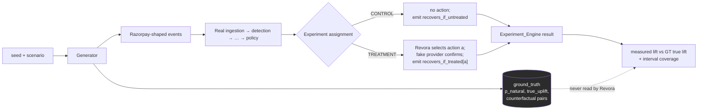

The ground-truth table is stored in `synthetic_run.ground_truth` and is readable only by the comparison reporter. No Revora component imports `synthetic` except the generator entrypoint and the reporter, enforced by the same import contract that isolates `policy`.

#### Making the Generator Honest

A generator tuned to flatter the optimizer proves nothing. Four countermeasures, all mandatory:

1. **A null scenario with `true_uplift = 0` for every action.** Revora must report `CAUSALITY_NOT_ESTABLISHED` — an interval containing zero. If it reports a lift here, the measurement is broken and the demo is invalid. This scenario runs in CI.
2. **A negative scenario** where an action reduces recovery. The optimizer must select `DO_NOTHING`.
3. **A high-baseline scenario** (`p_natural ≥ 0.8`) where intervention has small positive uplift but positive cost. Correct behaviour is `DO_NOTHING` with reason `HIGH_BASELINE_NO_INTERVENTION` — the "customer was going to pay anyway" case, P17.
4. **Interval coverage check across seeds.** Over ~200 seeds of the same scenario, the reported 95% interval should contain the true lift close to 95% of the time. Materially lower coverage means the interval is wrong, and every causal claim built on it is too.

Reported alongside every synthetic result (R13.C12): assumptions, embedded true lift, seed, and the difference between measured and true lift. Every derived figure carries `SYNTHETIC` on every surface and in every export (R12.C11, R14.C9).

**What synthetic evidence does and does not establish.** It establishes that Revora's measurement machinery recovers a known effect and correctly refuses to claim an absent one. It establishes nothing whatsoever about real recovery rates or real uplift, because those live in the ground-truth table that we wrote. Any claim of the form "Revora recovers X% more revenue" derived from synthetic data would be circular. The demo narrative must be "here is a system whose measurement you can trust," not "here is a system that recovers X%."

---

## Audit Architecture

### Append-Only in PostgreSQL

Two independent mechanisms:

```sql
REVOKE UPDATE, DELETE, TRUNCATE ON audit_record FROM revora_app;

CREATE FUNCTION audit_immutable() RETURNS trigger AS $$
BEGIN
  RAISE EXCEPTION 'audit_record is append-only (attempted %)', TG_OP;
END $$ LANGUAGE plpgsql;

CREATE TRIGGER audit_no_mutation
  BEFORE UPDATE OR DELETE ON audit_record
  FOR EACH ROW EXECUTE FUNCTION audit_immutable();
```

The grant is the primary control; the trigger catches the case where a migration or an operator restores the grant by accident. A rejected mutation attempt is itself recorded as `AUDIT_MUTATION_REJECTED` naming the actor (R11.C9), written by a separate function that has insert permission.

Not designed in, and deliberately: a hash chain over records. It would detect out-of-band tampering by someone with direct database access, which is a threat this deployment does not defend against anyway — a party with that access can also rewrite the chain. Adding it would be security theatre. If tamper-evidence against a privileged insider becomes a requirement, the right answer is shipping audit records to append-only external storage, and that is a **BUILD LATER** item, not a trigger.

### Gap-Free Per-Case Sequence Numbers Under Concurrency

The naive approaches both fail: a Postgres sequence has gaps by design (allocations are not rolled back), and `SELECT max(seq)+1` races.

The mechanism used: `recovery_case.audit_seq` is a counter on the case row. Every writer of an audit record for a case is already holding that row under `FOR UPDATE` — because every audited occurrence is a state change or a decision recorded in the same transaction as the case read. Allocation is `UPDATE recovery_case SET audit_seq = audit_seq + 1 … RETURNING audit_seq`, in the same transaction as the insert. Concurrent writers serialize on the row lock, and a rolled-back transaction rolls back the increment too. Result: strictly increasing, gap-free, no duplicates — `UNIQUE (case_id, seq)` enforces the last part.

Cost: audit writes for one case serialize. That is fine — they already serialize on the case row for state reasons, and per-case write volume is single digits.

Records not tied to a case (`SIGNATURE_REJECTED`, `RATE_LIMIT_APPLIED`, `AUTHENTICATION_FAILED`) have `case_id = NULL` and `seq = NULL`, and get their own correlation id (R11.C11).

### Correlation Id Propagation

Generated at event acceptance (R11.C7), carried on the `webhook_event` row, copied into every `job.payload` the processing enqueues, and read from a `contextvars` context that the worker sets when it claims a job. Any audit write during that job inherits it without being passed it explicitly, which is what makes P13 hold for asynchronously scheduled work rather than only for the synchronous path.

### The Explainability Query

R11.C5 requires one query to answer: what happened, why, on what evidence, which alternatives, which policy rules allowed or blocked, which action executed, whether payment recovered, and how the recovery is classified.

```sql
SELECT seq, occurred_at, event_type, actor,
       previous_state, new_state,
       diagnosis, evidence, decision, policy_result,
       action, action_result, idempotency_key, correlation_id
FROM audit_record
WHERE merchant_id = :m AND case_id = :c
ORDER BY seq;
```

Because the `decision` field carries the full candidate set with net values and exclusion reasons (R11.C6), and `policy_result` carries all twelve ordered check outcomes, this single ordered result set is the complete explanation. No joins to reconstruct, no derived state, no inference. That is the test of whether the audit design works: a merchant explaining a decision to a customer should never need a second query.

### Audit-Write Blocking

If a policy-decision or executed-action audit record cannot be persisted within `AUDIT_WRITE_TIMEOUT`, no partial record is written, a failure indication returns to the caller, and the Execution_Engine withholds every further external action for that case until an audit record for that occurrence persists (R11.C10, P29). Because the audit write shares the transaction with the state change (R16.C1), the common case of an audit failure is a whole-transaction rollback — state and audit cannot diverge. The explicit blocking rule covers the residual case where an audit record is written in its own transaction.

### PII in Audit Records

Masked at write time by a serializer that walks the record and applies masking to any field whose declared kind is `CONTACT` or `INSTRUMENT` (R11.C8). Masking is applied by the writer, not the reader, so an unmasked value never reaches durable audit storage. `MASK_DISCLOSURE_LENGTH` remains **[EVIDENCE INSUFFICIENT]**; 4 is the configured placeholder.

---

## Failure Handling

The governing rule from R16: **fail safely rather than act blindly.** An infrastructure fault must produce a delayed decision, never a duplicate charge, a duplicate message, or an invented number.

### Failure Catalogue

| Failure | Detection | Response | Recovery | Req |
| --- | --- | --- | --- | --- |
| Duplicate webhook | Unique `(merchant_id, provider_event_id)` | Discard, audit, 200 | None needed | R1.C4, R16.C8 |
| Out-of-order webhook | Provider timestamp comparison | Apply only on a legal forward transition; else no state and no counter change | Later events reconcile | R1.C7 |
| Lost webhook / webhook disabled | No events received for longer than a configured interval | Alert + detection-gap backfill | Backfill ingests missed failed payments | the webhook auto-disable item (new) |
| Malformed payload | Schema or round-trip check | Quarantine, 202, no case | Merchant review in dashboard | R1.C6, R16.C12, C14 |
| Signature mismatch | HMAC compare | 401, retain nothing, audit | Multi-secret verification covers rotation | R1.C2 |
| Persistence unavailable at ingest | DB error | 503 → provider redelivery | Redelivery for 24 h; then backfill | R16.C3 |
| Persistence unavailable mid-pipeline | Timeout / error | Prior state remains readable, no external call, failure returned | Job retries; sweeper re-evaluates | R16.C2, C4 |
| Concurrent transition | Version mismatch | One commits, others rejected + `VERSION_CONFLICT` | Caller re-reads before any external call | R16.C7 |
| Worker crash mid-execution | Stale `ATTEMPTED` intent | → `UNCERTAIN`, reconcile by `reference_id`, never repeat the call | the Two Dangerous Windows section, the Reconciliation Loop subsection | R9.C16, R16.C5 |
| Provider timeout | `PROVIDER_CALL_TIMEOUT` | → `UNCERTAIN`, halt all external calls for the case | Reconciliation | R9.C9 |
| Provider 5xx | Status classification | → `UNCERTAIN` | Reconciliation | R9.C9 |
| Provider 4xx | Parseable error object | → `FAILED`, record code, no retry within the attempt | New decision cycle if bounds allow | R9.C8 |
| Unparseable 200 | Pydantic rejection | → `UNCERTAIN` | Reconciliation | R9.C9 |
| Reconciliation exhausted | Attempt counter | → `ESCALATED` `EXECUTION_RESULT_UNVERIFIABLE`, no further call ever | Human | R9.C17 |
| LLM timeout | `REASONING_TIMEOUT` | Bounded retry then deterministic fallback | Automatic | R4.C3 |
| LLM invalid output | Schema gate | Discard, audit with truncated raw, deterministic fallback | Automatic | R4.C2 |
| LLM unavailable | Consecutive-failure threshold | Short-circuit; full system continues | Probe on next invocation | R4.C4 |
| Baseline estimation timeout | `BASELINE_ESTIMATION_TIMEOUT` | No estimate recorded; case stays `DIAGNOSED` | Retry next cycle | R5.C11 |
| Recovery_Memory unreachable | Query error | All-prior estimates marked `UNCALIBRATED` | Automatic | R6.C11 |
| Audit write failure | `AUDIT_WRITE_TIMEOUT` | No partial record; block further external action for the case | Retry then alert | R11.C10 |
| Payment state unreadable | Attempt bound | → `ESCALATED` `PAYMENT_STATE_UNVERIFIABLE`; declare no recovery | Human | R10.C7 |
| Conflicting payment states | Signal comparison | Hold in `WAITING_FOR_OUTCOME`, re-read | Converges or escalates | R10.C6, C13 |
| Restart with in-flight cases | Startup reload | Re-evaluate window, cooldown, counters from persisted rows before scheduling anything | Automatic | R16.C6 |
| Poison job | Attempt cap | Dead-letter + alert; correctness independent of job success | Manual | the Job Queue and Scheduler subsection |
| Clock skew | — | All comparisons on stored UTC instants; no local time anywhere | — | R16.C9 |

### Restart Sequence

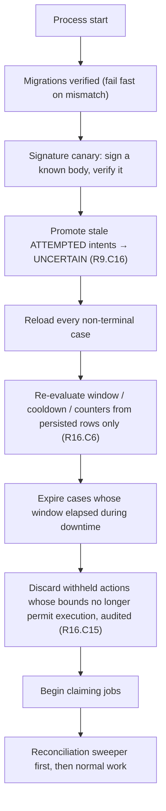

Step H matters more than it looks: after an outage, a queue of actions that were correct an hour ago may now violate the cooldown or the window. Executing them because they were approved before the outage would violate P10 and P11. They are re-evaluated and discarded if stale.

### Degradation Ladder

| Broken | Still works |
| --- | --- |
| LLM | Everything except AI-assisted diagnosis and drafted copy |
| Recovery_Memory / model | Detection, diagnosis, policy, execution, outcome, metrics — with `UNCALIBRATED` estimates |
| Razorpay outbound API | Ingestion, detection, diagnosis, valuation, policy; execution holds; outcome verification degrades to conflict-hold |
| Worker process | Ingestion continues and persists; all decision work resumes when a worker returns; window bounds still apply from persisted timestamps |
| Postgres | Nothing. Deliberate — a system that keeps acting without durable state is the failure mode to avoid, not to engineer around |

That last row is a design position, not an oversight. Every alternative — a queue that buffers actions during a database outage, a cache that serves state — reintroduces the possibility of acting on state we cannot verify. The correct behaviour during a Postgres outage is to stop.

---

## Security Boundaries

Threat model first, per the security-review discipline in the project skill pack. **No regulatory compliance claim is made anywhere in this section**; applicable statutory and card-network obligations are **[EVIDENCE INSUFFICIENT]** (R17 preamble).

### Assets, Actors, Boundaries

**Assets:** Razorpay API credentials; webhook secrets; LLM credentials; customer contact data; payment metadata; the audit log's integrity; the ability to send a customer-visible message; the ability to create a payment link.

**Actors:** Razorpay (semi-trusted — authenticated by signature, contents untrusted); Merchant_User (authenticated, scoped); an anonymous internet caller (untrusted, can reach only the webhook endpoint); the LLM provider (untrusted output); an internal worker (trusted code, untrusted data).

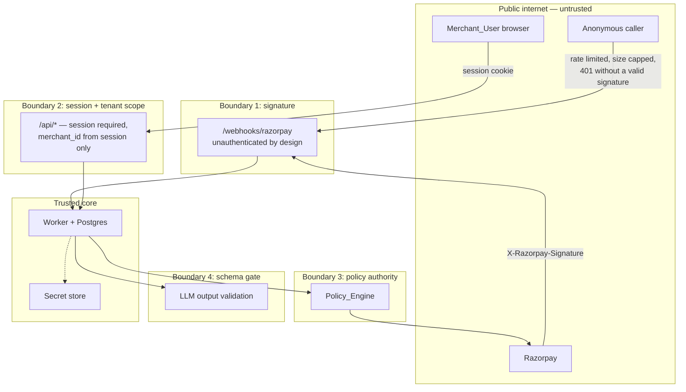

### Controls by Area

**Authentication.** Session required for every dashboard and management request; a session older than `SESSION_LIFETIME` is unauthenticated (R17.C1, C13). The webhook endpoint is authenticated by signature, not session — and it is the only endpoint in the system without a session. Worth stating explicitly since an unauthenticated network-exposed endpoint is a security-relevant choice: it is unavoidable for webhook receipt, and it is mitigated by signature verification before any interpretation, a payload size cap before hashing, per-source rate limiting (R17.C12), and zero information disclosure in its responses.

**Authorization and tenant isolation.** `merchant_id` derived from the session only; any merchant id in a request is ignored (R17.C2). Cross-tenant requests return **404**, not 403, so existence is not disclosed (R17.C3). Enforced at the repository layer (every function requires `merchant_id`) and again by RLS (the Tenant Isolation in the Schema subsection). Property P30 covers reads, lists, queries and exports.

**Secrets.** Razorpay key id/secret, webhook secrets, LLM credentials, and the payload encryption key resolve at runtime from platform secret storage. None in source control, none in audit records, none in application logs. A missing or unreadable credential refuses the external call, leaves state unchanged, and audits `CREDENTIAL_UNAVAILABLE` (R17.C4). Note the operational warning from the API Authentication item: Razorpay API keys are shared between Payment Gateway and RazorpayX, so rotation has blast radius outside Revora — tell the merchant before onboarding.

**Transport.** TLS with certificate validation on every outbound call; verified requirement of TLS 1.2+ toward Razorpay. A TLS or certificate failure abandons the request before transmitting any case field and audits `TRANSPORT_SECURITY_FAILED` (R17.C5, C14).

**Webhook authenticity.** Raw-body HMAC before parse; multi-secret window for rotation; `x-razorpay-event-id` dedup; replay of any already-seen event id produces zero side effects (R16.C8). Razorpay publishes source IPs — allow-listing them is a recommended deployment control, but the signature is the security boundary, not the IP list.

**Input validation.** Provider payloads, API requests, LLM outputs, ids, enums and state transitions are all validated at their boundary. The three that matter most: the raw-bytes-then-parse order at ingest; the LLM schema gate; the state transition table.

**AI-specific.** Prompt contract allow-list blocks transmission of any field outside it (R17.C15). No tools, no function calling, no data access from the model. Output constrained to enums and bounded numerics. Cross-tenant context leakage is structurally impossible because every prompt is built from a single case's fields inside a merchant-scoped transaction. Privilege escalation is impossible because there is no privilege to escalate to — the model's output is data, and the policy engine cannot read it.

**PII minimization.** Cleartext contact exists in exactly two places: inside the encrypted `webhook_event.raw_payload_ciphertext`, and transiently in memory during an execution call. Everywhere else — cases, recommendations, audit records, logs, metrics, memory observations, LLM prompts — holds masked values or nothing (R17.C6–C8, R11.C8). `customer_key` is a keyed hash, not reversible, and is what cross-case opt-out joins on.

**Retention.** Customer contact data deleted or irreversibly masked within 24 hours of `CUSTOMER_DATA_RETENTION` elapsing, retaining the non-identifying fields metrics need, with the applied retention configuration version recorded (R17.C11). Statutory floors and ceilings **[EVIDENCE INSUFFICIENT]**.

**Abuse prevention.** Per-source rate limit at ingest; `MAX_RECOVERY_ATTEMPTS` and `MAX_CUSTOMER_MESSAGES` per case; `COOLDOWN_INTERVAL` between actions; opt-out honoured across every case of a customer; fraudulent event injection blocked by signature verification. The bound that actually protects a customer from being spammed is the message counter checked *before* execution and incremented *at* execution, which is why the Counter Placement subsection places it where it does.

### Residual Risks Accepted for MVP

| Risk | Severity | Why accepted | What would change it |
| --- | --- | --- | --- |
| Insider with direct DB access can alter audit records | Medium | Append-only controls stop the application, not a DBA. Hash chains would not help against the same actor | Ship audit records to append-only external storage |
| No per-user roles — every Merchant_User has full access to their merchant's data | Medium | MVP has one operator persona; roles add surface without a second persona to serve | A merchant with separated duties |
| Encryption key lives with the application, not in a KMS with separate custody | Medium | Platform secret storage is the pragmatic MVP choice; key rotation is manual | Production deployment; a real key-custody requirement |
| LLM provider sees failure metadata | Low | No contact data, no instrument data, amount as a band only | A merchant contractually barring third-party processing |
| Session management is cookie-based with no MFA | Medium | Standard for MVP; MFA is an auth-provider decision, not an architecture one | Production deployment |

---

## Deployment Architecture

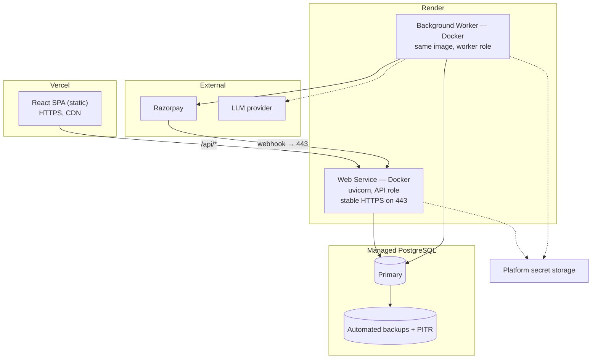

### Why This Shape

**Backend on Render (or any always-on container host), not serverless.** Driven by verified constraints, not preference:
- Razorpay requires a public HTTPS URL on port 80/443 and treats a non-2xx or a >5-second response as a delivery failure. A cold-starting function risks both. **[FACT]** on the provider constraint; **[INFERENCE]** on cold-start risk magnitude.
- The worker role is a long-running poll loop with periodic sweepers. That is an always-on process, not a request handler.
- Advisory locks and `SKIP LOCKED` want stable, pooled database connections. Serverless connection churn fights both.
- Several tunnel and request-bin domains are blacklisted by Razorpay, so the endpoint must be a real deployed host even in development (`zrok` for local).

**Frontend on Vercel.** Static SPA, no SSR requirement, no server-side secrets. Free tier, HTTPS, CDN. Nothing about the design depends on Vercel specifically.

**Two process roles, one image.** Same Docker image, different entrypoints. Identical dependency graph, no drift between what handles a webhook and what executes an action.

**One database, managed, with PITR.** For a system whose correctness rests on durable state, point-in-time recovery is the backup requirement that matters.

### What Is Deliberately Not Deployed

No Kubernetes (two processes), no service mesh (two processes), no message broker (the Job Queue and Scheduler subsection), no Redis (ADR-3), no separate cache (Postgres at this scale is the cache), no API gateway (FastAPI handles routing and auth), no separate secrets service beyond the platform's (an MVP-appropriate boundary), no observability stack beyond structured logs and the audit log (the audit log *is* the domain observability, and a metrics/tracing backend is **BUILD LATER**).

**On AWS specifically:** the design uses none. AWS service count is not a success metric, and every candidate service (SQS for the queue, ElastiCache for locks, Secrets Manager for secrets, Lambda for handlers) either duplicates something Postgres already does transactionally or introduces the dual-write problem the Job Queue and Scheduler subsection exists to avoid. If the deployment must be AWS for other reasons, the mapping is: Fargate for both process roles, RDS Postgres, Secrets Manager, and CloudFront + S3 for the SPA — **with the queue and locks still in Postgres**, because that choice is about transactionality, not hosting.

### Configuration and Migrations

All ~50 bounds from the requirements table are database-backed configuration rows with a version identifier, not environment variables — R15.C6 requires policy changes to be recorded with an approving user, which a redeploy cannot provide. Environment holds only connection strings, secret references, and the process role.

Migrations run via Alembic as a release step; the application verifies the schema revision at startup and refuses to serve on mismatch. A worker running against an older schema than the API is a class of bug that is very hard to diagnose from a wrong recovery number.

---

## Technology Selection and Justification

Each row states the choice, why it beats the alternative *for this system*, and what would change it. Rows marked **CHALLENGED** are where I disagree with or narrow the stated direction.

| Concern | Choice | Why this | Rejected alternative | What would change it |
| --- | --- | --- | --- | --- |
| Backend language | Python 3.12 | The ML layer, the decision layer, and Hypothesis all live in one language. Splitting them would add a serialization boundary in the middle of the value calculation | Node/TypeScript: better typing, no scikit-learn. Go: better concurrency, no ML ecosystem | If the ML layer were dropped entirely, TypeScript end-to-end would be defensible |
| Web framework | FastAPI | Raw-byte body access (required for signature verification), async I/O for the ack budget, Pydantic-native, OpenAPI for free | Django: heavier, ORM-coupled, more than needed. Flask: would need the async and validation pieces bolted on | Nothing foreseeable |
| Validation | Pydantic v2 | Two boundaries demand schema validation — provider payloads and LLM output (R4.C1). One library for both | Hand-written validators: more code, less consistent errors | Nothing |
| Database | PostgreSQL 15+ | Transactions for the Execution Flow section, `SKIP LOCKED` for the queue, advisory locks for execution, `JSONB` for payloads, `BIGINT` for money, RLS for tenancy, partial unique indexes for the two "exactly one" invariants. Every mechanism in one engine | MySQL: weaker `JSONB`, no partial indexes. MongoDB: the design is relational and transactional throughout | Nothing |
| **Managed Postgres provider** | **CHALLENGED — plain managed Postgres; Supabase acceptable but only as Postgres** | The backend uses SQLAlchemy, not `supabase-py`. We use no Supabase Auth, Realtime, Storage, Edge Functions, or PostgREST. So Supabase contributes a connection string and a dashboard. That is fine, and it is also all it contributes — Neon or RDS would be equivalent. **Recommendation: use it if the free tier and pooler are convenient, but do not describe it as an architectural component, and do not adopt its SDK later without revisiting tenancy, since PostgREST + RLS is a different security model from application-layer scoping** | Supabase-as-a-platform: would make RLS the primary tenancy control and the client a direct DB consumer — a bigger change than it appears | Wanting Supabase Auth or Realtime; then it is a real decision, not a hosting label |
| ORM | SQLAlchemy 2.0 + Alembic | the Execution Flow section needs explicit control over transaction boundaries and `FOR UPDATE`. SQLAlchemy Core gives it; higher-level abstractions hide it | Raw SQL: viable and tempting; loses migration tooling and type mapping. Prisma/Tortoise: weaker transaction control | Nothing |
| **Job queue** | **CHALLENGED — Postgres-backed queue, `FOR UPDATE SKIP LOCKED`. Celery removed** | A job must be enqueued in the same transaction as the state change it follows. With Celery, `apply_async` before commit can run against uncommitted state; after commit it can be lost. Neither is possible with a Postgres queue. Secondary: one fewer service, one fewer failure mode, one fewer thing to explain. At MVP throughput (tens of cases/hour) Celery's throughput advantage does not arise | Celery + Redis: mature, good retry/beat tooling, but reintroduces the dual-write problem this design is specifically trying to avoid | Throughput in the thousands per second, or a need for complex fan-out/chord workflows |
| **Locking** | **CHALLENGED — Postgres advisory + row locks. Redis removed** | The execution lock must be atomic with the intent-record insert. A Redis lock cannot participate in a Postgres transaction, so a crash between "Redis lock acquired" and "Postgres intent committed" leaves an inconsistency that has to be reasoned about separately. With `pg_advisory_xact_lock` the lock and the insert commit or roll back together, and a crashed connection releases the lock automatically. Redlock's correctness is also contested in the literature, which is a poor foundation for a payment guard | Redis `SET NX PX` / Redlock: standard, but adds a component whose failure semantics must be reasoned about in the one place that must be airtight | Needing locks across services that do not share a database |
| **Idempotency store** | **CHALLENGED — the `execution_intent` table. Redis idempotency cache removed** | Idempotency here is a durable business record with four states and a reconciliation history, not a TTL cache entry. It must survive restarts and be auditable months later. That is a table | Redis with TTL: loses durability and auditability exactly when they matter | Nothing |
| ML | scikit-learn + NumPy | Logistic regression, isotonic calibration, Beta priors, bootstrap intervals. Nothing here needs more | XGBoost/LightGBM: more capacity than the data supports, less inspectable. PyTorch: not remotely warranted | Tens of thousands of labelled control-arm observations |
| LLM | Provider-adapter interface; OpenAI-compatible implementation first | Advisory only, behind a timeout and a schema gate, swappable. **[EVIDENCE INSUFFICIENT]** on the specific model/version to prefer — deliberately a runtime config, not an architectural commitment | A framework (LangChain/LlamaIndex/agents): adds abstraction over three simple, strictly bounded calls, and encourages exactly the tool-use and autonomy this design forbids | Needing multi-step reasoning, which would first require justifying why AI belongs on that path at all |
| Provider client | `httpx` + hand-written thin client | Needs an explicit `Unclassifiable` outcome distinct from error, which the SDK does not surface. The Razorpay Client subsection | Official SDK: convenient, but normalizes away the "might have happened" case that the Execution Flow section depends on | The SDK exposing raw responses and per-call timeouts |
| Frontend | React 18 + TypeScript + Vite + TanStack Query | Table-and-detail app with server-computed figures. Vite for build speed, TanStack Query for cache/staleness handling | Next.js: SSR unused, adds a server we do not want. Svelte/Vue: fine, no differentiator | An SEO or SSR requirement |
| Testing | pytest + **Hypothesis** + `testcontainers` | 30 correctness properties with universal quantification need a real PBT engine; Hypothesis's `RuleBasedStateMachine` is the natural fit for the lifecycle and idempotency properties, and its shrinking is what turns a failure into a readable counterexample. The Testing Strategy section | Hand-written table tests: cannot cover the input space the properties claim. Postman alone: no generative testing | Nothing |
| API testing | Postman collection for manual/demo verification | Useful as a human-facing artifact and for webhook simulation | Sole reliance on it: no | Nothing |
| Container | Docker, one image, two entrypoints | Dependency parity between roles | Separate images: drift risk | Nothing |
| CI | GitHub Actions | Runs lint, typecheck, **import-linter contracts** (which enforce the Module Map and the Dependency Rule subsection and the Why No AI Field Can Reach It subsection), pytest, Hypothesis, Alembic check | — | Nothing |

### The Three Challenges, Summarized

The stated stack included Celery, Redis, and Supabase. My recommendation is to drop the first two for MVP and demote the third to "a place to get a Postgres."

The reasoning is one idea, not three: **this system's correctness rests on transactional coupling between state changes, queued work, locks, and idempotency records.** Postgres can hold all four in one transaction. Every component that moves one of them outside Postgres converts a transaction into a distributed protocol, and distributed protocols around payment side effects are where duplicate charges come from. At tens of cases per hour there is no performance argument on the other side of the ledger.

I would revisit this the moment throughput or fan-out complexity gives Redis and Celery something real to do. Design detail worth noting: because enqueue is a repository call and locking is a repository call, swapping either later touches `jobs/` and `execution/` only.

---

## Correctness Properties

*A property is a characteristic or behavior that should hold true across all valid executions of a system — essentially, a formal statement about what the system should do. Properties serve as the bridge between human-readable specifications and machine-verifiable correctness guarantees.*

`requirements.md` Appendix A lists thirty candidate properties. The prework analysis over all 17 requirements found that most acceptance criteria are property-testable, and that several candidates were logically redundant. The properties below are the formalized, deduplicated set. Numbering preserves Appendix A's `P1`–`P30` so traceability is direct; consolidations and additions are marked.

### Property 1: Every external effect is preceded by an approval

*For any* execution history, every execution-intent record that reached `CONFIRMED` has exactly one `APPROVED` Policy_Decision naming the same Recovery_Case and the same Candidate_Action, issued before the intent's attempt-start timestamp, and consumed by no other intent. No Reasoning_Layer output alone precedes any external effect.

**Validates: Requirements 4.6, 4.10, 8.15, 8.16, 9.2**

### Property 2: Policy decisions are independent of AI output

*For any* Recovery_Case state and any Recommendation, replacing every Reasoning_Layer-produced field (diagnosis confidence where AI-assisted, explanation text, drafted content) with arbitrary schema-valid content, while leaving the declared deterministic input set unchanged, yields an identical Policy_Decision verdict, an identical primary reason, and identical ordered outcomes for all twelve checks.

**Validates: Requirements 4.5, 4.9, 8.14**

### Property 3: At most one external call per Idempotency_Key

*For any* sequence of execution requests, worker crashes at arbitrary points, restarts, and reconciliation runs, the number of provider create-calls issued for a given `Idempotency_Key` is at most one, every request for that key returns the same recorded result, and the executed-action and customer-message counters move at most once for that key.

**Validates: Requirements 9.3, 9.4, 9.5, 9.6, 9.10, 9.11, 9.16, 16.5**
*Consolidates Appendix A P3 with the crash-recovery criteria.*

### Property 4: Duplicate and reordered events create at most one case and no extra effects

*For any* multiset of inbound Payment_Events containing arbitrary duplicates and delivered in an arbitrary order, the number of Recovery_Cases created for one payment identifier is at most one, the number of persisted events per `provider_event_id` is exactly one, and the executed-action and customer-message counters of every affected case are identical to those produced by the deduplicated, ordered delivery of the same events.

**Validates: Requirements 1.4, 1.7, 1.9, 1.10, 16.8**

### Property 5: Only legal state transitions are ever persisted

*For any* sequence of transition requests, legal and illegal, issued sequentially or concurrently, every consecutive pair in a Recovery_Case's persisted state history appears in the legal transition table, every applied transition has exactly one Audit_Record carrying prior state, new state, reason and timestamp, and every rejected request leaves the state and all four counters unchanged.

**Validates: Requirements 2.1, 2.2, 2.3, 16.7**

### Property 6: Every case terminates, and stays terminated

*For any* Recovery_Case and any interleaving of operations and clock advances, the case reaches a Terminal_State no later than `RECOVERY_WINDOW_DURATION + OUTCOME_WAIT_TIMEOUT + LIFECYCLE_EVALUATION_INTERVAL` after its detection timestamp, and no state appears after a Terminal_State except at most one reconciliation transition to `RECOVERED` supported by a verified captured payment read.

**Validates: Requirements 2.4, 2.5, 2.6, 2.12, 2.13, 2.14**

### Property 7: No action after payment is confirmed

*For any* Recovery_Case whose authoritative payment state became captured at time T, no customer-visible or payment-affecting action holds a `CONFIRMED` execution timestamp later than T, except actions whose execution-intent already existed at T, each of which is recorded `POST_PAYMENT_ACTION` and counted exactly once in `unnecessary_action_count`.

**Validates: Requirements 1.11, 8.3, 10.4, 10.5**

### Property 8: No customer-visible action after opt-out

*For any* customer holding opt-out status effective at time T, the number of `CONFIRMED` customer-visible actions across every Recovery_Case of that customer with an execution timestamp later than T is zero, until an explicitly recorded re-consent replaces the opt-out.

**Validates: Requirements 8.4, 17.10**

### Property 9: Attempt and message caps hold across a case lifetime

*For any* Recovery_Case and any sequence of scheduling and execution attempts, the number of `CONFIRMED` executed actions is at most `MAX_RECOVERY_ATTEMPTS`, the number of `CONFIRMED` customer-visible actions is at most `MAX_CUSTOMER_MESSAGES`, the recorded decision-cycle count is at most `MAX_RECOVERY_ATTEMPTS`, and no counter ever decreases.

**Validates: Requirements 2.7, 2.8, 2.11, 8.6, 8.7**
*Absorbs Appendix A P28 (decision-cycle bound), which is the same monotonic-counter claim on a third counter.*

### Property 10: Consecutive outbound actions respect the cooldown

*For any* two consecutive `CONFIRMED` outbound actions on one Recovery_Case, the interval between their execution timestamps is at least `COOLDOWN_INTERVAL`, and any request violating this is refused with reason `COOLDOWN_ACTIVE` carrying an earliest-permitted timestamp equal to the previous action timestamp plus `COOLDOWN_INTERVAL`.

**Validates: Requirements 8.8, 2.11**

### Property 11: Confirmed actions fall inside the recovery window

*For any* `CONFIRMED` action, its execution timestamp is not earlier than the Recovery_Case detection timestamp and not later than the persisted Recovery_Window end timestamp, and the window end timestamp equals detection plus `RECOVERY_WINDOW_DURATION` for the whole case lifetime.

**Validates: Requirements 2.5, 2.6, 8.9**

### Property 12: The audit log is append-only with gap-free per-case ordering

*For any* sequence of audited occurrences, including occurrences written concurrently for the same Recovery_Case, the Audit_Record sequence numbers for that case start at 1, increase by exactly 1, contain no gaps and no duplicates; every previously read record remains byte-identical after any later operation; and every update or delete attempt is rejected and recorded as `AUDIT_MUTATION_REJECTED` naming the requesting actor.

**Validates: Requirements 11.3, 11.4, 11.9**

### Property 13: One correlation id per originating occurrence

*For any* inbound Payment_Event, every Audit_Record produced while processing that event — including records produced by work scheduled asynchronously by that processing — carries the identical `correlation_id` assigned at acceptance; and *for any* occurrence not derived from an inbound event, all its records share one generated `correlation_id`.

**Validates: Requirements 11.7, 11.11**

### Property 14: The incremental value arithmetic chain is exact

*For any* Candidate_Action set, `incremental_probability` equals `intervention_recovery_probability − baseline_recovery_probability` with negatives retained, `expected_incremental_revenue` equals `payment_amount × incremental_probability` computed in integer minor units with half-up rounding, `net_recovery_value` equals `expected_incremental_revenue − action_cost − risk_cost − customer_cost`, and every reported aggregate equals the exact sum of the stored per-Recovery_Case integer figures.

**Validates: Requirements 7.1, 7.2, 7.3, 7.12**

### Property 15: Selection is the argmax of net recovery value among survivors

*For any* Candidate_Action set, the selected Candidate_Action has a `net_recovery_value` greater than or equal to that of every other candidate that carries no exclusion reason, is not marked `UNAVAILABLE`, and clears both `MIN_NET_VALUE_THRESHOLD` and `MIN_INCREMENTAL_PROBABILITY`; ties resolve to the lower summed cost, and remaining ties to the declared precedence order.

**Validates: Requirements 7.4, 7.7, 7.13, 7.14**

### Property 16: Nothing worth doing means doing nothing

*For any* Candidate_Action set in which no candidate clears both `MIN_NET_VALUE_THRESHOLD` and `MIN_INCREMENTAL_PROBABILITY` after all exclusion rules are applied, the selection is `DO_NOTHING` or `WAIT`, whichever holds the greater `net_recovery_value`, with `DO_NOTHING` chosen on equality, and the recorded selection reason is `NO_POSITIVE_VALUE`.

**Validates: Requirements 7.5**

### Property 17: The customer who was going to pay anyway is left alone

*For any* Recovery_Case whose `baseline_recovery_probability` is greater than or equal to `HIGH_BASELINE_THRESHOLD`, if no candidate carrying no exclusion reason clears both thresholds, then the selection is `DO_NOTHING` or `WAIT` and the recorded selection reason is `HIGH_BASELINE_NO_INTERVENTION`.

**Validates: Requirements 7.6**

### Property 18: Highest probability is not selection, and divergence is disclosed

*For any* Candidate_Action set where the candidate holding the greatest `intervention_recovery_probability` among non-excluded candidates differs from the selected candidate, both candidates appear in the Recommendation with their `expected_incremental_revenue`, summed cost terms and `net_recovery_value`, and the divergence reason `HIGHER_PROBABILITY_LOWER_NET_VALUE` is recorded.

**Validates: Requirements 7.8, 7.9**

### Property 19: DO_NOTHING is definitionally neutral

*For any* Recovery_Case, the `DO_NOTHING` candidate holds `intervention_recovery_probability` equal to `baseline_recovery_probability`, therefore `incremental_probability` and `expected_incremental_revenue` equal to zero, all three cost terms equal to zero, `net_recovery_value` equal to zero, and estimation method `DEFINITIONAL`; and the `WAIT` candidate holds `action_cost` and `customer_cost` equal to zero.

**Validates: Requirements 6.1, 6.4, 6.10**

*Note: Appendix A P19 stated "net_recovery_value equal to zero minus risk_cost". Requirement 6.4 sets DO_NOTHING's risk_cost to zero, so the net value is exactly zero. The property is stated to match the requirement.*

### Property 20: Recovery accounting partitions exactly and counts once

*For any* reporting period and any Recovery_Case population, `observed_recovered_revenue + natural_recovered_revenue` equals the sum of confirmed recovered amounts over cohort cases whose Terminal_State is `RECOVERED`; each recovered amount is counted exactly once regardless of how many success events were received or how many periods were restated; `unresolved_revenue` equals the summed `payment_amount` of cohort cases in a non-`RECOVERED` Terminal_State; and no case contributes to both totals.

**Validates: Requirements 10.8, 10.9, 10.10, 10.11, 10.14, 12.1, 12.2, 12.3, 12.5**

### Property 21: A causal claim requires an adequate experiment

*For any* reporting period, `incremental_recovered_revenue` carries a numeric value only where a `COMPLETED` experiment with at least the required per-group sample size, carrying none of the labels `UNDERPOWERED`, `INVALIDATED` or `SYNTHETIC`, reports a primary-metric lift whose uncertainty interval lies entirely above zero; otherwise it is reported `NOT_ESTABLISHED` with no numeric value, and every presentation of `observed_recovered_revenue` for that period carries the label `CAUSALITY_NOT_ESTABLISHED`.

**Validates: Requirements 12.4, 12.9, 12.13, 13.7, 13.8, 13.9, 13.11**

### Property 22: Cost outpacing recovery is surfaced

*For any* two consecutive reporting periods of equal duration where `recovery_rate` increases while `net_recovered_revenue` decreases, a `COST_OUTPACING_RECOVERY` finding exists in the same view as the reported `recovery_rate`, naming every segment whose `total_recovery_cost` increase exceeds its `observed_recovered_revenue` increase.

**Validates: Requirements 12.8, 12.14, 12.15**

### Property 23: Synthetic provenance propagates everywhere

*For any* metric, estimate, Recommendation or experiment result to which at least one observation from a Synthetic_Dataset contributed, the provenance value `SYNTHETIC` appears in every presentation surface and every export of that figure; and the value `REAL` appears only where every contributing observation is real.

**Validates: Requirements 5.4, 12.11, 14.9, 15.2, 15.3**

### Property 24: Group assignment is deterministic, stable and precedes diagnosis

*For any* experiment identifier and Recovery_Case identifier, repeated evaluation of the assignment function yields the same group for the experiment's lifetime; the persisted assignment timestamp precedes the first Diagnosis record for that case; and every request to change a persisted assignment is rejected.

**Validates: Requirements 13.1, 13.2, 13.14**

### Property 25: The control arm receives no Revora intervention

*For any* Recovery_Case assigned to `Control_Group`, the number of `CONFIRMED` actions derived from a Revora Recommendation is zero, while a Recommendation is nevertheless recorded for comparison; and any confirmed action outside the frozen Baseline_Workflow definition labels the case `CONTAMINATED` and excludes it from every reported group result.

**Validates: Requirements 13.3, 13.15**

### Property 26: Invalidated or contaminated experiments attribute nothing

*For any* experiment labelled `INVALIDATED`, or containing a case labelled `CONTAMINATED`, the number of cases in that experiment classified `Attributed_Recovery` is zero, every contaminated case is absent from every reported group result, and the contaminated and excluded counts are reported with the result.

**Validates: Requirements 13.8, 13.15, 13.16**

### Property 27: Payment event parsing round-trips

*For any* valid Payment_Event payload, parsing the payload, serializing the parse result, and parsing the serialized output produces a canonical representation equal to the first parse result in its set of populated fields and in every canonical field value, with equality holding across payloads that differ only in key order, insignificant whitespace, or offset representation of the same instant; and any payload for which that equality fails produces no Recovery_Case and no external request.

**Validates: Requirements 16.10, 16.11, 16.13, 16.14**

### Property 28: Version freezing survives promotion

*For any* experiment in state `ACTIVE` and any model version promotion recorded while it is active, every estimate produced for a case assigned to that experiment is produced by the version frozen at experiment definition time; and a change to any frozen component labels the experiment `INVALIDATED` and stops further assignment.

**Validates: Requirements 13.5, 13.16, 15.7**
*Replaces Appendix A P28, whose decision-cycle claim is absorbed into Property 9.*

### Property 29: A failed audit write blocks further external action

*For any* Recovery_Case whose Policy_Decision Audit_Record or executed-action Audit_Record failed to persist, the number of external actions executed for that case between that failure and the successful persistence of that record is zero, and no partial Audit_Record exists.

**Validates: Requirements 11.1, 11.10, 16.1, 16.2**

### Property 30: Tenant isolation holds on every access path

*For any* authenticated Merchant_User, every Recovery_Case, Audit_Record, Recommendation, experiment result and metric returned by any read, list, query or export belongs to the Merchant derived from that user's session; a request naming a record of another Merchant returns no field of that record; and a merchant identifier supplied in a request has no effect on the result.

**Validates: Requirements 17.1, 17.2, 17.3, 17.13**

### Property 31: Deterministic diagnosis needs no AI, and AI failure changes nothing structural (ADDED)

*For any* Payment_Event whose `error_reason` appears in the deterministic mapping table, the recorded Diagnosis has method `DETERMINISTIC`, confidence 1.0, and the number of Reasoning_Layer invocations is zero; and *for any* generated workload processed with the Reasoning_Layer unavailable, every case still reaches a Terminal_State, no case waits in a state pending a Reasoning_Layer response, and the distribution of Terminal_States is identical to the same workload with the Reasoning_Layer available, except for Diagnosis cause and method values.

**Validates: Requirements 1.12, 3.1, 3.2, 3.9, 4.3, 4.4**

*Added because the Payment Failure Taxonomy item's verification made the deterministic path the primary path, and R4.C4's "the system keeps working" claim deserves a property rather than a hopeful sentence.*

### Property 32: No customer contact value reaches audit, logs, or the model (ADDED)

*For any* generated customer contact identifier or payment instrument reference present in an inbound payload, that value appears in no Audit_Record field, no emitted log record, and no Reasoning_Layer request payload; every such stored field outside the encrypted raw event store reveals at most `MASK_DISCLOSURE_LENGTH` characters of the original; and any Reasoning_Layer request containing a field outside the declared prompt contract is blocked before transmission.

**Validates: Requirements 11.8, 17.6, 17.7, 17.8, 17.15**

*Added because R17's PII controls are the requirement most likely to regress silently — a single new log line breaks it — and a property test is the only thing that catches that in CI.*

### Claims That No Property Test Can Establish

Stated explicitly, because presenting these as covered would be the most misleading thing this document could do:

| Claim | Why testing cannot establish it | What can |
| --- | --- | --- |
| Revora recovers more revenue than the baseline workflow | It is an empirical question about the world, not a property of the code | The controlled experiment of R13, on real traffic |
| Baseline and intervention probabilities are accurate | The figures are configured priors; a test asserts arithmetic, not reality | Calibration against control-arm outcomes (the Calibration Report subsection) |
| Synthetic results predict real results | The ground truth is something we wrote | Nothing. Synthetic evidence validates measurement machinery only (the Making the Generator Honest item) |
| Full WCAG 2.1 AA conformance | Automated tooling covers a subset of success criteria | Manual assistive-technology testing and expert accessibility review |
| No policy threshold derives from Recovery_Memory | It is a structural claim about imports, not runtime behaviour | Import-linter contract in CI (the Module Map and the Dependency Rule subsection) |
| No client-side arithmetic on recovery figures | Same — an architectural constraint | Lint rule plus an API contract test that the server returns formatted values |
| Secrets are absent from source control | Not a runtime property | Secret-scanning in CI |
| Latency bounds are met | Wall-clock assertions in generative tests are flaky and get disabled | Single smoke assertions with generous bounds, plus production monitoring |
| Merchant-side manual recovery does not contaminate the control arm | The activity is invisible to Revora | Nothing available in MVP. A real limitation (the Critical Review section) |

---

## Error Handling

The Failure Handling section covers infrastructure and provider failure. This section covers the error *contract* — how errors are represented, surfaced, and made actionable.

### Error Taxonomy

| Class | Meaning | Retry? | Where it surfaces |
| --- | --- | --- | --- |
| `ValidationError` | Input violated a schema or a domain rule | No | HTTP 400/422; quarantine for provider payloads |
| `AuthError` | Absent, expired or foreign-tenant session | No | HTTP 401 / 404; `AUTHENTICATION_FAILED` / `AUTHORIZATION_DENIED` audit |
| `SignatureError` | Webhook HMAC failed | No (by us) | HTTP 401; `SIGNATURE_REJECTED` audit; alert if sustained |
| `PolicyRefusal` | A deliberate, correct refusal to act | No | Not an error to the merchant — a decision, shown with its reason |
| `TransientInfraError` | Persistence or network fault, definitely no external effect | Yes, with backoff | HTTP 503 at ingest; job retry elsewhere |
| `AmbiguousExternalError` | External effect may or may not exist | **Never retried** — reconciled | `UNCERTAIN` intent; reconciliation loop |
| `ProviderRejection` | Provider refused with a parseable error | Not within the attempt | `FAILED` intent; provider code recorded |
| `AIRejection` | LLM output failed a gate | Bounded retry then fallback | `AI_OUTPUT_REJECTED` audit; invisible to the merchant |
| `IntegrityViolation` | An invariant was breached — should be unreachable | No | Alert; case escalated; treated as a bug, not a condition |

The distinction between `TransientInfraError` and `AmbiguousExternalError` is the most important one in the taxonomy: the first is safe to retry, the second is the thing that creates duplicate charges when someone retries it. They are separate types precisely so a retry decorator cannot be attached to both.

### A Refusal Is Not an Error

`PolicyRefusal` deserves separate treatment. When Revora declines to act — opted-out customer, cap reached, cooldown active, high baseline — that is the product working. The dashboard presents it as a decision with its reason and the compared threshold values (R14.C6), never as a failure state, never as a red indicator, and never suppressed. A merchant who cannot see why Revora did nothing will assume it is broken.

### What the Merchant Sees

| Situation | Presentation | Never |
| --- | --- | --- |
| Metric unavailable | Named data-unavailable indication for that figure only; other figures still shown with their timestamps | Zero, a dash, or a stale value presented as current |
| Value not yet recorded | Not-yet-recorded indication naming the current case state | Zero or a placeholder number |
| Action failed at the provider | The recorded failure with the provider's own reason | "Something went wrong" |
| Action result unverifiable | Explicit unverified status, escalated for human attention | "Sent" |
| Recovery not causally established | `CAUSALITY_NOT_ESTABLISHED` beside the figure | The figure alone |
| Figure derived from synthetic data | `SYNTHETIC` beside the figure | The figure alone |

R14.C15–C16 require this and it is worth restating why: substituting zero for an absent value is not a display bug, it is a false financial statement.

### Internal Error Discipline

- No bare `except:`. Every handler names the exception classes it handles.
- No exception crosses a module boundary untyped; the provider client converts everything to a classified result (the Response Classification subsection).
- No `retry` decorator on any function that can produce an external effect. Retries live only where the effect is known not to have occurred.
- Every log record is structured, carries the `correlation_id`, and passes through the masking serializer.
- An `IntegrityViolation` is logged at critical, alerts, and escalates the case. It is never swallowed and never "handled" — if a unique constraint we rely on for correctness fires, the correct response is to stop and look.

---

## Testing Strategy

Two complementary layers. Unit and integration tests cover specific examples, integration points and configuration. Property-based tests cover the universal claims of the Correctness Properties section. Neither substitutes for the other: property tests find the input nobody thought of, example tests pin down the behaviour everybody assumed.

### Property-Based Testing Library

**Hypothesis** for Python. Justification:

- It is the mature PBT engine for Python, so no property engine is written from scratch.
- **Shrinking** is the deciding feature. A failure in a 40-step execution history is useless as a bug report; Hypothesis reduces it to the two or three steps that actually matter. For properties like P3 (exactly-once under crashes) that is the difference between a diagnosable failure and an ignored one.
- **`RuleBasedStateMachine`** models exactly the shape of the hardest properties here: a stateful aggregate with guarded operations and invariants that must hold after every step. P5, P6, P9, P10, P11 and P3 are all naturally expressed as one.
- **Persisted failure database** replays a discovered counterexample on every subsequent run, so a fixed bug stays fixed.
- Composable strategies let the domain generators below be defined once and reused across all thirty-two properties.

Configuration: **minimum 100 examples per property** (R-mandated), 500 for the pure arithmetic properties because they are microsecond-cheap, `deadline=None` on database-backed properties, and `suppress_health_check` only where a filtered generator is genuinely necessary and documented.

Every property test carries the tag comment format required by the workflow:

```python
# Feature: revora-incremental-revenue-recovery, Property 15: For any Candidate_Action set,
# the selected Candidate_Action has a net_recovery_value greater than or equal to that of
# every other candidate that carries no exclusion reason, is not marked UNAVAILABLE, and
# clears both MIN_NET_VALUE_THRESHOLD and MIN_INCREMENTAL_PROBABILITY.
@settings(max_examples=500)
@given(candidate_sets())
def test_selection_is_argmax_of_net_value(cs): ...
```

One property, one test. Not one property, five tests — that dilutes the traceability that makes the tag useful.

### Generators

Defined once in `tests/strategies/`, composed everywhere.

| Strategy | Produces | Deliberate coverage |
| --- | --- | --- |
| `money()` | `BIGINT` minor units | 0, 1, `MIN_DETECTION_AMOUNT ± 1`, `ESCALATION_AMOUNT_THRESHOLD ± 1`, very large |
| `probability()` | `Decimal` at 4 places, 0–1 | Exactly 0, exactly 1, `MIN_INCREMENTAL_PROBABILITY ± ε`, `HIGH_BASELINE_THRESHOLD ± ε` |
| `risk_cause()` | The 8 enum members | Includes `UNKNOWN` and `FRAUD_OR_RISK_SIGNAL` |
| `razorpay_error_fields()` | `(error_code, error_reason, error_source, error_step)` | **Only verified values** from the Payment Failure Taxonomy item, plus deliberately unmapped reasons to exercise the LLM path |
| `payment_failed_payload()` | Razorpay-shaped JSON bytes | Key reordering, whitespace variation, non-UTC offsets, escaped slashes (the documented signature trap), unicode, absent optional fields |
| `candidate_estimate_set()` | 2–9 candidates with all four figures | Deliberate ties on net value; deliberate high-probability-high-cost divergence; negative incremental values; zero and negative expected revenue |
| `policy_input()` | Frozen `PolicyInput` | Each of the twelve checks failing alone; several failing together to verify lowest-ordered reason selection; fields removed to force `UNAVAILABLE` |
| `event_delivery_plan()` | An ordered list of deliveries | Duplicates, reversals, interleaved payments, replays after terminal states |
| `provider_behaviour()` | A fake-provider script | Success, 4xx, 5xx, timeout, unparseable 200, delayed success, effect-exists-but-response-lost |
| `crash_plan()` | A set of crash points | Before intent commit, after intent commit before call, after call before result commit, during reconciliation |
| `clock_plan()` | A monotone sequence of instants | Crossings of cooldown, window end, outcome-wait timeout, retention period |
| `case_population()` | Cases with outcomes and costs | Cohort boundary cases exactly on period start and end; zero-denominator metric populations |
| `merchant_pair()` | Two merchants with overlapping-looking ids | Cross-tenant probing for P30 |
| `contact_identifier()` | Contacts and instrument references | Values chosen to be searchable in logs and audit rows for P32 |

The `payment_failed_payload()` and `razorpay_error_fields()` strategies use only field names and values verified in the Provider Verification Findings section. A generator that invents provider values would produce tests that pass against a system that fails in production.

### The Stateful Model

One `RuleBasedStateMachine`, `RecoveryLifecycleMachine`, carries the properties that are about histories rather than single calls.

**Rules:** deliver event (any kind, any order, any duplication); advance clock; run lifecycle sweeper; run diagnosis; run estimation and optimization; request policy evaluation; attempt execution (with an injected provider behaviour and crash point); run execution reconciliation; run outcome reconciliation; record opt-out; assign human owner; restart the process.

**Invariants checked after every step:**

| Invariant | Property |
| --- | --- |
| State is a member of the 14-value enum; history contains only legal pairs | P5 |
| No state follows a terminal state except one verified reconciliation to `RECOVERED` | P6 |
| Confirmed actions ≤ cap; confirmed messages ≤ cap; cycles ≤ cap; no counter decreased | P9 |
| Consecutive confirmed outbound actions ≥ cooldown apart | P10 |
| Every confirmed action timestamp within `[detected_at, window_end]` | P11 |
| External calls per `Idempotency_Key` ≤ 1 | P3 |
| Zero confirmed customer-visible actions after an opt-out instant | P8 |
| Zero confirmed actions after a verified captured read, except pre-existing intents marked `POST_PAYMENT_ACTION` | P7 |
| Audit sequence for the case is 1..n, gap-free, no duplicates | P12 |
| All records from one delivery share a `correlation_id` | P13 |
| Every confirmed intent has a preceding matching approval | P1 |

**Termination check** runs at teardown: advance the clock past the worst-case bound and assert every case is terminal (P6).

This single machine carries eleven properties. That concentration is intentional — these properties are all statements about the same object's history, and testing them separately would mean maintaining eleven near-identical harnesses that each explore a narrower space.

### The Fake Providers

`FakeRazorpay` implements the same interface as the real client and must simulate every behaviour the Response Classification subsection and the Two Dangerous Windows section depend on:

| Behaviour | Why it must exist |
| --- | --- |
| Duplicate webhook delivery of the same `x-razorpay-event-id` | P4 — verified at-least-once semantics |
| Out-of-order delivery, including `captured` before `failed` | P4, P7 — documented as possible |
| Correctly signed and incorrectly signed bodies | P32, R1.C1–C2 |
| Response after the ack deadline | Ingestion timeout path |
| `create_payment_link` success with a `plink_…` id and `short_url` | Happy path |
| `create_payment_link` 4xx with a parseable error object | `FAILED` classification |
| `create_payment_link` 5xx | `UNCERTAIN` classification |
| `create_payment_link` timeout **with the effect created** | **The critical case.** Verifies reconciliation finds the effect and no duplicate is created |
| `create_payment_link` timeout **with no effect created** | Verifies reconciliation eventually marks `FAILED` |
| 200 with an unparseable body | `Unclassifiable` → `UNCERTAIN` |
| `find_payment_links_by_reference_id` returning empty then non-empty | The read-after-write lag risk of the Reconciliation Read subsection |
| `fetch_payment` returning each of `created`, `authorized`, `captured`, `refunded`, `failed` | P20, and the `authorized ≠ recovered` rule |
| `fetch_payment` disagreeing with a received success webhook | R10.C13 conflict path |
| `fetch_payment` unavailable for N consecutive attempts | R10.C7 escalation path |
| Delayed success arriving after the case reached a terminal state | R10.C14 delayed reconciliation |

`FakeLLM` must simulate: valid output; wrong enum member; out-of-range confidence; missing required field; wrong type; non-JSON; empty; a prompt-injection payload attempting to alter behaviour; slow response beyond the timeout; transport error; and N consecutive failures to trigger the unavailable state.

Both fakes record every call, which is how the "zero calls" assertions in P31, R1.C12, R6.C8 and R8.C13 are made rather than assumed.

### Cost Tiers

| Tier | Properties | Runtime | Runs |
| --- | --- | --- | --- |
| **Pure, microsecond** — no I/O at all | P2, P14, P15, P16, P17, P18, P19, P24 (function), P27 | < 2 s total at 500 examples | Every commit, and in a pre-commit hook |
| **In-memory model** — fake repositories | P5, P6, P9, P10, P11, P13, P23, P28, P31 | seconds | Every commit |
| **Real Postgres** — `testcontainers`, needed for locks, unique indexes, concurrency, transactions | P1, P3, P4, P7, P8, P12, P20, P29, P30, P32 | minutes | Every push |
| **Full harness** — synthetic generator plus the whole pipeline | P21, P22, P25, P26, plus the Making the Generator Honest item's four scenarios and the interval-coverage check | ~10 min | Nightly and pre-demo |

The tiering matters practically: the arithmetic properties are the ones most likely to catch a real bug during development, and they are also the cheapest, so they run constantly. The Postgres tier catches the concurrency claims that cannot be tested any other way — a fake repository cannot demonstrate that `FOR UPDATE` serializes audit sequence allocation.

### Example-Based and Integration Tests

Property tests do not replace these. Deliberately kept few, so the suite stays informative:

- **Signature verification against a known vector** — one test with a fixed body, secret and expected hex digest. If the HMAC construction is wrong, every property test that signs its own payloads passes while production fails. This is the single most valuable example test in the suite.
- **Canonicalization of a captured real payload** — the `payment_link.partially_paid` sample from the documentation, asserting field extraction against verified names.
- **The mapping table** — one parametrized test per verified `error_reason`, asserting the expected Risk_Cause. Cheap, and it is the documentation of the Deterministic Layer subsection.
- **Twelve policy scenarios** — one per check, each constructed to fail exactly that check, asserting the verdict and primary reason. Complements P-style generation with readable, reviewable cases.
- **Contract test** — the dashboard API returns pre-formatted money strings (the testable half of R14.C12).
- **Smoke tests** — schema revision matches at startup; TLS verification enabled on every outbound client; secrets resolve; the webhook signature canary passes.
- **Latency smoke tests** — one assertion per bound with a generous margin, tagged so they can be excluded from CI gating without deleting them.
- **Accessibility** — `axe-core` in the component tests for the automatable subset of WCAG 2.1 AA, with an explicit note in the test module that this covers a subset only.
- **Postman collection** — webhook simulation with correct and incorrect signatures, and the dashboard read paths. A human-facing artifact for demo and manual verification, not part of the correctness argument.

### What CI Enforces Beyond Tests

- `import-linter` contracts: `policy` cannot import `reasoning`/`estimation`/`memory`; `domain` imports only the standard library; no feature module imports another's internals. These are the mechanisms behind P2 and R15.C6 that no runtime test can check.
- `mypy --strict` on `domain`, `policy`, `optimizer`. If the money arithmetic type-checks strictly, a float cannot silently enter it.
- Secret scanning.
- Alembic: exactly one head, and the migration set matches the models.
- A grep-level check that no `float` appears in any currency-bearing module.

---

## Critical Review

This section reviews the design above adversarially. Where I designed something that is not worth building, I say so.

### Unnecessary Components and Over-Engineering

**The `WAIT` action is arguably not a distinct action.** `WAIT` and `DO_NOTHING` differ only in intent: one means "no action ever," the other means "no action now, reconsider later." Both produce zero external effects and zero cost. The distinction is expressed entirely in whether the case re-enters `DECISION_PENDING`, which is already governed by the lifecycle guards. Two null actions doubles the tie-break logic in R7.C5–C6 for very little. **Verdict: keep, because `requirements.md` mandates both and P16/P17 reference both — but note that `DO_NOTHING` + a re-evaluation flag would be simpler.**

**`PROMISE_TO_PAY_FOLLOW_UP` is dead weight in MVP.** It has no detection trigger (promise-to-pay is a deferred trigger per R1.C15) and no verified provider capability. It sits in the enum contributing nothing but an `UNAVAILABLE` row. **MODIFY: keep in the enum for vocabulary, exclude from the eligibility table entirely so it does not even generate an estimate.**

**Sixteen `Metrics_Engine` criteria for a hackathon demo is too many.** R12.C8, C14 and C15 require cross-period comparisons. A demo has one period. Building three findings that cannot fire is effort spent on something nobody will see. **BUILD LATER for C8, C14, C15.**

**The four-way metric segmentation (R12.C10) is heavier than it looks.** Every metric × Risk_Cause × amount band × selected action × policy outcome is a large result set for a dashboard that will show maybe fifty cases. **MODIFY: implement segmentation by Risk_Cause and amount band in MVP; the other two dimensions are BUILD LATER.**

**Diagnosis confidence intervals and bootstrap intervals on the baseline (R5.C9) may be over-precision.** At `n = 0` the Beta interval is honest and useful. At `n = 25` a bootstrap interval on a logistic regression fitted to one-hot features is a lot of machinery for a number whose real uncertainty is dominated by intervention bias, not sampling error. **MODIFY: Beta posterior intervals in MVP; `UNCERTAINTY_UNAVAILABLE` for the fitted model until a bootstrap is genuinely warranted.**

**I nearly designed a hash chain into the audit log and talked myself out of it (the Append-Only in PostgreSQL subsection).** Recording that here because it is the clearest example of the failure mode this review is for: it would have looked rigorous and defended against nothing.

### Weak Assumptions

| Assumption | Weakness | If wrong |
| --- | --- | --- |
| Every cost figure in the bounds table | All placeholders. `MIN_NET_VALUE_THRESHOLD = 5000` minor units and `MAX_COST_TO_VALUE_RATIO = 0.30` are invented | Every selection decision shifts. The arithmetic stays correct; the choices change entirely |
| `action_cost` for a Payment Link is knowable | Razorpay's actual per-link and per-SMS cost to the merchant is **[EVIDENCE INSUFFICIENT]** | Cost-ratio exclusions fire wrongly in either direction |
| `customer_cost` can be monetized at all | Assigning rupees to customer annoyance is a modelling fiction. It is a tuning knob wearing a currency label | The value ranking encodes a preference we cannot defend as a measurement |
| `risk_cost` likewise | Same | Same |
| `payment_timed_out` → `ABANDONMENT` | Documentation says it also occurs with no gateway response, which is a technical failure | Wrong cause → wrong candidate set. Detectable via the LLM disagreement rate |
| Baseline workflow = "no automated action" | A merchant with existing dunning has a different baseline, and comparing against nothing overstates Revora | The whole incremental claim inflates. **This is the most consequential assumption in the design.** |
| `HIGH_BASELINE_THRESHOLD = 0.80` | Invented. It directly controls how often Revora does nothing | Either too passive or too eager, and no data currently distinguishes them |
| Hierarchical segment backoff (the Feature Segmentation subsection) | My addition, not in requirements. Reduces variance, introduces bias toward coarse segments | Estimates are less discriminating than they appear |
| `MASK_DISCLOSURE_LENGTH = 4` | No documentary basis found | May be non-compliant somewhere; unknown |

The pattern across this table: **the arithmetic is sound and every input to it is a guess.** That is the honest state of the system at MVP, and the Synthetic Dataset subsection's synthetic harness plus the Calibration Report subsection's calibration report exist to make it visible rather than to hide it.

### Unverified Claims in My Own Design

| Claim | Status | Resolving action |
| --- | --- | --- |
| Duplicate `reference_id` is rejected by Razorpay | Not verified — the design deliberately does not depend on it | Test-mode duplicate create |
| A just-created payment link is immediately visible in fetch-by-`reference_id` | Not verified; the Reconciliation Read subsection's last-attempt-only rule mitigates | Measure first-visible latency, 50 iterations |
| `fetch_payment` is read-after-write consistent with webhook emission | Not verified | Measure lag on `payment.captured`, 50 iterations |
| The deterministic mapping table covers the majority of real failures | **[INFERENCE]** from the reason list, not measured | Instrumented as a first-class metric from day one |
| No server-side retry capability exists | Verified absent from documentation, not from the account | Attempt on a `failed` payment id; inspect enabled products |
| Razorpay's link notification satisfies consent obligations | Outside my competence | Merchant/legal confirmation |
| 19-character idempotency key has negligible collision risk | Arithmetic is sound; the unique constraint is the real guard | None needed |

### Potential Failure Points

**Highest: webhook auto-disable (the webhook auto-disable item).** 24 hours of failed delivery and detection stops silently. The backfill job is the mitigation and it is an addition to the requirements, which means it is the part most likely to be cut under time pressure. It should not be.

**High: the `UNCERTAIN` state is where correctness lives.** If reconciliation is buggy or the sweeper is not scheduled, cases pile up in `UNCERTAIN` and the system stops acting on them. That fails safe — no duplicates — but it fails silently. `UNCERTAIN` intent count needs to be an alerting metric, not just a dashboard number.

**High: single Postgres, no read replica.** Correct for MVP and stated as deliberate in the Degradation Ladder subsection, but the whole system stops with the database. There is no partial-availability mode and by design there should not be.

**Medium: the audit sequence allocation serializes writes per case.** Fine at design volume. If a case ever generated hundreds of audit records, or if a long-running transaction held the case row, it would become a contention point.

**Medium: the lifecycle sweeper is a full scan of non-terminal cases.** Indexed, and small at MVP scale. Grows linearly with open cases and would need batching.

**Medium: `POLICY_DECISION_VALIDITY` of 15 minutes plus a re-check at execution means policy is evaluated twice per action.** Correct, and it doubles policy evaluation volume. Cheap because the function is pure.

**Low but real: clock dependence.** Every bound is a timestamp comparison. A misconfigured timezone anywhere breaks cooldown and window logic in ways property tests catch only if generators produce offset-bearing inputs — which is why P27 explicitly requires that.

### Security Risks

| Risk | Severity | Current position |
| --- | --- | --- |
| Webhook endpoint is unauthenticated by necessity | Medium | Signature before parse, size cap before hash, rate limit, no information disclosure. This is as good as it gets for webhook receipt |
| Raw payloads hold cleartext PII, encrypted with an application-held key | Medium | the masked-at-write-time conflict item's resolution. Key custody is the weak part — platform secret storage, not a KMS with separate custody |
| Insider with DB access can alter audit records | Medium | Accepted (the Residual Risks Accepted for MVP subsection). External append-only storage is the real fix and is BUILD LATER |
| No per-user roles | Medium | Accepted for a single operator persona |
| Prompt injection via provider text fields | Low | Bounded by the output schema and the absence of tools (the Prompt Injection subsection). Residual: a wrong cause could route to a costlier action |
| LLM provider sees failure metadata | Low | Contract allow-list, amount as a band, no contact data |
| Payment link short URL is a bearer capability | **Low but worth naming** | Anyone with the link can pay. That is inherent to payment links, not a Revora flaw, but it means the link must not appear in logs or audit records — covered by P32's field-kind masking, which must include `provider_short_url` |

That last row is a real finding from writing this review: `execution_intent.provider_short_url` is stored and displayed. It should be classified as a sensitive field kind so it is masked in logs, even though it is shown in the dashboard.

### AI Misuse Risks

**The honest residual, restated from the Why No AI Field Can Reach It subsection:** AI cannot authorize an action, but an AI-assisted Risk_Cause shapes which action is proposed. The claim "AI has no causal path to an external effect" would be false. The true claim is narrower: AI cannot cause an action that policy would otherwise refuse, and cannot change any number.

**Where I would push back on the requirements:** R3 permits the LLM to propose a Risk_Cause. Given the Payment Failure Taxonomy item — the provider tells us the reason in a machine-handleable field — the LLM's marginal value on the diagnosis path is small and its risk is non-zero. A defensible alternative is to drop AI from diagnosis entirely, let unmapped reasons be `UNKNOWN`, and monitor the unmapped rate to extend the table. That is strictly simpler and strictly safer. It is also less interesting for a demo. I recommend keeping the LLM path because R3 requires it and because the unmapped tail is real, but the design must not be described as needing AI to diagnose, because it does not.

**A risk the requirements do not name:** using the LLM to draft the payment link description means AI text reaches a customer. The content gates (R4.C7) check length, placeholders, amount equality and links. They do not check tone, factual claims about the debt, or anything a compliance reviewer would care about. **RESEARCH MORE / MODIFY: for MVP, use a template with slot substitution and let the LLM choose among a small set of approved templates rather than generating free text.** That preserves the adaptivity and removes the class of risk entirely.

### Data Quality Problems

- **`NO_INTERVENTION_CONFIRMED` overstates what it knows** (the Intervention-Status Labelling subsection). It means "no Revora action and no recorded merchant action." Merchant-side phone calls are invisible. Labelled and reported, not solved.
- **Action-selection skew** (the Recovery_Memory and Model Promotion subsection). Actions the optimizer never picks never accumulate observations, so their estimates never improve, so they keep not being picked. R15.C12's zero-observation report makes it visible; fixing it needs deliberate exploration (ε-greedy or Thompson sampling), which is **BUILD LATER** and would need its own safety review since exploration means deliberately taking an action believed sub-optimal.
- **The control arm is the only unbiased data source, and it is small.** At 1:1 allocation, half of a small volume. The calibration report will be `CALIBRATION_UNVERIFIED` in most bands for a long time.
- **Refunds are not netted** (the refund-state item), so recovered revenue is gross. Labelled.

### Causal Measurement Problems

- **Undetectable control-arm contamination.** A merchant chasing a control-arm customer by phone inflates control recovery and understates the measured lift, or the reverse if they chase treatment cases harder. Revora cannot see it. R13.C15 catches only contamination visible to Revora. **This is the deepest limitation in the whole design** and no amount of engineering fixes it — it needs an operational agreement with the merchant, and even then it is trust, not measurement.
- **Sample size is likely unreachable in a demo timeframe.** The Sample Size and Analysis subsection's arithmetic: detecting a 5-point lift off a 20% base needs roughly 1,000 per arm. A hackathon has zero real cases. Hence synthetic evidence, and hence the requirement that synthetic results are labelled `SYNTHETIC` everywhere.
- **Synthetic evidence is circular for effect size and valid only for measurement machinery.** Stated in the Making the Generator Honest item. Worth repeating because it is the easiest thing in this project to overclaim.
- **One primary metric, tested once, at α = 0.05.** Correct. But the design reports six per-arm figures and four comparison figures, and a reader who scans ten numbers for the significant one has performed multiple comparisons whether or not the code did. Secondary metrics are labelled `EXPLORATORY`, which is the right mitigation and depends on the reader honouring the label.

### Scalability

Honest assessment: **this design is correct at MVP scale and would need work at 100× scale, and none of that work is urgent.**

| Limit | Where it bites | Fix when needed |
| --- | --- | --- |
| Postgres job queue | Thousands of jobs/second | Partition the job table, or move to a broker — at which point the transactional-enqueue guarantee needs a different mechanism (outbox pattern) |
| Full-scan lifecycle sweeper | Hundreds of thousands of open cases | Batch by window-end ranges |
| On-the-fly metric aggregation | Millions of cases | Materialized views or a rollup table |
| Single writer per case | Never — cases are independent | — |
| Audit table growth | Retention-bounded | Time partitioning |
| One database | Write throughput | Read replica for dashboard and metrics first, which is the cheap 80% |

The outbox note matters: if the queue ever moves to a broker, the transactional-enqueue property that the Job Queue and Scheduler subsection depends on must be preserved by an outbox table, not abandoned.

### Integration Risks

| Risk | Severity | Mitigation status |
| --- | --- | --- |
| Webhook disabled after 24 h of failures | **High** | Backfill + alert — an addition to requirements, must not be cut |
| No provider-side idempotency for link creation | High | Substituted by `reference_id` + fetch-by-reference (the Reconciliation Read subsection). Depends on the listing endpoint's freshness, which is unverified |
| Retry / payment-method-update actions unavailable | High | Marked `UNAVAILABLE`; requirements amendment recommended (the unavailable Candidate_Actions item) |
| Razorpay API keys shared with RazorpayX | Medium | Operational warning to the merchant before onboarding |
| Blacklisted tunnel domains block local development | Medium | `zrok`, per the documentation |
| Payload or endpoint drift | Medium | Pydantic rejection → `Unclassifiable` → reconciliation, never a false success |
| Reminders on payment links would bypass the message cap | Medium | `reminder_enable: false` — a one-line setting with a correctness consequence (the Outbound Contract subsection) |
| Undocumented rate limits | Low | Self-imposed concurrency cap |

### Where Simpler Deterministic Logic Beats What I Designed

1. **Diagnosis without the LLM.** See the AI Misuse Risks subsection. The provider already publishes the reason.
2. **Template selection instead of free-text drafting.** See the AI Misuse Risks subsection. Removes a customer-facing risk class entirely.
3. **`DO_NOTHING` + a reconsider flag instead of two null actions.** See the Unnecessary Components and Over-Engineering subsection.
4. **Beta posterior instead of logistic regression for MVP.** Already the design's cold-start path. The honest framing is that the regression is BUILD LATER, not MVP.
5. **A fixed action-cost table instead of a simulator for cost.** The "Intervention_Simulator" name implies more than a configuration lookup. For MVP it is a lookup, and calling it that would be clearer.
6. **Postgres instead of Redis for locks, queue and idempotency.** Already applied (ADR-3). Worth listing because it is the largest simplification in the document.

### Component Classification

The fourteen MVP items from `requirements.md` are the floor. Where one is over-scoped for a hackathon-scale proof, the reduced version is named.

**BUILD** — required for the hypothesis to be testable at all:

| Component | Note |
| --- | --- |
| Event_Ingestion with raw-body signature verification and header-based dedup | Non-negotiable |
| Detection_Engine, deterministic, failed-payment only | Non-negotiable |
| Recovery_Case_Manager with the legal transition table and counters | The termination guarantee lives here |
| Diagnosis_Engine, deterministic mapping table | The verified error taxonomy makes this cheap and high-value |
| Baseline_Model as Beta priors with honest intervals | Reduced from the full R5 |
| Intervention_Simulator as a marked-`UNCALIBRATED` prior lookup | Reduced; name it honestly |
| Value_Optimizer | **This is the product** |
| Policy_Engine, pure, twelve ordered checks, versioned | **Non-negotiable** |
| Execution_Engine with execution intents and reconciliation | **Non-negotiable** |
| Razorpay client, three endpoints, explicit response classification | Non-negotiable |
| Outcome_Monitor with authoritative reads | Non-negotiable — the recovery number depends on it |
| Audit_Log, append-only, gap-free sequences, correlation ids | Non-negotiable |
| Experiment_Engine: assignment, suppression, freezing, labels | The only path to "incremental" |
| Metrics_Engine: R12.C1–C7, C11–C13 | Reduced |
| Synthetic generator with embedded ground truth and the four mandatory scenarios | The demo's entire evidence base |
| Merchant_Dashboard: case list, case detail, metrics, unresolved groups, experiment result | Reduced |
| Postgres job queue + sweepers | Non-negotiable |
| Detection-gap backfill | Addition to requirements; do not cut |
| Recovery_Memory tables with provenance and intervention-status labels | Cheap now, expensive to retrofit |

**BUILD LATER** — deliberately excluded from MVP:

| Item | Why deferred |
| --- | --- |
| Fitted logistic regression + isotonic calibration | Needs control-arm data that does not exist |
| Bootstrap intervals on fitted models | Precision the data cannot support |
| Automated retraining | Excluded by requirements; needs human promotion anyway |
| Cross-period findings: `COST_OUTPACING_RECOVERY`, `RECOVERY_MIX_SHIFT`, `RECOVERY_COST_EXCEEDS_VALUE` | Need two comparable periods |
| Metric segmentation by selected action and policy outcome | Two of four dimensions suffice for MVP |
| `payment.downtime.*` as a `WAIT` signal | Genuinely interesting — "the bank is down, wait" is a good use of a null action — but not needed to test the hypothesis |
| Refund reversal restatement | Capture `amount_refunded` now; restate later; label gross meanwhile |
| Audit shipping to external append-only storage | Real tamper-evidence, not MVP |
| Per-user roles and MFA | One operator persona in MVP |
| Deliberate exploration to fix action-selection skew | Needs its own safety review |
| Read replica, table partitioning, materialized views | No scale pressure |
| Voice, multilingual, additional channels, agent frameworks, Kafka, Kubernetes, microservices, vector DB | Excluded by requirements; listed so the exclusion is explicit |

**MODIFY** — build differently than the requirements or my own draft specify:

| Item | Modification |
| --- | --- |
| Candidate_Action executable set | `DO_NOTHING`, `WAIT`, `PAYMENT_LINK`, `CUSTOMER_MESSAGE`, `HUMAN_ESCALATION`; others `UNAVAILABLE` (the unavailable Candidate_Actions item) |
| Communication_Provider | Eliminated; Razorpay link notification (the Communication_Provider elimination item) |
| Customer contact storage | Encrypted raw event store + masked everywhere else (the masked-at-write-time conflict item) |
| `INGEST_ACK_TIMEOUT` | 3000 ms → 1500 ms |
| `MAX_MESSAGE_LENGTH` | 480 → 300, inside the verified 2048 `description` limit |
| Fraud flag | Derived from the configured risk-reason set, not a provider field (the derived fraud-condition item) |
| LLM message drafting | Template selection, not free-text generation (the AI Misuse Risks subsection) |
| `provider_short_url` | Classified as a sensitive field kind for logging (the Security Risks subsection) |
| `PROMISE_TO_PAY_FOLLOW_UP` | Removed from the eligibility table entirely |
| `Intervention_Simulator` | Describe and implement as a prior lookup, not a simulator |

**REMOVE** — designed or proposed, not built:

| Item | Why |
| --- | --- |
| Celery | Reintroduces the dual-write problem the design exists to avoid (ADR-3) |
| Redis for locks | Cannot participate in the intent transaction (ADR-3) |
| Redis for idempotency | Idempotency here is a durable auditable record, not a TTL cache |
| Supabase as an architectural component | Demoted to "a place to get a Postgres" (the Technology Selection and Justification section) |
| Audit hash chain | Defends against nothing this deployment faces (the Append-Only in PostgreSQL subsection) |
| Internal event bus | Lets subscribers observe rolled-back state (the Internal Events subsection) |
| Official Razorpay SDK on the execution path | Erases the `Unclassifiable` distinction the Execution Flow section depends on (the Razorpay Client subsection) |
| An LLM framework or agent abstraction | Three bounded calls; the abstraction encourages the autonomy this design forbids |
| Any AWS service | None technically justified at this scale (the What Is Deliberately Not Deployed subsection) |

**RESEARCH MORE:**

| Question | Why it matters |
| --- | --- |
| Payment link listing freshness after create | Determines whether the Reconciliation Read subsection's mitigation is sufficient or merely careful |
| `fetch_payment` consistency lag after webhook | Determines how often the conflict-hold path fires in normal operation |
| Real action cost per payment link and per SMS | Every cost-ratio decision depends on it |
| Whether any retry capability exists on the account | Would restore two candidate actions |
| What the merchant's actual pre-Revora baseline workflow is | **The most important open question in the project.** The entire incremental claim is relative to it |
| Whether `customer_cost` can be grounded in anything measurable | Currently a tuning knob wearing a currency label |
| Consent obligations for provider-sent notifications | Legal, not engineering |

### The Single Most Important Thing in This Review

If exactly one item from this section is acted on, it should be this: **the incremental claim is measured against the Baseline_Workflow, and the Baseline_Workflow is currently an assumption.** The Control Arm subsection defaults it to "no automated recovery action," which is the most favourable possible comparison for Revora. A merchant who already sends a reminder email has a baseline that recovers something, and against that baseline Revora's measured lift will be much smaller and possibly zero.

Defining the baseline honestly is the difference between a system that measures incremental value and a system that manufactures it. Everything else in this design — the exactly-once machinery, the audit log, the policy engine — is engineering that can be verified. That one definition is a judgement call, it is currently unmade, and it determines whether the central number means anything.

---

## Architecture Decision Records

### ADR-1: Modular Monolith, Not Services

#### Decision
One Python codebase deployed as two process roles (API, worker) against one PostgreSQL database, with module boundaries enforced by import-linter contracts rather than by network boundaries.

#### Evidence
`requirements.md` Scope Boundaries explicitly defers microservice decomposition, Kafka and Kubernetes to a later phase. The system's hardest correctness requirements — R9's exactly-once execution, R16.C1's atomic state-plus-audit commit, R11.C4's gap-free per-case audit sequence, R15.C1's observation written in the terminal transition's transaction — are all statements about **a single transaction spanning multiple concerns**. A service boundary between any two of those concerns converts the transaction into a distributed protocol.

#### Alternatives
1. **Services per bounded context** (ingestion, decision, execution, metrics). Independent scaling and deployment; would require an outbox or saga for every guarantee above.
2. **Serverless functions per handler.** Cheapest idle cost; conflicts with the verified 5-second webhook deadline, with the always-on worker loop, and with pooled connections for advisory locks.
3. **Single process, no worker role.** Simplest of all; the webhook ack budget cannot accommodate the decision pipeline, and periodic sweeps need a long-running loop.

#### Trade-offs
Gained: transactional correctness by default, one deployment, one log stream, one place to look. Lost: independent scaling of components, independent deploy cadence, and language freedom per component. Also lost: the ability to blame a network boundary for a bug.

#### Risks
Module boundaries erode without enforcement — mitigated by CI import contracts, which are the mechanism that makes the Why No AI Field Can Reach It subsection's AI-isolation claim structural. A single process is a single failure domain, accepted per the Degradation Ladder subsection.

#### Confidence
**HIGH**

#### What Could Change the Decision
A component with genuinely different scaling characteristics (a high-volume ingestion tier), a team large enough that deploy contention is real, or a regulatory requirement to isolate PII processing in a separate trust domain.

---

### ADR-2: PostgreSQL as the Single Source of Truth

#### Decision
One PostgreSQL database holds domain state, the job queue, execution-intent records, the audit log, learning observations and configuration. No second datastore.

#### Evidence
Every mechanism the design needs exists in Postgres and was chosen for a named reason: transactions (R16.C1), `FOR UPDATE SKIP LOCKED` (queue), advisory locks (the Why the Lock Exists subsection), partial unique indexes (the two "exactly one" invariants of R1.C4 and R1.C9), `BIGINT` (R7.C12 money exactness), `NUMERIC` (probability exactness), `JSONB` (payload retention), `BYTEA` (encrypted PII), row-level security (R17.C2 defense in depth), `TIMESTAMPTZ` (R16.C9), and `REVOKE` + triggers (R11.C3 append-only).

#### Alternatives
1. **Postgres + Redis** for queue, locks and idempotency — see ADR-3.
2. **Postgres + a document store** for raw payloads. `JSONB` and `BYTEA` already cover it.
3. **Postgres + a warehouse** for metrics. At MVP volume, on-the-fly aggregation is exact and never stale; a pipeline would add a staleness class of bug to the numbers the product is judged on.
4. **Event-sourced store** as the primary model. Attractive given the audit requirement, but R14 needs current-state queries constantly and projections would add a rebuild-lag failure mode. The design gets the audit benefit from an append-only table alongside current state, without the projection cost.

#### Trade-offs
Gained: atomicity across every concern, one backup and restore story, one thing to operate, one place to look during an incident. Lost: purpose-built performance in each area, and the ability to scale one concern independently.

#### Risks
It is the single point of failure and PITR is the mitigation. Mixed workloads on one instance — a heavy metric query competing with the queue — is real; a read replica for dashboards is the first scaling step (the Scalability subsection).

#### Confidence
**HIGH**

#### What Could Change the Decision
Queue throughput in the thousands per second, analytical query volume that interferes with transactional work, or a PII-residency requirement forcing a separate encrypted store.

---

### ADR-3: Postgres-Backed Queue and Locks; Celery and Redis Removed

#### Decision
Job queue: a `job` table claimed with `SELECT … FOR UPDATE SKIP LOCKED`. Execution lock: `pg_advisory_xact_lock` on the case id. Idempotency: the `execution_intent` table. **No Celery, no Redis.**

#### Evidence
The decisive argument is transactional coupling, and it has three parts.

*Queue.* A job must be enqueued in the same transaction as the state change it follows. With a broker there are only two orderings and both are wrong: `apply_async` before commit lets a worker run against state that may roll back; `apply_async` after commit can be lost if the process dies in between. R16.C1 requires the state change and its audit record to be atomic; extending that atomicity to the follow-on job costs nothing with a table and requires an outbox pattern with a broker — at which point the broker is doing the work a table was already doing.

*Locks.* The Why the Lock Exists subsection requires the check-for-existing-intent and the insert-of-new-intent to be atomic. `pg_advisory_xact_lock` participates in that transaction and is released by commit, rollback, or connection death — so a crashed worker cannot orphan it. A Redis lock cannot participate, so a crash between "Redis lock held" and "Postgres intent committed" leaves an inconsistency that must be reasoned about separately, in the one place in the system that must be airtight. Redlock's correctness under partition is also contested in the literature, which is a poor foundation for a guard on customer-facing payment actions.

*Idempotency.* R9 defines a four-state record with a reconciliation history that must survive restarts and be auditable months later (R11.C3). That is a table, not a TTL cache entry.

*Scale.* At tens of cases per hour, Celery's throughput advantage does not arise. `SKIP LOCKED` handles orders of magnitude more than this system will see.

#### Alternatives
1. **Celery + Redis** as originally proposed: mature retry semantics, `beat` for scheduling, good observability tooling. Rejected on the dual-write argument above.
2. **Redis only** for locks, Postgres for the queue: keeps the queue guarantee, loses the lock guarantee. Half the benefit, all of the extra component.
3. **`pgmq` or another Postgres queue extension:** more features than needed, and a managed-Postgres extension availability dependency.
4. **APScheduler in-process:** no durability; a restart loses scheduled work, which breaks R2.C13's evaluation guarantee.

#### Trade-offs
Gained: transactional enqueue, transactional locking, durable auditable idempotency, two fewer services, two fewer failure modes, two fewer things to explain in a review. Lost: Celery's retry and routing ecosystem (reimplemented as ~150 lines: attempts, backoff, dead-letter), `beat` (a scheduler loop), and Flower-style visibility (replaced by SQL against `job` and `job_attempt`, which is arguably better because it is queryable).

#### Risks
A hand-rolled queue has bugs a mature library does not — mitigated by keeping it deliberately minimal and by the design's independence from job success (every timing rule is also enforced by the sweeper from persisted timestamps). Long-running jobs holding row locks — mitigated by statement timeouts and by never holding a lock across an HTTP call. Queue table bloat — mitigated by autovacuum and periodic archival.

#### Confidence
**HIGH** on removing Redis for locks and idempotency. **MEDIUM** on removing Celery — Celery's operational tooling has real value, and if the team already knows it well, the outbox pattern is a legitimate way to keep both the broker and the transactional guarantee. What is not legitimate is a broker without an outbox.

#### What Could Change the Decision
Throughput in the thousands per second; a need for complex fan-out, chords or chains; a team with deep Celery operational experience and appetite for an outbox table.

---

### ADR-4: Policy Engine as a Pure Function over Persisted State and a Versioned Rule Set

#### Decision
`evaluate(PolicyInput, RuleSet) -> PolicyDecision`. No I/O, no clock, no randomness. `PolicyInput` is a frozen dataclass constructible only from persisted columns. Rule sets are code-declared, version-labelled, and changed only through a recorded configuration change with an approving user.

#### Evidence
R8.C14 requires identical inputs to yield identical decisions. R4.C5 requires the decision to exclude every AI-produced field. R4.C9 requires the decision to be unchanged when AI fields are replaced. A pure function over a closed input type satisfies all three *by construction*, and makes P2 testable in microseconds with no database — which means it runs on every commit rather than nightly.

#### Alternatives
1. **A service class with repository access.** Conventional; makes purity a convention rather than a type guarantee, and makes P2 an integration test.
2. **A rules DSL or external rules engine.** Attractive for merchant-editable rules; moves the most safety-critical logic into a tool whose evaluation semantics cannot be property-tested cheaply, and R15.C6 requires policy changes to be human-approved anyway, so runtime editability buys little.
3. **Database-driven rules** (thresholds in tables, check order in a table). Thresholds *are* configuration rows, correctly. Check *order* in a table would make R8.C2's fixed order a data property rather than a code property — the wrong direction for something whose ordering is a safety guarantee.

#### Trade-offs
Gained: microsecond property tests, exact replayability of any historical decision, structural AI isolation, trivially auditable logic. Lost: runtime rule editing without a deploy, and some duplication between the rule set constants and the configuration rows.

#### Risks
`PolicyInput` grows over time and construction gets sloppy — mitigated by the frozen dataclass and by R8.C17, which forces `BLOCKED` on any missing input rather than a default. Purity drifts if someone adds a lookup — mitigated by the import contract and by the function having no repository parameter to add one with.

#### Confidence
**HIGH**

#### What Could Change the Decision
A merchant requirement for self-service rule authoring, which would need a constrained DSL, a validation layer, and its own property test suite — a substantial project, correctly deferred.

---

### ADR-5: Execution-Intent Record plus Reconciliation for Exactly-Once

#### Decision
Persist an `execution_intent` in `ATTEMPTED` before the external call; use its `Idempotency_Key` as the provider's `reference_id`; on ambiguity move to `UNCERTAIN` and resolve by fetching from the provider by `reference_id`; never repeat the call.

#### Evidence
Verified: Razorpay documents no idempotency header for Payment Link creation (the Payment Links item). Verified: `reference_id` must be unique per link and the fetch-all endpoint accepts `reference_id` as a query parameter (the Payment Links item). Therefore the provider gives us a *reconciliation handle* even without a *deduplication guarantee*, and a reconciliation handle is sufficient: the Two Dangerous Windows section shows both crash windows resolve to at most one effect.

#### Alternatives
1. **Rely on a provider idempotency header.** Not available for this endpoint. Would be the cleanest solution if it were.
2. **Rely on `reference_id` uniqueness being enforced** — assume a duplicate create is rejected. Plausible, unverified, and if wrong it silently creates duplicate links. Rejected as a dependency; the design uses only the *query* capability, which is documented.
3. **Two-phase commit with the provider.** Not offered by any payment provider.
4. **Optimistic retry with post-hoc duplicate detection and cancellation.** Would send two SMS messages before detecting the duplicate. Unacceptable — the harm is already done.
5. **Increment counters only on confirmation.** Discussed in the Counter Placement subsection; risks a crash loop issuing calls without consuming attempts.

#### Trade-offs
Gained: at most one external effect per key across arbitrary crashes and restarts, with the argument reducible to a unique constraint plus a single call site. Lost: latency on the ambiguous path (a case may sit `UNCERTAIN` for minutes), and a wasted attempt when a crash occurs before the call actually happened.

#### Risks
Reconciliation read freshness is unverified (the Reconciliation Read subsection) — mitigated by treating an empty result as `FAILED` only on the final attempt. Reconciliation not running leaves cases stuck `UNCERTAIN` — fails safe but silently, so `UNCERTAIN` count must alert (the Potential Failure Points subsection). The `reference_id` 40-character limit forced a shortened hash key — the unique constraint is the real guard against collision.

#### Confidence
**HIGH** on the mechanism. **MEDIUM** on the reconciliation timing parameters, pending the freshness measurement.

#### What Could Change the Decision
Razorpay adding an idempotency header for Payment Links, which would let the create call itself be safely retried and simplify the whole flow.

---

### ADR-6: LLM Advisory-Only, Behind a Schema Gate, with a Deterministic Fallback on Every Path

#### Decision
Three sanctioned uses (ambiguous diagnosis, explanation text, description drafting), each with a deterministic fallback. Four gates: contract allow-list, timeout with bounded retries, output schema validation, content validation. No tools, no function calling, no data access. Every invocation audited including failures. Structurally excluded from the policy engine.

#### Evidence
`requirements.md` R4 in its entirety, plus the core principle that AI recommendation is not AI authority. The Payment Failure Taxonomy item's verification strengthened the case: the provider publishes a machine-handleable failure reason, so the deterministic path is the primary path and the LLM handles the tail.

#### Alternatives
1. **No LLM at all.** Strictly simpler and strictly safer. Unmapped reasons become `UNKNOWN`; the unmapped rate is monitored and the table extended. **I consider this genuinely defensible** and note it in the AI Misuse Risks subsection. Rejected only because R3 mandates the AI-assisted path and because the tail is real.
2. **LLM on the value estimation path.** Rejected outright — R7.C10 forbids it, and a language model producing a probability that multiplies into a currency figure is the exact failure this architecture exists to prevent.
3. **Agent with tool access** (fetch payment state, create links). Rejected outright. It would place a non-deterministic component in the authorization path, contradicting R4.C5–C6 and the project's stated non-goals.
4. **Fine-tuned classifier instead of a general LLM.** Would need labelled data that does not exist, and the deterministic table already covers the mapped cases.

#### Trade-offs
Gained: handling of the unmapped tail, human-readable explanations, and full continuity when the model is unavailable. Lost: the simplicity of having no LLM at all, and the latency budget the timeout consumes on the ambiguous path.

#### Risks
Prompt injection via provider text — bounded, not eliminated (the Prompt Injection subsection); residual is a wrong cause routing to a costlier action. Free-text customer-facing copy — **the AI Misuse Risks subsection recommends template selection instead of generation**, which removes this risk class. Model or provider drift changing output distribution — the schema gate catches structural drift, not semantic drift.

#### Confidence
**HIGH** on the boundary design. **MEDIUM** on whether the LLM belongs in MVP at all.

#### What Could Change the Decision
A measured deterministic hit rate above ~95% would make the LLM's marginal value hard to justify against its risk. Conversely, a long unmapped tail with genuine ambiguity would strengthen it.

---

### ADR-7: Calibrated Priors at Cold Start, Not a Trained Baseline Model

#### Decision
Hierarchical segments with Beta-Binomial posteriors, marked `PRIOR_FALLBACK` and `UNVALIDATED_BASELINE`, with honest wide intervals. A fitted logistic regression switches on per segment only once `MIN_SEGMENT_SAMPLE_SIZE` confirmed no-intervention observations exist. Training labels come only from `NO_INTERVENTION_CONFIRMED` observations.

#### Evidence
R5's own preamble establishes the intervention-bias problem: historical merchant data reflects past intervention, so a model fitted to it estimates intervened recovery and mislabels it baseline. The only unbiased source is the experiment's control arm (the Cold Start subsection), which does not exist until the experiment runs. Real recovery rates are **[EVIDENCE INSUFFICIENT]** (the What Remains Unverifiable subsection).

#### Alternatives
1. **Train on all historical outcomes.** Would produce a confident, biased baseline — and because baseline is the denominator of every incremental value figure, a biased baseline systematically distorts every decision. The worst option, and the most tempting because it looks like machine learning.
2. **Fixed global constant.** Simpler than segments; loses all discrimination and produces the same recommendation for an expired card and an insufficient-funds failure.
3. **Uplift model** (two-model or transformed-outcome). The theoretically right tool for "what does intervention add," and it needs both arms of an experiment. **BUILD LATER, and it is the right next step.**
4. **Merchant-supplied estimates.** Useful as priors, and the design accepts them as such. Not a substitute for measurement.

#### Trade-offs
Gained: honesty — the intervals show how little is known; no false precision; a labelling scheme that makes the trained version possible later. Lost: discriminative power, which is exactly what the data cannot currently support.

#### Risks
A wide interval invites someone to point-estimate from the mean and ignore the interval — mitigated by propagating `UNVALIDATED_BASELINE` and `CALIBRATION_SUSPECT` to every surface. Priors are arbitrary and shape early decisions — mitigated by the calibration report and by `MIN_NET_VALUE_THRESHOLD` acting as a floor on acting at all.

#### Confidence
**HIGH** that this is the right MVP position. **LOW** on the specific prior values, which are guesses and are labelled as such.

#### What Could Change the Decision
A few hundred resolved control-arm cases per segment, at which point the fitted model and then an uplift model become both possible and preferable.

---

### ADR-8: Synthetic Data with Embedded Ground Truth as the Primary Evidence Vehicle

#### Decision
A seeded generator producing Razorpay-shaped events with a hidden ground-truth recovery model and per-case counterfactual outcome pairs. Four mandatory scenarios including a null scenario with true lift zero. Every derived figure labelled `SYNTHETIC`. Reported alongside every result: assumptions, embedded true lift, seed, and measured-minus-true difference.

#### Evidence
R13.C12 requires exactly this. No production traffic exists (the What Remains Unverifiable subsection). The Sample Size and Analysis subsection's arithmetic shows the required sample size for a modest effect is around 1,000 per arm, which no hackathon timeframe supplies.

#### Alternatives
1. **Demo on a handful of hand-crafted cases.** Shows the UI, demonstrates nothing about measurement, and cannot show that the system correctly refuses to claim a causal effect.
2. **Synthetic data without ground truth.** Produces a lift number with nothing to check it against — the worst option, because it looks like evidence and is not.
3. **Replay anonymized real merchant data.** Better than synthetic if available; unavailable, and it would carry the intervention bias of ADR-7 anyway.
4. **Sandbox transactions against Razorpay test mode.** Valuable and complementary for integration verification, but it produces no recovery outcomes to measure, since nobody actually pays.

#### Trade-offs
Gained: a verifiable demonstration that the measurement machinery recovers a known effect and refuses an absent one. Lost: any claim about real-world effect size — and the generator itself is code that must be written and trusted.

#### Risks
**A generator tuned to flatter the optimizer proves nothing.** This is the central risk and the Making the Generator Honest item's four countermeasures exist for it: the null scenario, the negative scenario, the high-baseline scenario, and the interval-coverage check across seeds. The null scenario runs in CI, so a measurement bug that manufactures lift fails the build. Second risk: the demo narrative overclaims — mitigated by the `SYNTHETIC` label on every surface and by stating the limitation in the narrative itself.

#### Confidence
**HIGH** that this is the only honest option available. **MEDIUM** on whether the generator's realism is adequate, since realism is unverifiable without the real data we do not have.

#### What Could Change the Decision
Access to real merchant traffic, at which point synthetic data becomes a test fixture rather than an evidence vehicle.

---

### ADR-9: React SPA on Vercel, Containerized Backend on an Always-On Host

#### Decision
React 18 + TypeScript + Vite static SPA on Vercel. FastAPI in Docker on Render (or equivalent always-on container host), two process roles from one image. Managed PostgreSQL with PITR.

#### Evidence
Verified provider constraints drive the backend choice: a public HTTPS URL on port 80/443, TLS 1.2+, a 5-second response deadline after which the event is resent, non-2xx retried for 24 hours then the webhook **disabled**, and a blacklist that excludes common tunnel and request-bin domains. An always-on container satisfies all of these without cold-start risk. The worker role is a long-running poll loop, which is not a request handler. Advisory locks and `SKIP LOCKED` want pooled, stable connections.

The frontend has no SSR requirement (R14.C12 forbids client-side arithmetic but says nothing about rendering location) and no server-side secrets, so a static SPA on a CDN is the simplest correct answer.

#### Alternatives
1. **Serverless backend** (Lambda/Vercel Functions). Cheapest idle cost; cold starts risk the ack deadline, the worker loop has no home, and connection churn fights the locking design.
2. **Next.js full-stack.** One deployment for both tiers; adds an unused SSR layer and a second server-side runtime with its own secret surface.
3. **Self-managed VPS.** Cheapest and most controllable; adds TLS, process supervision, patching and backups to the project's scope.
4. **AWS Fargate + RDS + Secrets Manager + CloudFront.** Entirely viable and the right answer if AWS is a constraint. Not chosen because nothing in the design needs it and AWS service count is not a success metric. The mapping is in the What Is Deliberately Not Deployed subsection, with the queue and locks staying in Postgres.

#### Trade-offs
Gained: a stable HTTPS webhook endpoint, an always-on worker, pooled connections, one image for both roles, minimal operational surface. Lost: idle-cost efficiency, and platform portability (though Docker keeps the backend movable in an afternoon).

#### Risks
Free-tier hosts idle or sleep, which would break the webhook deadline — a paid always-on instance is required, and this is a real cost line, not an optimization. Single region means latency for distant callers, irrelevant at this scale. Vendor coupling is low: the SPA is static files and the backend is a container.

#### Confidence
**HIGH** on always-on-container versus serverless, driven by verified constraints. **MEDIUM** on Render specifically — Fly.io, Railway, App Runner or Fargate are equivalent for this purpose.

#### What Could Change the Decision
An organizational AWS mandate (see the the What Is Deliberately Not Deployed subsection mapping), or webhook volume high enough to want autoscaling at the edge — at which point a small always-on receiver in front of a scalable pipeline is the shape, not serverless throughout.

---

## The Thirty Architecture Questions, Answered

| # | Question | Answer | Detail |
| --- | --- | --- | --- |
| 1 | What event creates a Recovery_Case? | A signature-verified, deduplicated, canonicalized `payment.failed` webhook whose payment status is failed, amount ≥ `MIN_DETECTION_AMOUNT`, currency supported, and with no verified captured state. One case per payment, guaranteed by a partial unique index — not by code | the Detection_Engine subsection, the Inbound Webhook subsection |
| 2 | What are the diagnosis inputs? | Only persisted provider fields: `error_reason`, `error_source`, `error_step`, `error_code`, `method`, plus case metadata. Zero provider calls. `error_reason` is the primary key into a deterministic mapping table built from verified documented values | the Deterministic Layer subsection, the Payment Failure Taxonomy item |
| 3 | What exactly is the "no intervention" scenario? | The Baseline_Workflow: a frozen, versioned definition of what the merchant did before Revora. MVP default is "no automated recovery action, observe to terminal." **This default is the design's most consequential assumption** — if the merchant already sends reminders, the real baseline recovers something and Revora's measured lift shrinks | the Control Arm subsection, the Single Most Important Thing in This Review subsection |
| 4 | How is baseline recovery probability estimated? | Beta-Binomial posterior over confirmed no-intervention observations in a hierarchical segment, with backoff to coarser segments and finally a global prior. Marked `PRIOR_FALLBACK` and `UNVALIDATED_BASELINE` when thin. A fitted logistic regression switches on per segment only once enough control-arm data exists | the Feature Segmentation, Cold Start and When the Model Turns On subsections |
| 5 | How are candidate interventions generated? | From a cause-to-action eligibility table, always including `DO_NOTHING` and `WAIT`, 2–9 members. Actions with no verified provider capability are marked `UNAVAILABLE` and retained in the record so the dashboard can show they were considered | the Intervention_Simulator subsection, the unavailable Candidate_Actions item |
| 6 | How is incremental value calculated? | `incremental = intervention − baseline`; `expected = amount × incremental` (integer minor units, half-up); `net = expected − action_cost − risk_cost − customer_cost`. All integer, no floats, aggregates equal the exact sum of stored per-case integers | the Value_Optimizer subsection, the Where Money Figures Come From subsection, P14 |
| 7 | How is cost represented? | `action_cost` as integer minor units from a configuration table. **Real per-link and per-SMS cost is [EVIDENCE INSUFFICIENT]** and is a `RESEARCH MORE` item, because every cost-ratio exclusion depends on it | the Intervention_Simulator subsection, the Weak Assumptions subsection |
| 8 | How is customer fatigue represented? | Three mechanisms. Hard: `MAX_CUSTOMER_MESSAGES` and `COOLDOWN_INTERVAL`, enforced by the policy engine before execution. Soft: `customer_cost` in the value arithmetic. Honest caveat: `customer_cost` is a tuning knob wearing a currency label, not a measurement | the Twelve Checks subsection, the Weak Assumptions subsection |
| 9 | How is risk represented? | Two mechanisms. Hard: `FRAUD_OR_RISK_SIGNAL` (derived from `error_reason` ∈ risk-reason set) triggers `ESCALATE`, blocking all non-null actions. Soft: `risk_cost` in the value arithmetic | the Fraud and Risk Signal item, the Twelve Checks subsection |
| 10 | When does DO_NOTHING win? | Whenever no candidate clears both `MIN_NET_VALUE_THRESHOLD` and `MIN_INCREMENTAL_PROBABILITY` (`NO_POSITIVE_VALUE`), or when baseline ≥ `HIGH_BASELINE_THRESHOLD` and nothing clears (`HIGH_BASELINE_NO_INTERVENTION`). The dashboard shows the reason with the compared thresholds, because "we did nothing on purpose" must be as legible as an action | P16, P17, R14.C6 |
| 11 | Who holds final authority? | The Policy_Engine, and only it. A pure function over a frozen input type built exclusively from persisted columns, with a versioned rule set, evaluated twice — once at recommendation, once inside the execution lock against freshly reloaded state | the Policy_Engine subsection, the Policy Boundary section |
| 12 | How are duplicate actions prevented? | A durable `execution_intent` committed before the call, keyed on a deterministic `Idempotency_Key`, protected by `UNIQUE (merchant_id, idempotency_key)`, with the key passed as the provider's `reference_id`. Ambiguity resolves by fetching from the provider by `reference_id`, never by repeating the call | the Execution Flow section, P3 |
| 13 | What if the customer pays before execution? | Policy check 1 of 12 blocks with `ALREADY_PAID`. A scheduled action with no intent is cancelled before any call. An in-flight action is recorded `POST_PAYMENT_ACTION` and counted in `unnecessary_action_count` — deliberately visible, because it is the cost of being wrong | the Cancellation When the Customer Pays First subsection, P7 |
| 14 | What if the provider API fails? | Classified: 4xx → `FAILED` (effect definitely absent); 5xx, timeout, or unparseable 200 → `UNCERTAIN` (effect unknown), which halts all external calls for the case until reconciliation resolves it by `reference_id` lookup. A connect-phase failure is the only network error treated as definitive | the Response Classification subsection, the Reconciliation Loop subsection |
| 15 | What if a webhook is duplicated? | Dropped at `UNIQUE (merchant_id, provider_event_id)` on the verified `x-razorpay-event-id` header, audited, 200 returned, zero side effects. Verified at-least-once delivery makes this mandatory, not defensive | the Inbound Webhook subsection, P4 |
| 16 | What if AI is unavailable? | Marked unavailable after N consecutive failures and short-circuited. The system continues to ingest, detect, diagnose deterministically, estimate, optimize, evaluate policy, execute approved actions, verify outcomes and report metrics. No case waits in a state pending an AI response — asserted by property test, not by hope | the AI-unavailable subsection, P31 |
| 17 | What if AI returns invalid output? | Discarded at the schema gate, audited with the raw response truncated, zero case fields changed, and the step completes on the deterministic fallback path. `UNKNOWN` cause with confidence 0.0 and method `REJECTED_AI_OUTPUT`, which R3.C8 then downgrades in the value model | the Four Gates subsection, R4.C2 |
| 18 | How does the system stop? | Seven independent stops, any one sufficient: paid, opted out, attempts exhausted, messages exhausted, window elapsed, human ownership assigned, decision cycles exhausted. Plus the sweeper, which terminates any case from persisted timestamps alone — so termination does not depend on any job having run | the Termination subsection, P6, P9 |
| 19 | When does it escalate? | Fraud or risk signal; attempts exhausted on a high-value case; payment state unverifiable after the read bound; execution result unverifiable after the reconciliation bound. Escalation means a human owns it and automation stops entirely | the Twelve Checks subsection, R9.C17, R10.C7 |
| 20 | How is everything audited? | One append-only record per audited occurrence, gap-free per-case sequence numbers allocated under the case row lock, written in the same transaction as the state change, correlation id propagated through async work, PII masked at write time, and a failed audit write blocks further external action | the Audit Architecture section, P12, P13, P29 |
| 21 | How is recovered revenue measured? | Only from an authoritative `fetch_payment` read reporting captured. The recovered amount comes from the read, not the webhook. `UNIQUE (case_id)` on the outcome table makes "counted once" a database fact. `authorized` is not recovery; partial payment is not recovery; refunds are captured but not yet netted, so the figure is labelled gross | the Outcome Verification Flow section, the refund-state item, P20 |
| 22 | How is observed recovery distinguished from causal recovery? | Three separate classes with different licences: `Natural_Recovery` (arrived without us), `Observed_Recovery` (we acted and it arrived — carries `CAUSALITY_NOT_ESTABLISHED`), `Attributed_Recovery` (a completed, adequately powered, uncontaminated experiment reports an interval entirely above zero). `incremental_recovered_revenue` is `NOT_ESTABLISHED` — not zero — without such an experiment | the Natural vs Observed vs Attributed subsection, P21 |
| 23 | How does the control group work? | Deterministic `HMAC(experiment_id, case_id)` assignment persisted before any diagnosis and immutable thereafter. Control cases run the frozen Baseline_Workflow; Revora's Recommendation is still computed and recorded but never executed, giving a counterfactual record. Versions frozen at activation; any change invalidates the experiment | the Assignment and Control Arm subsections, P24, P25, P28 |
| 24 | How realistic is the synthetic data, and does that matter? | It uses only verified Razorpay field names and error values and flows through the real ingestion and decision code. Its *realism as a model of recovery behaviour is unverifiable* — the ground truth is something we wrote. What it establishes is that the measurement machinery recovers a known effect and refuses an absent one, enforced by a mandatory null scenario in CI and an interval-coverage check across seeds. Any effect-size claim from it would be circular | the Synthetic Dataset subsection |
| 25 | What is the minimum architecture that proves the hypothesis? | Ingestion → deterministic detection → deterministic diagnosis → prior-based baseline → prior-based candidate estimates → value optimizer → policy engine → one real action with exactly-once execution → authoritative outcome verification → audit log → control-vs-treatment experiment → synthetic harness with ground truth → a dashboard that shows the alternatives and the refusals. Everything else is optional | the BUILD list in the Component Classification subsection |
| 26 | Which components deliver business value directly? | The Value_Optimizer (the economic decision), the Policy_Engine (the trust that makes automation acceptable), the Experiment_Engine (the only thing that earns the word "incremental"), the Outcome_Monitor (the only thing that makes a recovery number true), and the Audit_Log (the only thing that makes a decision explainable to a customer) | the Value_Optimizer subsection, the Policy_Engine subsection, the Experiment_Engine subsection, the Outcome_Monitor subsection, the Audit_Log subsection |
| 27 | Which components are implementation detail? | Job queue, locking, the provider HTTP client, canonicalization, the encryption layer, the schema-migration mechanism, the job sweepers, the SPA framework. All replaceable without changing what the system claims. Correctness depends on several of them; the *hypothesis* depends on none | the Razorpay Client subsection, the Job Queue and Scheduler subsection, the Technology Selection and Justification section |
| 28 | What can be removed without weakening the hypothesis? | The LLM entirely (deterministic mapping plus `UNKNOWN` for the tail). Cross-period metric findings. Two of four metric segmentation dimensions. Fitted models and bootstrap intervals. `PROMISE_TO_PAY_FOLLOW_UP`. Distinguishing `WAIT` from `DO_NOTHING`. Free-text message drafting. Celery, Redis, and every AWS service | the Unnecessary Components and Over-Engineering subsection, the Component Classification subsection |
| 29 | What would genuinely differentiate this from an existing intelligent retry or dunning platform? | Three things, and only three. **(a)** Ranking by expected *net incremental* value, so a customer with a high natural recovery probability is deliberately left alone — the opposite of a dunning platform's default. **(b)** A deterministic policy layer holding final authority over an AI recommendation, with the twelve ordered checks and their outcomes exposed per case. **(c)** Refusing to report incremental revenue without a controlled comparison, and labelling observed recovery `CAUSALITY_NOT_ESTABLISHED` until one exists. **[INFERENCE]** — competitor internals were not audited; this is a proposed differentiation and a hypothesis to test, not an established market fact | the Positioning subsection, the Natural vs Observed vs Attributed subsection |
| 30 | What is the strongest argument against building this? | That the differentiation is a measurement discipline rather than a capability, and measurement discipline is easy for an incumbent to add and hard to sell. A merchant may reasonably prefer a platform that recovers slightly less at slightly higher cost but shows a bigger headline number. The design's response is that `unnecessary_action_count`, `CAUSALITY_NOT_ESTABLISHED` and the visible refusals are the product — but that is a bet on the buyer valuing honesty, and it is the bet the whole system rests on | the Single Most Important Thing in This Review subsection |

---

## Requirements Traceability

Where each requirement's mechanism lives.

| Requirement | Design sections | Properties |
| --- | --- | --- |
| R1 Ingestion and detection | the Webhook Events, Signature Verification and Delivery Semantics items, the Event_Ingestion subsection, the Detection_Engine subsection, the Inbound Webhook subsection, the Out-of-Order and Late Events subsection, the Table Catalogue subsection, the Inbound Contract subsection, the Detection-Gap Backfill subsection | P4, P27 |
| R2 Lifecycle and boundedness | the Recovery_Case_Manager subsection, the Recovery Case State Machine section, the Table Catalogue subsection | P5, P6, P9, P10, P11 |
| R3 Diagnosis | the Payment Failure Taxonomy item, the Diagnosis_Engine subsection, the Deterministic Layer subsection | P31 |
| R4 AI as untrusted input | the Reasoning_Layer Adapter subsection, the AI Boundary section, the Why No AI Field Can Reach It subsection | P1, P2, P31 |
| R5 Baseline estimation | the Baseline_Model subsection, the Feature Segmentation through Intervention-Status Labelling subsections | P23 |
| R6 Intervention simulation | the unavailable Candidate_Actions item, the Intervention_Simulator subsection | P19 |
| R7 Value optimization | the Value_Optimizer subsection, the Where Money Figures Come From subsection, the Type Discipline subsection | P14, P15, P16, P17, P18, P19 |
| R8 Policy authority | the Policy_Engine subsection, the Policy Boundary section | P1, P2, P7, P8, P9, P10, P11 |
| R9 Bounded idempotent execution | the Payment Links item, the Execution_Engine subsection, the Outbound Contract, Response Classification and Reconciliation Read subsections, the Execution Flow section | P1, P3 |
| R10 Outcome verification | the Authoritative Payment State Read item, the refund-state item, the partial-payment item, the Outcome_Monitor subsection, the Outcome Verification Flow section | P7, P20 |
| R11 Audit and explainability | the Audit_Log subsection, the Audit Architecture section | P12, P13, P29, P32 |
| R12 Metrics and outcome classes | the Metrics_Engine subsection, the Natural vs Observed vs Attributed subsection | P20, P21, P22, P23 |
| R13 Control vs treatment | the Experiment_Engine subsection, the Experiment and Evaluation Architecture section | P21, P24, P25, P26, P28 |
| R14 Dashboard | the Merchant_Dashboard subsection, the What the Merchant Sees subsection | P21, P23, P30 |
| R15 Memory and bounded learning | the Recovery_Memory and Model Promotion subsection, the Intervention-Status Labelling subsection, the Version Freezing per Experiment subsection | P23, P28 |
| R16 Failure tolerance and canonicalization | the Event_Ingestion subsection, the Failure Handling section, the Type Discipline subsection | P4, P5, P27, P29 |
| R17 Security and data protection | the masked-at-write-time conflict item, the Tenant Isolation in the Schema subsection, the Prompt Contracts subsection, the Security Boundaries section | P8, P30, P32 |

### Recommended Requirements Amendments, Consolidated

Design-phase verification produced eight items where `requirements.md` should change rather than be silently designed around. Listed in severity order for a requirements review.

| # | Amendment | Severity | Source |
| --- | --- | --- | --- |
| 1 | Add webhook-disable handling: detection-gap backfill, staleness alert, webhook health surface | **HIGH** | the webhook auto-disable item |
| 2 | State the MVP executable action set; mark `RETRY`, `DELAYED_RETRY`, `PAYMENT_METHOD_UPDATE`, `PROMISE_TO_PAY_FOLLOW_UP` unavailable | **HIGH** | the unavailable Candidate_Actions item |
| 3 | Resolve the masked-at-write-time vs raw-payload-persistence conflict: encrypted raw event store, masked everywhere else, just-in-time decryption | **HIGH** | the masked-at-write-time conflict item |
| 4 | Remove the separate Communication_Provider; `CUSTOMER_MESSAGE` becomes a notifying Payment Link. Adjust `MAX_MESSAGE_LENGTH` to the verified `description` limit | **MEDIUM** | the Communication_Provider elimination item |
| 5 | Add refund handling: capture `amount_refunded` on every read; label MVP recovery figures gross of refunds | **MEDIUM** | the refund-state item |
| 6 | Add explicit partial-payment handling: `accept_partial: false`, `partially_paid` is not recovery | **MEDIUM** | the partial-payment item |
| 7 | Restate the fraud condition as derived from a configured risk-reason set rather than a provider flag field | **LOW** | the derived fraud-condition item |
| 8 | Tighten `INGEST_ACK_TIMEOUT` to 1500 ms, inside the verified 5-second provider deadline | **LOW** | the webhook auto-disable item |

Two further items are design positions rather than requirement changes, recorded here so a reviewer can accept or reject them explicitly: **replacing free-text LLM message drafting with template selection** (the AI Misuse Risks subsection), and **defining the Baseline_Workflow explicitly with the merchant before any incremental claim is made** (the Single Most Important Thing in This Review subsection). The second is not optional in substance, only in whether it is written as a requirement.

---

## Sources

Razorpay official documentation, read during design-phase verification. Content was rephrased for compliance with licensing restrictions.

- [About Webhooks](https://razorpay.com/docs/webhooks/) — transport constraints, ports, IP allow-listing
- [All Webhook Events](https://razorpay.com/docs/webhooks/all) — event catalogue
- [Payments Webhook Events](https://razorpay.com/docs/webhooks/payments/) — `payment.failed`, `payment.captured`, `payment.authorized`
- [Payment Links Webhook Events](https://razorpay.com/docs/webhooks/payment-links/) — payload shape, payment entity error fields
- [Webhook Best Practices](https://razorpay.com/docs/webhooks/best-practices/) — at-least-once delivery, retry backoff, 24-hour disable, ordering, TLS
- [Validate and Test Webhooks](https://razorpay.com/docs/webhooks/validate-test/) — `X-Razorpay-Signature`, `x-razorpay-event-id`, secret rotation, blacklisted domains, out-of-order events
- [Webhook FAQs](https://razorpay.com/docs/webhooks/faqs/) — raw-body signature requirement
- [About Errors](https://razorpay.com/docs/errors/) — error object structure
- [List of Payment Errors](https://razorpay.com/docs/errors/payments/list) — `error_reason` values
- [Payment Method Error Parameters](https://razorpay.com/docs/errors/payments/payment-methods-error-parameters/) — `source` and `step` values per method
- [Create a Standard Payment Link](https://razorpay.com/docs/api/payments/payment-links/create-standard/) — request/response fields, `reference_id`, `notify`, `expire_by`
- [Fetch All Standard Payment Links](https://razorpay.com/docs/api/payments/payment-links/fetch-all-standard/) — query by `reference_id`
- [Fetch a Payment with ID](https://razorpay.com/docs/api/payments/fetch-with-id) — authoritative payment state, status enumeration
- [Fetch All Payments](https://razorpay.com/docs/api/payments/fetch-all-payments/) — backfill capability
- [Payout Idempotency](https://razorpay.com/docs/api/x/payout-idempotency/make-request) — scope of `X-Payout-Idempotency` (RazorpayX payouts only)
- [API Authentication](https://razorpay.com/docs/api/authentication/) — Basic auth, shared PG/X keys
