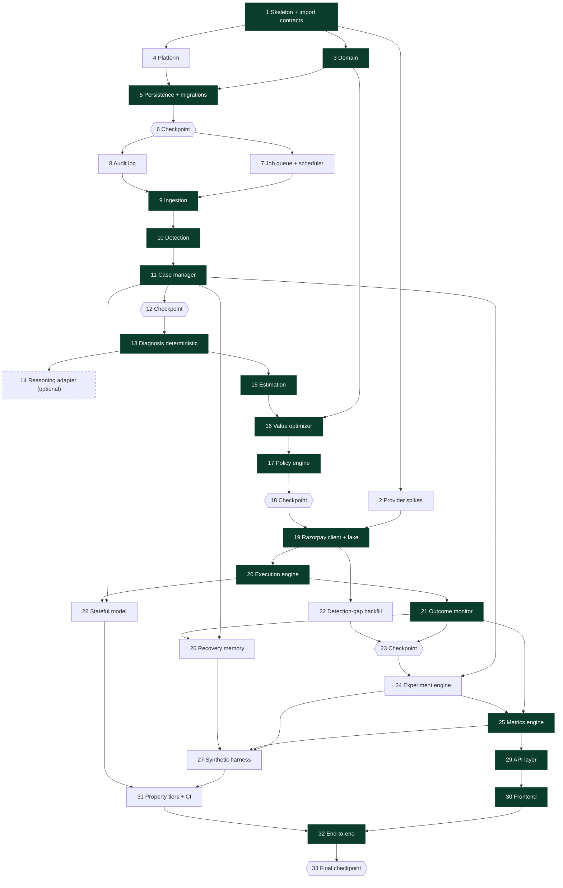

# Implementation Plan: Revora — Incremental Revenue Recovery

## Overview

Greenfield build into the empty `Rovara/` directory. Python 3.12 modular monolith (FastAPI, one Docker image, two process roles) against one PostgreSQL, plus a React + TypeScript SPA. The design document is the authority; this plan cites its acceptance criteria rather than restating them.

Build order follows the dependency chain that the design's guarantees imply: the structural mechanisms first (import contracts, integer money, schema constraints), then the transactional core (queue, audit, ingestion, lifecycle), then the decision pipeline (diagnosis, estimation, optimizer, policy), then the exactly-once execution and outcome verification that the recovery number depends on, then measurement (experiment, metrics, memory, synthetic harness), then the surfaces.

Two departures from the suggested order, both justified in place:

- **Provider spikes are task 2, not task 1.** They are standalone `httpx` scripts against Razorpay test mode and depend on nothing but the repo existing. Running them before the execution engine is designed into code means the reconciliation timing parameters are set from measurement rather than revised after the fact.
- **The Razorpay client and its fake (task 19) land before the execution engine (task 20) but after the policy engine (task 17).** The execution engine is the only caller, and the fake provider's crash and timeout behaviours are what Property 3 needs, so the fake must exist first.

### Scope discipline applied

- Components classified **BUILD LATER** in the design's Component Classification subsection have no tasks: fitted logistic regression, isotonic calibration, bootstrap intervals, automated retraining, the three cross-period metric findings, metric segmentation by selected action and policy outcome, downtime-as-`WAIT`-signal, refund reversal restatement, external audit storage, per-user roles and MFA, deliberate exploration, read replicas and partitioning.
- Components classified **REMOVE** appear nowhere: no Celery, no Redis, no audit hash chain, no internal event bus, no official Razorpay SDK on the execution path, no LLM framework or agent abstraction, no AWS service.
- Components classified **MODIFY** are built in their modified form, not as `requirements.md` literally states. The modifications are named inside the tasks that implement them.

### Conventions

- Sub-tasks marked `*` are optional. The system must be demonstrable with every one of them skipped.
- `_Requirements:` cites acceptance criteria as `Rn.Cm`. `_Properties:` cites the design's numbered correctness properties.
- Paths are relative to `Rovara/`.
- Every property test carries the design-mandated tag comment naming the feature and the property statement.

---

## Tasks

- [ ] 1. Project skeleton, tooling, and the dependency rule
  - The import contracts in 1.2 are the mechanism behind Property 2 and the structural AI isolation claim. They cannot be retrofitted cheaply once modules exist, so they are written before any module has content.

  - [ ] 1.1 Create the package layout and pin dependencies
    - `pyproject.toml`, `revora/__init__.py`, and an empty package per the design's module map: `platform/`, `domain/`, `persistence/`, `ingestion/`, `detection/`, `cases/`, `diagnosis/`, `reasoning/`, `estimation/`, `optimizer/`, `policy/`, `execution/`, `providers/`, `outcome/`, `experiment/`, `metrics/`, `audit/`, `memory/`, `synthetic/`, `jobs/`, `api/`
    - Pin exact versions: `fastapi`, `uvicorn`, `pydantic>=2`, `sqlalchemy>=2`, `alembic`, `httpx`, `psycopg[binary]`, `numpy`, `scikit-learn`, `cryptography`, and dev: `pytest`, `hypothesis`, `testcontainers[postgres]`, `mypy`, `import-linter`, `ruff`
    - No `celery`, no `redis`, no `razorpay` SDK, no LLM framework — the design classifies all four REMOVE
    - `tests/` tree with `tests/strategies/`, `tests/properties/`, `tests/integration/`
    - _Requirements: design Architecture — Module Map and the Dependency Rule_

  - [ ] 1.2 Write the import-linter contracts and fail CI on violation
    - `.importlinter` with four contracts: (a) `revora.policy` may import only `revora.domain` and `revora.platform`; (b) `revora.domain` imports only the standard library; (c) no feature module imports another feature module's internals — cross-module calls go through public functions; (d) `revora.synthetic` is importable only by its generator entrypoint and the comparison reporter
    - A test that asserts `lint-imports` exits zero, so a violation fails `pytest` as well as the CI job
    - _Requirements: R4.C5, R4.C9, R15.C6_
    - _Properties: P2_

  - [ ] 1.3 Enforce strict typing and the no-float rule
    - `mypy.ini` with `strict = true` scoped to `revora/domain`, `revora/policy`, `revora/optimizer`
    - `scripts/check_no_float.py`: fails if the token `float` appears in any currency-bearing module (`domain/money.py`, `optimizer/`, `metrics/`), wired as a test and a CI step
    - _Requirements: R7.C12_
    - _Properties: P14_

  - [ ] 1.4 One Docker image, two entrypoints, local Postgres
    - `Dockerfile` building a single image; `revora/api/main.py` and `revora/jobs/worker.py` as the two entrypoints selected by a `REVORA_ROLE` env var read in `revora/platform/role.py`
    - `docker-compose.yml` with Postgres 15 for local development only
    - _Requirements: design Deployment Architecture — Why This Shape_

  - [ ] 1.5 Base CI pipeline
    - `.github/workflows/ci.yml` running ruff, mypy, `lint-imports`, `check_no_float`, and `pytest tests/properties -m pure` on every commit. Tier wiring for the Postgres and nightly tiers is task 31
    - _Requirements: design Testing Strategy — What CI Enforces Beyond Tests_

- [ ] 2. Provider verification spikes against Razorpay test mode
  - Four items the design tags **[EVIDENCE INSUFFICIENT]**. Each spike is a standalone script under `scripts/spikes/`, run manually against test-mode credentials, writing its measurement into `docs/provider-findings.md`. Each names the design parameter a surprising result changes.

  - [ ] 2.1 Measure payment-link listing freshness after create
    - `scripts/spikes/link_listing_freshness.py`: create a link with a fresh `reference_id`, then poll `GET /v1/payment_links?reference_id=…` recording first-visible latency; ~50 iterations; report min, median, p95, max
    - Bundle the test-mode webhook endpoint configuration needed to run the spike into the script's README block
    - **If first-visible latency can exceed `PROVIDER_CALL_TIMEOUT`**, then `EXECUTION_RECONCILIATION_INTERVAL` and `MAX_EXECUTION_RECONCILIATION_ATTEMPTS` must both increase, and the "empty result is `FAILED` only on the final attempt" rule becomes load-bearing rather than merely careful
    - _Requirements: R9.C15, R9.C17_

  - [ ] 2.2 Measure fetch-payment consistency lag relative to the capture webhook
    - `scripts/spikes/payment_read_lag.py`: on receipt of `payment.captured`, immediately call fetch-payment and record whether the read lags; ~50 iterations; report the lag distribution and the fraction of reads that disagree with the webhook
    - **If lag is common**, `OUTCOME_READ_LATENCY_BOUND` is too tight and `PAYMENT_STATE_RECONCILIATION_INTERVAL` must shorten, because the conflict-hold path would then be the normal path rather than the exception
    - _Requirements: R10.C2, R10.C6, R10.C13_

  - [ ] 2.3 Determine whether a duplicate `reference_id` is rejected on create
    - `scripts/spikes/duplicate_reference_id.py`: create two links with an identical `reference_id`; record status, body, and whether two `plink_` ids exist
    - **A negative result changes nothing** — the design deliberately depends only on the documented query capability. A positive result means a stronger guarantee is available and can be recorded as defence in depth, not substituted for reconciliation
    - _Requirements: R9.C3, R9.C5_

  - [ ] 2.4 Determine whether server-side retry or payment-method-update exists on the account
    - `scripts/spikes/retry_capability.py`: enumerate products enabled on the merchant account; attempt a retry against a `failed` payment id and record the exact error
    - **A positive result restores `RETRY` and `PAYMENT_METHOD_UPDATE`** as executable actions, which changes the eligibility table in task 3.4 and adds execution paths to task 20
    - _Requirements: R6.C9_

  - [ ] 2.5 Consolidate findings and pin the parameters they decide
    - `docs/provider-findings.md` with one section per spike: measurement, conclusion, and the configuration default it sets
    - Update the affected default values in the configuration seed of task 5.6, or record explicitly that the design defaults survived measurement
    - _Requirements: design Provider Verification Findings — What Remains Unverifiable Without Account Access_

- [ ] 3. Domain layer: money, enums, transition table, eligibility table
  - `revora/domain/` imports only the standard library, so every item here is testable with zero setup and runs in the microsecond tier.

  - [ ] 3.1 Integer money and exact probability types
    - `revora/domain/money.py`: `Minor` newtype over `int`, addition and subtraction, `multiply_probability(amount, probability)` applying half-up rounding exactly once, and an exact-sum aggregate helper
    - `revora/domain/probability.py`: `Probability` over `Decimal` at 4 places bounded 0–1, `SignedIncrement` over `Decimal` at 4 places bounded −1–1, `Confidence` at 3 places
    - No `float` anywhere in either module
    - _Requirements: R7.C12_
    - _Properties: P14_

  - [ ] 3.2 The enumerations
    - `revora/domain/enums.py`: `RiskCause` (8 members incl. `UNKNOWN`), `CaseState` (14 members), `PolicyVerdict`, `CheckOutcome` (`PASS`/`FAIL`/`UNAVAILABLE`), `DiagnosisMethod`, `EstimationMethod`, `ActionAvailability`, `IntentState`, `OutcomeClass`, `Provenance`, `InterventionStatus`, `DecisionSource`, `ValidationStatus`, and `FieldKind`
    - `FieldKind` must include `CONTACT`, `INSTRUMENT`, and `PROVIDER_SHORT_URL` — the design's critical review reclassifies `provider_short_url` as sensitive because a payment link is a bearer capability
    - _Requirements: R2.C1, R3.C4, R6.C5, R10.C8, R10.C9, R17.C6, R17.C7_
    - _Properties: P32_

  - [ ] 3.3 The derived legal transition table
    - `revora/domain/transitions.py`: declare `FORWARD`, `REENTRY`, `TERMINAL`, derive `LEGAL` as one edge from every non-terminal state to every terminal state except `RECOVERED` plus the forward and re-entry pairs, and declare per-transition guards and counter effects as data
    - Derivation, not a hand-listed table, so the property test in 11.5 tests the manager against the declaration rather than the table against itself
    - _Requirements: R2.C2, R2.C3, R2.C7_
    - _Properties: P5_

  - [ ] 3.4 Candidate actions, availability, and the eligibility table
    - `revora/domain/actions.py`: the full `CandidateAction` enum as decision vocabulary, plus `EXECUTABLE = {DO_NOTHING, WAIT, PAYMENT_LINK, CUSTOMER_MESSAGE, HUMAN_ESCALATION}` and `UNAVAILABLE_IN_MVP = {RETRY, DELAYED_RETRY, PAYMENT_METHOD_UPDATE}` per the design's MODIFY ruling
    - Cause-to-action eligibility table keyed on `RiskCause`, always yielding `DO_NOTHING` and `WAIT`; `PROMISE_TO_PAY_FOLLOW_UP` is absent from the table entirely so it never generates an estimate
    - Customer-visible action set, and the declared precedence order used for tie resolution
    - _Requirements: R6.C1, R6.C2, R6.C9, R7.C4_
    - _Properties: P19_

  - [ ] 3.5 Hypothesis strategy library for domain primitives
    - `tests/strategies/primitives.py`: `money()`, `probability()`, `signed_increment()`, `risk_cause()`, `case_state()` with the boundary values the design's Generators subsection names — 0, 1, `MIN_DETECTION_AMOUNT ± 1`, `ESCALATION_AMOUNT_THRESHOLD ± 1`, thresholds ± ε
    - Consumed by every later property test, so it is not optional
    - _Requirements: design Testing Strategy — Generators_

  - [ ]* 3.6 Unit tests for rounding and precision edge cases
    - Half-up at exact .5, negative incremental values, aggregate equals exact sum, `Decimal` precision preserved across construction
    - _Requirements: R7.C12_
    - _Properties: P14_

- [ ] 4. Platform services: clock, logging, masking, crypto, secrets
  - [ ] 4.1 UTC-only clock and structured logging with correlation context
    - `revora/platform/clock.py`: the only source of `now()`, returning a UTC instant; no local-time or offset-bearing representation reachable
    - `revora/platform/logging.py`: structured records carrying the `correlation_id` from a `contextvars` context, with the context set by the API request handler and by the worker when it claims a job
    - _Requirements: R16.C9, R11.C7_
    - _Properties: P13_

  - [ ] 4.2 The masking serializer
    - `revora/platform/masking.py`: walks a record and masks any field whose declared `FieldKind` is `CONTACT`, `INSTRUMENT`, or `PROVIDER_SHORT_URL`, revealing at most `MASK_DISCLOSURE_LENGTH` characters; applied by the writer, never by the reader
    - Used by both the log formatter and the audit writer, so an unmasked value cannot reach durable storage
    - _Requirements: R11.C8, R17.C6, R17.C7_
    - _Properties: P32_

  - [ ] 4.3 Envelope encryption and the customer key
    - `revora/platform/crypto.py`: AES-256-GCM encrypt/decrypt for raw webhook payloads returning ciphertext, nonce and `key_version`; `customer_key(contact)` as a keyed non-reversible hash used for cross-case opt-out joins
    - This is the mechanism behind the design's resolution of the masked-at-write-time versus raw-payload-persistence conflict: cleartext contact exists only inside the encrypted raw event store
    - _Requirements: R1.C3, R17.C6_
    - _Properties: P32_

  - [ ] 4.4 Secret resolution with an ordered active webhook secret list
    - `revora/platform/secrets.py`: resolves the Razorpay key id and secret, the payload encryption key, the LLM credential, and an **ordered list of active webhook secrets per merchant** so that a retry of an older event validates against the pre-rotation secret; rotation removes the old secret only after the 24-hour redelivery window
    - A missing or unreadable credential refuses the call, leaves state unchanged, and returns a `CREDENTIAL_UNAVAILABLE` outcome to the caller
    - The multi-secret window is an addition to `requirements.md` recommended by the design's Signature Verification finding
    - _Requirements: R17.C4, R1.C1_

  - [ ]* 4.5 Property test: no contact value survives masking
    - `contact_identifier()` strategy producing searchable values; assert no emitted log record and no serialized audit field contains the original
    - _Requirements: R11.C8, R17.C7_
    - _Properties: P32_

- [ ] 5. Persistence, migrations, and the invariants the schema carries
  - [ ] 5.1 SQLAlchemy 2.0 models for the full table catalogue
    - `revora/persistence/models/`: `merchant`, `merchant_user`, `webhook_secret`, `webhook_event`, `event_quarantine`, `recovery_case`, `diagnosis`, `baseline_estimate`, `candidate_estimate`, `recommendation`, `recommendation_candidate`, `policy_decision`, `policy_check_result`, `execution_intent`, `payment_state_read`, `recovery_outcome`, `audit_record`, `ai_invocation`, `customer_consent`, `experiment`, `experiment_assignment`, `experiment_version_freeze`, `model_version`, `model_promotion`, `memory_observation`, `job`, `job_attempt`, `synthetic_run`, `policy_rule_set`, `app_config`
    - Type discipline exactly as the design's Type Discipline subsection states: money `BIGINT`, probability `NUMERIC(6,4)`, signed increment `NUMERIC(7,4)`, confidence `NUMERIC(4,3)`, time `TIMESTAMPTZ`, audit time `TIMESTAMPTZ(3)`, enums as `TEXT` + `CHECK`
    - _Requirements: R7.C12, R11.C2, R16.C9_

  - [ ] 5.2 Alembic setup and the initial migration with the four invariant constraints
    - `alembic/` and one migration creating every table plus, specifically: `UNIQUE (merchant_id, provider_event_id)` on `webhook_event`; the partial unique index `one_open_case_per_payment` on `recovery_case` where state is non-terminal; `UNIQUE (merchant_id, idempotency_key)` on `execution_intent`; `UNIQUE (case_id, seq)` on `audit_record`
    - Also `UNIQUE (case_id) WHERE is_active` on `diagnosis`, `UNIQUE (case_id)` on `recovery_outcome`, `UNIQUE (case_id)` on `experiment_assignment` and `memory_observation`, `UNIQUE (consumed_by_intent_id)` on `policy_decision`, `UNIQUE (policy_decision_id, check_order)` on `policy_check_result`, `UNIQUE (dedupe_key) WHERE state='PENDING'` on `job`, and the `counters_within_bounds` CHECK
    - The named indexes from the design's Indexes That Exist for a Stated Reason table
    - These four constraints are why the corresponding properties are database facts rather than code promises
    - _Requirements: R1.C4, R1.C9, R9.C3, R11.C4, R10.C11, R13.C2, R8.C15_
    - _Properties: P3, P4, P12, P20_

  - [ ] 5.3 Append-only audit enforcement
    - Migration adding `REVOKE UPDATE, DELETE, TRUNCATE ON audit_record FROM revora_app` **and** a `BEFORE UPDATE OR DELETE` trigger raising an exception — two independent mechanisms, because a grant can be restored by a careless migration
    - A separate insert-only function that records `AUDIT_MUTATION_REJECTED` naming the requesting actor
    - No hash chain: the design classifies it REMOVE as security theatre against the only actor who could defeat it
    - _Requirements: R11.C3, R11.C9_
    - _Properties: P12_

  - [ ] 5.4 Row-level security as defence in depth
    - `ENABLE ROW LEVEL SECURITY` plus a `tenant_isolation` policy on every tenant-scoped table reading `current_setting('revora.merchant_id')`
    - Session variable set from the authenticated session at the start of each request transaction and from the job's merchant at the start of each job transaction
    - _Requirements: R17.C2_
    - _Properties: P30_

  - [ ] 5.5 Repository layer with mandatory merchant scoping
    - `revora/persistence/repositories/`: every read, list, query and export function takes `merchant_id` as a required argument; there is no cross-merchant function to call by accident
    - Explicit transaction helpers exposing `FOR UPDATE`, `FOR UPDATE SKIP LOCKED` and `pg_advisory_xact_lock`, since the execution and audit designs depend on controlling transaction boundaries directly
    - Startup schema-revision check that refuses to serve on mismatch
    - _Requirements: R17.C2, R16.C1_
    - _Properties: P30_

  - [ ] 5.6 Database-backed configuration with a version identifier
    - `revora/platform/config.py` reading the ~50 bounds from `app_config` rows carrying a configuration version, not from environment variables, because R15.C6 requires a recorded approving user for a policy change and a redeploy cannot supply one
    - Seed migration using the design's MODIFY values: `INGEST_ACK_TIMEOUT = 1500` ms, `MAX_MESSAGE_LENGTH = 300`, and the configured risk-reason set `{payment_risk_check_failed, compliance_violation}` from which the fraud condition derives
    - Environment holds only the connection string, secret references, and the process role
    - _Requirements: R15.C6, R8.C5, R4.C7_

  - [ ]* 5.7 Integration tests proving the constraints reject what they must
    - `testcontainers` Postgres: concurrent duplicate event inserts yield one row; a second open case for one payment is rejected; a second intent for one idempotency key is rejected; an audit `UPDATE` raises; a cross-tenant select under RLS returns nothing
    - _Requirements: R1.C4, R1.C9, R9.C5, R11.C3, R17.C2_
    - _Properties: P3, P4, P12, P30_

- [ ] 6. Checkpoint — foundation
  - Ensure all tests pass, ask the user if questions arise. Confirm specifically: import contracts fail on a deliberate violation, `mypy --strict` is clean on the three modules, the no-float check fires on a deliberate float, and every constraint test in 5.7 passes against a real Postgres.

- [ ] 7. Postgres job queue and the scheduler loop
  - No broker and no Redis. The decisive reason is transactional: a job must be enqueued in the same transaction as the state change it follows, which a broker cannot do without an outbox.

  - [ ] 7.1 Queue claim, backoff, and dead-letter
    - `revora/jobs/queue.py`: `enqueue(session, kind, payload, run_after, dedupe_key)` participating in the caller's transaction; `claim(limit)` using `SELECT … WHERE run_after <= now() AND state='PENDING' ORDER BY run_after FOR UPDATE SKIP LOCKED LIMIT n`
    - Attempt counter, exponential backoff, `DEAD_LETTER` state past the attempt cap, `job_attempt` history rows, per-job statement timeout
    - Job payloads carry ids and the `correlation_id` only — never PII, never secrets
    - _Requirements: R11.C7, R17.C7_
    - _Properties: P13_

  - [ ] 7.2 Worker loop and role entrypoint
    - `revora/jobs/worker.py`: claim, set the correlation context and the RLS merchant session variable, dispatch by kind, mark done or reschedule; graceful shutdown that leaves an unfinished job claimable
    - _Requirements: R16.C5_

  - [ ] 7.3 Scheduler loop for the periodic sweeps
    - `revora/jobs/scheduler.py` enqueuing, with dedupe keys so a sweep cannot double-enqueue: lifecycle evaluation, execution reconciliation, payment-state reconciliation, detection-gap backfill, and the calibration report trigger
    - Sweeps are registered here as no-op handlers and filled in by their owning tasks (11.4, 20.5, 21.3, 22.1, 15.5)
    - _Requirements: R2.C13, R9.C15, R10.C6_

  - [ ]* 7.4 Integration tests for queue semantics
    - Two workers never claim one job; a rolled-back transaction leaves no job; a poison job dead-letters at the cap and alerts; a dedupe key prevents a duplicate pending sweep
    - _Requirements: R16.C1, R16.C2_

- [ ] 8. Audit log
  - [ ] 8.1 Insert-only writer with gap-free per-case sequence allocation
    - `revora/audit/writer.py`: allocates `seq` by `UPDATE recovery_case SET audit_seq = audit_seq + 1 … RETURNING audit_seq` in the same transaction as the insert, relying on the case row lock the caller already holds — which is what makes the sequence gap-free under concurrency where a Postgres sequence would not be
    - Records with no case (`SIGNATURE_REJECTED`, `RATE_LIMIT_APPLIED`, `AUTHENTICATION_FAILED`) get `case_id = NULL`, `seq = NULL`, and their own generated correlation id
    - Field values over `MAX_AUDIT_FIELD_LENGTH` truncated and listed in `truncated_fields`
    - _Requirements: R11.C1, R11.C2, R11.C4, R11.C11_
    - _Properties: P12_

  - [ ] 8.2 Masking at write time and the audit event type catalogue
    - Writer routes every record through the task 4.2 masking serializer by declared `FieldKind`, so no unmasked contact, instrument reference, or `provider_short_url` is ever persisted
    - Declare the audit event type constants the design names across R1, R2, R3, R4, R8, R9, R10, R11, R16 in one module so no component invents a type string
    - _Requirements: R11.C8, R17.C7_
    - _Properties: P32_

  - [ ] 8.3 Audit-write failure blocks further external action
    - `AUDIT_WRITE_TIMEOUT` bound; on failure persist no partial record, return a write-failure indication, and set a per-case block that the Execution_Engine consults before any external call until an audit record for that occurrence persists
    - _Requirements: R11.C10, R16.C1, R16.C2_
    - _Properties: P29_

  - [ ] 8.4 The single-query explainability read
    - `revora/audit/queries.py`: one ordered `SELECT` over `audit_record` for a case returning everything R11.C5 requires — no joins, no derived state, because a merchant explaining a decision to a customer must not need a second query
    - _Requirements: R11.C5, R11.C6_

  - [ ]* 8.5 Property test: append-only, gap-free, concurrent
    - Concurrent writers for one case produce 1..n with no gaps and no duplicates; every prior read stays byte-identical; every mutation attempt is rejected and recorded naming the actor
    - _Requirements: R11.C3, R11.C4, R11.C9_
    - _Properties: P12_

- [ ] 9. Event ingestion
  - [ ] 9.1 Raw-body HMAC verification against the multi-secret window
    - `revora/ingestion/signature.py` and the FastAPI route in `revora/api/webhooks.py`: read `await request.body()` as bytes, reject over `MAX_INBOUND_PAYLOAD_SIZE` **before** hashing to bound CPU, then HMAC-SHA256 over the exact bytes compared with `hmac.compare_digest` against every active webhook secret for the merchant
    - No Pydantic model, no middleware, and no proxy may touch the body before verification — the provider documentation is explicit that a re-encoded JSON string will not match
    - Merchant identified by URL slug **and** by the secret that verified, so a signature valid under one merchant's secret cannot be attributed to another
    - Startup canary that signs a known body and verifies it end to end, catching a body-mutating proxy on deploy rather than on the first real event
    - _Requirements: R1.C1, R1.C2, R17.C12_

  - [ ] 9.2 Canonicalization with the round-trip self-check
    - `revora/ingestion/canonical.py`: `PaymentEventCanonical` Pydantic model over verified Razorpay field names, converting Unix timestamps to UTC instants and retaining the received representation; parse → serialize → parse equality check before acceptance
    - Failure routes to quarantine, creates no case, and issues no external request
    - _Requirements: R16.C10, R16.C11, R16.C13, R16.C14_
    - _Properties: P27_

  - [ ] 9.3 Header-based deduplication and the atomic insert-plus-enqueue
    - Require the `x-razorpay-event-id` request header as `provider_event_id` — it is a header, not a payload field
    - One transaction: `INSERT … ON CONFLICT (merchant_id, provider_event_id) DO NOTHING` carrying the encrypted raw payload, the PII-free canonical `JSONB`, and a generated `correlation_id`, plus the detection job row; zero rows inserted means duplicate, audited and answered 200
    - Respond within `INGEST_ACK_TIMEOUT` (1500 ms per the design's MODIFY, inside the verified 5-second provider deadline) doing no detection work on the request path
    - _Requirements: R1.C3, R1.C4, R1.C5, R1.C13_
    - _Properties: P4_

  - [ ] 9.4 Quarantine, rejection responses, and rate limiting
    - `revora/ingestion/quarantine.py`: malformed payloads retained for `QUARANTINE_RETENTION` with the failed validation rule named; 202 so redelivery of an unparseable payload is not invited; 401 on signature failure retaining nothing; 503 when persistence is unavailable so the provider redelivers
    - Per-source rate limit at `INGEST_RATE_LIMIT` writing `RATE_LIMIT_APPLIED`, rejecting without discarding any already-persisted event
    - Responses disclose no detail
    - _Requirements: R1.C2, R1.C6, R16.C3, R17.C12_

  - [ ] 9.5 Out-of-order and late event handling
    - `revora/ingestion/ordering.py`: compare the event's provider timestamp with the newest processed for that payment id; apply only where it yields a legal forward transition, otherwise leave state and every counter untouched and audit `OUT_OF_ORDER_EVENT` with both timestamps
    - Handle the verified case of `payment.captured` preceding `payment.failed`
    - _Requirements: R1.C7, R1.C11_
    - _Properties: P4_

  - [ ]* 9.6 Example test against a known signature vector plus payload strategies
    - One fixed body, secret and expected digest — the single most valuable example test in the suite, because a wrong HMAC construction lets every self-signing property test pass while production fails
    - `tests/strategies/payloads.py`: `payment_failed_payload()` with key reordering, whitespace variation, non-UTC offsets, escaped slashes, unicode, and absent optionals, using only verified field names
    - _Requirements: R1.C1, R16.C11_
    - _Properties: P27_

- [ ] 10. Detection engine
  - [ ] 10.1 Deterministic rule set and the verdict record
    - `revora/detection/rules.py`: ordered identified predicates — payment status failed, `amount >= MIN_DETECTION_AMOUNT`, currency in the supported set, no verified captured state for the payment id; record every applied rule id
    - Exactly one `detection_verdict` per persisted event drawn from `AT_RISK`, `NOT_AT_RISK`, `DEFERRED_TRIGGER` within `DETECTION_LATENCY_BOUND`
    - Abandonment, promise-to-pay and window-expiry events get `DEFERRED_TRIGGER` and no case, retained for later scope
    - No Reasoning_Layer invocation is reachable from this module
    - _Requirements: R1.C8, R1.C12, R1.C14, R1.C15_
    - _Properties: P31_

  - [ ] 10.2 Case creation guarded by the partial unique index
    - `revora/detection/service.py`: on `AT_RISK`, `INSERT … ON CONFLICT DO NOTHING` against `one_open_case_per_payment`; where an open case exists, attach the event and leave the existing `payment_amount` and detection timestamp unchanged
    - _Requirements: R1.C9, R1.C10_
    - _Properties: P4_

  - [ ]* 10.3 Property test: duplicates and reorderings create at most one case
    - `event_delivery_plan()` strategy with duplicates, reversals, interleaved payments and post-terminal replays; assert one case per payment id, one persisted event per `provider_event_id`, and counters identical to the deduplicated ordered delivery
    - _Requirements: R1.C4, R1.C7, R1.C9, R1.C10, R16.C8_
    - _Properties: P4_

- [ ] 11. Recovery case manager
  - [ ] 11.1 `apply_transition` as the single writer
    - `revora/cases/manager.py`: the only writer of `recovery_case.state`. `SELECT … FOR UPDATE`, check `expected_version` for optimistic concurrency, look up the pair in the task 3.3 table, apply counter effects, allocate the audit sequence, and write state, version and audit record in one transaction
    - Illegal transition rejects, changes nothing, and records `ILLEGAL_TRANSITION` in a separate transaction; a version conflict rejects with `VERSION_CONFLICT` so the caller re-reads before any external call
    - _Requirements: R2.C2, R2.C3, R16.C1, R16.C7_
    - _Properties: P5, P29_

  - [ ] 11.2 Counters, window, and the scheduling guard
    - Window end persisted at creation as detection + `RECOVERY_WINDOW_DURATION` and never extended or reset
    - `executed_action_count` and `last_outbound_at` set at the transition into `EXECUTING` **before** any provider request, with `customer_message_count` incremented where the action is customer-visible; `decision_cycle_count` at each entry to `DECISION_PENDING`; no counter ever decremented
    - Counter effects keyed on the intent's idempotency key with a uniqueness guard so a replay of either the confirmation or the reconciliation path is a no-op
    - Scheduling rejected with `SCHEDULE_REJECTED` naming the specific bound, and rejected outright while the case is `WAITING_FOR_OUTCOME`
    - _Requirements: R2.C5, R2.C7, R2.C9, R2.C11, R9.C10, R9.C11_
    - _Properties: P9, P10, P11_

  - [ ] 11.3 Terminal states, escalation, and the single reconciliation edge
    - Expiry from the persisted window end recording the unresolved amount; attempt exhaustion escalating where `payment_amount >= ESCALATION_AMOUNT_THRESHOLD` and stopping otherwise; `DECISION_CYCLE_LIMIT_REACHED`; at most one reconciliation transition into `RECOVERED` from a non-`RECOVERED` terminal state and only on a verified captured read
    - _Requirements: R2.C4, R2.C6, R2.C8, R2.C14_
    - _Properties: P6_

  - [ ] 11.4 Lifecycle sweeper and restart re-evaluation
    - `revora/cases/sweeper.py`: visits every non-terminal case at least once per `LIFECYCLE_EVALUATION_INTERVAL` and applies window, cooldown and outcome-wait elapse from persisted timestamps, so termination never depends on an earlier job having survived
    - `revora/cases/startup.py` implementing the design's restart sequence in order: verify migrations, run the signature canary, promote stale `ATTEMPTED` intents (wired in 20.6), reload every non-terminal case, re-evaluate window, cooldown and counters from persisted rows only, expire cases whose window elapsed during downtime, and **discard withheld actions whose bounds no longer permit execution**, audited
    - The discard step is the one that keeps a queue of actions that were correct an hour ago from violating cooldown or window after an outage
    - _Requirements: R2.C12, R2.C13, R16.C6, R16.C15_
    - _Properties: P6, P10, P11_

  - [ ]* 11.5 Property tests for legality and termination
    - Arbitrary sequences of legal and illegal transition requests, sequential and concurrent: every consecutive persisted pair is in the table, every applied transition has exactly one audit record, every rejection leaves state and all counters unchanged
    - Advance the clock past `RECOVERY_WINDOW_DURATION + OUTCOME_WAIT_TIMEOUT + LIFECYCLE_EVALUATION_INTERVAL` and assert termination
    - _Requirements: R2.C1, R2.C2, R2.C3, R2.C12, R16.C7_
    - _Properties: P5, P6_

- [ ] 12. Checkpoint — ingest to lifecycle
  - Ensure all tests pass, ask the user if questions arise. A signed `payment.failed` delivered twice must produce one persisted event, one case, one detection verdict, and a gap-free audit trail; the sweeper must terminate a case with the worker otherwise idle.

- [ ] 13. Diagnosis — the deterministic path
  - The provider publishes the failure reason in a machine-handleable field, so this path is the primary path and the LLM handles only the unmapped tail.

  - [ ] 13.1 The verified mapping table
    - `revora/domain/failure_taxonomy.py`: mapping keyed on `error_reason` first, then `(error_source, error_step)`, then `error_code`, populated **only** with the values verified in the design's Deterministic Layer subsection
    - `error_source ∈ {internal, gateway}` refines toward `TECHNICAL_ISSUE`; `source = customer` with `step = payment_authentication` refines toward `CUSTOMER_ACTION_REQUIRED`
    - Merchant-side integration faults (`input_validation_failed`, `invalid_order_id`, `order_amount_mismatch`, `payment_method_not_enabled`, …) map to `TECHNICAL_ISSUE` and additionally raise an operational alert, because they are our bug rather than the customer's
    - _Requirements: R3.C1, R3.C2_
    - _Properties: P31_

  - [ ] 13.2 Diagnosis service, the active-diagnosis invariant, and the unmapped metric
    - `revora/diagnosis/service.py`: exactly one active `diagnosis` row per case decision cycle carrying cause, confidence, evidence and method; deterministic match records `method=DETERMINISTIC`, `confidence=1.0`, and issues zero LLM invocations and zero provider calls
    - `FRAUD_OR_RISK_SIGNAL` routes to policy evaluation with no action scheduled or executed beforehand, irrespective of method
    - Confidence below `DIAGNOSIS_CONFIDENCE_FLOOR`, or method `REJECTED_AI_OUTPUT`/`FALLBACK_UNKNOWN`, records the substituted `UNKNOWN` cause and the substitution reason for the optimizer
    - Instrument the **deterministic hit rate and the unmapped-reason count as first-class metrics**, because the design's claim that the table covers the majority of failures is an inference that must be measured rather than asserted
    - _Requirements: R3.C1, R3.C2, R3.C4, R3.C6, R3.C7, R3.C8_
    - _Properties: P31_

  - [ ]* 13.3 Parametrized example test per verified `error_reason`
    - One case per documented reason asserting the expected `RiskCause`; this test doubles as the executable documentation of the table
    - _Requirements: R3.C1, R3.C2_
    - _Properties: P31_

- [ ] 14. Reasoning layer adapter — **entirely optional**
  - The whole task is optional. With it absent, unmapped reasons become `UNKNOWN`, recommendations get templated explanations, and payment links get templated descriptions. The design states plainly that the system does not need AI to diagnose.

  - [ ]* 14.1 Prompt contracts with transmission allow-lists
    - `revora/reasoning/contracts.py`: versioned `PromptContract` objects with `allowed_fields` and a Pydantic `output_model`; the adapter asserts `supplied.keys() <= allowed_fields` and **blocks transmission** otherwise, recording `PROMPT_CONTRACT_VIOLATION`
    - The diagnosis contract sends `amount_band`, never the exact amount, and no contact, no `customer_key`, no payment id, no instrument data
    - _Requirements: R17.C8, R17.C15, R3.C3_
    - _Properties: P32_

  - [ ]* 14.2 The four gates and the provider protocol
    - `revora/reasoning/adapter.py`: contract allow-list, then total timeout `REASONING_TIMEOUT` with at most `REASONING_RETRY_COUNT` extra attempts bounded at 2× the timeout, then output schema validation, then content validation for customer-visible text
    - `LLMProvider` protocol with one OpenAI-compatible `httpx` implementation; TLS with certificate validation; no tools, no function calling, no data access. No framework and no agent abstraction — both are classified REMOVE
    - Returns `Accepted[T]` or `Rejected(reason)`, never a raw string
    - _Requirements: R4.C1, R4.C2, R4.C3, R4.C7, R17.C5, R17.C14_

  - [ ]* 14.3 Invocation auditing and the unavailable threshold
    - One `ai_invocation` row for **every** invocation including timeouts, rejections and transport errors, carrying contract id, model id and version, latency, verdict, and whether the output influenced the recommendation; raw rejected responses truncated to `AI_RAW_CAPTURE_LIMIT`
    - Consecutive-failure counter marking the layer unavailable at `REASONING_UNAVAILABLE_THRESHOLD` and short-circuiting until a probe succeeds; no case may wait in a state pending a response
    - _Requirements: R4.C4, R4.C8_
    - _Properties: P31_

  - [ ]* 14.4 The three sanctioned uses
    - Ambiguous-diagnosis hypothesis with confidence capped at 0.99 and method `AI_ASSISTED`; explanation text written only to `recommendation.ai_explanation_text`; and **template selection** for the payment link description — the design's MODIFY replaces free-text drafting with choosing among approved templates, which removes the class of risk the content gates do not cover
    - _Requirements: R3.C3, R3.C5, R3.C9, R3.C10, R4.C7, R4.C11, R7.C11_
    - _Properties: P2_

  - [ ]* 14.5 The deterministic fake and its failure catalogue
    - `tests/fakes/llm.py`: valid output, wrong enum member, out-of-range confidence, missing field, wrong type, non-JSON, empty, a prompt-injection payload, slow beyond the timeout, transport error, and N consecutive failures; records every call so "zero invocations" assertions are made rather than assumed
    - _Requirements: R4.C2, R4.C3, R4.C4_
    - _Properties: P31_

- [ ] 15. Estimation: baseline and candidate priors
  - Honest framing carried into the code: this is a calibrated prior with an explicit interval, not a learned system. Fitted regression, isotonic calibration and bootstrap intervals are BUILD LATER and have no tasks.

  - [ ] 15.1 Hierarchical segments with backoff
    - `revora/estimation/segments.py`: the five categorical features (`risk_cause`, `amount_band`, `payment_method`, `attempt_ordinal_band`, `error_source_band`) and the backoff order dropping `error_source_band`, then `attempt_ordinal_band`, then `payment_method`, then `amount_band`, then `risk_cause` alone, then a global prior; the level used is recorded in `segment_id`
    - Backoff is what makes `MIN_SEGMENT_SAMPLE_SIZE` satisfiable rather than theoretical
    - _Requirements: R5.C2, R5.C3, R12.C10_

  - [ ] 15.2 Beta-Binomial baseline with honest intervals
    - `revora/estimation/baseline.py`: posterior mean `(α+s)/(α+β+n)` with `α=β=1` unless a merchant prior exists, and the 95% interval from the Beta posterior quantiles — nearly `[0.03, 0.97]` at `n=0`, which is the point
    - Records probability to three decimals, the interval or `UNCERTAINTY_UNAVAILABLE`, feature values, segment id, model version, method, provenance and training snapshot id
    - Labels: `PRIOR_FALLBACK` below `MIN_SEGMENT_SAMPLE_SIZE`, `UNVALIDATED_BASELINE` while no resolved control case exists for the segment, `SYNTHETIC` where any contributing observation is synthetic
    - Timeout or unreachable memory records **no estimate at all**, writes `BASELINE_ESTIMATION_FAILED`, and leaves the case in `DIAGNOSED` — a missing baseline must never read as zero
    - Training labels drawn only from `NO_INTERVENTION_CONFIRMED` observations
    - _Requirements: R5.C1, R5.C2, R5.C3, R5.C4, R5.C6, R5.C9, R5.C11, R5.C12_
    - _Properties: P23_

  - [ ] 15.3 Candidate prior lookup with availability marking
    - `revora/estimation/candidates.py`: build the candidate set from the task 3.4 eligibility table always including `DO_NOTHING` and `WAIT`, 2–9 members; produce `intervention_recovery_probability`, `action_cost`, `risk_cost`, `customer_cost` with a recorded method each
    - `DO_NOTHING` is definitional — probability equals baseline, all three costs zero, method `DEFINITIONAL`; `WAIT` has zero action and customer cost with probability from the no-intervention hazard over the remaining window
    - `RETRY`, `DELAYED_RETRY`, `PAYMENT_METHOD_UPDATE` marked `UNAVAILABLE` with a reason and **retained in the recorded set**, so the dashboard can show they were considered
    - Zero provider calls; memory error yields all-prior estimates every one marked `UNCALIBRATED`; out-of-range or method-less figures mark the candidate `UNAVAILABLE` and record `INVALID_ESTIMATE`
    - Named and documented as a prior lookup, not a simulator, per the design's MODIFY
    - _Requirements: R6.C1, R6.C2, R6.C3, R6.C4, R6.C5, R6.C6, R6.C7, R6.C8, R6.C9, R6.C10, R6.C11, R6.C12_
    - _Properties: P19_

  - [ ]* 15.4 Property test: `DO_NOTHING` and `WAIT` are definitionally neutral
    - For any case, `DO_NOTHING` has incremental probability, expected revenue, all three costs and net value exactly zero with method `DEFINITIONAL`; `WAIT` has zero action and customer cost
    - _Requirements: R6.C1, R6.C4, R6.C10_
    - _Properties: P19_

  - [ ]* 15.5 Calibration report — optional
    - `revora/estimation/calibration.py`: ten bands of width 0.10 reporting mean predicted, observed control-arm rate, control count and absolute deviation; bands under `MIN_CALIBRATION_BAND_COUNT` marked `CALIBRATION_UNVERIFIED` and excluded from the tolerance check; deviation past `CALIBRATION_TOLERANCE` flags derived decisions `CALIBRATION_SUSPECT` while **retaining the underlying figures unchanged**
    - Also reports excluded counts per intervention status and every intervention-bias risk segment
    - Triggered by `CALIBRATION_REPORT_CASE_TRIGGER` or `CALIBRATION_REPORT_TIME_TRIGGER`, whichever first, via the task 7.3 scheduler
    - _Requirements: R5.C5, R5.C6, R5.C7, R5.C8_

- [ ] 16. Value optimizer — test-first
  - This is the product, and the one place where a rounding bug becomes a false revenue claim. Properties 14 through 19 are microsecond-cheap and are written before the implementation.

  - [ ] 16.1 Candidate-set strategy and the six property tests, written first
    - `tests/strategies/candidates.py`: `candidate_estimate_set()` producing 2–9 candidates with deliberate ties on net value, deliberate high-probability-high-cost divergence, negative incremental values, and zero or negative expected revenue
    - `tests/properties/test_optimizer.py` at `max_examples=500`: the arithmetic chain (P14), argmax among survivors with the declared tie order (P15), `NO_POSITIVE_VALUE` selection (P16), `HIGH_BASELINE_NO_INTERVENTION` selection (P17), divergence disclosure (P18), and `DO_NOTHING` neutrality (P19)
    - These fail until 16.2–16.4 exist, which is the intent
    - _Requirements: R7.C1, R7.C2, R7.C3, R7.C4, R7.C5, R7.C6, R7.C8, R7.C12, R7.C13, R7.C14_
    - _Properties: P14, P15, P16, P17, P18, P19_

  - [ ] 16.2 The arithmetic chain in integer minor units
    - `revora/optimizer/arithmetic.py`: `incremental_probability = intervention − baseline` retaining negatives; `expected_incremental_revenue = payment_amount × incremental_probability` in integer minor units with half-up rounding applied exactly once; `net_recovery_value = expected − action_cost − risk_cost − customer_cost`
    - Pure Python integers, zero imports outside `domain` and the standard library
    - _Requirements: R7.C1, R7.C2, R7.C3, R7.C12_
    - _Properties: P14_

  - [ ] 16.3 Exclusion rules and selection
    - `revora/optimizer/selection.py`: exclude on non-positive incremental value with **no cost-ratio division performed** in that case, on `MAX_COST_TO_VALUE_RATIO` exceeded, on invalid estimate inputs, and on `UNAVAILABLE`
    - Select max `net_recovery_value` among survivors clearing both `MIN_NET_VALUE_THRESHOLD` and `MIN_INCREMENTAL_PROBABILITY`; ties to lower summed cost, then to the declared precedence order
    - Nothing clears → the better of `DO_NOTHING`/`WAIT` with `DO_NOTHING` on equality, reason `NO_POSITIVE_VALUE`, or `HIGH_BASELINE_NO_INTERVENTION` where baseline ≥ `HIGH_BASELINE_THRESHOLD`
    - Ranking reads `net_recovery_value` alone — never probability magnitude, never any LLM-produced field
    - _Requirements: R7.C4, R7.C5, R7.C6, R7.C7, R7.C10, R7.C13, R7.C14, R7.C15_
    - _Properties: P15, P16, P17_

  - [ ] 16.4 Recommendation persistence with every rejected alternative
    - `revora/optimizer/service.py`: write `recommendation` plus one `recommendation_candidate` per candidate carrying all six figures, the exclusion reason, and the rank; record the divergence reason `HIGHER_PROBABILITY_LOWER_NET_VALUE` where the highest-probability candidate is not the selection; record the substituted `UNKNOWN` cause and substitution reason from 13.2
    - LLM explanation text, where present, goes only to `ai_explanation_text` with a recorded note that it held no influence; the module cannot import `reasoning`, which is what makes that structural
    - _Requirements: R7.C8, R7.C9, R7.C11, R11.C6_
    - _Properties: P18_

- [ ] 17. Policy engine — final authority
  - [ ] 17.1 `PolicyInput` and `from_persisted`
    - `revora/policy/input.py`: a frozen dataclass with enumerated fields and no `Any`, no `dict`, no `**kwargs`, no `extra` — an AI-produced value has nowhere to sit. Sole constructor `PolicyInput.from_persisted(case, consent, verified_state, intent, now, rules_version)` reading named columns and **not** reading `ai_explanation_text` or AI-assisted diagnosis confidence
    - _Requirements: R4.C5, R8.C14_
    - _Properties: P2_

  - [ ] 17.2 The versioned rule set
    - `revora/policy/rules.py`: code-declared, version-labelled `RuleSet` carrying thresholds, the configured risk-reason set from which the fraud condition derives (the design's MODIFY replaces the non-existent provider flag field), the cause-to-action eligibility reference, the precedence order, and the customer-visible action set
    - A `policy_rule_set` row per version with change timestamp and approving user; the module cannot import `memory`, so no threshold can derive from Recovery_Memory
    - _Requirements: R8.C5, R15.C6_

  - [ ] 17.3 `evaluate` — the pure function and the twelve ordered checks
    - `revora/policy/engine.py`: `evaluate(PolicyInput, RuleSet) -> PolicyDecision` with no I/O, no clock read, no randomness, no logging
    - The twelve checks in R8.C2's fixed order, each returning `PASS`/`FAIL`/`UNAVAILABLE`, verdict taken from the lowest-ordered non-pass. Opt-out is check 5, before every bound, so no bound bug can leak a message to an opted-out customer. Cooldown is the only check that may `DEFER`, carrying an earliest permitted timestamp, or `BLOCKED WINDOW_EXPIRED` where that time falls outside the window
    - Any `UNAVAILABLE` yields `BLOCKED POLICY_INPUT_UNAVAILABLE` — there is no assume-fine branch
    - `APPROVED` carries case id, action, `Idempotency_Key`, rule set version, and an expiry at `now + POLICY_DECISION_VALIDITY`
    - _Requirements: R8.C1, R8.C2, R8.C3, R8.C4, R8.C5, R8.C6, R8.C7, R8.C8, R8.C9, R8.C10, R8.C11, R8.C15, R8.C17_
    - _Properties: P1, P7, P8, P9, P10, P11_

  - [ ] 17.4 Decision persistence before authorization is released
    - `revora/policy/service.py`: write `policy_decision` plus exactly twelve `policy_check_result` rows and one audit record containing all twelve ordered outcomes, the rule set version, the evaluation timestamp and the observed case state, **before** any authorization is released
    - `DO_NOTHING` and `WAIT` record a decision and its audit record and issue zero provider requests; `BLOCKED`/`DEFERRED`/`ESCALATE` leave both counters and the last-outbound timestamp unchanged
    - `UNIQUE (consumed_by_intent_id)` enforces that one decision authorizes at most one execution
    - _Requirements: R8.C12, R8.C13, R8.C15, R8.C16_
    - _Properties: P1_

  - [ ] 17.5 Property 2 and the twelve example scenarios
    - `tests/properties/test_policy.py`: generate a decision, replace every AI-produced field in the persisted record with arbitrary schema-valid content, re-evaluate, assert identical verdict, identical primary reason and identical twelve ordered outcomes; also assert identical inputs give identical decisions
    - `tests/test_policy_scenarios.py`: twelve readable cases, each constructed to fail exactly one check, asserting verdict and primary reason; plus several failing together to verify lowest-ordered reason selection; plus fields removed to force `UNAVAILABLE`
    - `tests/strategies/policy.py`: the `policy_input()` strategy those tests need
    - _Requirements: R4.C9, R8.C2, R8.C14, R8.C17_
    - _Properties: P2_

  - [ ]* 17.6 Property tests for the guarantees policy enforces
    - Zero confirmed customer-visible actions after an opt-out instant across every case of that customer (P8); caps and monotonic counters (P9); cooldown between consecutive confirmed outbound actions (P10); confirmed timestamps inside the window (P11)
    - _Requirements: R8.C4, R8.C6, R8.C7, R8.C8, R8.C9, R17.C10_
    - _Properties: P8, P9, P10, P11_

- [ ] 18. Checkpoint — decision pipeline
  - Ensure all tests pass, ask the user if questions arise. A failed payment must now flow from webhook to a persisted recommendation and a persisted policy decision with twelve recorded check outcomes and zero external calls.

- [ ] 19. Razorpay client and the fake provider
  - Hand-written thin client, not the official SDK. The SDK normalizes responses and erases the difference between "definitely did not happen" and "might have happened", which is the only distinction exactly-once depends on.

  - [ ] 19.1 The three operations
    - `revora/providers/razorpay.py` on `httpx.Client`: `create_payment_link`, `find_payment_links_by_reference_id`, `fetch_payment`; Basic auth resolved at call time from the secret store and never logged; TLS verification on; explicit connect and read timeouts summing to `PROVIDER_CALL_TIMEOUT`; a conservative self-imposed concurrency cap since no published rate limit was found
    - One retry only on connect errors where no bytes reached the server, and **never** on read timeouts
    - _Requirements: R17.C4, R17.C5, R9.C9_

  - [ ] 19.2 Five-way response classification
    - `revora/providers/classification.py`: every response becomes exactly one of `Success(entity)`, `ClientError(code, reason)`, `ServerError`, `Timeout`, `Unclassifiable(raw)`; Pydantic response models so field drift becomes `Unclassifiable` rather than a false success; no exception leaks to a caller
    - A connect-phase failure is the only network error classified definitive
    - _Requirements: R9.C8, R9.C9_

  - [ ] 19.3 Payment link request construction
    - `revora/providers/payment_link.py` building the verified field set: `amount` in minor units, `currency`, validated `description` at most `MAX_MESSAGE_LENGTH` (300), `reference_id` = `Idempotency_Key`, `customer{contact,email}` decrypted just in time, `notify{sms,email}: true` — which replaces the separate Communication_Provider entirely per the design's MODIFY
    - `expire_by` clamped to `min(window_end, now + 6 months)` so a link cannot outlive the window in which policy permits payment
    - `accept_partial: false` so a partial payment cannot be mistaken for recovery
    - `reminder_enable: false` — provider reminders would send customer-visible messages the `MAX_CUSTOMER_MESSAGES` bound does not count, silently breaking Property 9
    - `notes` carrying the case id and key; `reference_id` derived as `rv_` + first 16 hex of `SHA-256(case_id || action || attempt_ordinal)` to fit the verified 40-character limit
    - _Requirements: R9.C3, R4.C7, R8.C7_
    - _Properties: P9_

  - [ ] 19.4 The fake provider with the full behaviour catalogue
    - `tests/fakes/razorpay.py` implementing the same interface, scriptable via a `provider_behaviour()` strategy, covering every row of the design's Fake Providers table — in particular **timeout with the effect created** and **timeout with no effect created**, empty-then-non-empty reference-id listing, each of the five payment statuses, a read disagreeing with a received success webhook, N consecutive unavailable reads, and delayed success after a terminal state
    - Records every call so "zero calls" assertions are made rather than assumed
    - _Requirements: R9.C9, R9.C15, R10.C6, R10.C7, R10.C13, R10.C14_
    - _Properties: P3, P7, P20_

  - [ ]* 19.5 Canonicalization test against the documented payload sample
    - Field extraction from the documented `payment_link.partially_paid` sample asserted against verified field names
    - _Requirements: R16.C10_
    - _Properties: P27_

- [ ] 20. Execution engine — exactly-once external effect
  - [ ] 20.1 The locked decision transaction
    - `revora/execution/engine.py`: `pg_try_advisory_xact_lock` on a hash of the case id — transaction-scoped, so commit, rollback or connection death releases it and no crash can orphan it; lock unavailable abandons with `CONCURRENT_EXECUTION_PREVENTED` and zero external calls
    - Reload case, consent, verified state and intents `FOR UPDATE`, **discarding every value carried in the job payload**, then re-request policy evaluation against the reloaded state; anything but `APPROVED` abandons with `EXECUTION_ABANDONED_POLICY` and zero external calls
    - Refuse any request whose approval is absent, mismatched, expired or already consumed, recording `EXECUTION_REFUSED` naming the failed check
    - _Requirements: R9.C1, R9.C2, R9.C12, R9.C13, R4.C6, R4.C10_
    - _Properties: P1, P2_

  - [ ] 20.2 Deterministic key and the intent committed before the call
    - `revora/execution/intents.py`: `Idempotency_Key` derived from `(case_id, action_type, attempt_ordinal)`, identical across re-execution of the same ordinal, advancing only on a further `APPROVED` decision
    - Check for an existing intent under the lock — `CONFIRMED`/`FAILED` return the recorded result, `ATTEMPTED`/`UNCERTAIN` hand to reconciliation, never a second call — then insert `ATTEMPTED`, transition the case to `EXECUTING` with counter effects, consume the decision, audit `EXECUTION_STARTED`, and **commit before issuing the call**
    - The lock does not span the HTTP call; the durable intent is the guard across it
    - _Requirements: R9.C3, R9.C4, R9.C5_
    - _Properties: P3_

  - [ ] 20.3 Result classification into intent state
    - `Success` → `CONFIRMED` with `provider_response_id` and `provider_short_url`, case to `WAITING_FOR_OUTCOME`, counters applied once; `ClientError` → `FAILED` with the provider code and no further call in that attempt; `Timeout`/`ServerError`/`Unclassifiable` → `UNCERTAIN`, audit `EXECUTION_RESULT_UNKNOWN`, and **halt every external call for that case** until reconciliation resolves it
    - Report an action successful, present it as successful, and permit any customer-visible statement that it exists only while the intent holds `CONFIRMED` with a persisted provider id
    - _Requirements: R9.C6, R9.C7, R9.C8, R9.C9_
    - _Properties: P3_

  - [ ] 20.4 Counter application exactly once per key
    - `counter_applied` flipped in the same transaction as the increment, checked by both the confirmation path and the reconciliation path, so a case confirming via reconciliation after a partial crash does not double-increment
    - _Requirements: R9.C10, R9.C11_
    - _Properties: P3, P9_

  - [ ] 20.5 The reconciliation loop
    - `revora/execution/reconcile.py`: sweeper over intents where state is `UNCERTAIN` or state is `ATTEMPTED` and `attempt_started_at < now - PROVIDER_CALL_TIMEOUT`; stale `ATTEMPTED` promoted to `UNCERTAIN` with an audit record
    - Resolve by `find_payment_links_by_reference_id`: non-empty confirms immediately; empty leaves `UNCERTAIN` and retries at `EXECUTION_RECONCILIATION_INTERVAL`, marking `FAILED` **only on the final attempt**; a read error also retries
    - Exhausted attempts escalate the case with `EXECUTION_RESULT_UNVERIFIABLE` and no further external call ever
    - Never repeats the create call on any path
    - `UNCERTAIN` intent count exposed as an alerting metric, because this path fails safe but silently
    - _Requirements: R9.C9, R9.C15, R9.C17_
    - _Properties: P3_

  - [ ] 20.6 Startup promotion of stale intents
    - Wire into the task 11.4 startup sequence: promote every `ATTEMPTED` intent older than `PROVIDER_CALL_TIMEOUT` to `UNCERTAIN`, audit, and route to reconciliation rather than repeating the call; reuse the same key for the interrupted attempt and leave counters unchanged until resolution persists
    - _Requirements: R9.C16, R16.C5_
    - _Properties: P3_

  - [ ] 20.7 Property 3 with the crash-plan generator
    - `tests/strategies/crashes.py`: `crash_plan()` with crash points before intent commit, after intent commit before the call, after the call before the result commit, and during reconciliation
    - `tests/properties/test_exactly_once.py` against the task 19.4 fake with real Postgres: provider create-calls per `Idempotency_Key` at most one across arbitrary crashes, restarts and reconciliation runs; every request for that key returns the same recorded result; counters move at most once
    - _Requirements: R9.C3, R9.C4, R9.C5, R9.C6, R9.C10, R9.C11, R9.C16, R16.C5_
    - _Properties: P3_

- [ ] 21. Outcome monitor
  - [ ] 21.1 Authoritative read before any recovery is declared
    - `revora/outcome/monitor.py`: on a success signal, perform `fetch_payment` within `OUTCOME_READ_LATENCY_BOUND` and persist a `payment_state_read` row retaining the full response, so a conflict can be reconstructed later rather than argued about
    - Declare `RECOVERED` only where the read reports `captured` (or `authorized` with `captured = true`); **`authorized` alone is not recovery**; the recovered amount comes from the read, never from the webhook; `verified_by_read_id` is `NOT NULL`, so a recovery row cannot exist without a read
    - Capture `amount_refunded` on every read so a later restatement is possible; MVP figures are labelled gross of refunds
    - _Requirements: R10.C1, R10.C2, R10.C3_
    - _Properties: P20_

  - [ ] 21.2 Conflict hold, partial payment, and escalation
    - Conflicting signals hold the case in `WAITING_FOR_OUTCOME` with `PAYMENT_STATE_CONFLICT` naming the signals, re-reading at `PAYMENT_STATE_RECONCILIATION_INTERVAL` up to `MAX_PAYMENT_STATE_READ_ATTEMPTS`, then escalating with `PAYMENT_STATE_UNVERIFIABLE` and declaring no recovery
    - `payment_link.partially_paid` and status `partially_paid` are **not recovery** — record `PARTIAL_PAYMENT_OBSERVED` and hold
    - Duplicate success events for an already-`RECOVERED` case are discarded with `DUPLICATE_RECOVERY_EVENT_DISCARDED`, issue no extra read, and change nothing
    - _Requirements: R10.C6, R10.C7, R10.C11, R10.C13_
    - _Properties: P20_

  - [ ] 21.3 Cancellation and `POST_PAYMENT_ACTION`
    - Confirmed payment with an action scheduled and **no** intent cancels the action before any call, leaves counters unchanged, and audits `ACTION_CANCELLED_PAYMENT_RECEIVED`
    - An existing `ATTEMPTED`/`CONFIRMED`/`UNCERTAIN` intent is recorded `is_post_payment = true` and counted exactly once in `unnecessary_action_count` — deliberately visible, because it is the cost of Revora being wrong
    - Classification withheld while any intent for the case holds `UNCERTAIN`
    - _Requirements: R10.C4, R10.C5, R10.C12, R1.C11_
    - _Properties: P7_

  - [ ] 21.4 Outcome classification and delayed reconciliation
    - `NATURAL` with zero confirmed Revora actions, `OBSERVED` with one or more; unresolved revenue recorded once with its terminal reason
    - A success signal for a case already in a non-`RECOVERED` terminal state triggers a read and, on captured, one reconciliation transition with `DELAYED_RECOVERY_RECONCILED` naming the superseded state, with the amount still counted exactly once
    - Outcome-wait timeout routing per R2.C10 and the failure path per R2.C15
    - _Requirements: R10.C8, R10.C9, R10.C10, R10.C14, R2.C10, R2.C15_
    - _Properties: P6, P20_

  - [ ]* 21.5 Property test: no action after payment, accounting partitions once
    - Zero confirmed actions after the captured instant except pre-existing intents marked `POST_PAYMENT_ACTION` (P7); observed plus natural equals the confirmed sum with each amount counted once and no case in both totals (P20)
    - _Requirements: R10.C4, R10.C5, R10.C8, R10.C9, R10.C10, R10.C11, R10.C14_
    - _Properties: P7, P20_

- [ ] 22. Detection-gap backfill
  - Not in `requirements.md`. Added by the design because sustained delivery failure for 24 hours **disables the webhook**, which means silent total detection loss — the exact failure mode Revora exists to prevent. It must not be cut under time pressure.

  - [ ] 22.1 Backfill job and the staleness alert
    - `revora/ingestion/backfill.py`: periodic job listing provider payments over a lookback window via fetch-all-payments and ingesting any `failed` payment with no persisted event, through the **same** canonicalization and detection path, with a synthetic `provider_event_id` of `backfill:<payment_id>:<status>` so the dedup index still guarantees one case per payment
    - An operational alert when no webhook has been received for longer than a configured interval
    - Registered on the task 7.3 scheduler
    - _Requirements: R1.C8, R1.C9, R1.C14_
    - _Properties: P4_

  - [ ]* 22.2 Test: backfill of an already-ingested payment is a no-op
    - A payment that arrived by webhook and is then backfilled creates no second case and no second event; a payment missed entirely creates exactly one
    - _Requirements: R1.C4, R1.C9_
    - _Properties: P4_

- [ ] 23. Checkpoint — exactly-once and outcome
  - Ensure all tests pass, ask the user if questions arise. Property 3 must pass against the crash plan with a real Postgres, and a timeout-with-effect-created must reconcile to `CONFIRMED` without a second link existing.

- [ ] 24. Experiment engine
  - The only component that can substantiate the word "incremental".

  - [ ] 24.1 Deterministic assignment persisted before diagnosis
    - `revora/experiment/assignment.py`: `HMAC-SHA256(experiment_id, case_id)` → uniform → group by ratio; stateless, reproducible, needing no coordination between workers
    - Persisted in the case-creation follow-up transaction **before** any diagnosis, with no `UPDATE` grant on the group column; a change request is rejected
    - Assignment that cannot be persisted before diagnosis begins excludes the case from both arms and runs the Baseline_Workflow — an unassigned case must never quietly become treatment
    - _Requirements: R13.C1, R13.C2, R13.C14_
    - _Properties: P24_

  - [ ] 24.2 Control arm: the frozen Baseline_Workflow with suppression
    - `revora/experiment/control.py`: the versioned, deterministic Baseline_Workflow definition, defaulting to "no automated recovery action; observe the case to its terminal state"
    - Control cases run the full pipeline through to a **recorded** recommendation which is then suppressed — no execution intent is ever created from it — giving a counterfactual record of what Revora would have done
    - Contamination: any confirmed action outside the frozen definition labels the case `CONTAMINATED` and excludes it from every reported result, with contaminated and excluded counts reported alongside
    - Record prominently in the module docstring that the default definition is the design's most consequential assumption and that merchant-side manual recovery is invisible and therefore undetectable as contamination
    - _Requirements: R13.C3, R13.C15_
    - _Properties: P25, P26_

  - [ ] 24.3 Definition-time sample size and version freezing
    - `revora/experiment/design.py`: compute and store the required per-group sample size from the recorded baseline rate, minimum detectable effect, `EXPERIMENT_SIGNIFICANCE_LEVEL` and `EXPERIMENT_POWER` using the two-proportion formula — derived, never assumed to be 500
    - `experiment_version_freeze` rows pinning the baseline workflow, policy rule set, baseline model and candidate-prior versions at activation; every estimate for an assigned case loads the pinned version regardless of any later promotion
    - _Requirements: R13.C4, R13.C5, R15.C7_
    - _Properties: P28_

  - [ ] 24.4 Analysis, labels, and the four-way comparison
    - `revora/experiment/analysis.py`: two-proportion comparison with an interval at `EXPERIMENT_CONFIDENCE_LEVEL`, reported per arm with recovery rate, recovered revenue, average time to recovery, intervention rate, cost per recovery and incremental lift, computed over the same assignment interval for both arms
    - Labels `UNDERPOWERED`, `INVALIDATED`, `SYNTHETIC`, `CONTAMINATED`, `EXPLORATORY`; an interval containing zero labelled `CAUSALITY_NOT_ESTABLISHED`; secondary metrics labelled `EXPLORATORY` and excluded from attribution; segment results below the required size labelled `UNDERPOWERED`
    - `Attributed_Recovery` only where the experiment is `COMPLETED`, at or above the required per-group size, carries none of `UNDERPOWERED`/`INVALIDATED`/`SYNTHETIC`, and reports a primary-metric interval lying entirely above zero
    - R13.C13's question reported as the per-arm comparison of net recovered revenue, intervention rate, messages per case and blocked case count, each with direction and size, because a lift bought with three times the messages is a different result
    - _Requirements: R13.C6, R13.C7, R13.C8, R13.C9, R13.C10, R13.C11, R13.C13_
    - _Properties: P21, P26_

  - [ ] 24.5 Invalidation on a frozen-component change
    - Integrity sweep comparing active versions to frozen versions at estimate time and periodically; any divergence labels the experiment `INVALIDATED`, stops assignment, and withholds attribution from every case in it
    - _Requirements: R13.C16, R15.C7_
    - _Properties: P26, P28_

  - [ ]* 24.6 Property tests for experiment integrity
    - Assignment deterministic, stable and preceding diagnosis with change rejected (P24); zero Revora-derived confirmed actions on control cases while a recommendation is still recorded (P25); invalidated or contaminated experiments attribute nothing and contaminated cases are absent from every reported result (P26); freezing survives promotion (P28)
    - _Requirements: R13.C1, R13.C2, R13.C3, R13.C8, R13.C15, R13.C16, R15.C7_
    - _Properties: P24, P25, P26, P28_

- [ ] 25. Metrics engine
  - Cross-period findings (`COST_OUTPACING_RECOVERY`, `RECOVERY_MIX_SHIFT`, `RECOVERY_COST_EXCEEDS_VALUE`) are BUILD LATER — they need two comparable periods, which a demo does not have — so they have no tasks here. Segmentation is by `RiskCause` and amount band only; the other two dimensions are BUILD LATER.

  - [ ] 25.1 Cohort aggregation over `BIGINT`
    - `revora/metrics/engine.py`: cohort by detection timestamp in a half-open interval; every money aggregate a `SUM()` of stored `BIGINT` minor units so the aggregate equals the sum exactly; no warehouse, no materialized views
    - `revenue_at_risk`, `observed_recovered_revenue`, `natural_recovered_revenue`, `total_recovery_cost`, `realized_recovery_cost` per case, `net_recovered_revenue`, `unresolved_revenue`
    - _Requirements: R12.C1, R12.C2, R12.C3, R12.C6, R7.C12_
    - _Properties: P14, P20_

  - [ ] 25.2 Rates with `UNDEFINED` on a zero denominator
    - `recovery_rate`, `intervention_rate`, `action_success_rate`, `escalation_rate`, `average_time_to_recovery`, `blocked_case_count`, `unnecessary_action_count`, and the count of cases that consumed a decision cycle while executing zero confirmed actions
    - Any rate whose denominator is zero reports `UNDEFINED`, never 0
    - _Requirements: R12.C5, R12.C7, R12.C16_

  - [ ] 25.3 Causality gating and provenance labels
    - `incremental_recovered_revenue` carries a numeric value only from a completed, adequately powered, non-synthetic experiment whose interval excludes zero and lies above zero; otherwise `NOT_ESTABLISHED` with **no numeric value**, and never observed or natural revenue presented in its place
    - Observed revenue for a period whose experiment interval contains zero is labelled `CAUSALITY_NOT_ESTABLISHED` on every presentation surface
    - `SYNTHETIC` propagated to every metric with any synthetic contributing observation, in every surface and every export; recovery figures labelled `RECOVERY_GROSS_OF_REFUNDS`
    - _Requirements: R12.C4, R12.C9, R12.C11, R12.C13_
    - _Properties: P21, P23_

  - [ ] 25.4 Segmentation and figure provenance metadata
    - Segment every metric by `RiskCause` and amount band, presenting aggregate alongside segment values; every metric DTO carries period start, period end, computation timestamp, provenance and validation labels; every query scoped by `merchant_id`
    - _Requirements: R12.C10, R12.C12, R17.C2_
    - _Properties: P30_

  - [ ]* 25.5 Property tests for accounting and causality
    - Partition exactness with each amount counted once across restatements (P20); numeric incremental value only with an adequate experiment, otherwise `NOT_ESTABLISHED` plus `CAUSALITY_NOT_ESTABLISHED` (P21); synthetic provenance on every surface (P23)
    - _Requirements: R12.C4, R12.C9, R12.C11, R12.C13, R10.C14_
    - _Properties: P20, P21, P23_

- [ ] 26. Recovery memory and model versioning
  - Actual retraining is BUILD LATER. The labelling and versioning that make it possible later are cheap now and expensive to retrofit.

  - [ ] 26.1 Observation written inside the terminal transition
    - `revora/memory/store.py`: exactly one `memory_observation` per case persisted in the **same transaction** as the terminal transition, holding features, diagnosis fields, selected action, policy decision, outcome class, realized cost, experiment group and the three counters
    - _Requirements: R15.C1, R15.C4_

  - [ ] 26.2 Provenance and intervention-status labelling
    - `decision_source ∈ {AUTOMATED, HUMAN_OVERRIDE, BASELINE_WORKFLOW}` with the acting user where overridden; `intervention_status ∈ {NO_INTERVENTION_CONFIRMED, REVORA_INTERVENED, MERCHANT_INTERVENTION_UNKNOWN}`; `provenance ∈ {REAL, SYNTHETIC}`
    - Zero-executed-action observations selectable as a distinct baseline training set
    - Document in the module that `NO_INTERVENTION_CONFIRMED` means "no Revora action and no recorded merchant action", which is weaker than "no intervention", because Revora cannot see a merchant phoning a customer
    - _Requirements: R15.C2, R15.C3, R15.C4, R5.C10_
    - _Properties: P23_

  - [ ] 26.3 Model versions and promotion records
    - `revora/memory/versions.py`: a completed training run records an `INACTIVE` version and estimates continue from the active one; activation requires a promotion record carrying promoted version, prior version, timestamp, approving user, training observation count and synthetic observation count
    - A promotion request missing any of those four fields is rejected with `MODEL_PROMOTION_REJECTED` naming the omissions, and estimates continue unchanged
    - Every stored estimate retains its producing version, method and activating promotion id; metrics segment by model version
    - _Requirements: R15.C5, R15.C8, R15.C9, R15.C10, R15.C11_

  - [ ]* 26.4 Training-set composition report — optional
    - Observation counts per decision source, per `RiskCause`, per selected action, per policy decision and per provenance, plus **every action holding zero observations** — the surface that makes action-selection skew visible before a promotion
    - _Requirements: R15.C12_

- [ ] 27. Synthetic generator and evidence harness
  - The demo's entire evidence base. Its job is not to make Revora look good; it is to create a world where the true lift is known so the measurement can be checked.

  - [ ] 27.1 Seeded generator emitting Razorpay-shaped events
    - `revora/synthetic/generator.py` on `numpy.random.default_rng(seed)`: draw `risk_cause`, then `payment_amount` log-normal shaped to the configured band mix rounded to integer minor units, then `payment_method`, `error_source` and `attempt_ordinal` **conditioned on cause** so a card-expiry failure cannot come from a UPI method
    - Emit `payment.failed` payloads using only verified field names and verified `error_reason` values, so the generator exercises the real signature, canonicalization and mapping code rather than bypassing it
    - Generated contacts use reserved test ranges and synthetic cases are barred from reaching the Razorpay client
    - _Requirements: R13.C12, R5.C4_
    - _Properties: P23, P27_

  - [ ] 27.2 Ground truth and counterfactual outcome pairs
    - Hidden `p_natural = f(risk_cause, amount_band, method)` and `p_treated[action] = clip(p_natural + true_uplift, 0, 1)`; draw `u ~ U(0,1)` **once per case** and record both `recovers_if_untreated` and `recovers_if_treated[action]` from that same draw, which is what makes the true individual effect well defined and the true average lift exactly the difference of means
    - Emit `payment.captured` at a drawn delay where the realized arm outcome is recovery, otherwise emit nothing and let the window expire
    - `synthetic_run` row carrying seed, scenario, assumptions, ground truth and generator version; readable only by the comparison reporter, enforced by the task 1.2 import contract
    - _Requirements: R13.C12_

  - [ ] 27.3 The harness and the measured-versus-true reporter
    - `revora/synthetic/harness.py` driving generated events through the real pipeline with the fake provider confirming treatment actions, then reporting measured lift, the embedded true lift, the difference, the seed and the assumptions alongside every result
    - _Requirements: R13.C12_
    - _Properties: P23_

  - [ ] 27.4 The four mandatory scenarios, with the null scenario gating CI
    - `tests/synthetic/test_scenarios.py`: (a) **null scenario, `true_uplift = 0` for every action — Revora must report an interval containing zero and `CAUSALITY_NOT_ESTABLISHED`; if it reports a lift the build fails**, because a measurement bug that manufactures an effect invalidates the entire demo; (b) negative scenario where an action reduces recovery and the optimizer must select `DO_NOTHING`; (c) high-baseline scenario at `p_natural ≥ 0.8` where the correct behaviour is `DO_NOTHING` with reason `HIGH_BASELINE_NO_INTERVENTION`; (d) a positive scenario with a known lift
    - The null scenario runs in the CI nightly tier and additionally as a required gate before any demo build
    - _Requirements: R13.C12, R12.C13, R7.C6_
    - _Properties: P17, P21_

  - [ ] 27.5 Interval coverage across seeds
    - Over ~200 seeds of one scenario, assert the reported 95% interval contains the true lift close to 95% of the time; materially lower coverage means the interval is wrong and every causal claim built on it is too
    - _Requirements: R13.C7, R13.C12_
    - _Properties: P21_

- [ ] 28. Stateful property model
  - One `RuleBasedStateMachine` carrying the eleven history-level invariants, because they are all statements about the same object's history and eleven separate harnesses would explore a narrower space.

  - [ ] 28.1 `RecoveryLifecycleMachine` rules and clock plan
    - `tests/properties/test_lifecycle_machine.py`: rules for deliver event (any kind, order, duplication), advance clock, run lifecycle sweeper, run diagnosis, run estimation and optimization, request policy evaluation, attempt execution with an injected provider behaviour and crash point, run execution reconciliation, run outcome reconciliation, record opt-out, assign human owner, and restart the process
    - `tests/strategies/clocks.py`: `clock_plan()` crossing cooldown, window end, outcome-wait timeout and retention boundaries
    - _Requirements: R2.C13, R16.C6_
    - _Properties: P5, P6_

  - [ ] 28.2 The eleven invariants and the teardown termination check
    - After every step: state in the 14-value enum with only legal pairs (P5); no state after terminal except one verified reconciliation (P6); caps and monotonic counters (P9); cooldown between consecutive confirmed outbound actions (P10); confirmed timestamps inside the window (P11); external calls per key at most one (P3); zero confirmed customer-visible actions after opt-out (P8); zero confirmed actions after a verified captured read except pre-existing intents marked `POST_PAYMENT_ACTION` (P7); audit sequence 1..n gap-free with no duplicates (P12); one correlation id per delivery (P13); every confirmed intent has a preceding matching approval (P1)
    - Teardown advances the clock past the worst-case bound and asserts every case terminal
    - _Requirements: R2.C2, R2.C12, R8.C4, R9.C5, R10.C5, R11.C4, R11.C7_
    - _Properties: P1, P3, P5, P6, P7, P8, P9, P10, P11, P12, P13_

- [ ] 29. API layer
  - [ ] 29.1 Session authentication and tenant scoping
    - `revora/api/auth.py`: session required for every dashboard and management request; a session older than `SESSION_LIFETIME` is unauthenticated and records `AUTHENTICATION_FAILED`
    - `merchant_id` derived from the session only; any merchant id in a request payload or query is ignored; the RLS session variable set at the start of each request transaction
    - Cross-tenant requests return **404, not 403**, so existence is not disclosed, and record `AUTHORIZATION_DENIED` with requester, requested id and timestamp
    - No per-user roles and no MFA — both BUILD LATER for a single operator persona
    - _Requirements: R17.C1, R17.C2, R17.C3, R17.C9, R17.C13_
    - _Properties: P30_

  - [ ] 29.2 Dashboard read endpoints returning server-formatted money
    - `revora/api/routers/cases.py`, `metrics.py`, `experiments.py`, `audit.py`: case list paged at `DASHBOARD_PAGE_SIZE` ordered by descending detection timestamp; case detail carrying diagnosis, every candidate with all six figures, the twelve ordered policy check outcomes, executed actions and outcome classification; metrics summary; unresolved grouping with explicit zero rows for empty reason groups; experiment result with per-group counts and interval bounds; the ordered audit trail from task 8.4
    - Every money value returned as a **pre-formatted string alongside the raw minor units**, because R14.C12 forbids client-side arithmetic and shipping formatted values makes violating it require deliberate effort
    - Absent values returned as an explicit not-yet-recorded marker naming the current case state, never zero and never a substitute; a metrics timeout returns a data-unavailable marker for that figure only while other figures still return with their timestamps
    - _Requirements: R14.C2, R14.C3, R14.C4, R14.C5, R14.C6, R14.C7, R14.C8, R14.C10, R14.C12, R14.C14, R14.C15, R14.C16, R11.C5_
    - _Properties: P21, P23, P30_

  - [ ] 29.3 Human ownership assignment
    - Assign and release endpoints recording the Merchant_User id and the assignment timestamp; assignment suppresses automated scheduling and execution, which is what policy check 7 reads
    - MVP because the policy check depends on it
    - _Requirements: R14.C11, R8.C11_

  - [ ] 29.4 Consent and opt-out recording
    - Opt-out persisted against `customer_key` with source and timestamp, authoritative for every policy evaluation beginning after that timestamp across existing and future cases of that customer, retained until an explicitly recorded re-consent replaces it
    - Customer data retention job deleting or irreversibly masking contact data within 24 hours of `CUSTOMER_DATA_RETENTION` elapsing, retaining the non-identifying fields metrics need and recording the applied retention configuration version
    - _Requirements: R17.C10, R17.C11_
    - _Properties: P8_

  - [ ]* 29.5 Property test and contract test for the API boundary
    - `merchant_pair()` strategy with overlapping-looking ids: every read, list, query and export returns only the session merchant's records, a request naming another merchant's record returns no field of it, and a supplied merchant id has no effect (P30)
    - Contract test that money fields arrive pre-formatted, which is the testable half of R14.C12
    - _Requirements: R17.C1, R17.C2, R17.C3, R17.C13, R14.C12_
    - _Properties: P30_

- [ ] 30. Frontend
  - React 18 + TypeScript + Vite + TanStack Query. Static SPA, no SSR, no server-side secrets, no arithmetic in the browser.

  - [ ] 30.1 App shell, typed API client, and money rendering rules
    - `web/` with Vite, TypeScript strict, TanStack Query; generated or hand-written types matching the task 29 DTOs; a `Money` component that renders **only** the server-formatted string, and a lint rule forbidding arithmetic on any figure typed as a money field
    - _Requirements: R14.C12_

  - [ ] 30.2 Case list and case detail
    - List: amount, risk cause, current state, selected action, executed action, policy decision, confirmed recovered amount, outcome classification, paged and ordered by descending detection timestamp
    - Detail: diagnosis with cause, confidence, evidence, method and timestamp; **every candidate considered** with baseline, intervention and incremental probability, expected incremental revenue, the three costs, their sum and net value; the twelve policy check identifiers with pass/fail and the failed check that determined the verdict; every executed action with timestamp and result; the audit trail
    - Where the selection is `DO_NOTHING` or `WAIT`, show the recorded reason together with baseline probability, incremental probability, net value and the three compared thresholds — a refusal must be as legible as an action, never a red indicator and never suppressed
    - _Requirements: R14.C2, R14.C3, R14.C4, R14.C5, R14.C6, R14.C14, R11.C5_

  - [ ] 30.3 Metrics summary with provenance and causality labels
    - Revenue at risk, observed, natural, net, unresolved, recovery rate, intervention rate, each with period start, period end and computation timestamp
    - Every recovered amount carries its outcome classification label and no amount renders without one; `incremental_recovered_revenue` renders `NOT_ESTABLISHED` rather than zero where no adequate experiment exists, with `CAUSALITY_NOT_ESTABLISHED` beside observed recovery, `SYNTHETIC` beside any synthetic-derived figure, and the gross-of-refunds label on recovery figures
    - _Requirements: R14.C1, R14.C7, R14.C8, R14.C9, R12.C13_
    - _Properties: P21, P23_

  - [ ] 30.4 Unresolved grouping, experiment result, and webhook health
    - Unresolved cases grouped by `STOPPED`, `BLOCKED`, `EXPIRED`, `ESCALATED`, `FAILED` with count and summed amount per group, showing zero rows for empty groups
    - Experiment result with per-arm figures, per-group counts, interval bounds and every label
    - A webhook health surface showing time since the last received event, since a disabled webhook means silent total detection loss
    - _Requirements: R14.C10, R14.C8, R13.C7_

  - [ ] 30.5 Absent-value and unavailable-figure rendering
    - A not-yet-recorded indication naming the current case state for any absent diagnosis, recommendation, policy decision, executed action or experiment result, and a data-unavailable indication naming the affected figure on a metrics timeout — never zero, never a dash presented as a value, because substituting zero for an absent value is a false financial statement rather than a display bug
    - _Requirements: R14.C15, R14.C16_

  - [ ] 30.6 Human ownership control
    - Assign and release ownership from the case detail view, reflecting the suppression of automated action in the UI state
    - _Requirements: R14.C11_

  - [ ]* 30.7 Quarantined event review — optional
    - List quarantined malformed events with the recorded validation failure and the UTC quarantine timestamp, excluded from every presented recovery figure
    - _Requirements: R16.C12_

  - [ ]* 30.8 `axe-core` on the automatable WCAG subset — optional
    - `axe-core` in component tests for keyboard operation, contrast, focus visibility and programmatic labelling, with an explicit note in the test module that automated tooling covers a subset only and that full WCAG 2.1 AA validation requires manual assistive-technology testing and expert review
    - _Requirements: R14.C13_

- [ ] 31. Property test tiers and CI wiring
  - [ ] 31.1 Remaining properties not yet covered
    - `tests/properties/`: P1 (every external effect preceded by exactly one unconsumed matching approval), P27 (payload round-trip), P29 (failed audit write blocks further external action), P31 (deterministic diagnosis needs no AI, and an unavailable Reasoning_Layer changes nothing structural), P32 (no contact value in audit, logs or prompts, and a field outside the contract is blocked before transmission)
    - _Requirements: R1.C12, R3.C1, R4.C4, R4.C6, R4.C10, R11.C8, R11.C10, R16.C11, R17.C8, R17.C15_
    - _Properties: P1, P27, P29, P31, P32_

  - [ ] 31.2 Mark and configure the four cost tiers
    - pytest markers `pure`, `model`, `pg`, `harness` assigned per the design's Cost Tiers table; `max_examples=500` on the pure arithmetic properties, 100 minimum elsewhere, `deadline=None` on database-backed properties, Hypothesis failure database committed so a fixed bug stays fixed
    - _Requirements: design Testing Strategy — Cost Tiers_

  - [ ] 31.3 CI tier wiring
    - Extend `.github/workflows/ci.yml`: pure and model tiers on every commit; the Postgres tier via `testcontainers` on every push; the full harness including the four synthetic scenarios and the interval-coverage check nightly, with the null scenario failing the build
    - _Requirements: R13.C12_
    - _Properties: P21_

  - [ ] 31.4 Smoke tests and remaining example tests
    - Schema revision matches at startup; TLS verification enabled on every outbound client; secrets resolve; the webhook signature canary passes; latency-bound smoke assertions with generous margins tagged so they can be excluded from gating without being deleted
    - _Requirements: R16.C9, R17.C5, R1.C1_

- [ ] 32. End-to-end integration
  - [ ] 32.1 Full-pipeline integration test on a real Postgres
    - Signed `payment.failed` → persisted event → detection → case → assignment → deterministic diagnosis → baseline → candidates → recommendation → policy decision → payment link created once → `payment.captured` → authoritative read → `RECOVERED` → memory observation → metrics, asserting the audit trail answers every question R11.C5 lists in one query
    - Plus the refusal path: an opted-out customer produces a `BLOCKED` decision, zero external calls, and a legible reason on the detail endpoint
    - _Requirements: R11.C5, R8.C4, R10.C1, R15.C1_
    - _Properties: P1, P20_

  - [ ] 32.2 The whole suite with the Reasoning_Layer hard-failing
    - A second full run with the LLM adapter raising on every call: every case must reach a terminal state, no case may wait pending a response, and **the terminal-state distribution must be identical** to the run with the adapter available, modulo diagnosis cause and method values
    - This is the executable form of the claim that the system runs fully with the model unavailable
    - _Requirements: R4.C4, R3.C9_
    - _Properties: P31_

  - [ ] 32.3 Degradation and restart integration tests
    - Postgres unavailable at ingest returns 503 and persists nothing; a worker killed mid-execution reconciles without a duplicate; a window that elapsed during downtime expires on restart; withheld actions whose bounds no longer permit execution are discarded and audited
    - _Requirements: R16.C2, R16.C3, R16.C5, R16.C6, R16.C15_
    - _Properties: P3, P6_

- [ ] 33. Final checkpoint
  - Ensure all tests pass, ask the user if questions arise. Confirm the demo runs with every `*` sub-task skipped: deterministic diagnosis only, templated explanations, no calibration report, no composition report, no quarantine UI, no `axe-core`. Confirm the null synthetic scenario reports `CAUSALITY_NOT_ESTABLISHED` and that no surface presents observed recovery as incremental.

## Notes

- Sub-tasks marked `*` are optional and can be skipped for a faster MVP. Task 14 is optional in its entirety — the design states that the provider's own error taxonomy makes the deterministic diagnosis path sufficient, and that dropping the LLM is strictly simpler and strictly safer.
- The four provider spikes in task 2 set configuration defaults rather than shaping code. If any spike returns a surprising result, update the seed in 5.6 and revisit the reconciliation parameters in 20.5 before task 20 is considered done.
- Two items have tasks despite being absent from `requirements.md`, both recommended amendments in the design: the detection-gap backfill (task 22) and the multi-secret webhook verification window (task 4.4). Neither should be cut.
- Property tests are placed close to the code they check rather than collected at the end, except for the properties in 31.1 which span components that only exist late.
- The cheapest and highest-value tests in the suite are the optimizer properties in 16.1, which is why they are written before the implementation they check.

## Task Flow and Critical Path



**Critical path to a working demo** (dark nodes): 1 → 3 → 5 → 9 → 10 → 11 → 13 → 15 → 16 → 17 → 19 → 20 → 21 → 25 → 29 → 30 → 32. Everything on that path is required to show a failed payment become a ranked decision, a policy verdict, one payment link created exactly once, and a verified recovery figure with its causality label.

**Parallelizable off the critical path:** the provider spikes (2) run alongside domain and platform work; the audit log (8) and job queue (7) are independent of each other; the experiment engine (24), recovery memory (26) and stateful model (28) can proceed in parallel once the case manager and execution engine exist; the frontend (30) can start against the DTO contracts as soon as task 29 defines them.

**The demo is not credible without task 27** even though it is off the strict critical path, because the null scenario is the only evidence that the measurement machinery refuses to manufacture a lift.

## Task Dependency Graph

```json
{
  "waves": [
    { "id": 0, "tasks": ["1.1"] },
    { "id": 1, "tasks": ["1.2", "1.3", "1.4", "1.5", "2.1", "2.2", "2.3", "2.4"] },
    { "id": 2, "tasks": ["2.5", "3.1", "3.2", "4.1", "4.3"] },
    { "id": 3, "tasks": ["3.3", "3.4", "4.2", "4.4"] },
    { "id": 4, "tasks": ["3.5", "3.6", "4.5", "5.1"] },
    { "id": 5, "tasks": ["5.2"] },
    { "id": 6, "tasks": ["5.3", "5.4"] },
    { "id": 7, "tasks": ["5.5", "5.6"] },
    { "id": 8, "tasks": ["5.7", "7.1", "8.1"] },
    { "id": 9, "tasks": ["7.2", "7.3", "8.2", "8.3"] },
    { "id": 10, "tasks": ["7.4", "8.4", "8.5", "9.1", "9.2"] },
    { "id": 11, "tasks": ["9.3", "9.5"] },
    { "id": 12, "tasks": ["9.4", "9.6", "10.1"] },
    { "id": 13, "tasks": ["10.2", "11.1"] },
    { "id": 14, "tasks": ["10.3", "11.2"] },
    { "id": 15, "tasks": ["11.3"] },
    { "id": 16, "tasks": ["11.4"] },
    { "id": 17, "tasks": ["11.5", "13.1", "16.1"] },
    { "id": 18, "tasks": ["13.2", "15.1", "16.2"] },
    { "id": 19, "tasks": ["13.3", "14.1", "15.2", "16.3"] },
    { "id": 20, "tasks": ["14.2", "15.3", "16.4"] },
    { "id": 21, "tasks": ["14.3", "15.4", "17.1", "17.2"] },
    { "id": 22, "tasks": ["14.4", "14.5", "15.5", "17.3"] },
    { "id": 23, "tasks": ["17.4", "19.1"] },
    { "id": 24, "tasks": ["17.5", "17.6", "19.2", "19.3"] },
    { "id": 25, "tasks": ["19.4", "19.5", "20.1"] },
    { "id": 26, "tasks": ["20.2", "22.1"] },
    { "id": 27, "tasks": ["20.3", "22.2"] },
    { "id": 28, "tasks": ["20.4"] },
    { "id": 29, "tasks": ["20.5"] },
    { "id": 30, "tasks": ["20.6", "21.1"] },
    { "id": 31, "tasks": ["20.7", "21.2", "21.3"] },
    { "id": 32, "tasks": ["21.4", "24.1"] },
    { "id": 33, "tasks": ["21.5", "24.2", "24.3", "26.1"] },
    { "id": 34, "tasks": ["24.4", "24.5", "26.2", "26.3"] },
    { "id": 35, "tasks": ["24.6", "25.1", "26.4"] },
    { "id": 36, "tasks": ["25.2", "25.3"] },
    { "id": 37, "tasks": ["25.4", "27.1"] },
    { "id": 38, "tasks": ["25.5", "27.2", "28.1"] },
    { "id": 39, "tasks": ["27.3", "28.2", "29.1"] },
    { "id": 40, "tasks": ["27.4", "29.2", "29.3"] },
    { "id": 41, "tasks": ["27.5", "29.4", "29.5", "30.1"] },
    { "id": 42, "tasks": ["30.2", "30.3", "30.4"] },
    { "id": 43, "tasks": ["30.5", "30.6", "30.7", "30.8", "31.1"] },
    { "id": 44, "tasks": ["31.2", "31.4"] },
    { "id": 45, "tasks": ["31.3", "32.1"] },
    { "id": 46, "tasks": ["32.2", "32.3"] }
  ]
}
```
