# Revora — System Guide

A companion to the `requirements.md`, `design.md` and `tasks.md` of both specs. Those documents say
what the system must do. This one explains why it is shaped that way, and what to look at when it
misbehaves.

It now covers two specs. `revora-incremental-revenue-recovery` is the base pipeline — ingestion,
detection, diagnosis, estimation, the value arithmetic, policy, exactly-once execution, outcome
verification, the experiment and the metrics. `revora-customer-response-loop` is what was built on
top of it: the four-term cost split, the review edge that gives a case which chose restraint a second
decision, the customer access token, the public customer surface, and the reasoning-layer contracts.
Sections 3.1–3.16 are the base pipeline. Sections 3.17–3.22 and 4.3 are the response loop.

Everything here traces back to those documents. Where they say a number is a guess, this guide says
so too. Where a thing is declared but not wired up, this guide says that in the same place it
describes the thing, not in a footnote.

## Contents

1. [Start Here — What Revora Does in One Page](#1-start-here--what-revora-does-in-one-page)
2. [The Layers — A Map](#2-the-layers--a-map)
3. [Feature-by-Feature Walkthrough](#3-feature-by-feature-walkthrough)
   - [3.17 The four-term cost decomposition](#317-the-four-term-cost-decomposition)
   - [3.18 The review loop](#318-the-review-loop--how-a-case-that-chose-restraint-gets-a-second-decision)
   - [3.19 The Customer_Access_Token](#319-the-customer_access_token)
   - [3.20 The public customer surface](#320-the-public-customer-surface)
   - [3.21 The reasoning layer](#321-the-reasoning-layer--contracts-without-an-adapter)
   - [3.22 Schema additions and the migration discipline](#322-schema-additions-and-the-migration-discipline-0008-to-0013)
4. [Follow One Payment All the Way Through](#4-follow-one-payment-all-the-way-through)
   - [4.3 Follow one customer signal all the way through](#43-follow-one-customer-signal-all-the-way-through)
5. [The Three Kinds of "Recovered" — And Why It Matters](#5-the-three-kinds-of-recovered--and-why-it-matters)
6. [Bottlenecks and What To Do](#6-bottlenecks-and-what-to-do)
7. [What Is Deliberately Not Built Yet](#7-what-is-deliberately-not-built-yet)
8. [Things We Still Do Not Know](#8-things-we-still-do-not-know)
9. [Glossary](#9-glossary)

---

## 1. Start Here — What Revora Does in One Page

**One sentence:** Revora looks at a failed payment and decides whether doing something about it is
worth more than doing nothing, then does that thing exactly once and proves what happened.

Most recovery tools ask "will this customer pay?" and chase the ones most likely to say yes. Revora
asks a different question: "if I intervene, will the outcome actually change?" Those are not the same
question, and the difference is money. A customer who was going to pay tomorrow anyway does not need
a payment link. Sending one costs you the link fee, the SMS, a slice of customer goodwill, and it
changes nothing. You paid for a recovery that was already coming.

### The ₹20,000 example

This is the worked reference from the specs (see Requirement 7 in `requirements.md`). A payment of
₹20,000 has failed. Four things you could do:

| Action | Chance it recovers | Above baseline | Expected extra revenue |
| --- | --- | --- | --- |
| Do nothing | 20% | — | ₹0 |
| Retry the payment | 35% | +15 points | ₹3,000 |
| Send a payment link | 60% | +40 points | ₹8,000 |
| Call the customer with a voice agent | 62% | +42 points | ₹8,400 |

The voice agent has the highest recovery probability. It is also the wrong choice, because it costs
far more to run than the payment link, and after you subtract that cost the payment link wins on
*net* value. Ranking by "chance of recovery" picks the voice call. Ranking by "money left after
costs" picks the link. Revora ranks by the second one.

Two important caveats the specs are explicit about. The percentages above are an illustration of the
arithmetic, not measured figures — nobody has verified that a payment link recovers 60% of anything.
And the voice channel is not built; it appears in the example only to show that the most effective
action and the most valuable action can be different things.

Now flip the same case. Suppose the baseline for this customer is 85%, not 20%. Sending a link might
push it to 88%. That is +3 points, or ₹600 of expected extra revenue, against the cost of the link
and the message. Revora's answer here is `DO_NOTHING`, and it records why, with the numbers it
compared. The specs call this the "customer was going to pay anyway" case, and it is protected by a
dedicated correctness property (Property 17 in `design.md`).

### The one rule that governs everything

**AI can suggest. Only deterministic code can authorize.**

A language model in Revora is allowed to guess at a failure cause when the provider's own error
fields do not decide it, write a human-readable explanation of a decision, and draft one text field
on a payment link. That is the whole list. It cannot compute a probability, cannot rank actions,
cannot approve an action, cannot pick a recipient, cannot set an amount. The component with final
say — the policy engine — is a pure function that structurally cannot read anything the model
produced. Turn the model off entirely and Revora still ingests, detects, diagnoses, prices, decides,
executes, verifies and reports.

The other rule worth holding in your head: **a webhook is a claim, a fetch is evidence.** Revora
never declares a payment recovered because a webhook said so. It calls the provider back and asks.

---

## 2. The Layers — A Map

Think of Revora as eight layers plus two additions the customer response loop brought with it. The
reason to think of it this way is that each layer has exactly one job and a list of things it is
forbidden to do, and almost every bug you will hit is a layer doing something on the forbidden list.

The two additions are worth naming before the diagram. The **public customer surface** (`customer/`,
mounted at `/customer`) is a second Edge component and the only part of Revora reachable without a
session — every control on it exists to compensate for that absent session. The **reasoning layer**
(`reasoning/`) is declared but unwired: it holds prompt contracts and output schemas and nothing in
`revora/` imports it. It appears here because its position in the layering is the mechanism behind
the AI-isolation claim, and a layer with no callers still has to be somewhere.

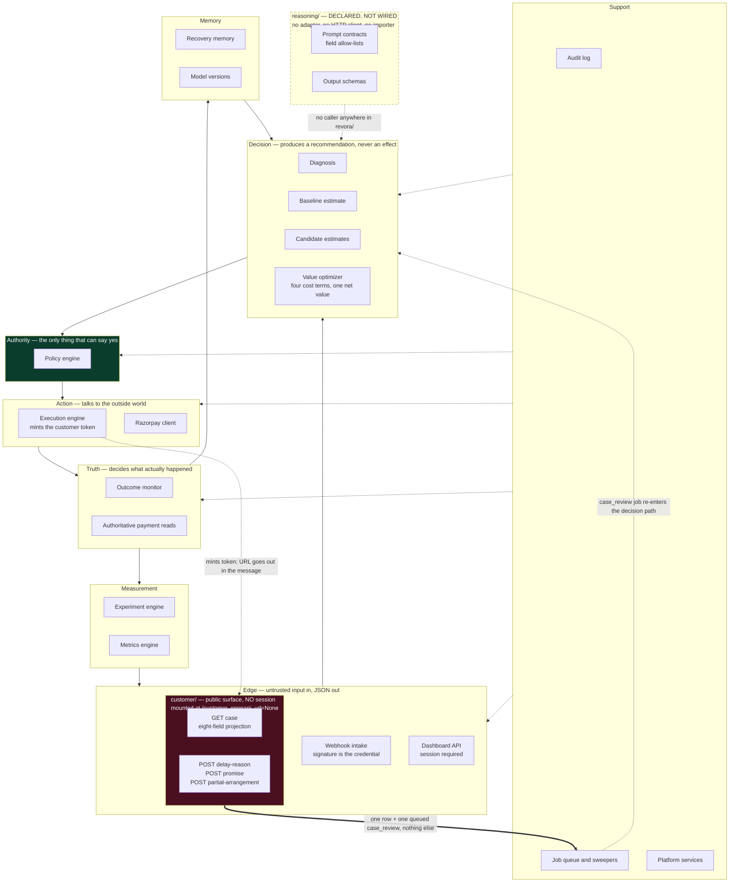
```mermaid
flowchart TB
    subgraph L1["Edge — untrusted input in, JSON out"]
        E1["Webhook intake<br/>signature is the credential"]
        E2["Dashboard API<br/>session required"]
        subgraph L1C["customer/ — public surface, NO session<br/>mounted at /customer, openapi_url=None"]
            C1["GET case<br/>eight-field projection"]
            C2["POST delay-reason<br/>POST promise<br/>POST partial-arrangement"]
        end
    end
    subgraph L2["Decision — produces a recommendation, never an effect"]
        D1["Diagnosis"]
        D2["Baseline estimate"]
        D3["Candidate estimates"]
        D4["Value optimizer<br/>four cost terms, one net value"]
    end
    subgraph LX["reasoning/ — DECLARED, NOT WIRED<br/>no adapter, no HTTP client, no importer"]
        X1["Prompt contracts<br/>field allow-lists"]
        X2["Output schemas"]
    end
    subgraph L3["Authority — the only thing that can say yes"]
        P1["Policy engine"]
    end
    subgraph L4["Action — talks to the outside world"]
        A1["Execution engine<br/>mints the customer token"]
        A2["Razorpay client"]
    end
    subgraph L5["Truth — decides what actually happened"]
        T1["Outcome monitor"]
        T2["Authoritative payment reads"]
    end
    subgraph L6["Measurement"]
        M1["Experiment engine"]
        M2["Metrics engine"]
    end
    subgraph L7["Memory"]
        R1["Recovery memory"]
        R2["Model versions"]
    end
    subgraph L8["Support"]
        S1["Job queue and sweepers"]
        S2["Audit log"]
        S3["Platform services"]
    end

    L1 --> L2 --> L3 --> L4 --> L5
    L5 --> L6
    L5 --> L7
    L7 --> L2
    L6 --> L1
    L8 -.-> L1
    L8 -.-> L2
    L8 -.-> L3
    L8 -.-> L4
    L8 -.-> L5

    A1 -.->|"mints token; URL goes out in the message"| L1C
    L1C ==>|"one row + one queued case_review, nothing else"| S1
    S1 -.->|"case_review job re-enters the decision path"| L2
    LX -.->|"no caller anywhere in revora/"| L2

    style L3 fill:#0b3d2c,color:#fff
    style L1C fill:#4a1020,color:#fff
    style LX stroke-dasharray: 6 4
```

The dark green box is the choke point. There is no arrow from the decision layer straight to the
action layer, and that absence is the design.

The dark red box is the second thing to look at. Every arrow leaving the public customer surface goes
into the support layer — it writes one `customer_signal` row and enqueues one `case_review` job, and
that is the whole of its reach. It does not transition a case, evaluate a policy or call a provider.
The decision path is re-entered later, by a worker, from a queued job. That indirection is not
politeness; it is the reason an unauthenticated request cannot cause an external effect.

The dashed box is `reasoning/`. It has no incoming arrow because nothing imports it.

| Layer | Owns | Must never do | Where the code lives |
| --- | --- | --- | --- |
| Edge | Signature checks, deduplication, canonical parsing, session auth, tenant scoping | Do decision work on the request path. Trust a payload before verifying its signature. Trust a merchant id sent in a request body | `ingestion/`, `api/` |
| Public customer surface | Token verification, rate limiting, the eight-field projection, three write shapes, one transaction per accepted write | Transition a case. Evaluate a policy. Call a provider. Treat the path's merchant slug as authority. Disclose a field the projection dataclass does not declare. Accept a partial amount | `customer/`, `api/routers/customer.py` |
| Decision | Cause diagnosis, baseline probability, per-action estimates, the net-value arithmetic and ranking | Call the provider. Execute anything. Let free text influence a ranking | `diagnosis/`, `estimation/`, `optimizer/` |
| Reasoning (declared, unwired) | Prompt field allow-lists, output schemas with exact-decimal parsing and caller-supplied bounds | Open a session. Read a case row. Import any feature package or `persistence/`. Put a field on the wire that a contract does not declare | `reasoning/` |
| Authority | The twelve ordered checks, one verdict, one reason, twelve recorded outcomes | Read anything an AI produced. Read the clock. Do I/O. Guess when an input is missing | `policy/` |
| Action | Exactly-once external effects, intent records, reconciliation, the three Razorpay calls | Act without a fresh approved decision. Retry a call whose outcome is unknown. Report success without a provider id | `execution/`, `providers/` |
| Truth | Authoritative payment reads, recovery declaration, conflict holds, cancelling actions when the customer already paid | Declare recovery from a webhook. Treat `authorized` or a partial payment as recovery | `outcome/` |
| Measurement | Control/treatment assignment, version freezing, sample size, lift intervals, every reported figure | Report a lift whose interval contains zero as established. Present observed recovery as incremental | `experiment/`, `metrics/` |
| Memory | One observation per finished case, provenance labels, intervention-status labels, model version promotion | Feed a policy threshold. Activate a model version without a recorded human approval | `memory/` |
| Support | Transactional job enqueue, periodic sweeps, append-only audit, config, crypto, masking, clock | Let a job be enqueued outside the transaction that caused it. Allow an audit row to be updated or deleted | `jobs/`, `audit/`, `platform/` |

The dependency rule that makes the authority layer trustworthy is enforced in CI, not by good
intentions: `policy/` is allowed to import only `domain/` and `platform/`. It cannot import
`reasoning/`, `estimation/` or `optimizer/`. If someone tries, the build fails.

That is one of six import contracts in `.importlinter`. The one that turns the picture above into a
structural claim rather than a drawing is the `layering` contract, whose bands — highest first, each
band able to import only bands below it — are:

```
revora.api | revora.jobs
revora.experiment | revora.metrics | revora.outcome | revora.execution
revora.optimizer | revora.policy
revora.estimation | revora.diagnosis | revora.memory | revora.reasoning
revora.customer | revora.detection | revora.ingestion
revora.cases
revora.audit
revora.persistence
revora.platform
revora.domain
```

Read the fifth band. **`revora.customer` sits below `revora.policy`, `revora.optimizer` and
`revora.execution`**, which is why nothing on the unauthenticated surface can evaluate a policy,
re-rank an action or issue an external effect — the import would fail the build before anyone had to
notice it in review. What the package can actually reach is `revora.cases` (for `enqueue_case_review`),
`revora.audit`, `revora.persistence`, `revora.platform` and `revora.domain`, and that is what it
imports. `revora.providers` is not in the band list at all, so the "cannot call a provider" claim for
this package rests on the band above it plus the absence of any provider import, not on the band order
alone — worth knowing if someone adds `providers/` to the layers later.

The other contract worth reading before section 3.21 is `reasoning-containment`: `revora.reasoning` is
forbidden from importing every feature package and `revora.persistence`, so the only things it can
reach are `revora.platform` and `revora.domain`. There is no session to open, no repository to call
and no ORM model to load. That is what carries "the adapter cannot read a case row" — a property of
what is reachable, not of what an adapter happens to do.

---

## 3. Feature-by-Feature Walkthrough

Every feature below follows the same shape: what it does, why it exists, how it works, a diagram,
what breaks, and what the breakage looks like from outside.

### 3.1 Event ingestion and signature verification

**What it does.** Receives a webhook from Razorpay, proves it really came from Razorpay, and turns it
into one durable database row.

**Why it exists.** The webhook endpoint is the only door into Revora that anyone on the internet can
knock on. Without a signature check, a stranger could post a fake `payment.failed` and make Revora
open a case and eventually message a real person. Without durable persistence before anything else
happens, a crash loses the event and the payment silently stops being tracked.

**How it works.**

1. Read the request body as raw bytes. Reject immediately if it is larger than the configured payload
   cap, before spending CPU on hashing.
2. Compute HMAC-SHA256 over those exact bytes using the merchant's webhook secret, and compare it in
   constant time against the `X-Razorpay-Signature` header. Constant-time comparison means the check
   takes the same amount of time whether the first byte is wrong or the last one is, so an attacker
   cannot learn the secret by timing responses.
3. This happens **before any parsing**. Razorpay's documentation is explicit that a re-serialized JSON
   string will not match the hash. If a proxy or a framework rewrites the body, every signature fails.
4. Require the `x-razorpay-event-id` header. It is a header, not a payload field, and it is unique per
   event — this is the deduplication key.
5. Parse into a canonical internal shape, converting Unix timestamps to UTC instants. Then re-serialize
   and re-parse as a self-check; if the result differs, the payload is quarantined rather than trusted.
6. One transaction: insert the event row (with the raw payload encrypted) and insert the detection job.
   Commit. Respond 200.

Detection does not happen on the request path. The provider marks a delivery as failed if you do not
respond within five seconds, so the request handler does the minimum and hands the rest to a worker.
The design recommends tightening the internal budget from 3000 ms to 1500 ms to leave room for TLS and
network on a small instance.

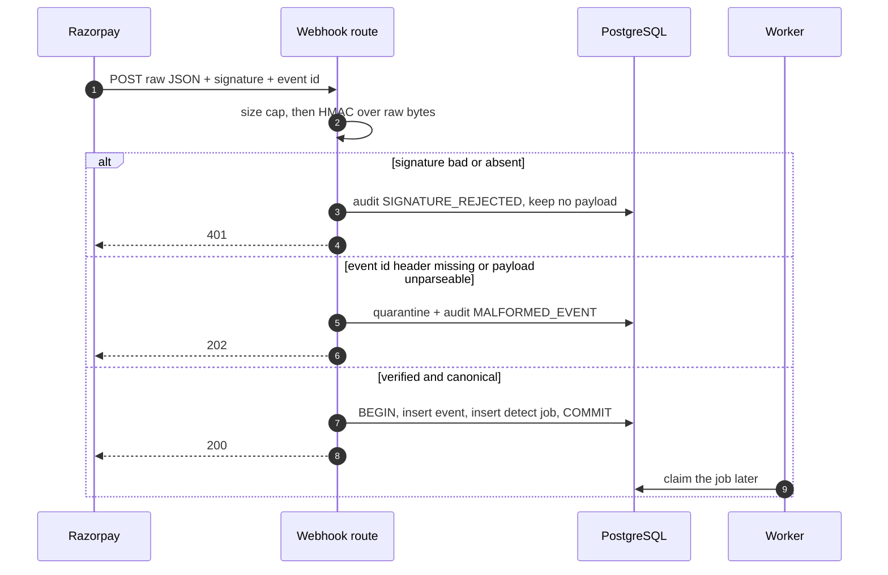
```mermaid
sequenceDiagram
    autonumber
    participant RZP as Razorpay
    participant API as Webhook route
    participant PG as PostgreSQL
    participant W as Worker

    RZP->>API: POST raw JSON + signature + event id
    API->>API: size cap, then HMAC over raw bytes
    alt signature bad or absent
        API->>PG: audit SIGNATURE_REJECTED, keep no payload
        API-->>RZP: 401
    else event id header missing or payload unparseable
        API->>PG: quarantine + audit MALFORMED_EVENT
        API-->>RZP: 202
    else verified and canonical
        API->>PG: BEGIN, insert event, insert detect job, COMMIT
        API-->>RZP: 200
        W->>PG: claim the job later
    end
```

The response codes are deliberate. A 401 for a bad signature. A 202 for a payload we cannot parse —
202 means "received, not processing," which does not invite a redelivery of something we will fail to
parse again. A 503 if the database is down, because that *does* invite redelivery.

**What can go wrong.** A proxy mutating the request body breaks every signature at once. A rotated
webhook secret breaks signatures for events still being retried under the old one — handled by
verifying against an ordered list of active secrets and only removing the old one after the 24-hour
redelivery window closes. The database being unavailable means 503 responses, and sustained 503s for
24 hours cause Razorpay to disable the webhook entirely.

**How you would know.** Signature failures show up as a burst of 401s and `SIGNATURE_REJECTED` audit
rows. A body-mutation problem shows up as *every* event failing, not some, which is why the design
adds a startup canary that signs a known body and verifies it end to end.

### 3.2 Deduplication

**What it does.** Guarantees that receiving the same webhook five times produces exactly one stored
event and exactly one recovery case.

**Why it exists.** Razorpay's delivery is documented as at-least-once. Duplicates are normal, not
exceptional. Without deduplication, one failed payment could open three cases and send three payment
links to the same person.

**How it works.** A single unique database constraint on `(merchant_id, provider_event_id)`, with the
insert written as `INSERT ... ON CONFLICT DO NOTHING`. If zero rows come back, it was a duplicate:
write a `DUPLICATE_EVENT_DISCARDED` audit row, respond 200, do nothing else. Because the check and the
insert are the same statement, two workers processing simultaneous deliveries cannot both win.

There is a second, separate guarantee one level up: a partial unique index on
`(merchant_id, provider_payment_id)` restricted to non-terminal cases. That is what makes "at most one
open case per payment" a database fact rather than a code convention.

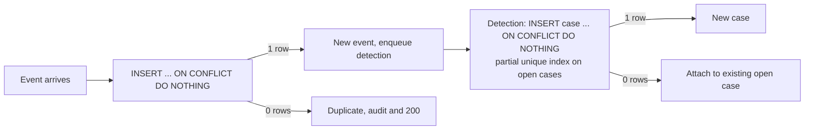
```mermaid
flowchart LR
    A["Event arrives"] --> B["INSERT ... ON CONFLICT DO NOTHING"]
    B -->|"1 row"| C["New event, enqueue detection"]
    B -->|"0 rows"| D["Duplicate, audit and 200"]
    C --> E["Detection: INSERT case ... ON CONFLICT DO NOTHING<br/>partial unique index on open cases"]
    E -->|"1 row"| F["New case"]
    E -->|"0 rows"| G["Attach to existing open case"]
```

**What can go wrong.** Someone drops the unique index during a migration. Someone rewrites the insert
as select-then-insert, which races. Both turn a database guarantee back into a hope.

**How you would know.** Two cases for one payment id. That is not a performance problem, it is a
correctness bug, and it means one of those two indexes is missing or bypassed.

### 3.3 Detection

**What it does.** Decides whether a stored event represents revenue at risk, and opens a case if so.

**Why it exists.** Not every failed-looking event is worth tracking. A ₹1 failure is not worth a
payment link. A payment that already succeeded is not at risk. Detection is where that filtering
happens, deterministically, so it is explainable and repeatable.

**How it works.** A short ordered list of predicates, each with an identifier that gets recorded:
payment status is `failed`; amount is at or above the minimum detection amount; currency is in the
supported set; there is no verified captured state for that payment id. Every event gets exactly one
recorded verdict — `AT_RISK`, `NOT_AT_RISK`, or `DEFERRED_TRIGGER` — within the detection latency
bound.

`DEFERRED_TRIGGER` is for the three triggers modelled but not in scope: checkout abandonment, missed
promise-to-pay, and payment-window expiry. Those events are stored and given a verdict so that they
are visible, but no case opens.

Detection is forbidden from calling the AI layer. That is a stated requirement, not a preference.

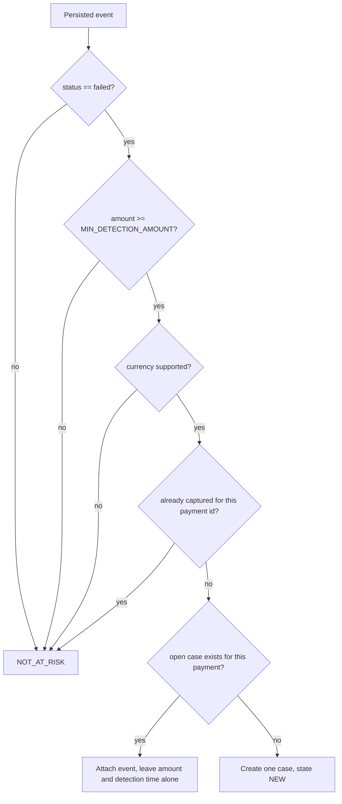
```mermaid
flowchart TD
    A["Persisted event"] --> B{"status == failed?"}
    B -->|no| N1["NOT_AT_RISK"]
    B -->|yes| C{"amount >= MIN_DETECTION_AMOUNT?"}
    C -->|no| N1
    C -->|yes| D{"currency supported?"}
    D -->|no| N1
    D -->|yes| E{"already captured for this payment id?"}
    E -->|yes| N1
    E -->|no| F{"open case exists for this payment?"}
    F -->|yes| G["Attach event, leave amount and detection time alone"]
    F -->|no| H["Create one case, state NEW"]
```

**What can go wrong.** A `payment.captured` arriving before the matching `payment.failed` — the
provider documents that ordering is not guaranteed. Handled by the already-captured check, so no case
opens for money that already arrived.

**How you would know.** Cases opening for payments that are already paid, or a detection verdict
missing for a stored event. The second one means the detection job never ran.

### 3.4 The recovery case lifecycle

**What it does.** Tracks one at-risk payment from detection to an ending, and guarantees it always
reaches an ending.

**Why it exists.** Two reasons. First, a customer must never be pursued indefinitely — that is what
the bounded window and the attempt caps are for. Second, every case needs an explainable end state,
so the dashboard can group unresolved money by reason instead of shrugging.

**How it works.** Fourteen states and one legal transition table. One function is the only writer of
case state. It locks the case row, checks an expected version number (so two concurrent writers cannot
both win), looks the transition up in a static table, applies the counter effects, allocates the audit
sequence number, and writes state plus audit record in one transaction. An illegal transition writes
nothing but an `ILLEGAL_TRANSITION` audit row.

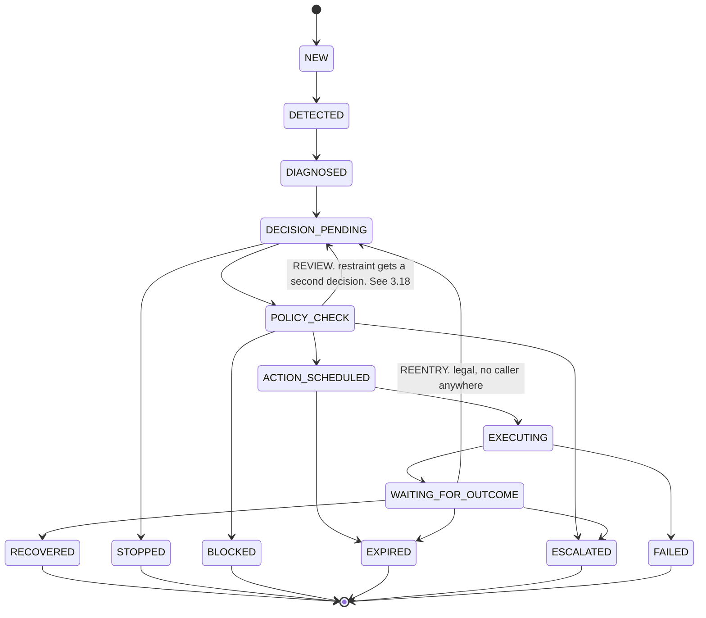
```mermaid
stateDiagram-v2
    [*] --> NEW
    NEW --> DETECTED
    DETECTED --> DIAGNOSED
    DIAGNOSED --> DECISION_PENDING
    DECISION_PENDING --> POLICY_CHECK
    POLICY_CHECK --> ACTION_SCHEDULED
    ACTION_SCHEDULED --> EXECUTING
    EXECUTING --> WAITING_FOR_OUTCOME
    WAITING_FOR_OUTCOME --> RECOVERED
    WAITING_FOR_OUTCOME --> DECISION_PENDING : REENTRY. legal, no caller anywhere
    POLICY_CHECK --> DECISION_PENDING : REVIEW. restraint gets a second decision. See 3.18

    POLICY_CHECK --> BLOCKED
    POLICY_CHECK --> ESCALATED
    DECISION_PENDING --> STOPPED
    ACTION_SCHEDULED --> EXPIRED
    EXECUTING --> FAILED
    WAITING_FOR_OUTCOME --> EXPIRED
    WAITING_FOR_OUTCOME --> ESCALATED

    RECOVERED --> [*]
    STOPPED --> [*]
    BLOCKED --> [*]
    EXPIRED --> [*]
    ESCALATED --> [*]
    FAILED --> [*]
```

The diagram shows representative terminal edges so it stays readable. The real table has one edge from
**every** non-terminal state to every one of `STOPPED`, `BLOCKED`, `EXPIRED`, `ESCALATED`, `FAILED`.
It is generated in code from a declaration, and the property test reads the same declaration, so the
test checks the manager against the table rather than the table against itself.

Four things make termination guaranteed rather than hoped for:

- The window end timestamp is written at case creation and **never** extended. It is a fixed wall-clock
  deadline that does not depend on any timer surviving.
- A sweeper visits every non-terminal case at least once per lifecycle evaluation interval and applies
  expiry from stored timestamps. Termination does not require any earlier job to have run.
- Every loop in the graph is guarded by the same decision-cycle counter, which only increases and is
  capped. There are two such edges. `WAITING_FOR_OUTCOME → DECISION_PENDING` is legal and **has no
  caller anywhere**; `POLICY_CHECK → DECISION_PENDING`, the `REVIEW` edge added by the second spec, is
  the only realized re-entry path in the system. See 3.18, and section 8 item 8 for the clause of the
  transition module's own termination proof that is stale on this point.
- On restart, non-terminal cases are reloaded and re-evaluated from stored rows before anything is
  scheduled.

One counter placement is worth understanding because it looks wrong at first. The executed-action
counter increments **at the transition into `EXECUTING`, before the provider request goes out.** That
is deliberately pessimistic: a crash right after the increment burns an attempt that never happened.
The alternative — increment on confirmation — risks a crash loop that issues calls while consuming
zero attempts, which could blow past the attempt cap. Given a choice between possibly under-attempting
and possibly over-charging someone, the design under-attempts.

**What can go wrong.** Two writers racing produces a version conflict; one commits, the other is told
to re-read before doing anything external. A crash mid-transaction leaves the prior state readable,
because nothing was committed.

**How you would know.** Cases sitting in a non-terminal state past their window end means the
lifecycle sweeper is not running. `ILLEGAL_TRANSITION` rows mean a component is trying a transition
the table does not allow — usually a missing intermediate step.

### 3.5 Diagnosis via the error-reason table

**What it does.** Works out *why* the payment failed, so the candidate action set can be narrowed
sensibly.

**Why it exists.** An expired card and an insufficient-funds decline are different problems. Sending
"try again now" to someone whose card expired is useless. The cause drives which actions are even
eligible.

**How it works.** This is the cheapest high-value part of the system, because Razorpay already tells
us the answer. The payment entity carries `error_code`, `error_reason`, `error_source` and
`error_step`, with documented values. A static lookup table maps them straight onto the eight
risk-cause values — for example `insufficient_funds` to `INSUFFICIENT_FUNDS`, `card_expired` to
`EXPIRED_PAYMENT_METHOD`, `bank_technical_error` to `BANK_OR_NETWORK_FAILURE`,
`payment_risk_check_failed` to `FRAUD_OR_RISK_SIGNAL`. Lookup order is `error_reason` first, then the
`(error_source, error_step)` pair, then `error_code`.

Exactly one match records confidence 1.0 and method `DETERMINISTIC`, and the AI layer is never called.
No match, or conflicting matches, sends one request to the model with a strict output schema. An
accepted answer records method `AI_ASSISTED` with confidence capped at 0.99 — 1.0 is reserved for the
deterministic path. A schema-invalid answer records `UNKNOWN` with confidence 0.0 and method
`REJECTED_AI_OUTPUT`, keeping the rejected text as evidence. A timeout records `UNKNOWN` with method
`FALLBACK_UNKNOWN`.

Low confidence has a consequence. If confidence falls below the confidence floor, or the method is a
rejection or fallback, the value optimizer treats the cause as `UNKNOWN`, which yields the narrowest
possible candidate set. So a bad guess makes Revora *more* conservative, not less.

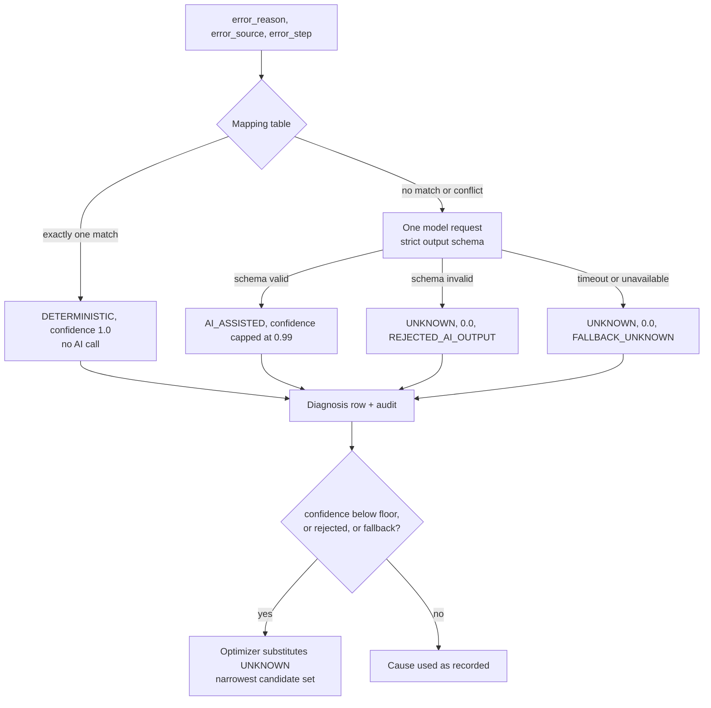
```mermaid
flowchart TD
    A["error_reason, error_source, error_step"] --> B{"Mapping table"}
    B -->|"exactly one match"| C["DETERMINISTIC, confidence 1.0<br/>no AI call"]
    B -->|"no match or conflict"| D["One model request<br/>strict output schema"]
    D -->|"schema valid"| E["AI_ASSISTED, confidence capped at 0.99"]
    D -->|"schema invalid"| F["UNKNOWN, 0.0, REJECTED_AI_OUTPUT"]
    D -->|"timeout or unavailable"| G["UNKNOWN, 0.0, FALLBACK_UNKNOWN"]
    C --> H["Diagnosis row + audit"]
    E --> H
    F --> H
    G --> H
    H --> I{"confidence below floor,<br/>or rejected, or fallback?"}
    I -->|yes| J["Optimizer substitutes UNKNOWN<br/>narrowest candidate set"]
    I -->|no| K["Cause used as recorded"]
```

Two mappings in the table are flagged judgement calls in the design: `payment_timed_out` mapped to
`ABANDONMENT` (the docs say it can also mean no gateway response, which is a technical fault) and
`otp_expired` mapped to `ABANDONMENT`. Both are configuration, and the deterministic hit rate plus the
model's disagreement rate are instrumented so a wrong mapping becomes visible.

**What can go wrong.** Razorpay adds a new error reason that is not in the table. It falls to the model
or to `UNKNOWN`. The count of unmapped reasons is a monitored metric — that is the signal to extend the
table.

**How you would know.** A rising share of `UNKNOWN` diagnoses, or a rising unmapped-reason count.
Neither is dangerous, but both mean the candidate sets are narrower than they should be.

### 3.6 The baseline estimate

**What it does.** Estimates the probability this payment recovers with no Revora involvement at all.

**Why it exists.** It is the denominator of the whole argument. Without it, every intervention looks
valuable, because you are comparing against zero instead of against reality.

**How it works.** For a segment with `s` recoveries out of `n` confirmed no-intervention observations,
the estimate is a Beta posterior mean: `(α + s) / (α + β + n)` with a weak prior of `α = β = 1`. At
`n = 0` that gives the prior mean with a 95% interval of roughly `[0.03, 0.97]`.

That absurd width is the point. It tells the reader the number means very little yet, and it
propagates all the way to the dashboard as `UNVALIDATED_BASELINE`. The alternative — a tidy-looking
0.34 with no interval — would be a lie with better manners.

**Why it is a prior and not a trained model.** This is the most important thing to understand about
this component. You could fit a model to the merchant's historical failed payments and their outcomes.
That model would be wrong in a specific way: the merchant *intervened* on some of those payments —
phone calls, emails, manual follow-up. A model fitted to those outcomes estimates *intervened*
recovery and labels it baseline. Every intervention would then look worthless, because the baseline
already secretly contains the effect of intervening.

The only unbiased source of "what happens with no intervention" is the experiment's control arm. That
is why the control arm is in the MVP and the trained model is not.

Segments are five categorical features: risk cause, amount band, payment method, first-versus-repeat
attempt, and a collapsed error-source band. The full cross product is 1,152 cells, which no realistic
dataset fills. So lookup backs off: try the full key, then drop error source, then attempt band, then
payment method, then amount band, then risk cause alone, then a global prior. The first level with
enough confirmed observations wins, and which level was used is recorded.

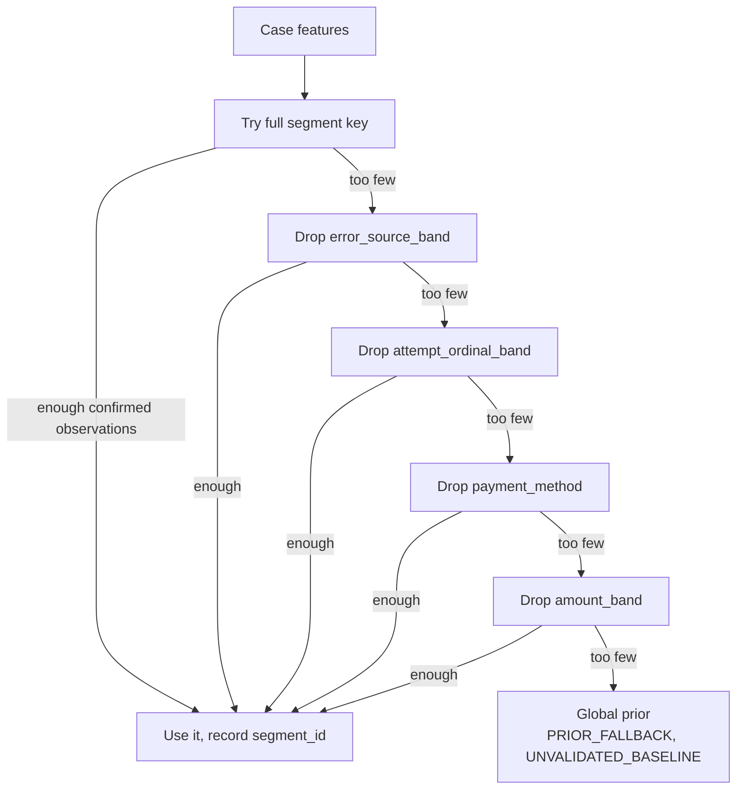
```mermaid
flowchart TD
    A["Case features"] --> B["Try full segment key"]
    B -->|"enough confirmed observations"| Z["Use it, record segment_id"]
    B -->|"too few"| C["Drop error_source_band"]
    C -->|"enough"| Z
    C -->|"too few"| D["Drop attempt_ordinal_band"]
    D -->|"enough"| Z
    D -->|"too few"| E["Drop payment_method"]
    E -->|"enough"| Z
    E -->|"too few"| F["Drop amount_band"]
    F -->|"enough"| Z
    F -->|"too few"| G["Global prior<br/>PRIOR_FALLBACK, UNVALIDATED_BASELINE"]
```

If the estimate cannot be produced — timeout, or memory unreachable — **no estimate is recorded** and
the case stays in `DIAGNOSED`. A missing baseline is never silently treated as zero, because zero
would make every intervention look brilliant.

Every observation feeding a baseline carries an intervention-status label: `NO_INTERVENTION_CONFIRMED`,
`REVORA_INTERVENED`, or `MERCHANT_INTERVENTION_UNKNOWN`. Only the first is usable as a baseline label.
And the honest reading of `NO_INTERVENTION_CONFIRMED` is "no Revora action and no *recorded* merchant
action" — Revora cannot see the merchant phoning a customer. The design labels that weakness and
reports the unknown share per segment rather than claiming it is solved.

**What can go wrong.** Intervention bias, as above — mitigated by labelling, not eliminated. Segments
with too few observations forever, so nothing is ever validated.

**How you would know.** Every baseline carrying `UNVALIDATED_BASELINE`, and every calibration band
marked `CALIBRATION_UNVERIFIED`. That is expected early on. See section 6.

### 3.7 Candidate estimates

**What it does.** For each action Revora could take, estimates the recovery probability and four cost
figures. (It was three until the cost split landed; 3.17 is the whole of that story and this section
describes the terms as they now are.)

**Why it exists.** You cannot rank actions without pricing them. And the null actions have to be
priced on the same terms as the real ones, or the comparison is rigged.

**How it works.** Build the candidate set from a cause-to-action eligibility table, always including
`DO_NOTHING` and `WAIT`. For each member, produce five numbers: intervention probability,
`financial_cost`, `communication_cost`, `risk_cost`, `customer_cost`. All four costs are integers in the
same minor units as the payment amount. Each number records how it was produced — `DETERMINISTIC`,
`PRIOR_FALLBACK`, `UNCALIBRATED`, `DEFINITIONAL`, or `COST_SPLIT_NOT_MEASURED`, which is the weakest of
the five and which no estimator produces (3.17).

`DO_NOTHING` is definitional: probability equals baseline, all four costs zero, therefore net value
exactly zero. `WAIT` gets zero financial, communication and customer cost, with a probability derived
from the no-intervention hazard over the time left in the window.

Actions with no verified provider capability are marked `UNAVAILABLE`, excluded from selection, and
**kept in the recorded set**. That last part is not padding: the dashboard can then show "a retry
would have been considered but is not available on this account," which is more honest than silently
omitting it.

Zero provider calls happen here. Everything comes from stored fields, memory and configuration.

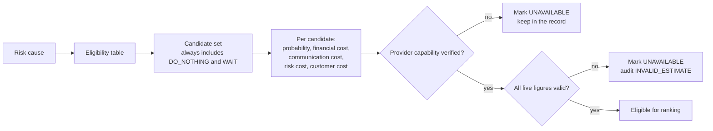
```mermaid
flowchart LR
    A["Risk cause"] --> B["Eligibility table"]
    B --> C["Candidate set<br/>always includes DO_NOTHING and WAIT"]
    C --> D["Per candidate:<br/>probability, financial cost,<br/>communication cost,<br/>risk cost, customer cost"]
    D --> E{"Provider capability verified?"}
    E -->|no| F["Mark UNAVAILABLE<br/>keep in the record"]
    E -->|yes| G{"All five figures valid?"}
    G -->|no| H["Mark UNAVAILABLE<br/>audit INVALID_ESTIMATE"]
    G -->|yes| I["Eligible for ranking"]
```

The design is blunt about what this component actually is: for the MVP it is a configuration lookup
marked `UNCALIBRATED`, not a simulator. The review even recommends renaming it for clarity. What it
wants to be is an uplift model, and that needs data that does not exist yet.

**What can go wrong.** Optimistic priors make interventions look good and the arithmetic cannot detect
it. The structural counter is that `UNCALIBRATED` propagates to every surface and the experiment
measures whether the priors were right.

**How you would know.** Everything on the dashboard marked `UNCALIBRATED`. Expected until real
outcomes accumulate.

### 3.8 The value optimizer

**What it does.** The arithmetic that is the product.

**Why it exists.** This is the only component that answers the actual question. Everything upstream
feeds it and everything downstream checks or records it.

**How it works.** Three lines of arithmetic per candidate, all in integer minor units, with half-up
rounding applied exactly once:

```
incremental_probability      = intervention_probability - baseline_probability     (negatives kept)
expected_incremental_revenue = payment_amount * incremental_probability            (the only rounding)
net_recovery_value           = expected_incremental_revenue
                               - financial_cost - communication_cost
                               - risk_cost - customer_cost
```

The four cost terms were a single blended `action_cost` until the second spec split them. 3.17 covers
the split, why it changed no decision, and why the total has one name in the code and another in the
DTO.

Then exclusions, then selection:

1. Exclude any candidate whose expected incremental revenue is zero or negative, with reason
   `NON_POSITIVE_INCREMENTAL_VALUE`. No cost-ratio division is performed for these — dividing by zero
   or a negative is meaningless.
2. Exclude any candidate whose total cost divided by expected incremental revenue exceeds the maximum
   cost-to-value ratio, reason `COST_RATIO_EXCEEDED`.
3. Exclude candidates with invalid inputs or marked `UNAVAILABLE`.
4. Among survivors clearing both the minimum net value threshold and the minimum incremental
   probability, pick the largest net recovery value. Ties break toward lower total cost, then a declared
   precedence order. The key is `(-net_recovery_value, total_cost, precedence index)`, all integers —
   see 3.17.
5. If nothing clears both thresholds, pick whichever of `DO_NOTHING` and `WAIT` has the greater net
   value, `DO_NOTHING` on a tie, and record the reason as `NO_POSITIVE_VALUE` — or
   `HIGH_BASELINE_NO_INTERVENTION` when the baseline is at or above the high-baseline threshold.

Ranking uses net recovery value **only**. Not probability magnitude, not model text, not anything the
AI produced. If the highest-probability action differs from the selected one, both are recorded with
their figures and a divergence reason of `HIGHER_PROBABILITY_LOWER_NET_VALUE`. Any model-written
explanation goes in a column named to make its status obvious and read by exactly one code path — the
dashboard serializer.

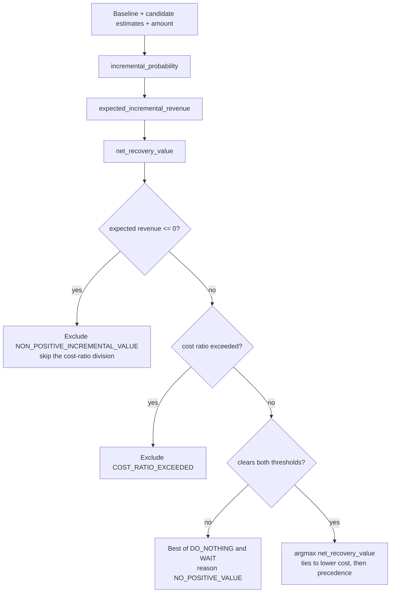
```mermaid
flowchart TD
    A["Baseline + candidate estimates + amount"] --> B["incremental_probability"]
    B --> C["expected_incremental_revenue"]
    C --> D["net_recovery_value"]
    D --> E{"expected revenue <= 0?"}
    E -->|yes| X1["Exclude NON_POSITIVE_INCREMENTAL_VALUE<br/>skip the cost-ratio division"]
    E -->|no| F{"cost ratio exceeded?"}
    F -->|yes| X2["Exclude COST_RATIO_EXCEEDED"]
    F -->|no| G{"clears both thresholds?"}
    G -->|no| H["Best of DO_NOTHING and WAIT<br/>reason NO_POSITIVE_VALUE"]
    G -->|yes| I["argmax net_recovery_value<br/>ties to lower cost, then precedence"]
```

All money is `BIGINT` minor units. No floats anywhere in a stored currency figure. Probabilities are
the only non-integer quantities, held at four decimal places, and they are multiplied into money
exactly once, at which point rounding happens and the integer is stored. Aggregates are the exact sum
of those stored integers, so the total on the dashboard equals the sum of the rows, always.

**What can go wrong.** Garbage in, confident recommendation out. The arithmetic is provably correct and
cannot tell that its inputs are guesses. The mitigation is labelling, never suppressing the number.

**How you would know.** Selections that look sensible arithmetically but wrong commercially. That is a
signal about the priors and thresholds, not about this component.

### 3.9 The policy engine and its twelve checks

**What it does.** Holds the only authority to allow an external effect.

**Why it exists.** Because the layers above it are advisory. Something has to be the thing that cannot
be talked into contacting a customer who already paid, or opted out, or has been handed to a human.
Making it a pure function is what makes that provable.

**How it works.** A single pure function: `evaluate(PolicyInput, RuleSet) -> PolicyDecision`. No I/O,
no clock read — the evaluation timestamp is a field on the input — no randomness, no logging. Identical
inputs always produce an identical verdict, reason, and twelve ordered check outcomes. That is what
lets you replay any historical decision by reconstructing its input.

The twelve checks in fixed order. The order is not arbitrary: absolute prohibitions come first, so an
expensive or fiddly check can never be the reason a paid or opted-out customer got messaged.

| # | Check | Verdict when it fails | Why it sits here |
| --- | --- | --- | --- |
| 1 | Already paid | `BLOCKED` ALREADY_PAID | Absolute |
| 2 | Already terminal | `BLOCKED` | Nothing to do |
| 3 | Duplicate intent for this key | `BLOCKED` DUPLICATE_ACTION | Cheapest correctness guard |
| 4 | Fraud or risk | `ESCALATE` FRAUD_OR_RISK_FLAG | A human takes over |
| 5 | Customer opted out | `BLOCKED` CUSTOMER_OPTED_OUT | Before every bound, so no bound bug can leak a message |
| 6 | Required consent present | `BLOCKED` CONSENT_MISSING | Same reason |
| 7 | Human ownership | `BLOCKED` HUMAN_OWNERSHIP | Automation yields to a person |
| 8 | Window still valid | `BLOCKED` WINDOW_EXPIRED | Time bound |
| 9 | Attempt count | `BLOCKED` MAX_ATTEMPTS_REACHED | Effort bound |
| 10 | Message count | `BLOCKED` MAX_MESSAGES_REACHED | Customer-visible actions only |
| 11 | Cooldown elapsed | `DEFERRED` COOLDOWN_ACTIVE with an earliest-permitted time, or `BLOCKED` WINDOW_EXPIRED if that time falls outside the window | The only check that can defer |
| 12 | Action eligibility | `BLOCKED` | Most case-specific, so last |

The verdict comes from the lowest-numbered failing check. Any input that cannot be read records
`UNAVAILABLE` for that check and the verdict is `BLOCKED` with `POLICY_INPUT_UNAVAILABLE`. There is no
"assume it's fine" branch.

Four independent mechanisms keep AI out of this function, because one would be a claim and four is a
structure: the input type is a frozen dataclass with enumerated fields and no `dict` or `Any` for an
AI value to sit in; the only constructor reads named columns and does not read the AI-explanation
column or an AI-assisted confidence; the module cannot import the reasoning or estimation packages and
CI enforces that; and a property test replaces every AI-produced field with arbitrary valid content and
asserts the verdict does not move.

One nuance stated plainly rather than glossed: the *selected action* is a policy input, and that action
was chosen by an optimizer that consumed a cause which may have been AI-assisted. So AI influences
which action is presented for authorization. It does not influence whether that action is authorized.
The honest claim is "AI cannot authorize," not "AI has no causal path to an action."

**Policy runs twice per action.** Once when the recommendation is produced, once inside the execution
lock against freshly reloaded state.

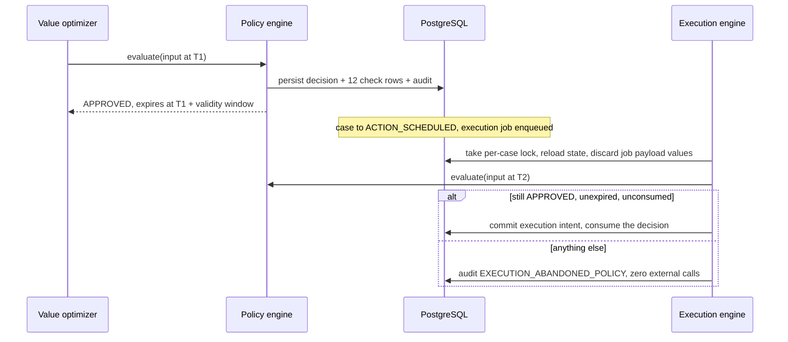
```mermaid
sequenceDiagram
    participant O as Value optimizer
    participant P as Policy engine
    participant PG as PostgreSQL
    participant E as Execution engine

    O->>P: evaluate(input at T1)
    P->>PG: persist decision + 12 check rows + audit
    P-->>O: APPROVED, expires at T1 + validity window
    Note over PG: case to ACTION_SCHEDULED, execution job enqueued
    E->>PG: take per-case lock, reload state, discard job payload values
    E->>P: evaluate(input at T2)
    alt still APPROVED, unexpired, unconsumed
        E->>PG: commit execution intent, consume the decision
    else anything else
        E->>PG: audit EXECUTION_ABANDONED_POLICY, zero external calls
    end
```

The second evaluation is not a formality. Between T1 and T2 the customer may have paid, opted out,
been assigned to a human, or the window may have closed.

**What can go wrong.** A rule set change during an active experiment invalidates that experiment —
caught by version freezing. Stale input reaching execution — caught by the re-check.

**How you would know.** A decision with fewer than twelve recorded check outcomes means something
short-circuited. An approved decision consumed twice would violate a unique constraint and surface as
an error.

### 3.10 Exactly-once execution — the most important mechanism in the system

**What it does.** Performs the approved action at most once, and reports success only when the provider
confirmed it.

**Why it exists.** If this is wrong, a customer gets two payment links and two SMS messages, or Revora
tells the merchant a link exists when the call actually failed. Everything else in the design is in
service of getting this right.

**The awkward fact it works around.** Razorpay has no idempotency header for Payment Link creation.
"Idempotent" means doing the same operation twice has the same effect as doing it once — an idempotency
key is how you ask a provider to enforce that. Razorpay documents such headers for payouts and
transfers, but not for payment links. So Revora builds the guarantee itself out of two verified
capabilities: `reference_id` must be unique per link, and you can fetch links filtered by
`reference_id`.

Revora sets `reference_id` to its own idempotency key. After any uncertain create, it can ask the
provider "does a link with this reference already exist?" and get an authoritative answer. Note the
design deliberately does **not** depend on Razorpay rejecting a duplicate `reference_id` — that is
unverified. It depends only on the documented *query* capability, which is the safer dependency.

**How it works.**

1. Take a transaction-scoped advisory lock on a hash of the case id.
2. Reload case, consent, verified payment state and existing intents from the database, **discarding
   every value carried in the job payload**.
3. Re-run policy against that reloaded state. Not approved means abandon with zero external calls.
4. Derive the idempotency key deterministically from case id, action type and attempt ordinal. Same
   attempt, same key, always. Because `reference_id` is capped at 40 characters, the key is `rv_` plus
   the first 16 hex characters of a SHA-256 of those three inputs — 19 characters.
5. If an intent row already exists for that key: return the recorded result if it is `CONFIRMED` or
   `FAILED`, hand it to reconciliation if it is `ATTEMPTED` or `UNCERTAIN`. Never a second call.
6. Otherwise insert the intent row in state `ATTEMPTED`, move the case to `EXECUTING`, increment
   counters, mark the policy decision consumed, write the audit row, and **commit**. The lock releases
   here.
7. Now make the HTTP call, with `reference_id` set to the key.
8. Commit the outcome: `CONFIRMED` with the provider's link id, or `FAILED`, or `UNCERTAIN`.

The durable intent record — not the lock — is what prevents a second call. The lock only keeps the
check-and-insert atomic so two workers cannot both pass "no intent exists." It deliberately does not
span the HTTP call; holding a database lock across a 15-second external request would tie up a
connection and create a lease-expiry problem exactly where correctness matters.

**The two crash windows.** This is the part worth reading twice.

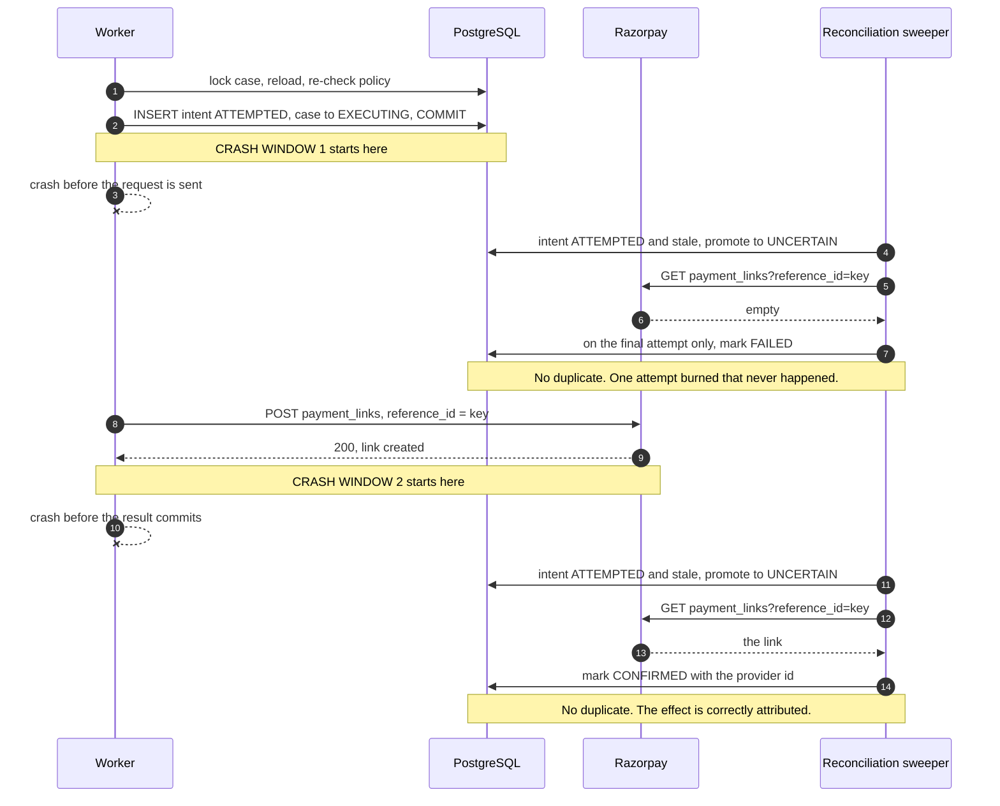
```mermaid
sequenceDiagram
    autonumber
    participant W as Worker
    participant PG as PostgreSQL
    participant RZP as Razorpay
    participant S as Reconciliation sweeper

    W->>PG: lock case, reload, re-check policy
    W->>PG: INSERT intent ATTEMPTED, case to EXECUTING, COMMIT
    Note over W,PG: CRASH WINDOW 1 starts here
    W --x W: crash before the request is sent
    S->>PG: intent ATTEMPTED and stale, promote to UNCERTAIN
    S->>RZP: GET payment_links?reference_id=key
    RZP-->>S: empty
    S->>PG: on the final attempt only, mark FAILED
    Note over S,PG: No duplicate. One attempt burned that never happened.

    W->>RZP: POST payment_links, reference_id = key
    RZP-->>W: 200, link created
    Note over W,RZP: CRASH WINDOW 2 starts here
    W --x W: crash before the result commits
    S->>PG: intent ATTEMPTED and stale, promote to UNCERTAIN
    S->>RZP: GET payment_links?reference_id=key
    RZP-->>S: the link
    S->>PG: mark CONFIRMED with the provider id
    Note over S,PG: No duplicate. The effect is correctly attributed.
```

Both windows are safe for one reason: **the durable intent is written before the call, and the
reconciliation read is keyed on the same value the call carried.** Every restart path goes to
reconciliation, never to a repeated call.

The formal argument is three lines. A call is issued only immediately after a successful insert of an
intent with that key. That insert can succeed at most once, because of the unique constraint on
`(merchant_id, idempotency_key)`. No other code path calls the create endpoint.

**Response classification is where the care shows.** The client classifies every provider outcome into
exactly one bucket, and the bucket determines the intent state:

| Provider outcome | Intent state | Does the effect exist? |
| --- | --- | --- |
| 200 with a valid link entity | `CONFIRMED` | Yes |
| 4xx with a parseable error object | `FAILED` | No |
| 5xx | `UNCERTAIN` | Unknown |
| Read timeout or connection reset after sending | `UNCERTAIN` | Unknown |
| 200 with an unparseable body | `UNCERTAIN` | Unknown |
| Connect error before sending | `FAILED` | No — nothing left the process |

The last row is the only network failure treated as definitive, and only because a connect-phase
failure means no bytes reached the server. This is also why the design uses a hand-written client
rather than the official SDK: the SDK raises on error and normalizes responses, which erases the
difference between "definitely did not happen" and "might have happened" — the only distinction that
matters here.

**The reconciliation loop.**

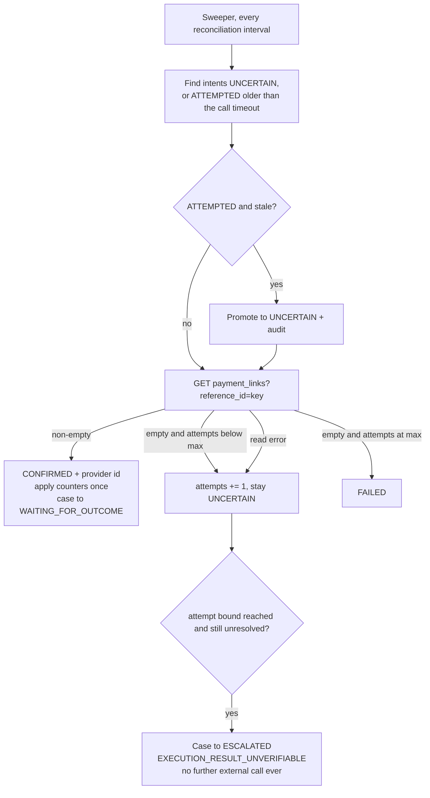
```mermaid
flowchart TD
    S["Sweeper, every reconciliation interval"] --> Q["Find intents UNCERTAIN,<br/>or ATTEMPTED older than the call timeout"]
    Q --> P1{"ATTEMPTED and stale?"}
    P1 -->|yes| P2["Promote to UNCERTAIN + audit"]
    P1 -->|no| R
    P2 --> R["GET payment_links?reference_id=key"]
    R -->|"non-empty"| C["CONFIRMED + provider id<br/>apply counters once<br/>case to WAITING_FOR_OUTCOME"]
    R -->|"empty and attempts below max"| H["attempts += 1, stay UNCERTAIN"]
    R -->|"empty and attempts at max"| F["FAILED"]
    R -->|"read error"| H
    H --> X{"attempt bound reached and still unresolved?"}
    X -->|yes| E["Case to ESCALATED<br/>EXECUTION_RESULT_UNVERIFIABLE<br/>no further external call ever"]
```

The asymmetry is deliberate. A non-empty read confirms immediately. An empty read only confirms failure
on the *final* attempt. Earlier empty reads leave the intent `UNCERTAIN`. That is because it is unknown
whether a just-created link is immediately visible in the listing endpoint — if it lags, an early empty
read would look like failure and a retry would create a duplicate. Ambiguity resolves toward "might
exist," which errs toward not sending a second message.

Counters are applied exactly once via a boolean flag on the intent, flipped in the same transaction as
the increment. Both the confirmation path and the reconciliation path check it first, so a case that
confirms via reconciliation after a partial crash does not double-count.

**What can go wrong.** Someone attaches a retry decorator to a function that can produce an external
effect. Someone treats an `UNCERTAIN` intent as a signal to try again. Both create duplicates.

**How you would know.** Two payment links with the same reference, or two SMS messages to one customer
for one case. Treat that as a correctness bug and stop. See section 6.

### 3.11 Outcome verification

**What it does.** Decides what actually happened, from an authoritative provider read only.

**Why it exists.** Because the recovery number is the product's headline claim, and a webhook is not
proof. Delivery is at-least-once and possibly out of order. Declaring recovery on a webhook alone would
produce numbers you could not defend when questioned.

**How it works.** A success signal arrives — `payment.captured`, `order.paid`, or `payment_link.paid`.
Revora persists the event and enqueues an outcome job. It declares nothing yet. The job calls
`GET /v1/payments/{id}`, stores the full response as a payment-state read row, and only then decides.

- `captured` (or `authorized` with `captured == true`) means recovered. The recovered amount comes from
  the **read**, not the webhook.
- `authorized` alone is **not** recovery. The money is not captured.
- Anything else is a conflict: hold the case in `WAITING_FOR_OUTCOME`, write a
  `PAYMENT_STATE_CONFLICT` audit row, re-read at the configured interval up to the attempt cap, then
  escalate with `PAYMENT_STATE_UNVERIFIABLE`.
- A partial payment is **not** recovery. Links are created with `accept_partial: false`, and a
  `partially_paid` status is handled as a conflict hold.

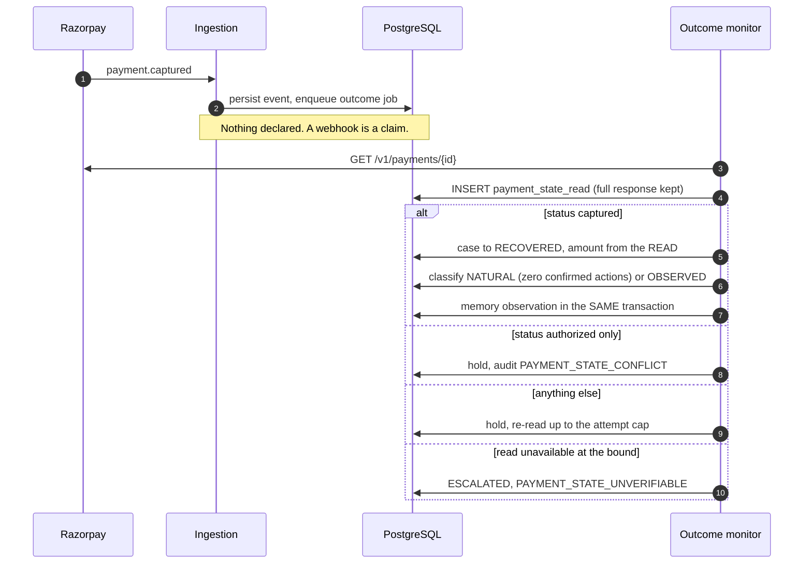
```mermaid
sequenceDiagram
    autonumber
    participant RZP as Razorpay
    participant API as Ingestion
    participant PG as PostgreSQL
    participant OM as Outcome monitor

    RZP->>API: payment.captured
    API->>PG: persist event, enqueue outcome job
    Note over API,PG: Nothing declared. A webhook is a claim.
    OM->>RZP: GET /v1/payments/{id}
    OM->>PG: INSERT payment_state_read (full response kept)
    alt status captured
        OM->>PG: case to RECOVERED, amount from the READ
        OM->>PG: classify NATURAL (zero confirmed actions) or OBSERVED
        OM->>PG: memory observation in the SAME transaction
    else status authorized only
        OM->>PG: hold, audit PAYMENT_STATE_CONFLICT
    else anything else
        OM->>PG: hold, re-read up to the attempt cap
    else read unavailable at the bound
        OM->>PG: ESCALATED, PAYMENT_STATE_UNVERIFIABLE
    end
```

Schema constraints carry the honesty rather than code discipline: a recovery row cannot exist without
pointing at a read row, and there is one recovery row per case at most, so a recovered amount is
counted exactly once no matter how many duplicate success events arrive.

Two more behaviours worth knowing. If a read confirms payment while an action is queued and no intent
exists yet, the action is cancelled before any call and audited as
`ACTION_CANCELLED_PAYMENT_RECEIVED`. If an intent already exists, the action is flagged as a
post-payment action and counted in `unnecessary_action_count` — a metric that is deliberately visible,
because it is the cost of Revora being wrong, and hiding it would defeat the purpose. And if a payment
arrives after a case already went terminal for another reason, exactly one reconciliation transition to
`RECOVERED` is allowed, audited as `DELAYED_RECOVERY_RECONCILED`, with the period restated so the
amount is still counted once.

**What can go wrong.** The provider read lagging behind the webhook — unverified how often — looks like
a conflict and self-resolves on retry. The read being unavailable holds the case rather than declaring
anything.

**How you would know.** A pile of `PAYMENT_STATE_CONFLICT` rows means either genuine lag or a read
problem. Cases escalating with `PAYMENT_STATE_UNVERIFIABLE` means reads are failing outright.

### 3.12 The experiment engine and the control group

**What it does.** Makes the word "incremental" earnable, and refuses it when it has not been earned.

**Why it exists.** "We sent a link and the money arrived" is not "we caused the money to arrive." The
only way to tell the difference is to withhold the intervention from a comparable group and compare.

**How it works.** Assignment is a keyed hash: HMAC-SHA256 of the case id under the experiment id,
turned into a uniform number, split by the allocation ratio. Deterministic, stateless, needs no
coordination between workers, and identical on every re-evaluation. It is persisted **before** any
diagnosis runs, and the group column has no update permission.

Control cases run the frozen baseline workflow. Here is the clever part: they still run the entire
Revora pipeline through to a recorded recommendation. That recommendation is stored and **suppressed**
— no execution intent is ever created from it. So for every control case you know exactly what Revora
would have done. That turns the comparison from "two numbers" into something interpretable.

Sample size is computed at definition time from the assumed baseline rate, the minimum detectable
effect, the significance level and the power. It is not assumed. The design's worked arithmetic: at a
20% baseline with the usual 0.05 significance and 0.80 power, detecting a 5-point lift needs roughly
1,000 cases per arm, while detecting a 10-point lift needs roughly 270. So the "500 per arm" figure
from the project brief is adequate for a large effect and inadequate for a small one — which is exactly
why the number has to be derived and reported.

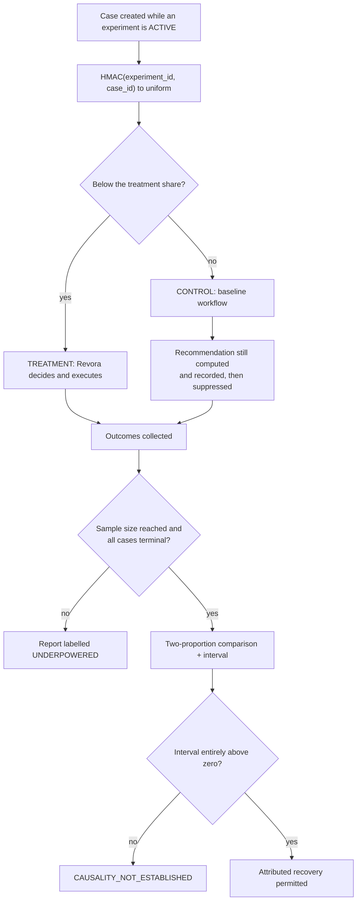
```mermaid
flowchart TD
    A["Case created while an experiment is ACTIVE"] --> B["HMAC(experiment_id, case_id) to uniform"]
    B --> C{"Below the treatment share?"}
    C -->|yes| T["TREATMENT: Revora decides and executes"]
    C -->|no| K["CONTROL: baseline workflow"]
    K --> K2["Recommendation still computed<br/>and recorded, then suppressed"]
    T --> R["Outcomes collected"]
    K2 --> R
    R --> S{"Sample size reached and<br/>all cases terminal?"}
    S -->|no| U["Report labelled UNDERPOWERED"]
    S -->|yes| V["Two-proportion comparison + interval"]
    V --> W{"Interval entirely above zero?"}
    W -->|no| Y["CAUSALITY_NOT_ESTABLISHED"]
    W -->|yes| Z["Attributed recovery permitted"]
```

Four labels can disqualify a result: `UNDERPOWERED` (fewer cases than required),
`INVALIDATED` (a frozen component version changed mid-experiment), `SYNTHETIC` (inputs came from
generated data), and `CONTAMINATED` on individual cases (a control case received an action outside the
frozen baseline definition). Secondary metrics are labelled `EXPLORATORY` and excluded from attribution.

**The deepest limitation in the whole design, stated plainly.** Merchant-side manual recovery is
invisible to Revora. If the merchant phones a control-arm customer, control recovery inflates and the
measured lift shrinks. If they chase treatment cases harder, the reverse. Contamination detection only
catches what Revora can see. No engineering fixes this; it needs an operational agreement with the
merchant, and even then it is trust rather than measurement.

**What can go wrong.** Beyond invisible contamination: a version promotion during an active experiment
invalidates it, and a case whose assignment cannot be persisted before diagnosis is excluded from both
arms and run on the baseline workflow — because an unassigned case must never quietly become treatment.

**How you would know.** Every result labelled `UNDERPOWERED`. Expected at demo scale. See section 6.

### 3.13 The metrics engine and the three recovery classes

**What it does.** Computes every reported figure from persisted rows, keeping the outcome classes apart.

**Why it exists.** So nobody is sold activity as outcome. Section 5 covers the three classes in full;
this is the mechanism.

**How it works.** A reporting period cohort is the set of cases whose detection timestamp falls in a
half-open interval. Every money figure is a `SUM()` of stored `BIGINT` minor units, so the reported
aggregate equals the sum of the rows exactly. Rates with a zero denominator report `UNDEFINED`, not 0 —
because 0% recovery and "no cases yet" are different statements.

The headline separation:

- `natural_recovered_revenue` — recovered with zero confirmed Revora actions.
- `observed_recovered_revenue` — recovered with at least one confirmed Revora action.
- `incremental_recovered_revenue` — only from an adequately powered completed experiment whose lift
  interval excludes zero. Otherwise reported as `NOT_ESTABLISHED` with **no numeric value**.

Classification is withheld entirely while any execution intent for a case is `UNCERTAIN`. You cannot
classify a recovery as natural or observed if you do not yet know whether an action happened.

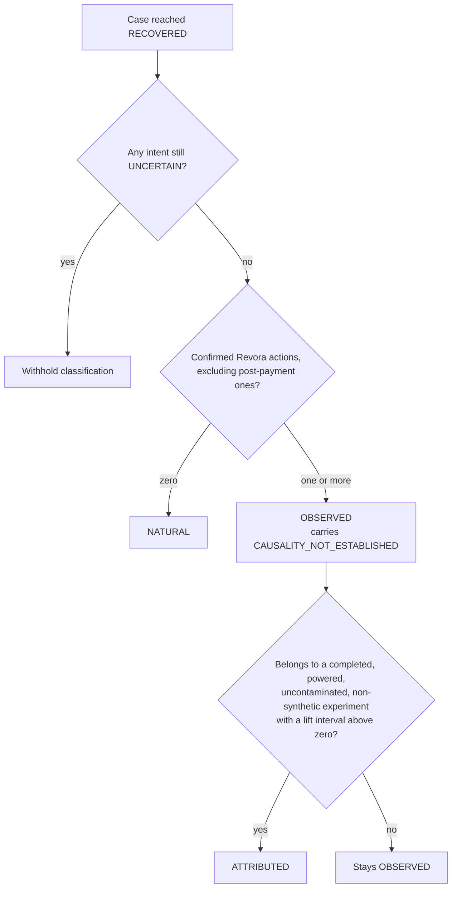
```mermaid
flowchart TD
    A["Case reached RECOVERED"] --> B{"Any intent still UNCERTAIN?"}
    B -->|yes| C["Withhold classification"]
    B -->|no| D{"Confirmed Revora actions, excluding post-payment ones?"}
    D -->|zero| E["NATURAL"]
    D -->|"one or more"| F["OBSERVED<br/>carries CAUSALITY_NOT_ESTABLISHED"]
    F --> G{"Belongs to a completed, powered,<br/>uncontaminated, non-synthetic experiment<br/>with a lift interval above zero?"}
    G -->|yes| H["ATTRIBUTED"]
    G -->|no| I["Stays OBSERVED"]
```

Everything derived even partly from generated data carries `SYNTHETIC` on every surface and in every
export.

**What can go wrong.** Refunds are not netted in the MVP, so recovery figures are gross of refunds and
labelled as such. The refunded amount is captured on every read so a restatement is possible later.

**How you would know.** A figure that looks too good — see section 6. Or a rate showing 0% when it
should show `UNDEFINED`, which means the zero-denominator handling was lost.

### 3.14 The audit log

**What it does.** Makes an explanation possible and a rewrite impossible.

**Why it exists.** A merchant will eventually have to explain to a customer, or to an auditor, why
Revora did what it did. If that explanation requires reconstruction or inference, it is not an
explanation.

**How it works.** Insert-only, in the same database as the state, so the audit write shares the
transaction with the state change it records. If the audit write fails, the whole transaction rolls
back and state and audit cannot diverge.

Append-only is enforced twice: the application role has `UPDATE`, `DELETE` and `TRUNCATE` revoked, and
a `BEFORE UPDATE OR DELETE` trigger raises an exception. Two mechanisms because a grant can be
misconfigured by a migration. A rejected mutation is itself recorded, naming the actor who tried.

Sequence numbers are per case, start at 1, increase by exactly 1, and have no gaps. The naive
approaches both fail — a Postgres sequence has gaps by design because allocations are not rolled back,
and `SELECT max(seq)+1` races. The mechanism used is a counter column on the case row, which every
audit writer is already holding under `FOR UPDATE`, incremented with `RETURNING` in the same
transaction as the insert. Concurrent writers serialize on the row lock, and a rolled-back transaction
rolls back the increment too.

Correlation ids tie everything back to one triggering event: generated at event acceptance, stored on
the event row, copied into every job payload, and read from a context variable the worker sets when it
claims a job. So an audit write inside async work inherits it without being passed it.

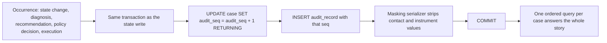
```mermaid
flowchart LR
    A["Occurrence: state change, diagnosis,<br/>recommendation, policy decision, execution"] --> B["Same transaction as the state write"]
    B --> C["UPDATE case SET audit_seq = audit_seq + 1 RETURNING"]
    C --> D["INSERT audit_record with that seq"]
    D --> E["Masking serializer strips contact and instrument values"]
    E --> F["COMMIT"]
    F --> G["One ordered query per case answers the whole story"]
```

The test of whether the design works: a single ordered query over one case's audit rows should answer
what happened, why, on what evidence, which alternatives were considered with their net values, which
policy checks allowed or blocked, which action executed, whether payment recovered, and how the
recovery is classified. A merchant explaining a decision should never need a second query.

The design explicitly rejected a hash chain over records. It would detect tampering by someone with
direct database access — who can also rewrite the chain. It would have looked rigorous and defended
against nothing. The real answer, if tamper-evidence against a privileged insider ever matters, is
shipping records to append-only external storage.

**What can go wrong.** Audit table growth, bounded by retention. Per-case write serialization, which is
fine at single-digit records per case.

**How you would know.** A gap in a case's sequence numbers means the allocation mechanism was bypassed.
Cases blocked from further external action means an audit write failed and the block is holding, which
is correct behaviour.

### 3.15 The synthetic data generator

**What it does.** Creates a world where the true lift is known, so Revora's *measurement* can be
checked against it.

**Why it exists.** Without production traffic there is no other evidence available. And more
importantly: it is the difference between "Revora reported a lift" and "Revora reported a lift of X
where the true lift was Y."

**How it works.** Seeded, so a run row reproduces the identical dataset. Per case: draw a risk cause,
draw an amount, draw method and error source conditioned on the cause (a card-expiry failure cannot
come from a UPI method), then emit a Razorpay-shaped `payment.failed` payload using **only verified
field names and verified error reason values**. That last part matters — the generator exercises the
real signature, canonicalization and mapping code, not a bypass around it.

The ground truth is hidden from Revora. A natural recovery probability per segment, and a true uplift
per action. Then the counterfactual pair: draw one uniform number **per case** and record both whether
it recovers untreated and whether it recovers under each action. Using the same draw for both arms is
what makes the true individual effect well defined and the true average lift exactly the difference in
means.

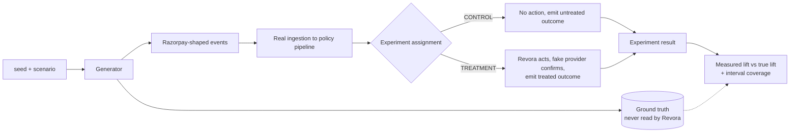
```mermaid
flowchart LR
    SEED["seed + scenario"] --> GEN["Generator"]
    GEN --> GT[("Ground truth<br/>never read by Revora")]
    GEN --> EV["Razorpay-shaped events"]
    EV --> ING["Real ingestion to policy pipeline"]
    ING --> ASN{"Experiment assignment"}
    ASN -->|CONTROL| CTL["No action, emit untreated outcome"]
    ASN -->|TREATMENT| TRT["Revora acts, fake provider confirms,<br/>emit treated outcome"]
    CTL --> RES["Experiment result"]
    TRT --> RES
    RES --> CMP["Measured lift vs true lift<br/>+ interval coverage"]
    GT -.-> CMP
```

Four scenarios are mandatory, and they exist to stop the generator flattering the optimizer:

1. **A null scenario with true uplift zero for every action.** Revora must report an interval
   containing zero. If it reports a lift here, the measurement is broken and the demo is invalid. This
   runs in CI.
2. **A negative scenario** where an action reduces recovery. The optimizer must pick `DO_NOTHING`.
3. **A high-baseline scenario** where natural recovery is at or above 0.8 and intervention has small
   positive uplift but real cost. Correct behaviour is `DO_NOTHING` with reason
   `HIGH_BASELINE_NO_INTERVENTION`.
4. **An interval coverage check across roughly 200 seeds.** The reported 95% interval should contain
   the true lift close to 95% of the time. Materially lower coverage means the interval is wrong, and
   every causal claim built on it is too.

**What synthetic evidence establishes and does not.** It establishes that Revora's measurement recovers
a known effect and correctly refuses an absent one. It establishes nothing whatsoever about real
recovery rates, because the ground truth is something we wrote. Any claim of the form "Revora recovers
X% more revenue" derived from synthetic data would be circular. The demo narrative is "here is a system
whose measurement you can trust."

**How you would know it is broken.** The null scenario reporting a lift. That is a build-failing
condition, not a curiosity.

### 3.16 The job queue and the sweepers

**What it does.** Moves work off the request path with durability equal to the state it advances, and
runs the periodic safety nets.

**Why it exists.** The webhook handler has a five-second budget. Everything interesting happens after
it responds. And the timing rules — window expiry, cooldown, outcome wait — have to be applied even if
every job that was supposed to apply them was lost.

**How it works.** A `job` table. Workers claim rows with
`SELECT ... WHERE run_after <= now() AND state = 'PENDING' ORDER BY run_after FOR UPDATE SKIP LOCKED
LIMIT n`, execute, then mark done or reschedule with backoff. `SKIP LOCKED` is what lets several
workers claim different rows concurrently without blocking each other.

The decisive reason this is a table and not a broker: **a job must be enqueued in the same transaction
as the state change it follows.** With an external queue, enqueueing before commit can run a job
against uncommitted state, and enqueueing after commit can lose the job. Neither is possible when the
job row and the state row commit together.

Seven periodic sweeps. The second spec added the review sweep and the customer-data retention sweep.

| Sweep | What it catches | Interval bound |
| --- | --- | --- |
| Lifecycle evaluation | Windows that elapsed, cooldowns that elapsed, outcome waits that timed out | Configured |
| Execution reconciliation | Intents stuck in `ATTEMPTED` or `UNCERTAIN` | Configured |
| Payment-state reconciliation | Cases held on conflicting payment signals | Configured |
| Detection-gap backfill | Failed payments with no stored event, because the webhook was disabled or events were lost | **None.** The dev ticker uses a 300 s fallback |
| Calibration report triggers | Enough resolved control cases, or enough elapsed time | **None.** 300 s fallback. And the handler is a registered **no-op** that logs at debug and completes so the job does not dead-letter |
| Review sweep | Cases at `POLICY_CHECK` whose `next_review_at` has passed and are not at the decision-cycle cap | `REVIEW_SWEEP_INTERVAL` is **seeded but read only by `scripts/dev_tick.py` and tests** — no module under `revora/` reads it, so the sweeper's schedule is not yet driven from its own bound. `WAIT_REVIEW_INTERVAL`, by contrast, is read by the pipeline |
| Customer-data retention | Customer signals and tokens past their retention deadline | **None.** 300 s fallback, and the sweep's own docstring cites a 24-hour deadline that no configured interval expresses |

**And the thing that matters more than any row in that table: nothing in production produces sweep
jobs.** The worker's claim, dispatch and complete path for sweep jobs is correct and complete — only the
producer is missing. `enqueue_sweep` has exactly one caller in the repository, `scripts/dev_tick.py`.
That is 6.12, and it is the largest gap in the current build.

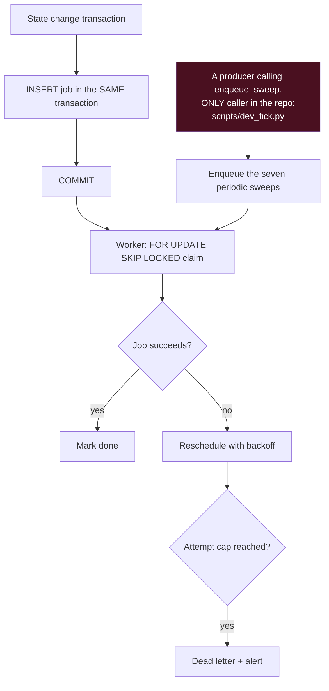
```mermaid
flowchart TD
    A["State change transaction"] --> B["INSERT job in the SAME transaction"]
    B --> C["COMMIT"]
    C --> D["Worker: FOR UPDATE SKIP LOCKED claim"]
    D --> E{"Job succeeds?"}
    E -->|yes| F["Mark done"]
    E -->|no| G["Reschedule with backoff"]
    G --> H{"Attempt cap reached?"}
    H -->|yes| I["Dead letter + alert"]
    J["A producer calling enqueue_sweep.<br/>ONLY caller in the repo:<br/>scripts/dev_tick.py"] --> K["Enqueue the seven periodic sweeps"]
    K --> D
    style J fill:#4a1020,color:#fff
```

Correctness never depends on a job succeeding. Every timing rule is also enforced by a sweeper reading
persisted timestamps. A lost job delays a decision; it does not break a bound.

**The detection-gap backfill deserves special mention.** Razorpay disables a webhook after 24 hours of
sustained delivery failure. That is silent, total detection loss — precisely the failure mode Revora
exists to prevent. The backfill lists provider payments over a lookback window and ingests any failed
payment with no stored event, through the *same* canonicalization and detection path, using a synthetic
event id of `backfill:<payment_id>:<status>` so the dedup index still guarantees one case per payment.
This is an addition to the requirements, which the design flags as the item most likely to be cut under
time pressure and says should not be.

**What can go wrong.** A poison job retrying forever — capped, then dead-lettered with an alert. A long
transaction holding locks — bounded by a per-job statement timeout. The sweeper becoming a full scan as
open case volume grows. See section 6.

**How you would know.** A growing pending-job count. A growing count of stale `ATTEMPTED` intents. A
detection gap showing up as no new cases at all.

### 3.17 The four-term cost decomposition

**What it does.** Replaces the single blended `action_cost` with four named cost terms that keep their
identity from the estimator through the arithmetic, the ranking, the database, the API response and
the dashboard cell: `financial_cost`, `communication_cost`, `risk_cost`, `customer_cost`. Same four
names at every layer.

**Why it exists.** A blended cost can answer "was this too expensive." It cannot answer "too expensive
because of what," and that second question is the one an operator actually has. An exclusion recorded
as `COST_RATIO_EXCEEDED` against a single figure tells you nothing about whether the provider's fee,
the message, the risk allowance or the intrusion allowance was what pushed it over. It also hides an
asymmetry that matters: one of the four is a real invoice line and three are modelling choices (see
6.11), and blending them makes the invoice line exactly as unfalsifiable as the guesses.

**How it works.** Four terms, with meanings that do not overlap:

| Term | What it is | Zero when |
| --- | --- | --- |
| `financial_cost` | The provider fee attributable to the action | The action creates no billable provider object |
| `communication_cost` | Per-message delivery cost | The customer never perceives the action — a null action, or a re-notify against an existing link |
| `risk_cost` | Expected cost of the action going wrong | Judged to be nil. It is an allowance, not an invoice |
| `customer_cost` | The intrusion on the customer | The customer is not contacted |

The sum has two names on purpose. Its **code name is `total_cost`; its presented and DTO name is
`total_action_cost`.** Renaming the property to match the DTO would ripple into the serializer, the
JSX and the ranking key for zero arithmetic gain, and `metrics.engine.CohortMetrics` already named its
property `total_action_cost` before the split existed. Two names for one number is a smell; renaming
four call sites to remove a smell that costs nothing is worse.

The arithmetic lives in `revora/optimizer/arithmetic.py::evaluate_candidate` and is three steps:

```
1. incremental_probability      = increment(intervention_probability, baseline)   # signed, sign kept
2. expected_incremental_revenue = multiply_probability(amount, incremental.value) # the ONLY rounding
3. net_recovery_value           = expected
                                  - financial_cost - communication_cost
                                  - risk_cost - customer_cost
```

Step 2 is the only rounding site in the entire chain, half-up, applied exactly once. Step 3 is one
expression rather than a running total, and that is deliberate: a running total would materialise an
intermediate that re-creates the old blended figure, and an intermediate that exists is an
intermediate something will eventually be tempted to store or display.

Ranking is `revora/optimizer/selection.py::_ranking_key`, lower is better, every component an integer:

```
(-net_recovery_value, total_cost, ACTION_PRECEDENCE.index(action))
```

Net value descending, total cost ascending as the first tie-break, declared precedence as the final
one. Probability magnitude appears nowhere in the key.

**Why the split changed no decision, and why that is a consequence rather than a promise.** The split
is only ever consumed through a sum. Integer addition is associative, so for any pre-existing case
where `financial_cost + communication_cost` equals the old `action_cost`, every downstream figure —
net value, the exclusion verdicts, the ranking, the aggregates — is bit-identical. That is Property 67,
and the honest framing is that it falls out of the shape of the arithmetic rather than being something
the code promises to preserve. The property test for it is differential: it evaluates the same
candidate under a family of splits summing to the same total, and its oracle — the split `(total, 0)`
— is a member of the generated family, so the oracle cannot drift away from the thing it checks.

Mutation testing caught a real hole in the first version of that test. A mutant that made `_ranking_key`
sort on `financial_cost` alone survived, because cost enters the key only as a tie-break behind net
value, and randomly generated candidates almost never tie on net value. The fix was a generator that
produces deliberately tied candidates. Worth remembering as a shape: a property that only exercises
the first element of a sort key proves nothing about the rest of it.

`EstimationMethod` gained a fifth member, `COST_SPLIT_NOT_MEASURED`, and it is the **weakest** claim
the enum can make — weaker even than `UNCALIBRATED`, which is at least a guess somebody made
deliberately. Weakest first, the order is `COST_SPLIT_NOT_MEASURED`, `UNCALIBRATED`, `PRIOR_FALLBACK`,
`DETERMINISTIC`, `DEFINITIONAL`. **No estimator produces it.** It exists for one purpose: to label the
rows that migration 0008 rewrote.

**The data migration, and the number it deliberately did not invent.** For every pre-existing row in
`candidate_estimate` and `recommendation_candidate`, migration 0008 moved the whole blended
`action_cost` into `financial_cost`, set `communication_cost` to 0, and set both method columns to
`COST_SPLIT_NOT_MEASURED`. Nothing inferred a split from the action type. Putting
`MESSAGE_COMMUNICATION_COST` into the communication term of every historical `CUSTOMER_MESSAGE` row
would have looked more thorough and been strictly worse — it would place an unsupported number in the
exact column whose only job is to say which cost caused an exclusion.

Ordering inside that migration is load-bearing. The `UPDATE` sits between the `ADD COLUMN`s and the
`DROP COLUMN`, because the new money columns arrive with `DEFAULT 0`. The wrong order would not fail;
it would silently zero every historical cost figure and leave a schema that looked correct.

**Presentation.** `revora/api/views.py::_candidate_document` emits all four terms **and**
`total_action_cost`, each pre-formatted, with the total summed **server-side**. A browser-derived total
would be free to disagree with the `net_recovery_value` printed beside it, and two numbers on one row
that do not reconcile is worse than either of them being wrong. It also emits `financial_cost_method`,
`communication_cost_method`, and a server-derived boolean `cost_split_not_measured`.

`web/src/routes/CaseDetail.jsx` renders five cost cells. The `COST_SPLIT_NOT_MEASURED` label is
rendered in **both** cost cells rather than once per row, because a reader scanning the communication
column across rows has to be able to tell a measured zero from a migration-written zero, and a single
row-level badge does not let them. `web/src/routes/Metrics.jsx` shows five tiles, the total hinted as
"shown alongside them, never instead of them." **The total is never shown instead of the parts.**

`PROMISE_FOLLOW_UP_FINANCIAL_COST` is zero, and it is the one figure in the cost prior table that is
**verified rather than assumed**: the endpoint `POST /v1/payment_links/:id/notify_by/:medium`
re-notifies against the existing link and creates no second link, so there is no second link fee to
charge. Every other figure in that table is still an `[ASSUMPTION]`.

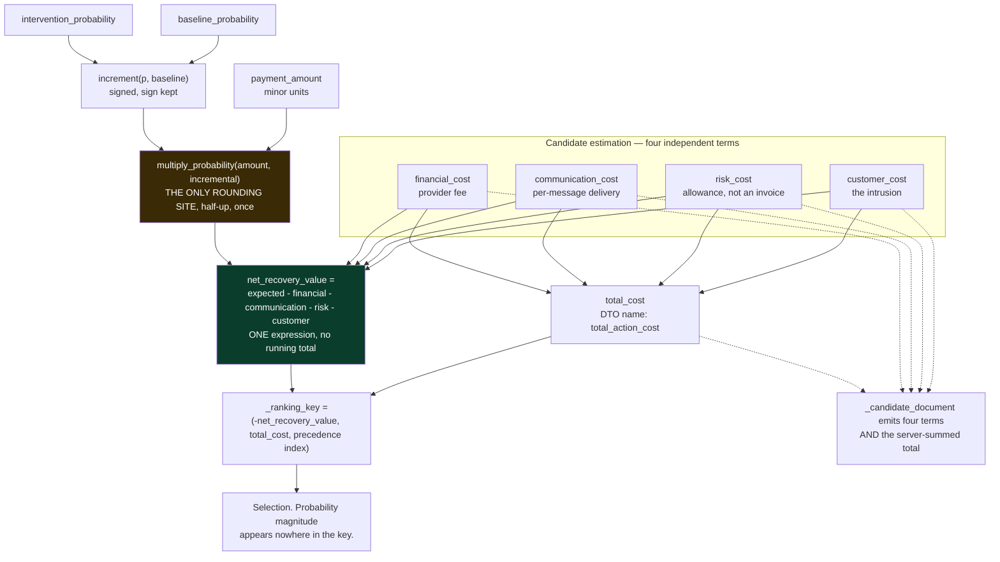
```mermaid
flowchart TD
    subgraph EST["Candidate estimation — four independent terms"]
        F["financial_cost<br/>provider fee"]
        C["communication_cost<br/>per-message delivery"]
        R["risk_cost<br/>allowance, not an invoice"]
        U["customer_cost<br/>the intrusion"]
    end
    P["intervention_probability"] --> I["increment(p, baseline)<br/>signed, sign kept"]
    B["baseline_probability"] --> I
    I --> X["multiply_probability(amount, incremental)<br/>THE ONLY ROUNDING SITE, half-up, once"]
    AMT["payment_amount<br/>minor units"] --> X
    X --> NET["net_recovery_value =<br/>expected - financial - communication - risk - customer<br/>ONE expression, no running total"]
    F --> NET
    C --> NET
    R --> NET
    U --> NET
    F --> TOT["total_cost<br/>DTO name: total_action_cost"]
    C --> TOT
    R --> TOT
    U --> TOT
    NET --> KEY["_ranking_key =<br/>(-net_recovery_value, total_cost, precedence index)"]
    TOT --> KEY
    KEY --> SEL["Selection. Probability magnitude<br/>appears nowhere in the key."]
    TOT -.-> VIEW["_candidate_document emits four terms<br/>AND the server-summed total"]
    F -.-> VIEW
    C -.-> VIEW
    R -.-> VIEW
    U -.-> VIEW

    style NET fill:#0b3d2c,color:#fff
    style X fill:#3a2a05,color:#fff
```

**What can go wrong.** Someone adds a fifth cost term and subtracts it in step 3 without adding it to
`total_cost`, at which point net value and total cost describe different worlds and the tie-break
starts lying. Someone computes the total in the browser. Someone writes a plausible split into a
historical row and destroys the only signal that says the split was never measured. And the standing
one: three of the four terms are still invented, so the arithmetic remains exactly as sound and
exactly as ungrounded as it was before the split — see 6.11 and section 8.

**How you would know.** A `total_action_cost` that does not equal the sum of the four cells beside it.
A `COST_SPLIT_NOT_MEASURED` label on a row created after the migration ran, which would mean an
estimator started producing the enum member no estimator is supposed to produce. A communication cost
of zero on a `CUSTOMER_MESSAGE` row with no accompanying label.

### 3.18 The review loop — how a case that chose restraint gets a second decision

**What it does.** Adds one edge, `POLICY_CHECK → DECISION_PENDING`, and the machinery that walks a
case back over it: a scheduled instant, three triggers, one dedupe key, and a handler that re-runs the
decision path without re-implementing any of it.

**Why it exists.** This is the clearest defect the second spec fixed, and it is worth stating in full
because the shape of the fix follows directly from it. Before the review edge, a case that correctly
selected `DO_NOTHING` or `WAIT` sat at `POLICY_CHECK` until its window closed — non-terminal, and
unreachable by any second decision cycle. The only re-entry edge into `DECISION_PENDING` came from
`WAITING_FOR_OUTCOME`, which is reachable only after a confirmed intervention. **So Revora re-decided
exactly the cases it had already acted on, and never the ones where waiting had been the right
answer.** A system whose whole argument is that restraint is often correct had no way to revisit
restraint.

**How it works.**

The edge carries its own `TransitionKind.REVIEW` and exactly one effect: `decision_cycle_delta=1`.
`executed_action_delta`, `customer_message_delta_if_visible` and `sets_last_outbound_at` all stay at
their defaults. So a review moves no outbound counter and does not reset the cooldown clock — looking
at a case again is not contacting anyone. It is a distinct kind rather than a second `REENTRY` member
because the two edges answer different questions, and one kind covering both would make "how often
does restraint get revisited" unanswerable from the record.

`next_review_at` on `recovery_case` is the scheduled instant, and its whole correctness story is that
it has exactly one writer and exactly one clearer.

*Written* by the `_schedule_review` closure inside `handle_policy`, and only when
`chose_restraint = outcome.authorized and outcome.selected_action in NULL_ACTIONS` — that is,
`DO_NOTHING` or `WAIT`.

*Cleared* by `apply_locked_transition`, with `if current is CaseState.POLICY_CHECK:
case.next_review_at = None`. **The condition is on the source state, not on a list of edges.** That
covers the forward edge, all five termination edges, the review edge itself, and any edge out of
`POLICY_CHECK` somebody adds next year, without anyone having to remember to come back here. A
hand-maintained list of edges is a list a future edge escapes, and the escape is silent: a stale
instant is invisible to the sweeper's index predicate right up until the case returns to
`POLICY_CHECK` and gets reviewed on an instant computed for a decision cycle that has already passed.
Backstopped in the schema by `CHECK (next_review_at IS NULL OR next_review_at <= window_end_at)`.

**A refused case gets no review instant.** `BLOCKED`, `DEFERRED` and `ESCALATE` all rest at
`POLICY_CHECK` too, and none of them gets an instant. A case that was refused is not a case that chose
restraint, and giving it one would put the sweeper in charge of retrying decisions the policy engine
had already declined.

Three triggers, modelled as `ReviewTrigger`:

| Trigger | Fired when | Fired where |
| --- | --- | --- |
| `SCHEDULED_REVIEW` | The sweep finds a case whose `next_review_at` has passed | The review sweep query |
| `EVENT_ATTACHED` | A fresh failure event attaches to an existing open case | Inside the same transaction as the attach and its audit record |
| `CUSTOMER_SIGNAL` | A customer write is accepted on the public surface | Inside the same transaction as the signal |

All three go through one function, `enqueue_case_review`, which is what makes idempotency a single
fact rather than three: one dedupe key, `case_review:{case_id}`, against the existing partial unique
index `one_pending_job_per_dedupe_key` over pending jobs. A second enqueue while one is still pending
returns `None`. The rejected alternative was a `review_enqueued_at` column, and it was rejected because
it is a second copy of queue state whose drift is harmful in **both** directions: set with no job
means the case stops being reviewed until its window closes, and cleared with a job pending means a
duplicated decision cycle.

`handle_review` reuses the forward path's own four steps — `run_diagnosis`,
`run_baseline_estimation`, `run_candidate_estimation`, `run_optimizer` — and contributes no arithmetic
of its own. A second implementation of "what does this case cost and what is it worth" would be a
second answer, and the entire claim of the feature is that a reviewed case is decided on exactly the
terms a new case is.

Policy is **not** run inline. It is enqueued as a separate job whose payload carries a case id and a
correlation id and **no trigger**, so there is structurally nothing for the policy path to branch on.
A reviewed case and a freshly diagnosed case arrive at policy indistinguishable.

**Cycle numbering, which is subtle and worth reading twice.** All four steps read
`decision_cycle_count` off the row and file their rows under `n`. The transition into
`DECISION_PENDING` then makes it `n+1`. Running any of the four steps *after* the transition would
file the recommendation under `n+1` while every lookup searches `n` — and that failure is silent. It
would present as a pipeline stalled in `DECISION_PENDING` with no policy decision and a training
observation carrying a null cause.

The cap is `at_cap = decision_cycle_count >= MAX_RECOVERY_ATTEMPTS` (default 3), checked under the row
lock, transitioning to `STOPPED` with `DECISION_CYCLE_LIMIT_REACHED`. It is checked in the sweep query
**and** again here, for two different reasons: the query check avoids queueing jobs that cannot do
anything, and this one is the bound itself, because the sweep's read releases before the handler acts.

**The cap branch is reachable in practice only via `EVENT_ATTACHED` and `CUSTOMER_SIGNAL`.** Both of
those guard on case state alone and neither inspects the counter, while the sweep query and its
per-case re-check both exclude capped cases. From the sweep, the branch is reachable only in a race.
This was found by instrumenting the state machine for vacuity — the review properties were asserting
nothing at all, 0 reviews across 21 examples — and fixed by making the machine's `start` drain the
queue and treating `sweep_review` as a whole worker tick rather than a single call. Machine cost went
from 38s to 110s, which is the price of the properties meaning something.

**One more thing that is true and easy to miss.** `WAITING_FOR_OUTCOME → DECISION_PENDING` is legal in
the transition table and **has no caller anywhere in the codebase.** Only two production sites target
`DECISION_PENDING`: `handle_optimizer`, from `DIAGNOSED`, and `handle_review`, from `POLICY_CHECK`. The
outcome monitor never mentions it. So the review edge is the only working re-entry path in the system,
and the true decision-cycle bound is exactly `MAX_RECOVERY_ATTEMPTS`. The transition table's own
termination proof is out of date on this point — see section 8.

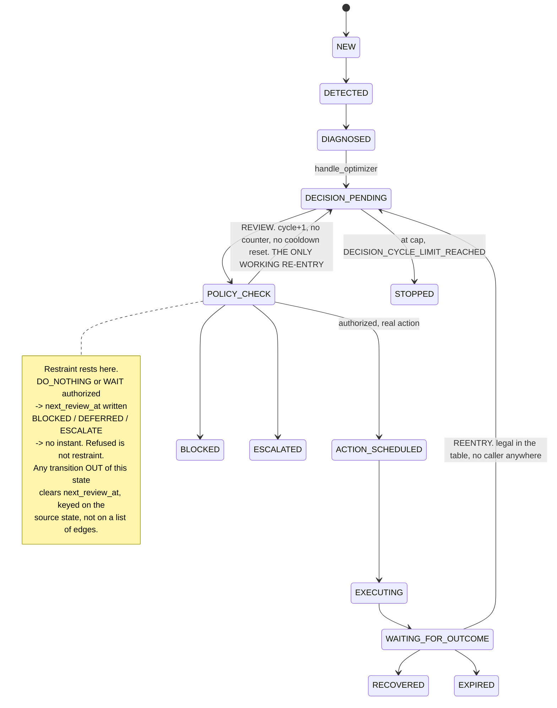
```mermaid
stateDiagram-v2
    [*] --> NEW
    NEW --> DETECTED
    DETECTED --> DIAGNOSED
    DIAGNOSED --> DECISION_PENDING : handle_optimizer
    DECISION_PENDING --> POLICY_CHECK
    POLICY_CHECK --> ACTION_SCHEDULED : authorized, real action
    ACTION_SCHEDULED --> EXECUTING
    EXECUTING --> WAITING_FOR_OUTCOME
    WAITING_FOR_OUTCOME --> RECOVERED

    POLICY_CHECK --> DECISION_PENDING : REVIEW. cycle+1, no counter, no cooldown reset. THE ONLY WORKING RE-ENTRY
    WAITING_FOR_OUTCOME --> DECISION_PENDING : REENTRY. legal in the table, no caller anywhere

    DECISION_PENDING --> STOPPED : at cap, DECISION_CYCLE_LIMIT_REACHED
    POLICY_CHECK --> BLOCKED
    POLICY_CHECK --> ESCALATED
    WAITING_FOR_OUTCOME --> EXPIRED

    note right of POLICY_CHECK
        Restraint rests here.
        DO_NOTHING or WAIT authorized
          -> next_review_at written
        BLOCKED / DEFERRED / ESCALATE
          -> no instant. Refused is not restraint.
        Any transition OUT of this state
          clears next_review_at, keyed on the
          source state, not on a list of edges.
    end note
```

The three triggers, and the single dedupe key they all pass through:

```mermaid
flowchart TD
    T1["SCHEDULED_REVIEW<br/>sweep: next_review_at passed,<br/>not at cap, state = POLICY_CHECK"] --> EQ
    T2["EVENT_ATTACHED<br/>fresh failure event attaches to an open case<br/>same transaction as the attach + audit"] --> EQ
    T3["CUSTOMER_SIGNAL<br/>accepted customer write<br/>same transaction as the signal"] --> EQ
    EQ["enqueue_case_review()<br/>dedupe key = case_review:{case_id}"] --> IDX{"partial unique index<br/>one_pending_job_per_dedupe_key<br/>over PENDING jobs"}
    IDX -->|"a job is already pending"| NOP["return None. No second job."]
    IDX -->|"no pending job"| JOB["one case_review job"]
    JOB --> H["handle_review, under the row lock"]
    H --> CAP{"decision_cycle_count >= MAX_RECOVERY_ATTEMPTS?"}
    CAP -->|yes| ST["STOPPED, DECISION_CYCLE_LIMIT_REACHED<br/>reachable in practice only from T2 and T3"]
    CAP -->|no| FOUR["run_diagnosis, run_baseline_estimation,<br/>run_candidate_estimation, run_optimizer<br/>ALL file under cycle n"]
    FOUR --> TR["transition POLICY_CHECK -> DECISION_PENDING<br/>cycle becomes n+1, next_review_at cleared"]
    TR --> POL["enqueue policy job<br/>payload: case id + correlation id, NO trigger"]
    POL --> OUT{"policy verdict"}
    OUT -->|"real action authorized"| ACT["ACTION_SCHEDULED"]
    OUT -->|"restraint again"| AGAIN["rests at POLICY_CHECK<br/>with a fresh next_review_at"]
    OUT -->|"refused"| REF["BLOCKED / DEFERRED / ESCALATE<br/>no instant"]

    style EQ fill:#0b3d2c,color:#fff
    style FOUR fill:#3a2a05,color:#fff
```

**What can go wrong.** Nothing ticks the review sweep in a deployed system — `enqueue_sweep` has one
caller in the whole repository and it is `scripts/dev_tick.py`. That is not a subtlety about this
feature, it is the largest gap in the current build, and it is 6.12. Beyond that: someone adds an edge
out of `POLICY_CHECK` and clears the instant by hand instead of relying on the source-state condition;
someone runs one of the four steps after the transition and files a recommendation under a cycle
nobody searches; someone reaches for a `review_enqueued_at` column to make the queue state easier to
read.

**How you would know.** A case at `POLICY_CHECK` carrying a `next_review_at` in the past, with no
pending `case_review` job — that is either the sweep not running or the enqueue silently deduping
against a job that is no longer pending. A case in `DECISION_PENDING` with no policy decision and a
recommendation filed under a cycle number one higher than the case's. A `REVIEW` transition that moved
`customer_message_count`, which would mean the edge's effects were edited. And, from the other
direction: `decision_cycle_count` stuck at 1 across a population of `DO_NOTHING` cases means the loop
is not running at all.

### 3.19 The Customer_Access_Token

**What it does.** Grants one customer, for one case, bounded read access to a small projection of that
case and the right to submit a bounded number of writes about it. It is the second credential in a
system that otherwise has one.

**Why it exists.** The customer page has to be reachable from an SMS by somebody with no account, no
password and no session. There is no third option between "unauthenticated and public" and "a
credential the message can carry," and a credential in a URL is a credential that will end up in logs,
screenshots and referrer headers. So every property of this token's shape is a response to that.

**How it works.** The wire form is `rvc_<token_id>.<secret>`. `token_id` is 26 unpadded lowercase
base32 characters over 16 random bytes. `secret` is 22 unpadded base64url characters over 16 random
bytes. **128 bits in each half, drawn independently.** Four properties of that shape are load-bearing:

*`token_id` is separately random, not derived from the secret.* It is the lookup handle and the only
form permitted in a log line or an audit field, which makes it the form that gets copied around.
Deriving it from the secret would turn every legitimate write of the handle into a partial disclosure
of the secret.

*What is stored is `HMAC-SHA256(signing_key, token_id ‖ secret)` — keyed, not a bare digest.* A
database dump alone therefore does not permit offline verification. An unkeyed digest of a 128-bit
secret is not brute-forceable, but it *is* verifiable against a guess, and a keyed one is not. Backed
by `CHECK octet_length(secret_hash) = 32`, which is the thing that stops a hex or base64 copy sitting
in the column looking perfectly plausible. The concatenation needs no separator only because `token_id`
is fixed-width 26.

*Verification does one indexed lookup, then compares against every active signing secret, accumulating
with `|=`, and never breaks early.* A missing row substitutes a per-process random decoy hash and does
the same work anyway. A malformed presentation substitutes a decoy handle of the right shape rather
than returning early. So "no such handle," "wrong secret," "signed by a retired key" and "malformed"
fold into one branch with an identical status and an identical body — indistinguishable by timing as
well as by response.

*Expiry is `min(issued_at + CUSTOMER_TOKEN_LIFETIME, window_end_at)`, and it is never extended.* A live
unexpired token is reused with its expiry untouched. The case's window is a hard ceiling, so a token
cannot outlive the thing it grants access to.

**When it is minted, and why that position matters.** Inside `execute_approved_action`'s first
transaction, last — after every cheaper refusal. Lock contention, an absent or stale approval, a policy
abandonment, an existing intent, a failed transition, an unreachable contact and an invalid request all
return above the mint, so none of them costs a token. It is guarded by `is_customer_visible(action)`,
because a token accompanying an action the customer never perceives would be a credential nobody was
sent.

Sharing that transaction is the whole failure story. A failed mint rolls back the intent, the counter
movement and the consumed decision together, so there is no compensating action to write and no
half-executed state to reason about. Failure returns `TOKEN_ISSUE_FAILED`, and the engine records
`CUSTOMER_TOKEN_ISSUE_FAILED`.

**The uniqueness index and the supersession it forces.** `one_live_token_per_case` is a **partial**
unique index over `revoked_at IS NULL`. Expiry cannot be in the predicate, because expiry needs
`now()` and an index predicate cannot. So an expired-but-unrevoked predecessor is still in the index,
and an insert beside it fails. That is why minting a replacement revokes the predecessor with
`EXPIRED_SUPERSEDED` **first, in the same transaction** — and doing both there makes the supersession a
written fact rather than something a reader has to infer by comparing two timestamps.

Four revocation reasons exist: `CASE_TERMINAL`, `CONTACT_SUPPRESSED`, `EXPIRED_SUPERSEDED`,
`KEY_RETIRED`. **Only two have production writers.** `EXPIRED_SUPERSEDED` is written in the mint.
`CASE_TERMINAL` is written in `apply_locked_transition`, keyed on the *target* state being terminal,
sited at the one writer of `recovery_case.state` so a terminal edge added later cannot escape it.
`CONTACT_SUPPRESSED` appears only in a test — it waits on `contact_suppression` having a writer at all
(7, "Built but not yet wired"). `KEY_RETIRED` is written nowhere.

**A token signed by a retired key returns 404 with a completely empty body, not 410.** That is
deliberately stronger than the requirement's 410. Distinguishing "signed by a retired key" from "not a
real token" tells an attacker their guess had the right shape, which is the one thing this credential's
error handling exists to withhold. The rejection category `CUSTOMER_TOKEN_KEY_RETIRED` is still
recorded internally, so "how many customers did that rotation lock out" stays answerable from the
inside without being answerable from the outside.

**A missing or malformed signing secret mints nothing and verifies nothing:** a
`CREDENTIAL_UNAVAILABLE` record and a 503. Not a rejection — a rejection would be indistinguishable
from a forgery, and a broken deployment would look like an attack. And not an exception becoming a 500.
The signing secrets are resolved on **every** call and never cached, because a cache would mean a
retired key kept verifying until the process restarted, and "the rotation took effect" is the one
property this credential's rotation has to have.

The credential itself is `REVORA_CUSTOMER_TOKEN_SIGNING_SECRETS`, formatted `1:<base64>,2:<base64>`,
at least 32 bytes decoded per entry. Minting uses the highest version; verification tries all of them.
**Any test or run that drives `execute_approved_action` needs this set, or it gets `TOKEN_ISSUE_FAILED`
with `CREDENTIAL_UNAVAILABLE`.** That is the single most common local-setup failure in this feature.

```mermaid
flowchart TD
    subgraph MINT["Mint — last step of execute_approved_action's FIRST transaction"]
        M0["every cheaper refusal has already returned:<br/>lock contention, stale approval, policy abandonment,<br/>existing intent, failed transition, unreachable contact"]
        M0 --> M1{"is_customer_visible(action)?"}
        M1 -->|no| M2["no token. A credential nobody was sent<br/>is not a credential."]
        M1 -->|yes| M3{"live unexpired token for this case?"}
        M3 -->|yes| M4["reuse it. Expiry UNTOUCHED."]
        M3 -->|"expired or absent"| M5["revoke predecessor EXPIRED_SUPERSEDED<br/>SAME transaction — the partial index over<br/>revoked_at IS NULL cannot see expiry"]
        M5 --> M6["16 random bytes -> token_id (base32, 26)<br/>16 random bytes -> secret (base64url, 22)<br/>independent draws, 128 bits each"]
        M6 --> M7["store HMAC-SHA256(key, token_id || secret)<br/>CHECK octet_length = 32"]
        M7 --> M8["expires_at = min(issued_at + LIFETIME, window_end_at)"]
    end
    M8 --> WIRE["wire form: rvc_&lt;token_id&gt;.&lt;secret&gt;<br/>travels in the page URL, then in<br/>Authorization: Bearer"]
    M4 --> WIRE

    WIRE --> V0["Verify: ONE indexed lookup by token_id"]
    V0 --> V1["compare against EVERY active signing secret<br/>accumulate with |=, NEVER break early"]
    V1 --> FOLD{"outcome"}
    FOLD -->|"no such handle<br/>(random decoy hash, same work done)"| R404
    FOLD -->|"wrong secret"| R404
    FOLD -->|"signed by a RETIRED key<br/>(CUSTOMER_TOKEN_KEY_RETIRED recorded)"| R404
    FOLD -->|"malformed presentation<br/>(decoy handle of the right shape)"| R404
    FOLD -->|"expired OR revoked"| R410["410 {expired: true}<br/>the router does not distinguish the two"]
    FOLD -->|"signing secret unreadable"| R503["503 empty + CREDENTIAL_UNAVAILABLE<br/>not a rejection: a rejection would look<br/>identical to a forgery"]
    FOLD -->|valid| OK["VerifiedToken. merchant_id read off the ROW."]

    R404["404, COMPLETELY EMPTY BODY<br/>all four conditions, one status, one body,<br/>indistinguishable by timing too"]

    OK --> REV{"Revocation, later"}
    REV -->|"target state is terminal"| RV1["CASE_TERMINAL — written in apply_locked_transition,<br/>the ONE writer of case state"]
    REV -->|"replacement minted"| RV2["EXPIRED_SUPERSEDED — written in the mint"]
    REV -->|"contact suppressed"| RV3["CONTACT_SUPPRESSED — NO PRODUCTION WRITER"]
    REV -->|"key retired"| RV4["KEY_RETIRED — WRITTEN NOWHERE"]

    style R404 fill:#4a1020,color:#fff
    style RV3 fill:#3a2a05,color:#fff
    style RV4 fill:#3a2a05,color:#fff
```

**What can go wrong.** Somebody adds an early return to verification for the missing-row case, because
doing pointless HMAC work looks like a bug, and the timing distinction comes back. Somebody caches the
signing secrets to save a secret-store round trip, and rotation stops taking effect. Somebody extends
an expiry on reuse to be helpful, and the window ceiling stops being a ceiling. Somebody logs the wire
form instead of the handle. And the deployment case: rotating a key without the old version still
listed silently 404s every live token.

**How you would know.** `CUSTOMER_TOKEN_ISSUE_FAILED` in the log means execution is rolling back at
the last step, and almost always means the signing secret is unset or too short — see 6.13. A burst of
404s with empty bodies on `/customer` is either a probe or a rotation that dropped a version, and
`CUSTOMER_TOKEN_KEY_RETIRED` counts are what separate the two. Two live tokens for one case would mean
the partial index is gone.

### 3.20 The public customer surface

**What it does.** Serves one page's worth of data about one case to the customer whose payment failed,
and accepts three shapes of reply from them. It is the only endpoint in Revora reachable without a
session.

**Why it exists.** The system's most valuable missing input is the customer's own reason. A provider
error code says the card was declined; it cannot say "I get paid on the 3rd." Everything else in the
decision path is inference from provider fields, and this is the one place a fact can come in from the
person who actually knows it.

**How it works — and every control here is compensation for the absent session.**

It is **mounted, not included**: `app.mount(CUSTOMER_MOUNT, build_customer_app(...))` — `CUSTOMER_MOUNT`
being `"/customer"` — with `openapi_url=None`. A mounted `FastAPI` rather than an `APIRouter`, because a router cannot carry
middleware of its own and putting the middleware on the parent app would relax the dashboard's posture
in order to serve the customer page. No OpenAPI document and no docs UI on the public surface.

Four routes, all authorized by an optional `Authorization: Bearer rvc_…` header:

| Route | Body | Purpose |
| --- | --- | --- |
| `GET /customer/{merchant_slug}/case` | — | The eight-field projection |
| `POST /customer/{merchant_slug}/delay-reason` | `{"delay_reason": <enum>, "note": <string?>}` | Why they have not paid |
| `POST /customer/{merchant_slug}/promise` | `{"promise_date": <ISO-8601>}` and nothing else | When they will |
| `POST /customer/{merchant_slug}/partial-arrangement` | `{"note": <string?>}` | A request to discuss terms |

**The path carries no case identifier at all.** The requirement says any case, payment or amount
identifier in the path, query, headers or body must be *discarded*. A path with none in it is a cheaper
way to satisfy that requirement, because there is no discard to forget.

**Tenant resolution is by path segment, and the slug is routing, not authority.** The persistence
package has no cross-merchant lookup — every read names its tenant, and there is deliberately no "find
this token anywhere" function — so the router has to name a tenant before it can verify anything. It
uses the same mechanism the other unauthenticated endpoint uses: `merchant_by_slug`, the one untenanted
read in the package, permitted because `merchant` is the one table with no `merchant_id` and no RLS
policy. It *is* the tenant.

The slug selects which tenant's token rows are searched, and it never becomes the `merchant_id` of any
read or write; `VerifiedToken.merchant_id` is read off the token row. **So a slug naming the wrong
merchant finds no token and takes the identical 404 path as a forgery: the path segment can only deny
access, never grant it.** The rejected alternative was a per-merchant frontend host with the tenant
read from `Origin`, and it fails twice: `Origin` is absent on every non-browser request, and it would
make the CORS list load-bearing for *authentication* rather than for browser policy. A misconfigured
origin list should cost a browser a fetch, not cost a customer their tenant.

**The projection has eight fields**: `merchant_display_name`, `amount`, `currency`, `reason`,
`pay_url`, `window_end_at`, `promise`, `signals_remaining`. The design prose says "nine" and then
enumerates eight — in its JSON sample and again in its bullet list — and the requirements enumerate the
same eight. The enumeration is the requirement and the count is a miscount. Inventing a ninth field to
satisfy the arithmetic would be a disclosure decision taken by counting, which is precisely how this
list must not grow.

The mechanism is not a filter over the dashboard model. It is a purpose-built frozen slotted
dataclass, so **adding a field to the dashboard cannot leak it here** — there is no field to filter out
because there is no inherited shape. `PROJECTION_FIELDS` is derived from the dataclass rather than
restated beside it, and `as_document` raises if the emitted key set diverges from it.

Three of the eight fields carry their own reasoning:

*`amount`* is an integer count of minor units, formatted **on the server**, by an *injected* renderer
rather than an imported one. The currency symbol table, the minor-unit digits and the
lakh-versus-thousands grouping live in `revora.api.rendering`, which sits above `revora.customer` in
the layering bands. Duplicating them would give the customer page its own idea of what a rupee looks
like, and this is the one screen where the server's figure and the customer's figure must agree.

*`reason`* is a plain-language sentence from a table total over `RiskCause`, **asserted total at
import**. A `.get` with a fallback would let a cause added tomorrow ship under a sentence nobody chose,
on the one surface where the wording is the entire product. It is never the provider's error string,
which is internal vocabulary written for an operator debugging a payment rail. Four rows deserve a
note. `FRAUD_OR_RISK_SIGNAL` deliberately does not say what it is, because telling a customer their
payment was flagged is either an accusation or a hint and both are wrong. `UNKNOWN` says the reason is
unclear rather than inventing one. `ABANDONMENT` states that nothing has been charged, because the
single most likely worry of somebody reading this page is that they have been charged twice. And a
distinct `NO_CAUSE_RECORDED` sentence exists for "we have not finished looking," which is a different
thing from `UNKNOWN`'s "we looked and could not tell" — a customer reading the first should stop
waiting for a better answer, and one reading the second should not.

*`pay_url`* is a bearer capability: whoever holds it can pay. Disclosing it adds no risk the system had
not already taken, because it is the same URL the customer already received in the message that
carried this page's link. It is the one field masked everywhere else in the system, and the asymmetry
is deliberate rather than an oversight.

**Three write shapes, not four. There is no hard-stop route** — a hard stop is a delay-reason
submission carrying `DISPUTES_THE_CHARGE` or `NO_LONGER_WANTS_THE_ORDER`.

**The schema is the rejection.** All three models set `extra="forbid"`, so a field outside the declared
shape is a 422 naming the field, with no hand-written check to keep in sync. The partial-arrangement
model declares no `amount`, no `instalment_count` and no `schedule` — so that requirement's rejection
is the schema's default behaviour. The same absence is repeated one layer down, where `customer_signal`
has no column for any of the three. There is nowhere to put a partial amount, so no path can accept one
by mistake.

**One transaction per accepted write**, preceded by `SET LOCAL statement_timeout` from
`AUDIT_WRITE_TIMEOUT`, in this fixed order:

1. Lock the token row.
2. Read the case **unlocked**, and refuse a terminal one with 409.
3. Refuse a case that is at its signal cap.
4. Increment the token's accepted-submission counter, with the comparison **inside the `UPDATE`'s
   `WHERE`**.
5. Insert the `customer_signal` row.
6. Enqueue a review if the case is at `POLICY_CHECK`.
7. Write the audit record **last**.

The audit write is last precisely so that the rollback it causes is a rollback of work already staged.
That makes "all four or none" checkable by injecting a failure into one statement, rather than by
reasoning about ordering. A missed audit deadline surfaces as a driver error, everything rolls back,
and the caller gets a 503 with nothing persisted.

The case is read **without** a lock, for two reasons. The write touches no case column. And locking the
case row would put a public, unauthenticated endpoint into lock contention with the pipeline's own
writer. A terminal transition racing that read is benign in both directions: it revokes the token, so
the next request is a 410, and the signal it raced is evidence rather than authority — nothing acts on
it without a fresh decision cycle.

**Two caps, both real, and they are not the same cap.** `CUSTOMER_TOKEN_MAX_SUBMISSIONS` bounds one
credential. `MAX_CUSTOMER_SIGNALS_PER_CASE` bounds one case. Both default to 5, and both have to exist,
because a case outlives a token — a terminal revocation followed by a further approved action mints a
second one. Both answer 429, and **reads keep being served either way**: a customer who has explained
themselves five times must not lose the page telling them what they owe.

**Rate limiting, and an honest account of its weakness.** Process-local, fixed-window, two key spaces
(`token:{token_id}` and `src:{source}`). The counter is per process, so N replicas admit N times the
rate, and the window resets rather than sliding, so a caller can be admitted at twice the rate across a
boundary. Both are accepted rather than designed around, because **the rate limit is not the bound that
matters.** The durable bound is `accepted_submission_count`, incremented under a row lock with the
comparison in the `WHERE` clause, which no number of replicas can exceed. The limiter guards the read
path, where the worst outcome of admitting twice the rate is that somebody refreshed a page too fast.

A shared limiter was considered and rejected. A Postgres counter table would add a write to every page
read in order to tighten a guard whose worst outcome is a few extra reads. Redis would be a new service
for that one purpose. **What would change the decision:** a bound on the read path becoming correctness
rather than politeness — a per-token cost, or a metered provider call sitting behind a read.

The per-token rate is applied **after** verification, on the verified handle, and the ordering is not
incidental. Applying it before verification would key on a handle parsed from an unverified
presentation, and every malformed presentation parses to the same decoy handle — so they would all
share one bucket, and a malformed token would start answering 429 where a well-formed unknown one
answered 404. That is a distinguishable outcome for exactly the distinction the design exists to hide.

**Transport guards run as raw ASGI, before the body is parsed**, for two reasons about what they can
see. The response headers must land on every response, including the 404 from path routing, the 405
from method routing and the 500 from an unhandled exception — which are precisely the responses a probe
collects, and a cache directive that is present on success and absent on failure stops applying at the
moment it starts to matter. And the content-type guard has to run before FastAPI binds the body
parameter, or the refusal arrives as a 422 about fields nobody tried to read instead of a 415 about the
thing that was actually wrong.

Headers on every response: `cache-control: no-store, private`, `referrer-policy: no-referrer`,
`x-content-type-options: nosniff`, `vary: Origin`, and a CSP starting `default-src 'none'` so that a
directive nobody thought of falls closed. `no-referrer` is the only value that makes "the token reaches
no destination other than the Revora API host" true rather than likely, because the token is in the
*path* of the page that fetched the response. `frame-ancestors 'none'` and `base-uri 'none'` are beyond
the named list and are there anyway: framing would allow a clickjacked pay button, and a `<base>` tag
would let injected markup redirect every relative URL on the page, including the one the customer is
about to pay through.

CORS is installed **only** on this sub-application, and only when the configured origin tuple is
non-empty. An empty tuple installs no middleware at all, which is stronger than installing one with an
empty list, because there is then nothing to widen later. `allow_credentials=False`, and **that matters
more than the origin list does**: the token travels in a header and never in a cookie, so no
credentialed cross-origin request is ever needed, which means an attacker's page cannot make a browser
attach it. Four origin values are refused at startup: `*`; anything containing `*`, because a pattern
matching every preview deployment matches every future one including one an attacker can create;
`null`, which is what a sandboxed iframe, a `data:` document and a local file all send; and anything
carrying a path.

`REVORA_CUSTOMER_REQUIRE_TLS` defaults **off**, and the default is the honest one rather than the
safe-sounding one. With it on, every request whose forwarded protocol is not `https` is refused —
including a local run, a container health probe, and every test that talks over HTTP. A control that
cannot be switched off is a control somebody disables permanently the first time it costs them an
afternoon. Stated plainly: **the TLS requirement is not enforced unless a deployment opts in.** The
forwarded header is trusted only because the flag is set by the deployment that owns the proxy.

The response codes as built:

| Code | Body | When |
| --- | --- | --- |
| 200 | the projection | Read succeeded |
| 201 | acknowledgement | Write accepted |
| 403 | empty | TLS off-protocol, or a POST with an unlisted `Origin` |
| 404 | empty | Unknown slug, and all four token-not-found conditions |
| 410 | `{"expired": true}` | Expired **and** revoked. The router does not distinguish them |
| 415 | `{"content_type":"application/json"}` | Wrong or absent content type |
| 422 | `{"field": <name>}` | Schema or enumeration violation. Names the field only |
| 409 | `{"rejected":"CASE_TERMINAL", "detail":"<state>"}` | The case ended |
| 429 | `{"rate":"source"}` or `{"rate":"token"}` | Rate limit, per source IP or per token |
| 429 | `{"rejected":"CASE_SIGNAL_LIMIT_REACHED"}` or `{"rejected":"TOKEN_SUBMISSION_LIMIT_REACHED"}` | The durable caps |
| 503 | empty | Unreadable credential, audit-write failure, read timeout |
| 500 | `{"detail":"internal error"}` | Unhandled |

The 422 is validated by hand rather than declared as a framework parameter purely to keep control of
the error body. FastAPI's own validation body echoes the submitted value back in an `input` key, and on
this surface the submitted value is text a stranger typed.

```mermaid
flowchart TD
    REQ["Request to /customer/{merchant_slug}/…"] --> ASGI["Raw ASGI transport guards<br/>BEFORE the body is parsed"]
    ASGI --> H1{"forwarded proto https,<br/>or REQUIRE_TLS off (the default)?"}
    H1 -->|no| E403["403 empty"]
    H1 -->|yes| H2{"content type correct on a POST?"}
    H2 -->|no| E415["415 {content_type}<br/>must precede parameter binding,<br/>or it arrives as a 422 about<br/>fields nobody tried to read"]
    H2 -->|yes| T1["1. Resolve tenant: merchant_by_slug<br/>the ONE untenanted read.<br/>Slug is ROUTING, never authority."]
    T1 -->|"unknown slug"| E404
    T1 --> T2["2. Source rate limit: src:{source}<br/>fixed window, process-local"]
    T2 -->|exceeded| E429R["429 {rate: source}"]
    T2 --> T3["3. Verify the token<br/>one indexed lookup, all active keys,<br/>no early break, decoys for the miss cases"]
    T3 -->|"absent / unknown / wrong secret /<br/>retired key / malformed"| E404["404 EMPTY BODY<br/>one status, one body, one timing profile"]
    T3 -->|"expired or revoked"| E410["410 {expired: true}"]
    T3 -->|"signing secret unreadable"| E503["503 empty<br/>CREDENTIAL_UNAVAILABLE"]
    T3 --> T4["4. Token rate limit: token:{token_id}<br/>AFTER verification, on the VERIFIED handle"]
    T4 -->|exceeded| E429T["429 {rate: token}"]
    T4 --> T5{"read or write?"}
    T5 -->|GET| PROJ["Eight-field projection.<br/>Purpose-built frozen slotted dataclass —<br/>a dashboard field cannot leak here.<br/>200. Served even at the caps."]
    T5 -->|POST| T6["5. Validate: extra=forbid.<br/>The SCHEMA is the rejection.<br/>422 names the field only."]
    T6 --> TX

    subgraph TX["6. ONE transaction — SET LOCAL statement_timeout"]
        direction TB
        S1["lock the TOKEN row"] --> S2["read the case UNLOCKED<br/>terminal -> 409"]
        S2 --> S3["case at MAX_CUSTOMER_SIGNALS_PER_CASE?<br/>-> 429 CASE_SIGNAL_LIMIT_REACHED"]
        S3 --> S4["UPDATE token counter,<br/>comparison INSIDE the WHERE<br/>-> 429 TOKEN_SUBMISSION_LIMIT_REACHED"]
        S4 --> S5["INSERT customer_signal"]
        S5 --> S6["enqueue case_review if state = POLICY_CHECK"]
        S6 --> S7["write the audit record LAST<br/>so its rollback undoes staged work"]
    end

    TX -->|commit| OK201["201. No state transition.<br/>No policy evaluation. No provider call."]
    TX -->|"audit deadline missed"| E503

    style E404 fill:#4a1020,color:#fff
    style TX fill:#0b3d2c,color:#fff
```

**What can go wrong.** The rate limiter is process-local, so it is not a bound in a replicated
deployment — by design, with the durable counter carrying the real bound. `REVORA_CUSTOMER_REQUIRE_TLS`
is off by default, so a deployment that never sets it never enforces the protocol requirement. A
promise submission currently persists no `promise_to_pay` row, so `promise` in the projection is
**always null in the current build** and `PROMISE_MIN_LEAD_TIME` is not enforced — only the degenerate
"the date must be in the future" check (7, "Built but not yet wired"). And the Vite dev server does not
proxy `/customer`, so the mounted sub-app is not reachable from the frontend dev server at all.

**How you would know.** A 503 on `/customer` with nothing in the database means the signing secret is
unreadable, not that the endpoint is broken — 6.13. Sustained empty-bodied 404s are a probe or a
dropped key version. 429s carrying `{"rate": ...}` are the limiter and are cheap; 429s carrying
`{"rejected": ...}` are a durable cap and mean a real customer has run out of submissions. A customer
reporting that the page says "we are still checking why" when a diagnosis exists means the projection
is reading `NO_CAUSE_RECORDED` where it should be reading a cause.

### 3.21 The reasoning layer — contracts without an adapter

**What it does.** Declares what may be sent to a language model and what may be believed coming back.
It does not send anything and it does not believe anything, because **there is no adapter and no
caller.** `revora/reasoning/` holds exactly three files: `contracts.py`, `schemas.py`, and an **empty**
`__init__.py`. **No module anywhere in `revora/` imports `revora.reasoning`.**

Read that before reading the rest of this section. Everything below describes a mechanism that is
correct, tested, structurally isolated, and currently switched off. Section 3.5's AI-assisted diagnosis
path describes what this layer is *for*; this section describes how much of it exists.

**Why it exists in this shape.** The one rule from section 1 — AI can suggest, only deterministic code
can authorize — has to be enforced by something other than care. Two mechanisms do that here: a
declared allow-list of fields on the way out, and a schema that is a pure function of the response body
on the way back.

**How it works.**

A `PromptContract` is an **allow-list of field names**, not a description of one. The adapter is
specified to build every payload by iterating the declared set, so an undeclared field has no path onto
the wire — there is no branch to forget and no `if` to delete. Three contracts:

| Contract | Fields | The point of its shape |
| --- | --- | --- |
| `cause-hypothesis/1` | 6 | The provider's error fields plus the customer's stated delay reason and note. The note is the one truncated field |
| `decision-explanation/1` | 8 | The winner, the runner-up, both values and the recorded reason — the model sees the arithmetic's *output* and is asked to phrase a decision, not to make one |
| `link-description/1` | 4 | The amount arrives pre-formatted, because the returned description is checked for amount equality against the rendered string |

`FORBIDDEN_NAME_FRAGMENTS` is 17 substrings across the five forbidden categories, and they are checked
as **substrings rather than exact names** because the failure being guarded against is a *variant*.
`customer_contact_masked` is as much a contact identifier as `contact` is, and an exact-match list would
let the variant through while looking thorough. The check runs at import time with an explicit `raise`,
deliberately not an `assert`, because `assert` is stripped under `-O` and a privacy guarantee that
depends on an interpreter flag is not one.

Worth noting what the fragments must *not* catch. `merchant_display_name` contains "merchant" and
`payment_amount_formatted` contains "payment", and both are transmitted on purpose — which is why the
fragments are `merchant_user` and `payment_method` rather than the bare words. A substring list is only
as good as its narrowest entry.

Output validation is a **pure function of the response body**: no config, no database, no clock. Three
details carry weight:

*`extra="forbid"`*, which is the exact opposite of the webhook classifier's posture, and the asymmetry
is reasoned rather than accidental. There, an unexpected field has to be tolerated, because rejecting it
would quarantine an execution that had already moved money. Here, rejection costs one deterministic
fallback, so the stricter reading wins.

*Every body is parsed with `parse_float=Decimal`*, so a confidence is exact from the moment it exists. A
value that has been through binary floating-point representation cannot be compared against a ceiling
and a floor and be guaranteed to give the same answer twice.

*The confidence range is 0 to 1 inclusive*, and the 0.99 cap on an AI-assisted diagnosis belongs to the
caller that records the diagnosis, not to the schema. A schema that rejected 1.0 would hide a model
claiming certainty behind a validation error, instead of recording the claim and capping it — and the
fact that a model claimed certainty is exactly the kind of thing you want in the record.

Length bounds arrive as **arguments**, and the parse refuses to run without them. A default would mean
a caller who forgot to pass the configured bound still got a model response back, bounded by a number
this module invented.

**The import contract is the isolation.** `reasoning-containment` forbids `revora.reasoning` from
importing every feature package and `revora.persistence`, so the only things it can reach are
`revora.platform` and `revora.domain`. That is what carries the claim "the adapter cannot read a case
row": there is no session to open, no repository to call and no ORM model to load. The isolation is a
property of what is reachable, not of what an adapter happens to do. Two consequences follow and are
worth writing down, because they look like inconveniences until you see what they buy:

- All three invocation sites have to live in `revora/jobs/pipeline.py`. The reasoning package cannot
  reach the pipeline, so the pipeline reaches it.
- The link-description **content** gate cannot live in this package at all, because `validate_description`
  is in `revora.providers`, which is forbidden.

```mermaid
flowchart TD
    subgraph BUILT["revora/reasoning/ — what exists: 3 files, __init__.py EMPTY"]
        C["contracts.py<br/>3 PromptContracts, field ALLOW-LISTS<br/>17 FORBIDDEN_NAME_FRAGMENTS<br/>checked at import with raise, not assert"]
        SC["schemas.py<br/>extra=forbid, parse_float=Decimal<br/>confidence 0..1 inclusive<br/>length bounds are ARGUMENTS, no defaults"]
    end
    subgraph MISSING["What is NOT built"]
        A1["HTTP client"]
        A2["The adapter itself"]
        A3["TLS-with-certificate-validation gate"]
        A4["Link-description CONTENT gate<br/>(cannot live here: validate_description<br/>is in revora.providers, which is forbidden)"]
        A5["Any importer at all — zero modules<br/>in revora/ import revora.reasoning"]
        A6["ai_invocation writer.<br/>call_kind has a column, a model attribute<br/>and a CHECK, and nothing that writes it"]
    end
    GATES["Four gates a response must pass"] --> G1["1. TLS + cert validation — NOT BUILT"]
    GATES --> G2["2. Field allow-list — MECHANISM, NO CALLER"]
    GATES --> G3["3. Schema validation — PARTLY BUILT"]
    GATES --> G4["4. Content gate — NOT BUILT"]
    BUILT -.->|"reasoning-containment: may import only<br/>revora.platform and revora.domain"| REACH["No session. No repository. No ORM model.<br/>Cannot read a case row — structurally,<br/>not by convention."]
    PIPE["revora/jobs/pipeline.py<br/>the only place the three invocation sites can live"] -.->|"the import that does not exist yet"| BUILT

    style MISSING fill:#4a1020,color:#fff
    style BUILT fill:#0b3d2c,color:#fff
```

**On the client choice.** A hand-written `httpx` client was chosen over the vendor SDK, and the
asymmetry with the payment client should be stated honestly: the "definitely did not happen versus
might have happened" argument that justifies a hand-written client on the execution path does **not**
apply here, because a reasoning call has no external effect. The real reasons are smaller and worth
saying as small ones — `httpx` is already a dependency, import-linter cannot see inside an SDK, and the
requirements forbid trusting SDK parsing anyway.

**What can go wrong.** The interesting failure here is in the guard, not the code. Two tests assert
that `revora.reasoning` has no public surface by checking `dir(revora.reasoning)`. They still pass —
because `__init__.py` is empty and importing the package does not import its two modules. So the public
surface that now exists is invisible to the check written to detect it. `README.md` also still says
"`revora.reasoning` is an empty package," which is now stale. Both are recorded in section 8.

**How you would know.** You would not, from the outside, and that is the point of writing it down here.
Every diagnosis will record `DETERMINISTIC`, `UNKNOWN` with `FALLBACK_UNKNOWN`, or nothing at all,
because the AI-assisted branch has nothing to call. Zero rows in `ai_invocation` is the current expected
state, not a symptom.

### 3.22 Schema additions and the migration discipline, 0008 to 0013

**What it does.** Carries the second spec's four new tables, four new columns and thirteen new
configuration bounds into a database that has already run every earlier migration in production.

**Why it exists as six migrations rather than one.** Because 0004 has already run everywhere and
Alembic will not re-run it. A configuration key added to 0004's row set would appear in the catalogue
and never in the table — present to the accessor, absent from the database, and the failure only shows
up the first time something reads it.

**How it works.**

**0008** is the structural one and it does six things:

- The four new tables — `customer_access_token`, `customer_signal`, `contact_suppression`,
  `promise_to_pay` — each with RLS enabled and a `tenant_isolation` policy created **here** rather than
  inherited. Migration 0003 derived its table list from the metadata as it stood at the time, so a table
  added later gets no policy from it. That is worth knowing before adding a seventh table.
- `recovery_case.next_review_at`, its `CHECK (next_review_at IS NULL OR next_review_at <= window_end_at)`
  window backstop, and the partial index `ix_recovery_case_due_for_review` the review sweep reads.
- `execution_intent.effect_kind`, with the unresolved-intent index **dropped and recreated** so its
  predicate excludes resend rows from the reconciliation scan. A resend has no link to reconcile.
- `ai_invocation.call_kind`, nullable, so pre-adapter rows are not backfilled with a fabricated fact.
- The four cost columns and the R31.C9 data migration described in 3.17, whose statement ordering is
  load-bearing.
- Both `EstimationMethod` check constraints widened to five members. **Both**, not only the one the
  design's DDL names, because the check is derived from the Python enum and leaving one at four would
  make the model and the schema disagree about what the enum is.

**0009 to 0013** are five pure bounds-seeding migrations, structurally identical: 0009 the two cost
bounds, 0010 the two review-loop bounds, 0011 the two customer-token bounds, 0012 the four
customer-surface bounds, 0013 `CUSTOMER_STATED_CAUSE_CONFIDENCE`.

**The seeding pattern is worth documenting once, because it is the reason a bound cannot drift.** The
keys live in a named tuple or mapping in `revora/platform/config.py`. The migration selects them
*through that name*, and **contains no key string, no value, no kind and no purpose text of its own.**
So each number is written down exactly once, in the catalogue, and the accessor, the seeded row and the
prior table cannot disagree with each other. Each group is checked at import time against the
catalogue's declared kind.

Each downgrade deletes only the sentinel tenant's rows and deliberately leaves a merchant's own
override in place, because that row is a recorded decision naming an approving user, and a schema
rollback is not a reason to discard somebody's decision.

**`EXPECTED_REVISION` is `"0013"`, and it is hand-maintained on purpose.** A value derived from the
migration files on disk would always match, and therefore could never detect an unmigrated database —
which is the only thing it is for.

**0008's downgrade refuses rather than guesses.** Four pre-assertions run before the first `ALTER`: any
unreleased suppression, any case at `POLICY_CHECK` still carrying a review instant, any `UNCERTAIN`
resend intent, and any row still marked `COST_SPLIT_NOT_MEASURED`. If any of them holds, the downgrade
stops. If they all pass, it restores `action_cost = financial_cost + communication_cost` — lossy but
arithmetically faithful. The split is unrecoverable; the total is. That asymmetry is the honest thing to
offer, and it is why the assertions exist rather than a best-effort inverse.

```mermaid
flowchart LR
    CAT["revora/platform/config.py<br/>THE catalogue — key, value, kind, purpose<br/>written down exactly ONCE"]
    CAT -->|"selected BY NAME"| MIG["0009-0013<br/>no key string, no value,<br/>no kind, no purpose text"]
    MIG --> ROW["config_bound rows,<br/>sentinel tenant"]
    CAT --> ACC["accessor"]
    ACC --> ROW
    ROW --> PRI["prior table"]
    CAT --> PRI
    DOWN["downgrade"] -->|"deletes sentinel rows only"| ROW
    DOWN -->|"LEAVES a merchant override:<br/>a recorded decision with<br/>an approving user"| ROW
```

**What can go wrong.** A seventh table added without its own `tenant_isolation` policy, because 0003
looks like it handles that and does not. A bound added to 0004 instead of a new migration. A key string
typed into a migration instead of selected from the catalogue, at which point there are two copies of a
number and one of them is authoritative for reads and the other for writes.

**0008's `UNCERTAIN`-resend downgrade assertion became reachable in task 46.** `reserve_intent` now
writes `effect_kind = PAYMENT_LINK_RESEND` for a resend attempt, and a resend whose outcome is
unknown is left `UNCERTAIN` deliberately and forever — so a database that has run one can no longer
be downgraded past 0008 without a person deciding what to do about it. That is the assertion working,
not a new obstacle: restoring the pre-0008 index predicate would return those rows to the
reconciliation sweep's scanned set, and the sweep would issue reads that can never resolve them.

**How you would know.** A read of a new table returning another tenant's rows means the policy is
missing. A configured bound whose accessor returns the catalogue default while the dashboard shows a
seeded value means the row was never written. `EXPECTED_REVISION` mismatching on startup is the
mechanism working.

---

## 4. Follow One Payment All the Way Through

### 4.1 A ₹20,000 insufficient-funds failure that gets a payment link

A customer's card is declined for insufficient funds on a ₹20,000 order. Razorpay's `error_reason` is
`insufficient_funds`, which is a documented value.

**Step 1 — the webhook arrives.** `POST /webhooks/razorpay/{merchant}` with a `payment.failed` body,
an `X-Razorpay-Signature` header, and an `x-razorpay-event-id` header. The route reads raw bytes,
HMACs them, matches. Parses to canonical form. One transaction inserts a `webhook_event` row with the
raw payload encrypted, the PII-free canonical JSON, and a fresh correlation id, plus a `job` row for
detection. Responds 200 in well under the ack budget.

**Rows written:** one `webhook_event`, one `job`.

**Step 2 — detection.** A worker claims the job. Status is `failed`. Amount 2,000,000 paise is above the
minimum. Currency is supported. No captured state exists. No open case exists for this payment id.
Verdict `AT_RISK`, and one `recovery_case` row is created in state `NEW` with the amount, the masked
contact, the detection timestamp, and a window end timestamp 168 hours later that will never change.

**Rows written:** one `detection_verdict`, one `recovery_case`, one `audit_record` (seq 1) naming the
detection rules that fired.

**Step 3 — experiment assignment.** HMAC of the case id under the active experiment id lands in the
treatment share. One `experiment_assignment` row, group `TREATMENT`, written before any diagnosis.

**Step 4 — diagnosis.** The mapping table returns exactly one match for `insufficient_funds`. One
`diagnosis` row: cause `INSUFFICIENT_FUNDS`, confidence 1.0, method `DETERMINISTIC`, evidence naming
the matched rule id. No model call. Case moves to `DIAGNOSED`.

**Step 5 — baseline.** The segment is (INSUFFICIENT_FUNDS, the ₹20k band, card, first attempt, customer
source). No confirmed no-intervention observations exist yet, so backoff runs down to a coarse level and
lands on the prior. One `baseline_estimate` row: probability 0.200, interval wide, method
`PRIOR_FALLBACK`, validation status `UNVALIDATED_BASELINE`, provenance recorded.

**Step 6 — candidate estimates.** The eligibility table for `INSUFFICIENT_FUNDS` permits `PAYMENT_LINK`
and `CUSTOMER_MESSAGE` alongside the two null actions. `RETRY` and `PAYMENT_METHOD_UPDATE` are marked
`UNAVAILABLE` because no provider capability was verified, and they stay in the record. Four usable
`candidate_estimate` rows plus the unavailable ones, every figure marked `UNCALIBRATED` except
`DO_NOTHING`, which is `DEFINITIONAL`.

**Step 7 — the optimizer.** Using the illustrative figures from section 1: `PAYMENT_LINK` at 0.60 gives
an incremental probability of 0.40 and expected incremental revenue of ₹8,000. Subtract the four cost
terms and it clears both thresholds with the largest net value. `DO_NOTHING` sits at exactly zero.
Selection is `PAYMENT_LINK`, and every rejected candidate is recorded with its figures and reason.

**Rows written:** one `recommendation`, one `recommendation_candidate` per candidate, one `audit_record`.

**Step 8 — policy, first pass.** Twelve checks. Not paid, not terminal, no duplicate intent, cause is
not a risk reason, customer has not opted out, consent present, no human owner, window open, zero
attempts so far, zero messages so far, no previous outbound action so no cooldown, action eligible for
the cause. All pass. Verdict `APPROVED`, carrying the case id, the action, the idempotency key, the rule
set version and an expiry.

**Rows written:** one `policy_decision`, twelve `policy_check_result` rows, one `audit_record`. Case to
`ACTION_SCHEDULED`, execution job enqueued in the same transaction.

**Step 9 — execution.** Worker takes the advisory lock, reloads everything from the database, discards
the job payload values, re-runs policy at T2. Still approved. Derives the key: `rv_` plus 16 hex
characters. No existing intent. Inserts `execution_intent` in state `ATTEMPTED`, moves the case to
`EXECUTING`, increments the executed-action counter to 1 and the message counter to 1, marks the
decision consumed, writes the audit row, commits. Lock releases.

Then the call: `POST /v1/payment_links` with amount 2000000, `reference_id` set to the key,
`notify: {sms: true, email: true}`, `accept_partial: false`, `reminder_enable: false`, `expire_by`
clamped to the window end, and the customer contact decrypted just in time and never persisted.

200 back with a `plink_...` id and a short URL. Second transaction: intent to `CONFIRMED` with the
provider id, case to `WAITING_FOR_OUTCOME`, counter-applied flag set, audit row written.

**Step 10 — the customer pays.** `payment.captured` arrives. Ingestion persists it and enqueues an
outcome job. **Nothing is declared.** The outcome monitor calls `GET /v1/payments/{id}`, gets
`status: captured` and `amount: 2000000`, writes a `payment_state_read` row with the full response, then
writes one `recovery_outcome` row: classification `OBSERVED`, recovered amount taken from the read,
recovery timestamp from the provider, seconds-to-recovery computed. Case to `RECOVERED`. In the same
transaction, one `memory_observation` row with intervention status `REVORA_INTERVENED`.

**Step 11 — the dashboard.** ₹20,000 appears in `observed_recovered_revenue` for the period, labelled
`OBSERVED` and carrying `CAUSALITY_NOT_ESTABLISHED` because no completed experiment supports a causal
claim yet. `incremental_recovered_revenue` shows `NOT_ESTABLISHED`, not zero.

```mermaid
sequenceDiagram
    autonumber
    participant RZP as Razorpay
    participant API as Edge
    participant DEC as Decision layer
    participant POL as Policy engine
    participant EXE as Execution
    participant OM as Outcome monitor
    participant DASH as Dashboard

    RZP->>API: payment.failed, insufficient_funds, 2000000 paise
    API->>API: verify, dedup, persist, 200
    API->>DEC: detect, assign group, diagnose
    DEC->>DEC: baseline 0.200 PRIOR_FALLBACK
    DEC->>DEC: candidates priced, PAYMENT_LINK net value highest
    DEC->>POL: recommendation
    POL->>POL: twelve checks, all pass
    POL-->>EXE: APPROVED + idempotency key
    EXE->>EXE: lock, reload, re-check policy at T2
    EXE->>EXE: commit intent ATTEMPTED
    EXE->>RZP: POST payment_links, reference_id = key
    RZP-->>EXE: 200 plink id
    EXE->>EXE: intent CONFIRMED, case WAITING_FOR_OUTCOME
    RZP->>API: payment.captured
    API->>OM: outcome job
    OM->>RZP: GET payments/{id}
    RZP-->>OM: status captured, amount 2000000
    OM->>OM: RECOVERED, classification OBSERVED
    OM->>DASH: 20000 rupees, labelled OBSERVED + CAUSALITY_NOT_ESTABLISHED
```

### 4.2 A ₹450 failure where Revora deliberately does nothing

Same pipeline, different answer. A ₹450 payment fails with `payment_timed_out`.

Steps 1 through 4 are identical in shape. Detection passes because ₹450 is above the minimum detection
amount. The mapping table sends `payment_timed_out` to `ABANDONMENT` — one of the two flagged judgement
calls in the table.

**Baseline.** Suppose this segment's prior puts natural recovery at 0.850, which is at or above the
high-baseline threshold of 0.80. Recorded as `PRIOR_FALLBACK` and `UNVALIDATED_BASELINE`.

**Candidates.** `PAYMENT_LINK` at, say, 0.880. That is an incremental probability of 0.030.

**The arithmetic.** Expected incremental revenue is ₹450 × 0.030 = ₹13.50, which rounds to 1350 minor
units. The minimum net value threshold is 5000 minor units — a placeholder, but the configured one. So
`PAYMENT_LINK` does not clear the threshold. It also fails the cost-ratio test, since the link and
message costs comfortably exceed 30% of ₹13.50. Both exclusions are recorded.

**Selection.** Nothing clears both thresholds, and the baseline is above the high-baseline threshold, so
`DO_NOTHING` is selected with reason `HIGH_BASELINE_NO_INTERVENTION`. This is the exact case Property 17
protects.

**Policy still runs.** This is easy to miss. A selection of `DO_NOTHING` still gets a full policy
evaluation and a full audit record with all twelve check outcomes. No provider request is issued and no
message is sent, but the decision is recorded with the same rigour as an approved one.

**What happens next.** The case waits. When the window elapses, the lifecycle sweeper transitions it to
`EXPIRED` with reason `RECOVERY_WINDOW_ELAPSED` and records ₹450 in unresolved revenue — unless the
customer pays first, in which case an authoritative read confirms it and the case becomes `RECOVERED`
with classification `NATURAL`, because zero Revora actions were confirmed.

**Rows written for the do-nothing path:** the same `recovery_case`, `diagnosis`, `baseline_estimate`,
`candidate_estimate`, `recommendation` and `recommendation_candidate` rows as the acting path, plus one
`policy_decision` with twelve check results and a full audit trail. Zero `execution_intent` rows. Zero
provider calls.

```mermaid
flowchart TD
    A["450 rupees fails, payment_timed_out"] --> B["Diagnosis ABANDONMENT, DETERMINISTIC"]
    B --> C["Baseline 0.850, above HIGH_BASELINE_THRESHOLD"]
    C --> D["PAYMENT_LINK: +0.030 incremental,<br/>expected 1350 minor units"]
    D --> E{"Clears MIN_NET_VALUE_THRESHOLD of 5000?"}
    E -->|no| F["Exclude, and cost ratio also exceeded"]
    F --> G["Select DO_NOTHING<br/>reason HIGH_BASELINE_NO_INTERVENTION"]
    G --> H["Policy evaluated anyway, twelve checks recorded"]
    H --> I["Zero provider calls, full audit trail"]
    I --> J{"Customer pays inside the window?"}
    J -->|yes| K["Authoritative read, RECOVERED, classification NATURAL"]
    J -->|no| L["Sweeper: EXPIRED, 450 rupees in unresolved revenue"]
```

The dashboard shows this case with its selection reason and the three threshold values it was compared
against. That is required behaviour: a merchant who cannot see why Revora did nothing will assume it is
broken.

### 4.3 Follow one customer signal all the way through

The two walkthroughs above follow money. This one follows a sentence from the customer, and it is worth
following because almost nothing about it works the way the request path in 4.1 does. The short version:
the request writes one row and queues one job, and every consequence happens later, elsewhere, under a
lock, in a worker.

**Step 0 — a token exists because an action was approved.** Pick up 4.1 at step 9. Inside
`execute_approved_action`'s first transaction, after the intent insert, the counter increments and the
consumed decision — and after every cheaper refusal has already returned — the engine checks
`is_customer_visible(PAYMENT_LINK)`, which is true, and mints a `Customer_Access_Token`. Wire form
`rvc_<26 base32>.<22 base64url>`. What is stored is the keyed HMAC, never the secret. Expiry is
`min(issued_at + CUSTOMER_TOKEN_LIFETIME, window_end_at)`.

The mint is in the same transaction as the intent, so a failure to mint rolls back the intent, the
counters and the consumed decision together. There is no compensating action, because there is nothing
to compensate.

**What does not happen:** no second transaction, no separate "issue token" job, no retry. Failure here
returns `TOKEN_ISSUE_FAILED` and records `CUSTOMER_TOKEN_ISSUE_FAILED`, and the action does not execute.

**Step 1 — the URL goes out inside the message Razorpay already sends.** The page URL carries the token
in its *path*. That single fact is why `referrer-policy: no-referrer` is not optional and why
`base-uri 'none'` is set: a referrer header or a rewritten relative URL would carry the credential to a
third party.

**Step 2 — the customer opens the page.** `GET /customer/{merchant_slug}/case` with
`Authorization: Bearer rvc_…`. In fixed order: the transport guards run as raw ASGI before the body is
touched; `merchant_by_slug` resolves the tenant from the path segment; the source rate limit is checked;
the token is verified with one indexed lookup against every active signing key, no early break; then
the per-token rate limit is checked, on the *verified* handle.

They get eight fields: `merchant_display_name`, `amount`, `currency`, `reason`, `pay_url`,
`window_end_at`, `promise`, `signals_remaining`. `amount` was formatted on the server by the injected
renderer. `reason` is a plain-language sentence from a table asserted total over `RiskCause` — for the
insufficient-funds case from 4.1, a sentence about the payment not going through, never Razorpay's
`insufficient_funds` string. `promise` is `null`, and in the current build it is **always** null,
because nothing writes `promise_to_pay` (see 7). `signals_remaining` is 5.

**What does not happen:** no case row is locked, no case column is read that the projection does not
declare, and a field added to the dashboard model cannot appear here, because the projection is its own
frozen slotted dataclass rather than a filter over the dashboard's.

**Step 3 — they submit a delay reason.** `POST /customer/{merchant_slug}/delay-reason` with
`{"delay_reason": "AWAITING_SALARY", "note": "I get paid on the 3rd"}`. The content-type guard runs
before FastAPI binds the parameter, so a wrong content type is a 415 about the content type rather than
a 422 about fields nobody tried to read. The model sets `extra="forbid"`, so an extra field is a 422
naming that field, and there is no hand-written check to keep in step with the schema.

**Step 4 — one transaction does four things and then writes the audit record.** `SET LOCAL
statement_timeout` from `AUDIT_WRITE_TIMEOUT`, then: lock the **token** row; read the case **unlocked**
and refuse a terminal one with 409; refuse a case already at `MAX_CUSTOMER_SIGNALS_PER_CASE`; increment
`accepted_submission_count` with the comparison **inside the `UPDATE`'s `WHERE`**; insert the
`customer_signal` row; enqueue a `case_review` job because the case is at `POLICY_CHECK`; write the audit
record **last**.

The audit record is last so that the rollback it causes is a rollback of work already staged — which is
what makes "all four or none" testable by injecting a failure into one statement. The case is read
without a lock because the write touches no case column, and because putting an unauthenticated endpoint
into lock contention with the pipeline's own writer is a bad trade.

**Rows written:** one `customer_signal`, one `job` (dedupe key `case_review:{case_id}`), one
`audit_record`, and one `UPDATE` to the token's counter. **Zero** `promise_to_pay` rows on this path, and
zero on the promise path too, today.

**What does not happen, and this is the important part of the whole walkthrough:** no state transition,
no policy evaluation, no provider call, no message, no recalculation. The customer's sentence is
evidence. It has no authority. Response is 201.

**Step 5 — the review job.** It reaches the queue by one of three routes, all through
`enqueue_case_review` and all deduped on `case_review:{case_id}`: this signal's own enqueue, an
`EVENT_ATTACHED` enqueue if a fresh failure event lands on the case, or the `SCHEDULED_REVIEW` sweep
finding `next_review_at` in the past. If a `case_review` job is already pending, the enqueue returns
`None` and no second job exists.

**Where this walkthrough hits an unbuilt piece:** in a deployed system **nothing ticks the sweep.**
`enqueue_sweep` has exactly one caller in the repository and it is `scripts/dev_tick.py`. So the
`SCHEDULED_REVIEW` route does not fire in production at all, and the review this signal triggers happens
only because the signal itself enqueued it. See 6.12.

**Step 6 — `handle_review`, under the row lock.** First the cap:
`decision_cycle_count >= MAX_RECOVERY_ATTEMPTS`. If it holds, the case goes to `STOPPED` with
`DECISION_CYCLE_LIMIT_REACHED` and this walkthrough ends here. Otherwise the same four functions the
forward path uses — `run_diagnosis`, `run_baseline_estimation`, `run_candidate_estimation`,
`run_optimizer` — run in that order, all filing their rows under the current `decision_cycle_count` of
`n`. The stated delay reason is now available to diagnosis as a real input, at
`CUSTOMER_STATED_CAUSE_CONFIDENCE`.

Then the transition `POLICY_CHECK → DECISION_PENDING` over the `REVIEW` edge: `decision_cycle_delta=1`,
so the count becomes `n+1`, and `next_review_at` is cleared because the source state was `POLICY_CHECK`.
No outbound counter moves and the cooldown clock is not reset — looking at the case again is not
contacting anyone.

**What does not happen:** `handle_review` computes no arithmetic of its own, and policy is not evaluated
inline. Running any of the four steps after the transition would file the recommendation under `n+1`
while every lookup searches `n`, and that failure is silent.

**Step 7 — a fresh policy job.** Its payload carries a case id and a correlation id and **no trigger**,
so there is structurally nothing for policy to branch on. A reviewed case and a freshly diagnosed case
arrive indistinguishable. Twelve checks, twelve recorded outcomes, one verdict, exactly as in 4.1
step 8.

**Step 8 — three endings.** A real action is authorized, and the case moves to `ACTION_SCHEDULED` and
down the 4.1 path from step 9, minting a fresh token if the old one is gone. Or restraint wins again —
`DO_NOTHING` or `WAIT` — and the case rests at `POLICY_CHECK` with a new `next_review_at`, and this loop
can run again up to the cap. Or policy refuses, `BLOCKED` / `DEFERRED` / `ESCALATE`, in which case the
case rests at `POLICY_CHECK` with **no** review instant at all, because a case that was refused is not a
case that chose restraint.

```mermaid
sequenceDiagram
    autonumber
    participant EXE as Execution engine
    participant CUST as Customer browser
    participant PUB as Customer sub-app
    participant PG as PostgreSQL
    participant Q as Job queue
    participant W as Worker
    participant POL as Policy engine

    EXE->>PG: first txn: intent + counters + consumed decision<br/>+ MINT token (last, after every cheaper refusal)
    Note over EXE,PG: mint fails -> the whole txn rolls back.<br/>No compensating action exists because none is needed.
    EXE->>CUST: page URL carrying rvc_... in its PATH
    CUST->>PUB: GET /customer/{slug}/case + Bearer token
    PUB->>PG: merchant_by_slug, then ONE indexed token lookup
    PUB-->>CUST: 200, eight fields. promise is null in this build.
    CUST->>PUB: POST /customer/{slug}/delay-reason
    PUB->>PG: lock TOKEN row (not the case)
    PUB->>PG: read case unlocked, terminal gives 409, at cap gives 429
    PUB->>PG: UPDATE counter (comparison in the WHERE)
    PUB->>PG: INSERT customer_signal
    PUB->>Q: enqueue case_review, dedupe case_review:{case_id}
    PUB->>PG: audit record LAST, then COMMIT
    PUB-->>CUST: 201
    Note over PUB,CUST: No transition. No policy. No provider call.<br/>The sentence is evidence, not authority.
    W->>Q: claim the case_review job
    W->>PG: lock the case row
    Note over W,PG: at cap -> STOPPED, DECISION_CYCLE_LIMIT_REACHED
    W->>PG: diagnosis, baseline, candidates, optimizer<br/>ALL filed under cycle n
    W->>PG: REVIEW edge: POLICY_CHECK -> DECISION_PENDING<br/>cycle becomes n+1, next_review_at cleared
    W->>Q: enqueue policy job, payload has NO trigger
    W->>POL: twelve checks against reloaded state
    POL-->>PG: authorized real action -> ACTION_SCHEDULED (back to 4.1 step 9)
    POL-->>PG: restraint again -> rests at POLICY_CHECK, fresh next_review_at
    POL-->>PG: refused -> rests at POLICY_CHECK, NO review instant
```

Two honest notes on this walkthrough as it stands today. The `SCHEDULED_REVIEW` leg does not run in a
deployed system, because nothing produces sweep jobs (6.12). And a promise submission takes the same
path as a delay reason but persists only a `customer_signal` row — no `promise_to_pay` row — so the
projection's `promise` field stays `null` and `PROMISE_MIN_LEAD_TIME` is not enforced; the only check
applied is the degenerate one that the date is in the future.

---

## 5. The Three Kinds of "Recovered" — And Why It Matters

If you read only one section, read this one. It is the product's central claim.

**Natural recovery.** The money arrived and Revora did nothing. Zero confirmed actions on the case. This
happens a lot — customers retry, cards get topped up, banks recover from outages. Licensed statement:
"this money arrived without us."

**Observed recovery.** Revora acted and the money arrived. Licensed statement: "we acted and the money
arrived." **Not** "we caused it." Correlation, not causation. Every presentation of this figure carries
the label `CAUSALITY_NOT_ESTABLISHED` unless an experiment says otherwise.

**Attributed recovery.** A recovery increment supported by a controlled comparison. It requires all of:
a completed experiment, at least the computed required sample size per arm, none of the labels
`UNDERPOWERED`, `INVALIDATED` or `SYNTHETIC`, no contamination, and a lift interval on the primary
metric lying **entirely above zero**. Licensed statement: "we caused this increment, within the stated
interval."

### Why conflating them would be dishonest

Suppose 100 failed payments come in and 30 recover. Revora acted on 60 of them, and 25 of the 30
recoveries were in that group. A vendor who wants a good slide says "Revora recovered 25 payments."

But some of those 25 would have recovered anyway. Look at the other 40 cases where Revora did nothing:
5 recovered on their own, a 12.5% natural rate. Apply that rate to the 60 acted-on cases and roughly 7
or 8 of the 25 would probably have arrived without any intervention. So the honest claim is somewhere
around 17, not 25 — and that is a rough estimate from a small, uncontrolled comparison, not a
measurement.

Now make it worse. The 60 cases Revora acted on were not chosen at random; they were chosen *because*
the optimizer thought intervention would help. If the priors driving that choice correlate with the
customer's own likelihood of retrying, the comparison is biased in a direction you cannot sign. The gap
between 25 and 17 could be larger or smaller and there is no way to tell from those numbers.

This is why the control group exists, and why assignment is random rather than chosen. It is the only
mechanism that removes the selection bias.

### Why the incremental number is blank instead of zero

`incremental_recovered_revenue` reports `NOT_ESTABLISHED` with **no numeric value** when no supporting
experiment exists. Not 0. Not a dash. The two statements are different:

- **`NOT_ESTABLISHED`** means "we have not measured this."
- **₹0** means "we measured this and it was nothing."

Showing zero would be a false measurement claim. Showing a blank invites the reader to ask why, which is
the correct reaction.

```mermaid
flowchart TD
    A["A case recovered"] --> B{"Any Revora action confirmed?"}
    B -->|no| N["NATURAL<br/>'arrived without us'"]
    B -->|yes| O["OBSERVED<br/>'we acted and it arrived'<br/>+ CAUSALITY_NOT_ESTABLISHED"]
    O --> C{"Completed experiment,<br/>adequately powered,<br/>not invalidated or synthetic,<br/>lift interval entirely above zero?"}
    C -->|no| O2["Stays OBSERVED.<br/>incremental_recovered_revenue = NOT_ESTABLISHED"]
    C -->|yes| AT["ATTRIBUTED<br/>'we caused this increment,<br/>within the interval'"]
```

The design is explicit that this is the single most important measurement decision in the system, and
also the one that costs the most in demo appeal. A dashboard that says `NOT_ESTABLISHED` where a
competitor says "₹4.2 lakh recovered" is a harder sell. It is also the only one of the two that is true.

One more thing the specs are firm about: **there is no claim anywhere that Revora recovers any specific
percentage of revenue.** That claim does not exist in the requirements or the design, and it should not
appear in a pitch, a README, or a dashboard.

---

## 6. Bottlenecks and What To Do

The scan table first. Detailed explanations follow for the ones that need them.

| Symptom you notice | What is probably happening | What to check | What to do |
| --- | --- | --- | --- |
| Nothing ages: no case expires, no intent reconciles, no case that chose restraint is ever reviewed | **Nothing is ticking the periodic sweeps.** `enqueue_sweep` has one caller in the repository and it is `scripts/dev_tick.py` | Whether any process calls `enqueue_sweep`; count of `job` rows with a sweep kind; cases past `window_end_at` still non-terminal; cases at `POLICY_CHECK` with `next_review_at` in the past | Run `scripts/dev_tick.py --watch` for development. For a deployment, add a sidecar or cron that calls `enqueue_sweep`. See 6.12 |
| A hard-killed worker's job never comes back | Its `job` row is still `RUNNING`. `revora.jobs.queue.reclaim_stale` exists and **has no caller anywhere** | `job` rows in `RUNNING` with an expired lease and no live worker | Requeue by hand for now. The lease sweep needs a caller — see 6.12 and section 7 |
| A customer says the page reads "we are still checking why" when a diagnosis exists | The projection is rendering `NO_CAUSE_RECORDED`, so it found no usable diagnosis row for that case | Whether a `diagnosis` row exists for the case's current decision cycle; whether the recorded confidence fell below the floor | If the diagnosis is missing, the pipeline stalled before it. If it is present but low-confidence, that is the design working — `NO_CAUSE_RECORDED` and `UNKNOWN` say different things and both are deliberate. See 6.13 |
| A customer submitted a promise date and the page never shows it back | Nothing writes `promise_to_pay`. The write persisted a `customer_signal` row only | `customer_signal` rows of the promise kind against zero `promise_to_pay` rows | Expected in the current build. `promise` in the projection is always `null` and `PROMISE_MIN_LEAD_TIME` is not enforced. Task 44 owns it |
| 429s on `/customer` | Two different things wearing one status code | The response body: `{"rate": "source"\|"token"}` is the process-local limiter; `{"rejected": "..._LIMIT_REACHED"}` is a durable cap | The limiter is cheap and per process — usually a refreshed page. A durable cap means a real customer is out of submissions, and reads are still being served. See 6.13 |
| `CUSTOMER_TOKEN_ISSUE_FAILED` in the log, and actions not executing | The token mint is failing at the last step of execution's first transaction, so the whole transaction rolls back | `REVORA_CUSTOMER_TOKEN_SIGNING_SECRETS` is set, is formatted `1:<base64>,2:<base64>`, and decodes to at least 32 bytes per entry | Set or fix the credential. Nothing else is wrong: no intent, no counter movement and no consumed decision was left behind. See 6.13 |
| No new cases appearing at all | The webhook was disabled after 24 hours of failed deliveries | Razorpay dashboard webhook status; time since the last stored `webhook_event`; recent 5xx/401 rate on the intake route | Re-enable the webhook in the Razorpay dashboard, then run the detection-gap backfill over the outage window |
| Cases piling up in `UNCERTAIN` | The reconciliation sweeper is not running, or the payment-link listing is lagging | Count of `execution_intent` rows in `UNCERTAIN`; whether the reconciliation sweep is being enqueued; `reconciliation_attempts` values | Restart the worker; confirm the scheduler enqueues the sweep; add an alarm on the `UNCERTAIN` count |
| Two payment links or two SMS for one case | An intent record or a unique constraint was bypassed. This should be impossible | Whether `UNIQUE (merchant_id, idempotency_key)` exists; whether any retry wrapper sits on the create call | Stop and investigate as a correctness bug. Do not tune anything |
| Recovery numbers look too good | The baseline is too pessimistic, or the comparison baseline workflow does nothing | Baseline validation status and method; the frozen baseline workflow definition | Do not celebrate. Confirm the merchant's real pre-Revora behaviour before quoting any lift |
| Everything says `UNCALIBRATED` or `UNVALIDATED_BASELINE` | Expected. No confirmed no-intervention observations exist yet | Count of `memory_observation` rows with `NO_INTERVENTION_CONFIRMED` per segment | Nothing. It clears as resolved control cases accumulate |
| The lift interval always contains zero | Underpowered. Not enough cases per arm | Required sample size recorded on the experiment vs actual per-arm counts | Nothing technical. Either accept `CAUSALITY_NOT_ESTABLISHED` or run far longer |
| Slow webhook acknowledgement, duplicate deliveries | Work is on the request path, or the instance is too small for the ack budget | Intake route latency; whether detection runs inline; TLS and queue time | Move work to the job queue; tighten the internal ack budget; the duplicates are harmless because dedup handles them |
| Writes to one case getting slow | Audit sequence allocation serializes per case, or a long transaction holds the case row | Audit record count for that case; long-running transactions in `pg_stat_activity` | Find and shorten the long transaction. Only worry about volume if a case is generating hundreds of audit rows |
| Everything stops when Postgres is down | Deliberate. There is no partial-availability mode | Database health and connection pool | Restore the database. Do not add a buffer or cache to "keep working" |
| Pending job count climbing, sweeps taking longer | The lifecycle sweeper is a full scan of non-terminal cases | Open case count; sweep duration; whether the sweeper index is in use | Batch the sweep by window-end ranges when it starts to hurt |
| Selection behaviour changes after config work | Every cost and threshold is a placeholder | Which bounds changed and their configured version | Expected. Re-run the synthetic scenarios to confirm the null and high-baseline cases still behave |

### 6.1 Detection has gone quiet

**First thing to look at: the webhook status in the Razorpay dashboard.**

Razorpay disables a webhook after 24 hours of sustained delivery failure. The design calls this the
highest-severity failure point in the system, because detection stops completely and silently. Nothing
errors. The dashboard just shows no new cases, which looks indistinguishable from a quiet day.

The chain that gets you here: the database goes down, the intake route correctly returns 503, Razorpay
retries with backoff, the outage lasts long enough, the webhook is disabled. Or a proxy starts rewriting
the request body, every signature fails, every response is 401, and 401 is a delivery failure too.

Fix in order: re-enable the webhook in the Razorpay dashboard, because the backfill does not re-enable
it. Then run the detection-gap backfill over the outage window — it lists provider payments and ingests
any failed payment with no stored event, through the same canonicalization and detection path, so the
dedup index still guarantees one case per payment. Then find out why deliveries were failing.

The staleness alert — "no webhook received for longer than a configured interval" — is what turns this
from a silent failure into a page. The design notes the backfill and the alert are additions to the
requirements and are therefore the parts most likely to be cut under time pressure, and says explicitly
that they should not be.

### 6.2 Cases piling up in the uncertain execution state

**First thing to look at: the count of `execution_intent` rows in state `UNCERTAIN`, and whether the
reconciliation sweep is being enqueued at all.**

`UNCERTAIN` means "we called the provider and we do not know whether the effect exists." While an intent
sits there, Revora issues **no further external call for that case**. That is correct — it is what
prevents duplicate links — but it means a broken reconciliation loop quietly freezes progress. The
design's phrasing: this fails safe but it fails silently, which is why the `UNCERTAIN` count needs to be
an alerting metric rather than just a dashboard number.

Two distinct causes to separate:

*The sweeper is not running.* Check whether anything is enqueueing the reconciliation sweep at all, and
whether the worker process is claiming jobs. If the worker is down, every sweep stops, not just this one.
**Start with 6.12**, because in the current build the answer is usually that nothing produces sweep jobs:
`enqueue_sweep` has one caller in the repository and it is `scripts/dev_tick.py`.

*The provider listing is lagging.* Reconciliation queries `GET /v1/payment_links?reference_id=<key>`. If
a just-created link is not yet visible in that listing, the read comes back empty. The design handles
this by treating an empty read as failure **only on the final attempt** — earlier empty reads leave the
intent `UNCERTAIN` and retry later. So a lagging listing shows up as intents that resolve eventually,
with `reconciliation_attempts` values above 1. That is the mitigation working, not a bug.

If reconciliation exhausts its attempt bound, the case escalates with `EXECUTION_RESULT_UNVERIFIABLE`
and no further external call is ever issued for it. Those cases need a human. They are visible in the
dashboard's escalated group.

How long the listing actually lags is unverified — see section 8.

### 6.3 Duplicate payment link or duplicate SMS

**First thing to look at: whether `UNIQUE (merchant_id, idempotency_key)` still exists on
`execution_intent`.**

This should be impossible. If you see it, one of three things happened, and none of them is a tuning
problem:

1. The unique constraint was dropped or never created — check the migration history.
2. A retry wrapper was attached to something that can produce an external effect. The design's rule is
   absolute: retries live only where the effect is known not to have occurred. An `AmbiguousExternalError`
   is a separate error type from a `TransientInfraError` specifically so a retry decorator cannot be
   attached to both.
3. Something treated an `UNCERTAIN` intent as a reason to try again instead of a reason to reconcile.

There is also a subtler route to a duplicate *message* that is not a duplicate *link*:
`reminder_enable` on the payment link. Razorpay's own reminders send customer-visible messages that
Revora's message cap does not count. The design sets it to `false` and flags it as a one-line setting
with a real correctness consequence — exactly the kind of thing someone turns on later without noticing.

Stop and investigate. Do not adjust cooldowns or caps to compensate; that hides the bug.

### 6.4 Recovery numbers look too good

**First thing to look at: the frozen baseline workflow definition on the active experiment.**

Two independent ways to inflate a recovery figure, and the second is the one the design calls the most
important open question in the project.

*A pessimistic baseline.* If the baseline probability is too low, every intervention shows a large
incremental gain. At cold start the baseline is a prior with a very wide interval — it is not a
measurement. Check whether the baselines carry `PRIOR_FALLBACK` and `UNVALIDATED_BASELINE`, and whether
the calibration report has any band that is not `CALIBRATION_UNVERIFIED`. If nothing is validated, the
incremental figures are arithmetic on guesses, correctly computed and not yet meaningful.

*A baseline workflow that does nothing.* The incremental claim is measured against the baseline
workflow, and the default definition is "no automated recovery action; observe the case to its terminal
state." That is the most favourable possible comparison for Revora. A merchant who already sends a
reminder email has a baseline that recovers something, and against *that* baseline the measured lift
shrinks and may vanish entirely.

The design states this as the single most consequential assumption in the whole system, and the one item
to act on if only one is acted on. Every other correctness concern is engineering that can be verified.
This one is a judgement call, it is currently unmade, and it determines whether the central number means
anything.

So the action is not technical. Find out what the merchant actually did before Revora, define the
baseline workflow to match it, and freeze that definition. Until then, treat any lift figure as
provisional.

There is a third, cheaper inflation to rule out: refunds are not netted in the MVP. Recovery figures are
gross of refunds and labelled `RECOVERY_GROSS_OF_REFUNDS`. The refunded amount is captured on every
authoritative read, so a restatement is possible later, but a case that recovered and was then refunded
still counts as recovered today.

### 6.5 Everything is marked uncalibrated or unvalidated

**First thing to look at: the count of `memory_observation` rows carrying
`NO_INTERVENTION_CONFIRMED`, grouped by segment.**

This is the expected state early on, not a fault. Two labels do most of the marking:

`UNVALIDATED_BASELINE` appears while no resolved control case exists for a segment. There is nothing to
check the estimate against. It clears when control-arm cases in that segment reach a terminal state.

`UNCALIBRATED` appears on candidate estimates when memory holds no observation of that action for the
segment. It clears as observations accumulate — for actions the optimizer actually picks.

That last clause is a real trap the design names: **action-selection skew.** Actions the optimizer never
picks never accumulate observations, so their estimates never improve, so they keep not being picked.
The zero-observation report per training set makes it visible. Fixing it properly needs deliberate
exploration — occasionally taking an action believed sub-optimal — which is deferred and would need its
own safety review.

Two structural reasons the calibration wait is long. Only the control arm produces usable baseline
labels, and at 1:1 allocation that is half of an already small volume. And a calibration band needs a
minimum observation count before it carries a validated status at all.

There is nothing to do here except let data accumulate. What you must not do is remove the labels to
make the dashboard look cleaner. The labels are the honest part.

### 6.6 The lift interval always contains zero

**First thing to look at: the required sample size recorded on the experiment, against the actual
per-arm case counts.**

An interval containing zero means "we cannot distinguish this from no effect." Almost always that is a
sample size problem, not a broken experiment.

The design's arithmetic makes the scale concrete. At a 20% baseline, 0.05 significance and 0.80 power,
detecting a 5-percentage-point lift needs roughly **1,000 cases per arm**. Detecting a 10-point lift
needs roughly **270**. So the "500 per arm" figure from the project brief is fine for a large effect and
useless for a small one. That is exactly why the required sample size is computed at experiment
definition time and reported, and why `UNDERPOWERED` exists as a label.

A demo has zero real cases. So a demo will always report `CAUSALITY_NOT_ESTABLISHED` on real data, and
the synthetic harness is the only evidence available — and synthetic evidence validates the measurement
machinery only, never an effect size.

Do not respond by lowering the confidence level, widening the minimum detectable effect after the fact,
or reading a secondary metric as if it were the primary one. Secondary metrics are labelled
`EXPLORATORY` for this reason. The design also notes an honest hazard: it reports six per-arm figures
and four comparison figures, and a reader who scans ten numbers looking for the significant one has
performed multiple comparisons whether or not the code did.

### 6.7 Slow webhook acknowledgement and duplicate deliveries

**First thing to look at: whether any detection or decision work is happening on the intake request
path.**

Razorpay marks a delivery as timed out and resends the event if you do not respond within five seconds.
Revora's internal budget is tighter than that — the design recommends 1500 ms rather than 3000 ms,
because 3 seconds leaves little margin for TLS, queueing and network on a small instance.

The intake route is allowed to do exactly four things: verify the signature over raw bytes, deduplicate,
persist the event and the detection job in one transaction, and respond. Anything else belongs in a job.

The good news is that missing the budget is survivable rather than dangerous. A duplicate delivery hits
the unique constraint, gets a `DUPLICATE_EVENT_DISCARDED` audit row and a 200, and produces zero side
effects. It is noise, not corruption. But sustained failure is a different story — that is the path to a
disabled webhook in 6.1.

### 6.8 The audit sequence or the case row as a contention point

**First thing to look at: long-running transactions holding the case row, via `pg_stat_activity`.**

Per-case audit sequence numbers are allocated by incrementing a counter on the case row inside the same
transaction as the insert. That is what makes them gap-free under concurrency, and the cost is that
audit writes for one case serialize.

At design volume this is free — the writers already serialize on the case row for state reasons, and a
case generates single-digit audit records over its whole life. Two things would change that: a case
generating hundreds of audit rows, or a long-running transaction sitting on the case row and blocking
everyone behind it.

The second is far more likely and is the thing to look for first. The design's guard is a per-job
statement timeout. If you find a long transaction, shorten it rather than trying to make the sequence
allocation cleverer — the alternatives (a Postgres sequence, or `max(seq)+1`) both break the gap-free
guarantee, one by design and one by racing.

### 6.9 Postgres is a single point of failure, and that is deliberate

**First thing to look at: nothing. Restore the database.**

There is no read replica and no partial-availability mode. When Postgres is down, Revora stops. The
degradation ladder in the design is explicit: LLM down, everything works except AI-assisted diagnosis
and drafted copy. Memory down, everything works with `UNCALIBRATED` estimates. Razorpay's outbound API
down, execution holds and outcome verification degrades to a conflict hold. Worker down, ingestion keeps
persisting and decision work resumes later. Postgres down — nothing.

That last row is a design position, not an oversight. Every alternative reintroduces the possibility of
acting on state you cannot verify. A queue that buffers actions during a database outage will replay
them against state that has moved. A cache that serves case state will serve a stale attempt counter,
and a stale attempt counter is how you exceed the attempt cap and message someone twice.

The correct behaviour during a database outage is to stop. Restore, and let the restart sequence do its
job: promote stale `ATTEMPTED` intents to `UNCERTAIN`, reload every non-terminal case, re-evaluate
windows and cooldowns and counters from stored rows, expire whatever elapsed during the outage, and
**discard withheld actions whose bounds no longer permit execution.** That last step matters more than
it looks. A queue of actions that were correct an hour ago may now violate the cooldown or fall outside
the window. Executing them because they were approved before the outage would break two correctness
properties.

### 6.10 The job queue growing and the sweeper doing full scans

**First thing to look at: the pending job count over time, and the open (non-terminal) case count.**

Two different growth curves.

*Pending jobs climbing* usually means the worker is not keeping up or is not running. Check that the
worker process is alive and claiming with `FOR UPDATE SKIP LOCKED`, and look for poison jobs cycling
through retries. Note also that a hard-killed worker leaves its job in `RUNNING` forever, because
`reclaim_stale` has no caller (6.12). Correctness does not depend on jobs succeeding — every timing rule is also enforced by
a sweeper reading persisted timestamps — so a backlog delays decisions rather than breaking bounds. But
delayed decisions eat into recovery windows.

*Sweeps taking longer* is the structural one. The lifecycle sweeper scans non-terminal cases. It is
indexed on `(merchant_id, state, window_end_at)` and small at MVP scale, but it grows linearly with open
cases. The design's fix, when it becomes necessary, is to batch by window-end ranges rather than
scanning the whole open set each pass.

The scale limits are documented honestly and none of them is urgent: the Postgres job queue starts to
strain in the thousands of jobs per second; the sweeper at hundreds of thousands of open cases;
on-the-fly metric aggregation at millions of cases. One caution if the queue ever moves to a broker —
the transactional-enqueue guarantee has to be preserved with an outbox table, not abandoned, or you have
reintroduced exactly the dual-write problem the current design exists to avoid.

### 6.11 Costs and thresholds are all placeholders

**First thing to look at: the configured bounds and their version, then the synthetic scenario results
after any change.**

Every cost figure and every threshold in the bounds table is a placeholder chosen to make the
requirements testable. Specifically called out in the design's weak-assumptions table:

- `MIN_NET_VALUE_THRESHOLD` of 5000 minor units — invented.
- `MAX_COST_TO_VALUE_RATIO` of 0.30 — invented.
- `HIGH_BASELINE_THRESHOLD` of 0.80 — invented, and it directly controls how often Revora does nothing.
- `financial_cost` and `communication_cost` for a payment link — Razorpay's real per-link and per-SMS
  cost to the merchant is unknown. The split (3.17) makes it visible which of the two is being guessed;
  it does not make either of them known. The one exception in the table is
  `PROMISE_FOLLOW_UP_FINANCIAL_COST`, which is zero and verified rather than assumed.
- `customer_cost` — the design's own words: a tuning knob wearing a currency label. Assigning rupees to
  customer annoyance is a modelling fiction.
- `risk_cost` — same.

The pattern is worth stating: **the arithmetic is sound and every input to it is a guess.** When real
cost figures land, the arithmetic will not change but the selections will. An action that was excluded
for exceeding the cost ratio may become eligible, and vice versa.

Two habits make that safe. All bounds are database-backed configuration rows with a version identifier,
not environment variables, so a change is recorded with an approving user rather than shipped in a
redeploy. And after any bounds change, re-run the four mandatory synthetic scenarios — particularly the
null scenario and the high-baseline scenario — to confirm that Revora still refuses to manufacture a
lift and still leaves the high-baseline customer alone.

### 6.12 Nothing is ticking the sweeps

**First thing to look at: whether any process in the deployment calls `enqueue_sweep`. Today, none
does.**

`enqueue_sweep` has exactly one caller in the whole repository and it is `scripts/dev_tick.py`. There is
no cron, no sidecar and no scheduler service. `Role` has only two members, `API` and `WORKER`, and the
worker's main loop only claims and runs jobs — it does not produce them. The claim, dispatch and
complete path for sweep jobs is correct and complete. The producer is simply absent.

State the consequence plainly, because it is easy to under-read: in a deployed system **cases are never
expired, intents are never reconciled, payment state is never re-read, detection gaps are never backfilled,
and a case that chose restraint is never reviewed.** Every one of those is described elsewhere in this
guide as a safety net that makes correctness independent of any single job succeeding. Those nets exist
and are correct. Nothing is currently dropping anything into them.

Two things soften it slightly and neither is a fix. Events keep arriving and keep being processed, so
the forward path works end to end. And the `EVENT_ATTACHED` and `CUSTOMER_SIGNAL` review triggers
enqueue their own jobs inside the transaction that caused them, so a review still happens when a fresh
failure event lands on a case or a customer submits a signal — which is exactly why the decision-cycle
cap branch is reachable in practice only from those two triggers and not from the sweep.

**The development workaround** is `scripts/dev_tick.py`, which takes `--watch`, `--every`, `--due`,
`--only` and `--slug`. Run it alongside the worker and everything in the sweep table above starts
happening. It is a development ticker and it is honest about being one: it applies a 300-second fallback
to the three sweeps that have no configured interval bound at all.

**What a deployment needs** is a producer, and the shape is an open decision rather than a settled one —
a loop inside the worker process, a separate sidecar, or a cron entry. Each trades differently: a worker
loop is the least new infrastructure and the easiest to accidentally run N times across N replicas; a
sidecar is one process to own the schedule and one more thing to deploy; cron is the least code and the
hardest to observe. That decision is recorded in section 8 rather than pre-empted here.

**One more thing with no caller.** `revora.jobs.queue.reclaim_stale` is described in two docstrings as
the mechanism that returns a dead worker's `RUNNING` job to `PENDING`. It has **no caller anywhere.** So
a hard-killed worker's job stays `RUNNING` indefinitely, and nothing else will pick it up. That is a
different gap from the missing sweep producer — it is not a sweep, it is the lease mechanism the sweeps
would also depend on — and it is worth checking for separately when work appears to have vanished.

**How you would know.** Cases past `window_end_at` still in a non-terminal state, which section 3.4
describes as meaning the lifecycle sweeper is not running — correct, and the reason is upstream of the
sweeper. Cases at `POLICY_CHECK` carrying a `next_review_at` in the past with no pending `case_review`
job. `execution_intent` rows sitting in `ATTEMPTED` well past the call timeout. Zero `job` rows of any
sweep kind, ever.

### 6.13 The customer surface's own failure modes

**First thing to look at: the response body, not the status code.** Several statuses on `/customer` are
deliberately overloaded, and the body is the only thing that separates them.

**503 with an empty body, usually right after a deployment.** The signing secret is unreadable. A
missing or malformed `REVORA_CUSTOMER_TOKEN_SIGNING_SECRETS` mints nothing and verifies nothing, and it
answers 503 with a `CREDENTIAL_UNAVAILABLE` record rather than a rejection — a rejection would be
indistinguishable from a forgery, and a broken deployment would look like an attack. The format is
`1:<base64>,2:<base64>` with at least 32 bytes decoded per entry. The secrets are resolved on every call
and never cached, so fixing the credential fixes the surface immediately, with no restart. The same
credential is what `execute_approved_action` needs: if you are seeing `CUSTOMER_TOKEN_ISSUE_FAILED` in
the worker log at the same time, it is one cause, not two.

**A 410 storm, all reading `{"expired": true}`.** The router does not distinguish expired from revoked,
so this is either a lot of tokens reaching their expiry at once or a lot of cases going terminal at
once. The second is the common one: `CASE_TERMINAL` revocation is written in `apply_locked_transition`,
keyed on the target state being terminal, so a batch of cases expiring or recovering revokes a batch of
tokens in the same instant. That is the mechanism working. Check whether the cases went terminal before
concluding anything about token lifetimes.

**Empty-bodied 404s.** Four conditions produce one identical response: unknown handle, wrong secret,
signed by a retired key, and malformed presentation. An unknown merchant slug produces the same thing.
The response cannot tell you which, and that is the point — but the internal rejection categories can,
and `CUSTOMER_TOKEN_KEY_RETIRED` is the one that separates "somebody is probing" from "a key rotation
dropped a version and locked real customers out." Note the retired-key case answers **404 rather than
the requirement's 410**, deliberately, because a 410 would tell an attacker their guess had the right
shape.

**429, and telling the two kinds apart.** The body is the whole diagnosis:

| Body | Which bound | How much to care |
| --- | --- | --- |
| `{"rate":"source"}` | Process-local fixed-window limiter, keyed on source | Low. It is per process, so N replicas admit N times the rate, and the window resets rather than sliding. Usually a refreshed page |
| `{"rate":"token"}` | The same limiter, keyed on the verified token handle | Low, same reasons. Applied **after** verification on purpose — keying it on an unverified presentation would make every malformed token share one bucket and start answering 429 where an unknown one answers 404 |
| `{"rejected":"TOKEN_SUBMISSION_LIMIT_REACHED"}` | `CUSTOMER_TOKEN_MAX_SUBMISSIONS`, durable, one credential | Real. This is the bound that holds under replication, because it is a row-locked counter with the comparison in the `UPDATE`'s `WHERE` |
| `{"rejected":"CASE_SIGNAL_LIMIT_REACHED"}` | `MAX_CUSTOMER_SIGNALS_PER_CASE`, durable, one case | Real, and a different bound. A case outlives a token, so both have to exist |

**Reads keep being served in every one of those four cases.** A customer who has explained themselves
five times must not lose the page telling them what they owe.

**"The page says you are still checking why."** That is the `NO_CAUSE_RECORDED` sentence, and it means
the projection found no usable diagnosis. It is a different sentence from `UNKNOWN`'s, on purpose: a
customer reading `NO_CAUSE_RECORDED` should keep waiting for a better answer, and one reading `UNKNOWN`
should not. If a diagnosis row genuinely exists for the case's current decision cycle, the pipeline is
fine and the projection lookup is not; if it does not, the case stalled before diagnosis and the
customer page is reporting that accurately.

**Two current gaps that surface here rather than break here.** A promise submission persists no
`promise_to_pay` row, so `promise` in the projection is always `null` and `PROMISE_MIN_LEAD_TIME` is not
enforced — the only check applied is that the date is in the future. And the two hard-stop delay reasons,
`DISPUTES_THE_CHARGE` and `NO_LONGER_WANTS_THE_ORDER`, are recorded as signals and produce **no
suppression and no token revocation**, because `contact_suppression` has neither a writer nor a reader.
Both are in section 7.

**One deployment default worth re-reading before you trust it.** `REVORA_CUSTOMER_REQUIRE_TLS` is off by
default. The protocol requirement is not enforced unless a deployment opts in. That default is the
honest one — with it on, a local run, a container health probe and every HTTP test are all refused — but
it means "this surface requires TLS" is a claim about configuration, not about code.

**And one that looks like a bug and is a proxy setting.** The Vite dev server proxies six API prefixes
and `/customer` is not among them, so the mounted sub-app is unreachable from the frontend dev server.
There is no customer page to serve from it yet either.

---

## 7. What Is Deliberately Not Built Yet

### Built but not yet wired

Different from deferred. Each of these has a schema, a mechanism, a test or all three, and no caller.
They are listed separately because the failure mode is different: a deferred thing is absent and
obviously absent, while a wired-up-looking thing with no caller reads as working.

| Thing | What exists | What is missing | Owner |
| --- | --- | --- | --- |
| `revora/reasoning/` | `contracts.py`, `schemas.py`, an empty `__init__.py`, and the `reasoning-containment` import contract | No HTTP client, no adapter, and **no module in `revora/` imports it**. Of the four gates a response must pass, only schema validation is partly built; TLS-with-certificate-validation and the content gate do not exist, and the field allow-list is a mechanism with no caller | Task 49 |
| `contact_suppression` | Table, RLS policy, in-force index | **No writer and no reader.** So the `CUSTOMER_OPTED_OUT` policy check the in-force index exists to serve is not wired up, and the two hard-stop delay reasons produce no suppression and no token revocation | Task 42 |
| `promise_to_pay` | Table, RLS policy, `UNIQUE (merchant_id, case_id)` | No writer. A promise submission persists a `customer_signal` row only, so the projection's `promise` field is **always `null`** in the current build, and `PROMISE_MIN_LEAD_TIME` is not enforced — only the degenerate "the date must be in the future" check | Task 44 |
| `ai_invocation` | Table, and `call_kind` added by migration 0008 with a column, a model attribute and a `CHECK` | **No writer at all.** Nothing writes `call_kind`, because nothing writes the table | Task 49 |
| `execution_intent.effect_kind` | Column, server default, an unresolved-intent index whose predicate excludes resend rows, and the same clause in `claim_unresolved`'s `WHERE` | **Written** since task 46: `reserve_intent` takes the kind explicitly and the resend path passes `PAYMENT_LINK_RESEND`, so migration 0008's fourth downgrade refusal is now reachable. What is still missing is the *caller* — `PROMISE_TO_PAY_FOLLOW_UP` is not yet selectable or executable, so no resend intent is written by the running pipeline | Task 47 |
| `revoke_tokens_for_case` reason `CONTACT_SUPPRESSED` | The reason member, and a test that exercises it | No production writer. Waits on `contact_suppression` having a writer. `KEY_RETIRED` is written nowhere at all | Task 42 |
| `revora.jobs.queue.reclaim_stale` | The function, and two docstrings describing it as the thing that returns a dead worker's `RUNNING` job to `PENDING` | **No caller anywhere.** A hard-killed worker's job stays `RUNNING` indefinitely | Needs a producer, same decision as 6.12 |
| `REVIEW_SWEEP_INTERVAL` | Seeded by migration 0010, present in the catalogue, read by `scripts/dev_tick.py` and by tests | No module under `revora/` reads it, so the review sweeper's schedule is not yet driven from its own bound. `WAIT_REVIEW_INTERVAL` by contrast **is** read by the pipeline | Follows 6.12 |

Two configuration keys are named in DDL comments and docstrings but are **absent from the catalogue**,
so nothing can read them: `MAX_PROMISES_PER_CASE` (only the `UNIQUE (merchant_id, case_id)` backstop
exists) and `PROMISE_MIN_LEAD_TIME`. Both were deliberately deferred, because implementing a check
against an unconfigured bound would mean inventing the number — which is the habit the rest of this
document is built to avoid.

And one gap in CI worth knowing before trusting a green build. `mypy` runs over 13 packages;
`revora.reasoning`, `revora.customer`, `revora.estimation`, `revora.diagnosis`, `revora.detection`,
`revora.ingestion`, `revora.audit`, `revora.persistence` and `revora.platform` are **not** in that list.
There is also deliberately no `ruff format --check` step, because 87 of 180 files fail it, and a gate
that fails on every push is worse than no gate. `revora.timeline` does not exist yet and is deliberately
absent from both `.importlinter` and `check_no_float.py`'s scanned set — a scanned path naming a missing
directory is silently skipped, so listing it would grow the list without growing the guard. It joins in
task 50.

### Deferred — worth building later

| Item | When it becomes worth building |
| --- | --- |
| Fitted logistic regression with isotonic calibration | When a segment has enough confirmed no-intervention observations from the control arm to fit on |
| Bootstrap uncertainty intervals on fitted models | When sampling error, rather than intervention bias, is the dominant uncertainty |
| Automated model retraining | Only after human promotion is proven to work; requirements exclude retraining without a recorded promotion |
| The three cross-period metric findings | When two comparable reporting periods exist. A demo has one |
| Metric segmentation by selected action and policy decision | When the case volume makes those slices non-trivial. Risk cause and amount band are enough for now |
| `payment.downtime.*` as a signal for `WAIT` | Genuinely interesting — "the bank is down, wait" is a good use of a null action — but not needed to test the hypothesis |
| Refund reversal restatement | When gross-of-refunds becomes materially misleading. The refunded amount is already captured on every read |
| Shipping audit records to append-only external storage | When tamper-evidence against a privileged insider becomes a real requirement |
| Per-user roles and MFA | When a merchant has separated duties. MVP has one operator persona |
| Deliberate exploration to fix action-selection skew | When action estimates have visibly stopped improving. Needs its own safety review, because exploration means deliberately taking an action believed sub-optimal |
| Read replica, table partitioning, materialized views | When there is actual scale pressure. There is none |
| A production sweep ticker | Immediately. This is the one item on this list that is not really deferred so much as unowned — a worker loop, a sidecar or a cron entry, decision open in section 8. Until then nothing ages. See 6.12 |
| A customer frontend entry | When there is a page to serve. There is one Vite entry today, the dashboard, and its dev server does not proxy `/customer` |
| The case timeline | Task 50. `revora.timeline` does not exist yet, which is why it is absent from the import contracts and the float scanner rather than listed in them |
| The demonstration loader | When the demo narrative is fixed. The synthetic generator already exists; this is the thing that would drive it end to end for an audience |
| Voice, multilingual channels, additional communication channels, agent frameworks, Kafka, Kubernetes, microservices, vector databases | Excluded by the requirements. Listed so the exclusion is explicit rather than an oversight |

### Removed — do not add these back

| Item | The one-line reason |
| --- | --- |
| Celery | Reintroduces the dual-write problem the design exists to avoid |
| Redis for locks | Cannot participate in the transaction that inserts the execution intent |
| Redis for idempotency | Idempotency here is a durable, auditable business record with four states, not a TTL cache entry |
| Microservices | Every hard guarantee in the system is a statement about one transaction |
| Supabase as an architectural component | Demoted to "a place to get a Postgres." The backend uses SQLAlchemy, not the Supabase SDK |
| Audit hash chain | Defends only against someone with direct database access, who can also rewrite the chain. Security theatre |
| Internal event bus | Lets subscribers observe state that the transaction later rolls back |
| The official Razorpay SDK on the execution path | It normalizes responses and raises on error, erasing the difference between "definitely did not happen" and "might have happened" |
| An LLM framework or agent abstraction | Three bounded calls; the abstraction encourages exactly the autonomy this design forbids |
| A shared rate limiter for the customer surface (a Postgres counter table, or Redis) | A Postgres counter would add a write to every page read to tighten a guard whose worst outcome is a few extra reads; Redis would be a new service for that one purpose. The durable bound is the row-locked `accepted_submission_count`, which no replica count can exceed. Revisit if a bound on the read path ever becomes correctness rather than politeness |
| A per-merchant frontend host with the tenant read from `Origin` | `Origin` is absent on every non-browser request, and it would make the CORS list load-bearing for authentication rather than for browser policy. A misconfigured origin list should cost a browser a fetch, not cost a customer their tenant |
| Any AWS service | None is technically justified at this scale. If AWS is required for other reasons, keep the queue and locks in Postgres |

### The transactional argument, in plain words

This is the reasoning behind removing Celery, Redis and the microservice split. It is one idea, not
three.

When Revora advances a case, four things have to happen together:

1. The case state changes.
2. A follow-up job is queued.
3. An execution lock is taken (or released).
4. An idempotency record is written.

All four must succeed or all four must fail. If the state changes but the job is lost, the case stalls.
If the job runs but the state has not committed yet, it acts on state that does not exist. If the lock is
held in Redis and the intent is committed in Postgres, a crash between the two leaves an inconsistency
you have to reason about separately, in the one place that must be airtight.

One database can put all four in a single transaction. `COMMIT` makes all of them real at once, and a
crash or `ROLLBACK` makes none of them real. A separate queue or cache cannot participate in that
transaction — which means you would have to rebuild the guarantee with an outbox table or a saga, and
that is more moving parts protecting a weaker promise.

At tens of cases per hour there is nothing on the other side of the ledger. Revisit the moment throughput
or fan-out complexity gives a broker something real to do, and note that swapping either later touches
only the jobs and execution modules, because enqueue and locking are both repository calls.

---

## 8. Things We Still Do Not Know

These are open. Each one has a specific action that closes it.

**1. How fresh is the payment-link listing right after you create a link?**
Reconciliation asks `GET /v1/payment_links?reference_id=<key>` to find out whether an effect exists. If
a link created milliseconds ago is not yet in that listing, an empty read looks like failure. The
current mitigation — treat an empty read as failure only on the final attempt — is applied
unconditionally, so this is not a live risk. But it determines whether that rule is *sufficient* or
merely *careful*.
*To close it:* create a link and immediately query it by `reference_id` in test mode, around 50
iterations, recording how long until it first appears.

**2. How far behind the webhook is the payment read?**
Revora declares recovery only from `GET /v1/payments/{id}`. If that read lags behind the
`payment.captured` webhook, the read reports something other than captured and Revora treats it as a
conflict, holds the case, and re-reads. Correct behaviour either way. What is unknown is how often the
conflict-hold path fires in normal operation, which is the difference between a rare edge case and
routine noise.
*To close it:* in test mode, complete a payment and call fetch-payment immediately on receiving the
capture webhook, around 50 iterations, recording how often the read lags.

**3. Does Razorpay reject a duplicate `reference_id` on link creation?**
The documentation says `reference_id` must be unique, not that a duplicate is refused. The design
deliberately does **not** depend on rejection — it depends only on the documented ability to query by
`reference_id`, which is the safer dependency. Closing this would only tell us whether a stronger
guarantee is available for free.
*To close it:* create two links with the same `reference_id` in test mode and record the response.

**4. Does any server-side retry or payment-method-update capability exist on this account?**
No documented API was found to retry a failed one-off payment or update its payment method. A failed
payment is terminal at the provider; a new attempt is a new payment the customer initiates. Automatic
retry exists in the Subscriptions product, which is a different object and out of scope. So `RETRY`,
`DELAYED_RETRY` and `PAYMENT_METHOD_UPDATE` are marked `UNAVAILABLE` and excluded from selection while
still appearing in the record. A positive result here would restore two real candidate actions.
*To close it:* inspect which products are enabled on the merchant account, and attempt the operation
against a failed payment id, recording the error.

**5. Every cost figure and every threshold.**
`MIN_NET_VALUE_THRESHOLD`, `MAX_COST_TO_VALUE_RATIO`, `HIGH_BASELINE_THRESHOLD`, the real per-link and
per-SMS cost, and the risk and customer cost terms are all placeholders. `customer_cost` is the weakest
of them — monetizing customer annoyance is a modelling fiction, and the design says so.
*To close it:* real merchant cost data for the action costs. For the thresholds, the calibration report
against control-arm outcomes. `customer_cost` may not be groundable in anything measurable at all, which
is itself worth deciding explicitly rather than leaving implicit.

**6. What the merchant's actual pre-Revora baseline workflow was.**
Not a provider question, and the most consequential open item in the project. The whole incremental
claim is relative to this definition, and it is currently assumed to be "no automated recovery action."
*To close it:* ask the merchant, write the definition down, and freeze it before any incremental claim
is made.

**7. `beta_cdf` is not monotone, and the baseline intervals are built on the assumption that it is.**
This is a pre-existing bug, out of scope for the customer response loop, and real. `beta_cdf(0.0034, 30,
40)` returns `1E-50` while `beta_cdf(0.0035, 30, 40)` returns `0E-49` — a larger input producing a
smaller output. Interval bisection assumes monotonicity, so **every baseline uncertainty interval near a
small quantile is suspect.** Note what this does and does not touch: the posterior mean is unaffected, so
selections do not move, but the interval printed beside it may be wrong in a direction nobody has
characterised. The counterexample is committed in `tests/failure_db/`.
*To close it:* fix the tail behaviour of `beta_cdf` so it is monotone non-decreasing over the whole unit
interval, add a monotonicity property test over the committed counterexample plus generated pairs, and
only then trust an interval near a small quantile.

**8. The termination proof in `revora/domain/transitions.py` is stale in one clause.** Step 4 of that
proof says entry to `DECISION_PENDING` is refused at the cap by "R30.C10 for a review, and the
`MAX_ATTEMPTS_REACHED` policy check for the forward path." The second clause does not hold. That policy
check compares `executed_action_count`, not `decision_cycle_count`; it returns `PASS` unconditionally on
a null action; and it runs *after* the case has already entered `DECISION_PENDING`. This is harmless
today, because the review cycle is the only realized re-entry path and it *is* gated — the forward path
reaches `DECISION_PENDING` exactly once per case. But the proof as written claims a guard that is not
there, and the moment `WAITING_FOR_OUTCOME → DECISION_PENDING` acquires a caller, the claim becomes load
bearing and false.
*To close it:* rewrite step 4 to rest on the review gate alone, and state that the forward edge is
single-entry rather than capped. If the outcome re-entry edge is ever given a caller, gate it before
merging.

**9. The test that asserts `revora.reasoning` has no public surface no longer guards anything.** Two
tests check `dir(revora.reasoning)`. They still pass — because `__init__.py` is empty and importing the
package does not import `contracts.py` or `schemas.py`. So the public surface that now exists is
invisible to the check written to detect it. `README.md` also still says "`revora.reasoning` is an empty
package," which is now stale.
*To close it:* make the check enumerate the package's modules rather than its imported namespace, and
update the README line to say what the package actually holds and that it has no adapter.

**10. What shape should the sweep producer be?** This is the one open item that blocks the system from
ageing at all (6.12), and it is a design decision rather than a missing implementation. Three options,
each trading differently: a loop inside the worker process is the least new infrastructure and the
easiest to accidentally run N times across N replicas; a sidecar gives the schedule one owner and adds a
process to deploy; a cron entry is the least code and the hardest to observe. `scripts/dev_tick.py`
already contains the logic either way. The same decision covers `reclaim_stale`, which also has no
caller.
*To close it:* pick one, and give the three sweeps with no interval bound — detection-gap backfill,
calibration report, customer-data retention — real bounds in the catalogue rather than the ticker's
300-second fallback. The retention sweep's own docstring cites a 24-hour deadline that no configured
interval expresses.

**11. `customer_cost` decides real exclusions and nothing measures it.** The four-term split (3.17) made
this more visible rather than less. `financial_cost` now has one verified member —
`PROMISE_FOLLOW_UP_FINANCIAL_COST` is zero, and verified rather than assumed, because the re-notify
endpoint creates no second link. Every other figure is an `[ASSUMPTION]`, and `customer_cost` is the
weakest of them: it is subtracted from net value in the same expression as a provider fee, it can be the
term that pushes a candidate over `MAX_COST_TO_VALUE_RATIO`, and it is a number somebody chose for the
intrusion on a stranger. Splitting the terms means an exclusion can now name which cost caused it, which
is exactly how you would discover that the deciding term is the invented one.
*To close it:* instrument how often `customer_cost` is the deciding term in an exclusion. If the answer
is "often," the honest options are to ground it in something measurable — opt-out rate per message,
complaint rate — or to stop expressing it in currency and express it as a hard bound on contact
frequency instead, which is at least a decision somebody can defend. Deciding explicitly that it cannot
be grounded is also an acceptable outcome, and better than leaving it implicit.

Two more that are outside engineering scope but worth naming: whether Razorpay's own link notification
satisfies the merchant's consent obligations (legal and merchant confirmation), and the permitted
masking disclosure length for contact identifiers, for which no documentary basis was found — 4
characters is a placeholder.

---

## 9. Glossary

**Attributed recovery.** A recovery increment backed by a controlled comparison. Requires a completed,
adequately powered, uncontaminated, non-synthetic experiment whose lift interval lies entirely above
zero. The only class that licenses saying "we caused this."

**Baseline recovery probability.** The estimated chance the payment recovers with no Revora
intervention. The denominator of the whole value argument. At cold start it is a Beta prior with a very
wide interval, not a measurement.

**Baseline workflow.** A frozen, versioned, deterministic definition of what the merchant did before
Revora. The control group runs it. Currently defaulted to "no automated recovery action; observe the case
to its terminal state," which is an assumption and the most consequential one in the design.

**Candidate action.** One member of the allowed action set: `DO_NOTHING`, `WAIT`, `RETRY`,
`DELAYED_RETRY`, `PAYMENT_LINK`, `CUSTOMER_MESSAGE`, `PAYMENT_METHOD_UPDATE`,
`PROMISE_TO_PAY_FOLLOW_UP`, `HUMAN_ESCALATION`. For the MVP only the first two plus `PAYMENT_LINK`,
`CUSTOMER_MESSAGE` and `HUMAN_ESCALATION` are executable; the rest are marked `UNAVAILABLE`.

**Communication cost.** One of the four cost terms: the per-message delivery cost of an action. Zero
wherever the customer never perceives the action — a null action, or a re-notify against an existing
payment link. The thing to get right is that a zero here is meaningful, and a zero written by migration
0008 is not; the `COST_SPLIT_NOT_MEASURED` label is what separates them.

**Contact_Suppression.** A durable record that a customer must not be contacted again on a case,
intended to be raised by a hard stop and read by policy check 5. The table, its RLS policy and its
in-force index exist. **It has no writer and no reader**, so the check it exists to serve is not wired
up yet.

**Cooldown.** The minimum time that must pass between two outbound actions on one case. Prevents a
customer being messaged twice in an hour. Enforced as policy check 11, which can defer rather than block.

**Correlation id.** One identifier assigned when an event is accepted, then carried into every audit
record produced by processing that event, including work done asynchronously later. Lets you trace one
inbound webhook end to end.

**`COST_SPLIT_NOT_MEASURED`.** The fifth and **weakest** member of `EstimationMethod` — weaker than
`UNCALIBRATED`, which is at least a guess somebody made deliberately. **No estimator produces it.** It
exists only to label the rows migration 0008 rewrote when it moved a blended `action_cost` into
`financial_cost` and left `communication_cost` at zero. Reading it as "this cost is zero" is the mistake;
it means "nobody has ever split this cost."

**Customer_Access_Token.** The second credential in the system, and the only one a customer holds. Wire
form `rvc_<26 base32 chars>.<22 base64url chars>`, 128 independently drawn bits in each half. What is
stored is `HMAC-SHA256(signing_key, token_id ‖ secret)` — keyed, so a database dump alone does not permit
offline verification. Minted last inside `execute_approved_action`'s first transaction, only for a
customer-visible action, with expiry `min(issued_at + lifetime, window_end_at)` and never extended. The
thing to get right: `token_id` is the only half that may appear in a log or an audit field, and it is
separately random precisely so that writing it discloses nothing about the secret.

**Customer cost.** One of the four cost terms: the intrusion on the customer, expressed in currency. The
weakest figure in the system — it is subtracted from net value in the same expression as a provider fee,
it can be the term that excludes a candidate, and nothing measures it. See section 8, item 11.

**Customer_Signal.** One row recording one thing a customer said about their own case: a delay reason, a
promise date, or a request to discuss terms. It is **evidence, not authority.** Accepting one performs no
state transition, no policy evaluation and no provider call — it writes the row and enqueues a review, and
every consequence happens later in a worker under a lock.

**Delay_Reason.** The enumerated reason a customer gives for not having paid, submitted on the public
surface. Two of its members, `DISPUTES_THE_CHARGE` and `NO_LONGER_WANTS_THE_ORDER`, are hard stops —
there is no separate hard-stop route, a hard stop *is* a delay-reason submission carrying one of those
two. In the current build they produce no suppression and no token revocation, because
`Contact_Suppression` has no writer.

**Execution intent.** A durable row written **before** the provider call, carrying the idempotency key
and one of four states: `ATTEMPTED`, `CONFIRMED`, `FAILED`, `UNCERTAIN`. It, not the lock, is what makes
an external effect happen at most once.

**Financial cost.** One of the four cost terms: the provider fee attributable to an action. The only
term with a member that is verified rather than assumed — `PROMISE_FOLLOW_UP_FINANCIAL_COST` is zero
because the re-notify endpoint acts on the existing payment link and creates no second one, so there is
no second link fee.

**Hard_Stop_Reason.** The classification of a customer reply that should end pursuit outright: a
disputed charge, or an order they no longer want. Distinct from a delay reason in consequence, not in
transport — both arrive on the same route with the same body shape.

**Idempotency key.** A deterministic identifier derived from case id, action type and attempt ordinal,
so re-running the same attempt produces the same key. Idempotency means doing something twice has the
same effect as doing it once. Revora sets it as the payment link's `reference_id` so the link can be
looked up later.

**Incremental probability.** Intervention recovery probability minus baseline recovery probability. Can
be negative, and negatives are kept rather than clipped, because an action that makes things worse should
show as worse.

**Minor units.** The smallest unit of the currency — paise for rupees. All money in Revora is stored as
integer minor units in `BIGINT` columns, so ₹20,000 is 2,000,000. No floats anywhere in a stored money
figure, so a total always equals the exact sum of its rows.

**Natural recovery.** Recovered with zero confirmed Revora actions. The money arrived on its own.

**Observed recovery.** Recovered after at least one confirmed Revora action. Correlation, not causation.
Carries `CAUSALITY_NOT_ESTABLISHED` until an experiment says otherwise.

**Partial_Arrangement_Request.** A customer asking to discuss terms. The body carries a `note` and
nothing else: the model declares no `amount`, no `instalment_count` and no `schedule`, and
`customer_signal` has no column for any of the three. So the requirement that a partial amount be
refused is the schema's default behaviour, not a check — there is nowhere to put one.

**Policy decision.** The verdict from the twelve ordered checks: `APPROVED`, `BLOCKED`, `DEFERRED` or
`ESCALATE`, with one primary reason from the lowest-numbered failing check, plus a recorded outcome for
all twelve. Produced by a pure function that structurally cannot read AI output.

**Promise_To_Pay.** A customer's stated date for paying, intended to live in its own table with a
`UNIQUE (merchant_id, case_id)` backstop. **The table has no writer.** A promise submission persists a
`Customer_Signal` row only, so the projection's `promise` field is always `null` in the current build and
`PROMISE_MIN_LEAD_TIME` is not enforced — the only check applied is that the date is in the future.

**Prompt_Contract.** An **allow-list of field names**, not a description of one. The adapter is specified
to build every payload by iterating the declared set, so an undeclared field has no path onto the wire —
no branch to forget and no `if` to delete. Three exist: `cause-hypothesis/1`, `decision-explanation/1`,
`link-description/1`. They are declared and tested and **nothing calls them**, because there is no
adapter.

**Reasoning_Call_Kind.** The `call_kind` discriminator on `ai_invocation`, added by migration 0008, that
says which of the three reasoning calls a row records. It has a column, a model attribute and a `CHECK`,
and **nothing writes it**, because nothing writes the table.

**Recovery case.** The unit of work tracking one at-risk payment from detection to a terminal state.
Fourteen possible states, one legal transition table, one guaranteed ending.

**Recovery window.** The bounded time interval during which Revora may act on a case, 168 hours by
default. Set at case creation and never extended, so it is a fixed wall-clock deadline that does not
depend on any timer surviving.

**Reference id.** Razorpay's field on a payment link, required to be unique and capped at 40 characters.
Revora puts its idempotency key here, because the listing endpoint can be filtered by it — which is how
exactly-once works without a provider idempotency header.

**Review instant (`next_review_at`).** The timestamp at which a case that chose restraint should be
decided again. Written by exactly one place — the `_schedule_review` closure in `handle_policy`, and only
when an authorized `DO_NOTHING` or `WAIT` was selected. Cleared by exactly one place,
`apply_locked_transition`, on a condition keyed on the **source state** being `POLICY_CHECK` rather than
on a list of edges, so a future edge out of that state cannot escape it. A refused case — `BLOCKED`,
`DEFERRED`, `ESCALATE` — gets no instant, because refused is not the same as restrained.

**Review_Trigger.** Which of three things caused a review: `SCHEDULED_REVIEW` (the sweep),
`EVENT_ATTACHED` (a fresh failure event on an open case), `CUSTOMER_SIGNAL` (an accepted customer write).
All three go through `enqueue_case_review` and share one dedupe key, `case_review:{case_id}`. The trigger
is deliberately **not** in the policy job's payload, so there is structurally nothing for policy to
branch on. In the current build `SCHEDULED_REVIEW` does not fire in a deployment, because nothing
produces sweep jobs.

**Risk cost.** One of the four cost terms: the expected cost of an action going wrong. An allowance, not
an invoice, and invented like `customer_cost`.

**Treatment and control group.** Treatment cases are decided by Revora and its selected actions execute.
Control cases run the baseline workflow; Revora still computes and records what it *would* have done,
but that recommendation is suppressed and never executes. Assignment is a keyed hash, deterministic, and
persisted before any diagnosis.

**Uncertain state.** An execution intent whose outcome is unknown — the call timed out, returned a 5xx,
or returned something unparseable. While an intent is `UNCERTAIN`, no further external call is issued for
that case until reconciliation resolves it. Fails safe, but fails silently, which is why the count needs
an alarm.

---

*Sources: `.kiro/specs/revora-incremental-revenue-recovery/requirements.md`, `design.md`, `tasks.md`
and `.kiro/specs/revora-customer-response-loop/requirements.md`, `design.md`, `tasks.md`. Razorpay
behaviour described here is limited to what those design documents verified against official
documentation. Where they mark something as an assumption, a placeholder, or unverified, this guide says
so in the same place. Where the code and a specification disagree — the projection's eight fields against
the design's "nine", the retired-key 404 against the requirement's 410 — this guide describes the code
and says which one won and why. Where something is declared and unwired, it says so where it describes
the thing, not only in section 7.*
