# Revora — System Guide

A companion to `requirements.md`, `design.md` and `tasks.md`. Those documents say what the system
must do. This one explains why it is shaped that way, and what to look at when it misbehaves.

Everything here traces back to those three documents. Where they say a number is a guess, this guide
says so too.

## Contents

1. [Start Here — What Revora Does in One Page](#1-start-here--what-revora-does-in-one-page)
2. [The Layers — A Map](#2-the-layers--a-map)
3. [Feature-by-Feature Walkthrough](#3-feature-by-feature-walkthrough)
4. [Follow One Payment All the Way Through](#4-follow-one-payment-all-the-way-through)
5. [The Three Kinds of "Recovered" — And Why It Matters](#5-the-three-kinds-of-recovered--and-why-it-matters)
6. [Bottlenecks and What To Do](#6-bottlenecks-and-what-to-do)
7. [What Is Deliberately Not Built Yet](#7-what-is-deliberately-not-built-yet)
8. [Things We Still Do Not Know](#8-things-we-still-do-not-know)
9. [Glossary](#9-glossary)

---

## 1. Start Here — What Revora Does in One Page

**One sentence:** Revora looks at a failed payment and decides whether doing something about it is
worth more than doing nothing, then does that thing exactly once and proves what happened.

Most recovery tools ask "will this customer pay?" and chase the ones most likely to say yes. Revora
asks a different question: "if I intervene, will the outcome actually change?" Those are not the same
question, and the difference is money. A customer who was going to pay tomorrow anyway does not need
a payment link. Sending one costs you the link fee, the SMS, a slice of customer goodwill, and it
changes nothing. You paid for a recovery that was already coming.

### The ₹20,000 example

This is the worked reference from the specs (see Requirement 7 in `requirements.md`). A payment of
₹20,000 has failed. Four things you could do:

| Action | Chance it recovers | Above baseline | Expected extra revenue |
| --- | --- | --- | --- |
| Do nothing | 20% | — | ₹0 |
| Retry the payment | 35% | +15 points | ₹3,000 |
| Send a payment link | 60% | +40 points | ₹8,000 |
| Call the customer with a voice agent | 62% | +42 points | ₹8,400 |

The voice agent has the highest recovery probability. It is also the wrong choice, because it costs
far more to run than the payment link, and after you subtract that cost the payment link wins on
*net* value. Ranking by "chance of recovery" picks the voice call. Ranking by "money left after
costs" picks the link. Revora ranks by the second one.

Two important caveats the specs are explicit about. The percentages above are an illustration of the
arithmetic, not measured figures — nobody has verified that a payment link recovers 60% of anything.
And the voice channel is not built; it appears in the example only to show that the most effective
action and the most valuable action can be different things.

Now flip the same case. Suppose the baseline for this customer is 85%, not 20%. Sending a link might
push it to 88%. That is +3 points, or ₹600 of expected extra revenue, against the cost of the link
and the message. Revora's answer here is `DO_NOTHING`, and it records why, with the numbers it
compared. The specs call this the "customer was going to pay anyway" case, and it is protected by a
dedicated correctness property (Property 17 in `design.md`).

### The one rule that governs everything

**AI can suggest. Only deterministic code can authorize.**

A language model in Revora is allowed to guess at a failure cause when the provider's own error
fields do not decide it, write a human-readable explanation of a decision, and draft one text field
on a payment link. That is the whole list. It cannot compute a probability, cannot rank actions,
cannot approve an action, cannot pick a recipient, cannot set an amount. The component with final
say — the policy engine — is a pure function that structurally cannot read anything the model
produced. Turn the model off entirely and Revora still ingests, detects, diagnoses, prices, decides,
executes, verifies and reports.

The other rule worth holding in your head: **a webhook is a claim, a fetch is evidence.** Revora
never declares a payment recovered because a webhook said so. It calls the provider back and asks.

---

## 2. The Layers — A Map

Think of Revora as eight layers. The reason to think of it this way is that each layer has exactly
one job and a list of things it is forbidden to do, and almost every bug you will hit is a layer
doing something on the forbidden list.

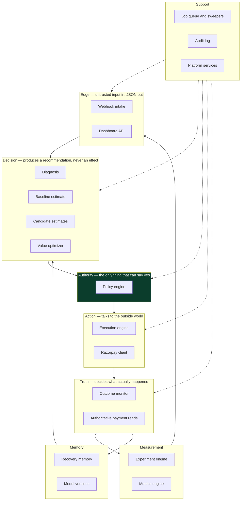

The dark box is the choke point. There is no arrow from the decision layer straight to the action
layer, and that absence is the design.

| Layer | Owns | Must never do | Where the code lives |
| --- | --- | --- | --- |
| Edge | Signature checks, deduplication, canonical parsing, session auth, tenant scoping | Do decision work on the request path. Trust a payload before verifying its signature. Trust a merchant id sent in a request body | `ingestion/`, `api/` |
| Decision | Cause diagnosis, baseline probability, per-action estimates, the net-value arithmetic and ranking | Call the provider. Execute anything. Let free text influence a ranking | `diagnosis/`, `estimation/`, `optimizer/` |
| Authority | The twelve ordered checks, one verdict, one reason, twelve recorded outcomes | Read anything an AI produced. Read the clock. Do I/O. Guess when an input is missing | `policy/` |
| Action | Exactly-once external effects, intent records, reconciliation, the three Razorpay calls | Act without a fresh approved decision. Retry a call whose outcome is unknown. Report success without a provider id | `execution/`, `providers/` |
| Truth | Authoritative payment reads, recovery declaration, conflict holds, cancelling actions when the customer already paid | Declare recovery from a webhook. Treat `authorized` or a partial payment as recovery | `outcome/` |
| Measurement | Control/treatment assignment, version freezing, sample size, lift intervals, every reported figure | Report a lift whose interval contains zero as established. Present observed recovery as incremental | `experiment/`, `metrics/` |
| Memory | One observation per finished case, provenance labels, intervention-status labels, model version promotion | Feed a policy threshold. Activate a model version without a recorded human approval | `memory/` |
| Support | Transactional job enqueue, periodic sweeps, append-only audit, config, crypto, masking, clock | Let a job be enqueued outside the transaction that caused it. Allow an audit row to be updated or deleted | `jobs/`, `audit/`, `platform/` |

The dependency rule that makes the authority layer trustworthy is enforced in CI, not by good
intentions: `policy/` is allowed to import only `domain/` and `platform/`. It cannot import
`reasoning/`, `estimation/` or `optimizer/`. If someone tries, the build fails.

---

## 3. Feature-by-Feature Walkthrough

Every feature below follows the same shape: what it does, why it exists, how it works, a diagram,
what breaks, and what the breakage looks like from outside.

### 3.1 Event ingestion and signature verification

**What it does.** Receives a webhook from Razorpay, proves it really came from Razorpay, and turns it
into one durable database row.

**Why it exists.** The webhook endpoint is the only door into Revora that anyone on the internet can
knock on. Without a signature check, a stranger could post a fake `payment.failed` and make Revora
open a case and eventually message a real person. Without durable persistence before anything else
happens, a crash loses the event and the payment silently stops being tracked.

**How it works.**

1. Read the request body as raw bytes. Reject immediately if it is larger than the configured payload
   cap, before spending CPU on hashing.
2. Compute HMAC-SHA256 over those exact bytes using the merchant's webhook secret, and compare it in
   constant time against the `X-Razorpay-Signature` header. Constant-time comparison means the check
   takes the same amount of time whether the first byte is wrong or the last one is, so an attacker
   cannot learn the secret by timing responses.
3. This happens **before any parsing**. Razorpay's documentation is explicit that a re-serialized JSON
   string will not match the hash. If a proxy or a framework rewrites the body, every signature fails.
4. Require the `x-razorpay-event-id` header. It is a header, not a payload field, and it is unique per
   event — this is the deduplication key.
5. Parse into a canonical internal shape, converting Unix timestamps to UTC instants. Then re-serialize
   and re-parse as a self-check; if the result differs, the payload is quarantined rather than trusted.
6. One transaction: insert the event row (with the raw payload encrypted) and insert the detection job.
   Commit. Respond 200.

Detection does not happen on the request path. The provider marks a delivery as failed if you do not
respond within five seconds, so the request handler does the minimum and hands the rest to a worker.
The design recommends tightening the internal budget from 3000 ms to 1500 ms to leave room for TLS and
network on a small instance.

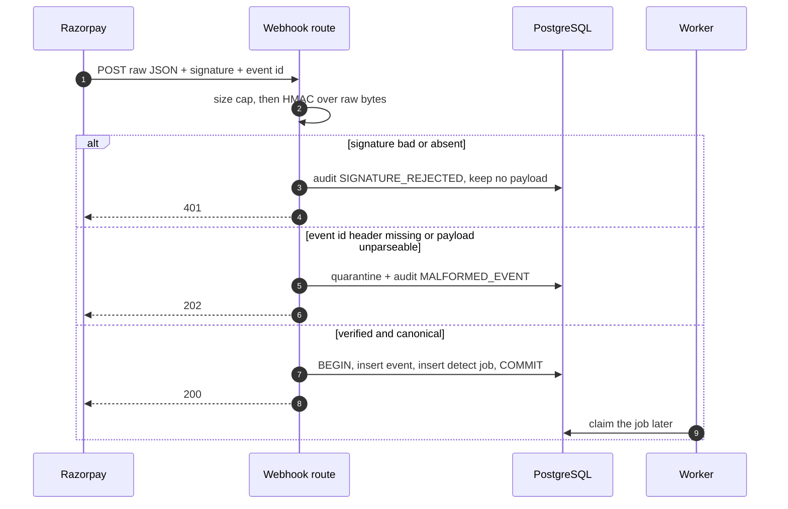

The response codes are deliberate. A 401 for a bad signature. A 202 for a payload we cannot parse —
202 means "received, not processing," which does not invite a redelivery of something we will fail to
parse again. A 503 if the database is down, because that *does* invite redelivery.

**What can go wrong.** A proxy mutating the request body breaks every signature at once. A rotated
webhook secret breaks signatures for events still being retried under the old one — handled by
verifying against an ordered list of active secrets and only removing the old one after the 24-hour
redelivery window closes. The database being unavailable means 503 responses, and sustained 503s for
24 hours cause Razorpay to disable the webhook entirely.

**How you would know.** Signature failures show up as a burst of 401s and `SIGNATURE_REJECTED` audit
rows. A body-mutation problem shows up as *every* event failing, not some, which is why the design
adds a startup canary that signs a known body and verifies it end to end.

### 3.2 Deduplication

**What it does.** Guarantees that receiving the same webhook five times produces exactly one stored
event and exactly one recovery case.

**Why it exists.** Razorpay's delivery is documented as at-least-once. Duplicates are normal, not
exceptional. Without deduplication, one failed payment could open three cases and send three payment
links to the same person.

**How it works.** A single unique database constraint on `(merchant_id, provider_event_id)`, with the
insert written as `INSERT ... ON CONFLICT DO NOTHING`. If zero rows come back, it was a duplicate:
write a `DUPLICATE_EVENT_DISCARDED` audit row, respond 200, do nothing else. Because the check and the
insert are the same statement, two workers processing simultaneous deliveries cannot both win.

There is a second, separate guarantee one level up: a partial unique index on
`(merchant_id, provider_payment_id)` restricted to non-terminal cases. That is what makes "at most one
open case per payment" a database fact rather than a code convention.

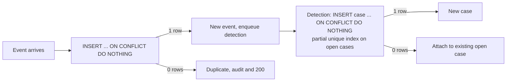

**What can go wrong.** Someone drops the unique index during a migration. Someone rewrites the insert
as select-then-insert, which races. Both turn a database guarantee back into a hope.

**How you would know.** Two cases for one payment id. That is not a performance problem, it is a
correctness bug, and it means one of those two indexes is missing or bypassed.

### 3.3 Detection

**What it does.** Decides whether a stored event represents revenue at risk, and opens a case if so.

**Why it exists.** Not every failed-looking event is worth tracking. A ₹1 failure is not worth a
payment link. A payment that already succeeded is not at risk. Detection is where that filtering
happens, deterministically, so it is explainable and repeatable.

**How it works.** A short ordered list of predicates, each with an identifier that gets recorded:
payment status is `failed`; amount is at or above the minimum detection amount; currency is in the
supported set; there is no verified captured state for that payment id. Every event gets exactly one
recorded verdict — `AT_RISK`, `NOT_AT_RISK`, or `DEFERRED_TRIGGER` — within the detection latency
bound.

`DEFERRED_TRIGGER` is for the three triggers modelled but not in scope: checkout abandonment, missed
promise-to-pay, and payment-window expiry. Those events are stored and given a verdict so that they
are visible, but no case opens.

Detection is forbidden from calling the AI layer. That is a stated requirement, not a preference.

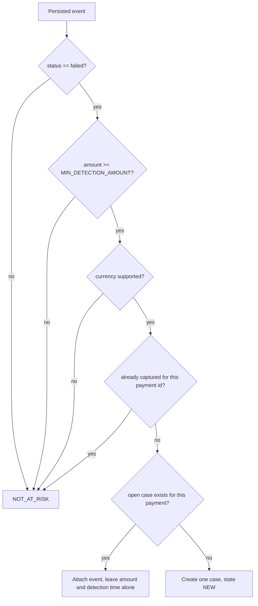

**What can go wrong.** A `payment.captured` arriving before the matching `payment.failed` — the
provider documents that ordering is not guaranteed. Handled by the already-captured check, so no case
opens for money that already arrived.

**How you would know.** Cases opening for payments that are already paid, or a detection verdict
missing for a stored event. The second one means the detection job never ran.

### 3.4 The recovery case lifecycle

**What it does.** Tracks one at-risk payment from detection to an ending, and guarantees it always
reaches an ending.

**Why it exists.** Two reasons. First, a customer must never be pursued indefinitely — that is what
the bounded window and the attempt caps are for. Second, every case needs an explainable end state,
so the dashboard can group unresolved money by reason instead of shrugging.

**How it works.** Fourteen states and one legal transition table. One function is the only writer of
case state. It locks the case row, checks an expected version number (so two concurrent writers cannot
both win), looks the transition up in a static table, applies the counter effects, allocates the audit
sequence number, and writes state plus audit record in one transaction. An illegal transition writes
nothing but an `ILLEGAL_TRANSITION` audit row.

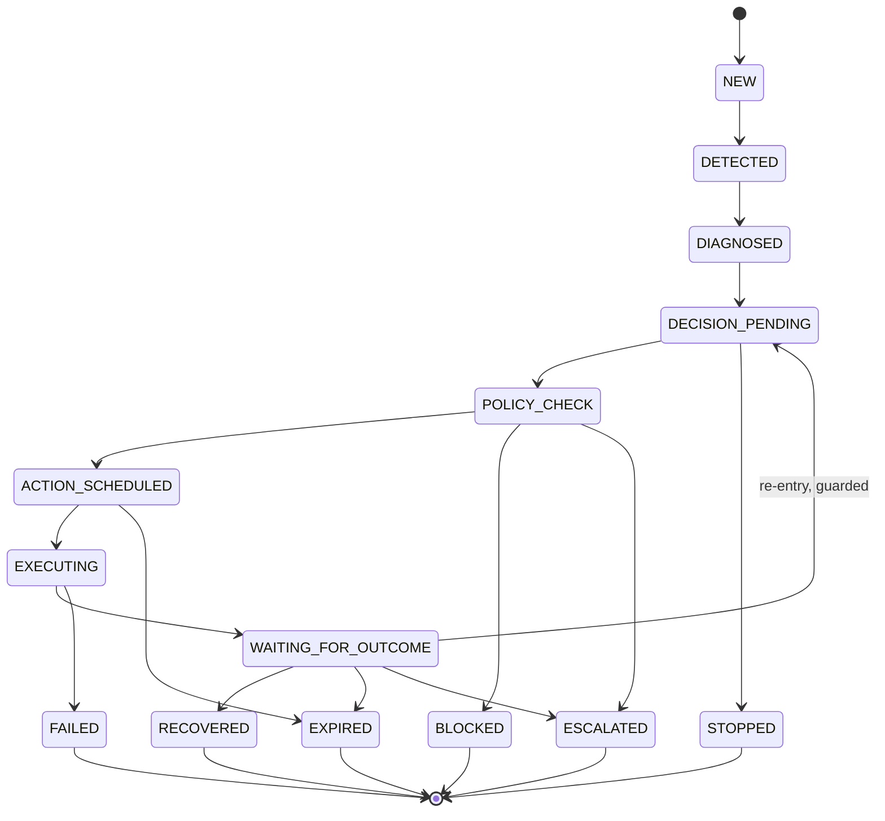

The diagram shows representative terminal edges so it stays readable. The real table has one edge from
**every** non-terminal state to every one of `STOPPED`, `BLOCKED`, `EXPIRED`, `ESCALATED`, `FAILED`.
It is generated in code from a declaration, and the property test reads the same declaration, so the
test checks the manager against the table rather than the table against itself.

Four things make termination guaranteed rather than hoped for:

- The window end timestamp is written at case creation and **never** extended. It is a fixed wall-clock
  deadline that does not depend on any timer surviving.
- A sweeper visits every non-terminal case at least once per lifecycle evaluation interval and applies
  expiry from stored timestamps. Termination does not require any earlier job to have run.
- The only loop in the graph is `WAITING_FOR_OUTCOME → DECISION_PENDING`, guarded by a decision-cycle
  counter that only increases and is capped.
- On restart, non-terminal cases are reloaded and re-evaluated from stored rows before anything is
  scheduled.

One counter placement is worth understanding because it looks wrong at first. The executed-action
counter increments **at the transition into `EXECUTING`, before the provider request goes out.** That
is deliberately pessimistic: a crash right after the increment burns an attempt that never happened.
The alternative — increment on confirmation — risks a crash loop that issues calls while consuming
zero attempts, which could blow past the attempt cap. Given a choice between possibly under-attempting
and possibly over-charging someone, the design under-attempts.

**What can go wrong.** Two writers racing produces a version conflict; one commits, the other is told
to re-read before doing anything external. A crash mid-transaction leaves the prior state readable,
because nothing was committed.

**How you would know.** Cases sitting in a non-terminal state past their window end means the
lifecycle sweeper is not running. `ILLEGAL_TRANSITION` rows mean a component is trying a transition
the table does not allow — usually a missing intermediate step.

### 3.5 Diagnosis via the error-reason table

**What it does.** Works out *why* the payment failed, so the candidate action set can be narrowed
sensibly.

**Why it exists.** An expired card and an insufficient-funds decline are different problems. Sending
"try again now" to someone whose card expired is useless. The cause drives which actions are even
eligible.

**How it works.** This is the cheapest high-value part of the system, because Razorpay already tells
us the answer. The payment entity carries `error_code`, `error_reason`, `error_source` and
`error_step`, with documented values. A static lookup table maps them straight onto the eight
risk-cause values — for example `insufficient_funds` to `INSUFFICIENT_FUNDS`, `card_expired` to
`EXPIRED_PAYMENT_METHOD`, `bank_technical_error` to `BANK_OR_NETWORK_FAILURE`,
`payment_risk_check_failed` to `FRAUD_OR_RISK_SIGNAL`. Lookup order is `error_reason` first, then the
`(error_source, error_step)` pair, then `error_code`.

Exactly one match records confidence 1.0 and method `DETERMINISTIC`, and the AI layer is never called.
No match, or conflicting matches, sends one request to the model with a strict output schema. An
accepted answer records method `AI_ASSISTED` with confidence capped at 0.99 — 1.0 is reserved for the
deterministic path. A schema-invalid answer records `UNKNOWN` with confidence 0.0 and method
`REJECTED_AI_OUTPUT`, keeping the rejected text as evidence. A timeout records `UNKNOWN` with method
`FALLBACK_UNKNOWN`.

Low confidence has a consequence. If confidence falls below the confidence floor, or the method is a
rejection or fallback, the value optimizer treats the cause as `UNKNOWN`, which yields the narrowest
possible candidate set. So a bad guess makes Revora *more* conservative, not less.

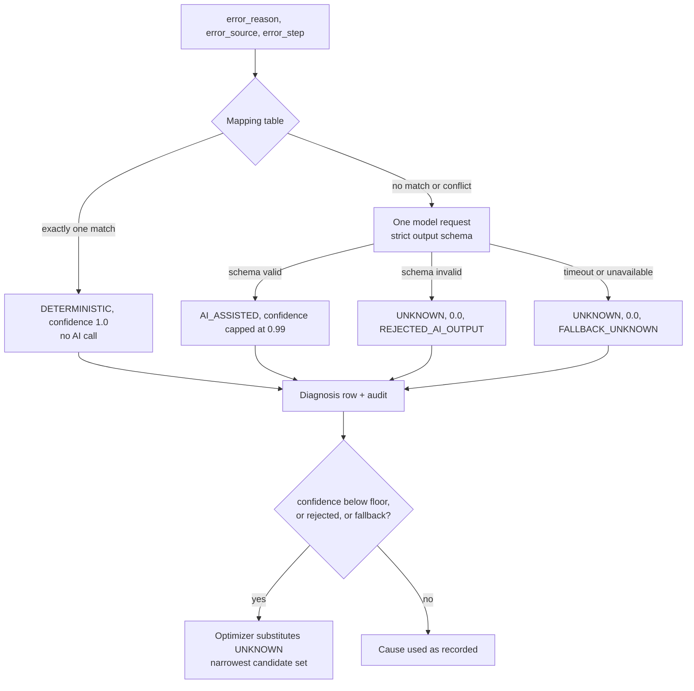

Two mappings in the table are flagged judgement calls in the design: `payment_timed_out` mapped to
`ABANDONMENT` (the docs say it can also mean no gateway response, which is a technical fault) and
`otp_expired` mapped to `ABANDONMENT`. Both are configuration, and the deterministic hit rate plus the
model's disagreement rate are instrumented so a wrong mapping becomes visible.

**What can go wrong.** Razorpay adds a new error reason that is not in the table. It falls to the model
or to `UNKNOWN`. The count of unmapped reasons is a monitored metric — that is the signal to extend the
table.

**How you would know.** A rising share of `UNKNOWN` diagnoses, or a rising unmapped-reason count.
Neither is dangerous, but both mean the candidate sets are narrower than they should be.

### 3.6 The baseline estimate

**What it does.** Estimates the probability this payment recovers with no Revora involvement at all.

**Why it exists.** It is the denominator of the whole argument. Without it, every intervention looks
valuable, because you are comparing against zero instead of against reality.

**How it works.** For a segment with `s` recoveries out of `n` confirmed no-intervention observations,
the estimate is a Beta posterior mean: `(α + s) / (α + β + n)` with a weak prior of `α = β = 1`. At
`n = 0` that gives the prior mean with a 95% interval of roughly `[0.03, 0.97]`.

That absurd width is the point. It tells the reader the number means very little yet, and it
propagates all the way to the dashboard as `UNVALIDATED_BASELINE`. The alternative — a tidy-looking
0.34 with no interval — would be a lie with better manners.

**Why it is a prior and not a trained model.** This is the most important thing to understand about
this component. You could fit a model to the merchant's historical failed payments and their outcomes.
That model would be wrong in a specific way: the merchant *intervened* on some of those payments —
phone calls, emails, manual follow-up. A model fitted to those outcomes estimates *intervened*
recovery and labels it baseline. Every intervention would then look worthless, because the baseline
already secretly contains the effect of intervening.

The only unbiased source of "what happens with no intervention" is the experiment's control arm. That
is why the control arm is in the MVP and the trained model is not.

Segments are five categorical features: risk cause, amount band, payment method, first-versus-repeat
attempt, and a collapsed error-source band. The full cross product is 1,152 cells, which no realistic
dataset fills. So lookup backs off: try the full key, then drop error source, then attempt band, then
payment method, then amount band, then risk cause alone, then a global prior. The first level with
enough confirmed observations wins, and which level was used is recorded.

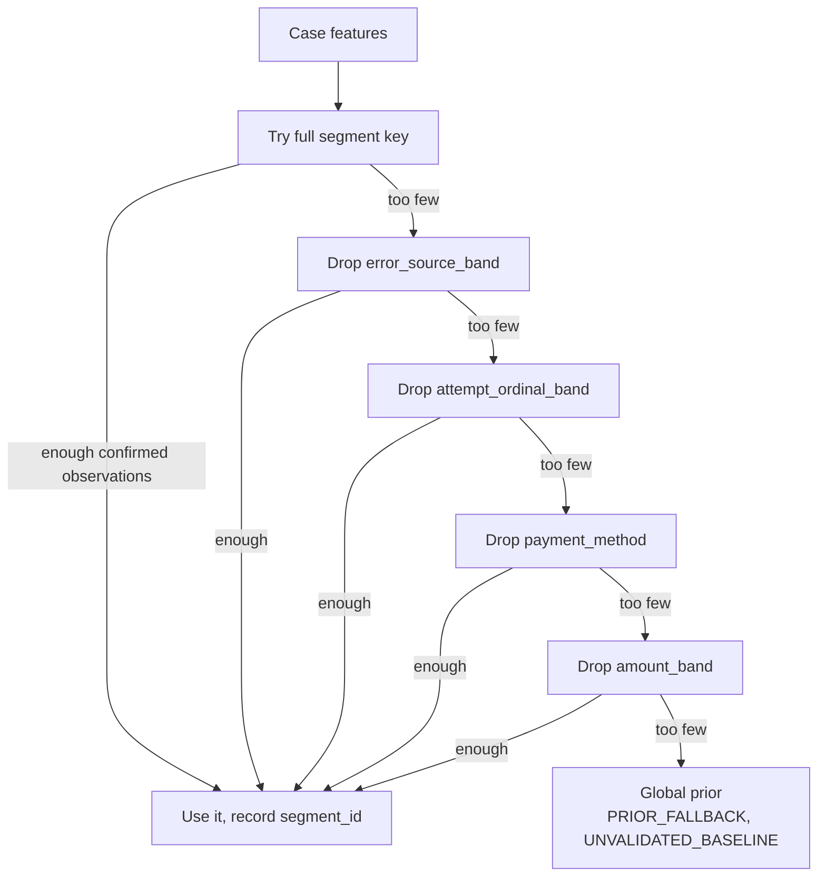

If the estimate cannot be produced — timeout, or memory unreachable — **no estimate is recorded** and
the case stays in `DIAGNOSED`. A missing baseline is never silently treated as zero, because zero
would make every intervention look brilliant.

Every observation feeding a baseline carries an intervention-status label: `NO_INTERVENTION_CONFIRMED`,
`REVORA_INTERVENED`, or `MERCHANT_INTERVENTION_UNKNOWN`. Only the first is usable as a baseline label.
And the honest reading of `NO_INTERVENTION_CONFIRMED` is "no Revora action and no *recorded* merchant
action" — Revora cannot see the merchant phoning a customer. The design labels that weakness and
reports the unknown share per segment rather than claiming it is solved.

**What can go wrong.** Intervention bias, as above — mitigated by labelling, not eliminated. Segments
with too few observations forever, so nothing is ever validated.

**How you would know.** Every baseline carrying `UNVALIDATED_BASELINE`, and every calibration band
marked `CALIBRATION_UNVERIFIED`. That is expected early on. See section 6.

### 3.7 Candidate estimates

**What it does.** For each action Revora could take, estimates the recovery probability and three cost
figures.

**Why it exists.** You cannot rank actions without pricing them. And the null actions have to be
priced on the same terms as the real ones, or the comparison is rigged.

**How it works.** Build the candidate set from a cause-to-action eligibility table, always including
`DO_NOTHING` and `WAIT`. For each member, produce four numbers: intervention probability, action cost,
risk cost, customer cost. All three costs are integers in the same minor units as the payment amount.
Each number records how it was produced — `DETERMINISTIC`, `PRIOR_FALLBACK`, `UNCALIBRATED`, or
`DEFINITIONAL`.

`DO_NOTHING` is definitional: probability equals baseline, all three costs zero, therefore net value
exactly zero. `WAIT` gets zero action cost and zero customer cost, with a probability derived from the
no-intervention hazard over the time left in the window.

Actions with no verified provider capability are marked `UNAVAILABLE`, excluded from selection, and
**kept in the recorded set**. That last part is not padding: the dashboard can then show "a retry
would have been considered but is not available on this account," which is more honest than silently
omitting it.

Zero provider calls happen here. Everything comes from stored fields, memory and configuration.

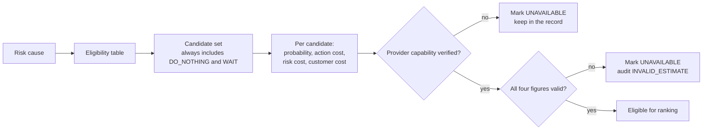

The design is blunt about what this component actually is: for the MVP it is a configuration lookup
marked `UNCALIBRATED`, not a simulator. The review even recommends renaming it for clarity. What it
wants to be is an uplift model, and that needs data that does not exist yet.

**What can go wrong.** Optimistic priors make interventions look good and the arithmetic cannot detect
it. The structural counter is that `UNCALIBRATED` propagates to every surface and the experiment
measures whether the priors were right.

**How you would know.** Everything on the dashboard marked `UNCALIBRATED`. Expected until real
outcomes accumulate.

### 3.8 The value optimizer

**What it does.** The arithmetic that is the product.

**Why it exists.** This is the only component that answers the actual question. Everything upstream
feeds it and everything downstream checks or records it.

**How it works.** Three lines of arithmetic per candidate, all in integer minor units with half-up
rounding:

```
incremental_probability      = intervention_probability - baseline_probability     (negatives kept)
expected_incremental_revenue = payment_amount * incremental_probability
net_recovery_value           = expected_incremental_revenue - action_cost - risk_cost - customer_cost
```

Then exclusions, then selection:

1. Exclude any candidate whose expected incremental revenue is zero or negative, with reason
   `NON_POSITIVE_INCREMENTAL_VALUE`. No cost-ratio division is performed for these — dividing by zero
   or a negative is meaningless.
2. Exclude any candidate whose total cost divided by expected incremental revenue exceeds the maximum
   cost-to-value ratio, reason `COST_RATIO_EXCEEDED`.
3. Exclude candidates with invalid inputs or marked `UNAVAILABLE`.
4. Among survivors clearing both the minimum net value threshold and the minimum incremental
   probability, pick the largest net recovery value. Ties break toward lower total cost, then a declared
   precedence order.
5. If nothing clears both thresholds, pick whichever of `DO_NOTHING` and `WAIT` has the greater net
   value, `DO_NOTHING` on a tie, and record the reason as `NO_POSITIVE_VALUE` — or
   `HIGH_BASELINE_NO_INTERVENTION` when the baseline is at or above the high-baseline threshold.

Ranking uses net recovery value **only**. Not probability magnitude, not model text, not anything the
AI produced. If the highest-probability action differs from the selected one, both are recorded with
their figures and a divergence reason of `HIGHER_PROBABILITY_LOWER_NET_VALUE`. Any model-written
explanation goes in a column named to make its status obvious and read by exactly one code path — the
dashboard serializer.

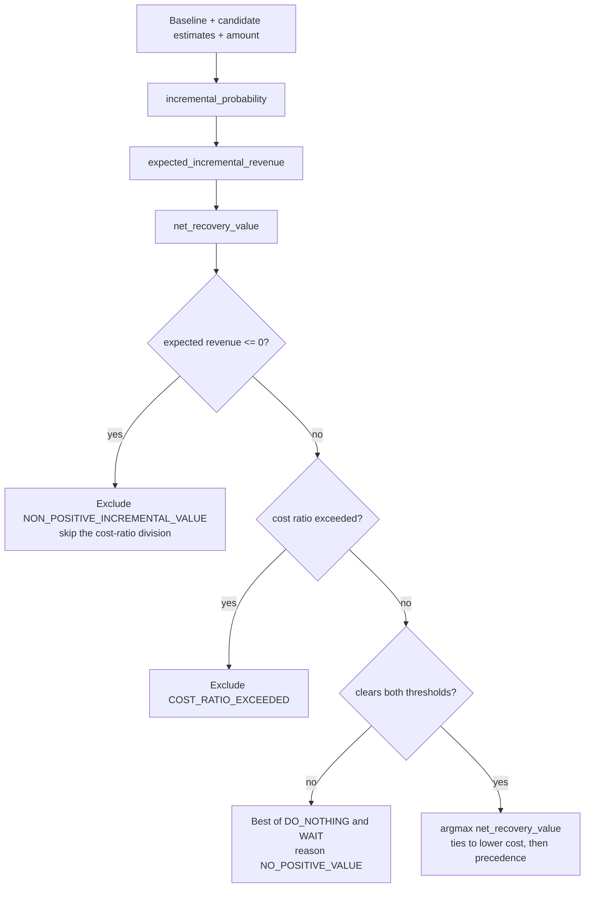

All money is `BIGINT` minor units. No floats anywhere in a stored currency figure. Probabilities are
the only non-integer quantities, held at four decimal places, and they are multiplied into money
exactly once, at which point rounding happens and the integer is stored. Aggregates are the exact sum
of those stored integers, so the total on the dashboard equals the sum of the rows, always.

**What can go wrong.** Garbage in, confident recommendation out. The arithmetic is provably correct and
cannot tell that its inputs are guesses. The mitigation is labelling, never suppressing the number.

**How you would know.** Selections that look sensible arithmetically but wrong commercially. That is a
signal about the priors and thresholds, not about this component.

### 3.9 The policy engine and its twelve checks

**What it does.** Holds the only authority to allow an external effect.

**Why it exists.** Because the layers above it are advisory. Something has to be the thing that cannot
be talked into contacting a customer who already paid, or opted out, or has been handed to a human.
Making it a pure function is what makes that provable.

**How it works.** A single pure function: `evaluate(PolicyInput, RuleSet) -> PolicyDecision`. No I/O,
no clock read — the evaluation timestamp is a field on the input — no randomness, no logging. Identical
inputs always produce an identical verdict, reason, and twelve ordered check outcomes. That is what
lets you replay any historical decision by reconstructing its input.

The twelve checks in fixed order. The order is not arbitrary: absolute prohibitions come first, so an
expensive or fiddly check can never be the reason a paid or opted-out customer got messaged.

| # | Check | Verdict when it fails | Why it sits here |
| --- | --- | --- | --- |
| 1 | Already paid | `BLOCKED` ALREADY_PAID | Absolute |
| 2 | Already terminal | `BLOCKED` | Nothing to do |
| 3 | Duplicate intent for this key | `BLOCKED` DUPLICATE_ACTION | Cheapest correctness guard |
| 4 | Fraud or risk | `ESCALATE` FRAUD_OR_RISK_FLAG | A human takes over |
| 5 | Customer opted out | `BLOCKED` CUSTOMER_OPTED_OUT | Before every bound, so no bound bug can leak a message |
| 6 | Required consent present | `BLOCKED` CONSENT_MISSING | Same reason |
| 7 | Human ownership | `BLOCKED` HUMAN_OWNERSHIP | Automation yields to a person |
| 8 | Window still valid | `BLOCKED` WINDOW_EXPIRED | Time bound |
| 9 | Attempt count | `BLOCKED` MAX_ATTEMPTS_REACHED | Effort bound |
| 10 | Message count | `BLOCKED` MAX_MESSAGES_REACHED | Customer-visible actions only |
| 11 | Cooldown elapsed | `DEFERRED` COOLDOWN_ACTIVE with an earliest-permitted time, or `BLOCKED` WINDOW_EXPIRED if that time falls outside the window | The only check that can defer |
| 12 | Action eligibility | `BLOCKED` | Most case-specific, so last |

The verdict comes from the lowest-numbered failing check. Any input that cannot be read records
`UNAVAILABLE` for that check and the verdict is `BLOCKED` with `POLICY_INPUT_UNAVAILABLE`. There is no
"assume it's fine" branch.

Four independent mechanisms keep AI out of this function, because one would be a claim and four is a
structure: the input type is a frozen dataclass with enumerated fields and no `dict` or `Any` for an
AI value to sit in; the only constructor reads named columns and does not read the AI-explanation
column or an AI-assisted confidence; the module cannot import the reasoning or estimation packages and
CI enforces that; and a property test replaces every AI-produced field with arbitrary valid content and
asserts the verdict does not move.

One nuance stated plainly rather than glossed: the *selected action* is a policy input, and that action
was chosen by an optimizer that consumed a cause which may have been AI-assisted. So AI influences
which action is presented for authorization. It does not influence whether that action is authorized.
The honest claim is "AI cannot authorize," not "AI has no causal path to an action."

**Policy runs twice per action.** Once when the recommendation is produced, once inside the execution
lock against freshly reloaded state.

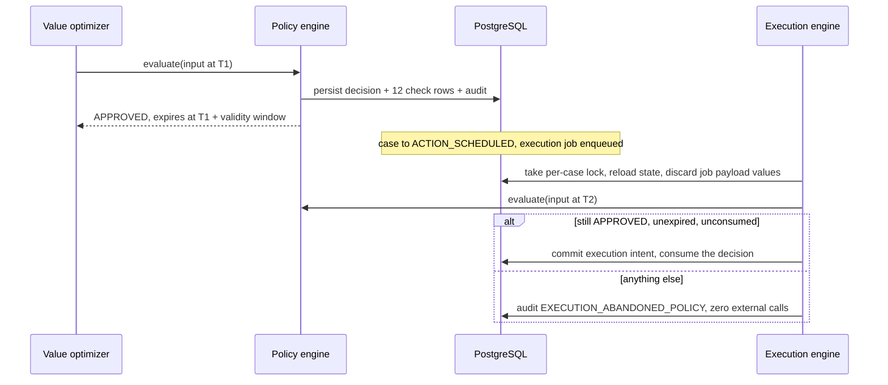

The second evaluation is not a formality. Between T1 and T2 the customer may have paid, opted out,
been assigned to a human, or the window may have closed.

**What can go wrong.** A rule set change during an active experiment invalidates that experiment —
caught by version freezing. Stale input reaching execution — caught by the re-check.

**How you would know.** A decision with fewer than twelve recorded check outcomes means something
short-circuited. An approved decision consumed twice would violate a unique constraint and surface as
an error.

### 3.10 Exactly-once execution — the most important mechanism in the system

**What it does.** Performs the approved action at most once, and reports success only when the provider
confirmed it.

**Why it exists.** If this is wrong, a customer gets two payment links and two SMS messages, or Revora
tells the merchant a link exists when the call actually failed. Everything else in the design is in
service of getting this right.

**The awkward fact it works around.** Razorpay has no idempotency header for Payment Link creation.
"Idempotent" means doing the same operation twice has the same effect as doing it once — an idempotency
key is how you ask a provider to enforce that. Razorpay documents such headers for payouts and
transfers, but not for payment links. So Revora builds the guarantee itself out of two verified
capabilities: `reference_id` must be unique per link, and you can fetch links filtered by
`reference_id`.

Revora sets `reference_id` to its own idempotency key. After any uncertain create, it can ask the
provider "does a link with this reference already exist?" and get an authoritative answer. Note the
design deliberately does **not** depend on Razorpay rejecting a duplicate `reference_id` — that is
unverified. It depends only on the documented *query* capability, which is the safer dependency.

**How it works.**

1. Take a transaction-scoped advisory lock on a hash of the case id.
2. Reload case, consent, verified payment state and existing intents from the database, **discarding
   every value carried in the job payload**.
3. Re-run policy against that reloaded state. Not approved means abandon with zero external calls.
4. Derive the idempotency key deterministically from case id, action type and attempt ordinal. Same
   attempt, same key, always. Because `reference_id` is capped at 40 characters, the key is `rv_` plus
   the first 16 hex characters of a SHA-256 of those three inputs — 19 characters.
5. If an intent row already exists for that key: return the recorded result if it is `CONFIRMED` or
   `FAILED`, hand it to reconciliation if it is `ATTEMPTED` or `UNCERTAIN`. Never a second call.
6. Otherwise insert the intent row in state `ATTEMPTED`, move the case to `EXECUTING`, increment
   counters, mark the policy decision consumed, write the audit row, and **commit**. The lock releases
   here.
7. Now make the HTTP call, with `reference_id` set to the key.
8. Commit the outcome: `CONFIRMED` with the provider's link id, or `FAILED`, or `UNCERTAIN`.

The durable intent record — not the lock — is what prevents a second call. The lock only keeps the
check-and-insert atomic so two workers cannot both pass "no intent exists." It deliberately does not
span the HTTP call; holding a database lock across a 15-second external request would tie up a
connection and create a lease-expiry problem exactly where correctness matters.

**The two crash windows.** This is the part worth reading twice.

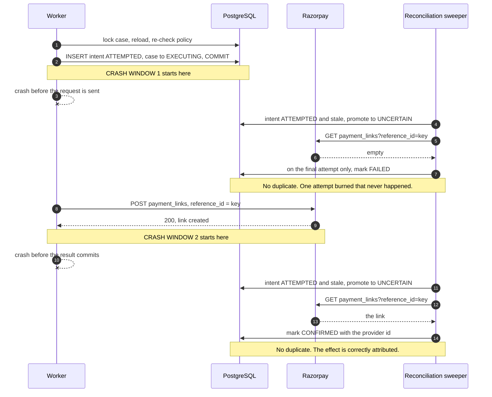

Both windows are safe for one reason: **the durable intent is written before the call, and the
reconciliation read is keyed on the same value the call carried.** Every restart path goes to
reconciliation, never to a repeated call.

The formal argument is three lines. A call is issued only immediately after a successful insert of an
intent with that key. That insert can succeed at most once, because of the unique constraint on
`(merchant_id, idempotency_key)`. No other code path calls the create endpoint.

**Response classification is where the care shows.** The client classifies every provider outcome into
exactly one bucket, and the bucket determines the intent state:

| Provider outcome | Intent state | Does the effect exist? |
| --- | --- | --- |
| 200 with a valid link entity | `CONFIRMED` | Yes |
| 4xx with a parseable error object | `FAILED` | No |
| 5xx | `UNCERTAIN` | Unknown |
| Read timeout or connection reset after sending | `UNCERTAIN` | Unknown |
| 200 with an unparseable body | `UNCERTAIN` | Unknown |
| Connect error before sending | `FAILED` | No — nothing left the process |

The last row is the only network failure treated as definitive, and only because a connect-phase
failure means no bytes reached the server. This is also why the design uses a hand-written client
rather than the official SDK: the SDK raises on error and normalizes responses, which erases the
difference between "definitely did not happen" and "might have happened" — the only distinction that
matters here.

**The reconciliation loop.**

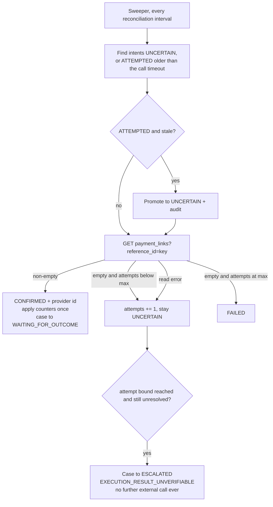

The asymmetry is deliberate. A non-empty read confirms immediately. An empty read only confirms failure
on the *final* attempt. Earlier empty reads leave the intent `UNCERTAIN`. That is because it is unknown
whether a just-created link is immediately visible in the listing endpoint — if it lags, an early empty
read would look like failure and a retry would create a duplicate. Ambiguity resolves toward "might
exist," which errs toward not sending a second message.

Counters are applied exactly once via a boolean flag on the intent, flipped in the same transaction as
the increment. Both the confirmation path and the reconciliation path check it first, so a case that
confirms via reconciliation after a partial crash does not double-count.

**What can go wrong.** Someone attaches a retry decorator to a function that can produce an external
effect. Someone treats an `UNCERTAIN` intent as a signal to try again. Both create duplicates.

**How you would know.** Two payment links with the same reference, or two SMS messages to one customer
for one case. Treat that as a correctness bug and stop. See section 6.

### 3.11 Outcome verification

**What it does.** Decides what actually happened, from an authoritative provider read only.

**Why it exists.** Because the recovery number is the product's headline claim, and a webhook is not
proof. Delivery is at-least-once and possibly out of order. Declaring recovery on a webhook alone would
produce numbers you could not defend when questioned.

**How it works.** A success signal arrives — `payment.captured`, `order.paid`, or `payment_link.paid`.
Revora persists the event and enqueues an outcome job. It declares nothing yet. The job calls
`GET /v1/payments/{id}`, stores the full response as a payment-state read row, and only then decides.

- `captured` (or `authorized` with `captured == true`) means recovered. The recovered amount comes from
  the **read**, not the webhook.
- `authorized` alone is **not** recovery. The money is not captured.
- Anything else is a conflict: hold the case in `WAITING_FOR_OUTCOME`, write a
  `PAYMENT_STATE_CONFLICT` audit row, re-read at the configured interval up to the attempt cap, then
  escalate with `PAYMENT_STATE_UNVERIFIABLE`.
- A partial payment is **not** recovery. Links are created with `accept_partial: false`, and a
  `partially_paid` status is handled as a conflict hold.

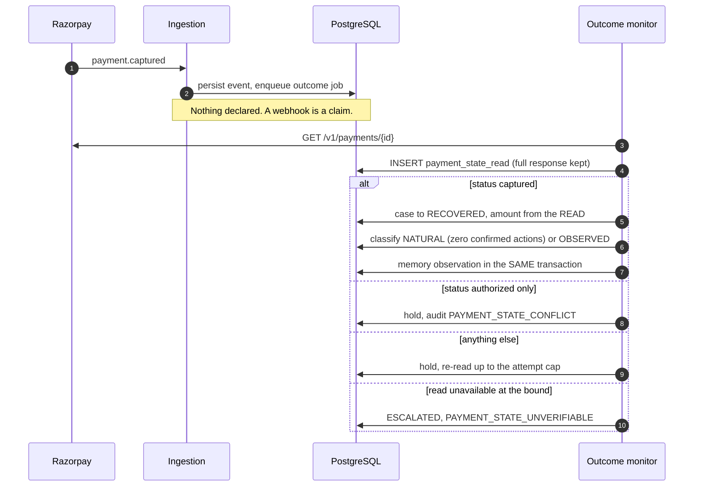

Schema constraints carry the honesty rather than code discipline: a recovery row cannot exist without
pointing at a read row, and there is one recovery row per case at most, so a recovered amount is
counted exactly once no matter how many duplicate success events arrive.

Two more behaviours worth knowing. If a read confirms payment while an action is queued and no intent
exists yet, the action is cancelled before any call and audited as
`ACTION_CANCELLED_PAYMENT_RECEIVED`. If an intent already exists, the action is flagged as a
post-payment action and counted in `unnecessary_action_count` — a metric that is deliberately visible,
because it is the cost of Revora being wrong, and hiding it would defeat the purpose. And if a payment
arrives after a case already went terminal for another reason, exactly one reconciliation transition to
`RECOVERED` is allowed, audited as `DELAYED_RECOVERY_RECONCILED`, with the period restated so the
amount is still counted once.

**What can go wrong.** The provider read lagging behind the webhook — unverified how often — looks like
a conflict and self-resolves on retry. The read being unavailable holds the case rather than declaring
anything.

**How you would know.** A pile of `PAYMENT_STATE_CONFLICT` rows means either genuine lag or a read
problem. Cases escalating with `PAYMENT_STATE_UNVERIFIABLE` means reads are failing outright.

### 3.12 The experiment engine and the control group

**What it does.** Makes the word "incremental" earnable, and refuses it when it has not been earned.

**Why it exists.** "We sent a link and the money arrived" is not "we caused the money to arrive." The
only way to tell the difference is to withhold the intervention from a comparable group and compare.

**How it works.** Assignment is a keyed hash: HMAC-SHA256 of the case id under the experiment id,
turned into a uniform number, split by the allocation ratio. Deterministic, stateless, needs no
coordination between workers, and identical on every re-evaluation. It is persisted **before** any
diagnosis runs, and the group column has no update permission.

Control cases run the frozen baseline workflow. Here is the clever part: they still run the entire
Revora pipeline through to a recorded recommendation. That recommendation is stored and **suppressed**
— no execution intent is ever created from it. So for every control case you know exactly what Revora
would have done. That turns the comparison from "two numbers" into something interpretable.

Sample size is computed at definition time from the assumed baseline rate, the minimum detectable
effect, the significance level and the power. It is not assumed. The design's worked arithmetic: at a
20% baseline with the usual 0.05 significance and 0.80 power, detecting a 5-point lift needs roughly
1,000 cases per arm, while detecting a 10-point lift needs roughly 270. So the "500 per arm" figure
from the project brief is adequate for a large effect and inadequate for a small one — which is exactly
why the number has to be derived and reported.

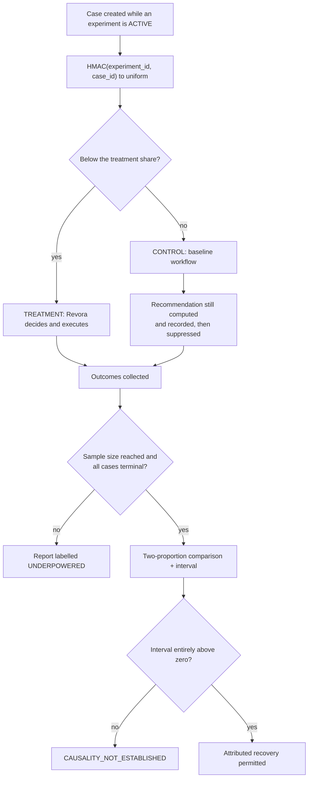

Four labels can disqualify a result: `UNDERPOWERED` (fewer cases than required),
`INVALIDATED` (a frozen component version changed mid-experiment), `SYNTHETIC` (inputs came from
generated data), and `CONTAMINATED` on individual cases (a control case received an action outside the
frozen baseline definition). Secondary metrics are labelled `EXPLORATORY` and excluded from attribution.

**The deepest limitation in the whole design, stated plainly.** Merchant-side manual recovery is
invisible to Revora. If the merchant phones a control-arm customer, control recovery inflates and the
measured lift shrinks. If they chase treatment cases harder, the reverse. Contamination detection only
catches what Revora can see. No engineering fixes this; it needs an operational agreement with the
merchant, and even then it is trust rather than measurement.

**What can go wrong.** Beyond invisible contamination: a version promotion during an active experiment
invalidates it, and a case whose assignment cannot be persisted before diagnosis is excluded from both
arms and run on the baseline workflow — because an unassigned case must never quietly become treatment.

**How you would know.** Every result labelled `UNDERPOWERED`. Expected at demo scale. See section 6.

### 3.13 The metrics engine and the three recovery classes

**What it does.** Computes every reported figure from persisted rows, keeping the outcome classes apart.

**Why it exists.** So nobody is sold activity as outcome. Section 5 covers the three classes in full;
this is the mechanism.

**How it works.** A reporting period cohort is the set of cases whose detection timestamp falls in a
half-open interval. Every money figure is a `SUM()` of stored `BIGINT` minor units, so the reported
aggregate equals the sum of the rows exactly. Rates with a zero denominator report `UNDEFINED`, not 0 —
because 0% recovery and "no cases yet" are different statements.

The headline separation:

- `natural_recovered_revenue` — recovered with zero confirmed Revora actions.
- `observed_recovered_revenue` — recovered with at least one confirmed Revora action.
- `incremental_recovered_revenue` — only from an adequately powered completed experiment whose lift
  interval excludes zero. Otherwise reported as `NOT_ESTABLISHED` with **no numeric value**.

Classification is withheld entirely while any execution intent for a case is `UNCERTAIN`. You cannot
classify a recovery as natural or observed if you do not yet know whether an action happened.

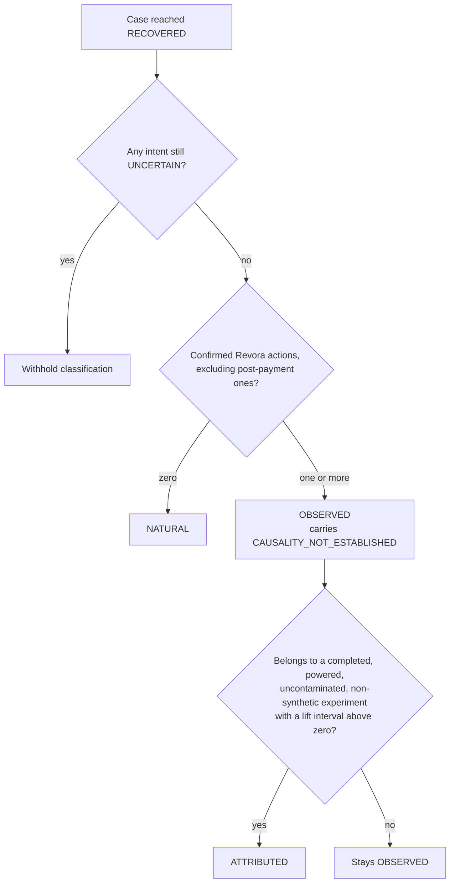

Everything derived even partly from generated data carries `SYNTHETIC` on every surface and in every
export.

**What can go wrong.** Refunds are not netted in the MVP, so recovery figures are gross of refunds and
labelled as such. The refunded amount is captured on every read so a restatement is possible later.

**How you would know.** A figure that looks too good — see section 6. Or a rate showing 0% when it
should show `UNDEFINED`, which means the zero-denominator handling was lost.

### 3.14 The audit log

**What it does.** Makes an explanation possible and a rewrite impossible.

**Why it exists.** A merchant will eventually have to explain to a customer, or to an auditor, why
Revora did what it did. If that explanation requires reconstruction or inference, it is not an
explanation.

**How it works.** Insert-only, in the same database as the state, so the audit write shares the
transaction with the state change it records. If the audit write fails, the whole transaction rolls
back and state and audit cannot diverge.

Append-only is enforced twice: the application role has `UPDATE`, `DELETE` and `TRUNCATE` revoked, and
a `BEFORE UPDATE OR DELETE` trigger raises an exception. Two mechanisms because a grant can be
misconfigured by a migration. A rejected mutation is itself recorded, naming the actor who tried.

Sequence numbers are per case, start at 1, increase by exactly 1, and have no gaps. The naive
approaches both fail — a Postgres sequence has gaps by design because allocations are not rolled back,
and `SELECT max(seq)+1` races. The mechanism used is a counter column on the case row, which every
audit writer is already holding under `FOR UPDATE`, incremented with `RETURNING` in the same
transaction as the insert. Concurrent writers serialize on the row lock, and a rolled-back transaction
rolls back the increment too.

Correlation ids tie everything back to one triggering event: generated at event acceptance, stored on
the event row, copied into every job payload, and read from a context variable the worker sets when it
claims a job. So an audit write inside async work inherits it without being passed it.

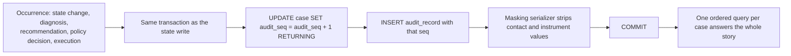

The test of whether the design works: a single ordered query over one case's audit rows should answer
what happened, why, on what evidence, which alternatives were considered with their net values, which
policy checks allowed or blocked, which action executed, whether payment recovered, and how the
recovery is classified. A merchant explaining a decision should never need a second query.

The design explicitly rejected a hash chain over records. It would detect tampering by someone with
direct database access — who can also rewrite the chain. It would have looked rigorous and defended
against nothing. The real answer, if tamper-evidence against a privileged insider ever matters, is
shipping records to append-only external storage.

**What can go wrong.** Audit table growth, bounded by retention. Per-case write serialization, which is
fine at single-digit records per case.

**How you would know.** A gap in a case's sequence numbers means the allocation mechanism was bypassed.
Cases blocked from further external action means an audit write failed and the block is holding, which
is correct behaviour.

### 3.15 The synthetic data generator

**What it does.** Creates a world where the true lift is known, so Revora's *measurement* can be
checked against it.

**Why it exists.** Without production traffic there is no other evidence available. And more
importantly: it is the difference between "Revora reported a lift" and "Revora reported a lift of X
where the true lift was Y."

**How it works.** Seeded, so a run row reproduces the identical dataset. Per case: draw a risk cause,
draw an amount, draw method and error source conditioned on the cause (a card-expiry failure cannot
come from a UPI method), then emit a Razorpay-shaped `payment.failed` payload using **only verified
field names and verified error reason values**. That last part matters — the generator exercises the
real signature, canonicalization and mapping code, not a bypass around it.

The ground truth is hidden from Revora. A natural recovery probability per segment, and a true uplift
per action. Then the counterfactual pair: draw one uniform number **per case** and record both whether
it recovers untreated and whether it recovers under each action. Using the same draw for both arms is
what makes the true individual effect well defined and the true average lift exactly the difference in
means.

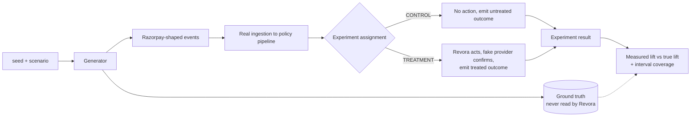

Four scenarios are mandatory, and they exist to stop the generator flattering the optimizer:

1. **A null scenario with true uplift zero for every action.** Revora must report an interval
   containing zero. If it reports a lift here, the measurement is broken and the demo is invalid. This
   runs in CI.
2. **A negative scenario** where an action reduces recovery. The optimizer must pick `DO_NOTHING`.
3. **A high-baseline scenario** where natural recovery is at or above 0.8 and intervention has small
   positive uplift but real cost. Correct behaviour is `DO_NOTHING` with reason
   `HIGH_BASELINE_NO_INTERVENTION`.
4. **An interval coverage check across roughly 200 seeds.** The reported 95% interval should contain
   the true lift close to 95% of the time. Materially lower coverage means the interval is wrong, and
   every causal claim built on it is too.

**What synthetic evidence establishes and does not.** It establishes that Revora's measurement recovers
a known effect and correctly refuses an absent one. It establishes nothing whatsoever about real
recovery rates, because the ground truth is something we wrote. Any claim of the form "Revora recovers
X% more revenue" derived from synthetic data would be circular. The demo narrative is "here is a system
whose measurement you can trust."

**How you would know it is broken.** The null scenario reporting a lift. That is a build-failing
condition, not a curiosity.

### 3.16 The job queue and the sweepers

**What it does.** Moves work off the request path with durability equal to the state it advances, and
runs the periodic safety nets.

**Why it exists.** The webhook handler has a five-second budget. Everything interesting happens after
it responds. And the timing rules — window expiry, cooldown, outcome wait — have to be applied even if
every job that was supposed to apply them was lost.

**How it works.** A `job` table. Workers claim rows with
`SELECT ... WHERE run_after <= now() AND state = 'PENDING' ORDER BY run_after FOR UPDATE SKIP LOCKED
LIMIT n`, execute, then mark done or reschedule with backoff. `SKIP LOCKED` is what lets several
workers claim different rows concurrently without blocking each other.

The decisive reason this is a table and not a broker: **a job must be enqueued in the same transaction
as the state change it follows.** With an external queue, enqueueing before commit can run a job
against uncommitted state, and enqueueing after commit can lose the job. Neither is possible when the
job row and the state row commit together.

Five periodic sweeps:

| Sweep | What it catches |
| --- | --- |
| Lifecycle evaluation | Windows that elapsed, cooldowns that elapsed, outcome waits that timed out |
| Execution reconciliation | Intents stuck in `ATTEMPTED` or `UNCERTAIN` |
| Payment-state reconciliation | Cases held on conflicting payment signals |
| Detection-gap backfill | Failed payments with no stored event, because the webhook was disabled or events were lost |
| Calibration report triggers | Enough resolved control cases, or enough elapsed time |

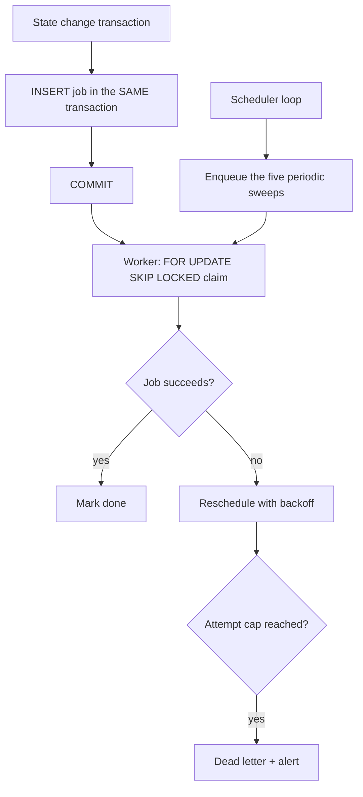

Correctness never depends on a job succeeding. Every timing rule is also enforced by a sweeper reading
persisted timestamps. A lost job delays a decision; it does not break a bound.

**The detection-gap backfill deserves special mention.** Razorpay disables a webhook after 24 hours of
sustained delivery failure. That is silent, total detection loss — precisely the failure mode Revora
exists to prevent. The backfill lists provider payments over a lookback window and ingests any failed
payment with no stored event, through the *same* canonicalization and detection path, using a synthetic
event id of `backfill:<payment_id>:<status>` so the dedup index still guarantees one case per payment.
This is an addition to the requirements, which the design flags as the item most likely to be cut under
time pressure and says should not be.

**What can go wrong.** A poison job retrying forever — capped, then dead-lettered with an alert. A long
transaction holding locks — bounded by a per-job statement timeout. The sweeper becoming a full scan as
open case volume grows. See section 6.

**How you would know.** A growing pending-job count. A growing count of stale `ATTEMPTED` intents. A
detection gap showing up as no new cases at all.

---

## 4. Follow One Payment All the Way Through

### 4.1 A ₹20,000 insufficient-funds failure that gets a payment link

A customer's card is declined for insufficient funds on a ₹20,000 order. Razorpay's `error_reason` is
`insufficient_funds`, which is a documented value.

**Step 1 — the webhook arrives.** `POST /webhooks/razorpay/{merchant}` with a `payment.failed` body,
an `X-Razorpay-Signature` header, and an `x-razorpay-event-id` header. The route reads raw bytes,
HMACs them, matches. Parses to canonical form. One transaction inserts a `webhook_event` row with the
raw payload encrypted, the PII-free canonical JSON, and a fresh correlation id, plus a `job` row for
detection. Responds 200 in well under the ack budget.

**Rows written:** one `webhook_event`, one `job`.

**Step 2 — detection.** A worker claims the job. Status is `failed`. Amount 2,000,000 paise is above the
minimum. Currency is supported. No captured state exists. No open case exists for this payment id.
Verdict `AT_RISK`, and one `recovery_case` row is created in state `NEW` with the amount, the masked
contact, the detection timestamp, and a window end timestamp 168 hours later that will never change.

**Rows written:** one `detection_verdict`, one `recovery_case`, one `audit_record` (seq 1) naming the
detection rules that fired.

**Step 3 — experiment assignment.** HMAC of the case id under the active experiment id lands in the
treatment share. One `experiment_assignment` row, group `TREATMENT`, written before any diagnosis.

**Step 4 — diagnosis.** The mapping table returns exactly one match for `insufficient_funds`. One
`diagnosis` row: cause `INSUFFICIENT_FUNDS`, confidence 1.0, method `DETERMINISTIC`, evidence naming
the matched rule id. No model call. Case moves to `DIAGNOSED`.

**Step 5 — baseline.** The segment is (INSUFFICIENT_FUNDS, the ₹20k band, card, first attempt, customer
source). No confirmed no-intervention observations exist yet, so backoff runs down to a coarse level and
lands on the prior. One `baseline_estimate` row: probability 0.200, interval wide, method
`PRIOR_FALLBACK`, validation status `UNVALIDATED_BASELINE`, provenance recorded.

**Step 6 — candidate estimates.** The eligibility table for `INSUFFICIENT_FUNDS` permits `PAYMENT_LINK`
and `CUSTOMER_MESSAGE` alongside the two null actions. `RETRY` and `PAYMENT_METHOD_UPDATE` are marked
`UNAVAILABLE` because no provider capability was verified, and they stay in the record. Four usable
`candidate_estimate` rows plus the unavailable ones, every figure marked `UNCALIBRATED` except
`DO_NOTHING`, which is `DEFINITIONAL`.

**Step 7 — the optimizer.** Using the illustrative figures from section 1: `PAYMENT_LINK` at 0.60 gives
an incremental probability of 0.40 and expected incremental revenue of ₹8,000. Subtract the three cost
terms and it clears both thresholds with the largest net value. `DO_NOTHING` sits at exactly zero.
Selection is `PAYMENT_LINK`, and every rejected candidate is recorded with its figures and reason.

**Rows written:** one `recommendation`, one `recommendation_candidate` per candidate, one `audit_record`.

**Step 8 — policy, first pass.** Twelve checks. Not paid, not terminal, no duplicate intent, cause is
not a risk reason, customer has not opted out, consent present, no human owner, window open, zero
attempts so far, zero messages so far, no previous outbound action so no cooldown, action eligible for
the cause. All pass. Verdict `APPROVED`, carrying the case id, the action, the idempotency key, the rule
set version and an expiry.

**Rows written:** one `policy_decision`, twelve `policy_check_result` rows, one `audit_record`. Case to
`ACTION_SCHEDULED`, execution job enqueued in the same transaction.

**Step 9 — execution.** Worker takes the advisory lock, reloads everything from the database, discards
the job payload values, re-runs policy at T2. Still approved. Derives the key: `rv_` plus 16 hex
characters. No existing intent. Inserts `execution_intent` in state `ATTEMPTED`, moves the case to
`EXECUTING`, increments the executed-action counter to 1 and the message counter to 1, marks the
decision consumed, writes the audit row, commits. Lock releases.

Then the call: `POST /v1/payment_links` with amount 2000000, `reference_id` set to the key,
`notify: {sms: true, email: true}`, `accept_partial: false`, `reminder_enable: false`, `expire_by`
clamped to the window end, and the customer contact decrypted just in time and never persisted.

200 back with a `plink_...` id and a short URL. Second transaction: intent to `CONFIRMED` with the
provider id, case to `WAITING_FOR_OUTCOME`, counter-applied flag set, audit row written.

**Step 10 — the customer pays.** `payment.captured` arrives. Ingestion persists it and enqueues an
outcome job. **Nothing is declared.** The outcome monitor calls `GET /v1/payments/{id}`, gets
`status: captured` and `amount: 2000000`, writes a `payment_state_read` row with the full response, then
writes one `recovery_outcome` row: classification `OBSERVED`, recovered amount taken from the read,
recovery timestamp from the provider, seconds-to-recovery computed. Case to `RECOVERED`. In the same
transaction, one `memory_observation` row with intervention status `REVORA_INTERVENED`.

**Step 11 — the dashboard.** ₹20,000 appears in `observed_recovered_revenue` for the period, labelled
`OBSERVED` and carrying `CAUSALITY_NOT_ESTABLISHED` because no completed experiment supports a causal
claim yet. `incremental_recovered_revenue` shows `NOT_ESTABLISHED`, not zero.

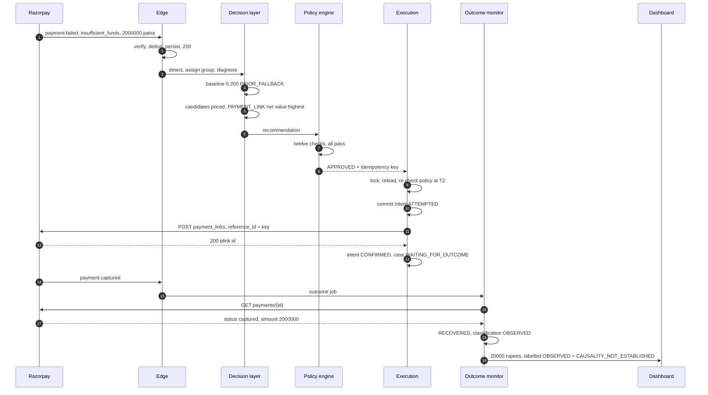

### 4.2 A ₹450 failure where Revora deliberately does nothing

Same pipeline, different answer. A ₹450 payment fails with `payment_timed_out`.

Steps 1 through 4 are identical in shape. Detection passes because ₹450 is above the minimum detection
amount. The mapping table sends `payment_timed_out` to `ABANDONMENT` — one of the two flagged judgement
calls in the table.

**Baseline.** Suppose this segment's prior puts natural recovery at 0.850, which is at or above the
high-baseline threshold of 0.80. Recorded as `PRIOR_FALLBACK` and `UNVALIDATED_BASELINE`.

**Candidates.** `PAYMENT_LINK` at, say, 0.880. That is an incremental probability of 0.030.

**The arithmetic.** Expected incremental revenue is ₹450 × 0.030 = ₹13.50, which rounds to 1350 minor
units. The minimum net value threshold is 5000 minor units — a placeholder, but the configured one. So
`PAYMENT_LINK` does not clear the threshold. It also fails the cost-ratio test, since the link and
message costs comfortably exceed 30% of ₹13.50. Both exclusions are recorded.

**Selection.** Nothing clears both thresholds, and the baseline is above the high-baseline threshold, so
`DO_NOTHING` is selected with reason `HIGH_BASELINE_NO_INTERVENTION`. This is the exact case Property 17
protects.

**Policy still runs.** This is easy to miss. A selection of `DO_NOTHING` still gets a full policy
evaluation and a full audit record with all twelve check outcomes. No provider request is issued and no
message is sent, but the decision is recorded with the same rigour as an approved one.

**What happens next.** The case waits. When the window elapses, the lifecycle sweeper transitions it to
`EXPIRED` with reason `RECOVERY_WINDOW_ELAPSED` and records ₹450 in unresolved revenue — unless the
customer pays first, in which case an authoritative read confirms it and the case becomes `RECOVERED`
with classification `NATURAL`, because zero Revora actions were confirmed.

**Rows written for the do-nothing path:** the same `recovery_case`, `diagnosis`, `baseline_estimate`,
`candidate_estimate`, `recommendation` and `recommendation_candidate` rows as the acting path, plus one
`policy_decision` with twelve check results and a full audit trail. Zero `execution_intent` rows. Zero
provider calls.

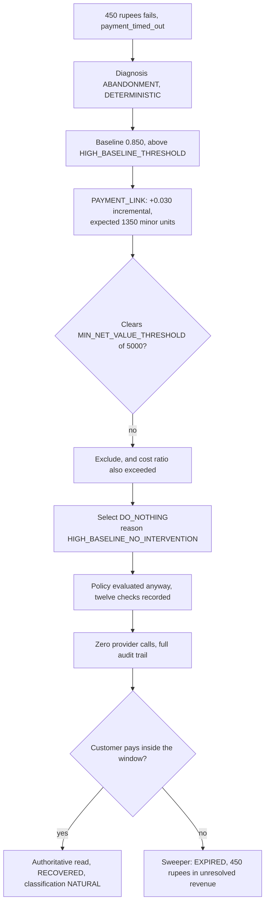

The dashboard shows this case with its selection reason and the three threshold values it was compared
against. That is required behaviour: a merchant who cannot see why Revora did nothing will assume it is
broken.

---

## 5. The Three Kinds of "Recovered" — And Why It Matters

If you read only one section, read this one. It is the product's central claim.

**Natural recovery.** The money arrived and Revora did nothing. Zero confirmed actions on the case. This
happens a lot — customers retry, cards get topped up, banks recover from outages. Licensed statement:
"this money arrived without us."

**Observed recovery.** Revora acted and the money arrived. Licensed statement: "we acted and the money
arrived." **Not** "we caused it." Correlation, not causation. Every presentation of this figure carries
the label `CAUSALITY_NOT_ESTABLISHED` unless an experiment says otherwise.

**Attributed recovery.** A recovery increment supported by a controlled comparison. It requires all of:
a completed experiment, at least the computed required sample size per arm, none of the labels
`UNDERPOWERED`, `INVALIDATED` or `SYNTHETIC`, no contamination, and a lift interval on the primary
metric lying **entirely above zero**. Licensed statement: "we caused this increment, within the stated
interval."

### Why conflating them would be dishonest

Suppose 100 failed payments come in and 30 recover. Revora acted on 60 of them, and 25 of the 30
recoveries were in that group. A vendor who wants a good slide says "Revora recovered 25 payments."

But some of those 25 would have recovered anyway. Look at the other 40 cases where Revora did nothing:
5 recovered on their own, a 12.5% natural rate. Apply that rate to the 60 acted-on cases and roughly 7
or 8 of the 25 would probably have arrived without any intervention. So the honest claim is somewhere
around 17, not 25 — and that is a rough estimate from a small, uncontrolled comparison, not a
measurement.

Now make it worse. The 60 cases Revora acted on were not chosen at random; they were chosen *because*
the optimizer thought intervention would help. If the priors driving that choice correlate with the
customer's own likelihood of retrying, the comparison is biased in a direction you cannot sign. The gap
between 25 and 17 could be larger or smaller and there is no way to tell from those numbers.

This is why the control group exists, and why assignment is random rather than chosen. It is the only
mechanism that removes the selection bias.

### Why the incremental number is blank instead of zero

`incremental_recovered_revenue` reports `NOT_ESTABLISHED` with **no numeric value** when no supporting
experiment exists. Not 0. Not a dash. The two statements are different:

- **`NOT_ESTABLISHED`** means "we have not measured this."
- **₹0** means "we measured this and it was nothing."

Showing zero would be a false measurement claim. Showing a blank invites the reader to ask why, which is
the correct reaction.

```mermaid
flowchart TD
    A["A case recovered"] --> B{"Any Revora action confirmed?"}
    B -->|no| N["NATURAL<br/>'arrived without us'"]
    B -->|yes| O["OBSERVED<br/>'we acted and it arrived'<br/>+ CAUSALITY_NOT_ESTABLISHED"]
    O --> C{"Completed experiment,<br/>adequately powered,<br/>not invalidated or synthetic,<br/>lift interval entirely above zero?"}
    C -->|no| O2["Stays OBSERVED.<br/>incremental_recovered_revenue = NOT_ESTABLISHED"]
    C -->|yes| AT["ATTRIBUTED<br/>'we caused this increment,<br/>within the interval'"]
```

The design is explicit that this is the single most important measurement decision in the system, and
also the one that costs the most in demo appeal. A dashboard that says `NOT_ESTABLISHED` where a
competitor says "₹4.2 lakh recovered" is a harder sell. It is also the only one of the two that is true.

One more thing the specs are firm about: **there is no claim anywhere that Revora recovers any specific
percentage of revenue.** That claim does not exist in the requirements or the design, and it should not
appear in a pitch, a README, or a dashboard.

---

## 6. Bottlenecks and What To Do

The scan table first. Detailed explanations follow for the ones that need them.

| Symptom you notice | What is probably happening | What to check | What to do |
| --- | --- | --- | --- |
| No new cases appearing at all | The webhook was disabled after 24 hours of failed deliveries | Razorpay dashboard webhook status; time since the last stored `webhook_event`; recent 5xx/401 rate on the intake route | Re-enable the webhook in the Razorpay dashboard, then run the detection-gap backfill over the outage window |
| Cases piling up in `UNCERTAIN` | The reconciliation sweeper is not running, or the payment-link listing is lagging | Count of `execution_intent` rows in `UNCERTAIN`; whether the reconciliation sweep is being enqueued; `reconciliation_attempts` values | Restart the worker; confirm the scheduler enqueues the sweep; add an alarm on the `UNCERTAIN` count |
| Two payment links or two SMS for one case | An intent record or a unique constraint was bypassed. This should be impossible | Whether `UNIQUE (merchant_id, idempotency_key)` exists; whether any retry wrapper sits on the create call | Stop and investigate as a correctness bug. Do not tune anything |
| Recovery numbers look too good | The baseline is too pessimistic, or the comparison baseline workflow does nothing | Baseline validation status and method; the frozen baseline workflow definition | Do not celebrate. Confirm the merchant's real pre-Revora behaviour before quoting any lift |
| Everything says `UNCALIBRATED` or `UNVALIDATED_BASELINE` | Expected. No confirmed no-intervention observations exist yet | Count of `memory_observation` rows with `NO_INTERVENTION_CONFIRMED` per segment | Nothing. It clears as resolved control cases accumulate |
| The lift interval always contains zero | Underpowered. Not enough cases per arm | Required sample size recorded on the experiment vs actual per-arm counts | Nothing technical. Either accept `CAUSALITY_NOT_ESTABLISHED` or run far longer |
| Slow webhook acknowledgement, duplicate deliveries | Work is on the request path, or the instance is too small for the ack budget | Intake route latency; whether detection runs inline; TLS and queue time | Move work to the job queue; tighten the internal ack budget; the duplicates are harmless because dedup handles them |
| Writes to one case getting slow | Audit sequence allocation serializes per case, or a long transaction holds the case row | Audit record count for that case; long-running transactions in `pg_stat_activity` | Find and shorten the long transaction. Only worry about volume if a case is generating hundreds of audit rows |
| Everything stops when Postgres is down | Deliberate. There is no partial-availability mode | Database health and connection pool | Restore the database. Do not add a buffer or cache to "keep working" |
| Pending job count climbing, sweeps taking longer | The lifecycle sweeper is a full scan of non-terminal cases | Open case count; sweep duration; whether the sweeper index is in use | Batch the sweep by window-end ranges when it starts to hurt |
| Selection behaviour changes after config work | Every cost and threshold is a placeholder | Which bounds changed and their configured version | Expected. Re-run the synthetic scenarios to confirm the null and high-baseline cases still behave |

### 6.1 Detection has gone quiet

**First thing to look at: the webhook status in the Razorpay dashboard.**

Razorpay disables a webhook after 24 hours of sustained delivery failure. The design calls this the
highest-severity failure point in the system, because detection stops completely and silently. Nothing
errors. The dashboard just shows no new cases, which looks indistinguishable from a quiet day.

The chain that gets you here: the database goes down, the intake route correctly returns 503, Razorpay
retries with backoff, the outage lasts long enough, the webhook is disabled. Or a proxy starts rewriting
the request body, every signature fails, every response is 401, and 401 is a delivery failure too.

Fix in order: re-enable the webhook in the Razorpay dashboard, because the backfill does not re-enable
it. Then run the detection-gap backfill over the outage window — it lists provider payments and ingests
any failed payment with no stored event, through the same canonicalization and detection path, so the
dedup index still guarantees one case per payment. Then find out why deliveries were failing.

The staleness alert — "no webhook received for longer than a configured interval" — is what turns this
from a silent failure into a page. The design notes the backfill and the alert are additions to the
requirements and are therefore the parts most likely to be cut under time pressure, and says explicitly
that they should not be.

### 6.2 Cases piling up in the uncertain execution state

**First thing to look at: the count of `execution_intent` rows in state `UNCERTAIN`, and whether the
reconciliation sweep is being enqueued at all.**

`UNCERTAIN` means "we called the provider and we do not know whether the effect exists." While an intent
sits there, Revora issues **no further external call for that case**. That is correct — it is what
prevents duplicate links — but it means a broken reconciliation loop quietly freezes progress. The
design's phrasing: this fails safe but it fails silently, which is why the `UNCERTAIN` count needs to be
an alerting metric rather than just a dashboard number.

Two distinct causes to separate:

*The sweeper is not running.* Check whether the scheduler loop is alive and enqueueing the reconciliation
sweep, and whether the worker process is claiming jobs at all. If the worker is down, every sweep stops,
not just this one.

*The provider listing is lagging.* Reconciliation queries `GET /v1/payment_links?reference_id=<key>`. If
a just-created link is not yet visible in that listing, the read comes back empty. The design handles
this by treating an empty read as failure **only on the final attempt** — earlier empty reads leave the
intent `UNCERTAIN` and retry later. So a lagging listing shows up as intents that resolve eventually,
with `reconciliation_attempts` values above 1. That is the mitigation working, not a bug.

If reconciliation exhausts its attempt bound, the case escalates with `EXECUTION_RESULT_UNVERIFIABLE`
and no further external call is ever issued for it. Those cases need a human. They are visible in the
dashboard's escalated group.

How long the listing actually lags is unverified — see section 8.

### 6.3 Duplicate payment link or duplicate SMS

**First thing to look at: whether `UNIQUE (merchant_id, idempotency_key)` still exists on
`execution_intent`.**

This should be impossible. If you see it, one of three things happened, and none of them is a tuning
problem:

1. The unique constraint was dropped or never created — check the migration history.
2. A retry wrapper was attached to something that can produce an external effect. The design's rule is
   absolute: retries live only where the effect is known not to have occurred. An `AmbiguousExternalError`
   is a separate error type from a `TransientInfraError` specifically so a retry decorator cannot be
   attached to both.
3. Something treated an `UNCERTAIN` intent as a reason to try again instead of a reason to reconcile.

There is also a subtler route to a duplicate *message* that is not a duplicate *link*:
`reminder_enable` on the payment link. Razorpay's own reminders send customer-visible messages that
Revora's message cap does not count. The design sets it to `false` and flags it as a one-line setting
with a real correctness consequence — exactly the kind of thing someone turns on later without noticing.

Stop and investigate. Do not adjust cooldowns or caps to compensate; that hides the bug.

### 6.4 Recovery numbers look too good

**First thing to look at: the frozen baseline workflow definition on the active experiment.**

Two independent ways to inflate a recovery figure, and the second is the one the design calls the most
important open question in the project.

*A pessimistic baseline.* If the baseline probability is too low, every intervention shows a large
incremental gain. At cold start the baseline is a prior with a very wide interval — it is not a
measurement. Check whether the baselines carry `PRIOR_FALLBACK` and `UNVALIDATED_BASELINE`, and whether
the calibration report has any band that is not `CALIBRATION_UNVERIFIED`. If nothing is validated, the
incremental figures are arithmetic on guesses, correctly computed and not yet meaningful.

*A baseline workflow that does nothing.* The incremental claim is measured against the baseline
workflow, and the default definition is "no automated recovery action; observe the case to its terminal
state." That is the most favourable possible comparison for Revora. A merchant who already sends a
reminder email has a baseline that recovers something, and against *that* baseline the measured lift
shrinks and may vanish entirely.

The design states this as the single most consequential assumption in the whole system, and the one item
to act on if only one is acted on. Every other correctness concern is engineering that can be verified.
This one is a judgement call, it is currently unmade, and it determines whether the central number means
anything.

So the action is not technical. Find out what the merchant actually did before Revora, define the
baseline workflow to match it, and freeze that definition. Until then, treat any lift figure as
provisional.

There is a third, cheaper inflation to rule out: refunds are not netted in the MVP. Recovery figures are
gross of refunds and labelled `RECOVERY_GROSS_OF_REFUNDS`. The refunded amount is captured on every
authoritative read, so a restatement is possible later, but a case that recovered and was then refunded
still counts as recovered today.

### 6.5 Everything is marked uncalibrated or unvalidated

**First thing to look at: the count of `memory_observation` rows carrying
`NO_INTERVENTION_CONFIRMED`, grouped by segment.**

This is the expected state early on, not a fault. Two labels do most of the marking:

`UNVALIDATED_BASELINE` appears while no resolved control case exists for a segment. There is nothing to
check the estimate against. It clears when control-arm cases in that segment reach a terminal state.

`UNCALIBRATED` appears on candidate estimates when memory holds no observation of that action for the
segment. It clears as observations accumulate — for actions the optimizer actually picks.

That last clause is a real trap the design names: **action-selection skew.** Actions the optimizer never
picks never accumulate observations, so their estimates never improve, so they keep not being picked.
The zero-observation report per training set makes it visible. Fixing it properly needs deliberate
exploration — occasionally taking an action believed sub-optimal — which is deferred and would need its
own safety review.

Two structural reasons the calibration wait is long. Only the control arm produces usable baseline
labels, and at 1:1 allocation that is half of an already small volume. And a calibration band needs a
minimum observation count before it carries a validated status at all.

There is nothing to do here except let data accumulate. What you must not do is remove the labels to
make the dashboard look cleaner. The labels are the honest part.

### 6.6 The lift interval always contains zero

**First thing to look at: the required sample size recorded on the experiment, against the actual
per-arm case counts.**

An interval containing zero means "we cannot distinguish this from no effect." Almost always that is a
sample size problem, not a broken experiment.

The design's arithmetic makes the scale concrete. At a 20% baseline, 0.05 significance and 0.80 power,
detecting a 5-percentage-point lift needs roughly **1,000 cases per arm**. Detecting a 10-point lift
needs roughly **270**. So the "500 per arm" figure from the project brief is fine for a large effect and
useless for a small one. That is exactly why the required sample size is computed at experiment
definition time and reported, and why `UNDERPOWERED` exists as a label.

A demo has zero real cases. So a demo will always report `CAUSALITY_NOT_ESTABLISHED` on real data, and
the synthetic harness is the only evidence available — and synthetic evidence validates the measurement
machinery only, never an effect size.

Do not respond by lowering the confidence level, widening the minimum detectable effect after the fact,
or reading a secondary metric as if it were the primary one. Secondary metrics are labelled
`EXPLORATORY` for this reason. The design also notes an honest hazard: it reports six per-arm figures
and four comparison figures, and a reader who scans ten numbers looking for the significant one has
performed multiple comparisons whether or not the code did.

### 6.7 Slow webhook acknowledgement and duplicate deliveries

**First thing to look at: whether any detection or decision work is happening on the intake request
path.**

Razorpay marks a delivery as timed out and resends the event if you do not respond within five seconds.
Revora's internal budget is tighter than that — the design recommends 1500 ms rather than 3000 ms,
because 3 seconds leaves little margin for TLS, queueing and network on a small instance.

The intake route is allowed to do exactly four things: verify the signature over raw bytes, deduplicate,
persist the event and the detection job in one transaction, and respond. Anything else belongs in a job.

The good news is that missing the budget is survivable rather than dangerous. A duplicate delivery hits
the unique constraint, gets a `DUPLICATE_EVENT_DISCARDED` audit row and a 200, and produces zero side
effects. It is noise, not corruption. But sustained failure is a different story — that is the path to a
disabled webhook in 6.1.

### 6.8 The audit sequence or the case row as a contention point

**First thing to look at: long-running transactions holding the case row, via `pg_stat_activity`.**

Per-case audit sequence numbers are allocated by incrementing a counter on the case row inside the same
transaction as the insert. That is what makes them gap-free under concurrency, and the cost is that
audit writes for one case serialize.

At design volume this is free — the writers already serialize on the case row for state reasons, and a
case generates single-digit audit records over its whole life. Two things would change that: a case
generating hundreds of audit rows, or a long-running transaction sitting on the case row and blocking
everyone behind it.

The second is far more likely and is the thing to look for first. The design's guard is a per-job
statement timeout. If you find a long transaction, shorten it rather than trying to make the sequence
allocation cleverer — the alternatives (a Postgres sequence, or `max(seq)+1`) both break the gap-free
guarantee, one by design and one by racing.

### 6.9 Postgres is a single point of failure, and that is deliberate

**First thing to look at: nothing. Restore the database.**

There is no read replica and no partial-availability mode. When Postgres is down, Revora stops. The
degradation ladder in the design is explicit: LLM down, everything works except AI-assisted diagnosis
and drafted copy. Memory down, everything works with `UNCALIBRATED` estimates. Razorpay's outbound API
down, execution holds and outcome verification degrades to a conflict hold. Worker down, ingestion keeps
persisting and decision work resumes later. Postgres down — nothing.

That last row is a design position, not an oversight. Every alternative reintroduces the possibility of
acting on state you cannot verify. A queue that buffers actions during a database outage will replay
them against state that has moved. A cache that serves case state will serve a stale attempt counter,
and a stale attempt counter is how you exceed the attempt cap and message someone twice.

The correct behaviour during a database outage is to stop. Restore, and let the restart sequence do its
job: promote stale `ATTEMPTED` intents to `UNCERTAIN`, reload every non-terminal case, re-evaluate
windows and cooldowns and counters from stored rows, expire whatever elapsed during the outage, and
**discard withheld actions whose bounds no longer permit execution.** That last step matters more than
it looks. A queue of actions that were correct an hour ago may now violate the cooldown or fall outside
the window. Executing them because they were approved before the outage would break two correctness
properties.

### 6.10 The job queue growing and the sweeper doing full scans

**First thing to look at: the pending job count over time, and the open (non-terminal) case count.**

Two different growth curves.

*Pending jobs climbing* usually means the worker is not keeping up or is not running. Check that the
worker process is alive and claiming with `FOR UPDATE SKIP LOCKED`, and look for poison jobs cycling
through retries. Correctness does not depend on jobs succeeding — every timing rule is also enforced by
a sweeper reading persisted timestamps — so a backlog delays decisions rather than breaking bounds. But
delayed decisions eat into recovery windows.

*Sweeps taking longer* is the structural one. The lifecycle sweeper scans non-terminal cases. It is
indexed on `(merchant_id, state, window_end_at)` and small at MVP scale, but it grows linearly with open
cases. The design's fix, when it becomes necessary, is to batch by window-end ranges rather than
scanning the whole open set each pass.

The scale limits are documented honestly and none of them is urgent: the Postgres job queue starts to
strain in the thousands of jobs per second; the sweeper at hundreds of thousands of open cases;
on-the-fly metric aggregation at millions of cases. One caution if the queue ever moves to a broker —
the transactional-enqueue guarantee has to be preserved with an outbox table, not abandoned, or you have
reintroduced exactly the dual-write problem the current design exists to avoid.

### 6.11 Costs and thresholds are all placeholders

**First thing to look at: the configured bounds and their version, then the synthetic scenario results
after any change.**

Every cost figure and every threshold in the bounds table is a placeholder chosen to make the
requirements testable. Specifically called out in the design's weak-assumptions table:

- `MIN_NET_VALUE_THRESHOLD` of 5000 minor units — invented.
- `MAX_COST_TO_VALUE_RATIO` of 0.30 — invented.
- `HIGH_BASELINE_THRESHOLD` of 0.80 — invented, and it directly controls how often Revora does nothing.
- `action_cost` for a payment link — Razorpay's real per-link and per-SMS cost to the merchant is
  unknown.
- `customer_cost` — the design's own words: a tuning knob wearing a currency label. Assigning rupees to
  customer annoyance is a modelling fiction.
- `risk_cost` — same.

The pattern is worth stating: **the arithmetic is sound and every input to it is a guess.** When real
cost figures land, the arithmetic will not change but the selections will. An action that was excluded
for exceeding the cost ratio may become eligible, and vice versa.

Two habits make that safe. All bounds are database-backed configuration rows with a version identifier,
not environment variables, so a change is recorded with an approving user rather than shipped in a
redeploy. And after any bounds change, re-run the four mandatory synthetic scenarios — particularly the
null scenario and the high-baseline scenario — to confirm that Revora still refuses to manufacture a
lift and still leaves the high-baseline customer alone.

---

## 7. What Is Deliberately Not Built Yet

### Deferred — worth building later

| Item | When it becomes worth building |
| --- | --- |
| Fitted logistic regression with isotonic calibration | When a segment has enough confirmed no-intervention observations from the control arm to fit on |
| Bootstrap uncertainty intervals on fitted models | When sampling error, rather than intervention bias, is the dominant uncertainty |
| Automated model retraining | Only after human promotion is proven to work; requirements exclude retraining without a recorded promotion |
| The three cross-period metric findings | When two comparable reporting periods exist. A demo has one |
| Metric segmentation by selected action and policy decision | When the case volume makes those slices non-trivial. Risk cause and amount band are enough for now |
| `payment.downtime.*` as a signal for `WAIT` | Genuinely interesting — "the bank is down, wait" is a good use of a null action — but not needed to test the hypothesis |
| Refund reversal restatement | When gross-of-refunds becomes materially misleading. The refunded amount is already captured on every read |
| Shipping audit records to append-only external storage | When tamper-evidence against a privileged insider becomes a real requirement |
| Per-user roles and MFA | When a merchant has separated duties. MVP has one operator persona |
| Deliberate exploration to fix action-selection skew | When action estimates have visibly stopped improving. Needs its own safety review, because exploration means deliberately taking an action believed sub-optimal |
| Read replica, table partitioning, materialized views | When there is actual scale pressure. There is none |
| Voice, multilingual channels, additional communication channels, agent frameworks, Kafka, Kubernetes, microservices, vector databases | Excluded by the requirements. Listed so the exclusion is explicit rather than an oversight |

### Removed — do not add these back

| Item | The one-line reason |
| --- | --- |
| Celery | Reintroduces the dual-write problem the design exists to avoid |
| Redis for locks | Cannot participate in the transaction that inserts the execution intent |
| Redis for idempotency | Idempotency here is a durable, auditable business record with four states, not a TTL cache entry |
| Microservices | Every hard guarantee in the system is a statement about one transaction |
| Supabase as an architectural component | Demoted to "a place to get a Postgres." The backend uses SQLAlchemy, not the Supabase SDK |
| Audit hash chain | Defends only against someone with direct database access, who can also rewrite the chain. Security theatre |
| Internal event bus | Lets subscribers observe state that the transaction later rolls back |
| The official Razorpay SDK on the execution path | It normalizes responses and raises on error, erasing the difference between "definitely did not happen" and "might have happened" |
| An LLM framework or agent abstraction | Three bounded calls; the abstraction encourages exactly the autonomy this design forbids |
| Any AWS service | None is technically justified at this scale. If AWS is required for other reasons, keep the queue and locks in Postgres |

### The transactional argument, in plain words

This is the reasoning behind removing Celery, Redis and the microservice split. It is one idea, not
three.

When Revora advances a case, four things have to happen together:

1. The case state changes.
2. A follow-up job is queued.
3. An execution lock is taken (or released).
4. An idempotency record is written.

All four must succeed or all four must fail. If the state changes but the job is lost, the case stalls.
If the job runs but the state has not committed yet, it acts on state that does not exist. If the lock is
held in Redis and the intent is committed in Postgres, a crash between the two leaves an inconsistency
you have to reason about separately, in the one place that must be airtight.

One database can put all four in a single transaction. `COMMIT` makes all of them real at once, and a
crash or `ROLLBACK` makes none of them real. A separate queue or cache cannot participate in that
transaction — which means you would have to rebuild the guarantee with an outbox table or a saga, and
that is more moving parts protecting a weaker promise.

At tens of cases per hour there is nothing on the other side of the ledger. Revisit the moment throughput
or fan-out complexity gives a broker something real to do, and note that swapping either later touches
only the jobs and execution modules, because enqueue and locking are both repository calls.

---

## 8. Things We Still Do Not Know

These are open. Each one has a specific action that closes it.

**1. How fresh is the payment-link listing right after you create a link?**
Reconciliation asks `GET /v1/payment_links?reference_id=<key>` to find out whether an effect exists. If
a link created milliseconds ago is not yet in that listing, an empty read looks like failure. The
current mitigation — treat an empty read as failure only on the final attempt — is applied
unconditionally, so this is not a live risk. But it determines whether that rule is *sufficient* or
merely *careful*.
*To close it:* create a link and immediately query it by `reference_id` in test mode, around 50
iterations, recording how long until it first appears.

**2. How far behind the webhook is the payment read?**
Revora declares recovery only from `GET /v1/payments/{id}`. If that read lags behind the
`payment.captured` webhook, the read reports something other than captured and Revora treats it as a
conflict, holds the case, and re-reads. Correct behaviour either way. What is unknown is how often the
conflict-hold path fires in normal operation, which is the difference between a rare edge case and
routine noise.
*To close it:* in test mode, complete a payment and call fetch-payment immediately on receiving the
capture webhook, around 50 iterations, recording how often the read lags.

**3. Does Razorpay reject a duplicate `reference_id` on link creation?**
The documentation says `reference_id` must be unique, not that a duplicate is refused. The design
deliberately does **not** depend on rejection — it depends only on the documented ability to query by
`reference_id`, which is the safer dependency. Closing this would only tell us whether a stronger
guarantee is available for free.
*To close it:* create two links with the same `reference_id` in test mode and record the response.

**4. Does any server-side retry or payment-method-update capability exist on this account?**
No documented API was found to retry a failed one-off payment or update its payment method. A failed
payment is terminal at the provider; a new attempt is a new payment the customer initiates. Automatic
retry exists in the Subscriptions product, which is a different object and out of scope. So `RETRY`,
`DELAYED_RETRY` and `PAYMENT_METHOD_UPDATE` are marked `UNAVAILABLE` and excluded from selection while
still appearing in the record. A positive result here would restore two real candidate actions.
*To close it:* inspect which products are enabled on the merchant account, and attempt the operation
against a failed payment id, recording the error.

**5. Every cost figure and every threshold.**
`MIN_NET_VALUE_THRESHOLD`, `MAX_COST_TO_VALUE_RATIO`, `HIGH_BASELINE_THRESHOLD`, the real per-link and
per-SMS cost, and the risk and customer cost terms are all placeholders. `customer_cost` is the weakest
of them — monetizing customer annoyance is a modelling fiction, and the design says so.
*To close it:* real merchant cost data for the action costs. For the thresholds, the calibration report
against control-arm outcomes. `customer_cost` may not be groundable in anything measurable at all, which
is itself worth deciding explicitly rather than leaving implicit.

**6. What the merchant's actual pre-Revora baseline workflow was.**
Not a provider question, and the most consequential open item in the project. The whole incremental
claim is relative to this definition, and it is currently assumed to be "no automated recovery action."
*To close it:* ask the merchant, write the definition down, and freeze it before any incremental claim
is made.

Two more that are outside engineering scope but worth naming: whether Razorpay's own link notification
satisfies the merchant's consent obligations (legal and merchant confirmation), and the permitted
masking disclosure length for contact identifiers, for which no documentary basis was found — 4
characters is a placeholder.

---

## 9. Glossary

**Attributed recovery.** A recovery increment backed by a controlled comparison. Requires a completed,
adequately powered, uncontaminated, non-synthetic experiment whose lift interval lies entirely above
zero. The only class that licenses saying "we caused this."

**Baseline recovery probability.** The estimated chance the payment recovers with no Revora
intervention. The denominator of the whole value argument. At cold start it is a Beta prior with a very
wide interval, not a measurement.

**Baseline workflow.** A frozen, versioned, deterministic definition of what the merchant did before
Revora. The control group runs it. Currently defaulted to "no automated recovery action; observe the case
to its terminal state," which is an assumption and the most consequential one in the design.

**Candidate action.** One member of the allowed action set: `DO_NOTHING`, `WAIT`, `RETRY`,
`DELAYED_RETRY`, `PAYMENT_LINK`, `CUSTOMER_MESSAGE`, `PAYMENT_METHOD_UPDATE`,
`PROMISE_TO_PAY_FOLLOW_UP`, `HUMAN_ESCALATION`. For the MVP only the first two plus `PAYMENT_LINK`,
`CUSTOMER_MESSAGE` and `HUMAN_ESCALATION` are executable; the rest are marked `UNAVAILABLE`.

**Cooldown.** The minimum time that must pass between two outbound actions on one case. Prevents a
customer being messaged twice in an hour. Enforced as policy check 11, which can defer rather than block.

**Correlation id.** One identifier assigned when an event is accepted, then carried into every audit
record produced by processing that event, including work done asynchronously later. Lets you trace one
inbound webhook end to end.

**Execution intent.** A durable row written **before** the provider call, carrying the idempotency key
and one of four states: `ATTEMPTED`, `CONFIRMED`, `FAILED`, `UNCERTAIN`. It, not the lock, is what makes
an external effect happen at most once.

**Idempotency key.** A deterministic identifier derived from case id, action type and attempt ordinal,
so re-running the same attempt produces the same key. Idempotency means doing something twice has the
same effect as doing it once. Revora sets it as the payment link's `reference_id` so the link can be
looked up later.

**Incremental probability.** Intervention recovery probability minus baseline recovery probability. Can
be negative, and negatives are kept rather than clipped, because an action that makes things worse should
show as worse.

**Minor units.** The smallest unit of the currency — paise for rupees. All money in Revora is stored as
integer minor units in `BIGINT` columns, so ₹20,000 is 2,000,000. No floats anywhere in a stored money
figure, so a total always equals the exact sum of its rows.

**Natural recovery.** Recovered with zero confirmed Revora actions. The money arrived on its own.

**Observed recovery.** Recovered after at least one confirmed Revora action. Correlation, not causation.
Carries `CAUSALITY_NOT_ESTABLISHED` until an experiment says otherwise.

**Policy decision.** The verdict from the twelve ordered checks: `APPROVED`, `BLOCKED`, `DEFERRED` or
`ESCALATE`, with one primary reason from the lowest-numbered failing check, plus a recorded outcome for
all twelve. Produced by a pure function that structurally cannot read AI output.

**Recovery case.** The unit of work tracking one at-risk payment from detection to a terminal state.
Fourteen possible states, one legal transition table, one guaranteed ending.

**Recovery window.** The bounded time interval during which Revora may act on a case, 168 hours by
default. Set at case creation and never extended, so it is a fixed wall-clock deadline that does not
depend on any timer surviving.

**Reference id.** Razorpay's field on a payment link, required to be unique and capped at 40 characters.
Revora puts its idempotency key here, because the listing endpoint can be filtered by it — which is how
exactly-once works without a provider idempotency header.

**Treatment and control group.** Treatment cases are decided by Revora and its selected actions execute.
Control cases run the baseline workflow; Revora still computes and records what it *would* have done,
but that recommendation is suppressed and never executes. Assignment is a keyed hash, deterministic, and
persisted before any diagnosis.

**Uncertain state.** An execution intent whose outcome is unknown — the call timed out, returned a 5xx,
or returned something unparseable. While an intent is `UNCERTAIN`, no further external call is issued for
that case until reconciliation resolves it. Fails safe, but fails silently, which is why the count needs
an alarm.

---

*Sources: `.kiro/specs/revora-incremental-revenue-recovery/requirements.md`, `design.md`, `tasks.md`.
Razorpay behaviour described here is limited to what the design document verified against official
documentation. Where those documents mark something as an assumption, a placeholder, or unverified, this
guide says so in the same place.*
