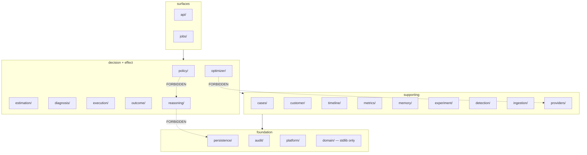

# `revora/` — the backend

A modular monolith — one program split into separate parts, not many services. 166 modules, 23
packages, one Docker image, and three process roles picked at runtime by `REVORA_ROLE`
(`api`, `worker`, `ticker`).

**Deep dive:** [`references/REVORA-SYSTEM-GUIDE.md`](../references/REVORA-SYSTEM-GUIDE.md) §2 *The
Layers — A Map* and §3 *Feature-by-Feature Walkthrough*.

---

## The one rule that shapes everything

Dependencies point **downward only**, and four packages are blocked from reaching things that would
let them cheat. A tool, [`../.importlinter`](../.importlinter), checks this in CI — it is not just a
habit people follow.

The six contracts, all kept:

| Contract | Why it exists |
| --- | --- |
| Policy engine may not reach AI, estimation, optimizer or memory | The component deciding *whether an action is permitted* cannot see a model's opinion |
| Domain imports only the standard library | Money and state types cannot pull in a database or a network dependency |
| Value optimizer may not reach AI output or the provider | Ranking cannot be influenced by a model, and cannot cause an effect |
| Synthetic data is unreachable from the decision and action path | Generated ground truth cannot leak into the code being measured |
| Reasoning adapter sees only platform and domain | The AI layer has no session to open and no row to read |
| Feature modules depend downward only | No cycles |

---

## Package map

| Package | Files | What lives here |
| --- | --- | --- |
| `domain/` | 11 | Pure types: money, case states, transitions, actions, failure taxonomy. **stdlib only** |
| `platform/` | 10 | Config, clock, crypto, secrets, logging, rate limiter, role dispatch |
| `persistence/` | `models/` 13 + `repositories/` 22 | SQLAlchemy models and every DB read/write. Each repository takes `merchant_id` as a required argument |
| `audit/` | 4 | The append-only writer and the event-type vocabulary |
| `ingestion/` | 7 | Verify signature → canonicalize → dedup → enqueue, plus the backfill sweep |
| `detection/` | 3 | Is this failed payment worth opening a case for |
| `diagnosis/` | 2 | Deterministic failure-reason → `Risk_Cause` mapping |
| `estimation/` | 4 | Baseline do-nothing probability, per-candidate pricing |
| `optimizer/` | 4 | Expected-value ranking across the candidate actions |
| `policy/` | 4 | The twelve checks, as a **pure function** — no DB, no network |
| `execution/` | 9 | The exactly-once engine and its reconciliation sweep |
| `outcome/` | 3 | Authoritative provider reads. **The only place a recovery may be declared** |
| `providers/` | 4 | The Razorpay client and response classification |
| `cases/` | 9 | The state machine, lifecycle sweeper, review sweeper, retention |
| `customer/` | 7 | Access tokens, the 8-field projection, signals, promises, suppression |
| `timeline/` | 3 | The 9-stage projection over the audit sequence. Owns no table, cannot write |
| `experiment/` | 6 | Holdout assignment and lift analysis |
| `memory/` | 3 | Training observations and model versions |
| `metrics/` | 3 | The reported figures, with their provenance labels |
| `reasoning/` | 4 | The Gemini adapter, its three prompt contracts, its output schemas |
| `synthetic/` | 5 | Scenario generation and the demo loader |
| `jobs/` | 8 | The Postgres-backed queue, worker loop, ticker, pipeline steps |
| `api/` | 9 | Routes, auth, views, SPA mount |

---

## Where to start reading

1. **[`domain/money.py`](domain/money.py)** — integer minor units, and why no `float` exists anywhere near a currency.
2. **[`domain/transitions.py`](domain/transitions.py)** — 14 case states, 63 legal edges, and the termination proof.
3. **[`policy/engine.py`](policy/engine.py)** — the twelve checks. A pure function — it only reads its inputs and returns a value, with no database or network — so it can be property-tested exhaustively.
4. **[`jobs/pipeline.py`](jobs/pipeline.py)** — the one layer allowed to see both rows and pure functions. Every pipeline step lives here.
5. **[`outcome/monitor.py`](outcome/monitor.py)** — where a recovery is declared, and only from a provider read.

## Two things that surprise people

- **`jobs/pipeline.py` is the big module on purpose.** Pure components take their inputs as
  arguments, so something has to load the rows and call them. Keeping all of that in one place is
  what lets `policy/` and `optimizer/` stay pure enough to test exhaustively.
- **Each pipeline step adds the next step to the queue inside its own transaction.** That is why the
  queue is a Postgres table and not a message broker. With a broker, adding the next step after the
  commit can lose it, and adding it before the commit can fire it against state that never got saved.

## Related

- [Root README](../README.md) — the product argument and the three structural rules
- [`../tests/README.md`](../tests/README.md) — how each guarantee here is proven
- [`../alembic/README.md`](../alembic/README.md) — the schema these models map to
- [Specs](../.kiro/specs/) — requirements and design, with `[ASSUMPTION]` tags intact
