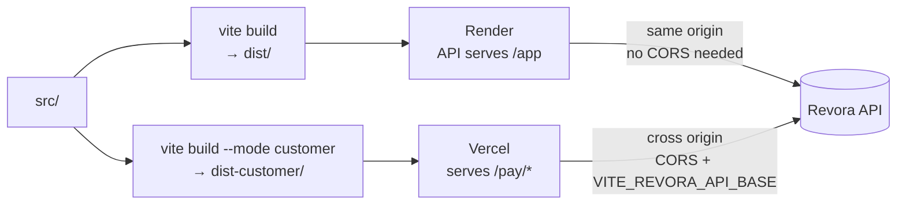

# `web/` — two frontends, one build

Plain **React + Vite, JavaScript with JSDoc**. No TypeScript anywhere — see *Why lint and not types*
below, because that choice is load-bearing rather than lazy.

Two separate bundles are produced from one project:

| Bundle | Output | Served by | Who sees it |
| --- | --- | --- | --- |
| **Dashboard** | `dist/` | the API process, at `/app` | the merchant's operator |
| **Customer page** | `dist-customer/` | Vercel, at `/pay/*` | the person being asked to pay |

**Live:** [dashboard](https://revora-api-h3aj.onrender.com/app) ·
[customer page](https://razorpay-builathon-challange.vercel.app/)

---

## Why two bundles and not one route

A `/pay/:token` route inside the dashboard bundle would ship an unauthenticated stranger the entire
administrative surface as readable source. Nothing in it is secret, but **it is a map**.

The customer page also has to open from an SMS on a cold mobile connection, so it carries neither the
router nor the query client. It uses **no router at all** and shares exactly **one** module with the
dashboard — the `<Money>` component — so it cannot compute a figure that disagrees with the server.



---

## Layout

| Path | Files | What it holds |
| --- | --- | --- |
| `src/routes/` | 11 | Dashboard pages: Performance, Cases, Case detail, Unresolved, Experiments, Consent, Sign-in |
| `src/components/` | 5 | `Money`, `Rate`, `Enum`, `AbsentValue`, `Label`, `Timeline` — **every figure goes through one of these** |
| `src/api/` | 3 | Hand-written DTOs (`types.js`), the fetch client, the TanStack Query hooks |
| `src/customer/` | 7 | The customer response page — its own entry, its own API module |
| `src/test/` | 2 | The ESLint-rule test and shared setup |
| `index.html` / `index-customer.html` | — | The two Vite entries |
| `vercel.json` | — | Customer-page rewrites and security headers |

## Commands

```bash
npm ci
npm run dev              # :5173 — dashboard at /app/, customer page at /pay/<slug>/<token>
npm run lint             # the money rules
npm run test             # 81 tests across 10 files
npm run build            # both bundles
npm run build:dashboard  # dist/ only        (this is what the Docker image runs)
npm run build:customer   # dist-customer/ only
```

There is **no `typecheck` script**, because there is nothing to typecheck.

---

## Why lint and not types

TypeScript could never have expressed the rule that matters. **Arithmetic operators accept every
number subtype, including a branded one**, so `amount.minor / 100` type-checks perfectly.

So [`eslint.config.js`](eslint.config.js) is the *only* automated guard on money, and it rejects:

- arithmetic on a `.minor` field
- interpolating a `.minor` into text
- `Intl.NumberFormat`, `toLocaleString`, `toFixed`
- `?? 0` and `|| 0` on a figure — which is how the honest version of an absent value gets quietly
  undone, because `?? 0` reads as defensive

Amounts arrive from the server as `{ minor, currency, formatted }` and the client renders
`formatted`. It does **no** currency maths at all: two client-side divisions in two components is how
one screen ends up showing two different totals.

[`src/test/lint-rule.test.js`](src/test/lint-rule.test.js) runs ESLint in-process against the shipped
config and asserts the rule actually fires — because a typo in an ESLint selector does not error, it
matches nothing, and the gate would then enforce precisely nothing while staying green.

---

## The customer page URL

```
https://<frontend-host>/pay/<merchant-slug>/rvc_<26 base32>.<22 base64url>
```

Three path segments. The token is in the **path**, never a query string, so it stays out of
`Referer` headers and analytics — and the page sets `Referrer-Policy: no-referrer` on top of that.

The merchant slug travels too because the API's routes are `/customer/{merchant_slug}/…`, so a page
holding only a token could not address them.

`vercel.json` rewrites `/pay/*` to `/index.html`. The Vite config renames the customer entry's output
from `index-customer.html` to `index.html` for exactly this reason — one rename here removes a
filename-rewrite rule from every deployment target.

**Opening the bare Vercel URL shows a not-found panel. That is correct** — the page is unusable
without a token, and a rejected token and a malformed one render identically on purpose.

## Environment

| Variable | When you need it |
| --- | --- |
| `VITE_REVORA_API_BASE` | The API origin, at **build** time. Empty means same-origin, which is right for the dashboard and for local dev through the Vite proxy. The Vercel deployment must set it, and the API's `REVORA_CUSTOMER_ORIGINS` must list the Vercel origin back |

## Related

- [Root README](../README.md) — the three structural rules, including the money rule
- [`../revora/api/`](../revora/api/) — the routes these bundles call
- [`DEMO-GUIDE.md`](../DEMO-GUIDE.md) — the click-through script for a presentation
