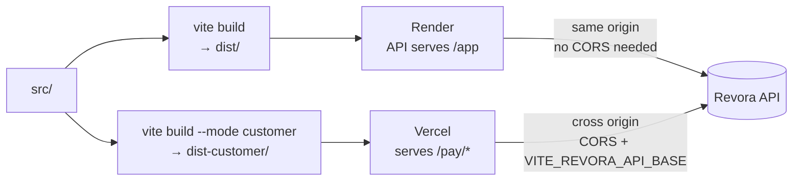

# `web/` — two frontends, one build

Plain **React + Vite, JavaScript with JSDoc**. No TypeScript anywhere. See *Why lint and not types*
below — that choice is deliberate, not lazy.

Two separate bundles are produced from one project:

| Bundle | Output | Served by | Who sees it |
| --- | --- | --- | --- |
| **Dashboard** | `dist/` | the API process, at `/app` | the merchant's operator |
| **Customer page** | `dist-customer/` | Vercel, at `/pay/*` | the person being asked to pay |

**Live:** [dashboard](https://revora-api-h3aj.onrender.com/app) ·
[customer page](https://razorpay-builathon-challange.vercel.app/)

---

## Why two bundles and not one route

Put a `/pay/:token` route inside the dashboard bundle and you hand a stranger who has not signed in
the whole admin interface as readable source code. Nothing in it is secret, but **it is a map**.

The customer page also has to open from an SMS link on a slow mobile connection, so it leaves out
both the router and the query client. It uses **no router at all**, and it shares just **one** module
with the dashboard — the `<Money>` component. That way it cannot show a figure that disagrees with
the server.



---

## Layout

| Path | Files | What it holds |
| --- | --- | --- |
| `src/routes/` | 11 | Dashboard pages: Performance, Cases, Case detail, Unresolved, Experiments, Consent, Sign-in |
| `src/components/` | 5 | `Money`, `Rate`, `Enum`, `AbsentValue`, `Label`, `Timeline` — **every figure goes through one of these** |
| `src/api/` | 3 | Hand-written data types — the DTOs — in `types.js`, the fetch client, the TanStack Query hooks |
| `src/customer/` | 7 | The customer response page — its own entry, its own API module |
| `src/test/` | 2 | The ESLint-rule test and shared setup |
| `index.html` / `index-customer.html` | — | The two Vite entries |
| `vercel.json` | — | Customer-page rewrites and security headers |

## Commands

```bash
npm ci
npm run dev              # :5173 — dashboard at /app/, customer page at /pay/<slug>/<token>
npm run lint             # the money rules
npm run test             # 81 tests across 10 files
npm run build            # both bundles
npm run build:dashboard  # dist/ only        (this is what the Docker image runs)
npm run build:customer   # dist-customer/ only
```

There is **no `typecheck` script**, because there is nothing to typecheck.

---

## Why lint and not types

TypeScript could never state the rule that matters here. **Math operators accept every kind of
number, even a branded one**, so `amount.minor / 100` passes the type check just fine.

So [`eslint.config.js`](eslint.config.js) is the *only* automatic check on money. It rejects:

- any math on a `.minor` field
- putting a `.minor` value straight into text
- `Intl.NumberFormat`, `toLocaleString`, `toFixed`
- `?? 0` and `|| 0` on a figure. These quietly turn a genuinely missing value into zero, because
  `?? 0` looks like harmless defensive code

Amounts arrive from the server as `{ minor, currency, formatted }`, and the client shows
`formatted`. It does **no** money math at all. Two separate divisions in two components is exactly how
one screen ends up showing two different totals.

[`src/test/lint-rule.test.js`](src/test/lint-rule.test.js) runs ESLint against the real shipped
config and checks that the rule actually triggers. A typo in an ESLint selector does not raise an
error — it simply matches nothing. Without this test the check would enforce nothing at all while
still passing.

---

## The customer page URL

```
https://<frontend-host>/pay/<merchant-slug>/rvc_<26 base32>.<22 base64url>
```

Three path segments. The token sits in the **path**, never in a query string, so it stays out of
`Referer` headers and analytics. On top of that, the page sets `Referrer-Policy: no-referrer`.

The merchant slug is in the URL too, because the API's routes look like `/customer/{merchant_slug}/…`.
A page that held only a token could not reach them.

`vercel.json` rewrites `/pay/*` to `/index.html`. For this reason the Vite config renames the customer
entry's output from `index-customer.html` to `index.html`. That single rename removes a
filename-rewrite rule from every place the page is deployed.

**Opening the plain Vercel URL shows a not-found panel. That is correct** — the page is useless
without a token. A rejected token and a malformed token look identical on purpose.

## Environment

| Variable | When you need it |
| --- | --- |
| `VITE_REVORA_API_BASE` | The API origin, set at **build** time. Empty means same-origin, which is right for the dashboard and for local dev through the Vite proxy. The Vercel deployment must set it, and the API's `REVORA_CUSTOMER_ORIGINS` must list the Vercel origin in return |

## Related

- [Root README](../README.md) — the three structural rules, including the money rule
- [`../revora/api/`](../revora/api/) — the routes these bundles call
- [`DEMO-GUIDE.md`](../DEMO-GUIDE.md) — the click-through script for a presentation
